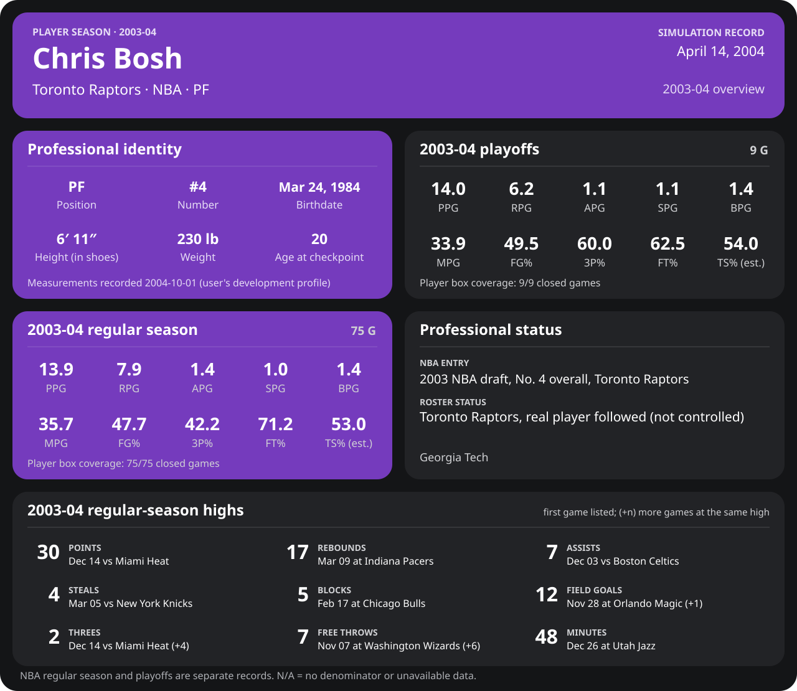

<!-- Generated by scripts/update_player_reports.py from closed results and award records; do not edit. -->

# Chris Bosh | 2003-04 season

Career date: **2005-10-30** · Toronto Raptors · #4 · PF · age 21

[Career](../README.md) · [Development profile (user-supplied)](../Development_Profile_2004-10-01.md) · [League card](../../Dwyane_Wade/Stats_and_Awards/League/Players/boshch01.md)

**Ability model this season:** His real career's rates for the season (the talent-trajectory exception), with the engine's journaled swing.

## Regular season

| Season | Age | Team | GP/GS | MPG | PPG | RPG | APG | SPG | BPG | FG% | 3P% | FT% | TS% (est.) | Team result |
| --- | --- | --- | --- | --- | --- | --- | --- | --- | --- | --- | --- | --- | --- | --- |
| 2003-04 | 19 | Toronto Raptors | 75/75 | 35.7 | 13.9 | 7.9 | 1.4 | 1.0 | 1.4 | 47.7 | 42.2 | 71.2 | 53.0 | 42-40 · lost conference semifinals |

## Playoffs

| Season | Age | Team | GP/GS | MPG | PPG | RPG | APG | SPG | BPG | FG% | 3P% | FT% | TS% (est.) | Team result |
| --- | --- | --- | --- | --- | --- | --- | --- | --- | --- | --- | --- | --- | --- | --- |
| 2003-04 | 19 | Toronto Raptors | 9/9 | 33.9 | 14.0 | 6.2 | 1.1 | 1.1 | 1.4 | 49.5 | 60.0 | 62.5 | 54.0 | 42-40 · lost conference semifinals |

## Season highs (regular season)

| Stat | High | Game |
| --- | --- | --- |
| Points | 30 | 2003-12-14 vs Miami Heat |
| Rebounds | 17 | 2004-03-09 at Indiana Pacers |
| Assists | 7 | 2003-12-03 vs Boston Celtics |
| Steals | 4 | 2004-03-05 vs New York Knicks |
| Blocks | 5 | 2004-02-17 at Chicago Bulls |
| Threes | 2 | 2003-12-14 vs Miami Heat (+4) |
| Free throws | 7 | 2003-11-07 at Washington Wizards (+6) |

## Awards

| Announced | Award |
| --- | --- |
| 2004-04-27 | All-Rookie Team: First Team |

## Milestones this season

| Milestone | Date | Age | Opponent |
| --- | --- | --- | --- |
| NBA regular-season debut | 2003-10-29 | 19 years, 219 days | New Jersey Nets |
| First 20-point game | 2003-11-09 | 19 years, 230 days | Denver Nuggets |
| First double-double | 2003-11-09 | 19 years, 230 days | Denver Nuggets |
| First 30-point game | 2003-12-14 | 19 years, 265 days | Miami Heat |
| 250 career rebounds | 2004-01-09 | 19 years, 291 days | Los Angeles Clippers |
| First 5-block game | 2004-02-17 | 19 years, 330 days | Chicago Bulls |
| First 15-rebound game | 2004-03-09 | 19 years, 351 days | Indiana Pacers |
| 500 career rebounds | 2004-03-23 | 19 years, 365 days | Memphis Grizzlies |
| 100 career blocks | 2004-03-28 | 20 years, 4 days | Memphis Grizzlies |
| 1,000 career points | 2004-04-09 | 20 years, 16 days | Detroit Pistons |
| 100 career playoff points | 2004-05-05 | 20 years, 42 days | New Jersey Nets |
