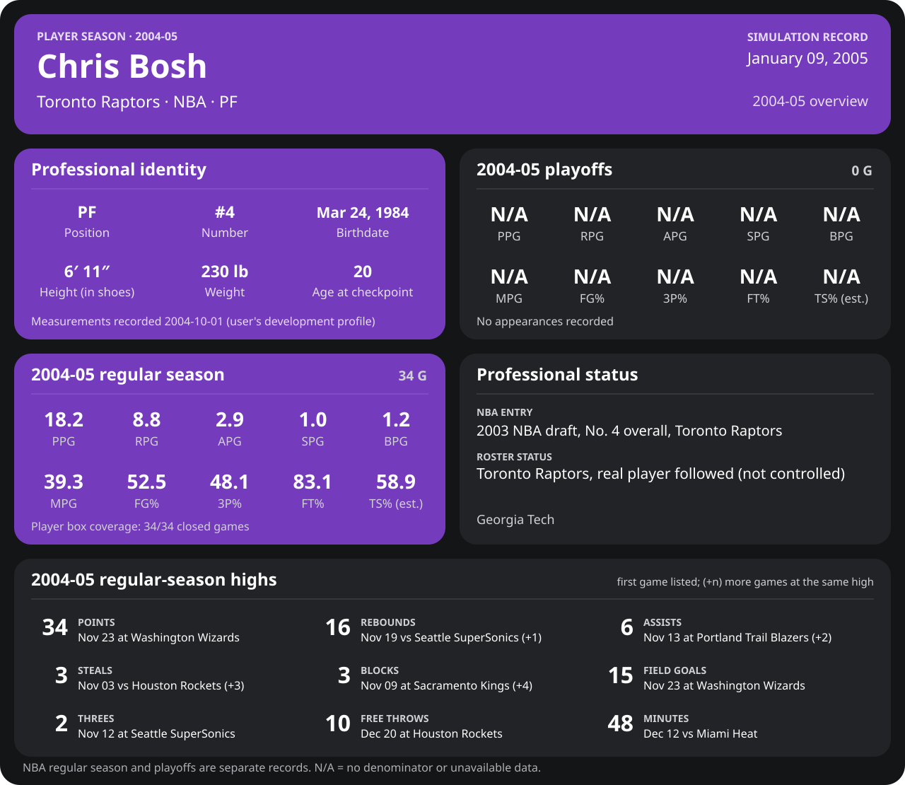

<!-- Generated by scripts/update_player_reports.py from closed results and award records; do not edit. -->

# Chris Bosh | 2004-05 season

Career date: **2005-11-20** · Toronto Raptors · #4 · PF · age 21

[Career](../README.md) · [Development profile (user-supplied)](../Development_Profile_2004-10-01.md) · [League card](../../Dwyane_Wade/Stats_and_Awards/League/Players/boshch01.md)

**Ability model this season:** Alternate history (the user's premise): his own expected profile for 2004-05 ([expected_profile.json](expected_profile.json): previous expectation, his simulated season, the age step and the user's development profile), with the engine's journaled season swing.

## Regular season

| Season | Age | Team | GP/GS | MPG | PPG | RPG | APG | SPG | BPG | FG% | 3P% | FT% | TS% (est.) | Team result |
| --- | --- | --- | --- | --- | --- | --- | --- | --- | --- | --- | --- | --- | --- | --- |
| 2004-05 | 20 | Toronto Raptors | 81/81 | 39.2 | 17.8 | 9.3 | 2.8 | 1.0 | 1.4 | 50.2 | 41.8 | 83.3 | 57.1 | 59-23 · lost finals |

## The user's target line against the closed games

Targets from Development_Profile_2004-10-01.md, Year 2 statistical target profile (ideal line); actual from 81 closed regular-season games.

| Per game | Target | Actual |
| --- | --- | --- |
| Minutes | 36.5 | 39.2 |
| Points | 20.2 | 17.8 |
| Rebounds | 11.1 | 9.3 |
| Assists | 3.5 | 2.8 |
| Steals | 0.9 | 1.0 |
| Blocks | 1.5 | 1.4 |
| FG% | 51.4 | 50.2 |
| 3P% | 41.2 | 41.8 |
| FT% | 90.8 | 83.3 |
| TS% (est.) | 64.0 | 57.1 |

## Playoffs

| Season | Age | Team | GP/GS | MPG | PPG | RPG | APG | SPG | BPG | FG% | 3P% | FT% | TS% (est.) | Team result |
| --- | --- | --- | --- | --- | --- | --- | --- | --- | --- | --- | --- | --- | --- | --- |
| 2004-05 | 20 | Toronto Raptors | 22/22 | 36.0 | 17.0 | 9.7 | 1.9 | 1.0 | 1.6 | 48.3 | 40.0 | 73.5 | 54.3 | 59-23 · lost finals |

## Season highs (regular season)

| Stat | High | Game |
| --- | --- | --- |
| Points | 34 | 2004-11-23 at Washington Wizards |
| Rebounds | 18 | 2005-04-17 vs Boston Celtics |
| Assists | 7 | 2005-01-28 at Charlotte Bobcats (+1) |
| Steals | 4 | 2005-04-06 vs Memphis Grizzlies |
| Blocks | 4 | 2005-02-09 vs Milwaukee Bucks (+3) |
| Threes | 2 | 2004-11-12 at Seattle SuperSonics (+1) |
| Free throws | 11 | 2005-02-11 vs Philadelphia 76ers |

## Awards

| Announced | Award |
| --- | --- |
| 2005-01-10 | East Player of the Week (2005-01-03 to 2005-01-09) |
| 2005-02-08 | All-Star (East, reserve) |

## Milestones this season

| Milestone | Date | Age | Opponent |
| --- | --- | --- | --- |
| 100 career games played | 2004-12-19 | 20 years, 270 days | New Jersey Nets |
| 100 career steals | 2004-12-28 | 20 years, 279 days | Los Angeles Lakers |
| 1,000 career rebounds | 2005-02-02 | 20 years, 315 days | Indiana Pacers |
| 250 career assists | 2005-02-13 | 20 years, 326 days | Los Angeles Clippers |
| 2,000 career points | 2005-02-22 | 20 years, 335 days | New Jersey Nets |
| 500 career free throws made | 2005-04-11 | 21 years, 18 days | Indiana Pacers |
| 10 career playoff games | 2005-04-24 | 21 years, 31 days | Philadelphia 76ers |
| 100 career playoff rebounds | 2005-05-02 | 21 years, 39 days | Philadelphia 76ers |
| 250 career playoff points | 2005-05-06 | 21 years, 43 days | Philadelphia 76ers |
| 25 career playoff games | 2005-06-02 | 21 years, 70 days | Atlanta Hawks |
| 250 career playoff rebounds | 2005-06-12 | 21 years, 80 days | Sacramento Kings |
