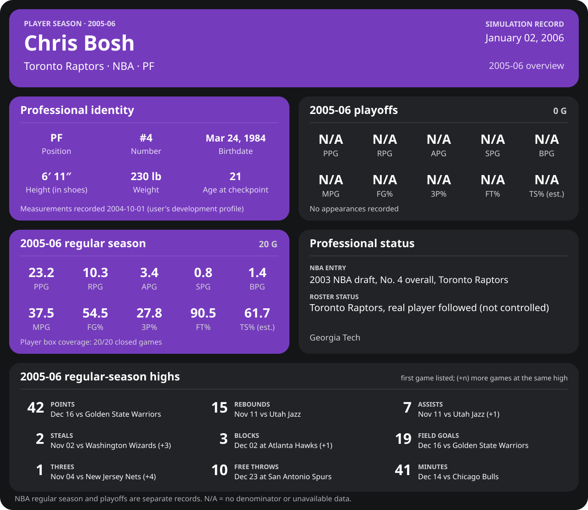

<!-- Generated by scripts/update_player_reports.py from closed results and award records; do not edit. -->

# Chris Bosh | 2005-06 season

Career date: **2005-12-12** · Toronto Raptors · #4 · PF · age 21

[Career](../README.md) · [Development profile (user-supplied)](../Development_Profile_2004-10-01.md) · [League card](../../Dwyane_Wade/Stats_and_Awards/League/Players/boshch01.md)

**Ability model this season:** Alternate history (the user's premise): his own expected profile for 2005-06 ([expected_profile.json](expected_profile.json): previous expectation, his simulated season, the age step and the user's development profile), with the engine's journaled season swing.

## Regular season

| Season | Age | Team | GP/GS | MPG | PPG | RPG | APG | SPG | BPG | FG% | 3P% | FT% | TS% (est.) | Team result |
| --- | --- | --- | --- | --- | --- | --- | --- | --- | --- | --- | --- | --- | --- | --- |
| 2005-06 | 21 | Toronto Raptors | 11/11 | 37.3 | 22.3 | 10.3 | 3.7 | 0.7 | 1.5 | 55.3 | 37.5 | 91.5 | 62.5 | 14-7 |

## The user's target line against the closed games

Targets from Development_Profile_2004-10-01.md, Long-term statistical arc, 2005-06 row (Year 3, primary star), retained by the user's 2005 offseason framework on 2005-06-16; minutes from the profile's Minutes target (36 to 37 MPG, midpoint), since the arc row states none; the row gives no steals, blocks or true shooting; actual from 11 closed regular-season games.

| Per game | Target | Actual |
| --- | --- | --- |
| Minutes | 36.5 | 37.3 |
| Points | 24.5 | 22.3 |
| Rebounds | 11.4 | 10.3 |
| Assists | 4.2 | 3.7 |
| FG% | 52.0 | 55.3 |
| 3P% | 41.7 | 37.5 |
| FT% | 91.3 | 91.5 |

## Playoffs

No playoff games closed.

## Season highs (regular season)

| Stat | High | Game |
| --- | --- | --- |
| Points | 31 | 2005-11-05 at Detroit Pistons |
| Rebounds | 15 | 2005-11-11 vs Utah Jazz |
| Assists | 7 | 2005-11-11 vs Utah Jazz |
| Steals | 2 | 2005-11-02 vs Washington Wizards (+1) |
| Blocks | 3 | 2005-12-02 at Atlanta Hawks (+1) |
| Threes | 1 | 2005-11-04 vs New Jersey Nets (+2) |
| Free throws | 8 | 2005-12-02 at Atlanta Hawks |

## Awards

No recorded awards this season.

## Milestones this season

None this season.
