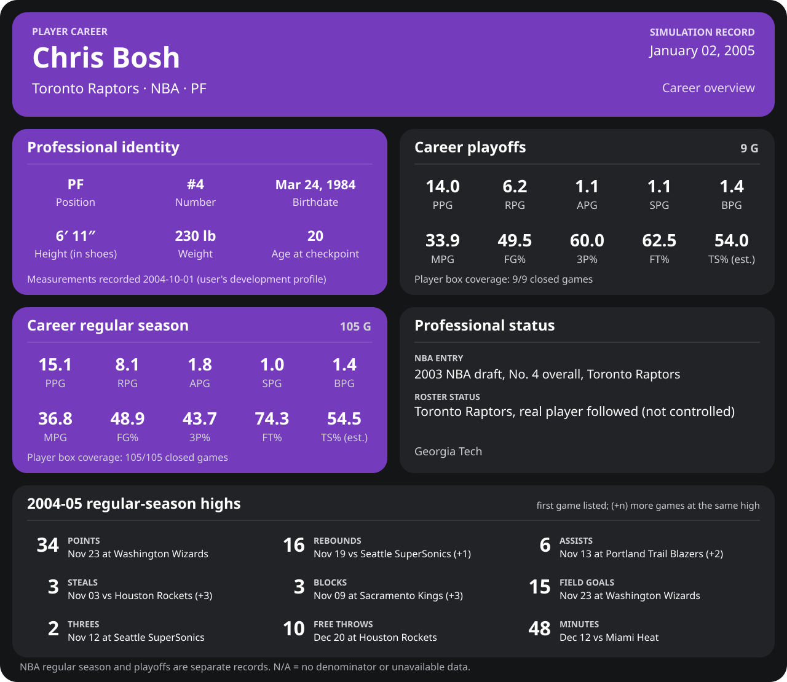

<!-- Generated by scripts/update_player_reports.py from closed results and award records; do not edit. -->

# Chris Bosh | Career

Career date: **2005-04-24** · Toronto Raptors · #4 · PF · age 21

A real player the user follows, not one the user controls: his club decides his moves and the engine plays his games. Every number below comes from closed simulated games and the league's recorded award decisions.

[Development profile (user-supplied)](Development_Profile_2004-10-01.md) · [League card](../Dwyane_Wade/Stats_and_Awards/League/Players/boshch01.md) · [Career milestones](career_milestones.md) · Seasons: [2003-04](2003-04/README.md) · [2004-05](2004-05/README.md)

## Identity

| Field | Value |
| --- | --- |
| Full name | Christopher Wesson Bosh |
| Born | 1984-03-24 |
| Hometown | Hutchins / Dallas, Texas |
| College | Georgia Tech |
| Draft | 2003 NBA draft, No. 4 overall, Toronto Raptors |
| Position | PF |
| Club on the career date | Toronto Raptors |
| Number | 4 |

## Regular season by season

| Season | Age | Team | GP/GS | MPG | PPG | RPG | APG | SPG | BPG | FG% | 3P% | FT% | TS% (est.) | Team result |
| --- | --- | --- | --- | --- | --- | --- | --- | --- | --- | --- | --- | --- | --- | --- |
| [2003-04](2003-04/README.md) | 19 | Toronto Raptors | 75/75 | 35.7 | 13.9 | 7.9 | 1.4 | 1.0 | 1.4 | 47.7 | 42.2 | 71.2 | 53.0 | 42-40 · lost conference semifinals |
| [2004-05](2004-05/README.md) | 20 | Toronto Raptors | 81/81 | 39.2 | 17.8 | 9.3 | 2.8 | 1.0 | 1.4 | 50.2 | 41.8 | 83.3 | 57.1 | 59-23 |

## Playoffs

| Season | Age | Team | GP/GS | MPG | PPG | RPG | APG | SPG | BPG | FG% | 3P% | FT% | TS% (est.) | Team result |
| --- | --- | --- | --- | --- | --- | --- | --- | --- | --- | --- | --- | --- | --- | --- |
| 2003-04 | 19 | Toronto Raptors | 9/9 | 33.9 | 14.0 | 6.2 | 1.1 | 1.1 | 1.4 | 49.5 | 60.0 | 62.5 | 54.0 | 42-40 · lost conference semifinals |
| 2004-05 | 20 | Toronto Raptors | 1/1 | 37.0 | 22.0 | 12.0 | 1.0 | 2.0 | 1.0 | 71.4 | N/A | 50.0 | 69.8 | 59-23 |

## Awards

| Season | Announced | Award |
| --- | --- | --- |
| 2003-04 | 2004-04-27 | All-Rookie Team: First Team |
| 2004-05 | 2005-01-10 | East Player of the Week (2005-01-03 to 2005-01-09) |
| 2004-05 | 2005-02-08 | All-Star (East, reserve) |

## Career firsts

| Milestone | Date | Age | Season | Opponent | Line |
| --- | --- | --- | --- | --- | --- |
| NBA regular-season debut | 2003-10-29 | 19 years, 219 days | 2003-04 | New Jersey Nets | 7 pts, 6 reb, 1 ast |
| First 20-point game | 2003-11-09 | 19 years, 230 days | 2003-04 | Denver Nuggets | 21 pts, 11 reb, 2 ast |
| First double-double | 2003-11-09 | 19 years, 230 days | 2003-04 | Denver Nuggets | 21 pts, 11 reb, 2 ast |
| First 30-point game | 2003-12-14 | 19 years, 265 days | 2003-04 | Miami Heat | 30 pts, 6 reb, 1 ast |
| First 5-block game | 2004-02-17 | 19 years, 330 days | 2003-04 | Chicago Bulls | 17 pts, 12 reb, 2 ast |
| First 15-rebound game | 2004-03-09 | 19 years, 351 days | 2003-04 | Indiana Pacers | 19 pts, 17 reb, 1 ast |

## Milestones reached

| Milestone | Date | Age | Season | Game no. | Opponent |
| --- | --- | --- | --- | --- | --- |
| 250 career rebounds | 2004-01-09 | 19 years, 291 days | 2003-04 | 32 | Los Angeles Clippers |
| 500 career rebounds | 2004-03-23 | 19 years, 365 days | 2003-04 | 64 | Memphis Grizzlies |
| 100 career blocks | 2004-03-28 | 20 years, 4 days | 2003-04 | 67 | Memphis Grizzlies |
| 1,000 career points | 2004-04-09 | 20 years, 16 days | 2003-04 | 72 | Detroit Pistons |
| 100 career games played | 2004-12-19 | 20 years, 270 days | 2004-05 | 100 | New Jersey Nets |
| 100 career steals | 2004-12-28 | 20 years, 279 days | 2004-05 | 104 | Los Angeles Lakers |
| 1,000 career rebounds | 2005-02-02 | 20 years, 315 days | 2004-05 | 120 | Indiana Pacers |
| 250 career assists | 2005-02-13 | 20 years, 326 days | 2004-05 | 126 | Los Angeles Clippers |
| 2,000 career points | 2005-02-22 | 20 years, 335 days | 2004-05 | 128 | New Jersey Nets |
| 500 career free throws made | 2005-04-11 | 21 years, 18 days | 2004-05 | 151 | Indiana Pacers |
| 100 career playoff points | 2004-05-05 | 20 years, 42 days | 2003-04 | 7 | New Jersey Nets |
| 10 career playoff games | 2005-04-24 | 21 years, 31 days | 2004-05 | 10 | Philadelphia 76ers |

## Next milestones

| Milestone | Current | Still needed |
| --- | --- | --- |
| 3,000 career points | 2,490 | 510 |
| 1,500 career rebounds | 1,350 | 150 |
| 500 career assists | 328 | 172 |
| 250 career steals | 156 | 94 |
| 250 career blocks | 224 | 26 |
| 100 career three-pointers made | 42 | 58 |
| 1,000 career free throws made | 528 | 472 |
| 200 career games played | 156 | 44 |
