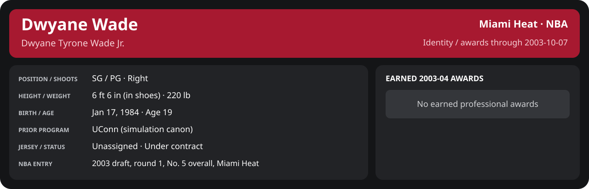

# Preseason Game 1

Player identity and statistics are generated here by `python scripts/update_player_reports.py`.
Decisions remain in the owning phase/week note. A scheduled game has no statistical result.

<!-- game-result:start -->
## Result

**Philadelphia 76ers 90 at Miami Heat 104** · Miami Heat W 104-90 vs Philadelphia 76ers · home (Miami Heat) · 2003-10-07

Event `2003-10-07-philadelphia-76ers-at-miami-heat` · Railway engine (runtime/private_service.py) · result file [`Game_1.result.json`](Game_1.result.json) (the engine's answer as served; the note is the canonical record).

Preseason result: evidence for the preseason record and the camp decisions only; it does not count in regular-season statistics.

### Box score

```text
Philadelphia 76ers 90 at Miami Heat 104
2003-10-07  2003-04 preseason  event 2003-10-07-philadelphia-76ers-at-miami-heat
Kernel 2003.5, calibrated on 2002-03 (imported_source)

Period      1    2    3    4     T
Philadel   34   14   26   16    90
Miami He   29   28   23   24   104

Philadelphia 76ers
                           MIN  PTS   FG      3P     FT    OR  DR AST STL BLK  TO  PF
Allen Iverson             41.9   12   4-12   1-5    3-6     2   4  10   4   0   4   4
Kenny Thomas              38.7   17   7-19   0-2    3-4     6   7   1   1   0   3   3
Eric Snow                 37.8   16   8-13   0-0    0-1     0   5   4   0   0   1   4
Glenn Robinson            34.0   23   7-13   3-3    6-7     0   6   2   0   0   2   3
Aaron McKie               29.5    9   3-4    1-1    2-2     1   2   1   0   0   4   2
Samuel Dalembert          25.7    8   4-10   0-1    0-0     2   2   1   1   0   0   2
John Salmons              21.3    3   1-3    1-1    0-0     0   3   2   1   0   1   1
Kyle Korver               11.1    2   0-5    0-2    2-2     0   1   0   0   1   1   1
TEAM                     240.0   90  34-79   6-15  16-22   11  30  21   7   1  16  20

Miami Heat
                           MIN  PTS   FG      3P     FT    OR  DR AST STL BLK  TO  PF
Mike James                31.3   19   5-9    1-1    8-8     0   3   4   2   0   3   3
Eddie Jones               31.3   13   4-13   1-6    4-4     0   3   1   2   0   1   1
Caron Butler              30.3   10   2-7    0-1    6-6     1   2   1   4   0   3   4
LaPhonso Ellis            29.7   15   7-12   1-3    0-0     1   5   5   0   0   0   2
Brian Grant               29.7   16   7-11   0-0    2-3     1   6   2   0   1   1   3
Jumaine Jones             18.2    4   2-5    0-1    0-0     2   1   2   0   1   1   0
Stephen Jackson           16.3   12   6-11   0-2    0-0     2   5   0   0   1   2   1
Keon Clark                14.8    4   1-4    0-1    2-2     0   0   1   2   0   0   2
Dion Glover               13.2    4   2-4    0-1    0-1     0   2   1   1   0   0   0
Dwyane Wade               10.4    5   2-4    1-1    0-0     0   0   1   0   1   1   0
Reggie Evans               8.1    2   1-1    0-0    0-0     0   4   0   0   0   0   1
Shawn Kemp                 6.7    0   0-1    0-0    0-0     3   2   0   0   1   0   1
TEAM                     240.0  104  39-82   4-17  22-24   10  33  18  11   5  12  18
```

### Miami injuries

No Miami injury was drawn in this game.
<!-- game-result:end -->

<!-- player-report:start -->
## Professional identity



| Player | Age on report date | Team / league | Position | Number | Status |
| --- | --- | --- | --- | --- | --- |
| Dwyane Tyrone Wade Jr. | 19 | Miami Heat / NBA | SG / PG | Not assigned | Under contract |

| Identity field | Recorded value |
| --- | --- |
| Birth date | 1984-01-17 |
| NBA entry | 2003 draft, round 1, No. 5 overall, Miami Heat |
| Prior program | UConn (simulation canon) |
| Height, in shoes / without shoes | 6 ft 6 in / 6 ft 4.75 in |
| Weight | 220 lb |
| Wingspan / standing reach | 6 ft 11.5 in / 8 ft 7.5 in |
| Shooting hand | Right |
| Contract | Rookie scale signed 2003-07-21: three seasons plus a 2006-07 team option |
| Role | Unassigned rookie |
| NBA debut | Not recorded |
| Nationality | United States (born in the Chicago area; Robbins, Illinois home community, per the player profile) |
| National team | No selection recorded |
| National-team eligibility | Not verified |
| Availability | No current restriction recorded in the established profile |
| Physical measurements recorded | 2003-06-25 |
| Professional status effective | 2003-07-21 |

Identity as of 2003-10-07; status snapshot dated 2003-07-21. User-established alternate-history player; historical Wade's biography and results are not this record.

### Earned 2003-04 awards

No 2003-04 awards yet.

## Statistics

As of **2003-10-07**: 1 closed games; 1/1 have player participation and box coverage; recorded DNPs: 0.

G counts appearances; GS counts recorded starts. DNPs, scheduled games and canceled games do not enter per-game denominators.

### Per game

[](../../Stats_and_Awards/player_cards.html?period=preseason-2003-04-game-f28cb3568b17eb3f#shooting) [](../../Stats_and_Awards/player_cards.html#contract) [](../../Stats_and_Awards/player_cards.html#awards)

[Shooting detail](../../Stats_and_Awards/Shooting.md) · [Current contract](../../Stats_and_Awards/Contract.md#current-contract) · [Contract history](../../Stats_and_Awards/Contract.md#contract-history) · [Annual award record](../../Stats_and_Awards/Awards.md)

| Scope | Age | Team | Lg | Pos | G | GS | MP | FG | FGA | FG% | 3P | 3PA | 3P% | 2P | 2PA | 2P% | eFG% | FT | FTA | FT% | ORB | DRB | TRB | AST | STL | BLK | TOV | PF | PTS | TS% (est.) | Awards |
| --- | --- | --- | --- | --- | --- | --- | --- | --- | --- | --- | --- | --- | --- | --- | --- | --- | --- | --- | --- | --- | --- | --- | --- | --- | --- | --- | --- | --- | --- | --- | --- |
| This game | 19 | Miami Heat | NBA | SG / PG | 1 | N/A | 10.4 | 2.0 | 4.0 | .500 | 1.0 | 1.0 | 1.000 | 1.0 | 3.0 | .333 | .625 | 0.0 | 0.0 | N/A | 0.0 | 0.0 | 0.0 | 1.0 | 0.0 | 1.0 | 1.0 | 0.0 | 5.0 | .625 | — |

G and GS are counts; MP and counting statistics are **per appearance**. Shooting uses **.500 = 50.0%**. Age is at the row's cutoff. Scroll horizontally for every column.

Awards are confirmed through 2005-10-06, filed by the honor's period-end date; the banner shows career awards known at the page's identity cutoff.

### Production

| Metric | Total | Per appearance | Per 36 minutes |
| --- | --- | --- | --- |
| MIN | 10.4 | 10.4 | 36.0 |
| PTS | 5 | 5.0 | 17.2 |
| OREB | 0 | 0.0 | 0.0 |
| DREB | 0 | 0.0 | 0.0 |
| REB | 0 | 0.0 | 0.0 |
| AST | 1 | 1.0 | 3.4 |
| STL | 0 | 0.0 | 0.0 |
| BLK | 1 | 1.0 | 3.4 |
| TOV | 1 | 1.0 | 3.4 |
| PF | 0 | 0.0 | 0.0 |
| FGM | 2 | 2.0 | 6.9 |
| FGA | 4 | 4.0 | 13.8 |
| 2PM | 1 | 1.0 | 3.4 |
| 2PA | 3 | 3.0 | 10.3 |
| 3PM | 1 | 1.0 | 3.4 |
| 3PA | 1 | 1.0 | 3.4 |
| FTM | 0 | 0.0 | 0.0 |
| FTA | 0 | 0.0 | 0.0 |
| FT points | 0 | 0.0 | 0.0 |

Per-36 rates standardize playing time; they are not a projection of playing 36 minutes. Use the actual minutes denominator in every competition.

### Shooting

| Shot type | Makes | Attempts | Percentage |
| --- | --- | --- | --- |
| All field goals | 2 | 4 | 50.0% |
| Two-pointers | 1 | 3 | 33.3% |
| Three-pointers | 1 | 1 | 100.0% |
| Free throws | 0 | 0 | N/A |

### Efficiency and shot selection

| Metric | Value | Calculation / unit |
| --- | --- | --- |
| eFG% | 62.5% | (FGM + 0.5 × 3PM) / FGA |
| TS% (estimated) | 62.5% | PTS / [2 × (FGA + 0.44 × FTA)] |
| Three-point attempt share | 25.0% | 3PA / FGA |
| Free-throw attempt rate | 0.000 | FTA / FGA; ratio |
| Assist / turnover ratio | 1.00 | AST / TOV; N/A at zero turnovers |
| Plus/minus total | N/A | Observed on-court score differential only |
| Double-doubles | 0 | At least 10 in any two of PTS, REB, AST, STL, BLK |
| Triple-doubles | 0 | At least 10 in any three; also included in double-doubles |

Percentages use pooled makes and attempts. TS% uses an estimated free-throw weighting, not exact scoring possessions. Rounding is display-only.

### Splits

[](../../Stats_and_Awards/player_cards.html?period=preseason-2003-04-game-f28cb3568b17eb3f#shooting) [](../../Stats_and_Awards/player_cards.html#contract) [](../../Stats_and_Awards/player_cards.html#awards)

[Shooting detail](../../Stats_and_Awards/Shooting.md) · [Current contract](../../Stats_and_Awards/Contract.md#current-contract) · [Contract history](../../Stats_and_Awards/Contract.md#contract-history) · [Annual award record](../../Stats_and_Awards/Awards.md)

| Scope | Age | Team | Lg | Pos | G | GS | MP | FG | FGA | FG% | 3P | 3PA | 3P% | 2P | 2PA | 2P% | eFG% | FT | FTA | FT% | ORB | DRB | TRB | AST | STL | BLK | TOV | PF | PTS | TS% (est.) | Awards |
| --- | --- | --- | --- | --- | --- | --- | --- | --- | --- | --- | --- | --- | --- | --- | --- | --- | --- | --- | --- | --- | --- | --- | --- | --- | --- | --- | --- | --- | --- | --- | --- |
| Home | 19 | Miami Heat | NBA | SG / PG | 1 | N/A | 10.4 | 2.0 | 4.0 | .500 | 1.0 | 1.0 | 1.000 | 1.0 | 3.0 | .333 | .625 | 0.0 | 0.0 | N/A | 0.0 | 0.0 | 0.0 | 1.0 | 0.0 | 1.0 | 1.0 | 0.0 | 5.0 | .625 | — |
| Away | 19 | Miami Heat | NBA | SG / PG | 0 | N/A | N/A | N/A | N/A | N/A | N/A | N/A | N/A | N/A | N/A | N/A | N/A | N/A | N/A | N/A | N/A | N/A | N/A | N/A | N/A | N/A | N/A | N/A | N/A | N/A | — |
| Neutral | 19 | Miami Heat | NBA | SG / PG | 0 | N/A | N/A | N/A | N/A | N/A | N/A | N/A | N/A | N/A | N/A | N/A | N/A | N/A | N/A | N/A | N/A | N/A | N/A | N/A | N/A | N/A | N/A | N/A | N/A | N/A | — |
| Wins | 19 | Miami Heat | NBA | SG / PG | 1 | N/A | 10.4 | 2.0 | 4.0 | .500 | 1.0 | 1.0 | 1.000 | 1.0 | 3.0 | .333 | .625 | 0.0 | 0.0 | N/A | 0.0 | 0.0 | 0.0 | 1.0 | 0.0 | 1.0 | 1.0 | 0.0 | 5.0 | .625 | — |
| Losses | 19 | Miami Heat | NBA | SG / PG | 0 | N/A | N/A | N/A | N/A | N/A | N/A | N/A | N/A | N/A | N/A | N/A | N/A | N/A | N/A | N/A | N/A | N/A | N/A | N/A | N/A | N/A | N/A | N/A | N/A | N/A | — |
| Team: Miami Heat | 19 | Miami Heat | NBA | SG / PG | 1 | N/A | 10.4 | 2.0 | 4.0 | .500 | 1.0 | 1.0 | 1.000 | 1.0 | 3.0 | .333 | .625 | 0.0 | 0.0 | N/A | 0.0 | 0.0 | 0.0 | 1.0 | 0.0 | 1.0 | 1.0 | 0.0 | 5.0 | .625 | — |

G and GS are counts; MP and counting statistics are **per appearance**. Shooting uses **.500 = 50.0%**. Age is at the row's cutoff. Scroll horizontally for every column.

Awards are confirmed through 2005-10-06, filed by the honor's period-end date; the banner shows career awards known at the page's identity cutoff.

Splits overlap and are not additive. Each row has its own appearance denominator; games with unknown result classification are excluded from win/loss splits.

### Game highs

| Metric | High | Date / opponent (all ties) |
| --- | --- | --- |
| PTS | 5 | [2003-10-07 vs Philadelphia 76ers](Game_1.md) |
| REB | 0 | [2003-10-07 vs Philadelphia 76ers](Game_1.md) |
| AST | 1 | [2003-10-07 vs Philadelphia 76ers](Game_1.md) |
| STL | 0 | [2003-10-07 vs Philadelphia 76ers](Game_1.md) |
| BLK | 1 | [2003-10-07 vs Philadelphia 76ers](Game_1.md) |
| TOV | 1 | [2003-10-07 vs Philadelphia 76ers](Game_1.md) |

### Game log

| Date / source | Opponent | Venue | Result | Participation | MIN | PTS | REB | AST | STL | BLK | TOV |
| --- | --- | --- | --- | --- | --- | --- | --- | --- | --- | --- | --- |
| [2003-10-07](Game_1.md) | Philadelphia 76ers | home | W 104-90 | Played | 10.4 | 5 | 0 | 1 | 0 | 1 | 1 |

### Game shooting detail

| Date / source | FG | 2P | 3P | FT | eFG% | TS% (est.) | +/- | PF |
| --- | --- | --- | --- | --- | --- | --- | --- | --- |
| [2003-10-07](Game_1.md) | 2/4 | 1/3 | 1/1 | 0/0 | 62.5% | 62.5% | N/A | 0 |

### Additional data needed

| Statistic family | Current support | Required evidence |
| --- | --- | --- |
| Starts; plus/minus | N/A unless supplied in the player box | Explicit started and plus_minus fields |
| Per 100 possessions; offensive / defensive / net rating | Unavailable in current box feed | Player on-court possessions and both teams' scoring during those possessions |
| USG%; AST%; OREB%, DREB%, REB% | Unavailable in current box feed | Matching player/team/opponent opportunity counts and a declared method |
| Rim, paint, midrange, corner / above-break threes | Unavailable in current box feed | Shot locations, attempts and makes |
| Drives, touches, catch-and-shoot, pull-ups, play types | Unavailable in current box feed | Tracking or tagged play-by-play |
| Clutch, on/off, lineup combinations, assisted baskets | Unavailable in current box feed | Timed events, score state, substitutions and possession attribution |
| Deflections, charges, contested shots, box outs | Unavailable in current box feed | Observed hustle/defensive events |
| League rank, percentile, relative TS%; impact models | Not derived by this report | Same-period simulated league baseline, eligibility rules and documented model |

<!-- player-report:end -->
