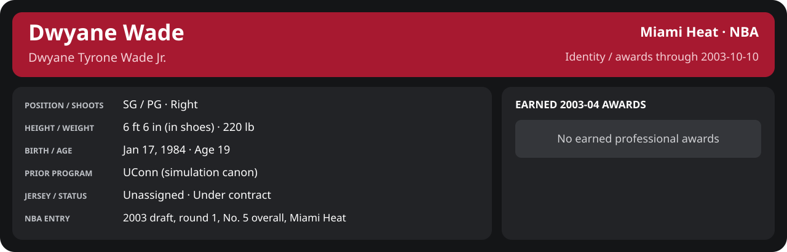

# Preseason Game 2

Player identity and statistics are generated here by `python scripts/update_player_reports.py`.
Decisions remain in the owning phase/week note. A scheduled game has no statistical result.

<!-- game-result:start -->
## Result

**Atlanta Hawks 99 at Miami Heat 103 (1OT)** · Miami Heat W 103-99 vs Atlanta Hawks · home (Miami Heat) · 2003-10-10

Event `2003-10-10-atlanta-hawks-at-miami-heat` · Railway engine (runtime/private_service.py) · result file [`Game_2.result.json`](Game_2.result.json) (the engine's answer as served; the note is the canonical record).

Preseason result: evidence for the preseason record and the camp decisions only; it does not count in regular-season statistics.

### Box score

```text
Atlanta Hawks 99 at Miami Heat 103 (1OT)
2003-10-10  2003-04 preseason  event 2003-10-10-atlanta-hawks-at-miami-heat
Kernel 2003.5, calibrated on 2002-03 (imported_source)

Period      1    2    3    4    5     T
Atlanta    26   19   17   30    7    99
Miami He   22   19   21   30   11   103

Atlanta Hawks
                           MIN  PTS   FG      3P     FT    OR  DR AST STL BLK  TO  PF
Shareef Abdur-Rahim       49.9   19   4-17   0-1   11-13    6  13   2   2   0   6   2
Jason Terry               49.8   26  10-21   3-6    3-3     1   5   7   1   1   5   2
Theo Ratliff              44.1   13   6-7    0-0    1-4     5   3   2   1   9   4   5
Boris Diaw                40.7   10   5-10   0-0    0-0     1   4   4   1   1   2   2
Jacque Vaughn             33.4    6   3-12   0-1    0-0     1   2   4   0   1   1   0
Nazr Mohammed             23.5   12   6-11   0-0    0-0     3   5   0   0   1   3   3
Lee Nailon                14.9   10   5-8    0-0    0-0     2   4   1   0   0   0   1
Dan Dickau                 8.6    3   1-3    1-2    0-0     0   1   3   0   0   1   0
TEAM                     265.0   99  40-89   4-10  15-20   19  37  23   5  13  22  15

Miami Heat
                           MIN  PTS   FG      3P     FT    OR  DR AST STL BLK  TO  PF
Mike James                35.3   11   4-10   2-8    1-1     1   5   5   2   1   2   1
Eddie Jones               35.3   16   5-16   2-7    4-4     0   4   4   2   0   4   4
Caron Butler              34.9   18   7-16   3-4    1-1     1   4   0   2   1   1   4
LaPhonso Ellis            35.9   19   7-9    2-2    3-4     4   5   4   0   2   2   0
Brian Grant               36.6    8   4-13   0-2    0-0     2   4   5   0   1   3   5
Jumaine Jones             19.0    0   0-2    0-0    0-0     0   1   1   0   0   2   3
Stephen Jackson           16.0    8   3-7    1-1    1-2     0   2   2   2   0   0   0
Keon Clark                14.9    2   0-5    0-2    2-2     1   2   2   3   1   0   1
Dwyane Wade               12.6   11   3-3    0-0    5-6     0   1   1   0   0   0   1
Reggie Evans              10.1    2   1-1    0-0    0-0     1   1   0   0   0   0   1
Shawn Kemp                 8.4    4   2-3    0-0    0-0     1   0   0   0   0   1   0
Chris Andersen             5.8    4   2-3    0-0    0-1     0   1   1   0   1   0   3
TEAM                     265.0  103  38-88  10-26  17-21   11  30  25  11   7  16  23
  Includes 1 team turnover(s) not charged to an individual.
```

### Miami injuries

No Miami injury was drawn in this game.
<!-- game-result:end -->

<!-- player-report:start -->
## Professional identity



| Player | Age on report date | Team / league | Position | Number | Status |
| --- | --- | --- | --- | --- | --- |
| Dwyane Tyrone Wade Jr. | 19 | Miami Heat / NBA | SG / PG | Not assigned | Under contract |

| Identity field | Recorded value |
| --- | --- |
| Birth date | 1984-01-17 |
| NBA entry | 2003 draft, round 1, No. 5 overall, Miami Heat |
| Prior program | UConn (simulation canon) |
| Height, in shoes / without shoes | 6 ft 6 in / 6 ft 4.75 in |
| Weight | 220 lb |
| Wingspan / standing reach | 6 ft 11.5 in / 8 ft 7.5 in |
| Shooting hand | Right |
| Contract | Rookie scale signed 2003-07-21: three seasons plus a 2006-07 team option |
| Role | Unassigned rookie |
| NBA debut | Not recorded |
| Nationality | United States (born in the Chicago area; Robbins, Illinois home community, per the player profile) |
| National team | No selection recorded |
| National-team eligibility | Not verified |
| Availability | No current restriction recorded in the established profile |
| Physical measurements recorded | 2003-06-25 |
| Professional status effective | 2003-07-21 |

Identity as of 2003-10-10; status snapshot dated 2003-07-21. User-established alternate-history player; historical Wade's biography and results are not this record.

### Earned 2003-04 awards

No 2003-04 awards yet.

## Statistics

As of **2003-10-10**: 1 closed games; 1/1 have player participation and box coverage; recorded DNPs: 0.

G counts appearances; GS counts recorded starts. DNPs, scheduled games and canceled games do not enter per-game denominators.

### Per game

[](../../Stats_and_Awards/player_cards.html?period=preseason-2003-04-game-4ffcd3e3ba482927#shooting) [](../../Stats_and_Awards/player_cards.html#contract) [](../../Stats_and_Awards/player_cards.html#awards)

[Shooting detail](../../Stats_and_Awards/Shooting.md) · [Current contract](../../Stats_and_Awards/Contract.md#current-contract) · [Contract history](../../Stats_and_Awards/Contract.md#contract-history) · [Annual award record](../../Stats_and_Awards/Awards.md)

| Scope | Age | Team | Lg | Pos | G | GS | MP | FG | FGA | FG% | 3P | 3PA | 3P% | 2P | 2PA | 2P% | eFG% | FT | FTA | FT% | ORB | DRB | TRB | AST | STL | BLK | TOV | PF | PTS | TS% (est.) | Awards |
| --- | --- | --- | --- | --- | --- | --- | --- | --- | --- | --- | --- | --- | --- | --- | --- | --- | --- | --- | --- | --- | --- | --- | --- | --- | --- | --- | --- | --- | --- | --- | --- |
| This game | 19 | Miami Heat | NBA | SG / PG | 1 | N/A | 12.6 | 3.0 | 3.0 | 1.000 | 0.0 | 0.0 | N/A | 3.0 | 3.0 | 1.000 | 1.000 | 5.0 | 6.0 | .833 | 0.0 | 1.0 | 1.0 | 1.0 | 0.0 | 0.0 | 0.0 | 1.0 | 11.0 | .975 | — |

G and GS are counts; MP and counting statistics are **per appearance**. Shooting uses **.500 = 50.0%**. Age is at the row's cutoff. Scroll horizontally for every column.

Awards are confirmed through 2005-10-14, filed by the honor's period-end date; the banner shows career awards known at the page's identity cutoff.

### Production

| Metric | Total | Per appearance | Per 36 minutes |
| --- | --- | --- | --- |
| MIN | 12.6 | 12.6 | 36.0 |
| PTS | 11 | 11.0 | 31.4 |
| OREB | 0 | 0.0 | 0.0 |
| DREB | 1 | 1.0 | 2.9 |
| REB | 1 | 1.0 | 2.9 |
| AST | 1 | 1.0 | 2.9 |
| STL | 0 | 0.0 | 0.0 |
| BLK | 0 | 0.0 | 0.0 |
| TOV | 0 | 0.0 | 0.0 |
| PF | 1 | 1.0 | 2.9 |
| FGM | 3 | 3.0 | 8.6 |
| FGA | 3 | 3.0 | 8.6 |
| 2PM | 3 | 3.0 | 8.6 |
| 2PA | 3 | 3.0 | 8.6 |
| 3PM | 0 | 0.0 | 0.0 |
| 3PA | 0 | 0.0 | 0.0 |
| FTM | 5 | 5.0 | 14.3 |
| FTA | 6 | 6.0 | 17.1 |
| FT points | 5 | 5.0 | 14.3 |

Per-36 rates standardize playing time; they are not a projection of playing 36 minutes. Use the actual minutes denominator in every competition.

### Shooting

| Shot type | Makes | Attempts | Percentage |
| --- | --- | --- | --- |
| All field goals | 3 | 3 | 100.0% |
| Two-pointers | 3 | 3 | 100.0% |
| Three-pointers | 0 | 0 | N/A |
| Free throws | 5 | 6 | 83.3% |

### Efficiency and shot selection

| Metric | Value | Calculation / unit |
| --- | --- | --- |
| eFG% | 100.0% | (FGM + 0.5 × 3PM) / FGA |
| TS% (estimated) | 97.5% | PTS / [2 × (FGA + 0.44 × FTA)] |
| Three-point attempt share | 0.0% | 3PA / FGA |
| Free-throw attempt rate | 2.000 | FTA / FGA; ratio |
| Assist / turnover ratio | N/A | AST / TOV; N/A at zero turnovers |
| Plus/minus total | N/A | Observed on-court score differential only |
| Double-doubles | 0 | At least 10 in any two of PTS, REB, AST, STL, BLK |
| Triple-doubles | 0 | At least 10 in any three; also included in double-doubles |

Percentages use pooled makes and attempts. TS% uses an estimated free-throw weighting, not exact scoring possessions. Rounding is display-only.

### Splits

[](../../Stats_and_Awards/player_cards.html?period=preseason-2003-04-game-4ffcd3e3ba482927#shooting) [](../../Stats_and_Awards/player_cards.html#contract) [](../../Stats_and_Awards/player_cards.html#awards)

[Shooting detail](../../Stats_and_Awards/Shooting.md) · [Current contract](../../Stats_and_Awards/Contract.md#current-contract) · [Contract history](../../Stats_and_Awards/Contract.md#contract-history) · [Annual award record](../../Stats_and_Awards/Awards.md)

| Scope | Age | Team | Lg | Pos | G | GS | MP | FG | FGA | FG% | 3P | 3PA | 3P% | 2P | 2PA | 2P% | eFG% | FT | FTA | FT% | ORB | DRB | TRB | AST | STL | BLK | TOV | PF | PTS | TS% (est.) | Awards |
| --- | --- | --- | --- | --- | --- | --- | --- | --- | --- | --- | --- | --- | --- | --- | --- | --- | --- | --- | --- | --- | --- | --- | --- | --- | --- | --- | --- | --- | --- | --- | --- |
| Home | 19 | Miami Heat | NBA | SG / PG | 1 | N/A | 12.6 | 3.0 | 3.0 | 1.000 | 0.0 | 0.0 | N/A | 3.0 | 3.0 | 1.000 | 1.000 | 5.0 | 6.0 | .833 | 0.0 | 1.0 | 1.0 | 1.0 | 0.0 | 0.0 | 0.0 | 1.0 | 11.0 | .975 | — |
| Away | 19 | Miami Heat | NBA | SG / PG | 0 | N/A | N/A | N/A | N/A | N/A | N/A | N/A | N/A | N/A | N/A | N/A | N/A | N/A | N/A | N/A | N/A | N/A | N/A | N/A | N/A | N/A | N/A | N/A | N/A | N/A | — |
| Neutral | 19 | Miami Heat | NBA | SG / PG | 0 | N/A | N/A | N/A | N/A | N/A | N/A | N/A | N/A | N/A | N/A | N/A | N/A | N/A | N/A | N/A | N/A | N/A | N/A | N/A | N/A | N/A | N/A | N/A | N/A | N/A | — |
| Wins | 19 | Miami Heat | NBA | SG / PG | 1 | N/A | 12.6 | 3.0 | 3.0 | 1.000 | 0.0 | 0.0 | N/A | 3.0 | 3.0 | 1.000 | 1.000 | 5.0 | 6.0 | .833 | 0.0 | 1.0 | 1.0 | 1.0 | 0.0 | 0.0 | 0.0 | 1.0 | 11.0 | .975 | — |
| Losses | 19 | Miami Heat | NBA | SG / PG | 0 | N/A | N/A | N/A | N/A | N/A | N/A | N/A | N/A | N/A | N/A | N/A | N/A | N/A | N/A | N/A | N/A | N/A | N/A | N/A | N/A | N/A | N/A | N/A | N/A | N/A | — |
| Team: Miami Heat | 19 | Miami Heat | NBA | SG / PG | 1 | N/A | 12.6 | 3.0 | 3.0 | 1.000 | 0.0 | 0.0 | N/A | 3.0 | 3.0 | 1.000 | 1.000 | 5.0 | 6.0 | .833 | 0.0 | 1.0 | 1.0 | 1.0 | 0.0 | 0.0 | 0.0 | 1.0 | 11.0 | .975 | — |

G and GS are counts; MP and counting statistics are **per appearance**. Shooting uses **.500 = 50.0%**. Age is at the row's cutoff. Scroll horizontally for every column.

Awards are confirmed through 2005-10-14, filed by the honor's period-end date; the banner shows career awards known at the page's identity cutoff.

Splits overlap and are not additive. Each row has its own appearance denominator; games with unknown result classification are excluded from win/loss splits.

### Game highs

| Metric | High | Date / opponent (all ties) |
| --- | --- | --- |
| PTS | 11 | [2003-10-10 vs Atlanta Hawks](Game_2.md) |
| REB | 1 | [2003-10-10 vs Atlanta Hawks](Game_2.md) |
| AST | 1 | [2003-10-10 vs Atlanta Hawks](Game_2.md) |
| STL | 0 | [2003-10-10 vs Atlanta Hawks](Game_2.md) |
| BLK | 0 | [2003-10-10 vs Atlanta Hawks](Game_2.md) |
| TOV | 0 | [2003-10-10 vs Atlanta Hawks](Game_2.md) |

### Game log

| Date / source | Opponent | Venue | Result | Participation | MIN | PTS | REB | AST | STL | BLK | TOV |
| --- | --- | --- | --- | --- | --- | --- | --- | --- | --- | --- | --- |
| [2003-10-10](Game_2.md) | Atlanta Hawks | home | W 103-99 | Played | 12.6 | 11 | 1 | 1 | 0 | 0 | 0 |

### Game shooting detail

| Date / source | FG | 2P | 3P | FT | eFG% | TS% (est.) | +/- | PF |
| --- | --- | --- | --- | --- | --- | --- | --- | --- |
| [2003-10-10](Game_2.md) | 3/3 | 3/3 | 0/0 | 5/6 | 100.0% | 97.5% | N/A | 1 |

### Additional data needed

| Statistic family | Current support | Required evidence |
| --- | --- | --- |
| Starts; plus/minus | N/A unless supplied in the player box | Explicit started and plus_minus fields |
| Per 100 possessions; offensive / defensive / net rating | Unavailable in current box feed | Player on-court possessions and both teams' scoring during those possessions |
| USG%; AST%; OREB%, DREB%, REB% | Unavailable in current box feed | Matching player/team/opponent opportunity counts and a declared method |
| Rim, paint, midrange, corner / above-break threes | Unavailable in current box feed | Shot locations, attempts and makes |
| Drives, touches, catch-and-shoot, pull-ups, play types | Unavailable in current box feed | Tracking or tagged play-by-play |
| Clutch, on/off, lineup combinations, assisted baskets | Unavailable in current box feed | Timed events, score state, substitutions and possession attribution |
| Deflections, charges, contested shots, box outs | Unavailable in current box feed | Observed hustle/defensive events |
| League rank, percentile, relative TS%; impact models | Not derived by this report | Same-period simulated league baseline, eligibility rules and documented model |

<!-- player-report:end -->
