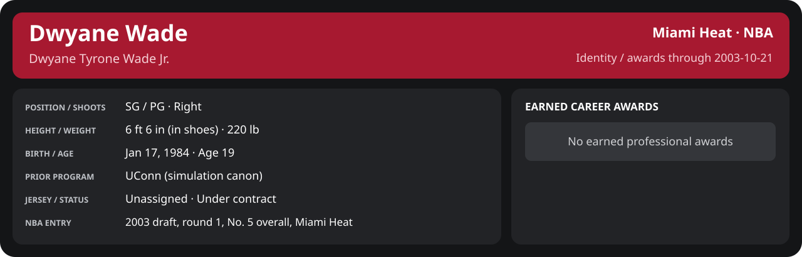

# Preseason Game 7

Player identity and statistics are generated here by `python scripts/update_player_reports.py`.
Decisions remain in the owning phase/week note. A scheduled game has no statistical result.

<!-- game-result:start -->
## Result

**Memphis Grizzlies 94 at Miami Heat 92** · Miami Heat L 92-94 vs Memphis Grizzlies · home (Miami Heat) · 2003-10-21

Event `2003-10-21-memphis-grizzlies-at-miami-heat` · Railway engine (runtime/private_service.py) · result file [`Game_7.result.json`](Game_7.result.json) (the engine's answer as served; the note is the canonical record).

Preseason result: evidence for the preseason record and the camp decisions only; it does not count in regular-season statistics.

### Box score

```text
Memphis Grizzlies 94 at Miami Heat 92
2003-10-21  2003-04 preseason  event 2003-10-21-memphis-grizzlies-at-miami-heat
Kernel 2003.5, calibrated on 2002-03 (imported_source)

Period      1    2    3    4     T
Memphis    19   27   23   25    94
Miami He   18   21   35   18    92

Memphis Grizzlies
                           MIN  PTS   FG      3P     FT    OR  DR AST STL BLK  TO  PF
Pau Gasol                 36.9   25   8-14   0-0    9-9     5   5   4   1   0   2   1
James Posey               33.4    2   1-6    0-0    0-0     1   3   2   2   0   2   5
Jason Williams            32.8   18   5-15   2-7    6-6     2   2   3   1   0   6   2
Lorenzen Wright           29.4   10   2-8    0-1    6-8     3   6   1   1   1   3   2
Shane Battier             29.9   14   5-9    0-1    4-5     2   4   1   1   0   0   4
Earl Watson               20.6   11   4-6    0-0    3-4     1   3   2   0   0   1   2
Stromile Swift            20.2   11   3-8    0-0    5-7     1   4   1   1   2   0   1
Bo Outlaw                 19.2    0   0-2    0-0    0-0     2   4   0   1   1   1   4
Wesley Person             17.5    3   1-7    0-4    1-2     0   4   2   1   0   1   0
TEAM                     240.0   94  29-75   2-13  34-41   17  35  16   9   4  17  21
  Includes 1 team turnover(s) not charged to an individual.

Miami Heat
                           MIN  PTS   FG      3P     FT    OR  DR AST STL BLK  TO  PF
Mike James                32.7    8   3-7    1-3    1-1     0   4   3   3   0   1   3
Eddie Jones               32.8   26   9-17   4-9    4-5     0   5   1   0   0   0   2
Caron Butler              31.5   12   6-10   0-0    0-0     1   1   7   3   0   2   2
LaPhonso Ellis            31.5    6   3-8    0-2    0-0     7   4   1   1   1   1   4
Brian Grant               24.1    9   3-8    0-0    3-5     0   4   1   0   1   2   5
Jumaine Jones             19.1   10   5-14   0-1    0-0     0   2   0   0   1   0   3
Stephen Jackson           17.2    5   2-4    1-1    0-0     0   2   1   2   0   2   1
Keon Clark                12.8    2   1-4    0-0    0-1     0   0   2   0   0   1   5
Scott Padgett             13.8    6   2-6    1-3    1-1     1   3   0   0   0   1   2
Tyrone Hill               10.6    0   0-2    0-0    0-0     0   1   0   0   0   0   2
Rasual Butler              7.9    7   3-5    1-1    0-0     0   0   2   0   0   0   0
Anthony Carter             6.0    1   0-0    0-0    1-2     0   0   2   0   0   1   0
TEAM                     240.0   92  37-85   8-20  10-15    9  26  20   9   3  14  29
  Includes 3 team turnover(s) not charged to an individual.
```

### Miami injuries

No Miami injury was drawn in this game.
<!-- game-result:end -->

<!-- player-report:start -->
## Professional identity



| Player | Age on report date | Team / league | Position | Number | Status |
| --- | --- | --- | --- | --- | --- |
| Dwyane Tyrone Wade Jr. | 19 | Miami Heat / NBA | SG / PG | Not assigned | Under contract |

| Identity field | Recorded value |
| --- | --- |
| Birth date | 1984-01-17 |
| NBA entry | 2003 draft, round 1, No. 5 overall, Miami Heat |
| Prior program | UConn (simulation canon) |
| Height, in shoes / without shoes | 6 ft 6 in / 6 ft 4.75 in |
| Weight | 220 lb |
| Wingspan / standing reach | 6 ft 11.5 in / 8 ft 7.5 in |
| Shooting hand | Right |
| Contract | Rookie scale signed 2003-07-21: three seasons plus a 2006-07 team option |
| Role | Unassigned rookie |
| NBA debut | Not recorded |
| Nationality | Not recorded |
| National team | No selection recorded |
| National-team eligibility | Not verified |
| Availability | No current restriction recorded in the established profile |
| Physical measurements recorded | 2003-06-25 |
| Professional status effective | 2003-07-21 |

Identity as of 2003-10-21; status snapshot dated 2003-07-21. User-established alternate-history player; historical Wade's biography and results are not this record.

### Earned career awards

No earned professional awards recorded by this page's identity cutoff.

## Statistics

As of **2003-10-21**: 1 closed games; 0/1 have player participation and box coverage; recorded DNPs: 0.

**Incomplete source coverage.** Full-period totals and rates are N/A until every closed game has a verified player box or explicit DNP. Known games remain visible below.

G counts appearances; GS counts recorded starts. DNPs, scheduled games and canceled games do not enter per-game denominators.

### Per game

[](../../Stats_and_Awards/player_cards.html?period=preseason-2003-04-game-d8df0ac9fa0b03b9#shooting) [](../../Stats_and_Awards/player_cards.html#contract) [](../../Stats_and_Awards/player_cards.html#awards)

[Shooting detail](../../Stats_and_Awards/Shooting.md) · [Current contract](../../Stats_and_Awards/Contract.md#current-contract) · [Contract history](../../Stats_and_Awards/Contract.md#contract-history) · [Annual award record](../../Stats_and_Awards/Awards.md)

| Scope | Age | Team | Lg | Pos | G | GS | MP | FG | FGA | FG% | 3P | 3PA | 3P% | 2P | 2PA | 2P% | eFG% | FT | FTA | FT% | ORB | DRB | TRB | AST | STL | BLK | TOV | PF | PTS | TS% (est.) | Awards |
| --- | --- | --- | --- | --- | --- | --- | --- | --- | --- | --- | --- | --- | --- | --- | --- | --- | --- | --- | --- | --- | --- | --- | --- | --- | --- | --- | --- | --- | --- | --- | --- |
| This game | 19 | Miami Heat | NBA | SG / PG | N/A | N/A | N/A | N/A | N/A | N/A | N/A | N/A | N/A | N/A | N/A | N/A | N/A | N/A | N/A | N/A | N/A | N/A | N/A | N/A | N/A | N/A | N/A | N/A | N/A | N/A | — |

G and GS are counts; MP and counting statistics are **per appearance**. Shooting uses **.500 = 50.0%**. Age is at the row's cutoff. Scroll horizontally for every column.

Awards are confirmed through 2004-02-13, filed by the honor's period-end date; the banner shows career awards known at the page's identity cutoff.

### Production

| Metric | Total | Per appearance | Per 36 minutes |
| --- | --- | --- | --- |
| MIN | N/A | N/A | N/A |
| PTS | N/A | N/A | N/A |
| OREB | N/A | N/A | N/A |
| DREB | N/A | N/A | N/A |
| REB | N/A | N/A | N/A |
| AST | N/A | N/A | N/A |
| STL | N/A | N/A | N/A |
| BLK | N/A | N/A | N/A |
| TOV | N/A | N/A | N/A |
| PF | N/A | N/A | N/A |
| FGM | N/A | N/A | N/A |
| FGA | N/A | N/A | N/A |
| 2PM | N/A | N/A | N/A |
| 2PA | N/A | N/A | N/A |
| 3PM | N/A | N/A | N/A |
| 3PA | N/A | N/A | N/A |
| FTM | N/A | N/A | N/A |
| FTA | N/A | N/A | N/A |
| FT points | N/A | N/A | N/A |

Per-36 rates standardize playing time; they are not a projection of playing 36 minutes. Use the actual minutes denominator in every competition.

### Shooting

| Shot type | Makes | Attempts | Percentage |
| --- | --- | --- | --- |
| All field goals | N/A | N/A | N/A |
| Two-pointers | N/A | N/A | N/A |
| Three-pointers | N/A | N/A | N/A |
| Free throws | N/A | N/A | N/A |

### Efficiency and shot selection

| Metric | Value | Calculation / unit |
| --- | --- | --- |
| eFG% | N/A | (FGM + 0.5 × 3PM) / FGA |
| TS% (estimated) | N/A | PTS / [2 × (FGA + 0.44 × FTA)] |
| Three-point attempt share | N/A | 3PA / FGA |
| Free-throw attempt rate | N/A | FTA / FGA; ratio |
| Assist / turnover ratio | N/A | AST / TOV; N/A at zero turnovers |
| Plus/minus total | N/A | Observed on-court score differential only |
| Double-doubles | N/A | At least 10 in any two of PTS, REB, AST, STL, BLK |
| Triple-doubles | N/A | At least 10 in any three; also included in double-doubles |

Percentages use pooled makes and attempts. TS% uses an estimated free-throw weighting, not exact scoring possessions. Rounding is display-only.

### Splits

[](../../Stats_and_Awards/player_cards.html?period=preseason-2003-04-game-d8df0ac9fa0b03b9#shooting) [](../../Stats_and_Awards/player_cards.html#contract) [](../../Stats_and_Awards/player_cards.html#awards)

[Shooting detail](../../Stats_and_Awards/Shooting.md) · [Current contract](../../Stats_and_Awards/Contract.md#current-contract) · [Contract history](../../Stats_and_Awards/Contract.md#contract-history) · [Annual award record](../../Stats_and_Awards/Awards.md)

| Scope | Age | Team | Lg | Pos | G | GS | MP | FG | FGA | FG% | 3P | 3PA | 3P% | 2P | 2PA | 2P% | eFG% | FT | FTA | FT% | ORB | DRB | TRB | AST | STL | BLK | TOV | PF | PTS | TS% (est.) | Awards |
| --- | --- | --- | --- | --- | --- | --- | --- | --- | --- | --- | --- | --- | --- | --- | --- | --- | --- | --- | --- | --- | --- | --- | --- | --- | --- | --- | --- | --- | --- | --- | --- |
| Home | 19 | Miami Heat | NBA | SG / PG | N/A | N/A | N/A | N/A | N/A | N/A | N/A | N/A | N/A | N/A | N/A | N/A | N/A | N/A | N/A | N/A | N/A | N/A | N/A | N/A | N/A | N/A | N/A | N/A | N/A | N/A | — |
| Away | 19 | Miami Heat | NBA | SG / PG | 0 | N/A | N/A | N/A | N/A | N/A | N/A | N/A | N/A | N/A | N/A | N/A | N/A | N/A | N/A | N/A | N/A | N/A | N/A | N/A | N/A | N/A | N/A | N/A | N/A | N/A | — |
| Neutral | 19 | Miami Heat | NBA | SG / PG | 0 | N/A | N/A | N/A | N/A | N/A | N/A | N/A | N/A | N/A | N/A | N/A | N/A | N/A | N/A | N/A | N/A | N/A | N/A | N/A | N/A | N/A | N/A | N/A | N/A | N/A | — |
| Wins | 19 | Miami Heat | NBA | SG / PG | 0 | N/A | N/A | N/A | N/A | N/A | N/A | N/A | N/A | N/A | N/A | N/A | N/A | N/A | N/A | N/A | N/A | N/A | N/A | N/A | N/A | N/A | N/A | N/A | N/A | N/A | — |
| Losses | 19 | Miami Heat | NBA | SG / PG | 0 | N/A | N/A | N/A | N/A | N/A | N/A | N/A | N/A | N/A | N/A | N/A | N/A | N/A | N/A | N/A | N/A | N/A | N/A | N/A | N/A | N/A | N/A | N/A | N/A | N/A | — |
| Team: Miami Heat | 19 | Miami Heat | NBA | SG / PG | N/A | N/A | N/A | N/A | N/A | N/A | N/A | N/A | N/A | N/A | N/A | N/A | N/A | N/A | N/A | N/A | N/A | N/A | N/A | N/A | N/A | N/A | N/A | N/A | N/A | N/A | — |

G and GS are counts; MP and counting statistics are **per appearance**. Shooting uses **.500 = 50.0%**. Age is at the row's cutoff. Scroll horizontally for every column.

Awards are confirmed through 2004-02-13, filed by the honor's period-end date; the banner shows career awards known at the page's identity cutoff.

Splits overlap and are not additive. Each row has its own appearance denominator; games with unknown result classification are excluded from win/loss splits.

### Game highs

| Metric | High | Date / opponent (all ties) |
| --- | --- | --- |
| PTS | N/A | N/A |
| REB | N/A | N/A |
| AST | N/A | N/A |
| STL | N/A | N/A |
| BLK | N/A | N/A |
| TOV | N/A | N/A |

### Game log

| Date / source | Opponent | Venue | Result | Participation | MIN | PTS | REB | AST | STL | BLK | TOV |
| --- | --- | --- | --- | --- | --- | --- | --- | --- | --- | --- | --- |
| [2003-10-21](Game_7.md) | Memphis Grizzlies | home | L 92-94 | Unknown: missing player box | N/A | N/A | N/A | N/A | N/A | N/A | N/A |

### Additional data needed

| Statistic family | Current support | Required evidence |
| --- | --- | --- |
| Starts; plus/minus | N/A unless supplied in the player box | Explicit started and plus_minus fields |
| Per 100 possessions; offensive / defensive / net rating | Unavailable in current box feed | Player on-court possessions and both teams' scoring during those possessions |
| USG%; AST%; OREB%, DREB%, REB% | Unavailable in current box feed | Matching player/team/opponent opportunity counts and a declared method |
| Rim, paint, midrange, corner / above-break threes | Unavailable in current box feed | Shot locations, attempts and makes |
| Drives, touches, catch-and-shoot, pull-ups, play types | Unavailable in current box feed | Tracking or tagged play-by-play |
| Clutch, on/off, lineup combinations, assisted baskets | Unavailable in current box feed | Timed events, score state, substitutions and possession attribution |
| Deflections, charges, contested shots, box outs | Unavailable in current box feed | Observed hustle/defensive events |
| League rank, percentile, relative TS%; impact models | Not derived by this report | Same-period simulated league baseline, eligibility rules and documented model |

<!-- player-report:end -->
