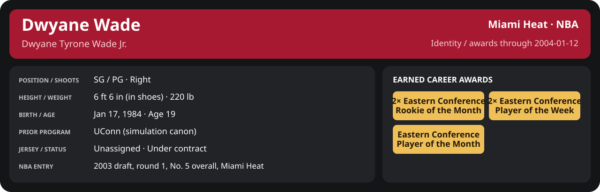

<!-- Generated by scripts/update_player_reports.py; edit source records, then rebuild. -->

# January 2004 | NBA regular season

[Career](../../../README.md) · [Professional identity](../../../Professional_Identity.md) · [Earned awards](../../../Awards.md) · [Stat definitions](../../../../../docs/player_statistics.md) · [Season](../../../Stats_and_Awards/2003-04/README.md) · [Miami](../../../Stats_and_Awards/Team/2003-04/01_January/Team_Stats.md) · [NBA players](../../../Stats_and_Awards/League/2003-04/01_January/League_Stats.md) · [NBA awards](../../../Stats_and_Awards/League/2003-04/01_January/League_Awards.md)

## Professional identity

| Player | Age on report date | Team / league | Position | Number | Status |
| --- | --- | --- | --- | --- | --- |
| Dwyane Tyrone Wade Jr. | 19 | Miami Heat / NBA | SG / PG | Not assigned | Under contract |

| Identity field | Recorded value |
| --- | --- |
| Birth date | 1984-01-17 |
| NBA entry | 2003 draft, round 1, No. 5 overall, Miami Heat |
| Prior program | UConn (simulation canon) |
| Height, in shoes / without shoes | 6 ft 6 in / 6 ft 4.75 in |
| Weight | 220 lb |
| Wingspan / standing reach | 6 ft 11.5 in / 8 ft 7.5 in |
| Shooting hand | Right |
| Contract | Rookie scale signed 2003-07-21: three seasons plus a 2006-07 team option |
| Role | Starter; staff plan 34 minutes |
| NBA debut | October 28, 2003 at Philadelphia 76ers (2003-04/06_Regular_Season/10_October/Week_4/Game_1.md) |
| Nationality | Not recorded |
| National team | No selection recorded |
| National-team eligibility | Not verified |
| Availability | No current restriction recorded in the established profile |
| Physical measurements recorded | 2003-06-25 |
| Professional status effective | 2003-12-01 |

Identity as of 2004-01-12; status snapshot dated 2003-12-01. User-established alternate-history player; historical Wade's biography and results are not this record.

### Earned career awards

| Award | Period | Announced | Decision record |
| --- | --- | --- | --- |
| Eastern Conference Rookie of the Month | 2003-10-28 to 2003-11-30 | 2003-12-02 | [East ROM](../../../Stats_and_Awards/League/2003-04/11_November/League_Awards.md#rookie-of-the-month) |
| Eastern Conference Player of the Week | 2003-12-15 to 2003-12-21 | 2003-12-22 | [East POW](../../../Stats_and_Awards/League/2003-04/12_December/Week_3/League_Awards.md#player-of-the-week) |
| Eastern Conference Player of the Month | 2003-12-01 to 2003-12-31 | 2004-01-02 | [East POM](../../../Stats_and_Awards/League/2003-04/12_December/League_Awards.md#player-of-the-month) |
| Eastern Conference Rookie of the Month | 2003-12-01 to 2003-12-31 | 2004-01-02 | [East ROM](../../../Stats_and_Awards/League/2003-04/12_December/League_Awards.md#rookie-of-the-month) |
| Eastern Conference Player of the Week | 2003-12-29 to 2004-01-04 | 2004-01-05 | [East POW](../../../Stats_and_Awards/League/2003-04/01_January/Week_1/League_Awards.md#player-of-the-week) |

## Statistics

As of **2004-01-12**: 5 closed games; 5/5 have player participation and box coverage; recorded DNPs: 0.

G counts appearances; GS counts recorded starts. DNPs, scheduled games and canceled games do not enter per-game denominators.

### Per game

  

[Shooting detail](../../../Stats_and_Awards/Shooting.md) · [Current contract](../../../Stats_and_Awards/Contract.md#current-contract) · [Contract history](../../../Stats_and_Awards/Contract.md#contract-history) · [Annual award record](../../../Stats_and_Awards/Awards.md)

| Scope | Age | Team | Lg | Pos | G | GS | MP | FG | FGA | FG% | 3P | 3PA | 3P% | 2P | 2PA | 2P% | eFG% | FT | FTA | FT% | ORB | DRB | TRB | AST | STL | BLK | TOV | PF | PTS | TS% (est.) | Awards |
| --- | --- | --- | --- | --- | --- | --- | --- | --- | --- | --- | --- | --- | --- | --- | --- | --- | --- | --- | --- | --- | --- | --- | --- | --- | --- | --- | --- | --- | --- | --- | --- |
| This scope | 19 | Miami Heat | NBA | SG / PG | 5 | 5 | 37.5 | 7.2 | 14.6 | .493 | 0.8 | 2.2 | .364 | 6.4 | 12.4 | .516 | .521 | 7.2 | 7.6 | .947 | 0.8 | 2.6 | 3.4 | 6.0 | 1.8 | 0.6 | 1.2 | 3.6 | 22.4 | .624 | [East POW](../../../Stats_and_Awards/League/2003-04/01_January/Week_1/League_Awards.md#player-of-the-week) |

G and GS are counts; MP and counting statistics are **per appearance**. Shooting uses **.500 = 50.0%**. Age is at the row's cutoff. Scroll horizontally for every column.

Awards are confirmed through 2004-01-12, filed by the honor's period-end date; the banner shows career awards known at the page's identity cutoff.

[Full statistical detail: totals, per 36, shooting, efficiency, splits and source games](../../../Stats_and_Awards/2003-04/01_January/Stat_Detail.md)

### Period summary

  

[Shooting detail](../../../Stats_and_Awards/Shooting.md) · [Current contract](../../../Stats_and_Awards/Contract.md#current-contract) · [Contract history](../../../Stats_and_Awards/Contract.md#contract-history) · [Annual award record](../../../Stats_and_Awards/Awards.md)

| Scope | Age | Team | Lg | Pos | G | GS | MP | FG | FGA | FG% | 3P | 3PA | 3P% | 2P | 2PA | 2P% | eFG% | FT | FTA | FT% | ORB | DRB | TRB | AST | STL | BLK | TOV | PF | PTS | TS% (est.) | Awards |
| --- | --- | --- | --- | --- | --- | --- | --- | --- | --- | --- | --- | --- | --- | --- | --- | --- | --- | --- | --- | --- | --- | --- | --- | --- | --- | --- | --- | --- | --- | --- | --- |
| [Week 1: 2004-01-01 to 2004-01-07](../../../Stats_and_Awards/2003-04/01_January/Week_1/README.md) | 19 | Miami Heat | NBA | SG / PG | 3 | 3 | 38.5 | 8.3 | 14.0 | .595 | 1.3 | 2.0 | .667 | 7.0 | 12.0 | .583 | .643 | 6.3 | 7.0 | .905 | 1.0 | 3.0 | 4.0 | 5.0 | 2.7 | 0.7 | 1.3 | 3.0 | 24.3 | .712 | [East POW](../../../Stats_and_Awards/League/2003-04/01_January/Week_1/League_Awards.md#player-of-the-week) |
| [Week 2: 2004-01-08 to 2004-01-14](../../../Stats_and_Awards/2003-04/01_January/Week_2/README.md) | 19 | Miami Heat | NBA | SG / PG | 2 | 2 | 36.1 | 5.5 | 15.5 | .355 | 0.0 | 2.5 | .000 | 5.5 | 13.0 | .423 | .355 | 8.5 | 8.5 | 1.000 | 0.5 | 2.0 | 2.5 | 7.5 | 0.5 | 0.5 | 1.0 | 4.5 | 19.5 | .507 | — |
| [Week 3: 2004-01-15 to 2004-01-21](../../../Stats_and_Awards/2003-04/01_January/Week_3/README.md) | 19 | Miami Heat | NBA | SG / PG | 0 | N/A | N/A | N/A | N/A | N/A | N/A | N/A | N/A | N/A | N/A | N/A | N/A | N/A | N/A | N/A | N/A | N/A | N/A | N/A | N/A | N/A | N/A | N/A | N/A | N/A | — |
| [Week 4: 2004-01-22 to 2004-01-31](../../../Stats_and_Awards/2003-04/01_January/Week_4/README.md) | 19 | Miami Heat | NBA | SG / PG | 0 | N/A | N/A | N/A | N/A | N/A | N/A | N/A | N/A | N/A | N/A | N/A | N/A | N/A | N/A | N/A | N/A | N/A | N/A | N/A | N/A | N/A | N/A | N/A | N/A | N/A | — |

G and GS are counts; MP and counting statistics are **per appearance**. Shooting uses **.500 = 50.0%**. Age is at the row's cutoff. Scroll horizontally for every column.

Awards are confirmed through 2004-01-12, filed by the honor's period-end date; the banner shows career awards known at the page's identity cutoff.

### Period comparison

  

[Shooting detail](../../../Stats_and_Awards/Shooting.md) · [Current contract](../../../Stats_and_Awards/Contract.md#current-contract) · [Contract history](../../../Stats_and_Awards/Contract.md#contract-history) · [Annual award record](../../../Stats_and_Awards/Awards.md)

| Scope | Age | Team | Lg | Pos | G | GS | MP | FG | FGA | FG% | 3P | 3PA | 3P% | 2P | 2PA | 2P% | eFG% | FT | FTA | FT% | ORB | DRB | TRB | AST | STL | BLK | TOV | PF | PTS | TS% (est.) | Awards |
| --- | --- | --- | --- | --- | --- | --- | --- | --- | --- | --- | --- | --- | --- | --- | --- | --- | --- | --- | --- | --- | --- | --- | --- | --- | --- | --- | --- | --- | --- | --- | --- |
| January 2004 | 19 | Miami Heat | NBA | SG / PG | 5 | 5 | 37.5 | 7.2 | 14.6 | .493 | 0.8 | 2.2 | .364 | 6.4 | 12.4 | .516 | .521 | 7.2 | 7.6 | .947 | 0.8 | 2.6 | 3.4 | 6.0 | 1.8 | 0.6 | 1.2 | 3.6 | 22.4 | .624 | [East POW](../../../Stats_and_Awards/League/2003-04/01_January/Week_1/League_Awards.md#player-of-the-week) |
| [December 2003](../../../Stats_and_Awards/2003-04/12_December/README.md) | 19 | Miami Heat | NBA | SG / PG | 15 | 15 | 36.4 | 6.1 | 11.7 | .517 | 1.0 | 2.3 | .429 | 5.1 | 9.4 | .539 | .560 | 4.8 | 5.3 | .911 | 1.1 | 3.7 | 4.8 | 5.3 | 2.3 | 0.9 | 1.0 | 3.2 | 17.9 | .638 | [East POW](../../../Stats_and_Awards/League/2003-04/12_December/Week_3/League_Awards.md#player-of-the-week), [East POM](../../../Stats_and_Awards/League/2003-04/12_December/League_Awards.md#player-of-the-month), [East ROM](../../../Stats_and_Awards/League/2003-04/12_December/League_Awards.md#rookie-of-the-month) |
| Season through this month | 19 | Miami Heat | NBA | SG / PG | 37 | 32 | 34.8 | 5.9 | 11.5 | .512 | 0.8 | 2.3 | .345 | 5.1 | 9.2 | .553 | .546 | 4.8 | 5.2 | .923 | 1.2 | 3.4 | 4.6 | 4.9 | 1.8 | 0.7 | 1.1 | 3.0 | 17.4 | .630 | [East ROM](../../../Stats_and_Awards/League/2003-04/11_November/League_Awards.md#rookie-of-the-month), [East POW](../../../Stats_and_Awards/League/2003-04/12_December/Week_3/League_Awards.md#player-of-the-week), [East POM](../../../Stats_and_Awards/League/2003-04/12_December/League_Awards.md#player-of-the-month), [East ROM](../../../Stats_and_Awards/League/2003-04/12_December/League_Awards.md#rookie-of-the-month), [East POW](../../../Stats_and_Awards/League/2003-04/01_January/Week_1/League_Awards.md#player-of-the-week) |

G and GS are counts; MP and counting statistics are **per appearance**. Shooting uses **.500 = 50.0%**. Age is at the row's cutoff. Scroll horizontally for every column.

Awards are confirmed through 2004-01-12, filed by the honor's period-end date; the banner shows career awards known at the page's identity cutoff.

### Production

| Metric | Total | Per appearance | Per 36 minutes |
| --- | --- | --- | --- |
| MIN | 187.6 | 37.5 | 36.0 |
| PTS | 112 | 22.4 | 21.5 |
| OREB | 4 | 0.8 | 0.8 |
| DREB | 13 | 2.6 | 2.5 |
| REB | 17 | 3.4 | 3.3 |
| AST | 30 | 6.0 | 5.8 |
| STL | 9 | 1.8 | 1.7 |
| BLK | 3 | 0.6 | 0.6 |
| TOV | 6 | 1.2 | 1.2 |
| PF | 18 | 3.6 | 3.5 |
| FGM | 36 | 7.2 | 6.9 |
| FGA | 73 | 14.6 | 14.0 |
| 2PM | 32 | 6.4 | 6.1 |
| 2PA | 62 | 12.4 | 11.9 |
| 3PM | 4 | 0.8 | 0.8 |
| 3PA | 11 | 2.2 | 2.1 |
| FTM | 36 | 7.2 | 6.9 |
| FTA | 38 | 7.6 | 7.3 |
| FT points | 36 | 7.2 | 6.9 |

Per-36 rates standardize playing time; they are not a projection of playing 36 minutes. Use the actual minutes denominator in every competition.

### Shooting

| Shot type | Makes | Attempts | Percentage |
| --- | --- | --- | --- |
| All field goals | 36 | 73 | 49.3% |
| Two-pointers | 32 | 62 | 51.6% |
| Three-pointers | 4 | 11 | 36.4% |
| Free throws | 36 | 38 | 94.7% |

### Efficiency and shot selection

| Metric | Value | Calculation / unit |
| --- | --- | --- |
| eFG% | 52.1% | (FGM + 0.5 × 3PM) / FGA |
| TS% (estimated) | 62.4% | PTS / [2 × (FGA + 0.44 × FTA)] |
| Three-point attempt share | 15.1% | 3PA / FGA |
| Free-throw attempt rate | 0.521 | FTA / FGA; ratio |
| Assist / turnover ratio | 5.00 | AST / TOV; N/A at zero turnovers |
| Plus/minus total | N/A | Observed on-court score differential only |
| Double-doubles | 0 | At least 10 in any two of PTS, REB, AST, STL, BLK |
| Triple-doubles | 0 | At least 10 in any three; also included in double-doubles |

Percentages use pooled makes and attempts. TS% uses an estimated free-throw weighting, not exact scoring possessions. Rounding is display-only.

### Splits

  

[Shooting detail](../../../Stats_and_Awards/Shooting.md) · [Current contract](../../../Stats_and_Awards/Contract.md#current-contract) · [Contract history](../../../Stats_and_Awards/Contract.md#contract-history) · [Annual award record](../../../Stats_and_Awards/Awards.md)

| Scope | Age | Team | Lg | Pos | G | GS | MP | FG | FGA | FG% | 3P | 3PA | 3P% | 2P | 2PA | 2P% | eFG% | FT | FTA | FT% | ORB | DRB | TRB | AST | STL | BLK | TOV | PF | PTS | TS% (est.) | Awards |
| --- | --- | --- | --- | --- | --- | --- | --- | --- | --- | --- | --- | --- | --- | --- | --- | --- | --- | --- | --- | --- | --- | --- | --- | --- | --- | --- | --- | --- | --- | --- | --- |
| Home | 19 | Miami Heat | NBA | SG / PG | 3 | 3 | 38.5 | 8.3 | 14.0 | .595 | 1.3 | 2.0 | .667 | 7.0 | 12.0 | .583 | .643 | 6.3 | 7.0 | .905 | 1.0 | 3.0 | 4.0 | 5.0 | 2.7 | 0.7 | 1.3 | 3.0 | 24.3 | .712 | — |
| Away | 19 | Miami Heat | NBA | SG / PG | 2 | 2 | 36.1 | 5.5 | 15.5 | .355 | 0.0 | 2.5 | .000 | 5.5 | 13.0 | .423 | .355 | 8.5 | 8.5 | 1.000 | 0.5 | 2.0 | 2.5 | 7.5 | 0.5 | 0.5 | 1.0 | 4.5 | 19.5 | .507 | — |
| Neutral | 19 | Miami Heat | NBA | SG / PG | 0 | N/A | N/A | N/A | N/A | N/A | N/A | N/A | N/A | N/A | N/A | N/A | N/A | N/A | N/A | N/A | N/A | N/A | N/A | N/A | N/A | N/A | N/A | N/A | N/A | N/A | — |
| Wins | 19 | Miami Heat | NBA | SG / PG | 3 | 3 | 37.8 | 6.7 | 12.3 | .541 | 1.0 | 2.0 | .500 | 5.7 | 10.3 | .548 | .581 | 5.3 | 5.7 | .941 | 0.7 | 2.3 | 3.0 | 5.3 | 1.7 | 0.3 | 1.7 | 4.0 | 19.7 | .663 | — |
| Losses | 19 | Miami Heat | NBA | SG / PG | 2 | 2 | 37.2 | 8.0 | 18.0 | .444 | 0.5 | 2.5 | .200 | 7.5 | 15.5 | .484 | .458 | 10.0 | 10.5 | .952 | 1.0 | 3.0 | 4.0 | 7.0 | 2.0 | 1.0 | 0.5 | 3.0 | 26.5 | .586 | — |
| Team: Miami Heat | 19 | Miami Heat | NBA | SG / PG | 5 | 5 | 37.5 | 7.2 | 14.6 | .493 | 0.8 | 2.2 | .364 | 6.4 | 12.4 | .516 | .521 | 7.2 | 7.6 | .947 | 0.8 | 2.6 | 3.4 | 6.0 | 1.8 | 0.6 | 1.2 | 3.6 | 22.4 | .624 | — |

G and GS are counts; MP and counting statistics are **per appearance**. Shooting uses **.500 = 50.0%**. Age is at the row's cutoff. Scroll horizontally for every column.

Awards are confirmed through 2004-01-12, filed by the honor's period-end date; the banner shows career awards known at the page's identity cutoff.

Splits overlap and are not additive. Each row has its own appearance denominator; games with unknown result classification are excluded from win/loss splits.

### Game highs

| Metric | High | Date / opponent (all ties) |
| --- | --- | --- |
| PTS | 32 | [2004-01-07 vs Chicago Bulls](Week_1/Game_3.md) |
| REB | 6 | [2004-01-07 vs Chicago Bulls](Week_1/Game_3.md) |
| AST | 8 | [2004-01-10 at Minnesota Timberwolves](Week_2/Game_2.md) |
| STL | 5 | [2004-01-02 vs Orlando Magic](Week_1/Game_1.md) |
| BLK | 1 | [2004-01-05 vs Indiana Pacers](Week_1/Game_2.md); [2004-01-07 vs Chicago Bulls](Week_1/Game_3.md); [2004-01-10 at Minnesota Timberwolves](Week_2/Game_2.md) |
| TOV | 3 | [2004-01-05 vs Indiana Pacers](Week_1/Game_2.md) |

### Game log

| Date / source | Opponent | Venue | Result | Participation | MIN | PTS | REB | AST | STL | BLK | TOV |
| --- | --- | --- | --- | --- | --- | --- | --- | --- | --- | --- | --- |
| [2004-01-02](Week_1/Game_1.md) | Orlando Magic | home | W 107-90 | Played | 41.1 | 23 | 2 | 5 | 5 | 0 | 1 |
| [2004-01-05](Week_1/Game_2.md) | Indiana Pacers | home | W 88-86 | Played | 35.6 | 18 | 4 | 4 | 0 | 1 | 3 |
| [2004-01-07](Week_1/Game_3.md) | Chicago Bulls | home | L 99-101 | Played | 38.8 | 32 | 6 | 6 | 3 | 1 | 0 |
| [2004-01-09](Week_2/Game_1.md) | Milwaukee Bucks | away | W 113-109 | Played | 36.6 | 18 | 3 | 7 | 0 | 0 | 1 |
| [2004-01-10](Week_2/Game_2.md) | Minnesota Timberwolves | away | L 96-105 | Played | 35.5 | 21 | 2 | 8 | 1 | 1 | 1 |

### Individual game boxes

| Scope | Age | Team | Lg | Pos | G | GS | MP | FG | FGA | FG% | 3P | 3PA | 3P% | 2P | 2PA | 2P% | eFG% | FT | FTA | FT% | ORB | DRB | TRB | AST | STL | BLK | TOV | PF | PTS | TS% (est.) | Awards |
| --- | --- | --- | --- | --- | --- | --- | --- | --- | --- | --- | --- | --- | --- | --- | --- | --- | --- | --- | --- | --- | --- | --- | --- | --- | --- | --- | --- | --- | --- | --- | --- |
| [2004-01-02](Week_1/Game_1.md) | 19 | Miami Heat | NBA | SG / PG | 1 | 1 | 41.1 | 9.0 | 12.0 | .750 | 1.0 | 1.0 | 1.000 | 8.0 | 11.0 | .727 | .792 | 4.0 | 4.0 | 1.000 | 0.0 | 2.0 | 2.0 | 5.0 | 5.0 | 0.0 | 1.0 | 5.0 | 23.0 | .836 | — |
| [2004-01-05](Week_1/Game_2.md) | 19 | Miami Heat | NBA | SG / PG | 1 | 1 | 35.6 | 5.0 | 13.0 | .385 | 2.0 | 3.0 | .667 | 3.0 | 10.0 | .300 | .462 | 6.0 | 7.0 | .857 | 1.0 | 3.0 | 4.0 | 4.0 | 0.0 | 1.0 | 3.0 | 3.0 | 18.0 | .560 | — |
| [2004-01-07](Week_1/Game_3.md) | 19 | Miami Heat | NBA | SG / PG | 1 | 1 | 38.8 | 11.0 | 17.0 | .647 | 1.0 | 2.0 | .500 | 10.0 | 15.0 | .667 | .676 | 9.0 | 10.0 | .900 | 2.0 | 4.0 | 6.0 | 6.0 | 3.0 | 1.0 | 0.0 | 1.0 | 32.0 | .748 | — |
| [2004-01-09](Week_2/Game_1.md) | 19 | Miami Heat | NBA | SG / PG | 1 | 1 | 36.6 | 6.0 | 12.0 | .500 | 0.0 | 2.0 | .000 | 6.0 | 10.0 | .600 | .500 | 6.0 | 6.0 | 1.000 | 1.0 | 2.0 | 3.0 | 7.0 | 0.0 | 0.0 | 1.0 | 4.0 | 18.0 | .615 | — |
| [2004-01-10](Week_2/Game_2.md) | 19 | Miami Heat | NBA | SG / PG | 1 | 1 | 35.5 | 5.0 | 19.0 | .263 | 0.0 | 3.0 | .000 | 5.0 | 16.0 | .312 | .263 | 11.0 | 11.0 | 1.000 | 0.0 | 2.0 | 2.0 | 8.0 | 1.0 | 1.0 | 1.0 | 5.0 | 21.0 | .440 | — |

G and GS are counts; MP and counting statistics are **per appearance**. Shooting uses **.500 = 50.0%**. Age is at the row's cutoff. Scroll horizontally for every column.

Awards are confirmed through 2004-01-12, filed by the honor's period-end date; the banner shows career awards known at the page's identity cutoff.

### Game shooting detail

| Date / source | FG | 2P | 3P | FT | eFG% | TS% (est.) | +/- | PF |
| --- | --- | --- | --- | --- | --- | --- | --- | --- |
| [2004-01-02](Week_1/Game_1.md) | 9/12 | 8/11 | 1/1 | 4/4 | 79.2% | 83.6% | N/A | 5 |
| [2004-01-05](Week_1/Game_2.md) | 5/13 | 3/10 | 2/3 | 6/7 | 46.2% | 56.0% | N/A | 3 |
| [2004-01-07](Week_1/Game_3.md) | 11/17 | 10/15 | 1/2 | 9/10 | 67.6% | 74.8% | N/A | 1 |
| [2004-01-09](Week_2/Game_1.md) | 6/12 | 6/10 | 0/2 | 6/6 | 50.0% | 61.5% | N/A | 4 |
| [2004-01-10](Week_2/Game_2.md) | 5/19 | 5/16 | 0/3 | 11/11 | 26.3% | 44.0% | N/A | 5 |

### Additional data needed

| Statistic family | Current support | Required evidence |
| --- | --- | --- |
| Starts; plus/minus | N/A unless supplied in the player box | Explicit started and plus_minus fields |
| Per 100 possessions; offensive / defensive / net rating | Unavailable in current box feed | Player on-court possessions and both teams' scoring during those possessions |
| USG%; AST%; OREB%, DREB%, REB% | Unavailable in current box feed | Matching player/team/opponent opportunity counts and a declared method |
| Rim, paint, midrange, corner / above-break threes | Unavailable in current box feed | Shot locations, attempts and makes |
| Drives, touches, catch-and-shoot, pull-ups, play types | Unavailable in current box feed | Tracking or tagged play-by-play |
| Clutch, on/off, lineup combinations, assisted baskets | Unavailable in current box feed | Timed events, score state, substitutions and possession attribution |
| Deflections, charges, contested shots, box outs | Unavailable in current box feed | Observed hustle/defensive events |
| League rank, percentile, relative TS%; impact models | Not derived by this report | Same-period simulated league baseline, eligibility rules and documented model |
