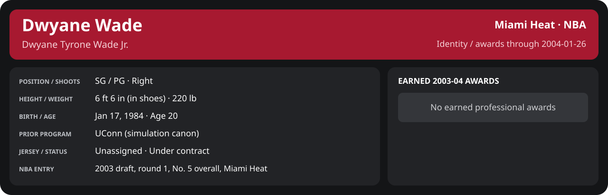

# January Week 4 Game 3

Player identity and statistics are generated here by `python scripts/update_player_reports.py`.
Decisions remain in the owning phase/week note. A scheduled game has no statistical result.

Miami's injured list for this game: Udonis Haslem, John Wallace, Sean Lampley (`00_Team/Transactions/injured_list.json`; twelve dress).

<!-- game-result:start -->
## Result

**Houston Rockets 81 at Miami Heat 92** · Miami Heat W 92-81 vs Houston Rockets · home (Miami Heat) · 2004-01-26

Event `2004-01-26-houston-rockets-at-miami-heat` · Railway engine (runtime/private_service.py) · result file [`Game_3.result.json`](Game_3.result.json) (the engine's answer as served; the note is the canonical record).

### Box score

```text
Houston Rockets 81 at Miami Heat 92
2004-01-26  2003-04 regular  event 2004-01-26-houston-rockets-at-miami-heat
Kernel 2003.11, calibrated on 2002-03 (imported_source)

Period      1    2    3    4     T
Houston    18   25   17   21    81
Miami He   18   35   14   25    92

Houston Rockets
                           MIN  PTS   FG      3P     FT    OR  DR AST STL BLK  TO  PF
Steve Francis             19.2    8   2-6    1-2    3-3     1   5   0   0   1   1   4
Jim Jackson               41.7   17   6-20   3-9    2-2     2   6   3   0   0   3   2
Yao Ming                  41.3   14   6-14   0-0    2-2     5   7   4   0   4   1   2
Maurice Taylor            33.1   10   4-12   0-0    2-2     2   7   2   0   1   5   5
Kelvin Cato               29.0    9   3-8    0-0    3-3     3   5   0   1   3   1   5
Eric Piatkowski           24.0    6   2-7    1-3    1-2     0   3   0   0   1   3   2
Boštjan Nachbar           10.2    3   1-5    1-4    0-0     1   1   1   0   0   0   0
Torraye Braggs             9.5    2   1-1    0-0    0-0     4   0   0   1   1   1   3
Mike Wilks                10.3    8   3-7    0-0    2-2     0   1   1   0   0   1   0
Adrian Griffin             9.4    0   0-3    0-0    0-2     0   2   1   0   1   2   0
Randy Livingston           9.1    4   1-2    0-0    2-2     1   0   0   0   0   0   1
Alton Ford                 3.1    0   0-0    0-0    0-0     0   1   2   0   0   0   0
TEAM                     240.0   81  29-85   6-18  17-20   19  38  14   2  12  19  24
  Includes 1 team turnover(s) not charged to an individual.

Miami Heat
                           MIN  PTS   FG      3P     FT    OR  DR AST STL BLK  TO  PF
Mike James                33.6   10   4-14   2-10   0-0     0   2   5   2   1   1   2
Dwyane Wade               35.9   19   5-11   3-4    6-6     2   6   3   2   0   1   1
Caron Butler (DQ)         32.6    4   1-7    0-0    2-2     1   3   2   2   0   2   6
Scott Padgett             35.0   11   4-12   2-8    1-2     3   3   5   0   2   2   4
Brian Grant               35.1   11   4-9    0-0    3-4     1   9   1   2   0   2   3
Shawn Kemp                15.3    8   2-4    0-0    4-6     0   1   2   2   1   1   1
Stephen Jackson           16.1    5   2-7    1-3    0-0     1   2   0   2   0   0   1
Eddie Jones               13.1    9   3-6    2-2    1-1     0   2   0   1   0   1   1
Cherokee Parks             9.5    6   2-2    0-0    2-2     0   4   0   0   0   1   1
Anthony Carter             7.6    4   1-5    0-0    2-2     1   1   0   0   0   0   0
LaPhonso Ellis             6.1    5   2-2    1-1    0-1     0   0   0   0   0   0   1
TEAM                     240.0   92  30-79  11-28  21-26    9  33  18  13   4  11  21
```

### Miami injuries

| Player | Injury | Games out |
| --- | --- | ---: |
| Shawn Kemp | day-to-day | 1 |
<!-- game-result:end -->

<!-- player-report:start -->
## Professional identity



| Player | Age on report date | Team / league | Position | Number | Status |
| --- | --- | --- | --- | --- | --- |
| Dwyane Tyrone Wade Jr. | 20 | Miami Heat / NBA | SG / PG | Not assigned | Under contract |

| Identity field | Recorded value |
| --- | --- |
| Birth date | 1984-01-17 |
| NBA entry | 2003 draft, round 1, No. 5 overall, Miami Heat |
| Prior program | UConn (simulation canon) |
| Height, in shoes / without shoes | 6 ft 6 in / 6 ft 4.75 in |
| Weight | 220 lb |
| Wingspan / standing reach | 6 ft 11.5 in / 8 ft 7.5 in |
| Shooting hand | Right |
| Contract | Rookie scale signed 2003-07-21: three seasons plus a 2006-07 team option |
| Role | Starter; staff plan 34 minutes |
| NBA debut | October 28, 2003 at Philadelphia 76ers (2003-04/06_Regular_Season/10_October/Week_4/Game_1.md) |
| Nationality | United States (born in the Chicago area; Robbins, Illinois home community, per the player profile) |
| National team | No selection recorded |
| National-team eligibility | Not verified |
| Availability | No current restriction recorded in the established profile |
| Physical measurements recorded | 2003-06-25 |
| Professional status effective | 2003-12-01 |

Identity as of 2004-01-26; status snapshot dated 2003-12-01. User-established alternate-history player; historical Wade's biography and results are not this record.

### Earned 2003-04 awards

| Award | Period | Announced | Decision record |
| --- | --- | --- | --- |
| Eastern Conference Rookie of the Month | 2003-10-28 to 2003-11-30 | 2003-12-02 | [East ROM](../../../../Stats_and_Awards/League/2003-04/11_November/League_Awards.md#rookie-of-the-month) |
| Eastern Conference Player of the Week | 2003-12-15 to 2003-12-21 | 2003-12-22 | [East POW](../../../../Stats_and_Awards/League/2003-04/12_December/Week_3/League_Awards.md#player-of-the-week) |
| Eastern Conference Player of the Month | 2003-12-01 to 2003-12-31 | 2004-01-02 | [East POM](../../../../Stats_and_Awards/League/2003-04/12_December/League_Awards.md#player-of-the-month) |
| Eastern Conference Rookie of the Month | 2003-12-01 to 2003-12-31 | 2004-01-02 | [East ROM](../../../../Stats_and_Awards/League/2003-04/12_December/League_Awards.md#rookie-of-the-month) |
| Eastern Conference Player of the Week | 2003-12-29 to 2004-01-04 | 2004-01-05 | [East POW](../../../../Stats_and_Awards/League/2003-04/01_January/Week_1/League_Awards.md#player-of-the-week) |

## Statistics

As of **2004-01-26**: 1 closed games; 1/1 have player participation and box coverage; recorded DNPs: 0.

G counts appearances; GS counts recorded starts. DNPs, scheduled games and canceled games do not enter per-game denominators.

### Per game

[](../../../../Stats_and_Awards/player_cards.html?period=regular-2003-04-game-aebafb0dd7f0fd9d#shooting) [](../../../../Stats_and_Awards/player_cards.html#contract) [](../../../../Stats_and_Awards/player_cards.html#awards)

[Shooting detail](../../../../Stats_and_Awards/Shooting.md) · [Current contract](../../../../Stats_and_Awards/Contract.md#current-contract) · [Contract history](../../../../Stats_and_Awards/Contract.md#contract-history) · [Annual award record](../../../../Stats_and_Awards/Awards.md)

| Scope | Age | Team | Lg | Pos | G | GS | MP | FG | FGA | FG% | 3P | 3PA | 3P% | 2P | 2PA | 2P% | eFG% | FT | FTA | FT% | ORB | DRB | TRB | AST | STL | BLK | TOV | PF | PTS | TS% (est.) | Awards |
| --- | --- | --- | --- | --- | --- | --- | --- | --- | --- | --- | --- | --- | --- | --- | --- | --- | --- | --- | --- | --- | --- | --- | --- | --- | --- | --- | --- | --- | --- | --- | --- |
| This game | 20 | Miami Heat | NBA | SG / PG | 1 | 1 | 35.9 | 5.0 | 11.0 | .455 | 3.0 | 4.0 | .750 | 2.0 | 7.0 | .286 | .591 | 6.0 | 6.0 | 1.000 | 2.0 | 6.0 | 8.0 | 3.0 | 2.0 | 0.0 | 1.0 | 1.0 | 19.0 | .696 | — |

G and GS are counts; MP and counting statistics are **per appearance**. Shooting uses **.500 = 50.0%**. Age is at the row's cutoff. Scroll horizontally for every column.

Awards are confirmed through 2006-04-16, filed by the honor's period-end date; the banner shows career awards known at the page's identity cutoff.

### Production

| Metric | Total | Per appearance | Per 36 minutes |
| --- | --- | --- | --- |
| MIN | 35.9 | 35.9 | 36.0 |
| PTS | 19 | 19.0 | 19.1 |
| OREB | 2 | 2.0 | 2.0 |
| DREB | 6 | 6.0 | 6.0 |
| REB | 8 | 8.0 | 8.0 |
| AST | 3 | 3.0 | 3.0 |
| STL | 2 | 2.0 | 2.0 |
| BLK | 0 | 0.0 | 0.0 |
| TOV | 1 | 1.0 | 1.0 |
| PF | 1 | 1.0 | 1.0 |
| FGM | 5 | 5.0 | 5.0 |
| FGA | 11 | 11.0 | 11.0 |
| 2PM | 2 | 2.0 | 2.0 |
| 2PA | 7 | 7.0 | 7.0 |
| 3PM | 3 | 3.0 | 3.0 |
| 3PA | 4 | 4.0 | 4.0 |
| FTM | 6 | 6.0 | 6.0 |
| FTA | 6 | 6.0 | 6.0 |
| FT points | 6 | 6.0 | 6.0 |

Per-36 rates standardize playing time; they are not a projection of playing 36 minutes. Use the actual minutes denominator in every competition.

### Shooting

| Shot type | Makes | Attempts | Percentage |
| --- | --- | --- | --- |
| All field goals | 5 | 11 | 45.5% |
| Two-pointers | 2 | 7 | 28.6% |
| Three-pointers | 3 | 4 | 75.0% |
| Free throws | 6 | 6 | 100.0% |

### Efficiency and shot selection

| Metric | Value | Calculation / unit |
| --- | --- | --- |
| eFG% | 59.1% | (FGM + 0.5 × 3PM) / FGA |
| TS% (estimated) | 69.6% | PTS / [2 × (FGA + 0.44 × FTA)] |
| Three-point attempt share | 36.4% | 3PA / FGA |
| Free-throw attempt rate | 0.545 | FTA / FGA; ratio |
| Assist / turnover ratio | 3.00 | AST / TOV; N/A at zero turnovers |
| Plus/minus total | N/A | Observed on-court score differential only |
| Double-doubles | 0 | At least 10 in any two of PTS, REB, AST, STL, BLK |
| Triple-doubles | 0 | At least 10 in any three; also included in double-doubles |

Percentages use pooled makes and attempts. TS% uses an estimated free-throw weighting, not exact scoring possessions. Rounding is display-only.

### Splits

[](../../../../Stats_and_Awards/player_cards.html?period=regular-2003-04-game-aebafb0dd7f0fd9d#shooting) [](../../../../Stats_and_Awards/player_cards.html#contract) [](../../../../Stats_and_Awards/player_cards.html#awards)

[Shooting detail](../../../../Stats_and_Awards/Shooting.md) · [Current contract](../../../../Stats_and_Awards/Contract.md#current-contract) · [Contract history](../../../../Stats_and_Awards/Contract.md#contract-history) · [Annual award record](../../../../Stats_and_Awards/Awards.md)

| Scope | Age | Team | Lg | Pos | G | GS | MP | FG | FGA | FG% | 3P | 3PA | 3P% | 2P | 2PA | 2P% | eFG% | FT | FTA | FT% | ORB | DRB | TRB | AST | STL | BLK | TOV | PF | PTS | TS% (est.) | Awards |
| --- | --- | --- | --- | --- | --- | --- | --- | --- | --- | --- | --- | --- | --- | --- | --- | --- | --- | --- | --- | --- | --- | --- | --- | --- | --- | --- | --- | --- | --- | --- | --- |
| Home | 20 | Miami Heat | NBA | SG / PG | 1 | 1 | 35.9 | 5.0 | 11.0 | .455 | 3.0 | 4.0 | .750 | 2.0 | 7.0 | .286 | .591 | 6.0 | 6.0 | 1.000 | 2.0 | 6.0 | 8.0 | 3.0 | 2.0 | 0.0 | 1.0 | 1.0 | 19.0 | .696 | — |
| Away | 20 | Miami Heat | NBA | SG / PG | 0 | N/A | N/A | N/A | N/A | N/A | N/A | N/A | N/A | N/A | N/A | N/A | N/A | N/A | N/A | N/A | N/A | N/A | N/A | N/A | N/A | N/A | N/A | N/A | N/A | N/A | — |
| Neutral | 20 | Miami Heat | NBA | SG / PG | 0 | N/A | N/A | N/A | N/A | N/A | N/A | N/A | N/A | N/A | N/A | N/A | N/A | N/A | N/A | N/A | N/A | N/A | N/A | N/A | N/A | N/A | N/A | N/A | N/A | N/A | — |
| Wins | 20 | Miami Heat | NBA | SG / PG | 1 | 1 | 35.9 | 5.0 | 11.0 | .455 | 3.0 | 4.0 | .750 | 2.0 | 7.0 | .286 | .591 | 6.0 | 6.0 | 1.000 | 2.0 | 6.0 | 8.0 | 3.0 | 2.0 | 0.0 | 1.0 | 1.0 | 19.0 | .696 | — |
| Losses | 20 | Miami Heat | NBA | SG / PG | 0 | N/A | N/A | N/A | N/A | N/A | N/A | N/A | N/A | N/A | N/A | N/A | N/A | N/A | N/A | N/A | N/A | N/A | N/A | N/A | N/A | N/A | N/A | N/A | N/A | N/A | — |
| Team: Miami Heat | 20 | Miami Heat | NBA | SG / PG | 1 | 1 | 35.9 | 5.0 | 11.0 | .455 | 3.0 | 4.0 | .750 | 2.0 | 7.0 | .286 | .591 | 6.0 | 6.0 | 1.000 | 2.0 | 6.0 | 8.0 | 3.0 | 2.0 | 0.0 | 1.0 | 1.0 | 19.0 | .696 | — |

G and GS are counts; MP and counting statistics are **per appearance**. Shooting uses **.500 = 50.0%**. Age is at the row's cutoff. Scroll horizontally for every column.

Awards are confirmed through 2006-04-16, filed by the honor's period-end date; the banner shows career awards known at the page's identity cutoff.

Splits overlap and are not additive. Each row has its own appearance denominator; games with unknown result classification are excluded from win/loss splits.

### Game highs

| Metric | High | Date / opponent (all ties) |
| --- | --- | --- |
| PTS | 19 | [2004-01-26 vs Houston Rockets](Game_3.md) |
| REB | 8 | [2004-01-26 vs Houston Rockets](Game_3.md) |
| AST | 3 | [2004-01-26 vs Houston Rockets](Game_3.md) |
| STL | 2 | [2004-01-26 vs Houston Rockets](Game_3.md) |
| BLK | 0 | [2004-01-26 vs Houston Rockets](Game_3.md) |
| TOV | 1 | [2004-01-26 vs Houston Rockets](Game_3.md) |

### Game log

| Date / source | Opponent | Venue | Result | Participation | MIN | PTS | REB | AST | STL | BLK | TOV |
| --- | --- | --- | --- | --- | --- | --- | --- | --- | --- | --- | --- |
| [2004-01-26](Game_3.md) | Houston Rockets | home | W 92-81 | Played | 35.9 | 19 | 8 | 3 | 2 | 0 | 1 |

### Game shooting detail

| Date / source | FG | 2P | 3P | FT | eFG% | TS% (est.) | +/- | PF |
| --- | --- | --- | --- | --- | --- | --- | --- | --- |
| [2004-01-26](Game_3.md) | 5/11 | 2/7 | 3/4 | 6/6 | 59.1% | 69.6% | N/A | 1 |

### Additional data needed

| Statistic family | Current support | Required evidence |
| --- | --- | --- |
| Starts; plus/minus | N/A unless supplied in the player box | Explicit started and plus_minus fields |
| Per 100 possessions; offensive / defensive / net rating | Unavailable in current box feed | Player on-court possessions and both teams' scoring during those possessions |
| USG%; AST%; OREB%, DREB%, REB% | Unavailable in current box feed | Matching player/team/opponent opportunity counts and a declared method |
| Rim, paint, midrange, corner / above-break threes | Unavailable in current box feed | Shot locations, attempts and makes |
| Drives, touches, catch-and-shoot, pull-ups, play types | Unavailable in current box feed | Tracking or tagged play-by-play |
| Clutch, on/off, lineup combinations, assisted baskets | Unavailable in current box feed | Timed events, score state, substitutions and possession attribution |
| Deflections, charges, contested shots, box outs | Unavailable in current box feed | Observed hustle/defensive events |
| League rank, percentile, relative TS%; impact models | Not derived by this report | Same-period simulated league baseline, eligibility rules and documented model |

<!-- player-report:end -->
