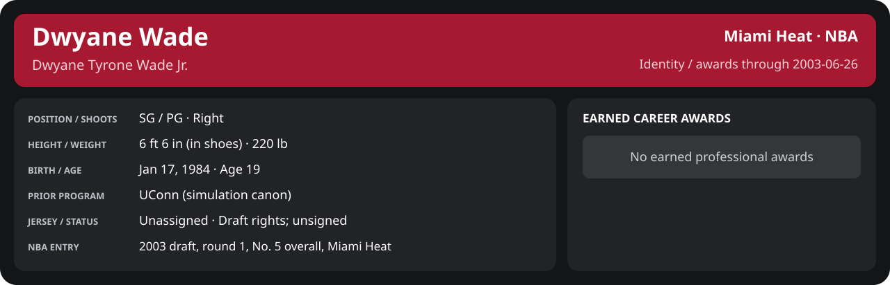

<!-- Generated by scripts/update_player_reports.py; edit source records, then rebuild. -->

# Week 3: 2004-02-15 to 2004-02-21

[Career](../../../../README.md) · [Professional identity](../../../../Professional_Identity.md) · [Earned honors](../../../../Awards.md) · [Stat definitions](../../../../../../docs/player_statistics.md) · [Month](../../../../Stats_and_Awards/2003-04/02_February/README.md) · [Miami](../../../../Stats_and_Awards/Team/2003-04/02_February/Week_3/Team_Stats.md) · [NBA players](../../../../Stats_and_Awards/League/2003-04/02_February/Week_3/League_Stats.md) · [NBA awards](../../../../Stats_and_Awards/League/2003-04/02_February/Week_3/League_Awards.md) · [Period decisions](note.md) · [Previous week](../../../../Stats_and_Awards/2003-04/02_February/Week_2/README.md) · [Next week](../../../../Stats_and_Awards/2003-04/02_February/Week_4/README.md)

## Professional identity

Personal information and earned honors: text version

| Player | Age on report date | Team / league | Position | Number | Status |
| --- | --- | --- | --- | --- | --- |
| Dwyane Tyrone Wade Jr. | 19 | Miami Heat / NBA | SG / PG | Not assigned | Draft rights; unsigned |

| Birth date | Height (in shoes) | Weight | Shoots | Prior program |
| --- | --- | --- | --- | --- |
| 1984-01-17 | 6 ft 6 in | 220 lb | Right | UConn (simulation canon) |

NBA entry: 2003 draft, round 1, No. 5 overall, Miami Heat.

Identity as of 2003-06-26; status snapshot dated 2003-06-26. User-established alternate-history player; historical Wade's biography and results are not this record.

### Earned career honors

No earned professional honors recorded by this page's identity cutoff.

## Statistics

As of **2003-06-26**: 0 closed games; 0/0 have player participation and box coverage; recorded DNPs: 0.

No closed games in this scope. Totals are empty (0); rates are N/A. Future dates are calendar containers, not played results.

G counts appearances; GS counts recorded starts. DNPs, scheduled games and canceled games do not enter per-game denominators.

### Per game

| Scope | Age | Team | Lg | Pos | G | GS | MP | FG | FGA | FG% | 3P | 3PA | 3P% | 2P | 2PA | 2P% | eFG% | FT | FTA | FT% | ORB | DRB | TRB | AST | STL | BLK | TOV | PF | PTS | TS% (est.) | Awards |
| --- | --- | --- | --- | --- | --- | --- | --- | --- | --- | --- | --- | --- | --- | --- | --- | --- | --- | --- | --- | --- | --- | --- | --- | --- | --- | --- | --- | --- | --- | --- | --- |
| This scope | 19 | Miami Heat | NBA | SG / PG | 0 | N/A | N/A | N/A | N/A | N/A | N/A | N/A | N/A | N/A | N/A | N/A | N/A | N/A | N/A | N/A | N/A | N/A | N/A | N/A | N/A | N/A | N/A | N/A | N/A | N/A | — |

G and GS are counts; MP and counting statistics are **per appearance**. Shooting uses **.500 = 50.0%**. Age is at the row's cutoff. Scroll horizontally for every column.

[Full statistical detail: totals, per 36, shooting, efficiency, splits and source games](../../../../Stats_and_Awards/2003-04/02_February/Week_3/Stat_Detail.md)

### Period comparison

| Scope | Age | Team | Lg | Pos | G | GS | MP | FG | FGA | FG% | 3P | 3PA | 3P% | 2P | 2PA | 2P% | eFG% | FT | FTA | FT% | ORB | DRB | TRB | AST | STL | BLK | TOV | PF | PTS | TS% (est.) | Awards |
| --- | --- | --- | --- | --- | --- | --- | --- | --- | --- | --- | --- | --- | --- | --- | --- | --- | --- | --- | --- | --- | --- | --- | --- | --- | --- | --- | --- | --- | --- | --- | --- |
| This week | 19 | Miami Heat | NBA | SG / PG | 0 | N/A | N/A | N/A | N/A | N/A | N/A | N/A | N/A | N/A | N/A | N/A | N/A | N/A | N/A | N/A | N/A | N/A | N/A | N/A | N/A | N/A | N/A | N/A | N/A | N/A | — |
| [Previous week](../../../../Stats_and_Awards/2003-04/02_February/Week_2/README.md) | 19 | Miami Heat | NBA | SG / PG | 0 | N/A | N/A | N/A | N/A | N/A | N/A | N/A | N/A | N/A | N/A | N/A | N/A | N/A | N/A | N/A | N/A | N/A | N/A | N/A | N/A | N/A | N/A | N/A | N/A | N/A | — |
| Month through this week | 19 | Miami Heat | NBA | SG / PG | 0 | N/A | N/A | N/A | N/A | N/A | N/A | N/A | N/A | N/A | N/A | N/A | N/A | N/A | N/A | N/A | N/A | N/A | N/A | N/A | N/A | N/A | N/A | N/A | N/A | N/A | — |
| Season through this week | 19 | Miami Heat | NBA | SG / PG | 0 | N/A | N/A | N/A | N/A | N/A | N/A | N/A | N/A | N/A | N/A | N/A | N/A | N/A | N/A | N/A | N/A | N/A | N/A | N/A | N/A | N/A | N/A | N/A | N/A | N/A | — |

G and GS are counts; MP and counting statistics are **per appearance**. Shooting uses **.500 = 50.0%**. Age is at the row's cutoff. Scroll horizontally for every column.

### Shooting summary

| FG% | 2P% | 3P% | FT% | eFG% | TS% (est.) |
| --- | --- | --- | --- | --- | --- |
| N/A | N/A | N/A | N/A | N/A | N/A |

### Game log

No game records in this scope.
