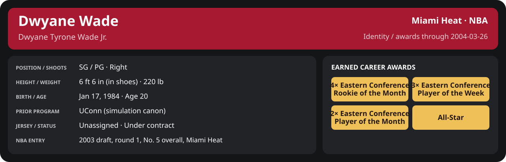

# March Week 4 Game 2

Player identity and statistics are generated here by `python scripts/update_player_reports.py`.
Decisions remain in the owning phase/week note. A scheduled game has no statistical result.

Miami's injured list for this game: John Wallace, Udonis Haslem, Sean Lampley (`00_Team/Transactions/injured_list.json`; twelve dress).

<!-- game-result:start -->
## Result

**Dallas Mavericks 114 at Miami Heat 110** · Miami Heat L 110-114 vs Dallas Mavericks · home (Miami Heat) · 2004-03-26

Event `2004-03-26-dallas-mavericks-at-miami-heat` · Railway engine (runtime/private_service.py) · result file [`Game_2.result.json`](Game_2.result.json) (the engine's answer as served; the note is the canonical record).

### Box score

```text
Dallas Mavericks 114 at Miami Heat 110
2004-03-26  2003-04 regular  event 2004-03-26-dallas-mavericks-at-miami-heat
Kernel 2003.11, calibrated on 2002-03 (imported_source)

Period      1    2    3    4     T
Dallas M   30   20   28   36   114
Miami He   27   25   23   35   110

Dallas Mavericks
                           MIN  PTS   FG      3P     FT    OR  DR AST STL BLK  TO  PF
Michael Finley            38.4   18   6-15   2-7    4-4     1  10   0   0   2   0   1
Dirk Nowitzki             38.4   29  12-20   0-0    5-5     1   5   2   1   1   3   5
Antoine Walker            32.9    9   4-5    1-2    0-0     0   4   6   1   0   1   4
Steve Nash                34.4   25  10-17   3-6    2-2     1   0   9   2   0   1   4
Voshon Lenard             30.8   10   3-7    1-1    3-3     0   2   3   1   0   2   4
Antawn Jamison            26.2   16   5-10   0-0    6-6     3   0   2   1   0   0   1
Josh Howard               21.0    5   2-6    0-0    1-1     3   4   1   2   0   1   4
Marquis Daniels           11.7    2   1-4    0-0    0-0     0   1   2   1   0   0   0
Chris Andersen             3.7    0   0-0    0-0    0-0     1   1   0   0   0   0   1
Shawn Bradley              2.4    0   0-0    0-0    0-0     0   0   0   0   0   0   0
TEAM                     240.0  114  43-84   7-16  21-21   10  27  25   9   3   8  24

Miami Heat
                           MIN  PTS   FG      3P     FT    OR  DR AST STL BLK  TO  PF
Mike James                37.4   23  10-14   3-5    0-0     0   3   8   1   0   0   2
Dwyane Wade               35.4   31   9-16   4-5    9-10    4   4   1   2   0   2   1
Caron Butler              35.5   17   7-16   2-3    1-2     0   3   1   2   0   2   4
Scott Padgett             17.6    4   1-5    0-1    2-2     3   4   2   2   0   1   2
Shawn Kemp                36.1    7   3-10   0-0    1-2     4   3   2   0   1   3   2
Brian Grant               24.1    6   3-8    0-0    0-0     4   8   1   0   0   1   3
Stephen Jackson           15.9    6   3-8    0-4    0-1     2   2   0   0   0   0   1
Eddie Jones               12.5    9   3-6    2-3    1-1     0   1   2   0   1   0   1
Cherokee Parks            11.2    5   2-3    0-0    1-2     2   1   0   0   0   1   0
LaPhonso Ellis             9.2    2   1-2    0-1    0-0     0   0   0   0   0   1   0
Anthony Carter             5.1    0   0-0    0-0    0-0     0   1   0   0   0   2   0
TEAM                     240.0  110  42-88  11-22  15-20   19  30  17   7   2  14  16
  Includes 1 team turnover(s) not charged to an individual.
```

### Miami injuries

| Player | Injury | Games out |
| --- | --- | ---: |
| Scott Padgett | medium | 9 |
<!-- game-result:end -->

<!-- player-report:start -->
## Professional identity



| Player | Age on report date | Team / league | Position | Number | Status |
| --- | --- | --- | --- | --- | --- |
| Dwyane Tyrone Wade Jr. | 20 | Miami Heat / NBA | SG / PG | Not assigned | Under contract |

| Identity field | Recorded value |
| --- | --- |
| Birth date | 1984-01-17 |
| NBA entry | 2003 draft, round 1, No. 5 overall, Miami Heat |
| Prior program | UConn (simulation canon) |
| Height, in shoes / without shoes | 6 ft 6 in / 6 ft 4.75 in |
| Weight | 220 lb |
| Wingspan / standing reach | 6 ft 11.5 in / 8 ft 7.5 in |
| Shooting hand | Right |
| Contract | Rookie scale signed 2003-07-21: three seasons plus a 2006-07 team option |
| Role | Starter; staff plan 34 minutes |
| NBA debut | October 28, 2003 at Philadelphia 76ers (2003-04/06_Regular_Season/10_October/Week_4/Game_1.md) |
| Nationality | Not recorded |
| National team | No selection recorded |
| National-team eligibility | Not verified |
| Availability | No current restriction recorded in the established profile |
| Physical measurements recorded | 2003-06-25 |
| Professional status effective | 2003-12-01 |

Identity as of 2004-03-26; status snapshot dated 2003-12-01. User-established alternate-history player; historical Wade's biography and results are not this record.

### Earned career awards

| Award | Period | Announced | Decision record |
| --- | --- | --- | --- |
| Eastern Conference Rookie of the Month | 2003-10-28 to 2003-11-30 | 2003-12-02 | [East ROM](../../../../Stats_and_Awards/League/2003-04/11_November/League_Awards.md#rookie-of-the-month) |
| Eastern Conference Player of the Week | 2003-12-15 to 2003-12-21 | 2003-12-22 | [East POW](../../../../Stats_and_Awards/League/2003-04/12_December/Week_3/League_Awards.md#player-of-the-week) |
| Eastern Conference Player of the Month | 2003-12-01 to 2003-12-31 | 2004-01-02 | [East POM](../../../../Stats_and_Awards/League/2003-04/12_December/League_Awards.md#player-of-the-month) |
| Eastern Conference Rookie of the Month | 2003-12-01 to 2003-12-31 | 2004-01-02 | [East ROM](../../../../Stats_and_Awards/League/2003-04/12_December/League_Awards.md#rookie-of-the-month) |
| Eastern Conference Player of the Week | 2003-12-29 to 2004-01-04 | 2004-01-05 | [East POW](../../../../Stats_and_Awards/League/2003-04/01_January/Week_1/League_Awards.md#player-of-the-week) |
| Eastern Conference Player of the Month | 2004-01-01 to 2004-01-31 | 2004-02-02 | [East POM](../../../../Stats_and_Awards/League/2003-04/01_January/League_Awards.md#player-of-the-month) |
| Eastern Conference Rookie of the Month | 2004-01-01 to 2004-01-31 | 2004-02-02 | [East ROM](../../../../Stats_and_Awards/League/2003-04/01_January/League_Awards.md#rookie-of-the-month) |
| Eastern Conference Rookie of the Month | 2004-02-01 to 2004-02-29 | 2004-03-02 | [East ROM](../../../../Stats_and_Awards/League/2003-04/02_February/League_Awards.md#rookie-of-the-month) |
| Eastern Conference Player of the Week | 2004-03-08 to 2004-03-14 | 2004-03-15 | [East POW](../../../../Stats_and_Awards/League/2003-04/03_March/Week_2/League_Awards.md#player-of-the-week) |

## Statistics

As of **2004-03-26**: 1 closed games; 1/1 have player participation and box coverage; recorded DNPs: 0.

G counts appearances; GS counts recorded starts. DNPs, scheduled games and canceled games do not enter per-game denominators.

### Per game

[](../../../../Stats_and_Awards/player_cards.html?period=regular-2003-04-game-9551b20fb11fb788#shooting) [](../../../../Stats_and_Awards/player_cards.html#contract) [](../../../../Stats_and_Awards/player_cards.html#awards)

[Shooting detail](../../../../Stats_and_Awards/Shooting.md) · [Current contract](../../../../Stats_and_Awards/Contract.md#current-contract) · [Contract history](../../../../Stats_and_Awards/Contract.md#contract-history) · [Annual award record](../../../../Stats_and_Awards/Awards.md)

| Scope | Age | Team | Lg | Pos | G | GS | MP | FG | FGA | FG% | 3P | 3PA | 3P% | 2P | 2PA | 2P% | eFG% | FT | FTA | FT% | ORB | DRB | TRB | AST | STL | BLK | TOV | PF | PTS | TS% (est.) | Awards |
| --- | --- | --- | --- | --- | --- | --- | --- | --- | --- | --- | --- | --- | --- | --- | --- | --- | --- | --- | --- | --- | --- | --- | --- | --- | --- | --- | --- | --- | --- | --- | --- |
| This game | 20 | Miami Heat | NBA | SG / PG | 1 | 1 | 35.4 | 9.0 | 16.0 | .562 | 4.0 | 5.0 | .800 | 5.0 | 11.0 | .455 | .688 | 9.0 | 10.0 | .900 | 4.0 | 4.0 | 8.0 | 1.0 | 2.0 | 0.0 | 2.0 | 1.0 | 31.0 | .760 | — |

G and GS are counts; MP and counting statistics are **per appearance**. Shooting uses **.500 = 50.0%**. Age is at the row's cutoff. Scroll horizontally for every column.

Awards are confirmed through 2004-08-22, filed by the honor's period-end date; the banner shows career awards known at the page's identity cutoff.

### Production

| Metric | Total | Per appearance | Per 36 minutes |
| --- | --- | --- | --- |
| MIN | 35.4 | 35.4 | 36.0 |
| PTS | 31 | 31.0 | 31.6 |
| OREB | 4 | 4.0 | 4.1 |
| DREB | 4 | 4.0 | 4.1 |
| REB | 8 | 8.0 | 8.1 |
| AST | 1 | 1.0 | 1.0 |
| STL | 2 | 2.0 | 2.0 |
| BLK | 0 | 0.0 | 0.0 |
| TOV | 2 | 2.0 | 2.0 |
| PF | 1 | 1.0 | 1.0 |
| FGM | 9 | 9.0 | 9.2 |
| FGA | 16 | 16.0 | 16.3 |
| 2PM | 5 | 5.0 | 5.1 |
| 2PA | 11 | 11.0 | 11.2 |
| 3PM | 4 | 4.0 | 4.1 |
| 3PA | 5 | 5.0 | 5.1 |
| FTM | 9 | 9.0 | 9.2 |
| FTA | 10 | 10.0 | 10.2 |
| FT points | 9 | 9.0 | 9.2 |

Per-36 rates standardize playing time; they are not a projection of playing 36 minutes. Use the actual minutes denominator in every competition.

### Shooting

| Shot type | Makes | Attempts | Percentage |
| --- | --- | --- | --- |
| All field goals | 9 | 16 | 56.2% |
| Two-pointers | 5 | 11 | 45.5% |
| Three-pointers | 4 | 5 | 80.0% |
| Free throws | 9 | 10 | 90.0% |

### Efficiency and shot selection

| Metric | Value | Calculation / unit |
| --- | --- | --- |
| eFG% | 68.8% | (FGM + 0.5 × 3PM) / FGA |
| TS% (estimated) | 76.0% | PTS / [2 × (FGA + 0.44 × FTA)] |
| Three-point attempt share | 31.2% | 3PA / FGA |
| Free-throw attempt rate | 0.625 | FTA / FGA; ratio |
| Assist / turnover ratio | 0.50 | AST / TOV; N/A at zero turnovers |
| Plus/minus total | N/A | Observed on-court score differential only |
| Double-doubles | 0 | At least 10 in any two of PTS, REB, AST, STL, BLK |
| Triple-doubles | 0 | At least 10 in any three; also included in double-doubles |

Percentages use pooled makes and attempts. TS% uses an estimated free-throw weighting, not exact scoring possessions. Rounding is display-only.

### Splits

[](../../../../Stats_and_Awards/player_cards.html?period=regular-2003-04-game-9551b20fb11fb788#shooting) [](../../../../Stats_and_Awards/player_cards.html#contract) [](../../../../Stats_and_Awards/player_cards.html#awards)

[Shooting detail](../../../../Stats_and_Awards/Shooting.md) · [Current contract](../../../../Stats_and_Awards/Contract.md#current-contract) · [Contract history](../../../../Stats_and_Awards/Contract.md#contract-history) · [Annual award record](../../../../Stats_and_Awards/Awards.md)

| Scope | Age | Team | Lg | Pos | G | GS | MP | FG | FGA | FG% | 3P | 3PA | 3P% | 2P | 2PA | 2P% | eFG% | FT | FTA | FT% | ORB | DRB | TRB | AST | STL | BLK | TOV | PF | PTS | TS% (est.) | Awards |
| --- | --- | --- | --- | --- | --- | --- | --- | --- | --- | --- | --- | --- | --- | --- | --- | --- | --- | --- | --- | --- | --- | --- | --- | --- | --- | --- | --- | --- | --- | --- | --- |
| Home | 20 | Miami Heat | NBA | SG / PG | 1 | 1 | 35.4 | 9.0 | 16.0 | .562 | 4.0 | 5.0 | .800 | 5.0 | 11.0 | .455 | .688 | 9.0 | 10.0 | .900 | 4.0 | 4.0 | 8.0 | 1.0 | 2.0 | 0.0 | 2.0 | 1.0 | 31.0 | .760 | — |
| Away | 20 | Miami Heat | NBA | SG / PG | 0 | N/A | N/A | N/A | N/A | N/A | N/A | N/A | N/A | N/A | N/A | N/A | N/A | N/A | N/A | N/A | N/A | N/A | N/A | N/A | N/A | N/A | N/A | N/A | N/A | N/A | — |
| Neutral | 20 | Miami Heat | NBA | SG / PG | 0 | N/A | N/A | N/A | N/A | N/A | N/A | N/A | N/A | N/A | N/A | N/A | N/A | N/A | N/A | N/A | N/A | N/A | N/A | N/A | N/A | N/A | N/A | N/A | N/A | N/A | — |
| Wins | 20 | Miami Heat | NBA | SG / PG | 0 | N/A | N/A | N/A | N/A | N/A | N/A | N/A | N/A | N/A | N/A | N/A | N/A | N/A | N/A | N/A | N/A | N/A | N/A | N/A | N/A | N/A | N/A | N/A | N/A | N/A | — |
| Losses | 20 | Miami Heat | NBA | SG / PG | 1 | 1 | 35.4 | 9.0 | 16.0 | .562 | 4.0 | 5.0 | .800 | 5.0 | 11.0 | .455 | .688 | 9.0 | 10.0 | .900 | 4.0 | 4.0 | 8.0 | 1.0 | 2.0 | 0.0 | 2.0 | 1.0 | 31.0 | .760 | — |
| Team: Miami Heat | 20 | Miami Heat | NBA | SG / PG | 1 | 1 | 35.4 | 9.0 | 16.0 | .562 | 4.0 | 5.0 | .800 | 5.0 | 11.0 | .455 | .688 | 9.0 | 10.0 | .900 | 4.0 | 4.0 | 8.0 | 1.0 | 2.0 | 0.0 | 2.0 | 1.0 | 31.0 | .760 | — |

G and GS are counts; MP and counting statistics are **per appearance**. Shooting uses **.500 = 50.0%**. Age is at the row's cutoff. Scroll horizontally for every column.

Awards are confirmed through 2004-08-22, filed by the honor's period-end date; the banner shows career awards known at the page's identity cutoff.

Splits overlap and are not additive. Each row has its own appearance denominator; games with unknown result classification are excluded from win/loss splits.

### Game highs

| Metric | High | Date / opponent (all ties) |
| --- | --- | --- |
| PTS | 31 | [2004-03-26 vs Dallas Mavericks](Game_2.md) |
| REB | 8 | [2004-03-26 vs Dallas Mavericks](Game_2.md) |
| AST | 1 | [2004-03-26 vs Dallas Mavericks](Game_2.md) |
| STL | 2 | [2004-03-26 vs Dallas Mavericks](Game_2.md) |
| BLK | 0 | [2004-03-26 vs Dallas Mavericks](Game_2.md) |
| TOV | 2 | [2004-03-26 vs Dallas Mavericks](Game_2.md) |

### Game log

| Date / source | Opponent | Venue | Result | Participation | MIN | PTS | REB | AST | STL | BLK | TOV |
| --- | --- | --- | --- | --- | --- | --- | --- | --- | --- | --- | --- |
| [2004-03-26](Game_2.md) | Dallas Mavericks | home | L 110-114 | Played | 35.4 | 31 | 8 | 1 | 2 | 0 | 2 |

### Game shooting detail

| Date / source | FG | 2P | 3P | FT | eFG% | TS% (est.) | +/- | PF |
| --- | --- | --- | --- | --- | --- | --- | --- | --- |
| [2004-03-26](Game_2.md) | 9/16 | 5/11 | 4/5 | 9/10 | 68.8% | 76.0% | N/A | 1 |

### Additional data needed

| Statistic family | Current support | Required evidence |
| --- | --- | --- |
| Starts; plus/minus | N/A unless supplied in the player box | Explicit started and plus_minus fields |
| Per 100 possessions; offensive / defensive / net rating | Unavailable in current box feed | Player on-court possessions and both teams' scoring during those possessions |
| USG%; AST%; OREB%, DREB%, REB% | Unavailable in current box feed | Matching player/team/opponent opportunity counts and a declared method |
| Rim, paint, midrange, corner / above-break threes | Unavailable in current box feed | Shot locations, attempts and makes |
| Drives, touches, catch-and-shoot, pull-ups, play types | Unavailable in current box feed | Tracking or tagged play-by-play |
| Clutch, on/off, lineup combinations, assisted baskets | Unavailable in current box feed | Timed events, score state, substitutions and possession attribution |
| Deflections, charges, contested shots, box outs | Unavailable in current box feed | Observed hustle/defensive events |
| League rank, percentile, relative TS%; impact models | Not derived by this report | Same-period simulated league baseline, eligibility rules and documented model |

<!-- player-report:end -->
