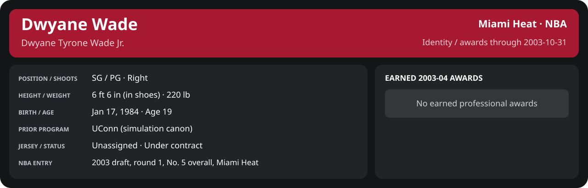

<!-- Generated by scripts/update_player_reports.py; edit source records, then rebuild. -->

# October 2003 | NBA regular season

[Career](../../../README.md) · [Professional identity](../../../Professional_Identity.md) · [Earned awards](../../../Awards.md) · [Stat definitions](../../../../../docs/player_statistics.md) · [Season](../../../Stats_and_Awards/2003-04/README.md) · [Miami](../../../Stats_and_Awards/Team/2003-04/10_October/Team_Stats.md) · [NBA players](../../../Stats_and_Awards/League/2003-04/10_October/League_Stats.md) · [NBA awards](../../../Stats_and_Awards/League/2003-04/10_October/League_Awards.md)

## Professional identity

| Player | Age on report date | Team / league | Position | Number | Status |
| --- | --- | --- | --- | --- | --- |
| Dwyane Tyrone Wade Jr. | 19 | Miami Heat / NBA | SG / PG | Not assigned | Under contract |

| Identity field | Recorded value |
| --- | --- |
| Birth date | 1984-01-17 |
| NBA entry | 2003 draft, round 1, No. 5 overall, Miami Heat |
| Prior program | UConn (simulation canon) |
| Height, in shoes / without shoes | 6 ft 6 in / 6 ft 4.75 in |
| Weight | 220 lb |
| Wingspan / standing reach | 6 ft 11.5 in / 8 ft 7.5 in |
| Shooting hand | Right |
| Contract | Rookie scale signed 2003-07-21: three seasons plus a 2006-07 team option |
| Role | Rotation; staff plan 20 minutes |
| NBA debut | October 28, 2003 at Philadelphia 76ers (2003-04/06_Regular_Season/10_October/Week_4/Game_1.md) |
| Nationality | United States (born in the Chicago area; Robbins, Illinois home community, per the player profile) |
| National team | No selection recorded |
| National-team eligibility | Not verified |
| Availability | No current restriction recorded in the established profile |
| Physical measurements recorded | 2003-06-25 |
| Professional status effective | 2003-10-28 |

Identity as of 2003-10-31; status snapshot dated 2003-10-28. User-established alternate-history player; historical Wade's biography and results are not this record.

### Earned 2003-04 awards

No 2003-04 awards yet.

## Statistics

As of **2003-10-31**: 3 closed games; 3/3 have player participation and box coverage; recorded DNPs: 0.

G counts appearances; GS counts recorded starts. DNPs, scheduled games and canceled games do not enter per-game denominators.

### Per game

  

[Shooting detail](../../../Stats_and_Awards/Shooting.md) · [Current contract](../../../Stats_and_Awards/Contract.md#current-contract) · [Contract history](../../../Stats_and_Awards/Contract.md#contract-history) · [Annual award record](../../../Stats_and_Awards/Awards.md)

| Scope | Age | Team | Lg | Pos | G | GS | MP | FG | FGA | FG% | 3P | 3PA | 3P% | 2P | 2PA | 2P% | eFG% | FT | FTA | FT% | ORB | DRB | TRB | AST | STL | BLK | TOV | PF | PTS | TS% (est.) | Awards |
| --- | --- | --- | --- | --- | --- | --- | --- | --- | --- | --- | --- | --- | --- | --- | --- | --- | --- | --- | --- | --- | --- | --- | --- | --- | --- | --- | --- | --- | --- | --- | --- |
| This scope | 19 | Miami Heat | NBA | SG / PG | 3 | 0 | 19.4 | 2.7 | 5.7 | .471 | 0.3 | 1.0 | .333 | 2.3 | 4.7 | .500 | .500 | 3.7 | 3.7 | 1.000 | 1.7 | 1.0 | 2.7 | 1.7 | 1.0 | 0.3 | 0.3 | 1.0 | 9.3 | .641 | — |

G and GS are counts; MP and counting statistics are **per appearance**. Shooting uses **.500 = 50.0%**. Age is at the row's cutoff. Scroll horizontally for every column.

Awards are confirmed through 2005-01-03, filed by the honor's period-end date; the banner shows career awards known at the page's identity cutoff.

[Full statistical detail: totals, per 36, shooting, efficiency, splits and source games](../../../Stats_and_Awards/2003-04/10_October/Stat_Detail.md)

### Period summary

  

[Shooting detail](../../../Stats_and_Awards/Shooting.md) · [Current contract](../../../Stats_and_Awards/Contract.md#current-contract) · [Contract history](../../../Stats_and_Awards/Contract.md#contract-history) · [Annual award record](../../../Stats_and_Awards/Awards.md)

| Scope | Age | Team | Lg | Pos | G | GS | MP | FG | FGA | FG% | 3P | 3PA | 3P% | 2P | 2PA | 2P% | eFG% | FT | FTA | FT% | ORB | DRB | TRB | AST | STL | BLK | TOV | PF | PTS | TS% (est.) | Awards |
| --- | --- | --- | --- | --- | --- | --- | --- | --- | --- | --- | --- | --- | --- | --- | --- | --- | --- | --- | --- | --- | --- | --- | --- | --- | --- | --- | --- | --- | --- | --- | --- |
| [Week 3: 2003-10-15 to 2003-10-21](../../../Stats_and_Awards/2003-04/10_October/Week_3/README.md) | 19 | Miami Heat | NBA | SG / PG | 0 | N/A | N/A | N/A | N/A | N/A | N/A | N/A | N/A | N/A | N/A | N/A | N/A | N/A | N/A | N/A | N/A | N/A | N/A | N/A | N/A | N/A | N/A | N/A | N/A | N/A | — |
| [Week 4: 2003-10-22 to 2003-10-31](../../../Stats_and_Awards/2003-04/10_October/Week_4/README.md) | 19 | Miami Heat | NBA | SG / PG | 3 | 0 | 19.4 | 2.7 | 5.7 | .471 | 0.3 | 1.0 | .333 | 2.3 | 4.7 | .500 | .500 | 3.7 | 3.7 | 1.000 | 1.7 | 1.0 | 2.7 | 1.7 | 1.0 | 0.3 | 0.3 | 1.0 | 9.3 | .641 | — |

G and GS are counts; MP and counting statistics are **per appearance**. Shooting uses **.500 = 50.0%**. Age is at the row's cutoff. Scroll horizontally for every column.

Awards are confirmed through 2005-01-03, filed by the honor's period-end date; the banner shows career awards known at the page's identity cutoff.

### Period comparison

  

[Shooting detail](../../../Stats_and_Awards/Shooting.md) · [Current contract](../../../Stats_and_Awards/Contract.md#current-contract) · [Contract history](../../../Stats_and_Awards/Contract.md#contract-history) · [Annual award record](../../../Stats_and_Awards/Awards.md)

| Scope | Age | Team | Lg | Pos | G | GS | MP | FG | FGA | FG% | 3P | 3PA | 3P% | 2P | 2PA | 2P% | eFG% | FT | FTA | FT% | ORB | DRB | TRB | AST | STL | BLK | TOV | PF | PTS | TS% (est.) | Awards |
| --- | --- | --- | --- | --- | --- | --- | --- | --- | --- | --- | --- | --- | --- | --- | --- | --- | --- | --- | --- | --- | --- | --- | --- | --- | --- | --- | --- | --- | --- | --- | --- |
| October 2003 | 19 | Miami Heat | NBA | SG / PG | 3 | 0 | 19.4 | 2.7 | 5.7 | .471 | 0.3 | 1.0 | .333 | 2.3 | 4.7 | .500 | .500 | 3.7 | 3.7 | 1.000 | 1.7 | 1.0 | 2.7 | 1.7 | 1.0 | 0.3 | 0.3 | 1.0 | 9.3 | .641 | — |
| Season through this month | 19 | Miami Heat | NBA | SG / PG | 3 | 0 | 19.4 | 2.7 | 5.7 | .471 | 0.3 | 1.0 | .333 | 2.3 | 4.7 | .500 | .500 | 3.7 | 3.7 | 1.000 | 1.7 | 1.0 | 2.7 | 1.7 | 1.0 | 0.3 | 0.3 | 1.0 | 9.3 | .641 | — |

G and GS are counts; MP and counting statistics are **per appearance**. Shooting uses **.500 = 50.0%**. Age is at the row's cutoff. Scroll horizontally for every column.

Awards are confirmed through 2005-01-03, filed by the honor's period-end date; the banner shows career awards known at the page's identity cutoff.

### Production

| Metric | Total | Per appearance | Per 36 minutes |
| --- | --- | --- | --- |
| MIN | 58.3 | 19.4 | 36.0 |
| PTS | 28 | 9.3 | 17.3 |
| OREB | 5 | 1.7 | 3.1 |
| DREB | 3 | 1.0 | 1.9 |
| REB | 8 | 2.7 | 4.9 |
| AST | 5 | 1.7 | 3.1 |
| STL | 3 | 1.0 | 1.9 |
| BLK | 1 | 0.3 | 0.6 |
| TOV | 1 | 0.3 | 0.6 |
| PF | 3 | 1.0 | 1.9 |
| FGM | 8 | 2.7 | 4.9 |
| FGA | 17 | 5.7 | 10.5 |
| 2PM | 7 | 2.3 | 4.3 |
| 2PA | 14 | 4.7 | 8.6 |
| 3PM | 1 | 0.3 | 0.6 |
| 3PA | 3 | 1.0 | 1.9 |
| FTM | 11 | 3.7 | 6.8 |
| FTA | 11 | 3.7 | 6.8 |
| FT points | 11 | 3.7 | 6.8 |

Per-36 rates standardize playing time; they are not a projection of playing 36 minutes. Use the actual minutes denominator in every competition.

### Shooting

| Shot type | Makes | Attempts | Percentage |
| --- | --- | --- | --- |
| All field goals | 8 | 17 | 47.1% |
| Two-pointers | 7 | 14 | 50.0% |
| Three-pointers | 1 | 3 | 33.3% |
| Free throws | 11 | 11 | 100.0% |

### Efficiency and shot selection

| Metric | Value | Calculation / unit |
| --- | --- | --- |
| eFG% | 50.0% | (FGM + 0.5 × 3PM) / FGA |
| TS% (estimated) | 64.1% | PTS / [2 × (FGA + 0.44 × FTA)] |
| Three-point attempt share | 17.6% | 3PA / FGA |
| Free-throw attempt rate | 0.647 | FTA / FGA; ratio |
| Assist / turnover ratio | 5.00 | AST / TOV; N/A at zero turnovers |
| Plus/minus total | N/A | Observed on-court score differential only |
| Double-doubles | 0 | At least 10 in any two of PTS, REB, AST, STL, BLK |
| Triple-doubles | 0 | At least 10 in any three; also included in double-doubles |

Percentages use pooled makes and attempts. TS% uses an estimated free-throw weighting, not exact scoring possessions. Rounding is display-only.

### Splits

  

[Shooting detail](../../../Stats_and_Awards/Shooting.md) · [Current contract](../../../Stats_and_Awards/Contract.md#current-contract) · [Contract history](../../../Stats_and_Awards/Contract.md#contract-history) · [Annual award record](../../../Stats_and_Awards/Awards.md)

| Scope | Age | Team | Lg | Pos | G | GS | MP | FG | FGA | FG% | 3P | 3PA | 3P% | 2P | 2PA | 2P% | eFG% | FT | FTA | FT% | ORB | DRB | TRB | AST | STL | BLK | TOV | PF | PTS | TS% (est.) | Awards |
| --- | --- | --- | --- | --- | --- | --- | --- | --- | --- | --- | --- | --- | --- | --- | --- | --- | --- | --- | --- | --- | --- | --- | --- | --- | --- | --- | --- | --- | --- | --- | --- |
| Home | 19 | Miami Heat | NBA | SG / PG | 1 | 0 | 18.3 | 5.0 | 7.0 | .714 | 1.0 | 1.0 | 1.000 | 4.0 | 6.0 | .667 | .786 | 5.0 | 5.0 | 1.000 | 2.0 | 1.0 | 3.0 | 1.0 | 0.0 | 0.0 | 1.0 | 0.0 | 16.0 | .870 | — |
| Away | 19 | Miami Heat | NBA | SG / PG | 2 | 0 | 20.0 | 1.5 | 5.0 | .300 | 0.0 | 1.0 | .000 | 1.5 | 4.0 | .375 | .300 | 3.0 | 3.0 | 1.000 | 1.5 | 1.0 | 2.5 | 2.0 | 1.5 | 0.5 | 0.0 | 1.5 | 6.0 | .475 | — |
| Neutral | 19 | Miami Heat | NBA | SG / PG | 0 | N/A | N/A | N/A | N/A | N/A | N/A | N/A | N/A | N/A | N/A | N/A | N/A | N/A | N/A | N/A | N/A | N/A | N/A | N/A | N/A | N/A | N/A | N/A | N/A | N/A | — |
| Wins | 19 | Miami Heat | NBA | SG / PG | 1 | 0 | 21.5 | 2.0 | 6.0 | .333 | 0.0 | 2.0 | .000 | 2.0 | 4.0 | .500 | .333 | 4.0 | 4.0 | 1.000 | 0.0 | 0.0 | 0.0 | 3.0 | 2.0 | 1.0 | 0.0 | 2.0 | 8.0 | .515 | — |
| Losses | 19 | Miami Heat | NBA | SG / PG | 2 | 0 | 18.4 | 3.0 | 5.5 | .545 | 0.5 | 0.5 | 1.000 | 2.5 | 5.0 | .500 | .591 | 3.5 | 3.5 | 1.000 | 2.5 | 1.5 | 4.0 | 1.0 | 0.5 | 0.0 | 0.5 | 0.5 | 10.0 | .710 | — |
| Team: Miami Heat | 19 | Miami Heat | NBA | SG / PG | 3 | 0 | 19.4 | 2.7 | 5.7 | .471 | 0.3 | 1.0 | .333 | 2.3 | 4.7 | .500 | .500 | 3.7 | 3.7 | 1.000 | 1.7 | 1.0 | 2.7 | 1.7 | 1.0 | 0.3 | 0.3 | 1.0 | 9.3 | .641 | — |

G and GS are counts; MP and counting statistics are **per appearance**. Shooting uses **.500 = 50.0%**. Age is at the row's cutoff. Scroll horizontally for every column.

Awards are confirmed through 2005-01-03, filed by the honor's period-end date; the banner shows career awards known at the page's identity cutoff.

Splits overlap and are not additive. Each row has its own appearance denominator; games with unknown result classification are excluded from win/loss splits.

### Game highs

| Metric | High | Date / opponent (all ties) |
| --- | --- | --- |
| PTS | 16 | [2003-10-31 vs Detroit Pistons](Week_4/Game_3.md) |
| REB | 5 | [2003-10-28 at Philadelphia 76ers](Week_4/Game_1.md) |
| AST | 3 | [2003-10-29 at Boston Celtics](Week_4/Game_2.md) |
| STL | 2 | [2003-10-29 at Boston Celtics](Week_4/Game_2.md) |
| BLK | 1 | [2003-10-29 at Boston Celtics](Week_4/Game_2.md) |
| TOV | 1 | [2003-10-31 vs Detroit Pistons](Week_4/Game_3.md) |

### Game log

| Date / source | Opponent | Venue | Result | Participation | MIN | PTS | REB | AST | STL | BLK | TOV |
| --- | --- | --- | --- | --- | --- | --- | --- | --- | --- | --- | --- |
| [2003-10-28](Week_4/Game_1.md) | Philadelphia 76ers | away | L 111-114 | Played | 18.4 | 4 | 5 | 1 | 1 | 0 | 0 |
| [2003-10-29](Week_4/Game_2.md) | Boston Celtics | away | W 107-91 | Played | 21.5 | 8 | 0 | 3 | 2 | 1 | 0 |
| [2003-10-31](Week_4/Game_3.md) | Detroit Pistons | home | L 100-105 | Played | 18.3 | 16 | 3 | 1 | 0 | 0 | 1 |

### Individual game boxes

| Scope | Age | Team | Lg | Pos | G | GS | MP | FG | FGA | FG% | 3P | 3PA | 3P% | 2P | 2PA | 2P% | eFG% | FT | FTA | FT% | ORB | DRB | TRB | AST | STL | BLK | TOV | PF | PTS | TS% (est.) | Awards |
| --- | --- | --- | --- | --- | --- | --- | --- | --- | --- | --- | --- | --- | --- | --- | --- | --- | --- | --- | --- | --- | --- | --- | --- | --- | --- | --- | --- | --- | --- | --- | --- |
| [2003-10-28](Week_4/Game_1.md) | 19 | Miami Heat | NBA | SG / PG | 1 | 0 | 18.4 | 1.0 | 4.0 | .250 | 0.0 | 0.0 | N/A | 1.0 | 4.0 | .250 | .250 | 2.0 | 2.0 | 1.000 | 3.0 | 2.0 | 5.0 | 1.0 | 1.0 | 0.0 | 0.0 | 1.0 | 4.0 | .410 | — |
| [2003-10-29](Week_4/Game_2.md) | 19 | Miami Heat | NBA | SG / PG | 1 | 0 | 21.5 | 2.0 | 6.0 | .333 | 0.0 | 2.0 | .000 | 2.0 | 4.0 | .500 | .333 | 4.0 | 4.0 | 1.000 | 0.0 | 0.0 | 0.0 | 3.0 | 2.0 | 1.0 | 0.0 | 2.0 | 8.0 | .515 | — |
| [2003-10-31](Week_4/Game_3.md) | 19 | Miami Heat | NBA | SG / PG | 1 | 0 | 18.3 | 5.0 | 7.0 | .714 | 1.0 | 1.0 | 1.000 | 4.0 | 6.0 | .667 | .786 | 5.0 | 5.0 | 1.000 | 2.0 | 1.0 | 3.0 | 1.0 | 0.0 | 0.0 | 1.0 | 0.0 | 16.0 | .870 | — |

G and GS are counts; MP and counting statistics are **per appearance**. Shooting uses **.500 = 50.0%**. Age is at the row's cutoff. Scroll horizontally for every column.

Awards are confirmed through 2005-01-03, filed by the honor's period-end date; the banner shows career awards known at the page's identity cutoff.

### Game shooting detail

| Date / source | FG | 2P | 3P | FT | eFG% | TS% (est.) | +/- | PF |
| --- | --- | --- | --- | --- | --- | --- | --- | --- |
| [2003-10-28](Week_4/Game_1.md) | 1/4 | 1/4 | 0/0 | 2/2 | 25.0% | 41.0% | N/A | 1 |
| [2003-10-29](Week_4/Game_2.md) | 2/6 | 2/4 | 0/2 | 4/4 | 33.3% | 51.5% | N/A | 2 |
| [2003-10-31](Week_4/Game_3.md) | 5/7 | 4/6 | 1/1 | 5/5 | 78.6% | 87.0% | N/A | 0 |

### Additional data needed

| Statistic family | Current support | Required evidence |
| --- | --- | --- |
| Starts; plus/minus | N/A unless supplied in the player box | Explicit started and plus_minus fields |
| Per 100 possessions; offensive / defensive / net rating | Unavailable in current box feed | Player on-court possessions and both teams' scoring during those possessions |
| USG%; AST%; OREB%, DREB%, REB% | Unavailable in current box feed | Matching player/team/opponent opportunity counts and a declared method |
| Rim, paint, midrange, corner / above-break threes | Unavailable in current box feed | Shot locations, attempts and makes |
| Drives, touches, catch-and-shoot, pull-ups, play types | Unavailable in current box feed | Tracking or tagged play-by-play |
| Clutch, on/off, lineup combinations, assisted baskets | Unavailable in current box feed | Timed events, score state, substitutions and possession attribution |
| Deflections, charges, contested shots, box outs | Unavailable in current box feed | Observed hustle/defensive events |
| League rank, percentile, relative TS%; impact models | Not derived by this report | Same-period simulated league baseline, eligibility rules and documented model |
