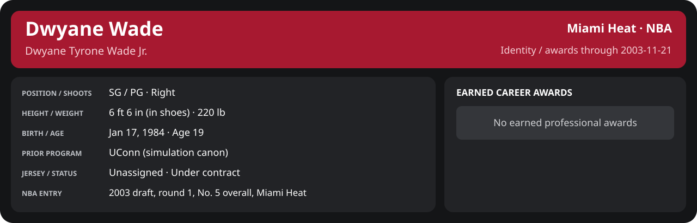

# November Week 3 Game 4

Player identity and statistics are generated here by `python scripts/update_player_reports.py`.
Decisions remain in the owning phase/week note. A scheduled game has no statistical result.

Miami's injured list for this game: Caron Butler, Udonis Haslem, John Wallace (`00_Team/Transactions/injured_list.json`; twelve dress).

<!-- game-result:start -->
## Result

**Miami Heat 92 at Golden State Warriors 103** · Miami Heat L 92-103 vs Golden State Warriors · away (Golden State Warriors) · 2003-11-21

Event `2003-11-21-miami-heat-at-golden-state-warriors` · Railway engine (runtime/private_service.py) · result file [`Game_4.result.json`](Game_4.result.json) (the engine's answer as served; the note is the canonical record).

### Box score

```text
Miami Heat 92 at Golden State Warriors 103
2003-11-21  2003-04 regular  event 2003-11-21-miami-heat-at-golden-state-warriors
Kernel 2003.10, calibrated on 2002-03 (imported_source)

Period      1    2    3    4     T
Miami He   17   28   17   30    92
Golden S   31   26   18   28   103

Miami Heat
                           MIN  PTS   FG      3P     FT    OR  DR AST STL BLK  TO  PF
Mike James                41.6   11   4-11   1-6    2-3     0   4   7   1   0   3   1
Dwyane Wade               42.4   27   8-12   0-0   11-11    2   4   4   2   1   2   4
Scott Padgett             23.1    2   1-4    0-1    0-0     2   6   0   2   0   1   5
Brian Grant               22.6   20   9-10   0-0    2-2     1   3   1   0   0   1   5
Shawn Kemp                25.4    2   1-8    0-0    0-2     2   4   1   2   0   1   2
Stephen Jackson           21.7   12   4-7    0-0    4-6     0   0   2   1   1   4   2
Eddie Jones               18.1    3   1-5    0-2    1-4     1   2   0   1   0   2   1
Cherokee Parks            14.5    1   0-1    0-0    1-2     0   1   0   0   1   0   1
Rasual Butler             11.8    4   2-7    0-3    0-0     0   0   0   0   0   2   1
LaPhonso Ellis             7.1    3   1-2    1-1    0-0     1   3   0   0   1   0   1
Anthony Carter             9.1    4   1-4    0-0    2-2     0   0   2   1   0   1   2
Sean Lampley               2.6    3   1-1    1-1    0-0     0   1   0   0   0   0   0
TEAM                     240.0   92  33-72   3-14  23-32    9  28  17  10   4  18  25
  Includes 1 team turnover(s) not charged to an individual.

Golden State Warriors
                           MIN  PTS   FG      3P     FT    OR  DR AST STL BLK  TO  PF
Jason Richardson          38.6   12   4-13   0-3    4-5     1   3   2   0   0   2   3
Clifford Robinson         34.2   16   5-10   3-3    3-3     2   3   2   2   0   2   5
Erick Dampier             33.8   15   6-15   0-0    3-5    11   8   1   0   0   3   1
Nick Van Exel             31.8    9   4-9    1-3    0-0     0   3   6   1   0   2   1
Mike Dunleavy             32.7   22   7-15   2-5    6-8     2   4   4   3   0   4   4
Speedy Claxton            26.2   10   5-6    0-0    0-0     0   4   4   3   1   1   3
Calbert Cheaney           25.6   13   5-14   0-0    3-4     1   3   2   0   1   1   1
Brian Cardinal            17.0    6   2-4    0-1    2-2     1   2   3   1   0   0   4
TEAM                     240.0  103  38-86   6-15  21-27   18  30  24  10   2  15  22
```

### Miami injuries

No Miami injury was drawn in this game.
<!-- game-result:end -->

<!-- player-report:start -->
## Professional identity



| Player | Age on report date | Team / league | Position | Number | Status |
| --- | --- | --- | --- | --- | --- |
| Dwyane Tyrone Wade Jr. | 19 | Miami Heat / NBA | SG / PG | Not assigned | Under contract |

| Identity field | Recorded value |
| --- | --- |
| Birth date | 1984-01-17 |
| NBA entry | 2003 draft, round 1, No. 5 overall, Miami Heat |
| Prior program | UConn (simulation canon) |
| Height, in shoes / without shoes | 6 ft 6 in / 6 ft 4.75 in |
| Weight | 220 lb |
| Wingspan / standing reach | 6 ft 11.5 in / 8 ft 7.5 in |
| Shooting hand | Right |
| Contract | Rookie scale signed 2003-07-21: three seasons plus a 2006-07 team option |
| Role | Starter; staff plan 34 minutes |
| NBA debut | October 28, 2003 at Philadelphia 76ers (2003-04/06_Regular_Season/10_October/Week_4/Game_1.md) |
| Nationality | Not recorded |
| National team | No selection recorded |
| National-team eligibility | Not verified |
| Availability | No current restriction recorded in the established profile |
| Physical measurements recorded | 2003-06-25 |
| Professional status effective | 2003-11-07 |

Identity as of 2003-11-21; status snapshot dated 2003-11-07. User-established alternate-history player; historical Wade's biography and results are not this record.

### Earned career awards

No earned professional awards recorded by this page's identity cutoff.

## Statistics

As of **2003-11-21**: 1 closed games; 1/1 have player participation and box coverage; recorded DNPs: 0.

G counts appearances; GS counts recorded starts. DNPs, scheduled games and canceled games do not enter per-game denominators.

### Per game

[](../../../../Stats_and_Awards/player_cards.html?period=regular-2003-04-game-b147c14b8e114c40#shooting) [](../../../../Stats_and_Awards/player_cards.html#contract) [](../../../../Stats_and_Awards/player_cards.html#awards)

[Shooting detail](../../../../Stats_and_Awards/Shooting.md) · [Current contract](../../../../Stats_and_Awards/Contract.md#current-contract) · [Contract history](../../../../Stats_and_Awards/Contract.md#contract-history) · [Annual award record](../../../../Stats_and_Awards/Awards.md)

| Scope | Age | Team | Lg | Pos | G | GS | MP | FG | FGA | FG% | 3P | 3PA | 3P% | 2P | 2PA | 2P% | eFG% | FT | FTA | FT% | ORB | DRB | TRB | AST | STL | BLK | TOV | PF | PTS | TS% (est.) | Awards |
| --- | --- | --- | --- | --- | --- | --- | --- | --- | --- | --- | --- | --- | --- | --- | --- | --- | --- | --- | --- | --- | --- | --- | --- | --- | --- | --- | --- | --- | --- | --- | --- |
| This game | 19 | Miami Heat | NBA | SG / PG | 1 | 1 | 42.4 | 8.0 | 12.0 | .667 | 0.0 | 0.0 | N/A | 8.0 | 12.0 | .667 | .667 | 11.0 | 11.0 | 1.000 | 2.0 | 4.0 | 6.0 | 4.0 | 2.0 | 1.0 | 2.0 | 4.0 | 27.0 | .802 | — |

G and GS are counts; MP and counting statistics are **per appearance**. Shooting uses **.500 = 50.0%**. Age is at the row's cutoff. Scroll horizontally for every column.

Awards are confirmed through 2003-12-22, filed by the honor's period-end date; the banner shows career awards known at the page's identity cutoff.

### Production

| Metric | Total | Per appearance | Per 36 minutes |
| --- | --- | --- | --- |
| MIN | 42.4 | 42.4 | 36.0 |
| PTS | 27 | 27.0 | 22.9 |
| OREB | 2 | 2.0 | 1.7 |
| DREB | 4 | 4.0 | 3.4 |
| REB | 6 | 6.0 | 5.1 |
| AST | 4 | 4.0 | 3.4 |
| STL | 2 | 2.0 | 1.7 |
| BLK | 1 | 1.0 | 0.8 |
| TOV | 2 | 2.0 | 1.7 |
| PF | 4 | 4.0 | 3.4 |
| FGM | 8 | 8.0 | 6.8 |
| FGA | 12 | 12.0 | 10.2 |
| 2PM | 8 | 8.0 | 6.8 |
| 2PA | 12 | 12.0 | 10.2 |
| 3PM | 0 | 0.0 | 0.0 |
| 3PA | 0 | 0.0 | 0.0 |
| FTM | 11 | 11.0 | 9.3 |
| FTA | 11 | 11.0 | 9.3 |
| FT points | 11 | 11.0 | 9.3 |

Per-36 rates standardize playing time; they are not a projection of playing 36 minutes. Use the actual minutes denominator in every competition.

### Shooting

| Shot type | Makes | Attempts | Percentage |
| --- | --- | --- | --- |
| All field goals | 8 | 12 | 66.7% |
| Two-pointers | 8 | 12 | 66.7% |
| Three-pointers | 0 | 0 | N/A |
| Free throws | 11 | 11 | 100.0% |

### Efficiency and shot selection

| Metric | Value | Calculation / unit |
| --- | --- | --- |
| eFG% | 66.7% | (FGM + 0.5 × 3PM) / FGA |
| TS% (estimated) | 80.2% | PTS / [2 × (FGA + 0.44 × FTA)] |
| Three-point attempt share | 0.0% | 3PA / FGA |
| Free-throw attempt rate | 0.917 | FTA / FGA; ratio |
| Assist / turnover ratio | 2.00 | AST / TOV; N/A at zero turnovers |
| Plus/minus total | N/A | Observed on-court score differential only |
| Double-doubles | 0 | At least 10 in any two of PTS, REB, AST, STL, BLK |
| Triple-doubles | 0 | At least 10 in any three; also included in double-doubles |

Percentages use pooled makes and attempts. TS% uses an estimated free-throw weighting, not exact scoring possessions. Rounding is display-only.

### Splits

[](../../../../Stats_and_Awards/player_cards.html?period=regular-2003-04-week-2003-11-15#shooting) [](../../../../Stats_and_Awards/player_cards.html#contract) [](../../../../Stats_and_Awards/player_cards.html#awards)

[Shooting detail](../../../../Stats_and_Awards/Shooting.md) · [Current contract](../../../../Stats_and_Awards/Contract.md#current-contract) · [Contract history](../../../../Stats_and_Awards/Contract.md#contract-history) · [Annual award record](../../../../Stats_and_Awards/Awards.md)

| Scope | Age | Team | Lg | Pos | G | GS | MP | FG | FGA | FG% | 3P | 3PA | 3P% | 2P | 2PA | 2P% | eFG% | FT | FTA | FT% | ORB | DRB | TRB | AST | STL | BLK | TOV | PF | PTS | TS% (est.) | Awards |
| --- | --- | --- | --- | --- | --- | --- | --- | --- | --- | --- | --- | --- | --- | --- | --- | --- | --- | --- | --- | --- | --- | --- | --- | --- | --- | --- | --- | --- | --- | --- | --- |
| Home | 19 | Miami Heat | NBA | SG / PG | 0 | N/A | N/A | N/A | N/A | N/A | N/A | N/A | N/A | N/A | N/A | N/A | N/A | N/A | N/A | N/A | N/A | N/A | N/A | N/A | N/A | N/A | N/A | N/A | N/A | N/A | — |
| Away | 19 | Miami Heat | NBA | SG / PG | 1 | 1 | 42.4 | 8.0 | 12.0 | .667 | 0.0 | 0.0 | N/A | 8.0 | 12.0 | .667 | .667 | 11.0 | 11.0 | 1.000 | 2.0 | 4.0 | 6.0 | 4.0 | 2.0 | 1.0 | 2.0 | 4.0 | 27.0 | .802 | — |
| Neutral | 19 | Miami Heat | NBA | SG / PG | 0 | N/A | N/A | N/A | N/A | N/A | N/A | N/A | N/A | N/A | N/A | N/A | N/A | N/A | N/A | N/A | N/A | N/A | N/A | N/A | N/A | N/A | N/A | N/A | N/A | N/A | — |
| Wins | 19 | Miami Heat | NBA | SG / PG | 0 | N/A | N/A | N/A | N/A | N/A | N/A | N/A | N/A | N/A | N/A | N/A | N/A | N/A | N/A | N/A | N/A | N/A | N/A | N/A | N/A | N/A | N/A | N/A | N/A | N/A | — |
| Losses | 19 | Miami Heat | NBA | SG / PG | 1 | 1 | 42.4 | 8.0 | 12.0 | .667 | 0.0 | 0.0 | N/A | 8.0 | 12.0 | .667 | .667 | 11.0 | 11.0 | 1.000 | 2.0 | 4.0 | 6.0 | 4.0 | 2.0 | 1.0 | 2.0 | 4.0 | 27.0 | .802 | — |
| Team: Miami Heat | 19 | Miami Heat | NBA | SG / PG | 1 | 1 | 42.4 | 8.0 | 12.0 | .667 | 0.0 | 0.0 | N/A | 8.0 | 12.0 | .667 | .667 | 11.0 | 11.0 | 1.000 | 2.0 | 4.0 | 6.0 | 4.0 | 2.0 | 1.0 | 2.0 | 4.0 | 27.0 | .802 | — |

G and GS are counts; MP and counting statistics are **per appearance**. Shooting uses **.500 = 50.0%**. Age is at the row's cutoff. Scroll horizontally for every column.

Awards are confirmed through 2003-12-22, filed by the honor's period-end date; the banner shows career awards known at the page's identity cutoff.

Splits overlap and are not additive. Each row has its own appearance denominator; games with unknown result classification are excluded from win/loss splits.

### Game highs

| Metric | High | Date / opponent (all ties) |
| --- | --- | --- |
| PTS | 27 | [2003-11-21 at Golden State Warriors](Game_4.md) |
| REB | 6 | [2003-11-21 at Golden State Warriors](Game_4.md) |
| AST | 4 | [2003-11-21 at Golden State Warriors](Game_4.md) |
| STL | 2 | [2003-11-21 at Golden State Warriors](Game_4.md) |
| BLK | 1 | [2003-11-21 at Golden State Warriors](Game_4.md) |
| TOV | 2 | [2003-11-21 at Golden State Warriors](Game_4.md) |

### Game log

| Date / source | Opponent | Venue | Result | Participation | MIN | PTS | REB | AST | STL | BLK | TOV |
| --- | --- | --- | --- | --- | --- | --- | --- | --- | --- | --- | --- |
| [2003-11-21](Game_4.md) | Golden State Warriors | away | L 92-103 | Played | 42.4 | 27 | 6 | 4 | 2 | 1 | 2 |

### Game shooting detail

| Date / source | FG | 2P | 3P | FT | eFG% | TS% (est.) | +/- | PF |
| --- | --- | --- | --- | --- | --- | --- | --- | --- |
| [2003-11-21](Game_4.md) | 8/12 | 8/12 | 0/0 | 11/11 | 66.7% | 80.2% | N/A | 4 |

### Additional data needed

| Statistic family | Current support | Required evidence |
| --- | --- | --- |
| Starts; plus/minus | N/A unless supplied in the player box | Explicit started and plus_minus fields |
| Per 100 possessions; offensive / defensive / net rating | Unavailable in current box feed | Player on-court possessions and both teams' scoring during those possessions |
| USG%; AST%; OREB%, DREB%, REB% | Unavailable in current box feed | Matching player/team/opponent opportunity counts and a declared method |
| Rim, paint, midrange, corner / above-break threes | Unavailable in current box feed | Shot locations, attempts and makes |
| Drives, touches, catch-and-shoot, pull-ups, play types | Unavailable in current box feed | Tracking or tagged play-by-play |
| Clutch, on/off, lineup combinations, assisted baskets | Unavailable in current box feed | Timed events, score state, substitutions and possession attribution |
| Deflections, charges, contested shots, box outs | Unavailable in current box feed | Observed hustle/defensive events |
| League rank, percentile, relative TS%; impact models | Not derived by this report | Same-period simulated league baseline, eligibility rules and documented model |

<!-- player-report:end -->
