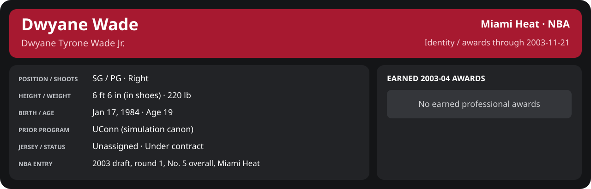

<!-- Generated by scripts/update_player_reports.py; edit source records, then rebuild. -->

# Week 3: 2003-11-15 to 2003-11-21

[Career](../../../../README.md) · [Professional identity](../../../../Professional_Identity.md) · [Earned awards](../../../../Awards.md) · [Stat definitions](../../../../../../docs/player_statistics.md) · [Month](../../../../Stats_and_Awards/2003-04/11_November/README.md) · [Miami](../../../../Stats_and_Awards/Team/2003-04/11_November/Week_3/Team_Stats.md) · [NBA players](../../../../Stats_and_Awards/League/2003-04/11_November/Week_3/League_Stats.md) · [NBA awards](../../../../Stats_and_Awards/League/2003-04/11_November/Week_3/League_Awards.md) · [Period decisions](note.md) · [Previous week](../../../../Stats_and_Awards/2003-04/11_November/Week_2/README.md) · [Next week](../../../../Stats_and_Awards/2003-04/11_November/Week_4/README.md)

## Professional identity

| Player | Age on report date | Team / league | Position | Number | Status |
| --- | --- | --- | --- | --- | --- |
| Dwyane Tyrone Wade Jr. | 19 | Miami Heat / NBA | SG / PG | Not assigned | Under contract |

| Identity field | Recorded value |
| --- | --- |
| Birth date | 1984-01-17 |
| NBA entry | 2003 draft, round 1, No. 5 overall, Miami Heat |
| Prior program | UConn (simulation canon) |
| Height, in shoes / without shoes | 6 ft 6 in / 6 ft 4.75 in |
| Weight | 220 lb |
| Wingspan / standing reach | 6 ft 11.5 in / 8 ft 7.5 in |
| Shooting hand | Right |
| Contract | Rookie scale signed 2003-07-21: three seasons plus a 2006-07 team option |
| Role | Starter; staff plan 34 minutes |
| NBA debut | October 28, 2003 at Philadelphia 76ers (2003-04/06_Regular_Season/10_October/Week_4/Game_1.md) |
| Nationality | United States (born in the Chicago area; Robbins, Illinois home community, per the player profile) |
| National team | No selection recorded |
| National-team eligibility | Not verified |
| Availability | No current restriction recorded in the established profile |
| Physical measurements recorded | 2003-06-25 |
| Professional status effective | 2003-11-07 |

Identity as of 2003-11-21; status snapshot dated 2003-11-07. User-established alternate-history player; historical Wade's biography and results are not this record.

### Earned 2003-04 awards

No 2003-04 awards yet.

## Statistics

As of **2003-11-21**: 4 closed games; 4/4 have player participation and box coverage; recorded DNPs: 0.

G counts appearances; GS counts recorded starts. DNPs, scheduled games and canceled games do not enter per-game denominators.

### Per game

  

[Shooting detail](../../../../Stats_and_Awards/Shooting.md) · [Current contract](../../../../Stats_and_Awards/Contract.md#current-contract) · [Contract history](../../../../Stats_and_Awards/Contract.md#contract-history) · [Annual award record](../../../../Stats_and_Awards/Awards.md)

| Scope | Age | Team | Lg | Pos | G | GS | MP | FG | FGA | FG% | 3P | 3PA | 3P% | 2P | 2PA | 2P% | eFG% | FT | FTA | FT% | ORB | DRB | TRB | AST | STL | BLK | TOV | PF | PTS | TS% (est.) | Awards |
| --- | --- | --- | --- | --- | --- | --- | --- | --- | --- | --- | --- | --- | --- | --- | --- | --- | --- | --- | --- | --- | --- | --- | --- | --- | --- | --- | --- | --- | --- | --- | --- |
| This scope | 19 | Miami Heat | NBA | SG / PG | 4 | 4 | 38.0 | 7.2 | 12.5 | .580 | 0.0 | 1.0 | .000 | 7.2 | 11.5 | .630 | .580 | 6.2 | 6.2 | 1.000 | 1.2 | 3.0 | 4.2 | 4.2 | 1.5 | 0.8 | 1.8 | 3.2 | 20.8 | .680 | — |

G and GS are counts; MP and counting statistics are **per appearance**. Shooting uses **.500 = 50.0%**. Age is at the row's cutoff. Scroll horizontally for every column.

Awards are confirmed through 2004-10-06, filed by the honor's period-end date; the banner shows career awards known at the page's identity cutoff.

[Full statistical detail: totals, per 36, shooting, efficiency, splits and source games](../../../../Stats_and_Awards/2003-04/11_November/Week_3/Stat_Detail.md)

### Period comparison

  

[Shooting detail](../../../../Stats_and_Awards/Shooting.md) · [Current contract](../../../../Stats_and_Awards/Contract.md#current-contract) · [Contract history](../../../../Stats_and_Awards/Contract.md#contract-history) · [Annual award record](../../../../Stats_and_Awards/Awards.md)

| Scope | Age | Team | Lg | Pos | G | GS | MP | FG | FGA | FG% | 3P | 3PA | 3P% | 2P | 2PA | 2P% | eFG% | FT | FTA | FT% | ORB | DRB | TRB | AST | STL | BLK | TOV | PF | PTS | TS% (est.) | Awards |
| --- | --- | --- | --- | --- | --- | --- | --- | --- | --- | --- | --- | --- | --- | --- | --- | --- | --- | --- | --- | --- | --- | --- | --- | --- | --- | --- | --- | --- | --- | --- | --- |
| This week | 19 | Miami Heat | NBA | SG / PG | 4 | 4 | 38.0 | 7.2 | 12.5 | .580 | 0.0 | 1.0 | .000 | 7.2 | 11.5 | .630 | .580 | 6.2 | 6.2 | 1.000 | 1.2 | 3.0 | 4.2 | 4.2 | 1.5 | 0.8 | 1.8 | 3.2 | 20.8 | .680 | — |
| [Previous week](../../../../Stats_and_Awards/2003-04/11_November/Week_2/README.md) | 19 | Miami Heat | NBA | SG / PG | 4 | 4 | 35.0 | 6.0 | 11.0 | .545 | 1.2 | 3.0 | .417 | 4.8 | 8.0 | .594 | .602 | 1.5 | 2.0 | .750 | 1.5 | 4.5 | 6.0 | 5.8 | 1.0 | 0.8 | 1.0 | 3.0 | 14.8 | .621 | — |
| Month through this week | 19 | Miami Heat | NBA | SG / PG | 10 | 8 | 33.1 | 5.8 | 11.0 | .527 | 0.7 | 2.5 | .280 | 5.1 | 8.5 | .600 | .559 | 3.9 | 4.1 | .951 | 1.2 | 3.5 | 4.7 | 4.2 | 1.3 | 0.7 | 1.3 | 2.9 | 16.2 | .633 | — |
| Season through this week | 19 | Miami Heat | NBA | SG / PG | 13 | 8 | 30.0 | 5.1 | 9.8 | .520 | 0.6 | 2.2 | .286 | 4.5 | 7.6 | .586 | .551 | 3.8 | 4.0 | .962 | 1.3 | 2.9 | 4.2 | 3.6 | 1.2 | 0.6 | 1.1 | 2.5 | 14.6 | .634 | — |

G and GS are counts; MP and counting statistics are **per appearance**. Shooting uses **.500 = 50.0%**. Age is at the row's cutoff. Scroll horizontally for every column.

Awards are confirmed through 2004-10-06, filed by the honor's period-end date; the banner shows career awards known at the page's identity cutoff.

### Production

| Metric | Total | Per appearance | Per 36 minutes |
| --- | --- | --- | --- |
| MIN | 151.9 | 38.0 | 36.0 |
| PTS | 83 | 20.8 | 19.7 |
| OREB | 5 | 1.2 | 1.2 |
| DREB | 12 | 3.0 | 2.8 |
| REB | 17 | 4.2 | 4.0 |
| AST | 17 | 4.2 | 4.0 |
| STL | 6 | 1.5 | 1.4 |
| BLK | 3 | 0.8 | 0.7 |
| TOV | 7 | 1.8 | 1.7 |
| PF | 13 | 3.2 | 3.1 |
| FGM | 29 | 7.2 | 6.9 |
| FGA | 50 | 12.5 | 11.8 |
| 2PM | 29 | 7.2 | 6.9 |
| 2PA | 46 | 11.5 | 10.9 |
| 3PM | 0 | 0.0 | 0.0 |
| 3PA | 4 | 1.0 | 0.9 |
| FTM | 25 | 6.2 | 5.9 |
| FTA | 25 | 6.2 | 5.9 |
| FT points | 25 | 6.2 | 5.9 |

Per-36 rates standardize playing time; they are not a projection of playing 36 minutes. Use the actual minutes denominator in every competition.

### Shooting

| Shot type | Makes | Attempts | Percentage |
| --- | --- | --- | --- |
| All field goals | 29 | 50 | 58.0% |
| Two-pointers | 29 | 46 | 63.0% |
| Three-pointers | 0 | 4 | 0.0% |
| Free throws | 25 | 25 | 100.0% |

### Efficiency and shot selection

| Metric | Value | Calculation / unit |
| --- | --- | --- |
| eFG% | 58.0% | (FGM + 0.5 × 3PM) / FGA |
| TS% (estimated) | 68.0% | PTS / [2 × (FGA + 0.44 × FTA)] |
| Three-point attempt share | 8.0% | 3PA / FGA |
| Free-throw attempt rate | 0.500 | FTA / FGA; ratio |
| Assist / turnover ratio | 2.43 | AST / TOV; N/A at zero turnovers |
| Plus/minus total | N/A | Observed on-court score differential only |
| Double-doubles | 0 | At least 10 in any two of PTS, REB, AST, STL, BLK |
| Triple-doubles | 0 | At least 10 in any three; also included in double-doubles |

Percentages use pooled makes and attempts. TS% uses an estimated free-throw weighting, not exact scoring possessions. Rounding is display-only.

### Splits

  

[Shooting detail](../../../../Stats_and_Awards/Shooting.md) · [Current contract](../../../../Stats_and_Awards/Contract.md#current-contract) · [Contract history](../../../../Stats_and_Awards/Contract.md#contract-history) · [Annual award record](../../../../Stats_and_Awards/Awards.md)

| Scope | Age | Team | Lg | Pos | G | GS | MP | FG | FGA | FG% | 3P | 3PA | 3P% | 2P | 2PA | 2P% | eFG% | FT | FTA | FT% | ORB | DRB | TRB | AST | STL | BLK | TOV | PF | PTS | TS% (est.) | Awards |
| --- | --- | --- | --- | --- | --- | --- | --- | --- | --- | --- | --- | --- | --- | --- | --- | --- | --- | --- | --- | --- | --- | --- | --- | --- | --- | --- | --- | --- | --- | --- | --- |
| Home | 19 | Miami Heat | NBA | SG / PG | 0 | N/A | N/A | N/A | N/A | N/A | N/A | N/A | N/A | N/A | N/A | N/A | N/A | N/A | N/A | N/A | N/A | N/A | N/A | N/A | N/A | N/A | N/A | N/A | N/A | N/A | — |
| Away | 19 | Miami Heat | NBA | SG / PG | 4 | 4 | 38.0 | 7.2 | 12.5 | .580 | 0.0 | 1.0 | .000 | 7.2 | 11.5 | .630 | .580 | 6.2 | 6.2 | 1.000 | 1.2 | 3.0 | 4.2 | 4.2 | 1.5 | 0.8 | 1.8 | 3.2 | 20.8 | .680 | — |
| Neutral | 19 | Miami Heat | NBA | SG / PG | 0 | N/A | N/A | N/A | N/A | N/A | N/A | N/A | N/A | N/A | N/A | N/A | N/A | N/A | N/A | N/A | N/A | N/A | N/A | N/A | N/A | N/A | N/A | N/A | N/A | N/A | — |
| Wins | 19 | Miami Heat | NBA | SG / PG | 0 | N/A | N/A | N/A | N/A | N/A | N/A | N/A | N/A | N/A | N/A | N/A | N/A | N/A | N/A | N/A | N/A | N/A | N/A | N/A | N/A | N/A | N/A | N/A | N/A | N/A | — |
| Losses | 19 | Miami Heat | NBA | SG / PG | 4 | 4 | 38.0 | 7.2 | 12.5 | .580 | 0.0 | 1.0 | .000 | 7.2 | 11.5 | .630 | .580 | 6.2 | 6.2 | 1.000 | 1.2 | 3.0 | 4.2 | 4.2 | 1.5 | 0.8 | 1.8 | 3.2 | 20.8 | .680 | — |
| Team: Miami Heat | 19 | Miami Heat | NBA | SG / PG | 4 | 4 | 38.0 | 7.2 | 12.5 | .580 | 0.0 | 1.0 | .000 | 7.2 | 11.5 | .630 | .580 | 6.2 | 6.2 | 1.000 | 1.2 | 3.0 | 4.2 | 4.2 | 1.5 | 0.8 | 1.8 | 3.2 | 20.8 | .680 | — |

G and GS are counts; MP and counting statistics are **per appearance**. Shooting uses **.500 = 50.0%**. Age is at the row's cutoff. Scroll horizontally for every column.

Awards are confirmed through 2004-10-06, filed by the honor's period-end date; the banner shows career awards known at the page's identity cutoff.

Splits overlap and are not additive. Each row has its own appearance denominator; games with unknown result classification are excluded from win/loss splits.

### Game highs

| Metric | High | Date / opponent (all ties) |
| --- | --- | --- |
| PTS | 27 | [2003-11-21 at Golden State Warriors](Game_4.md) |
| REB | 6 | [2003-11-18 at Seattle SuperSonics](Game_2.md); [2003-11-21 at Golden State Warriors](Game_4.md) |
| AST | 5 | [2003-11-16 at Los Angeles Lakers](Game_1.md); [2003-11-19 at Portland Trail Blazers](Game_3.md) |
| STL | 2 | [2003-11-16 at Los Angeles Lakers](Game_1.md); [2003-11-21 at Golden State Warriors](Game_4.md) |
| BLK | 2 | [2003-11-18 at Seattle SuperSonics](Game_2.md) |
| TOV | 2 | [2003-11-16 at Los Angeles Lakers](Game_1.md); [2003-11-18 at Seattle SuperSonics](Game_2.md); [2003-11-21 at Golden State Warriors](Game_4.md) |

### Game log

| Date / source | Opponent | Venue | Result | Participation | MIN | PTS | REB | AST | STL | BLK | TOV |
| --- | --- | --- | --- | --- | --- | --- | --- | --- | --- | --- | --- |
| [2003-11-16](Game_1.md) | Los Angeles Lakers | away | L 103-115 | Played | 36.9 | 25 | 3 | 5 | 2 | 0 | 2 |
| [2003-11-18](Game_2.md) | Seattle SuperSonics | away | L 98-109 | Played | 37.5 | 13 | 6 | 3 | 1 | 2 | 2 |
| [2003-11-19](Game_3.md) | Portland Trail Blazers | away | L 99-110 | Played | 35.1 | 18 | 2 | 5 | 1 | 0 | 1 |
| [2003-11-21](Game_4.md) | Golden State Warriors | away | L 92-103 | Played | 42.4 | 27 | 6 | 4 | 2 | 1 | 2 |

### Individual game boxes

| Scope | Age | Team | Lg | Pos | G | GS | MP | FG | FGA | FG% | 3P | 3PA | 3P% | 2P | 2PA | 2P% | eFG% | FT | FTA | FT% | ORB | DRB | TRB | AST | STL | BLK | TOV | PF | PTS | TS% (est.) | Awards |
| --- | --- | --- | --- | --- | --- | --- | --- | --- | --- | --- | --- | --- | --- | --- | --- | --- | --- | --- | --- | --- | --- | --- | --- | --- | --- | --- | --- | --- | --- | --- | --- |
| [2003-11-16](Game_1.md) | 19 | Miami Heat | NBA | SG / PG | 1 | 1 | 36.9 | 10.0 | 17.0 | .588 | 0.0 | 2.0 | .000 | 10.0 | 15.0 | .667 | .588 | 5.0 | 5.0 | 1.000 | 1.0 | 2.0 | 3.0 | 5.0 | 2.0 | 0.0 | 2.0 | 3.0 | 25.0 | .651 | — |
| [2003-11-18](Game_2.md) | 19 | Miami Heat | NBA | SG / PG | 1 | 1 | 37.5 | 5.0 | 10.0 | .500 | 0.0 | 2.0 | .000 | 5.0 | 8.0 | .625 | .500 | 3.0 | 3.0 | 1.000 | 1.0 | 5.0 | 6.0 | 3.0 | 1.0 | 2.0 | 2.0 | 2.0 | 13.0 | .574 | — |
| [2003-11-19](Game_3.md) | 19 | Miami Heat | NBA | SG / PG | 1 | 1 | 35.1 | 6.0 | 11.0 | .545 | 0.0 | 0.0 | N/A | 6.0 | 11.0 | .545 | .545 | 6.0 | 6.0 | 1.000 | 1.0 | 1.0 | 2.0 | 5.0 | 1.0 | 0.0 | 1.0 | 4.0 | 18.0 | .660 | — |
| [2003-11-21](Game_4.md) | 19 | Miami Heat | NBA | SG / PG | 1 | 1 | 42.4 | 8.0 | 12.0 | .667 | 0.0 | 0.0 | N/A | 8.0 | 12.0 | .667 | .667 | 11.0 | 11.0 | 1.000 | 2.0 | 4.0 | 6.0 | 4.0 | 2.0 | 1.0 | 2.0 | 4.0 | 27.0 | .802 | — |

G and GS are counts; MP and counting statistics are **per appearance**. Shooting uses **.500 = 50.0%**. Age is at the row's cutoff. Scroll horizontally for every column.

Awards are confirmed through 2004-10-06, filed by the honor's period-end date; the banner shows career awards known at the page's identity cutoff.

### Game shooting detail

| Date / source | FG | 2P | 3P | FT | eFG% | TS% (est.) | +/- | PF |
| --- | --- | --- | --- | --- | --- | --- | --- | --- |
| [2003-11-16](Game_1.md) | 10/17 | 10/15 | 0/2 | 5/5 | 58.8% | 65.1% | N/A | 3 |
| [2003-11-18](Game_2.md) | 5/10 | 5/8 | 0/2 | 3/3 | 50.0% | 57.4% | N/A | 2 |
| [2003-11-19](Game_3.md) | 6/11 | 6/11 | 0/0 | 6/6 | 54.5% | 66.0% | N/A | 4 |
| [2003-11-21](Game_4.md) | 8/12 | 8/12 | 0/0 | 11/11 | 66.7% | 80.2% | N/A | 4 |

### Additional data needed

| Statistic family | Current support | Required evidence |
| --- | --- | --- |
| Starts; plus/minus | N/A unless supplied in the player box | Explicit started and plus_minus fields |
| Per 100 possessions; offensive / defensive / net rating | Unavailable in current box feed | Player on-court possessions and both teams' scoring during those possessions |
| USG%; AST%; OREB%, DREB%, REB% | Unavailable in current box feed | Matching player/team/opponent opportunity counts and a declared method |
| Rim, paint, midrange, corner / above-break threes | Unavailable in current box feed | Shot locations, attempts and makes |
| Drives, touches, catch-and-shoot, pull-ups, play types | Unavailable in current box feed | Tracking or tagged play-by-play |
| Clutch, on/off, lineup combinations, assisted baskets | Unavailable in current box feed | Timed events, score state, substitutions and possession attribution |
| Deflections, charges, contested shots, box outs | Unavailable in current box feed | Observed hustle/defensive events |
| League rank, percentile, relative TS%; impact models | Not derived by this report | Same-period simulated league baseline, eligibility rules and documented model |
