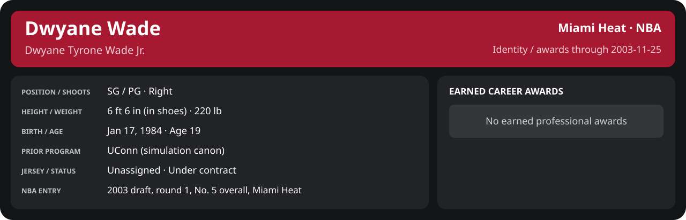

# November Week 4 Game 2

Player identity and statistics are generated here by `python scripts/update_player_reports.py`.
Decisions remain in the owning phase/week note. A scheduled game has no statistical result.

Miami's injured list for this game: Caron Butler, Udonis Haslem, John Wallace (`00_Team/Transactions/injured_list.json`; twelve dress).

<!-- game-result:start -->
## Result

**New Orleans Hornets 73 at Miami Heat 90** · Miami Heat W 90-73 vs New Orleans Hornets · home (Miami Heat) · 2003-11-25

Event `2003-11-25-new-orleans-hornets-at-miami-heat` · Railway engine (runtime/private_service.py) · result file [`Game_2.result.json`](Game_2.result.json) (the engine's answer as served; the note is the canonical record).

### Box score

```text
New Orleans Hornets 73 at Miami Heat 90
2003-11-25  2003-04 regular  event 2003-11-25-new-orleans-hornets-at-miami-heat
Kernel 2003.10, calibrated on 2002-03 (imported_source)

Period      1    2    3    4     T
New Orle   11   26   15   21    73
Miami He   23   16   19   32    90

New Orleans Hornets
                           MIN  PTS   FG      3P     FT    OR  DR AST STL BLK  TO  PF
Baron Davis               40.2   16   6-20   1-6    3-3     2   3   8   1   0   2   1
P.J. Brown                35.1    6   3-10   0-0    0-0     3   7   1   0   1   2   1
Jamaal Magloire           34.3   16   4-8    0-0    8-13    2   6   2   0   5   5   4
David Wesley              31.2   10   4-12   2-4    0-0     2   6   3   3   0   3   2
Darrell Armstrong         28.7    5   2-8    1-3    0-0     0   4   4   1   0   1   2
George Lynch              22.2    2   1-6    0-0    0-0     0   2   1   1   1   0   2
Stacey Augmon             19.2    4   1-4    0-1    2-2     0   4   0   2   1   4   2
Robert Traylor            13.6    4   1-2    0-0    2-2     3   0   0   1   0   4   3
David West                12.0   10   5-8    0-0    0-0     2   3   0   0   0   0   2
Steve Smith                3.2    0   0-1    0-1    0-0     0   0   1   1   0   0   0
Sean Rooks                 0.3    0   0-1    0-1    0-0     0   0   0   0   0   0   0
TEAM                     240.0   73  27-80   4-16  15-20   14  35  20  10   8  22  19
  Includes 1 team turnover(s) not charged to an individual.

Miami Heat
                           MIN  PTS   FG      3P     FT    OR  DR AST STL BLK  TO  PF
Mike James                27.4   11   5-11   1-4    0-0     1   1   3   4   0   1   5
Dwyane Wade               40.3   19   9-15   0-1    1-2     2   8   6   3   1   0   2
Scott Padgett             27.4    9   3-10   1-3    2-4     3   3   2   0   0   2   5
Brian Grant               40.6   20   8-14   0-0    4-5     2   9   1   0   1   4   4
Shawn Kemp                24.1    7   2-10   0-0    3-4     4   6   1   2   1   3   1
Stephen Jackson           21.4    9   2-7    0-0    5-6     0   3   0   1   1   2   5
Eddie Jones               15.4    3   1-6    0-3    1-2     0   2   1   0   0   0   0
Cherokee Parks            13.1    3   1-1    0-0    1-2     0   2   1   2   0   2   0
Rasual Butler             12.1    7   3-7    1-1    0-0     0   0   1   0   1   0   0
LaPhonso Ellis             7.7    0   0-1    0-0    0-0     1   0   0   0   0   0   0
Anthony Carter             7.4    2   1-2    0-1    0-0     0   2   0   0   0   0   0
Sean Lampley               3.1    0   0-0    0-0    0-0     0   0   0   0   0   0   0
TEAM                     240.0   90  35-84   3-13  17-25   13  36  16  12   5  14  22
```

### Miami injuries

No Miami injury was drawn in this game.
<!-- game-result:end -->

<!-- player-report:start -->
## Professional identity



| Player | Age on report date | Team / league | Position | Number | Status |
| --- | --- | --- | --- | --- | --- |
| Dwyane Tyrone Wade Jr. | 19 | Miami Heat / NBA | SG / PG | Not assigned | Under contract |

| Identity field | Recorded value |
| --- | --- |
| Birth date | 1984-01-17 |
| NBA entry | 2003 draft, round 1, No. 5 overall, Miami Heat |
| Prior program | UConn (simulation canon) |
| Height, in shoes / without shoes | 6 ft 6 in / 6 ft 4.75 in |
| Weight | 220 lb |
| Wingspan / standing reach | 6 ft 11.5 in / 8 ft 7.5 in |
| Shooting hand | Right |
| Contract | Rookie scale signed 2003-07-21: three seasons plus a 2006-07 team option |
| Role | Starter; staff plan 34 minutes |
| NBA debut | October 28, 2003 at Philadelphia 76ers (2003-04/06_Regular_Season/10_October/Week_4/Game_1.md) |
| Nationality | Not recorded |
| National team | No selection recorded |
| National-team eligibility | Not verified |
| Availability | No current restriction recorded in the established profile |
| Physical measurements recorded | 2003-06-25 |
| Professional status effective | 2003-11-07 |

Identity as of 2003-11-25; status snapshot dated 2003-11-07. User-established alternate-history player; historical Wade's biography and results are not this record.

### Earned career awards

No earned professional awards recorded by this page's identity cutoff.

## Statistics

As of **2003-11-25**: 1 closed games; 1/1 have player participation and box coverage; recorded DNPs: 0.

G counts appearances; GS counts recorded starts. DNPs, scheduled games and canceled games do not enter per-game denominators.

### Per game

[](../../../../Stats_and_Awards/player_cards.html?period=regular-2003-04-game-c3ceb4e855af2401#shooting) [](../../../../Stats_and_Awards/player_cards.html#contract) [](../../../../Stats_and_Awards/player_cards.html#awards)

[Shooting detail](../../../../Stats_and_Awards/Shooting.md) · [Current contract](../../../../Stats_and_Awards/Contract.md#current-contract) · [Contract history](../../../../Stats_and_Awards/Contract.md#contract-history) · [Annual award record](../../../../Stats_and_Awards/Awards.md)

| Scope | Age | Team | Lg | Pos | G | GS | MP | FG | FGA | FG% | 3P | 3PA | 3P% | 2P | 2PA | 2P% | eFG% | FT | FTA | FT% | ORB | DRB | TRB | AST | STL | BLK | TOV | PF | PTS | TS% (est.) | Awards |
| --- | --- | --- | --- | --- | --- | --- | --- | --- | --- | --- | --- | --- | --- | --- | --- | --- | --- | --- | --- | --- | --- | --- | --- | --- | --- | --- | --- | --- | --- | --- | --- |
| This game | 19 | Miami Heat | NBA | SG / PG | 1 | 1 | 40.3 | 9.0 | 15.0 | .600 | 0.0 | 1.0 | .000 | 9.0 | 14.0 | .643 | .600 | 1.0 | 2.0 | .500 | 2.0 | 8.0 | 10.0 | 6.0 | 3.0 | 1.0 | 0.0 | 2.0 | 19.0 | .598 | — |

G and GS are counts; MP and counting statistics are **per appearance**. Shooting uses **.500 = 50.0%**. Age is at the row's cutoff. Scroll horizontally for every column.

Awards are confirmed through 2004-04-26, filed by the honor's period-end date; the banner shows career awards known at the page's identity cutoff.

### Production

| Metric | Total | Per appearance | Per 36 minutes |
| --- | --- | --- | --- |
| MIN | 40.3 | 40.3 | 36.0 |
| PTS | 19 | 19.0 | 17.0 |
| OREB | 2 | 2.0 | 1.8 |
| DREB | 8 | 8.0 | 7.1 |
| REB | 10 | 10.0 | 8.9 |
| AST | 6 | 6.0 | 5.4 |
| STL | 3 | 3.0 | 2.7 |
| BLK | 1 | 1.0 | 0.9 |
| TOV | 0 | 0.0 | 0.0 |
| PF | 2 | 2.0 | 1.8 |
| FGM | 9 | 9.0 | 8.0 |
| FGA | 15 | 15.0 | 13.4 |
| 2PM | 9 | 9.0 | 8.0 |
| 2PA | 14 | 14.0 | 12.5 |
| 3PM | 0 | 0.0 | 0.0 |
| 3PA | 1 | 1.0 | 0.9 |
| FTM | 1 | 1.0 | 0.9 |
| FTA | 2 | 2.0 | 1.8 |
| FT points | 1 | 1.0 | 0.9 |

Per-36 rates standardize playing time; they are not a projection of playing 36 minutes. Use the actual minutes denominator in every competition.

### Shooting

| Shot type | Makes | Attempts | Percentage |
| --- | --- | --- | --- |
| All field goals | 9 | 15 | 60.0% |
| Two-pointers | 9 | 14 | 64.3% |
| Three-pointers | 0 | 1 | 0.0% |
| Free throws | 1 | 2 | 50.0% |

### Efficiency and shot selection

| Metric | Value | Calculation / unit |
| --- | --- | --- |
| eFG% | 60.0% | (FGM + 0.5 × 3PM) / FGA |
| TS% (estimated) | 59.8% | PTS / [2 × (FGA + 0.44 × FTA)] |
| Three-point attempt share | 6.7% | 3PA / FGA |
| Free-throw attempt rate | 0.133 | FTA / FGA; ratio |
| Assist / turnover ratio | N/A | AST / TOV; N/A at zero turnovers |
| Plus/minus total | N/A | Observed on-court score differential only |
| Double-doubles | 1 | At least 10 in any two of PTS, REB, AST, STL, BLK |
| Triple-doubles | 0 | At least 10 in any three; also included in double-doubles |

Percentages use pooled makes and attempts. TS% uses an estimated free-throw weighting, not exact scoring possessions. Rounding is display-only.

### Splits

[](../../../../Stats_and_Awards/player_cards.html?period=regular-2003-04-game-c3ceb4e855af2401#shooting) [](../../../../Stats_and_Awards/player_cards.html#contract) [](../../../../Stats_and_Awards/player_cards.html#awards)

[Shooting detail](../../../../Stats_and_Awards/Shooting.md) · [Current contract](../../../../Stats_and_Awards/Contract.md#current-contract) · [Contract history](../../../../Stats_and_Awards/Contract.md#contract-history) · [Annual award record](../../../../Stats_and_Awards/Awards.md)

| Scope | Age | Team | Lg | Pos | G | GS | MP | FG | FGA | FG% | 3P | 3PA | 3P% | 2P | 2PA | 2P% | eFG% | FT | FTA | FT% | ORB | DRB | TRB | AST | STL | BLK | TOV | PF | PTS | TS% (est.) | Awards |
| --- | --- | --- | --- | --- | --- | --- | --- | --- | --- | --- | --- | --- | --- | --- | --- | --- | --- | --- | --- | --- | --- | --- | --- | --- | --- | --- | --- | --- | --- | --- | --- |
| Home | 19 | Miami Heat | NBA | SG / PG | 1 | 1 | 40.3 | 9.0 | 15.0 | .600 | 0.0 | 1.0 | .000 | 9.0 | 14.0 | .643 | .600 | 1.0 | 2.0 | .500 | 2.0 | 8.0 | 10.0 | 6.0 | 3.0 | 1.0 | 0.0 | 2.0 | 19.0 | .598 | — |
| Away | 19 | Miami Heat | NBA | SG / PG | 0 | N/A | N/A | N/A | N/A | N/A | N/A | N/A | N/A | N/A | N/A | N/A | N/A | N/A | N/A | N/A | N/A | N/A | N/A | N/A | N/A | N/A | N/A | N/A | N/A | N/A | — |
| Neutral | 19 | Miami Heat | NBA | SG / PG | 0 | N/A | N/A | N/A | N/A | N/A | N/A | N/A | N/A | N/A | N/A | N/A | N/A | N/A | N/A | N/A | N/A | N/A | N/A | N/A | N/A | N/A | N/A | N/A | N/A | N/A | — |
| Wins | 19 | Miami Heat | NBA | SG / PG | 1 | 1 | 40.3 | 9.0 | 15.0 | .600 | 0.0 | 1.0 | .000 | 9.0 | 14.0 | .643 | .600 | 1.0 | 2.0 | .500 | 2.0 | 8.0 | 10.0 | 6.0 | 3.0 | 1.0 | 0.0 | 2.0 | 19.0 | .598 | — |
| Losses | 19 | Miami Heat | NBA | SG / PG | 0 | N/A | N/A | N/A | N/A | N/A | N/A | N/A | N/A | N/A | N/A | N/A | N/A | N/A | N/A | N/A | N/A | N/A | N/A | N/A | N/A | N/A | N/A | N/A | N/A | N/A | — |
| Team: Miami Heat | 19 | Miami Heat | NBA | SG / PG | 1 | 1 | 40.3 | 9.0 | 15.0 | .600 | 0.0 | 1.0 | .000 | 9.0 | 14.0 | .643 | .600 | 1.0 | 2.0 | .500 | 2.0 | 8.0 | 10.0 | 6.0 | 3.0 | 1.0 | 0.0 | 2.0 | 19.0 | .598 | — |

G and GS are counts; MP and counting statistics are **per appearance**. Shooting uses **.500 = 50.0%**. Age is at the row's cutoff. Scroll horizontally for every column.

Awards are confirmed through 2004-04-26, filed by the honor's period-end date; the banner shows career awards known at the page's identity cutoff.

Splits overlap and are not additive. Each row has its own appearance denominator; games with unknown result classification are excluded from win/loss splits.

### Game highs

| Metric | High | Date / opponent (all ties) |
| --- | --- | --- |
| PTS | 19 | [2003-11-25 vs New Orleans Hornets](Game_2.md) |
| REB | 10 | [2003-11-25 vs New Orleans Hornets](Game_2.md) |
| AST | 6 | [2003-11-25 vs New Orleans Hornets](Game_2.md) |
| STL | 3 | [2003-11-25 vs New Orleans Hornets](Game_2.md) |
| BLK | 1 | [2003-11-25 vs New Orleans Hornets](Game_2.md) |
| TOV | 0 | [2003-11-25 vs New Orleans Hornets](Game_2.md) |

### Game log

| Date / source | Opponent | Venue | Result | Participation | MIN | PTS | REB | AST | STL | BLK | TOV |
| --- | --- | --- | --- | --- | --- | --- | --- | --- | --- | --- | --- |
| [2003-11-25](Game_2.md) | New Orleans Hornets | home | W 90-73 | Played | 40.3 | 19 | 10 | 6 | 3 | 1 | 0 |

### Game shooting detail

| Date / source | FG | 2P | 3P | FT | eFG% | TS% (est.) | +/- | PF |
| --- | --- | --- | --- | --- | --- | --- | --- | --- |
| [2003-11-25](Game_2.md) | 9/15 | 9/14 | 0/1 | 1/2 | 60.0% | 59.8% | N/A | 2 |

### Additional data needed

| Statistic family | Current support | Required evidence |
| --- | --- | --- |
| Starts; plus/minus | N/A unless supplied in the player box | Explicit started and plus_minus fields |
| Per 100 possessions; offensive / defensive / net rating | Unavailable in current box feed | Player on-court possessions and both teams' scoring during those possessions |
| USG%; AST%; OREB%, DREB%, REB% | Unavailable in current box feed | Matching player/team/opponent opportunity counts and a declared method |
| Rim, paint, midrange, corner / above-break threes | Unavailable in current box feed | Shot locations, attempts and makes |
| Drives, touches, catch-and-shoot, pull-ups, play types | Unavailable in current box feed | Tracking or tagged play-by-play |
| Clutch, on/off, lineup combinations, assisted baskets | Unavailable in current box feed | Timed events, score state, substitutions and possession attribution |
| Deflections, charges, contested shots, box outs | Unavailable in current box feed | Observed hustle/defensive events |
| League rank, percentile, relative TS%; impact models | Not derived by this report | Same-period simulated league baseline, eligibility rules and documented model |

<!-- player-report:end -->
