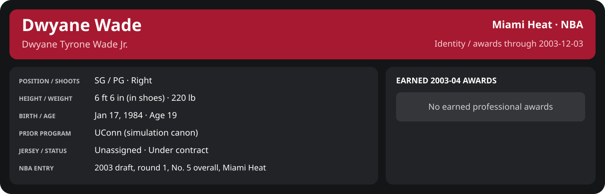

# December Week 1 Game 1

Player identity and statistics are generated here by `python scripts/update_player_reports.py`.
Decisions remain in the owning phase/week note. A scheduled game has no statistical result.

Miami's injured list for this game: Udonis Haslem, John Wallace, Sean Lampley (`00_Team/Transactions/injured_list.json`; twelve dress).

<!-- game-result:start -->
## Result

**Miami Heat 84 at Detroit Pistons 89** · Miami Heat L 84-89 vs Detroit Pistons · away (Detroit Pistons) · 2003-12-03

Event `2003-12-03-miami-heat-at-detroit-pistons` · Railway engine (runtime/private_service.py) · result file [`Game_1.result.json`](Game_1.result.json) (the engine's answer as served; the note is the canonical record).

### Box score

```text
Miami Heat 84 at Detroit Pistons 89
2003-12-03  2003-04 regular  event 2003-12-03-miami-heat-at-detroit-pistons
Kernel 2003.11, calibrated on 2002-03 (imported_source)

Period      1    2    3    4     T
Miami He   19   28   16   21    84
Detroit    24   15   23   27    89

Miami Heat
                           MIN  PTS   FG      3P     FT    OR  DR AST STL BLK  TO  PF
Mike James                36.9    4   1-11   0-4    2-2     0   3   5   1   0   2   4
Dwyane Wade               37.2   19   7-14   1-2    4-4     0   5   9   3   0   1   1
Caron Butler              35.6    9   4-9    0-0    1-2     3   3   2   0   1   2   3
Scott Padgett             35.2   13   6-10   0-2    1-2     1   5   2   0   0   0   5
Brian Grant               35.2   18   8-13   0-0    2-2     3   5   1   0   1   3   4
Shawn Kemp                15.4    3   1-4    0-0    1-2     2   2   1   0   1   3   5
Stephen Jackson           16.3    8   3-10   2-3    0-0     0   0   0   0   0   2   4
Eddie Jones                8.0    2   1-3    0-1    0-0     0   0   0   0   0   1   5
Cherokee Parks             9.9    0   0-1    0-0    0-0     2   2   2   0   0   1   1
Rasual Butler              6.9    4   2-2    0-0    0-0     0   0   0   0   0   0   1
LaPhonso Ellis             3.5    4   2-2    0-0    0-0     1   3   0   0   0   0   0
TEAM                     240.0   84  35-79   3-12  11-14   12  28  22   4   3  15  33

Detroit Pistons
                           MIN  PTS   FG      3P     FT    OR  DR AST STL BLK  TO  PF
Ben Wallace               42.1    7   3-10   0-1    1-9     5   6   3   1   5   0   1
Richard Hamilton (DQ)     21.8    7   2-10   0-3    3-3     0   1   3   1   0   3   6
Chauncey Billups          39.7   16   3-10   1-3    9-10    1   3   5   1   0   3   1
Tayshaun Prince           37.0   15   5-11   3-3    2-4     0   7   2   0   1   0   3
Mehmet Okur               26.3   16   6-7    1-1    3-4     3   1   0   1   1   1   2
Bob Sura                  23.5   13   4-7    1-2    4-4     1   5   2   0   1   1   3
Corliss Williamson        20.2    7   3-7    0-0    1-2     0   2   0   1   0   2   0
Elden Campbell            12.6    6   3-6    0-0    0-0     1   1   1   1   1   1   2
Darvin Ham                 6.9    0   0-2    0-0    0-0     0   1   0   0   0   0   0
Željko Rebrača             3.4    0   0-3    0-0    0-0     0   0   1   0   0   0   0
Tremaine Fowlkes           3.4    0   0-0    0-0    0-0     0   2   0   0   0   0   0
Darko Miličić              3.1    2   0-1    0-0    2-2     1   0   0   0   1   0   0
TEAM                     240.0   89  29-74   6-13  25-38   12  29  17   6  10  11  18
```

### Miami injuries

No Miami injury was drawn in this game.
<!-- game-result:end -->

<!-- player-report:start -->
## Professional identity



| Player | Age on report date | Team / league | Position | Number | Status |
| --- | --- | --- | --- | --- | --- |
| Dwyane Tyrone Wade Jr. | 19 | Miami Heat / NBA | SG / PG | Not assigned | Under contract |

| Identity field | Recorded value |
| --- | --- |
| Birth date | 1984-01-17 |
| NBA entry | 2003 draft, round 1, No. 5 overall, Miami Heat |
| Prior program | UConn (simulation canon) |
| Height, in shoes / without shoes | 6 ft 6 in / 6 ft 4.75 in |
| Weight | 220 lb |
| Wingspan / standing reach | 6 ft 11.5 in / 8 ft 7.5 in |
| Shooting hand | Right |
| Contract | Rookie scale signed 2003-07-21: three seasons plus a 2006-07 team option |
| Role | Starter; staff plan 34 minutes |
| NBA debut | October 28, 2003 at Philadelphia 76ers (2003-04/06_Regular_Season/10_October/Week_4/Game_1.md) |
| Nationality | United States (born in the Chicago area; Robbins, Illinois home community, per the player profile) |
| National team | No selection recorded |
| National-team eligibility | Not verified |
| Availability | No current restriction recorded in the established profile |
| Physical measurements recorded | 2003-06-25 |
| Professional status effective | 2003-12-01 |

Identity as of 2003-12-03; status snapshot dated 2003-12-01. User-established alternate-history player; historical Wade's biography and results are not this record.

### Earned 2003-04 awards

| Award | Period | Announced | Decision record |
| --- | --- | --- | --- |
| Eastern Conference Rookie of the Month | 2003-10-28 to 2003-11-30 | 2003-12-02 | [East ROM](../../../../Stats_and_Awards/League/2003-04/11_November/League_Awards.md#rookie-of-the-month) |

## Statistics

As of **2003-12-03**: 1 closed games; 1/1 have player participation and box coverage; recorded DNPs: 0.

G counts appearances; GS counts recorded starts. DNPs, scheduled games and canceled games do not enter per-game denominators.

### Per game

[](../../../../Stats_and_Awards/player_cards.html?period=regular-2003-04-game-c68205aca9b8c2ea#shooting) [](../../../../Stats_and_Awards/player_cards.html#contract) [](../../../../Stats_and_Awards/player_cards.html#awards)

[Shooting detail](../../../../Stats_and_Awards/Shooting.md) · [Current contract](../../../../Stats_and_Awards/Contract.md#current-contract) · [Contract history](../../../../Stats_and_Awards/Contract.md#contract-history) · [Annual award record](../../../../Stats_and_Awards/Awards.md)

| Scope | Age | Team | Lg | Pos | G | GS | MP | FG | FGA | FG% | 3P | 3PA | 3P% | 2P | 2PA | 2P% | eFG% | FT | FTA | FT% | ORB | DRB | TRB | AST | STL | BLK | TOV | PF | PTS | TS% (est.) | Awards |
| --- | --- | --- | --- | --- | --- | --- | --- | --- | --- | --- | --- | --- | --- | --- | --- | --- | --- | --- | --- | --- | --- | --- | --- | --- | --- | --- | --- | --- | --- | --- | --- |
| This game | 19 | Miami Heat | NBA | SG / PG | 1 | 1 | 37.2 | 7.0 | 14.0 | .500 | 1.0 | 2.0 | .500 | 6.0 | 12.0 | .500 | .536 | 4.0 | 4.0 | 1.000 | 0.0 | 5.0 | 5.0 | 9.0 | 3.0 | 0.0 | 1.0 | 1.0 | 19.0 | .603 | — |

G and GS are counts; MP and counting statistics are **per appearance**. Shooting uses **.500 = 50.0%**. Age is at the row's cutoff. Scroll horizontally for every column.

Awards are confirmed through 2005-06-16, filed by the honor's period-end date; the banner shows career awards known at the page's identity cutoff.

### Production

| Metric | Total | Per appearance | Per 36 minutes |
| --- | --- | --- | --- |
| MIN | 37.2 | 37.2 | 36.0 |
| PTS | 19 | 19.0 | 18.4 |
| OREB | 0 | 0.0 | 0.0 |
| DREB | 5 | 5.0 | 4.8 |
| REB | 5 | 5.0 | 4.8 |
| AST | 9 | 9.0 | 8.7 |
| STL | 3 | 3.0 | 2.9 |
| BLK | 0 | 0.0 | 0.0 |
| TOV | 1 | 1.0 | 1.0 |
| PF | 1 | 1.0 | 1.0 |
| FGM | 7 | 7.0 | 6.8 |
| FGA | 14 | 14.0 | 13.6 |
| 2PM | 6 | 6.0 | 5.8 |
| 2PA | 12 | 12.0 | 11.6 |
| 3PM | 1 | 1.0 | 1.0 |
| 3PA | 2 | 2.0 | 1.9 |
| FTM | 4 | 4.0 | 3.9 |
| FTA | 4 | 4.0 | 3.9 |
| FT points | 4 | 4.0 | 3.9 |

Per-36 rates standardize playing time; they are not a projection of playing 36 minutes. Use the actual minutes denominator in every competition.

### Shooting

| Shot type | Makes | Attempts | Percentage |
| --- | --- | --- | --- |
| All field goals | 7 | 14 | 50.0% |
| Two-pointers | 6 | 12 | 50.0% |
| Three-pointers | 1 | 2 | 50.0% |
| Free throws | 4 | 4 | 100.0% |

### Efficiency and shot selection

| Metric | Value | Calculation / unit |
| --- | --- | --- |
| eFG% | 53.6% | (FGM + 0.5 × 3PM) / FGA |
| TS% (estimated) | 60.3% | PTS / [2 × (FGA + 0.44 × FTA)] |
| Three-point attempt share | 14.3% | 3PA / FGA |
| Free-throw attempt rate | 0.286 | FTA / FGA; ratio |
| Assist / turnover ratio | 9.00 | AST / TOV; N/A at zero turnovers |
| Plus/minus total | N/A | Observed on-court score differential only |
| Double-doubles | 0 | At least 10 in any two of PTS, REB, AST, STL, BLK |
| Triple-doubles | 0 | At least 10 in any three; also included in double-doubles |

Percentages use pooled makes and attempts. TS% uses an estimated free-throw weighting, not exact scoring possessions. Rounding is display-only.

### Splits

[](../../../../Stats_and_Awards/player_cards.html?period=regular-2003-04-week-2003-12-01#shooting) [](../../../../Stats_and_Awards/player_cards.html#contract) [](../../../../Stats_and_Awards/player_cards.html#awards)

[Shooting detail](../../../../Stats_and_Awards/Shooting.md) · [Current contract](../../../../Stats_and_Awards/Contract.md#current-contract) · [Contract history](../../../../Stats_and_Awards/Contract.md#contract-history) · [Annual award record](../../../../Stats_and_Awards/Awards.md)

| Scope | Age | Team | Lg | Pos | G | GS | MP | FG | FGA | FG% | 3P | 3PA | 3P% | 2P | 2PA | 2P% | eFG% | FT | FTA | FT% | ORB | DRB | TRB | AST | STL | BLK | TOV | PF | PTS | TS% (est.) | Awards |
| --- | --- | --- | --- | --- | --- | --- | --- | --- | --- | --- | --- | --- | --- | --- | --- | --- | --- | --- | --- | --- | --- | --- | --- | --- | --- | --- | --- | --- | --- | --- | --- |
| Home | 19 | Miami Heat | NBA | SG / PG | 0 | N/A | N/A | N/A | N/A | N/A | N/A | N/A | N/A | N/A | N/A | N/A | N/A | N/A | N/A | N/A | N/A | N/A | N/A | N/A | N/A | N/A | N/A | N/A | N/A | N/A | — |
| Away | 19 | Miami Heat | NBA | SG / PG | 1 | 1 | 37.2 | 7.0 | 14.0 | .500 | 1.0 | 2.0 | .500 | 6.0 | 12.0 | .500 | .536 | 4.0 | 4.0 | 1.000 | 0.0 | 5.0 | 5.0 | 9.0 | 3.0 | 0.0 | 1.0 | 1.0 | 19.0 | .603 | — |
| Neutral | 19 | Miami Heat | NBA | SG / PG | 0 | N/A | N/A | N/A | N/A | N/A | N/A | N/A | N/A | N/A | N/A | N/A | N/A | N/A | N/A | N/A | N/A | N/A | N/A | N/A | N/A | N/A | N/A | N/A | N/A | N/A | — |
| Wins | 19 | Miami Heat | NBA | SG / PG | 0 | N/A | N/A | N/A | N/A | N/A | N/A | N/A | N/A | N/A | N/A | N/A | N/A | N/A | N/A | N/A | N/A | N/A | N/A | N/A | N/A | N/A | N/A | N/A | N/A | N/A | — |
| Losses | 19 | Miami Heat | NBA | SG / PG | 1 | 1 | 37.2 | 7.0 | 14.0 | .500 | 1.0 | 2.0 | .500 | 6.0 | 12.0 | .500 | .536 | 4.0 | 4.0 | 1.000 | 0.0 | 5.0 | 5.0 | 9.0 | 3.0 | 0.0 | 1.0 | 1.0 | 19.0 | .603 | — |
| Team: Miami Heat | 19 | Miami Heat | NBA | SG / PG | 1 | 1 | 37.2 | 7.0 | 14.0 | .500 | 1.0 | 2.0 | .500 | 6.0 | 12.0 | .500 | .536 | 4.0 | 4.0 | 1.000 | 0.0 | 5.0 | 5.0 | 9.0 | 3.0 | 0.0 | 1.0 | 1.0 | 19.0 | .603 | — |

G and GS are counts; MP and counting statistics are **per appearance**. Shooting uses **.500 = 50.0%**. Age is at the row's cutoff. Scroll horizontally for every column.

Awards are confirmed through 2005-06-16, filed by the honor's period-end date; the banner shows career awards known at the page's identity cutoff.

Splits overlap and are not additive. Each row has its own appearance denominator; games with unknown result classification are excluded from win/loss splits.

### Game highs

| Metric | High | Date / opponent (all ties) |
| --- | --- | --- |
| PTS | 19 | [2003-12-03 at Detroit Pistons](Game_1.md) |
| REB | 5 | [2003-12-03 at Detroit Pistons](Game_1.md) |
| AST | 9 | [2003-12-03 at Detroit Pistons](Game_1.md) |
| STL | 3 | [2003-12-03 at Detroit Pistons](Game_1.md) |
| BLK | 0 | [2003-12-03 at Detroit Pistons](Game_1.md) |
| TOV | 1 | [2003-12-03 at Detroit Pistons](Game_1.md) |

### Game log

| Date / source | Opponent | Venue | Result | Participation | MIN | PTS | REB | AST | STL | BLK | TOV |
| --- | --- | --- | --- | --- | --- | --- | --- | --- | --- | --- | --- |
| [2003-12-03](Game_1.md) | Detroit Pistons | away | L 84-89 | Played | 37.2 | 19 | 5 | 9 | 3 | 0 | 1 |

### Game shooting detail

| Date / source | FG | 2P | 3P | FT | eFG% | TS% (est.) | +/- | PF |
| --- | --- | --- | --- | --- | --- | --- | --- | --- |
| [2003-12-03](Game_1.md) | 7/14 | 6/12 | 1/2 | 4/4 | 53.6% | 60.3% | N/A | 1 |

### Additional data needed

| Statistic family | Current support | Required evidence |
| --- | --- | --- |
| Starts; plus/minus | N/A unless supplied in the player box | Explicit started and plus_minus fields |
| Per 100 possessions; offensive / defensive / net rating | Unavailable in current box feed | Player on-court possessions and both teams' scoring during those possessions |
| USG%; AST%; OREB%, DREB%, REB% | Unavailable in current box feed | Matching player/team/opponent opportunity counts and a declared method |
| Rim, paint, midrange, corner / above-break threes | Unavailable in current box feed | Shot locations, attempts and makes |
| Drives, touches, catch-and-shoot, pull-ups, play types | Unavailable in current box feed | Tracking or tagged play-by-play |
| Clutch, on/off, lineup combinations, assisted baskets | Unavailable in current box feed | Timed events, score state, substitutions and possession attribution |
| Deflections, charges, contested shots, box outs | Unavailable in current box feed | Observed hustle/defensive events |
| League rank, percentile, relative TS%; impact models | Not derived by this report | Same-period simulated league baseline, eligibility rules and documented model |

<!-- player-report:end -->
