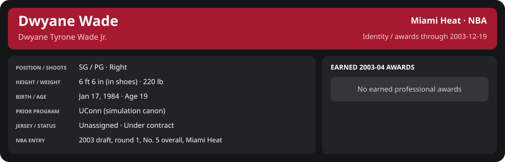

# December Week 3 Game 3

Player identity and statistics are generated here by `python scripts/update_player_reports.py`.
Decisions remain in the owning phase/week note. A scheduled game has no statistical result.

Miami's injured list for this game: Brian Grant, Caron Butler, Udonis Haslem (`00_Team/Transactions/injured_list.json`; twelve dress).

<!-- game-result:start -->
## Result

**Miami Heat 112 at Memphis Grizzlies 118 (1OT)** · Miami Heat L 112-118 vs Memphis Grizzlies · away (Memphis Grizzlies) · 2003-12-19

Event `2003-12-19-miami-heat-at-memphis-grizzlies` · Railway engine (runtime/private_service.py) · result file [`Game_3.result.json`](Game_3.result.json) (the engine's answer as served; the note is the canonical record).

### Box score

```text
Miami Heat 112 at Memphis Grizzlies 118 (1OT)
2003-12-19  2003-04 regular  event 2003-12-19-miami-heat-at-memphis-grizzlies
Kernel 2003.11, calibrated on 2002-03 (imported_source)

Period      1    2    3    4    5     T
Miami He   26   33   15   30    8   112
Memphis    29   19   27   29   14   118

Miami Heat
                           MIN  PTS   FG      3P     FT    OR  DR AST STL BLK  TO  PF
Mike James                36.0   16   6-13   2-6    2-3     0   2   4   3   0   1   4
Dwyane Wade               49.8   27  12-18   1-5    2-2     0   4   8   1   1   1   4
Scott Padgett (DQ)        21.2   18   8-11   2-3    0-0     1   5   4   0   0   0   6
Shawn Kemp                31.1    7   3-9    0-0    1-1     3   5   2   3   1   0   4
Eddie Jones               34.8   13   4-12   2-3    3-4     0   1   3   0   0   1   2
Stephen Jackson           25.9   17   6-10   1-3    4-6     1   0   1   2   0   2   2
Cherokee Parks            16.1    6   2-3    0-0    2-2     1   2   0   0   0   1   1
Anthony Carter            15.6    4   2-8    0-4    0-0     1   2   1   0   0   1   1
LaPhonso Ellis            12.8    3   0-5    0-1    3-4     1   1   0   0   0   1   1
Rasual Butler              8.6    1   0-1    0-0    1-2     0   1   0   0   0   0   0
Sean Lampley               8.3    0   0-1    0-0    0-0     3   2   0   0   1   1   0
John Wallace               4.7    0   0-3    0-1    0-0     0   0   0   0   0   1   0
TEAM                     265.0  112  43-94   8-26  18-24   11  25  23   9   3  13  25
  Includes 3 team turnover(s) not charged to an individual.

Memphis Grizzlies
                           MIN  PTS   FG      3P     FT    OR  DR AST STL BLK  TO  PF
Pau Gasol                 41.9   29  11-21   0-1    7-8     2   6   4   0   4   3   5
James Posey               38.5   13   5-11   1-4    2-2     0   9   2   3   0   0   4
Jason Williams            38.3   19   7-16   3-7    2-2     1   3  10   0   0   2   3
Bonzi Wells               34.8   18   5-13   1-2    7-10    5   4   3   1   0   2   3
Shane Battier             35.5   16   7-10   0-1    2-2     3   6   3   0   1   3   1
Earl Watson               20.7    5   2-5    0-0    1-2     1   3   4   0   1   2   1
Stromile Swift            20.2    4   2-4    0-0    0-0     1   3   1   2   0   1   2
Bo Outlaw                 13.0    2   0-1    0-0    2-4     1   0   0   1   0   2   5
Wesley Person             12.8   12   4-8    2-5    2-2     0   2   1   0   0   2   1
Jake Tsakalidis            6.2    0   0-0    0-0    0-0     2   2   1   1   0   0   2
Dahntay Jones              3.1    0   0-0    0-0    0-0     0   0   0   0   0   0   0
TEAM                     265.0  118  43-89   7-20  25-32   16  38  29   8   6  18  27
  Includes 1 team turnover(s) not charged to an individual.
```

### Miami injuries

No Miami injury was drawn in this game.
<!-- game-result:end -->

<!-- player-report:start -->
## Professional identity



| Player | Age on report date | Team / league | Position | Number | Status |
| --- | --- | --- | --- | --- | --- |
| Dwyane Tyrone Wade Jr. | 19 | Miami Heat / NBA | SG / PG | Not assigned | Under contract |

| Identity field | Recorded value |
| --- | --- |
| Birth date | 1984-01-17 |
| NBA entry | 2003 draft, round 1, No. 5 overall, Miami Heat |
| Prior program | UConn (simulation canon) |
| Height, in shoes / without shoes | 6 ft 6 in / 6 ft 4.75 in |
| Weight | 220 lb |
| Wingspan / standing reach | 6 ft 11.5 in / 8 ft 7.5 in |
| Shooting hand | Right |
| Contract | Rookie scale signed 2003-07-21: three seasons plus a 2006-07 team option |
| Role | Starter; staff plan 34 minutes |
| NBA debut | October 28, 2003 at Philadelphia 76ers (2003-04/06_Regular_Season/10_October/Week_4/Game_1.md) |
| Nationality | United States (born in the Chicago area; Robbins, Illinois home community, per the player profile) |
| National team | No selection recorded |
| National-team eligibility | Not verified |
| Availability | No current restriction recorded in the established profile |
| Physical measurements recorded | 2003-06-25 |
| Professional status effective | 2003-12-01 |

Identity as of 2003-12-19; status snapshot dated 2003-12-01. User-established alternate-history player; historical Wade's biography and results are not this record.

### Earned 2003-04 awards

| Award | Period | Announced | Decision record |
| --- | --- | --- | --- |
| Eastern Conference Rookie of the Month | 2003-10-28 to 2003-11-30 | 2003-12-02 | [East ROM](../../../../Stats_and_Awards/League/2003-04/11_November/League_Awards.md#rookie-of-the-month) |

## Statistics

As of **2003-12-19**: 1 closed games; 1/1 have player participation and box coverage; recorded DNPs: 0.

G counts appearances; GS counts recorded starts. DNPs, scheduled games and canceled games do not enter per-game denominators.

### Per game

[](../../../../Stats_and_Awards/player_cards.html?period=regular-2003-04-game-d828ae2376c0c5aa#shooting) [](../../../../Stats_and_Awards/player_cards.html#contract) [](../../../../Stats_and_Awards/player_cards.html#awards)

[Shooting detail](../../../../Stats_and_Awards/Shooting.md) · [Current contract](../../../../Stats_and_Awards/Contract.md#current-contract) · [Contract history](../../../../Stats_and_Awards/Contract.md#contract-history) · [Annual award record](../../../../Stats_and_Awards/Awards.md)

| Scope | Age | Team | Lg | Pos | G | GS | MP | FG | FGA | FG% | 3P | 3PA | 3P% | 2P | 2PA | 2P% | eFG% | FT | FTA | FT% | ORB | DRB | TRB | AST | STL | BLK | TOV | PF | PTS | TS% (est.) | Awards |
| --- | --- | --- | --- | --- | --- | --- | --- | --- | --- | --- | --- | --- | --- | --- | --- | --- | --- | --- | --- | --- | --- | --- | --- | --- | --- | --- | --- | --- | --- | --- | --- |
| This game | 19 | Miami Heat | NBA | SG / PG | 1 | 1 | 49.8 | 12.0 | 18.0 | .667 | 1.0 | 5.0 | .200 | 11.0 | 13.0 | .846 | .694 | 2.0 | 2.0 | 1.000 | 0.0 | 4.0 | 4.0 | 8.0 | 1.0 | 1.0 | 1.0 | 4.0 | 27.0 | .715 | — |

G and GS are counts; MP and counting statistics are **per appearance**. Shooting uses **.500 = 50.0%**. Age is at the row's cutoff. Scroll horizontally for every column.

Awards are confirmed through 2004-10-23, filed by the honor's period-end date; the banner shows career awards known at the page's identity cutoff.

### Production

| Metric | Total | Per appearance | Per 36 minutes |
| --- | --- | --- | --- |
| MIN | 49.8 | 49.8 | 36.0 |
| PTS | 27 | 27.0 | 19.5 |
| OREB | 0 | 0.0 | 0.0 |
| DREB | 4 | 4.0 | 2.9 |
| REB | 4 | 4.0 | 2.9 |
| AST | 8 | 8.0 | 5.8 |
| STL | 1 | 1.0 | 0.7 |
| BLK | 1 | 1.0 | 0.7 |
| TOV | 1 | 1.0 | 0.7 |
| PF | 4 | 4.0 | 2.9 |
| FGM | 12 | 12.0 | 8.7 |
| FGA | 18 | 18.0 | 13.0 |
| 2PM | 11 | 11.0 | 7.9 |
| 2PA | 13 | 13.0 | 9.4 |
| 3PM | 1 | 1.0 | 0.7 |
| 3PA | 5 | 5.0 | 3.6 |
| FTM | 2 | 2.0 | 1.4 |
| FTA | 2 | 2.0 | 1.4 |
| FT points | 2 | 2.0 | 1.4 |

Per-36 rates standardize playing time; they are not a projection of playing 36 minutes. Use the actual minutes denominator in every competition.

### Shooting

| Shot type | Makes | Attempts | Percentage |
| --- | --- | --- | --- |
| All field goals | 12 | 18 | 66.7% |
| Two-pointers | 11 | 13 | 84.6% |
| Three-pointers | 1 | 5 | 20.0% |
| Free throws | 2 | 2 | 100.0% |

### Efficiency and shot selection

| Metric | Value | Calculation / unit |
| --- | --- | --- |
| eFG% | 69.4% | (FGM + 0.5 × 3PM) / FGA |
| TS% (estimated) | 71.5% | PTS / [2 × (FGA + 0.44 × FTA)] |
| Three-point attempt share | 27.8% | 3PA / FGA |
| Free-throw attempt rate | 0.111 | FTA / FGA; ratio |
| Assist / turnover ratio | 8.00 | AST / TOV; N/A at zero turnovers |
| Plus/minus total | N/A | Observed on-court score differential only |
| Double-doubles | 0 | At least 10 in any two of PTS, REB, AST, STL, BLK |
| Triple-doubles | 0 | At least 10 in any three; also included in double-doubles |

Percentages use pooled makes and attempts. TS% uses an estimated free-throw weighting, not exact scoring possessions. Rounding is display-only.

### Splits

[](../../../../Stats_and_Awards/player_cards.html?period=regular-2003-04-week-2003-12-15#shooting) [](../../../../Stats_and_Awards/player_cards.html#contract) [](../../../../Stats_and_Awards/player_cards.html#awards)

[Shooting detail](../../../../Stats_and_Awards/Shooting.md) · [Current contract](../../../../Stats_and_Awards/Contract.md#current-contract) · [Contract history](../../../../Stats_and_Awards/Contract.md#contract-history) · [Annual award record](../../../../Stats_and_Awards/Awards.md)

| Scope | Age | Team | Lg | Pos | G | GS | MP | FG | FGA | FG% | 3P | 3PA | 3P% | 2P | 2PA | 2P% | eFG% | FT | FTA | FT% | ORB | DRB | TRB | AST | STL | BLK | TOV | PF | PTS | TS% (est.) | Awards |
| --- | --- | --- | --- | --- | --- | --- | --- | --- | --- | --- | --- | --- | --- | --- | --- | --- | --- | --- | --- | --- | --- | --- | --- | --- | --- | --- | --- | --- | --- | --- | --- |
| Home | 19 | Miami Heat | NBA | SG / PG | 0 | N/A | N/A | N/A | N/A | N/A | N/A | N/A | N/A | N/A | N/A | N/A | N/A | N/A | N/A | N/A | N/A | N/A | N/A | N/A | N/A | N/A | N/A | N/A | N/A | N/A | — |
| Away | 19 | Miami Heat | NBA | SG / PG | 1 | 1 | 49.8 | 12.0 | 18.0 | .667 | 1.0 | 5.0 | .200 | 11.0 | 13.0 | .846 | .694 | 2.0 | 2.0 | 1.000 | 0.0 | 4.0 | 4.0 | 8.0 | 1.0 | 1.0 | 1.0 | 4.0 | 27.0 | .715 | — |
| Neutral | 19 | Miami Heat | NBA | SG / PG | 0 | N/A | N/A | N/A | N/A | N/A | N/A | N/A | N/A | N/A | N/A | N/A | N/A | N/A | N/A | N/A | N/A | N/A | N/A | N/A | N/A | N/A | N/A | N/A | N/A | N/A | — |
| Wins | 19 | Miami Heat | NBA | SG / PG | 0 | N/A | N/A | N/A | N/A | N/A | N/A | N/A | N/A | N/A | N/A | N/A | N/A | N/A | N/A | N/A | N/A | N/A | N/A | N/A | N/A | N/A | N/A | N/A | N/A | N/A | — |
| Losses | 19 | Miami Heat | NBA | SG / PG | 1 | 1 | 49.8 | 12.0 | 18.0 | .667 | 1.0 | 5.0 | .200 | 11.0 | 13.0 | .846 | .694 | 2.0 | 2.0 | 1.000 | 0.0 | 4.0 | 4.0 | 8.0 | 1.0 | 1.0 | 1.0 | 4.0 | 27.0 | .715 | — |
| Team: Miami Heat | 19 | Miami Heat | NBA | SG / PG | 1 | 1 | 49.8 | 12.0 | 18.0 | .667 | 1.0 | 5.0 | .200 | 11.0 | 13.0 | .846 | .694 | 2.0 | 2.0 | 1.000 | 0.0 | 4.0 | 4.0 | 8.0 | 1.0 | 1.0 | 1.0 | 4.0 | 27.0 | .715 | — |

G and GS are counts; MP and counting statistics are **per appearance**. Shooting uses **.500 = 50.0%**. Age is at the row's cutoff. Scroll horizontally for every column.

Awards are confirmed through 2004-10-23, filed by the honor's period-end date; the banner shows career awards known at the page's identity cutoff.

Splits overlap and are not additive. Each row has its own appearance denominator; games with unknown result classification are excluded from win/loss splits.

### Game highs

| Metric | High | Date / opponent (all ties) |
| --- | --- | --- |
| PTS | 27 | [2003-12-19 at Memphis Grizzlies](Game_3.md) |
| REB | 4 | [2003-12-19 at Memphis Grizzlies](Game_3.md) |
| AST | 8 | [2003-12-19 at Memphis Grizzlies](Game_3.md) |
| STL | 1 | [2003-12-19 at Memphis Grizzlies](Game_3.md) |
| BLK | 1 | [2003-12-19 at Memphis Grizzlies](Game_3.md) |
| TOV | 1 | [2003-12-19 at Memphis Grizzlies](Game_3.md) |

### Game log

| Date / source | Opponent | Venue | Result | Participation | MIN | PTS | REB | AST | STL | BLK | TOV |
| --- | --- | --- | --- | --- | --- | --- | --- | --- | --- | --- | --- |
| [2003-12-19](Game_3.md) | Memphis Grizzlies | away | L 112-118 | Played | 49.8 | 27 | 4 | 8 | 1 | 1 | 1 |

### Game shooting detail

| Date / source | FG | 2P | 3P | FT | eFG% | TS% (est.) | +/- | PF |
| --- | --- | --- | --- | --- | --- | --- | --- | --- |
| [2003-12-19](Game_3.md) | 12/18 | 11/13 | 1/5 | 2/2 | 69.4% | 71.5% | N/A | 4 |

### Additional data needed

| Statistic family | Current support | Required evidence |
| --- | --- | --- |
| Starts; plus/minus | N/A unless supplied in the player box | Explicit started and plus_minus fields |
| Per 100 possessions; offensive / defensive / net rating | Unavailable in current box feed | Player on-court possessions and both teams' scoring during those possessions |
| USG%; AST%; OREB%, DREB%, REB% | Unavailable in current box feed | Matching player/team/opponent opportunity counts and a declared method |
| Rim, paint, midrange, corner / above-break threes | Unavailable in current box feed | Shot locations, attempts and makes |
| Drives, touches, catch-and-shoot, pull-ups, play types | Unavailable in current box feed | Tracking or tagged play-by-play |
| Clutch, on/off, lineup combinations, assisted baskets | Unavailable in current box feed | Timed events, score state, substitutions and possession attribution |
| Deflections, charges, contested shots, box outs | Unavailable in current box feed | Observed hustle/defensive events |
| League rank, percentile, relative TS%; impact models | Not derived by this report | Same-period simulated league baseline, eligibility rules and documented model |

<!-- player-report:end -->
