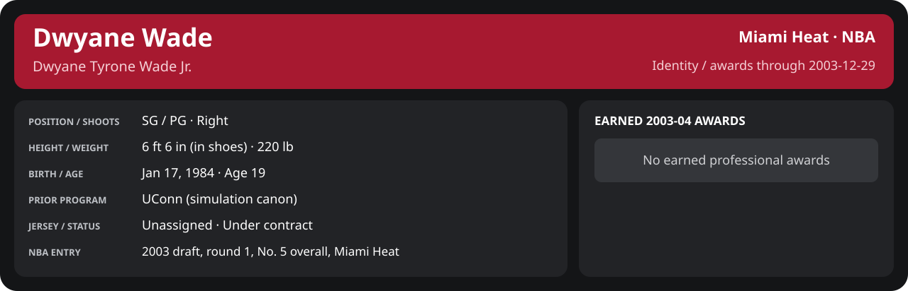

# December Week 4 Game 4

Player identity and statistics are generated here by `python scripts/update_player_reports.py`.
Decisions remain in the owning phase/week note. A scheduled game has no statistical result.

Miami's injured list for this game: John Wallace, Udonis Haslem, Sean Lampley (`00_Team/Transactions/injured_list.json`; twelve dress).

<!-- game-result:start -->
## Result

**Miami Heat 96 at Chicago Bulls 78** · Miami Heat W 96-78 vs Chicago Bulls · away (Chicago Bulls) · 2003-12-29

Event `2003-12-29-miami-heat-at-chicago-bulls` · Railway engine (runtime/private_service.py) · result file [`Game_4.result.json`](Game_4.result.json) (the engine's answer as served; the note is the canonical record).

### Box score

```text
Miami Heat 96 at Chicago Bulls 78
2003-12-29  2003-04 regular  event 2003-12-29-miami-heat-at-chicago-bulls
Kernel 2003.11, calibrated on 2002-03 (imported_source)

Period      1    2    3    4     T
Miami He   24   28   23   21    96
Chicago    22   18   21   17    78

Miami Heat
                           MIN  PTS   FG      3P     FT    OR  DR AST STL BLK  TO  PF
Mike James                34.7    9   3-11   1-3    2-2     0   3   6   3   0   3   0
Dwyane Wade               34.7   18   4-9    0-0   10-10    1   6   5   3   1   0   4
Caron Butler              24.4   10   2-10   0-0    6-6     3   1   1   0   0   1   0
Scott Padgett             34.7   16   6-8    1-1    3-4     2   3   2   2   1   1   2
Shawn Kemp                34.6   16   7-18   0-0    2-2     4  14   2   1   0   1   2
Brian Grant               21.4    8   3-11   0-0    2-2     1   4   0   0   0   0   2
Eddie Jones               17.7    4   2-6    0-2    0-0     0   1   2   0   1   0   0
Stephen Jackson           13.4    5   2-3    0-0    1-2     0   3   1   2   0   2   2
Cherokee Parks            10.3    3   1-3    0-0    1-2     2   1   0   0   0   0   1
Anthony Carter             9.2    4   2-4    0-1    0-0     1   0   0   0   0   0   0
LaPhonso Ellis             4.1    3   1-3    1-2    0-1     0   1   0   0   0   0   0
Rasual Butler              0.9    0   0-0    0-0    0-0     0   1   0   0   0   0   0
TEAM                     240.0   96  33-86   3-9   27-31   14  38  19  11   3   8  13

Chicago Bulls
                           MIN  PTS   FG      3P     FT    OR  DR AST STL BLK  TO  PF
Kirk Hinrich              41.2   16   6-15   2-7    2-2     2   3   9   1   0   1   3
Jamal Crawford            40.4   15   7-21   1-8    0-0     2   4   6   2   0   5   3
Eddy Curry                35.4   18   8-12   0-0    2-4     4  13   0   1   3   2   5
Kendall Gill              25.5    6   2-7    0-0    2-4     3   5   3   0   0   3   5
Eddie Robinson            24.0   11   5-14   1-1    0-0     0   2   1   0   0   2   1
Ronald Dupree             22.6    4   1-7    1-2    1-4     2   2   1   1   0   2   1
Corie Blount              15.7    2   1-4    0-0    0-0     1   0   0   0   0   0   1
Marcus Fizer              11.8    4   2-5    0-0    0-0     1   1   2   0   1   0   1
Linton Johnson            10.3    2   1-1    0-0    0-0     1   3   0   0   1   1   1
Scottie Pippen             6.9    0   0-2    0-1    0-0     1   2   0   0   0   0   0
Chris Jefferies            3.1    0   0-2    0-0    0-0     0   0   0   0   0   1   0
Keon Clark                 3.1    0   0-0    0-0    0-0     0   0   1   0   0   0   0
TEAM                     240.0   78  33-90   5-19   7-14   17  35  23   5   5  17  21
```

### Miami injuries

No Miami injury was drawn in this game.
<!-- game-result:end -->

<!-- player-report:start -->
## Professional identity



| Player | Age on report date | Team / league | Position | Number | Status |
| --- | --- | --- | --- | --- | --- |
| Dwyane Tyrone Wade Jr. | 19 | Miami Heat / NBA | SG / PG | Not assigned | Under contract |

| Identity field | Recorded value |
| --- | --- |
| Birth date | 1984-01-17 |
| NBA entry | 2003 draft, round 1, No. 5 overall, Miami Heat |
| Prior program | UConn (simulation canon) |
| Height, in shoes / without shoes | 6 ft 6 in / 6 ft 4.75 in |
| Weight | 220 lb |
| Wingspan / standing reach | 6 ft 11.5 in / 8 ft 7.5 in |
| Shooting hand | Right |
| Contract | Rookie scale signed 2003-07-21: three seasons plus a 2006-07 team option |
| Role | Starter; staff plan 34 minutes |
| NBA debut | October 28, 2003 at Philadelphia 76ers (2003-04/06_Regular_Season/10_October/Week_4/Game_1.md) |
| Nationality | United States (born in the Chicago area; Robbins, Illinois home community, per the player profile) |
| National team | No selection recorded |
| National-team eligibility | Not verified |
| Availability | No current restriction recorded in the established profile |
| Physical measurements recorded | 2003-06-25 |
| Professional status effective | 2003-12-01 |

Identity as of 2003-12-29; status snapshot dated 2003-12-01. User-established alternate-history player; historical Wade's biography and results are not this record.

### Earned 2003-04 awards

| Award | Period | Announced | Decision record |
| --- | --- | --- | --- |
| Eastern Conference Rookie of the Month | 2003-10-28 to 2003-11-30 | 2003-12-02 | [East ROM](../../../../Stats_and_Awards/League/2003-04/11_November/League_Awards.md#rookie-of-the-month) |
| Eastern Conference Player of the Week | 2003-12-15 to 2003-12-21 | 2003-12-22 | [East POW](../../../../Stats_and_Awards/League/2003-04/12_December/Week_3/League_Awards.md#player-of-the-week) |

## Statistics

As of **2003-12-29**: 1 closed games; 1/1 have player participation and box coverage; recorded DNPs: 0.

G counts appearances; GS counts recorded starts. DNPs, scheduled games and canceled games do not enter per-game denominators.

### Per game

[](../../../../Stats_and_Awards/player_cards.html?period=regular-2003-04-game-63cbdbe00a8da78d#shooting) [](../../../../Stats_and_Awards/player_cards.html#contract) [](../../../../Stats_and_Awards/player_cards.html#awards)

[Shooting detail](../../../../Stats_and_Awards/Shooting.md) · [Current contract](../../../../Stats_and_Awards/Contract.md#current-contract) · [Contract history](../../../../Stats_and_Awards/Contract.md#contract-history) · [Annual award record](../../../../Stats_and_Awards/Awards.md)

| Scope | Age | Team | Lg | Pos | G | GS | MP | FG | FGA | FG% | 3P | 3PA | 3P% | 2P | 2PA | 2P% | eFG% | FT | FTA | FT% | ORB | DRB | TRB | AST | STL | BLK | TOV | PF | PTS | TS% (est.) | Awards |
| --- | --- | --- | --- | --- | --- | --- | --- | --- | --- | --- | --- | --- | --- | --- | --- | --- | --- | --- | --- | --- | --- | --- | --- | --- | --- | --- | --- | --- | --- | --- | --- |
| This game | 19 | Miami Heat | NBA | SG / PG | 1 | 1 | 34.7 | 4.0 | 9.0 | .444 | 0.0 | 0.0 | N/A | 4.0 | 9.0 | .444 | .444 | 10.0 | 10.0 | 1.000 | 1.0 | 6.0 | 7.0 | 5.0 | 3.0 | 1.0 | 0.0 | 4.0 | 18.0 | .672 | — |

G and GS are counts; MP and counting statistics are **per appearance**. Shooting uses **.500 = 50.0%**. Age is at the row's cutoff. Scroll horizontally for every column.

Awards are confirmed through 2006-04-03, filed by the honor's period-end date; the banner shows career awards known at the page's identity cutoff.

### Production

| Metric | Total | Per appearance | Per 36 minutes |
| --- | --- | --- | --- |
| MIN | 34.7 | 34.7 | 36.0 |
| PTS | 18 | 18.0 | 18.7 |
| OREB | 1 | 1.0 | 1.0 |
| DREB | 6 | 6.0 | 6.2 |
| REB | 7 | 7.0 | 7.3 |
| AST | 5 | 5.0 | 5.2 |
| STL | 3 | 3.0 | 3.1 |
| BLK | 1 | 1.0 | 1.0 |
| TOV | 0 | 0.0 | 0.0 |
| PF | 4 | 4.0 | 4.2 |
| FGM | 4 | 4.0 | 4.2 |
| FGA | 9 | 9.0 | 9.3 |
| 2PM | 4 | 4.0 | 4.2 |
| 2PA | 9 | 9.0 | 9.3 |
| 3PM | 0 | 0.0 | 0.0 |
| 3PA | 0 | 0.0 | 0.0 |
| FTM | 10 | 10.0 | 10.4 |
| FTA | 10 | 10.0 | 10.4 |
| FT points | 10 | 10.0 | 10.4 |

Per-36 rates standardize playing time; they are not a projection of playing 36 minutes. Use the actual minutes denominator in every competition.

### Shooting

| Shot type | Makes | Attempts | Percentage |
| --- | --- | --- | --- |
| All field goals | 4 | 9 | 44.4% |
| Two-pointers | 4 | 9 | 44.4% |
| Three-pointers | 0 | 0 | N/A |
| Free throws | 10 | 10 | 100.0% |

### Efficiency and shot selection

| Metric | Value | Calculation / unit |
| --- | --- | --- |
| eFG% | 44.4% | (FGM + 0.5 × 3PM) / FGA |
| TS% (estimated) | 67.2% | PTS / [2 × (FGA + 0.44 × FTA)] |
| Three-point attempt share | 0.0% | 3PA / FGA |
| Free-throw attempt rate | 1.111 | FTA / FGA; ratio |
| Assist / turnover ratio | N/A | AST / TOV; N/A at zero turnovers |
| Plus/minus total | N/A | Observed on-court score differential only |
| Double-doubles | 0 | At least 10 in any two of PTS, REB, AST, STL, BLK |
| Triple-doubles | 0 | At least 10 in any three; also included in double-doubles |

Percentages use pooled makes and attempts. TS% uses an estimated free-throw weighting, not exact scoring possessions. Rounding is display-only.

### Splits

[](../../../../Stats_and_Awards/player_cards.html?period=regular-2003-04-week-2003-12-22#shooting) [](../../../../Stats_and_Awards/player_cards.html#contract) [](../../../../Stats_and_Awards/player_cards.html#awards)

[Shooting detail](../../../../Stats_and_Awards/Shooting.md) · [Current contract](../../../../Stats_and_Awards/Contract.md#current-contract) · [Contract history](../../../../Stats_and_Awards/Contract.md#contract-history) · [Annual award record](../../../../Stats_and_Awards/Awards.md)

| Scope | Age | Team | Lg | Pos | G | GS | MP | FG | FGA | FG% | 3P | 3PA | 3P% | 2P | 2PA | 2P% | eFG% | FT | FTA | FT% | ORB | DRB | TRB | AST | STL | BLK | TOV | PF | PTS | TS% (est.) | Awards |
| --- | --- | --- | --- | --- | --- | --- | --- | --- | --- | --- | --- | --- | --- | --- | --- | --- | --- | --- | --- | --- | --- | --- | --- | --- | --- | --- | --- | --- | --- | --- | --- |
| Home | 19 | Miami Heat | NBA | SG / PG | 0 | N/A | N/A | N/A | N/A | N/A | N/A | N/A | N/A | N/A | N/A | N/A | N/A | N/A | N/A | N/A | N/A | N/A | N/A | N/A | N/A | N/A | N/A | N/A | N/A | N/A | — |
| Away | 19 | Miami Heat | NBA | SG / PG | 1 | 1 | 34.7 | 4.0 | 9.0 | .444 | 0.0 | 0.0 | N/A | 4.0 | 9.0 | .444 | .444 | 10.0 | 10.0 | 1.000 | 1.0 | 6.0 | 7.0 | 5.0 | 3.0 | 1.0 | 0.0 | 4.0 | 18.0 | .672 | — |
| Neutral | 19 | Miami Heat | NBA | SG / PG | 0 | N/A | N/A | N/A | N/A | N/A | N/A | N/A | N/A | N/A | N/A | N/A | N/A | N/A | N/A | N/A | N/A | N/A | N/A | N/A | N/A | N/A | N/A | N/A | N/A | N/A | — |
| Wins | 19 | Miami Heat | NBA | SG / PG | 1 | 1 | 34.7 | 4.0 | 9.0 | .444 | 0.0 | 0.0 | N/A | 4.0 | 9.0 | .444 | .444 | 10.0 | 10.0 | 1.000 | 1.0 | 6.0 | 7.0 | 5.0 | 3.0 | 1.0 | 0.0 | 4.0 | 18.0 | .672 | — |
| Losses | 19 | Miami Heat | NBA | SG / PG | 0 | N/A | N/A | N/A | N/A | N/A | N/A | N/A | N/A | N/A | N/A | N/A | N/A | N/A | N/A | N/A | N/A | N/A | N/A | N/A | N/A | N/A | N/A | N/A | N/A | N/A | — |
| Team: Miami Heat | 19 | Miami Heat | NBA | SG / PG | 1 | 1 | 34.7 | 4.0 | 9.0 | .444 | 0.0 | 0.0 | N/A | 4.0 | 9.0 | .444 | .444 | 10.0 | 10.0 | 1.000 | 1.0 | 6.0 | 7.0 | 5.0 | 3.0 | 1.0 | 0.0 | 4.0 | 18.0 | .672 | — |

G and GS are counts; MP and counting statistics are **per appearance**. Shooting uses **.500 = 50.0%**. Age is at the row's cutoff. Scroll horizontally for every column.

Awards are confirmed through 2006-04-03, filed by the honor's period-end date; the banner shows career awards known at the page's identity cutoff.

Splits overlap and are not additive. Each row has its own appearance denominator; games with unknown result classification are excluded from win/loss splits.

### Game highs

| Metric | High | Date / opponent (all ties) |
| --- | --- | --- |
| PTS | 18 | [2003-12-29 at Chicago Bulls](Game_4.md) |
| REB | 7 | [2003-12-29 at Chicago Bulls](Game_4.md) |
| AST | 5 | [2003-12-29 at Chicago Bulls](Game_4.md) |
| STL | 3 | [2003-12-29 at Chicago Bulls](Game_4.md) |
| BLK | 1 | [2003-12-29 at Chicago Bulls](Game_4.md) |
| TOV | 0 | [2003-12-29 at Chicago Bulls](Game_4.md) |

### Game log

| Date / source | Opponent | Venue | Result | Participation | MIN | PTS | REB | AST | STL | BLK | TOV |
| --- | --- | --- | --- | --- | --- | --- | --- | --- | --- | --- | --- |
| [2003-12-29](Game_4.md) | Chicago Bulls | away | W 96-78 | Played | 34.7 | 18 | 7 | 5 | 3 | 1 | 0 |

### Game shooting detail

| Date / source | FG | 2P | 3P | FT | eFG% | TS% (est.) | +/- | PF |
| --- | --- | --- | --- | --- | --- | --- | --- | --- |
| [2003-12-29](Game_4.md) | 4/9 | 4/9 | 0/0 | 10/10 | 44.4% | 67.2% | N/A | 4 |

### Additional data needed

| Statistic family | Current support | Required evidence |
| --- | --- | --- |
| Starts; plus/minus | N/A unless supplied in the player box | Explicit started and plus_minus fields |
| Per 100 possessions; offensive / defensive / net rating | Unavailable in current box feed | Player on-court possessions and both teams' scoring during those possessions |
| USG%; AST%; OREB%, DREB%, REB% | Unavailable in current box feed | Matching player/team/opponent opportunity counts and a declared method |
| Rim, paint, midrange, corner / above-break threes | Unavailable in current box feed | Shot locations, attempts and makes |
| Drives, touches, catch-and-shoot, pull-ups, play types | Unavailable in current box feed | Tracking or tagged play-by-play |
| Clutch, on/off, lineup combinations, assisted baskets | Unavailable in current box feed | Timed events, score state, substitutions and possession attribution |
| Deflections, charges, contested shots, box outs | Unavailable in current box feed | Observed hustle/defensive events |
| League rank, percentile, relative TS%; impact models | Not derived by this report | Same-period simulated league baseline, eligibility rules and documented model |

<!-- player-report:end -->
