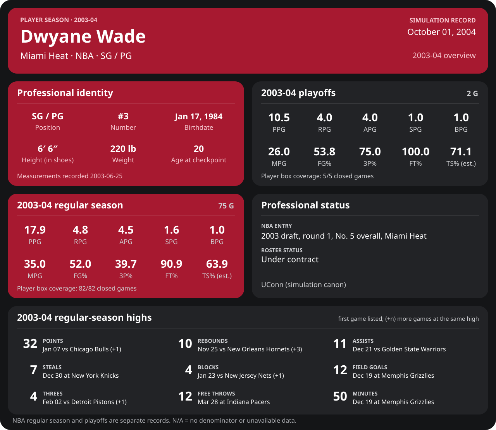
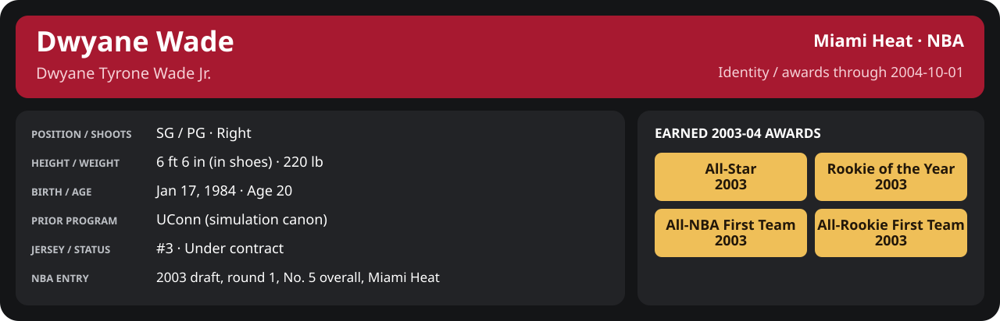

<!-- Generated by scripts/update_player_reports.py; edit source records, then rebuild. -->

# 2003-04 | Player season

## Professional identity

| Player | Age on report date | Team / league | Position | Number | Status |
| --- | --- | --- | --- | --- | --- |
| Dwyane Tyrone Wade Jr. | 20 | Miami Heat / NBA | SG / PG | 3 | Under contract |

| Identity field | Recorded value |
| --- | --- |
| Birth date | 1984-01-17 |
| NBA entry | 2003 draft, round 1, No. 5 overall, Miami Heat |
| Prior program | UConn (simulation canon) |
| Height, in shoes / without shoes | 6 ft 6 in / 6 ft 4.75 in |
| Weight | 220 lb |
| Wingspan / standing reach | 6 ft 11.5 in / 8 ft 7.5 in |
| Shooting hand | Right |
| Contract | Rookie scale signed 2003-07-21: three seasons plus a 2006-07 team option (2004-05: $2,361,800) |
| Role | Carried-over starter at SG; training camp sets the 2004-05 rotation |
| NBA debut | October 28, 2003 at Philadelphia 76ers (2003-04/06_Regular_Season/10_October/Week_4/Game_1.md) |
| Nationality | United States (born in the Chicago area; Robbins, Illinois home community, per the player profile) |
| National team | No selection recorded |
| National-team eligibility | United States (USA Basketball); no selection yet |
| Availability | No current restriction recorded in the established profile |
| Physical measurements recorded | 2003-06-25 |
| Professional status effective | 2004-10-01 |

Identity as of 2004-10-01; status snapshot dated 2004-10-01. User-established alternate-history player; historical Wade's biography and results are not this record.

[Complete professional identity](../Professional_Identity.md)

### Earned 2003-04 awards

| Award | Period | Announced | Decision record |
| --- | --- | --- | --- |
| Eastern Conference Rookie of the Month | 2003-10-28 to 2003-11-30 | 2003-12-02 | [East ROM](../Stats_and_Awards/League/2003-04/11_November/League_Awards.md#rookie-of-the-month) |
| Eastern Conference Player of the Week | 2003-12-15 to 2003-12-21 | 2003-12-22 | [East POW](../Stats_and_Awards/League/2003-04/12_December/Week_3/League_Awards.md#player-of-the-week) |
| Eastern Conference Player of the Month | 2003-12-01 to 2003-12-31 | 2004-01-02 | [East POM](../Stats_and_Awards/League/2003-04/12_December/League_Awards.md#player-of-the-month) |
| Eastern Conference Rookie of the Month | 2003-12-01 to 2003-12-31 | 2004-01-02 | [East ROM](../Stats_and_Awards/League/2003-04/12_December/League_Awards.md#rookie-of-the-month) |
| Eastern Conference Player of the Week | 2003-12-29 to 2004-01-04 | 2004-01-05 | [East POW](../Stats_and_Awards/League/2003-04/01_January/Week_1/League_Awards.md#player-of-the-week) |
| Eastern Conference Player of the Month | 2004-01-01 to 2004-01-31 | 2004-02-02 | [East POM](../Stats_and_Awards/League/2003-04/01_January/League_Awards.md#player-of-the-month) |
| Eastern Conference Rookie of the Month | 2004-01-01 to 2004-01-31 | 2004-02-02 | [East ROM](../Stats_and_Awards/League/2003-04/01_January/League_Awards.md#rookie-of-the-month) |
| All-Star | 2003-10-28 to 2004-02-03 | 2004-02-03 | [All-Star](../Stats_and_Awards/League/2003-04/All_Star.md#all-stars) |
| Eastern Conference Rookie of the Month | 2004-02-01 to 2004-02-29 | 2004-03-02 | [East ROM](../Stats_and_Awards/League/2003-04/02_February/League_Awards.md#rookie-of-the-month) |
| Eastern Conference Player of the Week | 2004-03-08 to 2004-03-14 | 2004-03-15 | [East POW](../Stats_and_Awards/League/2003-04/03_March/Week_2/League_Awards.md#player-of-the-week) |
| Eastern Conference Player of the Month | 2004-03-01 to 2004-03-31 | 2004-04-02 | [East POM](../Stats_and_Awards/League/2003-04/03_March/League_Awards.md#player-of-the-month) |
| Eastern Conference Rookie of the Month | 2004-03-01 to 2004-03-31 | 2004-04-02 | [East ROM](../Stats_and_Awards/League/2003-04/03_March/League_Awards.md#rookie-of-the-month) |
| Eastern Conference Rookie of the Month | 2004-04-01 to 2004-04-14 | 2004-04-16 | [East ROM](../Stats_and_Awards/League/2003-04/04_April/League_Awards.md#rookie-of-the-month) |
| Rookie of the Year | 2003-10-28 to 2004-04-14 | 2004-04-20 | [ROY](../Stats_and_Awards/League/2003-04/Season_Awards.md#rookie-of-the-year) |
| All-NBA First Team | 2003-10-28 to 2004-04-14 | 2004-04-25 | [All-NBA 1st](../Stats_and_Awards/League/2003-04/Season_Awards.md#all-nba-teams) |
| All-Rookie First Team | 2003-10-28 to 2004-04-14 | 2004-04-27 | [All-Rookie 1st](../Stats_and_Awards/League/2003-04/Season_Awards.md#all-rookie-teams) |

## Statistics

Report cutoff: **2004-10-01**. Each row is a separate competition; do not add the rates.

### Competition summary

  

[Shooting detail](../Stats_and_Awards/Shooting.md) · [Current contract](../Stats_and_Awards/Contract.md#current-contract) · [Contract history](../Stats_and_Awards/Contract.md#contract-history) · [Annual award record](../Stats_and_Awards/Awards.md)

| Scope | Age | Team | Lg | Pos | G | GS | MP | FG | FGA | FG% | 3P | 3PA | 3P% | 2P | 2PA | 2P% | eFG% | FT | FTA | FT% | ORB | DRB | TRB | AST | STL | BLK | TOV | PF | PTS | TS% (est.) | Awards |
| --- | --- | --- | --- | --- | --- | --- | --- | --- | --- | --- | --- | --- | --- | --- | --- | --- | --- | --- | --- | --- | --- | --- | --- | --- | --- | --- | --- | --- | --- | --- | --- |
| [Summer League](02_Summer_League/README.md) | 20 | Miami Heat | NBA | SG / PG | 0 | N/A | N/A | N/A | N/A | N/A | N/A | N/A | N/A | N/A | N/A | N/A | N/A | N/A | N/A | N/A | N/A | N/A | N/A | N/A | N/A | N/A | N/A | N/A | N/A | N/A | — |
| [Preseason](05_Preseason/README.md) | 20 | Miami Heat | NBA | SG / PG | N/A | N/A | N/A | N/A | N/A | N/A | N/A | N/A | N/A | N/A | N/A | N/A | N/A | N/A | N/A | N/A | N/A | N/A | N/A | N/A | N/A | N/A | N/A | N/A | N/A | N/A | — |
| [NBA regular season](06_Regular_Season/README.md) | 20 | Miami Heat | NBA | SG / PG | 75 | 70 | 35.0 | 6.1 | 11.7 | .520 | 0.9 | 2.4 | .397 | 5.1 | 9.3 | .551 | .560 | 4.8 | 5.3 | .909 | 1.4 | 3.4 | 4.8 | 4.5 | 1.6 | 1.0 | 1.1 | 2.9 | 17.9 | .639 | [East ROM](../Stats_and_Awards/League/2003-04/11_November/League_Awards.md#rookie-of-the-month), [East POW](../Stats_and_Awards/League/2003-04/12_December/Week_3/League_Awards.md#player-of-the-week), [East POM](../Stats_and_Awards/League/2003-04/12_December/League_Awards.md#player-of-the-month), [East ROM](../Stats_and_Awards/League/2003-04/12_December/League_Awards.md#rookie-of-the-month), [East POW](../Stats_and_Awards/League/2003-04/01_January/Week_1/League_Awards.md#player-of-the-week), [East POM](../Stats_and_Awards/League/2003-04/01_January/League_Awards.md#player-of-the-month), [East ROM](../Stats_and_Awards/League/2003-04/01_January/League_Awards.md#rookie-of-the-month), [All-Star](../Stats_and_Awards/League/2003-04/All_Star.md#all-stars), [East ROM](../Stats_and_Awards/League/2003-04/02_February/League_Awards.md#rookie-of-the-month), [East POW](../Stats_and_Awards/League/2003-04/03_March/Week_2/League_Awards.md#player-of-the-week), [East POM](../Stats_and_Awards/League/2003-04/03_March/League_Awards.md#player-of-the-month), [East ROM](../Stats_and_Awards/League/2003-04/03_March/League_Awards.md#rookie-of-the-month), [East ROM](../Stats_and_Awards/League/2003-04/04_April/League_Awards.md#rookie-of-the-month), [ROY](../Stats_and_Awards/League/2003-04/Season_Awards.md#rookie-of-the-year), [All-NBA 1st](../Stats_and_Awards/League/2003-04/Season_Awards.md#all-nba-teams), [All-Rookie 1st](../Stats_and_Awards/League/2003-04/Season_Awards.md#all-rookie-teams) |
| [NBA playoffs](08_Playoffs/README.md) | 20 | Miami Heat | NBA | SG / PG | 2 | 2 | 26.0 | 3.5 | 6.5 | .538 | 1.5 | 2.0 | .750 | 2.0 | 4.5 | .444 | .654 | 2.0 | 2.0 | 1.000 | 1.0 | 3.0 | 4.0 | 4.0 | 1.0 | 1.0 | 1.0 | 4.5 | 10.5 | .711 | — |

G and GS are counts; MP and counting statistics are **per appearance**. Shooting uses **.500 = 50.0%**. Age is at the row's cutoff. Scroll horizontally for every column.

Awards are confirmed through 2004-10-05, filed by the honor's period-end date; the banner shows career awards known at the page's identity cutoff.

### Regular season by month

  

[Shooting detail](../Stats_and_Awards/Shooting.md) · [Current contract](../Stats_and_Awards/Contract.md#current-contract) · [Contract history](../Stats_and_Awards/Contract.md#contract-history) · [Annual award record](../Stats_and_Awards/Awards.md)

| Scope | Age | Team | Lg | Pos | G | GS | MP | FG | FGA | FG% | 3P | 3PA | 3P% | 2P | 2PA | 2P% | eFG% | FT | FTA | FT% | ORB | DRB | TRB | AST | STL | BLK | TOV | PF | PTS | TS% (est.) | Awards |
| --- | --- | --- | --- | --- | --- | --- | --- | --- | --- | --- | --- | --- | --- | --- | --- | --- | --- | --- | --- | --- | --- | --- | --- | --- | --- | --- | --- | --- | --- | --- | --- |
| [October 2003](../Stats_and_Awards/2003-04/10_October/README.md) | 19 | Miami Heat | NBA | SG / PG | 3 | 0 | 19.4 | 2.7 | 5.7 | .471 | 0.3 | 1.0 | .333 | 2.3 | 4.7 | .500 | .500 | 3.7 | 3.7 | 1.000 | 1.7 | 1.0 | 2.7 | 1.7 | 1.0 | 0.3 | 0.3 | 1.0 | 9.3 | .641 | — |
| [November 2003](../Stats_and_Awards/2003-04/11_November/README.md) | 19 | Miami Heat | NBA | SG / PG | 14 | 12 | 35.3 | 5.9 | 11.4 | .519 | 0.6 | 2.5 | .257 | 5.3 | 8.9 | .592 | .547 | 4.3 | 4.7 | .909 | 1.4 | 3.8 | 5.2 | 4.9 | 1.4 | 0.7 | 1.3 | 3.0 | 16.8 | .622 | [East ROM](../Stats_and_Awards/League/2003-04/11_November/League_Awards.md#rookie-of-the-month) |
| [December 2003](../Stats_and_Awards/2003-04/12_December/README.md) | 19 | Miami Heat | NBA | SG / PG | 15 | 15 | 36.4 | 6.1 | 11.7 | .517 | 1.0 | 2.3 | .429 | 5.1 | 9.4 | .539 | .560 | 4.8 | 5.3 | .911 | 1.1 | 3.7 | 4.8 | 5.3 | 2.3 | 0.9 | 1.0 | 3.2 | 17.9 | .638 | [East POW](../Stats_and_Awards/League/2003-04/12_December/Week_3/League_Awards.md#player-of-the-week), [East POM](../Stats_and_Awards/League/2003-04/12_December/League_Awards.md#player-of-the-month), [East ROM](../Stats_and_Awards/League/2003-04/12_December/League_Awards.md#rookie-of-the-month) |
| [January 2004](../Stats_and_Awards/2003-04/01_January/README.md) | 20 | Miami Heat | NBA | SG / PG | 16 | 16 | 35.1 | 6.1 | 12.7 | .478 | 1.0 | 2.6 | .390 | 5.1 | 10.1 | .500 | .517 | 5.8 | 6.5 | .885 | 1.4 | 3.3 | 4.8 | 4.7 | 1.4 | 1.1 | 1.4 | 2.8 | 18.9 | .607 | [East POW](../Stats_and_Awards/League/2003-04/01_January/Week_1/League_Awards.md#player-of-the-week), [East POM](../Stats_and_Awards/League/2003-04/01_January/League_Awards.md#player-of-the-month), [East ROM](../Stats_and_Awards/League/2003-04/01_January/League_Awards.md#rookie-of-the-month) |
| [February 2004](../Stats_and_Awards/2003-04/02_February/README.md) | 20 | Miami Heat | NBA | SG / PG | 9 | 9 | 36.0 | 5.8 | 11.2 | .515 | 1.6 | 3.7 | .424 | 4.2 | 7.6 | .559 | .584 | 3.7 | 4.2 | .868 | 0.8 | 3.3 | 4.1 | 3.9 | 1.9 | 1.4 | 0.7 | 3.0 | 16.8 | .641 | [All-Star](../Stats_and_Awards/League/2003-04/All_Star.md#all-stars), [East ROM](../Stats_and_Awards/League/2003-04/02_February/League_Awards.md#rookie-of-the-month) |
| [March 2004](../Stats_and_Awards/2003-04/03_March/README.md) | 20 | Miami Heat | NBA | SG / PG | 13 | 13 | 37.0 | 7.5 | 13.6 | .548 | 1.1 | 2.2 | .483 | 6.4 | 11.4 | .561 | .588 | 6.1 | 6.5 | .929 | 1.4 | 3.5 | 4.8 | 4.7 | 1.6 | 0.9 | 1.0 | 3.0 | 22.1 | .669 | [East POW](../Stats_and_Awards/League/2003-04/03_March/Week_2/League_Awards.md#player-of-the-week), [East POM](../Stats_and_Awards/League/2003-04/03_March/League_Awards.md#player-of-the-month), [East ROM](../Stats_and_Awards/League/2003-04/03_March/League_Awards.md#rookie-of-the-month) |
| [April 2004](../Stats_and_Awards/2003-04/04_April/README.md) | 20 | Miami Heat | NBA | SG / PG | 5 | 5 | 32.0 | 5.8 | 9.0 | .644 | 0.4 | 0.6 | .667 | 5.4 | 8.4 | .643 | .667 | 2.6 | 2.6 | 1.000 | 2.4 | 3.6 | 6.0 | 2.8 | 0.8 | 1.8 | 1.2 | 3.6 | 14.6 | .720 | [East ROM](../Stats_and_Awards/League/2003-04/04_April/League_Awards.md#rookie-of-the-month), [ROY](../Stats_and_Awards/League/2003-04/Season_Awards.md#rookie-of-the-year), [All-NBA 1st](../Stats_and_Awards/League/2003-04/Season_Awards.md#all-nba-teams), [All-Rookie 1st](../Stats_and_Awards/League/2003-04/Season_Awards.md#all-rookie-teams) |

G and GS are counts; MP and counting statistics are **per appearance**. Shooting uses **.500 = 50.0%**. Age is at the row's cutoff. Scroll horizontally for every column.

Awards are confirmed through 2004-10-05, filed by the honor's period-end date; the banner shows career awards known at the page's identity cutoff.

### Career records

[Team state](00_Team/README.md) · [Free agency](01_Free_Agency/README.md) · [Offseason](03_Offseason/README.md) · [Training camp](04_Training_Camp/README.md) · [Draft](09_Draft/README.md)

[Open your live career milestones](../Milestones/index.html) · [Detailed Shooting, Contract and Awards](../Stats_and_Awards/player_cards.html) · [Every player's contract](../Contracts/index.html)
