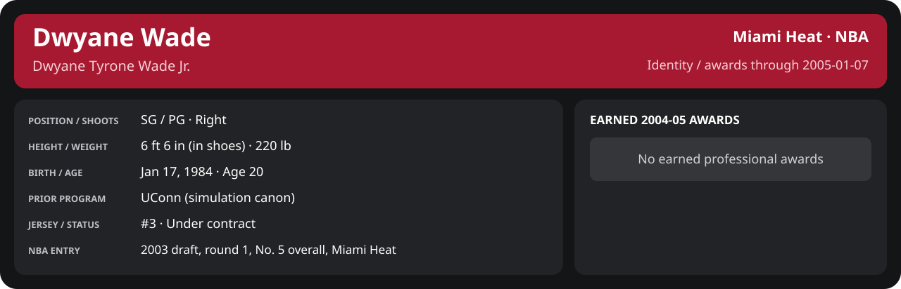

# January Week 1 Game 4

Player identity and statistics are generated here by `python scripts/update_player_reports.py`.
Decisions remain in the owning phase/week note. A scheduled game has no statistical result.

Miami's injured list for this game: Maurice Evans, John Thomas, John Edwards (`00_Team/Transactions/injured_list.json`; twelve dress).

<!-- game-result:start -->
## Result

**Miami Heat 91 at Portland Trail Blazers 88** · Miami Heat W 91-88 vs Portland Trail Blazers · away (Portland Trail Blazers) · 2005-01-07

Event `2005-01-07-miami-heat-at-portland-trail-blazers` · Railway engine (runtime/private_service.py) · result file [`Game_4.result.json`](Game_4.result.json) (the engine's answer as served; the note is the canonical record).

### Box score

```text
Miami Heat 91 at Portland Trail Blazers 88
2005-01-07  2004-05 regular  event 2005-01-07-miami-heat-at-portland-trail-blazers
Kernel 2003.11, calibrated on 2003-04 (imported_source)

Period      1    2    3    4     T
Miami He   24   25   18   24    91
Portland   19   17   18   34    88

Miami Heat
                           MIN  PTS   FG      3P     FT    OR  DR AST STL BLK  TO  PF
Mike James                22.6    6   3-7    0-1    0-0     0   2   3   0   1   0   5
Dwyane Wade               37.6   14   6-14   0-1    2-4     1   4   6   0   1   0   3
Caron Butler              35.4   21   8-15   2-5    3-3     3   8   1   1   0   3   2
Donyell Marshall          35.5   19   6-19   4-11   3-4     4   5   5   1   1   3   1
Brian Grant               37.2    6   2-5    0-0    2-2     4   4   2   0   1   2   3
Mehmet Okur               18.1    3   1-6    0-0    1-4     1   3   2   0   0   1   1
Rafer Alston              14.0    9   4-8    1-4    0-0     0   2   1   0   0   0   1
Kendall Gill              12.5    4   2-3    0-0    0-0     0   1   1   1   0   0   2
Dorell Wright              8.8    5   2-2    0-0    1-1     0   1   0   0   1   1   3
Eddie Jones                8.8    2   1-2    0-0    0-0     0   2   0   0   0   0   1
Lamond Murray              6.0    2   1-2    0-0    0-0     0   1   0   0   0   0   1
Maurice Baker              3.5    0   0-1    0-0    0-0     0   0   0   0   1   0   0
TEAM                     240.0   91  36-84   7-22  12-18   13  33  21   3   6  12  23
  Includes 2 team turnover(s) not charged to an individual.

Portland Trail Blazers
                           MIN  PTS   FG      3P     FT    OR  DR AST STL BLK  TO  PF
Zach Randolph             38.8   25  10-23   0-2    5-6     3   8   1   1   0   0   2
David Wesley              36.0   12   4-9    1-3    3-4     1   3   2   1   0   3   2
Rasheed Wallace           35.7    9   4-10   1-2    0-0     1   6   2   0   0   2   1
Ruben Patterson           32.1   13   6-11   0-2    1-2     2   4   2   2   0   1   3
Derek Anderson            30.4    4   2-9    0-2    0-0     1   4   4   0   0   1   1
Joel Przybilla            22.7    7   3-5    0-1    1-2     0   3   0   0   3   0   1
Dale Davis                20.4    5   2-4    0-0    1-4     2   4   1   2   1   2   1
Travis Outlaw              9.4    7   3-5    1-1    0-0     0   1   0   1   0   0   1
Theron Smith               6.0    2   0-1    0-0    2-2     0   0   1   0   0   1   0
Žarko Čabarkapa            5.4    4   2-3    0-0    0-0     0   0   1   0   0   0   0
Ben Handlogten             3.2    0   0-1    0-0    0-0     0   0   1   0   0   0   0
TEAM                     240.0   88  36-81   3-13  13-20   10  33  15   7   4  10  12
```

### Miami injuries

No Miami injury was drawn in this game.
<!-- game-result:end -->

<!-- player-report:start -->
## Professional identity



| Player | Age on report date | Team / league | Position | Number | Status |
| --- | --- | --- | --- | --- | --- |
| Dwyane Tyrone Wade Jr. | 20 | Miami Heat / NBA | SG / PG | 3 | Under contract |

| Identity field | Recorded value |
| --- | --- |
| Birth date | 1984-01-17 |
| NBA entry | 2003 draft, round 1, No. 5 overall, Miami Heat |
| Prior program | UConn (simulation canon) |
| Height, in shoes / without shoes | 6 ft 6 in / 6 ft 4.75 in |
| Weight | 220 lb |
| Wingspan / standing reach | 6 ft 11.5 in / 8 ft 7.5 in |
| Shooting hand | Right |
| Contract | Rookie scale signed 2003-07-21: three seasons plus a 2006-07 team option (2004-05: $2,361,800) |
| Role | Starting SG; staff plan 34 minutes |
| NBA debut | October 28, 2003 at Philadelphia 76ers (2003-04/06_Regular_Season/10_October/Week_4/Game_1.md) |
| Nationality | United States (born in the Chicago area; Robbins, Illinois home community, per the player profile) |
| National team | No selection recorded |
| National-team eligibility | United States (USA Basketball); no selection yet |
| Availability | No current restriction recorded in the established profile |
| Physical measurements recorded | 2003-06-25 |
| Professional status effective | 2004-10-28 |

Identity as of 2005-01-07; status snapshot dated 2004-10-28. User-established alternate-history player; historical Wade's biography and results are not this record.

### Earned 2004-05 awards

| Award | Period | Announced | Decision record |
| --- | --- | --- | --- |
| Eastern Conference Player of the Month | 2004-12-01 to 2004-12-31 | 2005-01-02 | [East POM](../../../../Stats_and_Awards/League/2004-05/12_December/League_Awards.md#player-of-the-month) |

## Statistics

As of **2005-01-07**: 1 closed games; 1/1 have player participation and box coverage; recorded DNPs: 0.

G counts appearances; GS counts recorded starts. DNPs, scheduled games and canceled games do not enter per-game denominators.

### Per game

[](../../../../Stats_and_Awards/player_cards.html?period=regular-2004-05-game-59eda1a4467a9fa2#shooting) [](../../../../Stats_and_Awards/player_cards.html#contract) [](../../../../Stats_and_Awards/player_cards.html#awards)

[Shooting detail](../../../../Stats_and_Awards/Shooting.md) · [Current contract](../../../../Stats_and_Awards/Contract.md#current-contract) · [Contract history](../../../../Stats_and_Awards/Contract.md#contract-history) · [Annual award record](../../../../Stats_and_Awards/Awards.md)

| Scope | Age | Team | Lg | Pos | G | GS | MP | FG | FGA | FG% | 3P | 3PA | 3P% | 2P | 2PA | 2P% | eFG% | FT | FTA | FT% | ORB | DRB | TRB | AST | STL | BLK | TOV | PF | PTS | TS% (est.) | Awards |
| --- | --- | --- | --- | --- | --- | --- | --- | --- | --- | --- | --- | --- | --- | --- | --- | --- | --- | --- | --- | --- | --- | --- | --- | --- | --- | --- | --- | --- | --- | --- | --- |
| This game | 20 | Miami Heat | NBA | SG / PG | 1 | 1 | 37.6 | 6.0 | 14.0 | .429 | 0.0 | 1.0 | .000 | 6.0 | 13.0 | .462 | .429 | 2.0 | 4.0 | .500 | 1.0 | 4.0 | 5.0 | 6.0 | 0.0 | 1.0 | 0.0 | 3.0 | 14.0 | .444 | — |

G and GS are counts; MP and counting statistics are **per appearance**. Shooting uses **.500 = 50.0%**. Age is at the row's cutoff. Scroll horizontally for every column.

Awards are confirmed through 2006-02-20, filed by the honor's period-end date; the banner shows career awards known at the page's identity cutoff.

### Production

| Metric | Total | Per appearance | Per 36 minutes |
| --- | --- | --- | --- |
| MIN | 37.6 | 37.6 | 36.0 |
| PTS | 14 | 14.0 | 13.4 |
| OREB | 1 | 1.0 | 1.0 |
| DREB | 4 | 4.0 | 3.8 |
| REB | 5 | 5.0 | 4.8 |
| AST | 6 | 6.0 | 5.8 |
| STL | 0 | 0.0 | 0.0 |
| BLK | 1 | 1.0 | 1.0 |
| TOV | 0 | 0.0 | 0.0 |
| PF | 3 | 3.0 | 2.9 |
| FGM | 6 | 6.0 | 5.8 |
| FGA | 14 | 14.0 | 13.4 |
| 2PM | 6 | 6.0 | 5.8 |
| 2PA | 13 | 13.0 | 12.5 |
| 3PM | 0 | 0.0 | 0.0 |
| 3PA | 1 | 1.0 | 1.0 |
| FTM | 2 | 2.0 | 1.9 |
| FTA | 4 | 4.0 | 3.8 |
| FT points | 2 | 2.0 | 1.9 |

Per-36 rates standardize playing time; they are not a projection of playing 36 minutes. Use the actual minutes denominator in every competition.

### Shooting

| Shot type | Makes | Attempts | Percentage |
| --- | --- | --- | --- |
| All field goals | 6 | 14 | 42.9% |
| Two-pointers | 6 | 13 | 46.2% |
| Three-pointers | 0 | 1 | 0.0% |
| Free throws | 2 | 4 | 50.0% |

### Efficiency and shot selection

| Metric | Value | Calculation / unit |
| --- | --- | --- |
| eFG% | 42.9% | (FGM + 0.5 × 3PM) / FGA |
| TS% (estimated) | 44.4% | PTS / [2 × (FGA + 0.44 × FTA)] |
| Three-point attempt share | 7.1% | 3PA / FGA |
| Free-throw attempt rate | 0.286 | FTA / FGA; ratio |
| Assist / turnover ratio | N/A | AST / TOV; N/A at zero turnovers |
| Plus/minus total | N/A | Observed on-court score differential only |
| Double-doubles | 0 | At least 10 in any two of PTS, REB, AST, STL, BLK |
| Triple-doubles | 0 | At least 10 in any three; also included in double-doubles |

Percentages use pooled makes and attempts. TS% uses an estimated free-throw weighting, not exact scoring possessions. Rounding is display-only.

### Splits

[](../../../../Stats_and_Awards/player_cards.html?period=regular-2004-05-week-2005-01-01#shooting) [](../../../../Stats_and_Awards/player_cards.html#contract) [](../../../../Stats_and_Awards/player_cards.html#awards)

[Shooting detail](../../../../Stats_and_Awards/Shooting.md) · [Current contract](../../../../Stats_and_Awards/Contract.md#current-contract) · [Contract history](../../../../Stats_and_Awards/Contract.md#contract-history) · [Annual award record](../../../../Stats_and_Awards/Awards.md)

| Scope | Age | Team | Lg | Pos | G | GS | MP | FG | FGA | FG% | 3P | 3PA | 3P% | 2P | 2PA | 2P% | eFG% | FT | FTA | FT% | ORB | DRB | TRB | AST | STL | BLK | TOV | PF | PTS | TS% (est.) | Awards |
| --- | --- | --- | --- | --- | --- | --- | --- | --- | --- | --- | --- | --- | --- | --- | --- | --- | --- | --- | --- | --- | --- | --- | --- | --- | --- | --- | --- | --- | --- | --- | --- |
| Home | 20 | Miami Heat | NBA | SG / PG | 0 | N/A | N/A | N/A | N/A | N/A | N/A | N/A | N/A | N/A | N/A | N/A | N/A | N/A | N/A | N/A | N/A | N/A | N/A | N/A | N/A | N/A | N/A | N/A | N/A | N/A | — |
| Away | 20 | Miami Heat | NBA | SG / PG | 1 | 1 | 37.6 | 6.0 | 14.0 | .429 | 0.0 | 1.0 | .000 | 6.0 | 13.0 | .462 | .429 | 2.0 | 4.0 | .500 | 1.0 | 4.0 | 5.0 | 6.0 | 0.0 | 1.0 | 0.0 | 3.0 | 14.0 | .444 | — |
| Neutral | 20 | Miami Heat | NBA | SG / PG | 0 | N/A | N/A | N/A | N/A | N/A | N/A | N/A | N/A | N/A | N/A | N/A | N/A | N/A | N/A | N/A | N/A | N/A | N/A | N/A | N/A | N/A | N/A | N/A | N/A | N/A | — |
| Wins | 20 | Miami Heat | NBA | SG / PG | 1 | 1 | 37.6 | 6.0 | 14.0 | .429 | 0.0 | 1.0 | .000 | 6.0 | 13.0 | .462 | .429 | 2.0 | 4.0 | .500 | 1.0 | 4.0 | 5.0 | 6.0 | 0.0 | 1.0 | 0.0 | 3.0 | 14.0 | .444 | — |
| Losses | 20 | Miami Heat | NBA | SG / PG | 0 | N/A | N/A | N/A | N/A | N/A | N/A | N/A | N/A | N/A | N/A | N/A | N/A | N/A | N/A | N/A | N/A | N/A | N/A | N/A | N/A | N/A | N/A | N/A | N/A | N/A | — |
| Team: Miami Heat | 20 | Miami Heat | NBA | SG / PG | 1 | 1 | 37.6 | 6.0 | 14.0 | .429 | 0.0 | 1.0 | .000 | 6.0 | 13.0 | .462 | .429 | 2.0 | 4.0 | .500 | 1.0 | 4.0 | 5.0 | 6.0 | 0.0 | 1.0 | 0.0 | 3.0 | 14.0 | .444 | — |

G and GS are counts; MP and counting statistics are **per appearance**. Shooting uses **.500 = 50.0%**. Age is at the row's cutoff. Scroll horizontally for every column.

Awards are confirmed through 2006-02-20, filed by the honor's period-end date; the banner shows career awards known at the page's identity cutoff.

Splits overlap and are not additive. Each row has its own appearance denominator; games with unknown result classification are excluded from win/loss splits.

### Game highs

| Metric | High | Date / opponent (all ties) |
| --- | --- | --- |
| PTS | 14 | [2005-01-07 at Portland Trail Blazers](Game_4.md) |
| REB | 5 | [2005-01-07 at Portland Trail Blazers](Game_4.md) |
| AST | 6 | [2005-01-07 at Portland Trail Blazers](Game_4.md) |
| STL | 0 | [2005-01-07 at Portland Trail Blazers](Game_4.md) |
| BLK | 1 | [2005-01-07 at Portland Trail Blazers](Game_4.md) |
| TOV | 0 | [2005-01-07 at Portland Trail Blazers](Game_4.md) |

### Game log

| Date / source | Opponent | Venue | Result | Participation | MIN | PTS | REB | AST | STL | BLK | TOV |
| --- | --- | --- | --- | --- | --- | --- | --- | --- | --- | --- | --- |
| [2005-01-07](Game_4.md) | Portland Trail Blazers | away | W 91-88 | Played | 37.6 | 14 | 5 | 6 | 0 | 1 | 0 |

### Game shooting detail

| Date / source | FG | 2P | 3P | FT | eFG% | TS% (est.) | +/- | PF |
| --- | --- | --- | --- | --- | --- | --- | --- | --- |
| [2005-01-07](Game_4.md) | 6/14 | 6/13 | 0/1 | 2/4 | 42.9% | 44.4% | N/A | 3 |

### Additional data needed

| Statistic family | Current support | Required evidence |
| --- | --- | --- |
| Starts; plus/minus | N/A unless supplied in the player box | Explicit started and plus_minus fields |
| Per 100 possessions; offensive / defensive / net rating | Unavailable in current box feed | Player on-court possessions and both teams' scoring during those possessions |
| USG%; AST%; OREB%, DREB%, REB% | Unavailable in current box feed | Matching player/team/opponent opportunity counts and a declared method |
| Rim, paint, midrange, corner / above-break threes | Unavailable in current box feed | Shot locations, attempts and makes |
| Drives, touches, catch-and-shoot, pull-ups, play types | Unavailable in current box feed | Tracking or tagged play-by-play |
| Clutch, on/off, lineup combinations, assisted baskets | Unavailable in current box feed | Timed events, score state, substitutions and possession attribution |
| Deflections, charges, contested shots, box outs | Unavailable in current box feed | Observed hustle/defensive events |
| League rank, percentile, relative TS%; impact models | Not derived by this report | Same-period simulated league baseline, eligibility rules and documented model |

<!-- player-report:end -->
