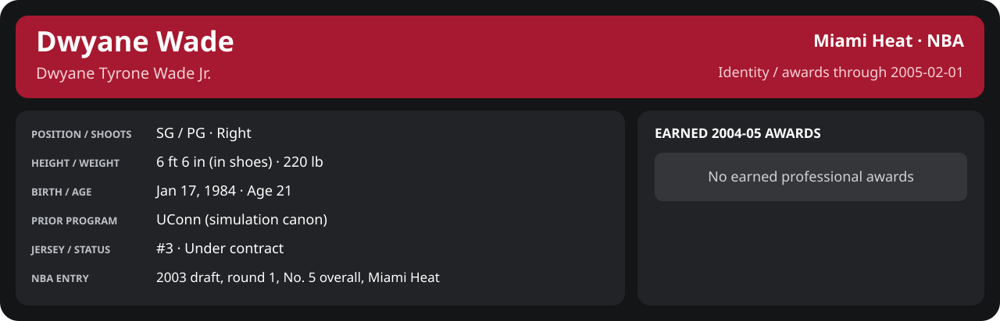

# February Week 1 Game 1

Player identity and statistics are generated here by `python scripts/update_player_reports.py`.
Decisions remain in the owning phase/week note. A scheduled game has no statistical result.

Miami's injured list for this game: Matt Harpring, John Edwards, John Thomas (`00_Team/Transactions/injured_list.json`; twelve dress).

<!-- game-result:start -->
## Result

**Miami Heat 89 at Dallas Mavericks 100** · Miami Heat L 89-100 vs Dallas Mavericks · away (Dallas Mavericks) · 2005-02-01

Event `2005-02-01-miami-heat-at-dallas-mavericks` · Railway engine (runtime/private_service.py) · result file [`Game_1.result.json`](Game_1.result.json) (the engine's answer as served; the note is the canonical record).

### Box score

```text
Miami Heat 89 at Dallas Mavericks 100
2005-02-01  2004-05 regular  event 2005-02-01-miami-heat-at-dallas-mavericks
Kernel 2003.11, calibrated on 2003-04 (imported_source)

Period      1    2    3    4     T
Miami He   11   28   21   29    89
Dallas M   22   24   26   28   100

Miami Heat
                           MIN  PTS   FG      3P     FT    OR  DR AST STL BLK  TO  PF
Mike James                33.1    8   2-12   1-5    3-3     0   2   6   3   0   3   5
Dwyane Wade               39.5   24   9-13   1-3    5-6     2   2   2   3   3   2   4
Caron Butler              35.5   13   5-10   0-1    3-4     0   2   1   1   0   2   2
Mehmet Okur               36.0   14   4-8    1-2    5-6     1   8   3   1   0   0   2
Brian Grant (DQ)          32.3    7   3-5    0-0    1-1     1   4   0   3   2   1   6
Donyell Marshall          21.6   17   7-13   3-5    0-0     1   2   2   0   1   1   1
Rafer Alston              17.1    0   0-7    0-3    0-0     0   0   2   0   0   1   3
Dorell Wright             11.7    2   0-3    0-1    2-2     0   0   2   0   0   1   0
Lamond Murray              4.1    2   1-3    0-0    0-0     0   0   0   0   0   0   0
Maurice Baker              5.1    0   0-0    0-0    0-0     0   1   0   0   0   0   1
Maurice Evans              4.1    2   1-2    0-0    0-0     1   1   0   0   0   0   0
TEAM                     240.0   89  32-76   6-20  19-22    6  22  18  11   6  13  24
  Includes 2 team turnover(s) not charged to an individual.

Dallas Mavericks
                           MIN  PTS   FG      3P     FT    OR  DR AST STL BLK  TO  PF
Dirk Nowitzki             38.5   29  11-17   0-0    7-10    2   9   5   1   0   3   4
Antoine Walker            40.4   18   7-11   1-3    3-8     2   5   6   0   0   3   0
Antawn Jamison            38.1   10   4-15   1-2    1-2     4   3   2   0   0   2   4
Michael Finley            28.4    5   2-5    0-0    1-2     0   0   3   0   1   0   5
Steve Nash                35.5   15   6-8    1-2    2-2     0   4   9   2   0   4   2
Josh Howard               29.0   12   4-11   1-1    3-4     1   7   0   0   0   2   4
Marquis Daniels           20.7    8   3-3    0-0    2-2     0   5   4   1   0   1   0
Eduardo Nájera             3.1    2   1-3    0-0    0-0     1   1   0   0   0   0   0
Danny Fortson              1.0    0   0-0    0-0    0-0     0   1   0   0   0   0   0
Carlos Delfino             2.3    0   0-0    0-0    0-0     0   1   0   0   0   0   0
Antonio Burks              3.1    1   0-0    0-0    1-2     0   0   0   0   1   0   0
TEAM                     240.0  100  38-73   4-8   20-32   10  36  29   4   2  16  19
  Includes 1 team turnover(s) not charged to an individual.
```

### Miami injuries

No Miami injury was drawn in this game.
<!-- game-result:end -->

<!-- player-report:start -->
## Professional identity



| Player | Age on report date | Team / league | Position | Number | Status |
| --- | --- | --- | --- | --- | --- |
| Dwyane Tyrone Wade Jr. | 21 | Miami Heat / NBA | SG / PG | 3 | Under contract |

| Identity field | Recorded value |
| --- | --- |
| Birth date | 1984-01-17 |
| NBA entry | 2003 draft, round 1, No. 5 overall, Miami Heat |
| Prior program | UConn (simulation canon) |
| Height, in shoes / without shoes | 6 ft 6 in / 6 ft 4.75 in |
| Weight | 220 lb |
| Wingspan / standing reach | 6 ft 11.5 in / 8 ft 7.5 in |
| Shooting hand | Right |
| Contract | Rookie scale signed 2003-07-21: three seasons plus a 2006-07 team option (2004-05: $2,361,800) |
| Role | Starting SG; staff plan 34 minutes |
| NBA debut | October 28, 2003 at Philadelphia 76ers (2003-04/06_Regular_Season/10_October/Week_4/Game_1.md) |
| Nationality | United States (born in the Chicago area; Robbins, Illinois home community, per the player profile) |
| National team | No selection recorded |
| National-team eligibility | United States (USA Basketball); no selection yet |
| Availability | No current restriction recorded in the established profile |
| Physical measurements recorded | 2003-06-25 |
| Professional status effective | 2004-10-28 |

Identity as of 2005-02-01; status snapshot dated 2004-10-28. User-established alternate-history player; historical Wade's biography and results are not this record.

### Earned 2004-05 awards

| Award | Period | Announced | Decision record |
| --- | --- | --- | --- |
| Eastern Conference Player of the Month | 2004-12-01 to 2004-12-31 | 2005-01-02 | [East POM](../../../../Stats_and_Awards/League/2004-05/12_December/League_Awards.md#player-of-the-month) |
| Eastern Conference Player of the Week | 2005-01-24 to 2005-01-30 | 2005-01-31 | [East POW](../../../../Stats_and_Awards/League/2004-05/01_January/Week_4/League_Awards.md#player-of-the-week) |

## Statistics

As of **2005-02-01**: 1 closed games; 1/1 have player participation and box coverage; recorded DNPs: 0.

G counts appearances; GS counts recorded starts. DNPs, scheduled games and canceled games do not enter per-game denominators.

### Per game

[](../../../../Stats_and_Awards/player_cards.html?period=regular-2004-05-game-005a247156a67a14#shooting) [](../../../../Stats_and_Awards/player_cards.html#contract) [](../../../../Stats_and_Awards/player_cards.html#awards)

[Shooting detail](../../../../Stats_and_Awards/Shooting.md) · [Current contract](../../../../Stats_and_Awards/Contract.md#current-contract) · [Contract history](../../../../Stats_and_Awards/Contract.md#contract-history) · [Annual award record](../../../../Stats_and_Awards/Awards.md)

| Scope | Age | Team | Lg | Pos | G | GS | MP | FG | FGA | FG% | 3P | 3PA | 3P% | 2P | 2PA | 2P% | eFG% | FT | FTA | FT% | ORB | DRB | TRB | AST | STL | BLK | TOV | PF | PTS | TS% (est.) | Awards |
| --- | --- | --- | --- | --- | --- | --- | --- | --- | --- | --- | --- | --- | --- | --- | --- | --- | --- | --- | --- | --- | --- | --- | --- | --- | --- | --- | --- | --- | --- | --- | --- |
| This game | 21 | Miami Heat | NBA | SG / PG | 1 | 1 | 39.5 | 9.0 | 13.0 | .692 | 1.0 | 3.0 | .333 | 8.0 | 10.0 | .800 | .731 | 5.0 | 6.0 | .833 | 2.0 | 2.0 | 4.0 | 2.0 | 3.0 | 3.0 | 2.0 | 4.0 | 24.0 | .767 | — |

G and GS are counts; MP and counting statistics are **per appearance**. Shooting uses **.500 = 50.0%**. Age is at the row's cutoff. Scroll horizontally for every column.

Awards are confirmed through 2005-05-29, filed by the honor's period-end date; the banner shows career awards known at the page's identity cutoff.

### Production

| Metric | Total | Per appearance | Per 36 minutes |
| --- | --- | --- | --- |
| MIN | 39.5 | 39.5 | 36.0 |
| PTS | 24 | 24.0 | 21.9 |
| OREB | 2 | 2.0 | 1.8 |
| DREB | 2 | 2.0 | 1.8 |
| REB | 4 | 4.0 | 3.6 |
| AST | 2 | 2.0 | 1.8 |
| STL | 3 | 3.0 | 2.7 |
| BLK | 3 | 3.0 | 2.7 |
| TOV | 2 | 2.0 | 1.8 |
| PF | 4 | 4.0 | 3.6 |
| FGM | 9 | 9.0 | 8.2 |
| FGA | 13 | 13.0 | 11.8 |
| 2PM | 8 | 8.0 | 7.3 |
| 2PA | 10 | 10.0 | 9.1 |
| 3PM | 1 | 1.0 | 0.9 |
| 3PA | 3 | 3.0 | 2.7 |
| FTM | 5 | 5.0 | 4.6 |
| FTA | 6 | 6.0 | 5.5 |
| FT points | 5 | 5.0 | 4.6 |

Per-36 rates standardize playing time; they are not a projection of playing 36 minutes. Use the actual minutes denominator in every competition.

### Shooting

| Shot type | Makes | Attempts | Percentage |
| --- | --- | --- | --- |
| All field goals | 9 | 13 | 69.2% |
| Two-pointers | 8 | 10 | 80.0% |
| Three-pointers | 1 | 3 | 33.3% |
| Free throws | 5 | 6 | 83.3% |

### Efficiency and shot selection

| Metric | Value | Calculation / unit |
| --- | --- | --- |
| eFG% | 73.1% | (FGM + 0.5 × 3PM) / FGA |
| TS% (estimated) | 76.7% | PTS / [2 × (FGA + 0.44 × FTA)] |
| Three-point attempt share | 23.1% | 3PA / FGA |
| Free-throw attempt rate | 0.462 | FTA / FGA; ratio |
| Assist / turnover ratio | 1.00 | AST / TOV; N/A at zero turnovers |
| Plus/minus total | N/A | Observed on-court score differential only |
| Double-doubles | 0 | At least 10 in any two of PTS, REB, AST, STL, BLK |
| Triple-doubles | 0 | At least 10 in any three; also included in double-doubles |

Percentages use pooled makes and attempts. TS% uses an estimated free-throw weighting, not exact scoring possessions. Rounding is display-only.

### Splits

[](../../../../Stats_and_Awards/player_cards.html?period=regular-2004-05-week-2005-02-01#shooting) [](../../../../Stats_and_Awards/player_cards.html#contract) [](../../../../Stats_and_Awards/player_cards.html#awards)

[Shooting detail](../../../../Stats_and_Awards/Shooting.md) · [Current contract](../../../../Stats_and_Awards/Contract.md#current-contract) · [Contract history](../../../../Stats_and_Awards/Contract.md#contract-history) · [Annual award record](../../../../Stats_and_Awards/Awards.md)

| Scope | Age | Team | Lg | Pos | G | GS | MP | FG | FGA | FG% | 3P | 3PA | 3P% | 2P | 2PA | 2P% | eFG% | FT | FTA | FT% | ORB | DRB | TRB | AST | STL | BLK | TOV | PF | PTS | TS% (est.) | Awards |
| --- | --- | --- | --- | --- | --- | --- | --- | --- | --- | --- | --- | --- | --- | --- | --- | --- | --- | --- | --- | --- | --- | --- | --- | --- | --- | --- | --- | --- | --- | --- | --- |
| Home | 21 | Miami Heat | NBA | SG / PG | 0 | N/A | N/A | N/A | N/A | N/A | N/A | N/A | N/A | N/A | N/A | N/A | N/A | N/A | N/A | N/A | N/A | N/A | N/A | N/A | N/A | N/A | N/A | N/A | N/A | N/A | — |
| Away | 21 | Miami Heat | NBA | SG / PG | 1 | 1 | 39.5 | 9.0 | 13.0 | .692 | 1.0 | 3.0 | .333 | 8.0 | 10.0 | .800 | .731 | 5.0 | 6.0 | .833 | 2.0 | 2.0 | 4.0 | 2.0 | 3.0 | 3.0 | 2.0 | 4.0 | 24.0 | .767 | — |
| Neutral | 21 | Miami Heat | NBA | SG / PG | 0 | N/A | N/A | N/A | N/A | N/A | N/A | N/A | N/A | N/A | N/A | N/A | N/A | N/A | N/A | N/A | N/A | N/A | N/A | N/A | N/A | N/A | N/A | N/A | N/A | N/A | — |
| Wins | 21 | Miami Heat | NBA | SG / PG | 0 | N/A | N/A | N/A | N/A | N/A | N/A | N/A | N/A | N/A | N/A | N/A | N/A | N/A | N/A | N/A | N/A | N/A | N/A | N/A | N/A | N/A | N/A | N/A | N/A | N/A | — |
| Losses | 21 | Miami Heat | NBA | SG / PG | 1 | 1 | 39.5 | 9.0 | 13.0 | .692 | 1.0 | 3.0 | .333 | 8.0 | 10.0 | .800 | .731 | 5.0 | 6.0 | .833 | 2.0 | 2.0 | 4.0 | 2.0 | 3.0 | 3.0 | 2.0 | 4.0 | 24.0 | .767 | — |
| Team: Miami Heat | 21 | Miami Heat | NBA | SG / PG | 1 | 1 | 39.5 | 9.0 | 13.0 | .692 | 1.0 | 3.0 | .333 | 8.0 | 10.0 | .800 | .731 | 5.0 | 6.0 | .833 | 2.0 | 2.0 | 4.0 | 2.0 | 3.0 | 3.0 | 2.0 | 4.0 | 24.0 | .767 | — |

G and GS are counts; MP and counting statistics are **per appearance**. Shooting uses **.500 = 50.0%**. Age is at the row's cutoff. Scroll horizontally for every column.

Awards are confirmed through 2005-05-29, filed by the honor's period-end date; the banner shows career awards known at the page's identity cutoff.

Splits overlap and are not additive. Each row has its own appearance denominator; games with unknown result classification are excluded from win/loss splits.

### Game highs

| Metric | High | Date / opponent (all ties) |
| --- | --- | --- |
| PTS | 24 | [2005-02-01 at Dallas Mavericks](Game_1.md) |
| REB | 4 | [2005-02-01 at Dallas Mavericks](Game_1.md) |
| AST | 2 | [2005-02-01 at Dallas Mavericks](Game_1.md) |
| STL | 3 | [2005-02-01 at Dallas Mavericks](Game_1.md) |
| BLK | 3 | [2005-02-01 at Dallas Mavericks](Game_1.md) |
| TOV | 2 | [2005-02-01 at Dallas Mavericks](Game_1.md) |

### Game log

| Date / source | Opponent | Venue | Result | Participation | MIN | PTS | REB | AST | STL | BLK | TOV |
| --- | --- | --- | --- | --- | --- | --- | --- | --- | --- | --- | --- |
| [2005-02-01](Game_1.md) | Dallas Mavericks | away | L 89-100 | Played | 39.5 | 24 | 4 | 2 | 3 | 3 | 2 |

### Game shooting detail

| Date / source | FG | 2P | 3P | FT | eFG% | TS% (est.) | +/- | PF |
| --- | --- | --- | --- | --- | --- | --- | --- | --- |
| [2005-02-01](Game_1.md) | 9/13 | 8/10 | 1/3 | 5/6 | 73.1% | 76.7% | N/A | 4 |

### Additional data needed

| Statistic family | Current support | Required evidence |
| --- | --- | --- |
| Starts; plus/minus | N/A unless supplied in the player box | Explicit started and plus_minus fields |
| Per 100 possessions; offensive / defensive / net rating | Unavailable in current box feed | Player on-court possessions and both teams' scoring during those possessions |
| USG%; AST%; OREB%, DREB%, REB% | Unavailable in current box feed | Matching player/team/opponent opportunity counts and a declared method |
| Rim, paint, midrange, corner / above-break threes | Unavailable in current box feed | Shot locations, attempts and makes |
| Drives, touches, catch-and-shoot, pull-ups, play types | Unavailable in current box feed | Tracking or tagged play-by-play |
| Clutch, on/off, lineup combinations, assisted baskets | Unavailable in current box feed | Timed events, score state, substitutions and possession attribution |
| Deflections, charges, contested shots, box outs | Unavailable in current box feed | Observed hustle/defensive events |
| League rank, percentile, relative TS%; impact models | Not derived by this report | Same-period simulated league baseline, eligibility rules and documented model |

<!-- player-report:end -->
