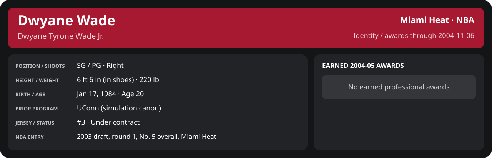

# November Week 1 Game 3

Player identity and statistics are generated here by `python scripts/update_player_reports.py`.
Decisions remain in the owning phase/week note. A scheduled game has no statistical result.

Miami's injured list for this game: Maurice Evans, John Thomas, John Edwards (`00_Team/Transactions/injured_list.json`; twelve dress).

<!-- game-result:start -->
## Result

**Miami Heat 104 at Washington Wizards 96** · Miami Heat W 104-96 vs Washington Wizards · away (Washington Wizards) · 2004-11-06

Event `2004-11-06-miami-heat-at-washington-wizards` · Railway engine (runtime/private_service.py) · result file [`Game_3.result.json`](Game_3.result.json) (the engine's answer as served; the note is the canonical record).

### Box score

```text
Miami Heat 104 at Washington Wizards 96
2004-11-06  2004-05 regular  event 2004-11-06-miami-heat-at-washington-wizards
Kernel 2003.11, calibrated on 2003-04 (imported_source)

Period      1    2    3    4     T
Miami He   22   20   36   26   104
Washingt   19   25   24   28    96

Miami Heat
                           MIN  PTS   FG      3P     FT    OR  DR AST STL BLK  TO  PF
Mike James                46.1   14   5-20   0-6    4-4     0   1   5   2   0   3   4
Dwyane Wade               22.7    9   2-6    1-3    4-5     0   1   5   4   0   1   5
Mehmet Okur               31.1   26   9-14   0-0    8-9     4   9   2   0   1   0   4
Brian Grant               20.4    3   1-5    0-0    1-2     0   6   0   0   0   0   5
Scott Padgett             31.1   13   4-8    1-2    4-6     4   3   3   1   1   0   3
Udonis Haslem             21.9    4   2-4    0-0    0-0     3   3   0   0   0   0   2
Rafer Alston              19.1    7   1-4    0-1    5-6     0   2   4   0   0   2   3
Eddie Jones               15.5   11   4-5    2-2    1-2     1   2   0   0   0   0   1
Kendall Gill              13.7    7   3-8    1-1    0-0     1   1   3   2   0   0   0
Dorell Wright              8.7    6   3-5    0-1    0-0     0   0   0   0   0   1   1
Maurice Baker              9.6    4   2-3    0-0    0-0     1   0   0   0   0   3   0
TEAM                     240.0  104  36-82   5-16  27-34   14  28  22   9   2  11  28
  Includes 1 team turnover(s) not charged to an individual.

Washington Wizards
                           MIN  PTS   FG      3P     FT    OR  DR AST STL BLK  TO  PF
Gilbert Arenas            40.5   11   4-11   1-5    2-2     0   1   7   0   0   5   3
Larry Hughes              39.4   37  13-20   2-5    9-13    0   8   1   2   0   3   2
Emeka Okafor              37.3   13   5-9    0-1    3-4     2   3   1   1   2   1   5
Jarvis Hayes              32.3    2   0-9    0-0    2-2     0   4   1   0   1   4   3
Brendan Haywood           29.4   12   4-7    0-1    4-6     1   6   0   0   1   3   1
Jared Jeffries            18.7    4   2-4    0-2    0-0     0   1   1   1   0   0   5
Kwame Brown               19.3    7   3-4    0-0    1-3     3   3   0   0   1   0   4
Brent Barry               19.1    8   2-6    2-5    2-2     0   0   0   1   0   0   0
Christian Laettner         4.0    2   1-1    0-0    0-0     0   1   0   0   0   0   1
TEAM                     240.0   96  34-71   5-19  23-32    6  27  11   5   5  16  24
```

### Miami injuries

No Miami injury was drawn in this game.
<!-- game-result:end -->

<!-- player-report:start -->
## Professional identity



| Player | Age on report date | Team / league | Position | Number | Status |
| --- | --- | --- | --- | --- | --- |
| Dwyane Tyrone Wade Jr. | 20 | Miami Heat / NBA | SG / PG | 3 | Under contract |

| Identity field | Recorded value |
| --- | --- |
| Birth date | 1984-01-17 |
| NBA entry | 2003 draft, round 1, No. 5 overall, Miami Heat |
| Prior program | UConn (simulation canon) |
| Height, in shoes / without shoes | 6 ft 6 in / 6 ft 4.75 in |
| Weight | 220 lb |
| Wingspan / standing reach | 6 ft 11.5 in / 8 ft 7.5 in |
| Shooting hand | Right |
| Contract | Rookie scale signed 2003-07-21: three seasons plus a 2006-07 team option (2004-05: $2,361,800) |
| Role | Starting SG; staff plan 34 minutes |
| NBA debut | October 28, 2003 at Philadelphia 76ers (2003-04/06_Regular_Season/10_October/Week_4/Game_1.md) |
| Nationality | United States (born in the Chicago area; Robbins, Illinois home community, per the player profile) |
| National team | No selection recorded |
| National-team eligibility | United States (USA Basketball); no selection yet |
| Availability | No current restriction recorded in the established profile |
| Physical measurements recorded | 2003-06-25 |
| Professional status effective | 2004-10-28 |

Identity as of 2004-11-06; status snapshot dated 2004-10-28. User-established alternate-history player; historical Wade's biography and results are not this record.

### Earned 2004-05 awards

No 2004-05 awards yet.

## Statistics

As of **2004-11-06**: 1 closed games; 1/1 have player participation and box coverage; recorded DNPs: 0.

G counts appearances; GS counts recorded starts. DNPs, scheduled games and canceled games do not enter per-game denominators.

### Per game

[](../../../../Stats_and_Awards/player_cards.html?period=regular-2004-05-game-f946c0dd101d501f#shooting) [](../../../../Stats_and_Awards/player_cards.html#contract) [](../../../../Stats_and_Awards/player_cards.html#awards)

[Shooting detail](../../../../Stats_and_Awards/Shooting.md) · [Current contract](../../../../Stats_and_Awards/Contract.md#current-contract) · [Contract history](../../../../Stats_and_Awards/Contract.md#contract-history) · [Annual award record](../../../../Stats_and_Awards/Awards.md)

| Scope | Age | Team | Lg | Pos | G | GS | MP | FG | FGA | FG% | 3P | 3PA | 3P% | 2P | 2PA | 2P% | eFG% | FT | FTA | FT% | ORB | DRB | TRB | AST | STL | BLK | TOV | PF | PTS | TS% (est.) | Awards |
| --- | --- | --- | --- | --- | --- | --- | --- | --- | --- | --- | --- | --- | --- | --- | --- | --- | --- | --- | --- | --- | --- | --- | --- | --- | --- | --- | --- | --- | --- | --- | --- |
| This game | 20 | Miami Heat | NBA | SG / PG | 1 | 1 | 22.7 | 2.0 | 6.0 | .333 | 1.0 | 3.0 | .333 | 1.0 | 3.0 | .333 | .417 | 4.0 | 5.0 | .800 | 0.0 | 1.0 | 1.0 | 5.0 | 4.0 | 0.0 | 1.0 | 5.0 | 9.0 | .549 | — |

G and GS are counts; MP and counting statistics are **per appearance**. Shooting uses **.500 = 50.0%**. Age is at the row's cutoff. Scroll horizontally for every column.

Awards are confirmed through 2005-08-28, filed by the honor's period-end date; the banner shows career awards known at the page's identity cutoff.

### Production

| Metric | Total | Per appearance | Per 36 minutes |
| --- | --- | --- | --- |
| MIN | 22.7 | 22.7 | 36.0 |
| PTS | 9 | 9.0 | 14.3 |
| OREB | 0 | 0.0 | 0.0 |
| DREB | 1 | 1.0 | 1.6 |
| REB | 1 | 1.0 | 1.6 |
| AST | 5 | 5.0 | 7.9 |
| STL | 4 | 4.0 | 6.3 |
| BLK | 0 | 0.0 | 0.0 |
| TOV | 1 | 1.0 | 1.6 |
| PF | 5 | 5.0 | 7.9 |
| FGM | 2 | 2.0 | 3.2 |
| FGA | 6 | 6.0 | 9.5 |
| 2PM | 1 | 1.0 | 1.6 |
| 2PA | 3 | 3.0 | 4.8 |
| 3PM | 1 | 1.0 | 1.6 |
| 3PA | 3 | 3.0 | 4.8 |
| FTM | 4 | 4.0 | 6.3 |
| FTA | 5 | 5.0 | 7.9 |
| FT points | 4 | 4.0 | 6.3 |

Per-36 rates standardize playing time; they are not a projection of playing 36 minutes. Use the actual minutes denominator in every competition.

### Shooting

| Shot type | Makes | Attempts | Percentage |
| --- | --- | --- | --- |
| All field goals | 2 | 6 | 33.3% |
| Two-pointers | 1 | 3 | 33.3% |
| Three-pointers | 1 | 3 | 33.3% |
| Free throws | 4 | 5 | 80.0% |

### Efficiency and shot selection

| Metric | Value | Calculation / unit |
| --- | --- | --- |
| eFG% | 41.7% | (FGM + 0.5 × 3PM) / FGA |
| TS% (estimated) | 54.9% | PTS / [2 × (FGA + 0.44 × FTA)] |
| Three-point attempt share | 50.0% | 3PA / FGA |
| Free-throw attempt rate | 0.833 | FTA / FGA; ratio |
| Assist / turnover ratio | 5.00 | AST / TOV; N/A at zero turnovers |
| Plus/minus total | N/A | Observed on-court score differential only |
| Double-doubles | 0 | At least 10 in any two of PTS, REB, AST, STL, BLK |
| Triple-doubles | 0 | At least 10 in any three; also included in double-doubles |

Percentages use pooled makes and attempts. TS% uses an estimated free-throw weighting, not exact scoring possessions. Rounding is display-only.

### Splits

[](../../../../Stats_and_Awards/player_cards.html?period=regular-2004-05-week-2004-11-01#shooting) [](../../../../Stats_and_Awards/player_cards.html#contract) [](../../../../Stats_and_Awards/player_cards.html#awards)

[Shooting detail](../../../../Stats_and_Awards/Shooting.md) · [Current contract](../../../../Stats_and_Awards/Contract.md#current-contract) · [Contract history](../../../../Stats_and_Awards/Contract.md#contract-history) · [Annual award record](../../../../Stats_and_Awards/Awards.md)

| Scope | Age | Team | Lg | Pos | G | GS | MP | FG | FGA | FG% | 3P | 3PA | 3P% | 2P | 2PA | 2P% | eFG% | FT | FTA | FT% | ORB | DRB | TRB | AST | STL | BLK | TOV | PF | PTS | TS% (est.) | Awards |
| --- | --- | --- | --- | --- | --- | --- | --- | --- | --- | --- | --- | --- | --- | --- | --- | --- | --- | --- | --- | --- | --- | --- | --- | --- | --- | --- | --- | --- | --- | --- | --- |
| Home | 20 | Miami Heat | NBA | SG / PG | 0 | N/A | N/A | N/A | N/A | N/A | N/A | N/A | N/A | N/A | N/A | N/A | N/A | N/A | N/A | N/A | N/A | N/A | N/A | N/A | N/A | N/A | N/A | N/A | N/A | N/A | — |
| Away | 20 | Miami Heat | NBA | SG / PG | 1 | 1 | 22.7 | 2.0 | 6.0 | .333 | 1.0 | 3.0 | .333 | 1.0 | 3.0 | .333 | .417 | 4.0 | 5.0 | .800 | 0.0 | 1.0 | 1.0 | 5.0 | 4.0 | 0.0 | 1.0 | 5.0 | 9.0 | .549 | — |
| Neutral | 20 | Miami Heat | NBA | SG / PG | 0 | N/A | N/A | N/A | N/A | N/A | N/A | N/A | N/A | N/A | N/A | N/A | N/A | N/A | N/A | N/A | N/A | N/A | N/A | N/A | N/A | N/A | N/A | N/A | N/A | N/A | — |
| Wins | 20 | Miami Heat | NBA | SG / PG | 1 | 1 | 22.7 | 2.0 | 6.0 | .333 | 1.0 | 3.0 | .333 | 1.0 | 3.0 | .333 | .417 | 4.0 | 5.0 | .800 | 0.0 | 1.0 | 1.0 | 5.0 | 4.0 | 0.0 | 1.0 | 5.0 | 9.0 | .549 | — |
| Losses | 20 | Miami Heat | NBA | SG / PG | 0 | N/A | N/A | N/A | N/A | N/A | N/A | N/A | N/A | N/A | N/A | N/A | N/A | N/A | N/A | N/A | N/A | N/A | N/A | N/A | N/A | N/A | N/A | N/A | N/A | N/A | — |
| Team: Miami Heat | 20 | Miami Heat | NBA | SG / PG | 1 | 1 | 22.7 | 2.0 | 6.0 | .333 | 1.0 | 3.0 | .333 | 1.0 | 3.0 | .333 | .417 | 4.0 | 5.0 | .800 | 0.0 | 1.0 | 1.0 | 5.0 | 4.0 | 0.0 | 1.0 | 5.0 | 9.0 | .549 | — |

G and GS are counts; MP and counting statistics are **per appearance**. Shooting uses **.500 = 50.0%**. Age is at the row's cutoff. Scroll horizontally for every column.

Awards are confirmed through 2005-08-28, filed by the honor's period-end date; the banner shows career awards known at the page's identity cutoff.

Splits overlap and are not additive. Each row has its own appearance denominator; games with unknown result classification are excluded from win/loss splits.

### Game highs

| Metric | High | Date / opponent (all ties) |
| --- | --- | --- |
| PTS | 9 | [2004-11-06 at Washington Wizards](Game_3.md) |
| REB | 1 | [2004-11-06 at Washington Wizards](Game_3.md) |
| AST | 5 | [2004-11-06 at Washington Wizards](Game_3.md) |
| STL | 4 | [2004-11-06 at Washington Wizards](Game_3.md) |
| BLK | 0 | [2004-11-06 at Washington Wizards](Game_3.md) |
| TOV | 1 | [2004-11-06 at Washington Wizards](Game_3.md) |

### Game log

| Date / source | Opponent | Venue | Result | Participation | MIN | PTS | REB | AST | STL | BLK | TOV |
| --- | --- | --- | --- | --- | --- | --- | --- | --- | --- | --- | --- |
| [2004-11-06](Game_3.md) | Washington Wizards | away | W 104-96 | Played | 22.7 | 9 | 1 | 5 | 4 | 0 | 1 |

### Game shooting detail

| Date / source | FG | 2P | 3P | FT | eFG% | TS% (est.) | +/- | PF |
| --- | --- | --- | --- | --- | --- | --- | --- | --- |
| [2004-11-06](Game_3.md) | 2/6 | 1/3 | 1/3 | 4/5 | 41.7% | 54.9% | N/A | 5 |

### Additional data needed

| Statistic family | Current support | Required evidence |
| --- | --- | --- |
| Starts; plus/minus | N/A unless supplied in the player box | Explicit started and plus_minus fields |
| Per 100 possessions; offensive / defensive / net rating | Unavailable in current box feed | Player on-court possessions and both teams' scoring during those possessions |
| USG%; AST%; OREB%, DREB%, REB% | Unavailable in current box feed | Matching player/team/opponent opportunity counts and a declared method |
| Rim, paint, midrange, corner / above-break threes | Unavailable in current box feed | Shot locations, attempts and makes |
| Drives, touches, catch-and-shoot, pull-ups, play types | Unavailable in current box feed | Tracking or tagged play-by-play |
| Clutch, on/off, lineup combinations, assisted baskets | Unavailable in current box feed | Timed events, score state, substitutions and possession attribution |
| Deflections, charges, contested shots, box outs | Unavailable in current box feed | Observed hustle/defensive events |
| League rank, percentile, relative TS%; impact models | Not derived by this report | Same-period simulated league baseline, eligibility rules and documented model |

<!-- player-report:end -->
