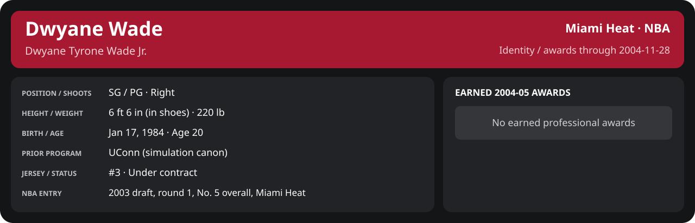

# November Week 4 Game 4

Player identity and statistics are generated here by `python scripts/update_player_reports.py`.
Decisions remain in the owning phase/week note. A scheduled game has no statistical result.

Miami's injured list for this game: John Thomas, John Edwards, Maurice Evans (`00_Team/Transactions/injured_list.json`; twelve dress).

<!-- game-result:start -->
## Result

**Boston Celtics 87 at Miami Heat 108** · Miami Heat W 108-87 vs Boston Celtics · home (Miami Heat) · 2004-11-28

Event `2004-11-28-boston-celtics-at-miami-heat` · Railway engine (runtime/private_service.py) · result file [`Game_4.result.json`](Game_4.result.json) (the engine's answer as served; the note is the canonical record).

### Box score

```text
Boston Celtics 87 at Miami Heat 108
2004-11-28  2004-05 regular  event 2004-11-28-boston-celtics-at-miami-heat
Kernel 2003.11, calibrated on 2003-04 (imported_source)

Period      1    2    3    4     T
Boston C   28   21   19   19    87
Miami He   31   29   22   26   108

Boston Celtics
                           MIN  PTS   FG      3P     FT    OR  DR AST STL BLK  TO  PF
Paul Pierce               40.5   26  10-25   2-4    4-6     1   5   3   6   0   1   4
Reggie Miller             35.9   14   5-14   2-7    2-3     0   1   3   1   0   3   3
Mark Blount               29.7    3   1-5    0-0    1-2     1   6   3   1   2   4   4
Austin Croshere           21.1    8   3-8    0-2    2-2     3   4   0   1   0   1   5
Jumaine Jones             29.3    6   2-6    2-3    0-2     2   3   1   2   0   0   2
Tony Battie               31.0    6   3-6    0-0    0-0     3   3   1   0   0   2   1
Walter McCarty            17.1   10   4-8    2-6    0-0     1   0   1   0   0   0   2
Sasha Pavlović            16.6    2   1-5    0-1    0-0     1   1   2   1   1   1   4
Kendrick Perkins          12.2    8   3-6    0-0    2-2     1   1   1   0   0   1   3
Kedrick Brown              3.2    2   1-1    0-0    0-0     0   0   0   0   0   0   0
Peter John Ramos           3.4    2   1-1    0-0    0-0     0   0   0   1   0   0   0
TEAM                     240.0   87  34-85   8-23  11-17   13  24  15  13   3  13  28

Miami Heat
                           MIN  PTS   FG      3P     FT    OR  DR AST STL BLK  TO  PF
Mike James                32.2   17   6-12   1-1    4-4     0   6   5   3   0   3   0
Dwyane Wade               38.4   10   2-7    1-1    5-6     1   2   6   2   3   2   1
Caron Butler              32.9   24   9-15   1-2    5-6     0   2   2   1   0   2   1
Mehmet Okur               19.4    7   3-3    0-0    1-1     4   5   3   0   0   1   5
Brian Grant               20.5    8   3-6    0-0    2-2     4   3   1   0   0   1   5
Scott Padgett             21.3    9   3-5    2-3    1-2     1   2   1   2   0   0   3
Udonis Haslem             20.5   12   4-5    0-0    4-4     0   9   2   0   0   2   1
Rafer Alston              15.8    5   2-4    1-2    0-0     1   1   0   1   0   0   2
Dorell Wright             14.1    2   1-7    0-0    0-0     0   1   0   0   0   0   1
Kendall Gill              12.6    5   2-5    0-0    1-2     0   0   0   1   1   2   2
Eddie Jones                6.6    3   1-4    1-4    0-0     0   0   0   0   0   0   1
Maurice Baker              5.7    6   2-3    0-0    2-2     1   0   0   0   0   3   0
TEAM                     240.0  108  38-76   7-13  25-29   12  31  20  10   4  16  22
```

### Miami injuries

No Miami injury was drawn in this game.
<!-- game-result:end -->

<!-- player-report:start -->
## Professional identity



| Player | Age on report date | Team / league | Position | Number | Status |
| --- | --- | --- | --- | --- | --- |
| Dwyane Tyrone Wade Jr. | 20 | Miami Heat / NBA | SG / PG | 3 | Under contract |

| Identity field | Recorded value |
| --- | --- |
| Birth date | 1984-01-17 |
| NBA entry | 2003 draft, round 1, No. 5 overall, Miami Heat |
| Prior program | UConn (simulation canon) |
| Height, in shoes / without shoes | 6 ft 6 in / 6 ft 4.75 in |
| Weight | 220 lb |
| Wingspan / standing reach | 6 ft 11.5 in / 8 ft 7.5 in |
| Shooting hand | Right |
| Contract | Rookie scale signed 2003-07-21: three seasons plus a 2006-07 team option (2004-05: $2,361,800) |
| Role | Starting SG; staff plan 34 minutes |
| NBA debut | October 28, 2003 at Philadelphia 76ers (2003-04/06_Regular_Season/10_October/Week_4/Game_1.md) |
| Nationality | United States (born in the Chicago area; Robbins, Illinois home community, per the player profile) |
| National team | No selection recorded |
| National-team eligibility | United States (USA Basketball); no selection yet |
| Availability | No current restriction recorded in the established profile |
| Physical measurements recorded | 2003-06-25 |
| Professional status effective | 2004-10-28 |

Identity as of 2004-11-28; status snapshot dated 2004-10-28. User-established alternate-history player; historical Wade's biography and results are not this record.

### Earned 2004-05 awards

No 2004-05 awards yet.

## Statistics

As of **2004-11-28**: 1 closed games; 1/1 have player participation and box coverage; recorded DNPs: 0.

G counts appearances; GS counts recorded starts. DNPs, scheduled games and canceled games do not enter per-game denominators.

### Per game

[](../../../../Stats_and_Awards/player_cards.html?period=regular-2004-05-game-f8b0d0993227bb47#shooting) [](../../../../Stats_and_Awards/player_cards.html#contract) [](../../../../Stats_and_Awards/player_cards.html#awards)

[Shooting detail](../../../../Stats_and_Awards/Shooting.md) · [Current contract](../../../../Stats_and_Awards/Contract.md#current-contract) · [Contract history](../../../../Stats_and_Awards/Contract.md#contract-history) · [Annual award record](../../../../Stats_and_Awards/Awards.md)

| Scope | Age | Team | Lg | Pos | G | GS | MP | FG | FGA | FG% | 3P | 3PA | 3P% | 2P | 2PA | 2P% | eFG% | FT | FTA | FT% | ORB | DRB | TRB | AST | STL | BLK | TOV | PF | PTS | TS% (est.) | Awards |
| --- | --- | --- | --- | --- | --- | --- | --- | --- | --- | --- | --- | --- | --- | --- | --- | --- | --- | --- | --- | --- | --- | --- | --- | --- | --- | --- | --- | --- | --- | --- | --- |
| This game | 20 | Miami Heat | NBA | SG / PG | 1 | 1 | 38.4 | 2.0 | 7.0 | .286 | 1.0 | 1.0 | 1.000 | 1.0 | 6.0 | .167 | .357 | 5.0 | 6.0 | .833 | 1.0 | 2.0 | 3.0 | 6.0 | 2.0 | 3.0 | 2.0 | 1.0 | 10.0 | .519 | — |

G and GS are counts; MP and counting statistics are **per appearance**. Shooting uses **.500 = 50.0%**. Age is at the row's cutoff. Scroll horizontally for every column.

Awards are confirmed through 2006-02-20, filed by the honor's period-end date; the banner shows career awards known at the page's identity cutoff.

### Production

| Metric | Total | Per appearance | Per 36 minutes |
| --- | --- | --- | --- |
| MIN | 38.4 | 38.4 | 36.0 |
| PTS | 10 | 10.0 | 9.4 |
| OREB | 1 | 1.0 | 0.9 |
| DREB | 2 | 2.0 | 1.9 |
| REB | 3 | 3.0 | 2.8 |
| AST | 6 | 6.0 | 5.6 |
| STL | 2 | 2.0 | 1.9 |
| BLK | 3 | 3.0 | 2.8 |
| TOV | 2 | 2.0 | 1.9 |
| PF | 1 | 1.0 | 0.9 |
| FGM | 2 | 2.0 | 1.9 |
| FGA | 7 | 7.0 | 6.6 |
| 2PM | 1 | 1.0 | 0.9 |
| 2PA | 6 | 6.0 | 5.6 |
| 3PM | 1 | 1.0 | 0.9 |
| 3PA | 1 | 1.0 | 0.9 |
| FTM | 5 | 5.0 | 4.7 |
| FTA | 6 | 6.0 | 5.6 |
| FT points | 5 | 5.0 | 4.7 |

Per-36 rates standardize playing time; they are not a projection of playing 36 minutes. Use the actual minutes denominator in every competition.

### Shooting

| Shot type | Makes | Attempts | Percentage |
| --- | --- | --- | --- |
| All field goals | 2 | 7 | 28.6% |
| Two-pointers | 1 | 6 | 16.7% |
| Three-pointers | 1 | 1 | 100.0% |
| Free throws | 5 | 6 | 83.3% |

### Efficiency and shot selection

| Metric | Value | Calculation / unit |
| --- | --- | --- |
| eFG% | 35.7% | (FGM + 0.5 × 3PM) / FGA |
| TS% (estimated) | 51.9% | PTS / [2 × (FGA + 0.44 × FTA)] |
| Three-point attempt share | 14.3% | 3PA / FGA |
| Free-throw attempt rate | 0.857 | FTA / FGA; ratio |
| Assist / turnover ratio | 3.00 | AST / TOV; N/A at zero turnovers |
| Plus/minus total | N/A | Observed on-court score differential only |
| Double-doubles | 0 | At least 10 in any two of PTS, REB, AST, STL, BLK |
| Triple-doubles | 0 | At least 10 in any three; also included in double-doubles |

Percentages use pooled makes and attempts. TS% uses an estimated free-throw weighting, not exact scoring possessions. Rounding is display-only.

### Splits

[](../../../../Stats_and_Awards/player_cards.html?period=regular-2004-05-game-f8b0d0993227bb47#shooting) [](../../../../Stats_and_Awards/player_cards.html#contract) [](../../../../Stats_and_Awards/player_cards.html#awards)

[Shooting detail](../../../../Stats_and_Awards/Shooting.md) · [Current contract](../../../../Stats_and_Awards/Contract.md#current-contract) · [Contract history](../../../../Stats_and_Awards/Contract.md#contract-history) · [Annual award record](../../../../Stats_and_Awards/Awards.md)

| Scope | Age | Team | Lg | Pos | G | GS | MP | FG | FGA | FG% | 3P | 3PA | 3P% | 2P | 2PA | 2P% | eFG% | FT | FTA | FT% | ORB | DRB | TRB | AST | STL | BLK | TOV | PF | PTS | TS% (est.) | Awards |
| --- | --- | --- | --- | --- | --- | --- | --- | --- | --- | --- | --- | --- | --- | --- | --- | --- | --- | --- | --- | --- | --- | --- | --- | --- | --- | --- | --- | --- | --- | --- | --- |
| Home | 20 | Miami Heat | NBA | SG / PG | 1 | 1 | 38.4 | 2.0 | 7.0 | .286 | 1.0 | 1.0 | 1.000 | 1.0 | 6.0 | .167 | .357 | 5.0 | 6.0 | .833 | 1.0 | 2.0 | 3.0 | 6.0 | 2.0 | 3.0 | 2.0 | 1.0 | 10.0 | .519 | — |
| Away | 20 | Miami Heat | NBA | SG / PG | 0 | N/A | N/A | N/A | N/A | N/A | N/A | N/A | N/A | N/A | N/A | N/A | N/A | N/A | N/A | N/A | N/A | N/A | N/A | N/A | N/A | N/A | N/A | N/A | N/A | N/A | — |
| Neutral | 20 | Miami Heat | NBA | SG / PG | 0 | N/A | N/A | N/A | N/A | N/A | N/A | N/A | N/A | N/A | N/A | N/A | N/A | N/A | N/A | N/A | N/A | N/A | N/A | N/A | N/A | N/A | N/A | N/A | N/A | N/A | — |
| Wins | 20 | Miami Heat | NBA | SG / PG | 1 | 1 | 38.4 | 2.0 | 7.0 | .286 | 1.0 | 1.0 | 1.000 | 1.0 | 6.0 | .167 | .357 | 5.0 | 6.0 | .833 | 1.0 | 2.0 | 3.0 | 6.0 | 2.0 | 3.0 | 2.0 | 1.0 | 10.0 | .519 | — |
| Losses | 20 | Miami Heat | NBA | SG / PG | 0 | N/A | N/A | N/A | N/A | N/A | N/A | N/A | N/A | N/A | N/A | N/A | N/A | N/A | N/A | N/A | N/A | N/A | N/A | N/A | N/A | N/A | N/A | N/A | N/A | N/A | — |
| Team: Miami Heat | 20 | Miami Heat | NBA | SG / PG | 1 | 1 | 38.4 | 2.0 | 7.0 | .286 | 1.0 | 1.0 | 1.000 | 1.0 | 6.0 | .167 | .357 | 5.0 | 6.0 | .833 | 1.0 | 2.0 | 3.0 | 6.0 | 2.0 | 3.0 | 2.0 | 1.0 | 10.0 | .519 | — |

G and GS are counts; MP and counting statistics are **per appearance**. Shooting uses **.500 = 50.0%**. Age is at the row's cutoff. Scroll horizontally for every column.

Awards are confirmed through 2006-02-20, filed by the honor's period-end date; the banner shows career awards known at the page's identity cutoff.

Splits overlap and are not additive. Each row has its own appearance denominator; games with unknown result classification are excluded from win/loss splits.

### Game highs

| Metric | High | Date / opponent (all ties) |
| --- | --- | --- |
| PTS | 10 | [2004-11-28 vs Boston Celtics](Game_4.md) |
| REB | 3 | [2004-11-28 vs Boston Celtics](Game_4.md) |
| AST | 6 | [2004-11-28 vs Boston Celtics](Game_4.md) |
| STL | 2 | [2004-11-28 vs Boston Celtics](Game_4.md) |
| BLK | 3 | [2004-11-28 vs Boston Celtics](Game_4.md) |
| TOV | 2 | [2004-11-28 vs Boston Celtics](Game_4.md) |

### Game log

| Date / source | Opponent | Venue | Result | Participation | MIN | PTS | REB | AST | STL | BLK | TOV |
| --- | --- | --- | --- | --- | --- | --- | --- | --- | --- | --- | --- |
| [2004-11-28](Game_4.md) | Boston Celtics | home | W 108-87 | Played | 38.4 | 10 | 3 | 6 | 2 | 3 | 2 |

### Game shooting detail

| Date / source | FG | 2P | 3P | FT | eFG% | TS% (est.) | +/- | PF |
| --- | --- | --- | --- | --- | --- | --- | --- | --- |
| [2004-11-28](Game_4.md) | 2/7 | 1/6 | 1/1 | 5/6 | 35.7% | 51.9% | N/A | 1 |

### Additional data needed

| Statistic family | Current support | Required evidence |
| --- | --- | --- |
| Starts; plus/minus | N/A unless supplied in the player box | Explicit started and plus_minus fields |
| Per 100 possessions; offensive / defensive / net rating | Unavailable in current box feed | Player on-court possessions and both teams' scoring during those possessions |
| USG%; AST%; OREB%, DREB%, REB% | Unavailable in current box feed | Matching player/team/opponent opportunity counts and a declared method |
| Rim, paint, midrange, corner / above-break threes | Unavailable in current box feed | Shot locations, attempts and makes |
| Drives, touches, catch-and-shoot, pull-ups, play types | Unavailable in current box feed | Tracking or tagged play-by-play |
| Clutch, on/off, lineup combinations, assisted baskets | Unavailable in current box feed | Timed events, score state, substitutions and possession attribution |
| Deflections, charges, contested shots, box outs | Unavailable in current box feed | Observed hustle/defensive events |
| League rank, percentile, relative TS%; impact models | Not derived by this report | Same-period simulated league baseline, eligibility rules and documented model |

<!-- player-report:end -->
