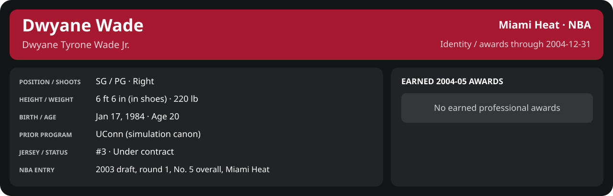

<!-- Generated by scripts/update_player_reports.py; edit source records, then rebuild. -->

# December 2004 | NBA regular season

[Career](../../../README.md) · [Professional identity](../../../Professional_Identity.md) · [Earned awards](../../../Awards.md) · [Stat definitions](../../../../../docs/player_statistics.md) · [Season](../../../Stats_and_Awards/2004-05/README.md) · [Miami](../../../Stats_and_Awards/Team/2004-05/12_December/Team_Stats.md) · [NBA players](../../../Stats_and_Awards/League/2004-05/12_December/League_Stats.md) · [NBA awards](../../../Stats_and_Awards/League/2004-05/12_December/League_Awards.md)

## Professional identity

| Player | Age on report date | Team / league | Position | Number | Status |
| --- | --- | --- | --- | --- | --- |
| Dwyane Tyrone Wade Jr. | 20 | Miami Heat / NBA | SG / PG | 3 | Under contract |

| Identity field | Recorded value |
| --- | --- |
| Birth date | 1984-01-17 |
| NBA entry | 2003 draft, round 1, No. 5 overall, Miami Heat |
| Prior program | UConn (simulation canon) |
| Height, in shoes / without shoes | 6 ft 6 in / 6 ft 4.75 in |
| Weight | 220 lb |
| Wingspan / standing reach | 6 ft 11.5 in / 8 ft 7.5 in |
| Shooting hand | Right |
| Contract | Rookie scale signed 2003-07-21: three seasons plus a 2006-07 team option (2004-05: $2,361,800) |
| Role | Starting SG; staff plan 34 minutes |
| NBA debut | October 28, 2003 at Philadelphia 76ers (2003-04/06_Regular_Season/10_October/Week_4/Game_1.md) |
| Nationality | United States (born in the Chicago area; Robbins, Illinois home community, per the player profile) |
| National team | No selection recorded |
| National-team eligibility | United States (USA Basketball); no selection yet |
| Availability | No current restriction recorded in the established profile |
| Physical measurements recorded | 2003-06-25 |
| Professional status effective | 2004-10-28 |

Identity as of 2004-12-31; status snapshot dated 2004-10-28. User-established alternate-history player; historical Wade's biography and results are not this record.

### Earned 2004-05 awards

No 2004-05 awards yet.

## Statistics

As of **2004-12-31**: 15 closed games; 15/15 have player participation and box coverage; recorded DNPs: 4.

G counts appearances; GS counts recorded starts. DNPs, scheduled games and canceled games do not enter per-game denominators.

### Per game

  

[Shooting detail](../../../Stats_and_Awards/Shooting.md) · [Current contract](../../../Stats_and_Awards/Contract.md#current-contract) · [Contract history](../../../Stats_and_Awards/Contract.md#contract-history) · [Annual award record](../../../Stats_and_Awards/Awards.md)

| Scope | Age | Team | Lg | Pos | G | GS | MP | FG | FGA | FG% | 3P | 3PA | 3P% | 2P | 2PA | 2P% | eFG% | FT | FTA | FT% | ORB | DRB | TRB | AST | STL | BLK | TOV | PF | PTS | TS% (est.) | Awards |
| --- | --- | --- | --- | --- | --- | --- | --- | --- | --- | --- | --- | --- | --- | --- | --- | --- | --- | --- | --- | --- | --- | --- | --- | --- | --- | --- | --- | --- | --- | --- | --- |
| This scope | 20 | Miami Heat | NBA | SG / PG | 11 | 11 | 36.8 | 7.6 | 13.8 | .553 | 1.5 | 3.1 | .471 | 6.2 | 10.7 | .576 | .605 | 6.5 | 6.5 | .986 | 1.3 | 4.5 | 5.8 | 3.6 | 1.3 | 1.1 | 1.8 | 3.3 | 23.2 | .694 | [East POM](../../../Stats_and_Awards/League/2004-05/12_December/League_Awards.md#player-of-the-month) |

G and GS are counts; MP and counting statistics are **per appearance**. Shooting uses **.500 = 50.0%**. Age is at the row's cutoff. Scroll horizontally for every column.

Awards are confirmed through 2006-03-27, filed by the honor's period-end date; the banner shows career awards known at the page's identity cutoff.

[Full statistical detail: totals, per 36, shooting, efficiency, splits and source games](../../../Stats_and_Awards/2004-05/12_December/Stat_Detail.md)

### Period summary

  

[Shooting detail](../../../Stats_and_Awards/Shooting.md) · [Current contract](../../../Stats_and_Awards/Contract.md#current-contract) · [Contract history](../../../Stats_and_Awards/Contract.md#contract-history) · [Annual award record](../../../Stats_and_Awards/Awards.md)

| Scope | Age | Team | Lg | Pos | G | GS | MP | FG | FGA | FG% | 3P | 3PA | 3P% | 2P | 2PA | 2P% | eFG% | FT | FTA | FT% | ORB | DRB | TRB | AST | STL | BLK | TOV | PF | PTS | TS% (est.) | Awards |
| --- | --- | --- | --- | --- | --- | --- | --- | --- | --- | --- | --- | --- | --- | --- | --- | --- | --- | --- | --- | --- | --- | --- | --- | --- | --- | --- | --- | --- | --- | --- | --- |
| [Week 1: 2004-12-01 to 2004-12-07](../../../Stats_and_Awards/2004-05/12_December/Week_1/README.md) | 20 | Miami Heat | NBA | SG / PG | 3 | 3 | 35.0 | 9.0 | 14.7 | .614 | 1.7 | 3.7 | .455 | 7.3 | 11.0 | .667 | .670 | 9.7 | 10.0 | .967 | 2.0 | 4.3 | 6.3 | 3.0 | 1.0 | 0.3 | 1.3 | 3.3 | 29.3 | .769 | — |
| [Week 2: 2004-12-08 to 2004-12-14](../../../Stats_and_Awards/2004-05/12_December/Week_2/README.md) | 20 | Miami Heat | NBA | SG / PG | 4 | 4 | 38.4 | 7.0 | 13.5 | .519 | 1.5 | 3.0 | .500 | 5.5 | 10.5 | .524 | .574 | 6.2 | 6.2 | 1.000 | 1.2 | 5.2 | 6.5 | 3.8 | 1.2 | 1.5 | 2.8 | 3.0 | 21.8 | .669 | — |
| [Week 3: 2004-12-15 to 2004-12-21](../../../Stats_and_Awards/2004-05/12_December/Week_3/README.md) | 20 | Miami Heat | NBA | SG / PG | 4 | 4 | 36.6 | 7.2 | 13.5 | .537 | 1.2 | 2.8 | .455 | 6.0 | 10.8 | .558 | .583 | 4.2 | 4.2 | 1.000 | 0.8 | 4.0 | 4.8 | 4.0 | 1.5 | 1.2 | 1.2 | 3.5 | 20.0 | .651 | — |
| [Week 4: 2004-12-22 to 2004-12-31](../../../Stats_and_Awards/2004-05/12_December/Week_4/README.md) | 20 | Miami Heat | NBA | SG / PG | 0 | N/A | N/A | N/A | N/A | N/A | N/A | N/A | N/A | N/A | N/A | N/A | N/A | N/A | N/A | N/A | N/A | N/A | N/A | N/A | N/A | N/A | N/A | N/A | N/A | N/A | [East POM](../../../Stats_and_Awards/League/2004-05/12_December/League_Awards.md#player-of-the-month) |

G and GS are counts; MP and counting statistics are **per appearance**. Shooting uses **.500 = 50.0%**. Age is at the row's cutoff. Scroll horizontally for every column.

Awards are confirmed through 2006-03-27, filed by the honor's period-end date; the banner shows career awards known at the page's identity cutoff.

### Period comparison

  

[Shooting detail](../../../Stats_and_Awards/Shooting.md) · [Current contract](../../../Stats_and_Awards/Contract.md#current-contract) · [Contract history](../../../Stats_and_Awards/Contract.md#contract-history) · [Annual award record](../../../Stats_and_Awards/Awards.md)

| Scope | Age | Team | Lg | Pos | G | GS | MP | FG | FGA | FG% | 3P | 3PA | 3P% | 2P | 2PA | 2P% | eFG% | FT | FTA | FT% | ORB | DRB | TRB | AST | STL | BLK | TOV | PF | PTS | TS% (est.) | Awards |
| --- | --- | --- | --- | --- | --- | --- | --- | --- | --- | --- | --- | --- | --- | --- | --- | --- | --- | --- | --- | --- | --- | --- | --- | --- | --- | --- | --- | --- | --- | --- | --- |
| December 2004 | 20 | Miami Heat | NBA | SG / PG | 11 | 11 | 36.8 | 7.6 | 13.8 | .553 | 1.5 | 3.1 | .471 | 6.2 | 10.7 | .576 | .605 | 6.5 | 6.5 | .986 | 1.3 | 4.5 | 5.8 | 3.6 | 1.3 | 1.1 | 1.8 | 3.3 | 23.2 | .694 | [East POM](../../../Stats_and_Awards/League/2004-05/12_December/League_Awards.md#player-of-the-month) |
| [November 2004](../../../Stats_and_Awards/2004-05/11_November/README.md) | 20 | Miami Heat | NBA | SG / PG | 15 | 15 | 35.1 | 5.6 | 11.5 | .488 | 0.9 | 2.1 | .452 | 4.7 | 9.4 | .496 | .529 | 4.5 | 4.9 | .932 | 1.7 | 3.5 | 5.1 | 4.1 | 1.7 | 1.4 | 1.3 | 2.3 | 16.7 | .612 | — |
| Season through this month | 20 | Miami Heat | NBA | SG / PG | 26 | 26 | 35.8 | 6.5 | 12.5 | .519 | 1.2 | 2.5 | .462 | 5.3 | 10.0 | .533 | .565 | 5.3 | 5.6 | .959 | 1.5 | 3.9 | 5.4 | 3.9 | 1.5 | 1.3 | 1.5 | 2.7 | 19.4 | .651 | [East POM](../../../Stats_and_Awards/League/2004-05/12_December/League_Awards.md#player-of-the-month) |

G and GS are counts; MP and counting statistics are **per appearance**. Shooting uses **.500 = 50.0%**. Age is at the row's cutoff. Scroll horizontally for every column.

Awards are confirmed through 2006-03-27, filed by the honor's period-end date; the banner shows career awards known at the page's identity cutoff.

### Production

| Metric | Total | Per appearance | Per 36 minutes |
| --- | --- | --- | --- |
| MIN | 405.0 | 36.8 | 36.0 |
| PTS | 255 | 23.2 | 22.7 |
| OREB | 14 | 1.3 | 1.2 |
| DREB | 50 | 4.5 | 4.4 |
| REB | 64 | 5.8 | 5.7 |
| AST | 40 | 3.6 | 3.6 |
| STL | 14 | 1.3 | 1.2 |
| BLK | 12 | 1.1 | 1.1 |
| TOV | 20 | 1.8 | 1.8 |
| PF | 36 | 3.3 | 3.2 |
| FGM | 84 | 7.6 | 7.5 |
| FGA | 152 | 13.8 | 13.5 |
| 2PM | 68 | 6.2 | 6.0 |
| 2PA | 118 | 10.7 | 10.5 |
| 3PM | 16 | 1.5 | 1.4 |
| 3PA | 34 | 3.1 | 3.0 |
| FTM | 71 | 6.5 | 6.3 |
| FTA | 72 | 6.5 | 6.4 |
| FT points | 71 | 6.5 | 6.3 |

Per-36 rates standardize playing time; they are not a projection of playing 36 minutes. Use the actual minutes denominator in every competition.

### Shooting

| Shot type | Makes | Attempts | Percentage |
| --- | --- | --- | --- |
| All field goals | 84 | 152 | 55.3% |
| Two-pointers | 68 | 118 | 57.6% |
| Three-pointers | 16 | 34 | 47.1% |
| Free throws | 71 | 72 | 98.6% |

### Efficiency and shot selection

| Metric | Value | Calculation / unit |
| --- | --- | --- |
| eFG% | 60.5% | (FGM + 0.5 × 3PM) / FGA |
| TS% (estimated) | 69.4% | PTS / [2 × (FGA + 0.44 × FTA)] |
| Three-point attempt share | 22.4% | 3PA / FGA |
| Free-throw attempt rate | 0.474 | FTA / FGA; ratio |
| Assist / turnover ratio | 2.00 | AST / TOV; N/A at zero turnovers |
| Plus/minus total | N/A | Observed on-court score differential only |
| Double-doubles | 0 | At least 10 in any two of PTS, REB, AST, STL, BLK |
| Triple-doubles | 0 | At least 10 in any three; also included in double-doubles |

Percentages use pooled makes and attempts. TS% uses an estimated free-throw weighting, not exact scoring possessions. Rounding is display-only.

### Splits

  

[Shooting detail](../../../Stats_and_Awards/Shooting.md) · [Current contract](../../../Stats_and_Awards/Contract.md#current-contract) · [Contract history](../../../Stats_and_Awards/Contract.md#contract-history) · [Annual award record](../../../Stats_and_Awards/Awards.md)

| Scope | Age | Team | Lg | Pos | G | GS | MP | FG | FGA | FG% | 3P | 3PA | 3P% | 2P | 2PA | 2P% | eFG% | FT | FTA | FT% | ORB | DRB | TRB | AST | STL | BLK | TOV | PF | PTS | TS% (est.) | Awards |
| --- | --- | --- | --- | --- | --- | --- | --- | --- | --- | --- | --- | --- | --- | --- | --- | --- | --- | --- | --- | --- | --- | --- | --- | --- | --- | --- | --- | --- | --- | --- | --- |
| Home | 20 | Miami Heat | NBA | SG / PG | 5 | 5 | 36.2 | 7.4 | 13.8 | .536 | 1.4 | 2.8 | .500 | 6.0 | 11.0 | .545 | .587 | 4.8 | 4.8 | 1.000 | 1.0 | 3.6 | 4.6 | 3.4 | 1.6 | 1.4 | 2.2 | 3.4 | 21.0 | .660 | — |
| Away | 20 | Miami Heat | NBA | SG / PG | 6 | 6 | 37.3 | 7.8 | 13.8 | .566 | 1.5 | 3.3 | .450 | 6.3 | 10.5 | .603 | .620 | 7.8 | 8.0 | .979 | 1.5 | 5.3 | 6.8 | 3.8 | 1.0 | 0.8 | 1.5 | 3.2 | 25.0 | .720 | — |
| Neutral | 20 | Miami Heat | NBA | SG / PG | 0 | N/A | N/A | N/A | N/A | N/A | N/A | N/A | N/A | N/A | N/A | N/A | N/A | N/A | N/A | N/A | N/A | N/A | N/A | N/A | N/A | N/A | N/A | N/A | N/A | N/A | — |
| Wins | 20 | Miami Heat | NBA | SG / PG | 8 | 8 | 39.6 | 7.8 | 15.0 | .517 | 1.4 | 3.4 | .407 | 6.4 | 11.6 | .548 | .562 | 7.4 | 7.5 | .983 | 1.6 | 5.1 | 6.8 | 4.1 | 1.5 | 1.4 | 1.9 | 3.0 | 24.2 | .663 | — |
| Losses | 20 | Miami Heat | NBA | SG / PG | 3 | 3 | 29.4 | 7.3 | 10.7 | .688 | 1.7 | 2.3 | .714 | 5.7 | 8.3 | .680 | .766 | 4.0 | 4.0 | 1.000 | 0.3 | 3.0 | 3.3 | 2.3 | 0.7 | 0.3 | 1.7 | 4.0 | 20.3 | .818 | — |
| Team: Miami Heat | 20 | Miami Heat | NBA | SG / PG | 11 | 11 | 36.8 | 7.6 | 13.8 | .553 | 1.5 | 3.1 | .471 | 6.2 | 10.7 | .576 | .605 | 6.5 | 6.5 | .986 | 1.3 | 4.5 | 5.8 | 3.6 | 1.3 | 1.1 | 1.8 | 3.3 | 23.2 | .694 | — |

G and GS are counts; MP and counting statistics are **per appearance**. Shooting uses **.500 = 50.0%**. Age is at the row's cutoff. Scroll horizontally for every column.

Awards are confirmed through 2006-03-27, filed by the honor's period-end date; the banner shows career awards known at the page's identity cutoff.

Splits overlap and are not additive. Each row has its own appearance denominator; games with unknown result classification are excluded from win/loss splits.

### Game highs

| Metric | High | Date / opponent (all ties) |
| --- | --- | --- |
| PTS | 35 | [2004-12-04 at Denver Nuggets](Week_1/Game_2.md) |
| REB | 9 | [2004-12-03 at Chicago Bulls](Week_1/Game_1.md); [2004-12-10 vs Memphis Grizzlies](Week_2/Game_2.md) |
| AST | 7 | [2004-12-12 at Toronto Raptors](Week_2/Game_3.md); [2004-12-15 at Washington Wizards](Week_3/Game_1.md) |
| STL | 3 | [2004-12-19 vs Orlando Magic](Week_3/Game_3.md) |
| BLK | 3 | [2004-12-19 vs Orlando Magic](Week_3/Game_3.md) |
| TOV | 5 | [2004-12-13 vs Washington Wizards](Week_2/Game_4.md) |

### Game log

| Date / source | Opponent | Venue | Result | Participation | MIN | PTS | REB | AST | STL | BLK | TOV |
| --- | --- | --- | --- | --- | --- | --- | --- | --- | --- | --- | --- |
| [2004-12-03](Week_1/Game_1.md) | Chicago Bulls | away | W 115-111 | Played | 42.5 | 32 | 9 | 4 | 1 | 1 | 1 |
| [2004-12-04](Week_1/Game_2.md) | Denver Nuggets | away | W 104-87 | Played | 41.7 | 35 | 8 | 4 | 2 | 0 | 1 |
| [2004-12-06](Week_1/Game_3.md) | Utah Jazz | away | L 93-98 | Played | 20.8 | 21 | 2 | 1 | 0 | 0 | 2 |
| [2004-12-08](Week_2/Game_1.md) | Milwaukee Bucks | away | W 94-79 | Played | 41.7 | 20 | 8 | 0 | 0 | 1 | 2 |
| [2004-12-10](Week_2/Game_2.md) | Memphis Grizzlies | home | W 103-90 | Played | 40.8 | 23 | 9 | 3 | 1 | 2 | 3 |
| [2004-12-12](Week_2/Game_3.md) | Toronto Raptors | away | W 111-96 | Played | 38.8 | 20 | 8 | 7 | 2 | 2 | 1 |
| [2004-12-13](Week_2/Game_4.md) | Washington Wizards | home | W 93-70 | Played | 32.4 | 24 | 1 | 5 | 2 | 1 | 5 |
| [2004-12-15](Week_3/Game_1.md) | Washington Wizards | away | W 113-106 | Played | 38.5 | 22 | 6 | 7 | 1 | 1 | 2 |
| [2004-12-17](Week_3/Game_2.md) | Denver Nuggets | home | L 95-98 | Played | 39.1 | 24 | 3 | 6 | 2 | 1 | 3 |
| [2004-12-19](Week_3/Game_3.md) | Orlando Magic | home | W 102-99 | Played | 40.3 | 18 | 5 | 3 | 3 | 3 | 0 |
| [2004-12-21](Week_3/Game_4.md) | Boston Celtics | home | L 88-101 | Played | 28.3 | 16 | 5 | 0 | 0 | 0 | 0 |
| [2004-12-23](Week_4/Game_1.md) | Sacramento Kings | away | L 91-103 | DNP: injured list since 2004-12-23 | N/A | N/A | N/A | N/A | N/A | N/A | N/A |
| [2004-12-25](Week_4/Game_2.md) | Los Angeles Lakers | away | W 119-103 | DNP: injured list since 2004-12-23 | N/A | N/A | N/A | N/A | N/A | N/A | N/A |
| [2004-12-27](Week_4/Game_3.md) | Atlanta Hawks | home | W 106-103 | DNP: injured list since 2004-12-23 | N/A | N/A | N/A | N/A | N/A | N/A | N/A |
| [2004-12-30](Week_4/Game_4.md) | Detroit Pistons | away | W 103-96 | DNP: injured list since 2004-12-23 | N/A | N/A | N/A | N/A | N/A | N/A | N/A |

### Individual game boxes

| Scope | Age | Team | Lg | Pos | G | GS | MP | FG | FGA | FG% | 3P | 3PA | 3P% | 2P | 2PA | 2P% | eFG% | FT | FTA | FT% | ORB | DRB | TRB | AST | STL | BLK | TOV | PF | PTS | TS% (est.) | Awards |
| --- | --- | --- | --- | --- | --- | --- | --- | --- | --- | --- | --- | --- | --- | --- | --- | --- | --- | --- | --- | --- | --- | --- | --- | --- | --- | --- | --- | --- | --- | --- | --- |
| [2004-12-03](Week_1/Game_1.md) | 20 | Miami Heat | NBA | SG / PG | 1 | 1 | 42.5 | 11.0 | 18.0 | .611 | 1.0 | 3.0 | .333 | 10.0 | 15.0 | .667 | .639 | 9.0 | 10.0 | .900 | 4.0 | 5.0 | 9.0 | 4.0 | 1.0 | 1.0 | 1.0 | 4.0 | 32.0 | .714 | — |
| [2004-12-04](Week_1/Game_2.md) | 20 | Miami Heat | NBA | SG / PG | 1 | 1 | 41.7 | 10.0 | 19.0 | .526 | 1.0 | 5.0 | .200 | 9.0 | 14.0 | .643 | .553 | 14.0 | 14.0 | 1.000 | 2.0 | 6.0 | 8.0 | 4.0 | 2.0 | 0.0 | 1.0 | 1.0 | 35.0 | .696 | — |
| [2004-12-06](Week_1/Game_3.md) | 20 | Miami Heat | NBA | SG / PG | 1 | 1 | 20.8 | 6.0 | 7.0 | .857 | 3.0 | 3.0 | 1.000 | 3.0 | 4.0 | .750 | 1.071 | 6.0 | 6.0 | 1.000 | 0.0 | 2.0 | 2.0 | 1.0 | 0.0 | 0.0 | 2.0 | 5.0 | 21.0 | 1.089 | — |
| [2004-12-08](Week_2/Game_1.md) | 20 | Miami Heat | NBA | SG / PG | 1 | 1 | 41.7 | 6.0 | 14.0 | .429 | 2.0 | 4.0 | .500 | 4.0 | 10.0 | .400 | .500 | 6.0 | 6.0 | 1.000 | 2.0 | 6.0 | 8.0 | 0.0 | 0.0 | 1.0 | 2.0 | 3.0 | 20.0 | .601 | — |
| [2004-12-10](Week_2/Game_2.md) | 20 | Miami Heat | NBA | SG / PG | 1 | 1 | 40.8 | 9.0 | 15.0 | .600 | 1.0 | 1.0 | 1.000 | 8.0 | 14.0 | .571 | .633 | 4.0 | 4.0 | 1.000 | 3.0 | 6.0 | 9.0 | 3.0 | 1.0 | 2.0 | 3.0 | 3.0 | 23.0 | .686 | — |
| [2004-12-12](Week_2/Game_3.md) | 20 | Miami Heat | NBA | SG / PG | 1 | 1 | 38.8 | 5.0 | 10.0 | .500 | 1.0 | 3.0 | .333 | 4.0 | 7.0 | .571 | .550 | 9.0 | 9.0 | 1.000 | 0.0 | 8.0 | 8.0 | 7.0 | 2.0 | 2.0 | 1.0 | 2.0 | 20.0 | .716 | — |
| [2004-12-13](Week_2/Game_4.md) | 20 | Miami Heat | NBA | SG / PG | 1 | 1 | 32.4 | 8.0 | 15.0 | .533 | 2.0 | 4.0 | .500 | 6.0 | 11.0 | .545 | .600 | 6.0 | 6.0 | 1.000 | 0.0 | 1.0 | 1.0 | 5.0 | 2.0 | 1.0 | 5.0 | 4.0 | 24.0 | .680 | — |
| [2004-12-15](Week_3/Game_1.md) | 20 | Miami Heat | NBA | SG / PG | 1 | 1 | 38.5 | 9.0 | 15.0 | .600 | 1.0 | 2.0 | .500 | 8.0 | 13.0 | .615 | .633 | 3.0 | 3.0 | 1.000 | 1.0 | 5.0 | 6.0 | 7.0 | 1.0 | 1.0 | 2.0 | 4.0 | 22.0 | .674 | — |
| [2004-12-17](Week_3/Game_2.md) | 20 | Miami Heat | NBA | SG / PG | 1 | 1 | 39.1 | 10.0 | 12.0 | .833 | 2.0 | 2.0 | 1.000 | 8.0 | 10.0 | .800 | .917 | 2.0 | 2.0 | 1.000 | 0.0 | 3.0 | 3.0 | 6.0 | 2.0 | 1.0 | 3.0 | 4.0 | 24.0 | .932 | — |
| [2004-12-19](Week_3/Game_3.md) | 20 | Miami Heat | NBA | SG / PG | 1 | 1 | 40.3 | 4.0 | 14.0 | .286 | 2.0 | 5.0 | .400 | 2.0 | 9.0 | .222 | .357 | 8.0 | 8.0 | 1.000 | 1.0 | 4.0 | 5.0 | 3.0 | 3.0 | 3.0 | 0.0 | 3.0 | 18.0 | .514 | — |
| [2004-12-21](Week_3/Game_4.md) | 20 | Miami Heat | NBA | SG / PG | 1 | 1 | 28.3 | 6.0 | 13.0 | .462 | 0.0 | 2.0 | .000 | 6.0 | 11.0 | .545 | .462 | 4.0 | 4.0 | 1.000 | 1.0 | 4.0 | 5.0 | 0.0 | 0.0 | 0.0 | 0.0 | 3.0 | 16.0 | .542 | — |
| [2004-12-23](Week_4/Game_1.md) | 20 | Miami Heat | NBA | SG / PG | 0 | N/A | N/A | N/A | N/A | N/A | N/A | N/A | N/A | N/A | N/A | N/A | N/A | N/A | N/A | N/A | N/A | N/A | N/A | N/A | N/A | N/A | N/A | N/A | N/A | N/A | — |
| [2004-12-25](Week_4/Game_2.md) | 20 | Miami Heat | NBA | SG / PG | 0 | N/A | N/A | N/A | N/A | N/A | N/A | N/A | N/A | N/A | N/A | N/A | N/A | N/A | N/A | N/A | N/A | N/A | N/A | N/A | N/A | N/A | N/A | N/A | N/A | N/A | — |
| [2004-12-27](Week_4/Game_3.md) | 20 | Miami Heat | NBA | SG / PG | 0 | N/A | N/A | N/A | N/A | N/A | N/A | N/A | N/A | N/A | N/A | N/A | N/A | N/A | N/A | N/A | N/A | N/A | N/A | N/A | N/A | N/A | N/A | N/A | N/A | N/A | — |
| [2004-12-30](Week_4/Game_4.md) | 20 | Miami Heat | NBA | SG / PG | 0 | N/A | N/A | N/A | N/A | N/A | N/A | N/A | N/A | N/A | N/A | N/A | N/A | N/A | N/A | N/A | N/A | N/A | N/A | N/A | N/A | N/A | N/A | N/A | N/A | N/A | — |

G and GS are counts; MP and counting statistics are **per appearance**. Shooting uses **.500 = 50.0%**. Age is at the row's cutoff. Scroll horizontally for every column.

Awards are confirmed through 2006-03-27, filed by the honor's period-end date; the banner shows career awards known at the page's identity cutoff.

### Game shooting detail

| Date / source | FG | 2P | 3P | FT | eFG% | TS% (est.) | +/- | PF |
| --- | --- | --- | --- | --- | --- | --- | --- | --- |
| [2004-12-03](Week_1/Game_1.md) | 11/18 | 10/15 | 1/3 | 9/10 | 63.9% | 71.4% | N/A | 4 |
| [2004-12-04](Week_1/Game_2.md) | 10/19 | 9/14 | 1/5 | 14/14 | 55.3% | 69.6% | N/A | 1 |
| [2004-12-06](Week_1/Game_3.md) | 6/7 | 3/4 | 3/3 | 6/6 | 107.1% | 108.9% | N/A | 5 |
| [2004-12-08](Week_2/Game_1.md) | 6/14 | 4/10 | 2/4 | 6/6 | 50.0% | 60.1% | N/A | 3 |
| [2004-12-10](Week_2/Game_2.md) | 9/15 | 8/14 | 1/1 | 4/4 | 63.3% | 68.6% | N/A | 3 |
| [2004-12-12](Week_2/Game_3.md) | 5/10 | 4/7 | 1/3 | 9/9 | 55.0% | 71.6% | N/A | 2 |
| [2004-12-13](Week_2/Game_4.md) | 8/15 | 6/11 | 2/4 | 6/6 | 60.0% | 68.0% | N/A | 4 |
| [2004-12-15](Week_3/Game_1.md) | 9/15 | 8/13 | 1/2 | 3/3 | 63.3% | 67.4% | N/A | 4 |
| [2004-12-17](Week_3/Game_2.md) | 10/12 | 8/10 | 2/2 | 2/2 | 91.7% | 93.2% | N/A | 4 |
| [2004-12-19](Week_3/Game_3.md) | 4/14 | 2/9 | 2/5 | 8/8 | 35.7% | 51.4% | N/A | 3 |
| [2004-12-21](Week_3/Game_4.md) | 6/13 | 6/11 | 0/2 | 4/4 | 46.2% | 54.2% | N/A | 3 |

### Additional data needed

| Statistic family | Current support | Required evidence |
| --- | --- | --- |
| Starts; plus/minus | N/A unless supplied in the player box | Explicit started and plus_minus fields |
| Per 100 possessions; offensive / defensive / net rating | Unavailable in current box feed | Player on-court possessions and both teams' scoring during those possessions |
| USG%; AST%; OREB%, DREB%, REB% | Unavailable in current box feed | Matching player/team/opponent opportunity counts and a declared method |
| Rim, paint, midrange, corner / above-break threes | Unavailable in current box feed | Shot locations, attempts and makes |
| Drives, touches, catch-and-shoot, pull-ups, play types | Unavailable in current box feed | Tracking or tagged play-by-play |
| Clutch, on/off, lineup combinations, assisted baskets | Unavailable in current box feed | Timed events, score state, substitutions and possession attribution |
| Deflections, charges, contested shots, box outs | Unavailable in current box feed | Observed hustle/defensive events |
| League rank, percentile, relative TS%; impact models | Not derived by this report | Same-period simulated league baseline, eligibility rules and documented model |
