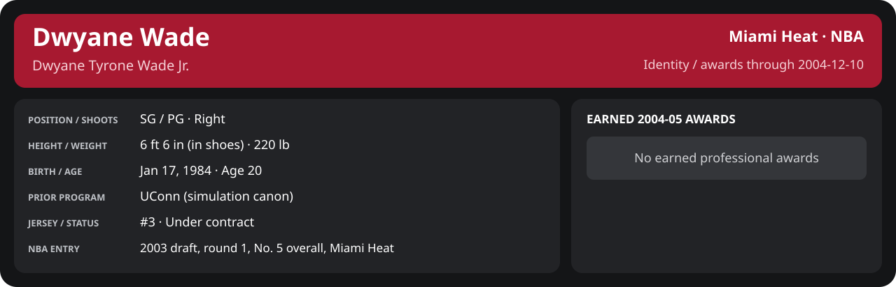

# December Week 2 Game 2

Player identity and statistics are generated here by `python scripts/update_player_reports.py`.
Decisions remain in the owning phase/week note. A scheduled game has no statistical result.

Miami's injured list for this game: Caron Butler, John Thomas, John Edwards (`00_Team/Transactions/injured_list.json`; twelve dress).

<!-- game-result:start -->
## Result

**Memphis Grizzlies 90 at Miami Heat 103** · Miami Heat W 103-90 vs Memphis Grizzlies · home (Miami Heat) · 2004-12-10

Event `2004-12-10-memphis-grizzlies-at-miami-heat` · Railway engine (runtime/private_service.py) · result file [`Game_2.result.json`](Game_2.result.json) (the engine's answer as served; the note is the canonical record).

### Box score

```text
Memphis Grizzlies 90 at Miami Heat 103
2004-12-10  2004-05 regular  event 2004-12-10-memphis-grizzlies-at-miami-heat
Kernel 2003.11, calibrated on 2003-04 (imported_source)

Period      1    2    3    4     T
Memphis    28   17   21   24    90
Miami He   20   30   26   27   103

Memphis Grizzlies
                           MIN  PTS   FG      3P     FT    OR  DR AST STL BLK  TO  PF
Shane Battier             27.9    3   1-4    1-2    0-0     3   1   1   1   0   3   4
Mike Miller               29.8   16   6-8    1-1    3-3     0   5   2   1   0   3   2
Lorenzen Wright           31.4    8   3-12   0-1    2-3     3   3   0   0   0   0   3
James Posey               24.8    9   3-5    1-1    2-2     0   4   1   0   0   3   4
Jason Williams            26.3    9   3-9    3-6    0-0     2   1   2   0   0   3   5
J.R. Smith                24.8    9   3-8    2-6    1-3     1   2   1   2   0   2   1
Earl Watson               22.5    5   1-7    0-1    3-4     1   1   2   0   0   3   0
Bonzi Wells               20.5   11   4-12   1-2    2-2     2   3   1   3   1   1   1
Stromile Swift            19.1    9   2-6    0-1    5-6     0   5   2   0   4   1   5
Dahntay Jones              7.0    9   4-4    1-1    0-0     0   0   0   0   0   0   0
Ryan Humphrey              3.3    0   0-1    0-0    0-0     0   0   0   0   0   0   0
Jake Tsakalidis            2.5    2   1-1    0-0    0-0     0   0   0   0   0   0   0
TEAM                     240.0   90  31-77  10-22  18-23   12  25  12   7   5  20  25
  Includes 1 team turnover(s) not charged to an individual.

Miami Heat
                           MIN  PTS   FG      3P     FT    OR  DR AST STL BLK  TO  PF
Mike James                41.8   12   5-14   0-4    2-2     0   7  10   2   0   1   2
Dwyane Wade               40.8   23   9-15   1-1    4-4     3   6   3   1   2   3   3
Mehmet Okur               22.4   14   5-9    1-1    3-3     4   0   0   0   2   2   5
Brian Grant               40.8    9   4-9    0-0    1-2     2   6   2   2   0   0   4
Udonis Haslem             24.2    4   1-7    0-1    2-2     3   4   0   1   0   0   1
Scott Padgett             19.6    7   3-7    1-4    0-0     0   2   2   1   0   3   2
Rafer Alston              14.4   16   5-8    0-1    6-7     0   3   2   4   0   1   0
Kendall Gill              12.6    5   2-3    0-0    1-1     0   2   2   1   0   1   3
Dorell Wright             10.5    7   2-5    0-2    3-3     2   1   1   1   0   2   0
Eddie Jones                5.7    4   1-2    1-1    1-2     0   0   0   0   0   0   2
Maurice Baker              6.5    2   1-1    0-0    0-0     0   1   0   0   1   1   1
Maurice Evans              0.8    0   0-0    0-0    0-0     0   1   1   0   0   0   0
TEAM                     240.0  103  38-80   4-15  23-26   14  33  23  13   5  17  23
  Includes 3 team turnover(s) not charged to an individual.
```

### Miami injuries

No Miami injury was drawn in this game.
<!-- game-result:end -->

<!-- player-report:start -->
## Professional identity



| Player | Age on report date | Team / league | Position | Number | Status |
| --- | --- | --- | --- | --- | --- |
| Dwyane Tyrone Wade Jr. | 20 | Miami Heat / NBA | SG / PG | 3 | Under contract |

| Identity field | Recorded value |
| --- | --- |
| Birth date | 1984-01-17 |
| NBA entry | 2003 draft, round 1, No. 5 overall, Miami Heat |
| Prior program | UConn (simulation canon) |
| Height, in shoes / without shoes | 6 ft 6 in / 6 ft 4.75 in |
| Weight | 220 lb |
| Wingspan / standing reach | 6 ft 11.5 in / 8 ft 7.5 in |
| Shooting hand | Right |
| Contract | Rookie scale signed 2003-07-21: three seasons plus a 2006-07 team option (2004-05: $2,361,800) |
| Role | Starting SG; staff plan 34 minutes |
| NBA debut | October 28, 2003 at Philadelphia 76ers (2003-04/06_Regular_Season/10_October/Week_4/Game_1.md) |
| Nationality | United States (born in the Chicago area; Robbins, Illinois home community, per the player profile) |
| National team | No selection recorded |
| National-team eligibility | United States (USA Basketball); no selection yet |
| Availability | No current restriction recorded in the established profile |
| Physical measurements recorded | 2003-06-25 |
| Professional status effective | 2004-10-28 |

Identity as of 2004-12-10; status snapshot dated 2004-10-28. User-established alternate-history player; historical Wade's biography and results are not this record.

### Earned 2004-05 awards

No 2004-05 awards yet.

## Statistics

As of **2004-12-10**: 1 closed games; 1/1 have player participation and box coverage; recorded DNPs: 0.

G counts appearances; GS counts recorded starts. DNPs, scheduled games and canceled games do not enter per-game denominators.

### Per game

[](../../../../Stats_and_Awards/player_cards.html?period=regular-2004-05-game-f21ba2ee9ea3577c#shooting) [](../../../../Stats_and_Awards/player_cards.html#contract) [](../../../../Stats_and_Awards/player_cards.html#awards)

[Shooting detail](../../../../Stats_and_Awards/Shooting.md) · [Current contract](../../../../Stats_and_Awards/Contract.md#current-contract) · [Contract history](../../../../Stats_and_Awards/Contract.md#contract-history) · [Annual award record](../../../../Stats_and_Awards/Awards.md)

| Scope | Age | Team | Lg | Pos | G | GS | MP | FG | FGA | FG% | 3P | 3PA | 3P% | 2P | 2PA | 2P% | eFG% | FT | FTA | FT% | ORB | DRB | TRB | AST | STL | BLK | TOV | PF | PTS | TS% (est.) | Awards |
| --- | --- | --- | --- | --- | --- | --- | --- | --- | --- | --- | --- | --- | --- | --- | --- | --- | --- | --- | --- | --- | --- | --- | --- | --- | --- | --- | --- | --- | --- | --- | --- |
| This game | 20 | Miami Heat | NBA | SG / PG | 1 | 1 | 40.8 | 9.0 | 15.0 | .600 | 1.0 | 1.0 | 1.000 | 8.0 | 14.0 | .571 | .633 | 4.0 | 4.0 | 1.000 | 3.0 | 6.0 | 9.0 | 3.0 | 1.0 | 2.0 | 3.0 | 3.0 | 23.0 | .686 | — |

G and GS are counts; MP and counting statistics are **per appearance**. Shooting uses **.500 = 50.0%**. Age is at the row's cutoff. Scroll horizontally for every column.

Awards are confirmed through 2005-01-16, filed by the honor's period-end date; the banner shows career awards known at the page's identity cutoff.

### Production

| Metric | Total | Per appearance | Per 36 minutes |
| --- | --- | --- | --- |
| MIN | 40.8 | 40.8 | 36.0 |
| PTS | 23 | 23.0 | 20.3 |
| OREB | 3 | 3.0 | 2.6 |
| DREB | 6 | 6.0 | 5.3 |
| REB | 9 | 9.0 | 7.9 |
| AST | 3 | 3.0 | 2.6 |
| STL | 1 | 1.0 | 0.9 |
| BLK | 2 | 2.0 | 1.8 |
| TOV | 3 | 3.0 | 2.6 |
| PF | 3 | 3.0 | 2.6 |
| FGM | 9 | 9.0 | 7.9 |
| FGA | 15 | 15.0 | 13.2 |
| 2PM | 8 | 8.0 | 7.1 |
| 2PA | 14 | 14.0 | 12.4 |
| 3PM | 1 | 1.0 | 0.9 |
| 3PA | 1 | 1.0 | 0.9 |
| FTM | 4 | 4.0 | 3.5 |
| FTA | 4 | 4.0 | 3.5 |
| FT points | 4 | 4.0 | 3.5 |

Per-36 rates standardize playing time; they are not a projection of playing 36 minutes. Use the actual minutes denominator in every competition.

### Shooting

| Shot type | Makes | Attempts | Percentage |
| --- | --- | --- | --- |
| All field goals | 9 | 15 | 60.0% |
| Two-pointers | 8 | 14 | 57.1% |
| Three-pointers | 1 | 1 | 100.0% |
| Free throws | 4 | 4 | 100.0% |

### Efficiency and shot selection

| Metric | Value | Calculation / unit |
| --- | --- | --- |
| eFG% | 63.3% | (FGM + 0.5 × 3PM) / FGA |
| TS% (estimated) | 68.6% | PTS / [2 × (FGA + 0.44 × FTA)] |
| Three-point attempt share | 6.7% | 3PA / FGA |
| Free-throw attempt rate | 0.267 | FTA / FGA; ratio |
| Assist / turnover ratio | 1.00 | AST / TOV; N/A at zero turnovers |
| Plus/minus total | N/A | Observed on-court score differential only |
| Double-doubles | 0 | At least 10 in any two of PTS, REB, AST, STL, BLK |
| Triple-doubles | 0 | At least 10 in any three; also included in double-doubles |

Percentages use pooled makes and attempts. TS% uses an estimated free-throw weighting, not exact scoring possessions. Rounding is display-only.

### Splits

[](../../../../Stats_and_Awards/player_cards.html?period=regular-2004-05-game-f21ba2ee9ea3577c#shooting) [](../../../../Stats_and_Awards/player_cards.html#contract) [](../../../../Stats_and_Awards/player_cards.html#awards)

[Shooting detail](../../../../Stats_and_Awards/Shooting.md) · [Current contract](../../../../Stats_and_Awards/Contract.md#current-contract) · [Contract history](../../../../Stats_and_Awards/Contract.md#contract-history) · [Annual award record](../../../../Stats_and_Awards/Awards.md)

| Scope | Age | Team | Lg | Pos | G | GS | MP | FG | FGA | FG% | 3P | 3PA | 3P% | 2P | 2PA | 2P% | eFG% | FT | FTA | FT% | ORB | DRB | TRB | AST | STL | BLK | TOV | PF | PTS | TS% (est.) | Awards |
| --- | --- | --- | --- | --- | --- | --- | --- | --- | --- | --- | --- | --- | --- | --- | --- | --- | --- | --- | --- | --- | --- | --- | --- | --- | --- | --- | --- | --- | --- | --- | --- |
| Home | 20 | Miami Heat | NBA | SG / PG | 1 | 1 | 40.8 | 9.0 | 15.0 | .600 | 1.0 | 1.0 | 1.000 | 8.0 | 14.0 | .571 | .633 | 4.0 | 4.0 | 1.000 | 3.0 | 6.0 | 9.0 | 3.0 | 1.0 | 2.0 | 3.0 | 3.0 | 23.0 | .686 | — |
| Away | 20 | Miami Heat | NBA | SG / PG | 0 | N/A | N/A | N/A | N/A | N/A | N/A | N/A | N/A | N/A | N/A | N/A | N/A | N/A | N/A | N/A | N/A | N/A | N/A | N/A | N/A | N/A | N/A | N/A | N/A | N/A | — |
| Neutral | 20 | Miami Heat | NBA | SG / PG | 0 | N/A | N/A | N/A | N/A | N/A | N/A | N/A | N/A | N/A | N/A | N/A | N/A | N/A | N/A | N/A | N/A | N/A | N/A | N/A | N/A | N/A | N/A | N/A | N/A | N/A | — |
| Wins | 20 | Miami Heat | NBA | SG / PG | 1 | 1 | 40.8 | 9.0 | 15.0 | .600 | 1.0 | 1.0 | 1.000 | 8.0 | 14.0 | .571 | .633 | 4.0 | 4.0 | 1.000 | 3.0 | 6.0 | 9.0 | 3.0 | 1.0 | 2.0 | 3.0 | 3.0 | 23.0 | .686 | — |
| Losses | 20 | Miami Heat | NBA | SG / PG | 0 | N/A | N/A | N/A | N/A | N/A | N/A | N/A | N/A | N/A | N/A | N/A | N/A | N/A | N/A | N/A | N/A | N/A | N/A | N/A | N/A | N/A | N/A | N/A | N/A | N/A | — |
| Team: Miami Heat | 20 | Miami Heat | NBA | SG / PG | 1 | 1 | 40.8 | 9.0 | 15.0 | .600 | 1.0 | 1.0 | 1.000 | 8.0 | 14.0 | .571 | .633 | 4.0 | 4.0 | 1.000 | 3.0 | 6.0 | 9.0 | 3.0 | 1.0 | 2.0 | 3.0 | 3.0 | 23.0 | .686 | — |

G and GS are counts; MP and counting statistics are **per appearance**. Shooting uses **.500 = 50.0%**. Age is at the row's cutoff. Scroll horizontally for every column.

Awards are confirmed through 2005-01-16, filed by the honor's period-end date; the banner shows career awards known at the page's identity cutoff.

Splits overlap and are not additive. Each row has its own appearance denominator; games with unknown result classification are excluded from win/loss splits.

### Game highs

| Metric | High | Date / opponent (all ties) |
| --- | --- | --- |
| PTS | 23 | [2004-12-10 vs Memphis Grizzlies](Game_2.md) |
| REB | 9 | [2004-12-10 vs Memphis Grizzlies](Game_2.md) |
| AST | 3 | [2004-12-10 vs Memphis Grizzlies](Game_2.md) |
| STL | 1 | [2004-12-10 vs Memphis Grizzlies](Game_2.md) |
| BLK | 2 | [2004-12-10 vs Memphis Grizzlies](Game_2.md) |
| TOV | 3 | [2004-12-10 vs Memphis Grizzlies](Game_2.md) |

### Game log

| Date / source | Opponent | Venue | Result | Participation | MIN | PTS | REB | AST | STL | BLK | TOV |
| --- | --- | --- | --- | --- | --- | --- | --- | --- | --- | --- | --- |
| [2004-12-10](Game_2.md) | Memphis Grizzlies | home | W 103-90 | Played | 40.8 | 23 | 9 | 3 | 1 | 2 | 3 |

### Game shooting detail

| Date / source | FG | 2P | 3P | FT | eFG% | TS% (est.) | +/- | PF |
| --- | --- | --- | --- | --- | --- | --- | --- | --- |
| [2004-12-10](Game_2.md) | 9/15 | 8/14 | 1/1 | 4/4 | 63.3% | 68.6% | N/A | 3 |

### Additional data needed

| Statistic family | Current support | Required evidence |
| --- | --- | --- |
| Starts; plus/minus | N/A unless supplied in the player box | Explicit started and plus_minus fields |
| Per 100 possessions; offensive / defensive / net rating | Unavailable in current box feed | Player on-court possessions and both teams' scoring during those possessions |
| USG%; AST%; OREB%, DREB%, REB% | Unavailable in current box feed | Matching player/team/opponent opportunity counts and a declared method |
| Rim, paint, midrange, corner / above-break threes | Unavailable in current box feed | Shot locations, attempts and makes |
| Drives, touches, catch-and-shoot, pull-ups, play types | Unavailable in current box feed | Tracking or tagged play-by-play |
| Clutch, on/off, lineup combinations, assisted baskets | Unavailable in current box feed | Timed events, score state, substitutions and possession attribution |
| Deflections, charges, contested shots, box outs | Unavailable in current box feed | Observed hustle/defensive events |
| League rank, percentile, relative TS%; impact models | Not derived by this report | Same-period simulated league baseline, eligibility rules and documented model |

<!-- player-report:end -->
