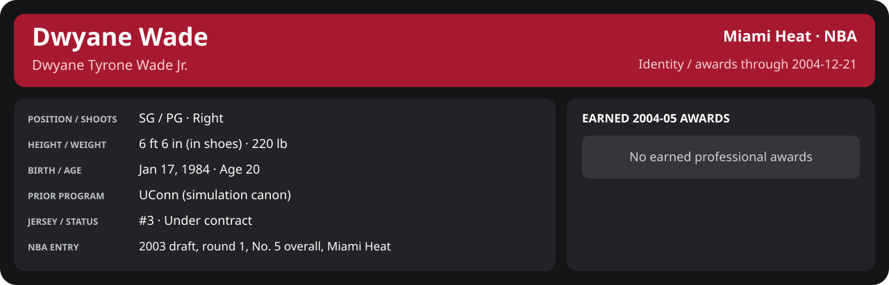

# December Week 3 Game 4

Player identity and statistics are generated here by `python scripts/update_player_reports.py`.
Decisions remain in the owning phase/week note. A scheduled game has no statistical result.

Miami's injured list for this game: Eddie Jones, John Thomas, Lamond Murray (`00_Team/Transactions/injured_list.json`; twelve dress).

<!-- game-result:start -->
## Result

**Boston Celtics 101 at Miami Heat 88** · Miami Heat L 88-101 vs Boston Celtics · home (Miami Heat) · 2004-12-21

Event `2004-12-21-boston-celtics-at-miami-heat` · Railway engine (runtime/private_service.py) · result file [`Game_4.result.json`](Game_4.result.json) (the engine's answer as served; the note is the canonical record).

### Box score

```text
Boston Celtics 101 at Miami Heat 88
2004-12-21  2004-05 regular  event 2004-12-21-boston-celtics-at-miami-heat
Kernel 2003.11, calibrated on 2003-04 (imported_source)

Period      1    2    3    4     T
Boston C   19   25   28   29   101
Miami He   17   23   27   21    88

Boston Celtics
                           MIN  PTS   FG      3P     FT    OR  DR AST STL BLK  TO  PF
Paul Pierce               36.1   30  11-19   3-4    5-8     1   6   8   2   1   0   2
Reggie Miller             31.2   11   4-7    0-1    3-4     0   1   3   1   0   1   5
Luol Deng                 28.8   10   5-12   0-0    0-0     1   3   1   0   2   0   4
Mark Blount               27.4   16   7-12   0-0    2-4     1   5   4   0   1   3   4
Austin Croshere           26.4   14   4-7    2-3    4-4     1   8   2   0   1   0   3
Jumaine Jones             23.7    0   0-5    0-3    0-0     1   3   2   0   0   1   5
Tony Battie               14.4    5   2-2    0-0    1-2     2   5   1   0   0   0   5
Jiří Welsch               19.0    2   0-5    0-0    2-2     0   1   0   0   0   2   4
Marcus Banks              13.8    4   1-2    0-1    2-2     0   3   0   1   0   0   0
Walter McCarty            11.5    7   3-8    1-6    0-0     1   1   0   0   0   0   0
Sasha Pavlović             2.6    0   0-0    0-0    0-0     1   0   0   0   0   0   0
Kendrick Perkins           5.1    2   1-1    0-0    0-1     1   0   0   0   1   0   0
TEAM                     240.0  101  38-80   6-18  19-27   10  36  21   4   6   7  32

Miami Heat
                           MIN  PTS   FG      3P     FT    OR  DR AST STL BLK  TO  PF
Mike James                31.4    9   4-12   0-4    1-2     2   2   0   1   0   0   5
Dwyane Wade               28.3   16   6-13   0-2    4-4     1   4   0   0   0   0   3
Caron Butler              39.7   11   2-12   0-0    7-8     5   4   4   0   2   0   3
Mehmet Okur               41.7   31   9-20   3-6   10-12    5   7   3   1   3   3   4
Brian Grant               11.3    0   0-2    0-0    0-0     2   1   0   0   0   0   2
Rafer Alston              18.6    2   0-6    0-2    2-2     1   2   5   0   0   1   4
Kendall Gill              15.5    0   0-4    0-0    0-0     1   1   2   1   0   0   1
Dorell Wright             13.3    6   2-4    0-0    2-4     2   3   1   0   0   1   2
Maurice Baker             11.8    7   3-9    0-1    1-3     0   1   1   0   0   2   1
Maurice Evans             12.1    4   1-2    0-0    2-2     2   3   1   1   0   0   1
John Edwards              12.0    2   1-5    0-1    0-0     0   1   0   0   0   0   0
Donyell Marshall           4.1    0   0-0    0-0    0-0     0   0   0   0   0   0   2
TEAM                     240.0   88  28-89   3-16  29-37   21  29  17   4   5   7  28
```

### Miami injuries

| Player | Injury | Games out |
| --- | --- | ---: |
| Brian Grant | day-to-day | 1 |
| Dwyane Wade | long | 36 |
<!-- game-result:end -->

<!-- player-report:start -->
## Professional identity



| Player | Age on report date | Team / league | Position | Number | Status |
| --- | --- | --- | --- | --- | --- |
| Dwyane Tyrone Wade Jr. | 20 | Miami Heat / NBA | SG / PG | 3 | Under contract |

| Identity field | Recorded value |
| --- | --- |
| Birth date | 1984-01-17 |
| NBA entry | 2003 draft, round 1, No. 5 overall, Miami Heat |
| Prior program | UConn (simulation canon) |
| Height, in shoes / without shoes | 6 ft 6 in / 6 ft 4.75 in |
| Weight | 220 lb |
| Wingspan / standing reach | 6 ft 11.5 in / 8 ft 7.5 in |
| Shooting hand | Right |
| Contract | Rookie scale signed 2003-07-21: three seasons plus a 2006-07 team option (2004-05: $2,361,800) |
| Role | Starting SG; staff plan 34 minutes |
| NBA debut | October 28, 2003 at Philadelphia 76ers (2003-04/06_Regular_Season/10_October/Week_4/Game_1.md) |
| Nationality | United States (born in the Chicago area; Robbins, Illinois home community, per the player profile) |
| National team | No selection recorded |
| National-team eligibility | United States (USA Basketball); no selection yet |
| Availability | No current restriction recorded in the established profile |
| Physical measurements recorded | 2003-06-25 |
| Professional status effective | 2004-10-28 |

Identity as of 2004-12-21; status snapshot dated 2004-10-28. User-established alternate-history player; historical Wade's biography and results are not this record.

### Earned 2004-05 awards

No 2004-05 awards yet.

## Statistics

As of **2004-12-21**: 1 closed games; 1/1 have player participation and box coverage; recorded DNPs: 0.

G counts appearances; GS counts recorded starts. DNPs, scheduled games and canceled games do not enter per-game denominators.

### Per game

[](../../../../Stats_and_Awards/player_cards.html?period=regular-2004-05-game-7c236ba8bfbc538c#shooting) [](../../../../Stats_and_Awards/player_cards.html#contract) [](../../../../Stats_and_Awards/player_cards.html#awards)

[Shooting detail](../../../../Stats_and_Awards/Shooting.md) · [Current contract](../../../../Stats_and_Awards/Contract.md#current-contract) · [Contract history](../../../../Stats_and_Awards/Contract.md#contract-history) · [Annual award record](../../../../Stats_and_Awards/Awards.md)

| Scope | Age | Team | Lg | Pos | G | GS | MP | FG | FGA | FG% | 3P | 3PA | 3P% | 2P | 2PA | 2P% | eFG% | FT | FTA | FT% | ORB | DRB | TRB | AST | STL | BLK | TOV | PF | PTS | TS% (est.) | Awards |
| --- | --- | --- | --- | --- | --- | --- | --- | --- | --- | --- | --- | --- | --- | --- | --- | --- | --- | --- | --- | --- | --- | --- | --- | --- | --- | --- | --- | --- | --- | --- | --- |
| This game | 20 | Miami Heat | NBA | SG / PG | 1 | 1 | 28.3 | 6.0 | 13.0 | .462 | 0.0 | 2.0 | .000 | 6.0 | 11.0 | .545 | .462 | 4.0 | 4.0 | 1.000 | 1.0 | 4.0 | 5.0 | 0.0 | 0.0 | 0.0 | 0.0 | 3.0 | 16.0 | .542 | — |

G and GS are counts; MP and counting statistics are **per appearance**. Shooting uses **.500 = 50.0%**. Age is at the row's cutoff. Scroll horizontally for every column.

Awards are confirmed through 2005-01-17, filed by the honor's period-end date; the banner shows career awards known at the page's identity cutoff.

### Production

| Metric | Total | Per appearance | Per 36 minutes |
| --- | --- | --- | --- |
| MIN | 28.3 | 28.3 | 36.0 |
| PTS | 16 | 16.0 | 20.3 |
| OREB | 1 | 1.0 | 1.3 |
| DREB | 4 | 4.0 | 5.1 |
| REB | 5 | 5.0 | 6.4 |
| AST | 0 | 0.0 | 0.0 |
| STL | 0 | 0.0 | 0.0 |
| BLK | 0 | 0.0 | 0.0 |
| TOV | 0 | 0.0 | 0.0 |
| PF | 3 | 3.0 | 3.8 |
| FGM | 6 | 6.0 | 7.6 |
| FGA | 13 | 13.0 | 16.5 |
| 2PM | 6 | 6.0 | 7.6 |
| 2PA | 11 | 11.0 | 14.0 |
| 3PM | 0 | 0.0 | 0.0 |
| 3PA | 2 | 2.0 | 2.5 |
| FTM | 4 | 4.0 | 5.1 |
| FTA | 4 | 4.0 | 5.1 |
| FT points | 4 | 4.0 | 5.1 |

Per-36 rates standardize playing time; they are not a projection of playing 36 minutes. Use the actual minutes denominator in every competition.

### Shooting

| Shot type | Makes | Attempts | Percentage |
| --- | --- | --- | --- |
| All field goals | 6 | 13 | 46.2% |
| Two-pointers | 6 | 11 | 54.5% |
| Three-pointers | 0 | 2 | 0.0% |
| Free throws | 4 | 4 | 100.0% |

### Efficiency and shot selection

| Metric | Value | Calculation / unit |
| --- | --- | --- |
| eFG% | 46.2% | (FGM + 0.5 × 3PM) / FGA |
| TS% (estimated) | 54.2% | PTS / [2 × (FGA + 0.44 × FTA)] |
| Three-point attempt share | 15.4% | 3PA / FGA |
| Free-throw attempt rate | 0.308 | FTA / FGA; ratio |
| Assist / turnover ratio | N/A | AST / TOV; N/A at zero turnovers |
| Plus/minus total | N/A | Observed on-court score differential only |
| Double-doubles | 0 | At least 10 in any two of PTS, REB, AST, STL, BLK |
| Triple-doubles | 0 | At least 10 in any three; also included in double-doubles |

Percentages use pooled makes and attempts. TS% uses an estimated free-throw weighting, not exact scoring possessions. Rounding is display-only.

### Splits

[](../../../../Stats_and_Awards/player_cards.html?period=regular-2004-05-game-7c236ba8bfbc538c#shooting) [](../../../../Stats_and_Awards/player_cards.html#contract) [](../../../../Stats_and_Awards/player_cards.html#awards)

[Shooting detail](../../../../Stats_and_Awards/Shooting.md) · [Current contract](../../../../Stats_and_Awards/Contract.md#current-contract) · [Contract history](../../../../Stats_and_Awards/Contract.md#contract-history) · [Annual award record](../../../../Stats_and_Awards/Awards.md)

| Scope | Age | Team | Lg | Pos | G | GS | MP | FG | FGA | FG% | 3P | 3PA | 3P% | 2P | 2PA | 2P% | eFG% | FT | FTA | FT% | ORB | DRB | TRB | AST | STL | BLK | TOV | PF | PTS | TS% (est.) | Awards |
| --- | --- | --- | --- | --- | --- | --- | --- | --- | --- | --- | --- | --- | --- | --- | --- | --- | --- | --- | --- | --- | --- | --- | --- | --- | --- | --- | --- | --- | --- | --- | --- |
| Home | 20 | Miami Heat | NBA | SG / PG | 1 | 1 | 28.3 | 6.0 | 13.0 | .462 | 0.0 | 2.0 | .000 | 6.0 | 11.0 | .545 | .462 | 4.0 | 4.0 | 1.000 | 1.0 | 4.0 | 5.0 | 0.0 | 0.0 | 0.0 | 0.0 | 3.0 | 16.0 | .542 | — |
| Away | 20 | Miami Heat | NBA | SG / PG | 0 | N/A | N/A | N/A | N/A | N/A | N/A | N/A | N/A | N/A | N/A | N/A | N/A | N/A | N/A | N/A | N/A | N/A | N/A | N/A | N/A | N/A | N/A | N/A | N/A | N/A | — |
| Neutral | 20 | Miami Heat | NBA | SG / PG | 0 | N/A | N/A | N/A | N/A | N/A | N/A | N/A | N/A | N/A | N/A | N/A | N/A | N/A | N/A | N/A | N/A | N/A | N/A | N/A | N/A | N/A | N/A | N/A | N/A | N/A | — |
| Wins | 20 | Miami Heat | NBA | SG / PG | 0 | N/A | N/A | N/A | N/A | N/A | N/A | N/A | N/A | N/A | N/A | N/A | N/A | N/A | N/A | N/A | N/A | N/A | N/A | N/A | N/A | N/A | N/A | N/A | N/A | N/A | — |
| Losses | 20 | Miami Heat | NBA | SG / PG | 1 | 1 | 28.3 | 6.0 | 13.0 | .462 | 0.0 | 2.0 | .000 | 6.0 | 11.0 | .545 | .462 | 4.0 | 4.0 | 1.000 | 1.0 | 4.0 | 5.0 | 0.0 | 0.0 | 0.0 | 0.0 | 3.0 | 16.0 | .542 | — |
| Team: Miami Heat | 20 | Miami Heat | NBA | SG / PG | 1 | 1 | 28.3 | 6.0 | 13.0 | .462 | 0.0 | 2.0 | .000 | 6.0 | 11.0 | .545 | .462 | 4.0 | 4.0 | 1.000 | 1.0 | 4.0 | 5.0 | 0.0 | 0.0 | 0.0 | 0.0 | 3.0 | 16.0 | .542 | — |

G and GS are counts; MP and counting statistics are **per appearance**. Shooting uses **.500 = 50.0%**. Age is at the row's cutoff. Scroll horizontally for every column.

Awards are confirmed through 2005-01-17, filed by the honor's period-end date; the banner shows career awards known at the page's identity cutoff.

Splits overlap and are not additive. Each row has its own appearance denominator; games with unknown result classification are excluded from win/loss splits.

### Game highs

| Metric | High | Date / opponent (all ties) |
| --- | --- | --- |
| PTS | 16 | [2004-12-21 vs Boston Celtics](Game_4.md) |
| REB | 5 | [2004-12-21 vs Boston Celtics](Game_4.md) |
| AST | 0 | [2004-12-21 vs Boston Celtics](Game_4.md) |
| STL | 0 | [2004-12-21 vs Boston Celtics](Game_4.md) |
| BLK | 0 | [2004-12-21 vs Boston Celtics](Game_4.md) |
| TOV | 0 | [2004-12-21 vs Boston Celtics](Game_4.md) |

### Game log

| Date / source | Opponent | Venue | Result | Participation | MIN | PTS | REB | AST | STL | BLK | TOV |
| --- | --- | --- | --- | --- | --- | --- | --- | --- | --- | --- | --- |
| [2004-12-21](Game_4.md) | Boston Celtics | home | L 88-101 | Played | 28.3 | 16 | 5 | 0 | 0 | 0 | 0 |

### Game shooting detail

| Date / source | FG | 2P | 3P | FT | eFG% | TS% (est.) | +/- | PF |
| --- | --- | --- | --- | --- | --- | --- | --- | --- |
| [2004-12-21](Game_4.md) | 6/13 | 6/11 | 0/2 | 4/4 | 46.2% | 54.2% | N/A | 3 |

### Additional data needed

| Statistic family | Current support | Required evidence |
| --- | --- | --- |
| Starts; plus/minus | N/A unless supplied in the player box | Explicit started and plus_minus fields |
| Per 100 possessions; offensive / defensive / net rating | Unavailable in current box feed | Player on-court possessions and both teams' scoring during those possessions |
| USG%; AST%; OREB%, DREB%, REB% | Unavailable in current box feed | Matching player/team/opponent opportunity counts and a declared method |
| Rim, paint, midrange, corner / above-break threes | Unavailable in current box feed | Shot locations, attempts and makes |
| Drives, touches, catch-and-shoot, pull-ups, play types | Unavailable in current box feed | Tracking or tagged play-by-play |
| Clutch, on/off, lineup combinations, assisted baskets | Unavailable in current box feed | Timed events, score state, substitutions and possession attribution |
| Deflections, charges, contested shots, box outs | Unavailable in current box feed | Observed hustle/defensive events |
| League rank, percentile, relative TS%; impact models | Not derived by this report | Same-period simulated league baseline, eligibility rules and documented model |

<!-- player-report:end -->
