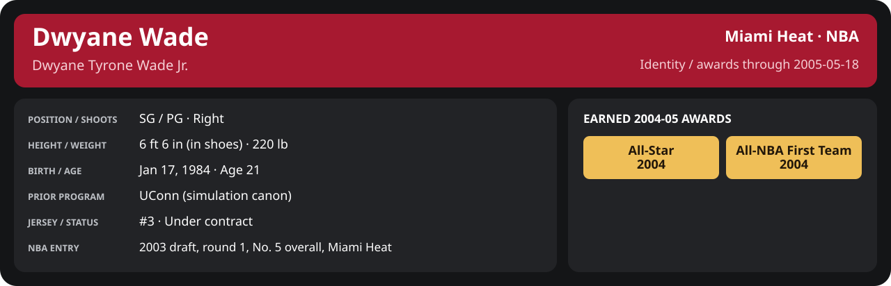

<!-- Generated by scripts/update_player_reports.py; edit source records, then rebuild. -->

# 2004-05 | Conference Semifinals detail

[Series summary](README.md) · [Career](../../../README.md) · [Professional identity](../../../Professional_Identity.md) · [Earned awards](../../../Awards.md) · [Stat definitions](../../../../../docs/player_statistics.md)

## Professional identity

| Player | Age on report date | Team / league | Position | Number | Status |
| --- | --- | --- | --- | --- | --- |
| Dwyane Tyrone Wade Jr. | 21 | Miami Heat / NBA | SG / PG | 3 | Under contract |

| Identity field | Recorded value |
| --- | --- |
| Birth date | 1984-01-17 |
| NBA entry | 2003 draft, round 1, No. 5 overall, Miami Heat |
| Prior program | UConn (simulation canon) |
| Height, in shoes / without shoes | 6 ft 6 in / 6 ft 4.75 in |
| Weight | 220 lb |
| Wingspan / standing reach | 6 ft 11.5 in / 8 ft 7.5 in |
| Shooting hand | Right |
| Contract | Rookie scale signed 2003-07-21: three seasons plus a 2006-07 team option (2004-05: $2,361,800) |
| Role | Starting SG; staff plan 34 minutes |
| NBA debut | October 28, 2003 at Philadelphia 76ers (2003-04/06_Regular_Season/10_October/Week_4/Game_1.md) |
| Nationality | United States (born in the Chicago area; Robbins, Illinois home community, per the player profile) |
| National team | No selection recorded |
| National-team eligibility | United States (USA Basketball); no selection yet |
| Availability | No current restriction recorded in the established profile |
| Physical measurements recorded | 2003-06-25 |
| Professional status effective | 2004-10-28 |

Identity as of 2005-05-18; status snapshot dated 2004-10-28. User-established alternate-history player; historical Wade's biography and results are not this record.

### Earned 2004-05 awards

| Award | Period | Announced | Decision record |
| --- | --- | --- | --- |
| Eastern Conference Player of the Month | 2004-12-01 to 2004-12-31 | 2005-01-02 | [East POM](../../../Stats_and_Awards/League/2004-05/12_December/League_Awards.md#player-of-the-month) |
| Eastern Conference Player of the Week | 2005-01-24 to 2005-01-30 | 2005-01-31 | [East POW](../../../Stats_and_Awards/League/2004-05/01_January/Week_4/League_Awards.md#player-of-the-week) |
| All-Star | 2004-11-02 to 2005-02-08 | 2005-02-08 | [All-Star](../../../Stats_and_Awards/League/2004-05/All_Star.md#all-stars) |
| Eastern Conference Player of the Month | 2005-03-01 to 2005-03-31 | 2005-04-02 | [East POM](../../../Stats_and_Awards/League/2004-05/03_March/League_Awards.md#player-of-the-month) |
| Eastern Conference Player of the Month | 2005-04-01 to 2005-04-20 | 2005-04-22 | [East POM](../../../Stats_and_Awards/League/2004-05/04_April/League_Awards.md#player-of-the-month) |
| All-NBA First Team | 2004-11-02 to 2005-04-20 | 2005-05-18 | [All-NBA 1st](../../../Stats_and_Awards/League/2004-05/Season_Awards.md#all-nba-teams) |

## Statistics

As of **2005-05-18**: 5 closed games; 5/5 have player participation and box coverage; recorded DNPs: 0.

G counts appearances; GS counts recorded starts. DNPs, scheduled games and canceled games do not enter per-game denominators.

### Per game

  

[Shooting detail](../../../Stats_and_Awards/Shooting.md) · [Current contract](../../../Stats_and_Awards/Contract.md#current-contract) · [Contract history](../../../Stats_and_Awards/Contract.md#contract-history) · [Annual award record](../../../Stats_and_Awards/Awards.md)

| Scope | Age | Team | Lg | Pos | G | GS | MP | FG | FGA | FG% | 3P | 3PA | 3P% | 2P | 2PA | 2P% | eFG% | FT | FTA | FT% | ORB | DRB | TRB | AST | STL | BLK | TOV | PF | PTS | TS% (est.) | Awards |
| --- | --- | --- | --- | --- | --- | --- | --- | --- | --- | --- | --- | --- | --- | --- | --- | --- | --- | --- | --- | --- | --- | --- | --- | --- | --- | --- | --- | --- | --- | --- | --- |
| This scope | 21 | Miami Heat | NBA | SG / PG | 5 | 5 | 37.6 | 7.4 | 17.0 | .435 | 1.8 | 4.4 | .409 | 5.6 | 12.6 | .444 | .488 | 5.6 | 6.0 | .933 | 1.4 | 4.0 | 5.4 | 6.4 | 2.0 | 0.8 | 1.2 | 2.8 | 22.2 | .565 | — |

G and GS are counts; MP and counting statistics are **per appearance**. Shooting uses **.500 = 50.0%**. Age is at the row's cutoff. Scroll horizontally for every column.

Awards are confirmed through 2005-05-18, filed by the honor's period-end date; the banner shows career awards known at the page's identity cutoff.

### Production

| Metric | Total | Per appearance | Per 36 minutes |
| --- | --- | --- | --- |
| MIN | 188.1 | 37.6 | 36.0 |
| PTS | 111 | 22.2 | 21.2 |
| OREB | 7 | 1.4 | 1.3 |
| DREB | 20 | 4.0 | 3.8 |
| REB | 27 | 5.4 | 5.2 |
| AST | 32 | 6.4 | 6.1 |
| STL | 10 | 2.0 | 1.9 |
| BLK | 4 | 0.8 | 0.8 |
| TOV | 6 | 1.2 | 1.1 |
| PF | 14 | 2.8 | 2.7 |
| FGM | 37 | 7.4 | 7.1 |
| FGA | 85 | 17.0 | 16.3 |
| 2PM | 28 | 5.6 | 5.4 |
| 2PA | 63 | 12.6 | 12.1 |
| 3PM | 9 | 1.8 | 1.7 |
| 3PA | 22 | 4.4 | 4.2 |
| FTM | 28 | 5.6 | 5.4 |
| FTA | 30 | 6.0 | 5.7 |
| FT points | 28 | 5.6 | 5.4 |

Per-36 rates standardize playing time; they are not a projection of playing 36 minutes. Use the actual minutes denominator in every competition.

### Shooting

| Shot type | Makes | Attempts | Percentage |
| --- | --- | --- | --- |
| All field goals | 37 | 85 | 43.5% |
| Two-pointers | 28 | 63 | 44.4% |
| Three-pointers | 9 | 22 | 40.9% |
| Free throws | 28 | 30 | 93.3% |

### Efficiency and shot selection

| Metric | Value | Calculation / unit |
| --- | --- | --- |
| eFG% | 48.8% | (FGM + 0.5 × 3PM) / FGA |
| TS% (estimated) | 56.5% | PTS / [2 × (FGA + 0.44 × FTA)] |
| Three-point attempt share | 25.9% | 3PA / FGA |
| Free-throw attempt rate | 0.353 | FTA / FGA; ratio |
| Assist / turnover ratio | 5.33 | AST / TOV; N/A at zero turnovers |
| Plus/minus total | N/A | Observed on-court score differential only |
| Double-doubles | 2 | At least 10 in any two of PTS, REB, AST, STL, BLK |
| Triple-doubles | 0 | At least 10 in any three; also included in double-doubles |

Percentages use pooled makes and attempts. TS% uses an estimated free-throw weighting, not exact scoring possessions. Rounding is display-only.

### Splits

  

[Shooting detail](../../../Stats_and_Awards/Shooting.md) · [Current contract](../../../Stats_and_Awards/Contract.md#current-contract) · [Contract history](../../../Stats_and_Awards/Contract.md#contract-history) · [Annual award record](../../../Stats_and_Awards/Awards.md)

| Scope | Age | Team | Lg | Pos | G | GS | MP | FG | FGA | FG% | 3P | 3PA | 3P% | 2P | 2PA | 2P% | eFG% | FT | FTA | FT% | ORB | DRB | TRB | AST | STL | BLK | TOV | PF | PTS | TS% (est.) | Awards |
| --- | --- | --- | --- | --- | --- | --- | --- | --- | --- | --- | --- | --- | --- | --- | --- | --- | --- | --- | --- | --- | --- | --- | --- | --- | --- | --- | --- | --- | --- | --- | --- |
| Home | 21 | Miami Heat | NBA | SG / PG | 3 | 3 | 35.4 | 7.3 | 16.7 | .440 | 2.7 | 5.3 | .500 | 4.7 | 11.3 | .412 | .520 | 5.0 | 5.7 | .882 | 1.3 | 3.7 | 5.0 | 3.7 | 2.7 | 1.0 | 1.0 | 3.7 | 22.3 | .583 | — |
| Away | 21 | Miami Heat | NBA | SG / PG | 2 | 2 | 40.9 | 7.5 | 17.5 | .429 | 0.5 | 3.0 | .167 | 7.0 | 14.5 | .483 | .443 | 6.5 | 6.5 | 1.000 | 1.5 | 4.5 | 6.0 | 10.5 | 1.0 | 0.5 | 1.5 | 1.5 | 22.0 | .540 | — |
| Neutral | 21 | Miami Heat | NBA | SG / PG | 0 | N/A | N/A | N/A | N/A | N/A | N/A | N/A | N/A | N/A | N/A | N/A | N/A | N/A | N/A | N/A | N/A | N/A | N/A | N/A | N/A | N/A | N/A | N/A | N/A | N/A | — |
| Wins | 21 | Miami Heat | NBA | SG / PG | 2 | 2 | 38.6 | 12.0 | 21.0 | .571 | 3.5 | 5.0 | .700 | 8.5 | 16.0 | .531 | .655 | 5.0 | 5.0 | 1.000 | 2.0 | 3.5 | 5.5 | 6.5 | 3.0 | 1.5 | 1.5 | 1.5 | 32.5 | .700 | — |
| Losses | 21 | Miami Heat | NBA | SG / PG | 3 | 3 | 36.9 | 4.3 | 14.3 | .302 | 0.7 | 4.0 | .167 | 3.7 | 10.3 | .355 | .326 | 6.0 | 6.7 | .900 | 1.0 | 4.3 | 5.3 | 6.3 | 1.3 | 0.3 | 1.0 | 3.7 | 15.3 | .444 | — |
| Team: Miami Heat | 21 | Miami Heat | NBA | SG / PG | 5 | 5 | 37.6 | 7.4 | 17.0 | .435 | 1.8 | 4.4 | .409 | 5.6 | 12.6 | .444 | .488 | 5.6 | 6.0 | .933 | 1.4 | 4.0 | 5.4 | 6.4 | 2.0 | 0.8 | 1.2 | 2.8 | 22.2 | .565 | — |

G and GS are counts; MP and counting statistics are **per appearance**. Shooting uses **.500 = 50.0%**. Age is at the row's cutoff. Scroll horizontally for every column.

Awards are confirmed through 2005-05-18, filed by the honor's period-end date; the banner shows career awards known at the page's identity cutoff.

Splits overlap and are not additive. Each row has its own appearance denominator; games with unknown result classification are excluded from win/loss splits.

### Game highs

| Metric | High | Date / opponent (all ties) |
| --- | --- | --- |
| PTS | 39 | [2005-05-09 vs Atlanta Hawks](Game_1.md) |
| REB | 7 | [2005-05-15 at Atlanta Hawks](Game_4.md) |
| AST | 11 | [2005-05-13 at Atlanta Hawks](Game_3.md) |
| STL | 5 | [2005-05-09 vs Atlanta Hawks](Game_1.md) |
| BLK | 2 | [2005-05-09 vs Atlanta Hawks](Game_1.md) |
| TOV | 2 | [2005-05-13 at Atlanta Hawks](Game_3.md) |

### Game log

| Date / source | Opponent | Venue | Result | Participation | MIN | PTS | REB | AST | STL | BLK | TOV |
| --- | --- | --- | --- | --- | --- | --- | --- | --- | --- | --- | --- |
| [2005-05-09](Game_1.md) | Atlanta Hawks | home | W 110-75 | Played | 36.4 | 39 | 6 | 2 | 5 | 2 | 1 |
| [2005-05-11](Game_2.md) | Atlanta Hawks | home | L 88-100 | Played | 30.9 | 18 | 3 | 2 | 1 | 1 | 1 |
| [2005-05-13](Game_3.md) | Atlanta Hawks | away | W 111-101 | Played | 40.9 | 26 | 5 | 11 | 1 | 1 | 2 |
| [2005-05-15](Game_4.md) | Atlanta Hawks | away | L 91-100 | Played | 40.8 | 18 | 7 | 10 | 1 | 0 | 1 |
| [2005-05-17](Game_5.md) | Atlanta Hawks | home | L 98-109 | Played | 39.1 | 10 | 6 | 7 | 2 | 0 | 1 |

### Individual game boxes

| Scope | Age | Team | Lg | Pos | G | GS | MP | FG | FGA | FG% | 3P | 3PA | 3P% | 2P | 2PA | 2P% | eFG% | FT | FTA | FT% | ORB | DRB | TRB | AST | STL | BLK | TOV | PF | PTS | TS% (est.) | Awards |
| --- | --- | --- | --- | --- | --- | --- | --- | --- | --- | --- | --- | --- | --- | --- | --- | --- | --- | --- | --- | --- | --- | --- | --- | --- | --- | --- | --- | --- | --- | --- | --- |
| [2005-05-09](Game_1.md) | 21 | Miami Heat | NBA | SG / PG | 1 | 1 | 36.4 | 14.0 | 22.0 | .636 | 6.0 | 7.0 | .857 | 8.0 | 15.0 | .533 | .773 | 5.0 | 5.0 | 1.000 | 3.0 | 3.0 | 6.0 | 2.0 | 5.0 | 2.0 | 1.0 | 2.0 | 39.0 | .806 | — |
| [2005-05-11](Game_2.md) | 21 | Miami Heat | NBA | SG / PG | 1 | 1 | 30.9 | 5.0 | 14.0 | .357 | 1.0 | 3.0 | .333 | 4.0 | 11.0 | .364 | .393 | 7.0 | 8.0 | .875 | 1.0 | 2.0 | 3.0 | 2.0 | 1.0 | 1.0 | 1.0 | 5.0 | 18.0 | .514 | — |
| [2005-05-13](Game_3.md) | 21 | Miami Heat | NBA | SG / PG | 1 | 1 | 40.9 | 10.0 | 20.0 | .500 | 1.0 | 3.0 | .333 | 9.0 | 17.0 | .529 | .525 | 5.0 | 5.0 | 1.000 | 1.0 | 4.0 | 5.0 | 11.0 | 1.0 | 1.0 | 2.0 | 1.0 | 26.0 | .586 | — |
| [2005-05-15](Game_4.md) | 21 | Miami Heat | NBA | SG / PG | 1 | 1 | 40.8 | 5.0 | 15.0 | .333 | 0.0 | 3.0 | .000 | 5.0 | 12.0 | .417 | .333 | 8.0 | 8.0 | 1.000 | 2.0 | 5.0 | 7.0 | 10.0 | 1.0 | 0.0 | 1.0 | 2.0 | 18.0 | .486 | — |
| [2005-05-17](Game_5.md) | 21 | Miami Heat | NBA | SG / PG | 1 | 1 | 39.1 | 3.0 | 14.0 | .214 | 1.0 | 6.0 | .167 | 2.0 | 8.0 | .250 | .250 | 3.0 | 4.0 | .750 | 0.0 | 6.0 | 6.0 | 7.0 | 2.0 | 0.0 | 1.0 | 4.0 | 10.0 | .317 | — |

G and GS are counts; MP and counting statistics are **per appearance**. Shooting uses **.500 = 50.0%**. Age is at the row's cutoff. Scroll horizontally for every column.

Awards are confirmed through 2005-05-18, filed by the honor's period-end date; the banner shows career awards known at the page's identity cutoff.

### Game shooting detail

| Date / source | FG | 2P | 3P | FT | eFG% | TS% (est.) | +/- | PF |
| --- | --- | --- | --- | --- | --- | --- | --- | --- |
| [2005-05-09](Game_1.md) | 14/22 | 8/15 | 6/7 | 5/5 | 77.3% | 80.6% | N/A | 2 |
| [2005-05-11](Game_2.md) | 5/14 | 4/11 | 1/3 | 7/8 | 39.3% | 51.4% | N/A | 5 |
| [2005-05-13](Game_3.md) | 10/20 | 9/17 | 1/3 | 5/5 | 52.5% | 58.6% | N/A | 1 |
| [2005-05-15](Game_4.md) | 5/15 | 5/12 | 0/3 | 8/8 | 33.3% | 48.6% | N/A | 2 |
| [2005-05-17](Game_5.md) | 3/14 | 2/8 | 1/6 | 3/4 | 25.0% | 31.7% | N/A | 4 |

### Additional data needed

| Statistic family | Current support | Required evidence |
| --- | --- | --- |
| Starts; plus/minus | N/A unless supplied in the player box | Explicit started and plus_minus fields |
| Per 100 possessions; offensive / defensive / net rating | Unavailable in current box feed | Player on-court possessions and both teams' scoring during those possessions |
| USG%; AST%; OREB%, DREB%, REB% | Unavailable in current box feed | Matching player/team/opponent opportunity counts and a declared method |
| Rim, paint, midrange, corner / above-break threes | Unavailable in current box feed | Shot locations, attempts and makes |
| Drives, touches, catch-and-shoot, pull-ups, play types | Unavailable in current box feed | Tracking or tagged play-by-play |
| Clutch, on/off, lineup combinations, assisted baskets | Unavailable in current box feed | Timed events, score state, substitutions and possession attribution |
| Deflections, charges, contested shots, box outs | Unavailable in current box feed | Observed hustle/defensive events |
| League rank, percentile, relative TS%; impact models | Not derived by this report | Same-period simulated league baseline, eligibility rules and documented model |
