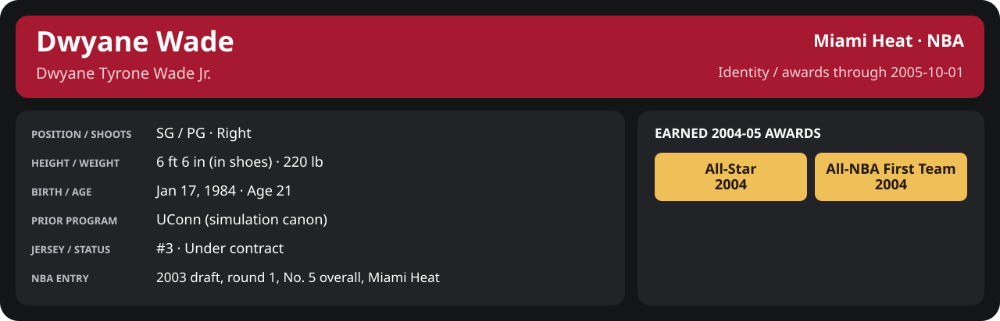

<!-- Generated by scripts/update_player_reports.py; edit source records, then rebuild. -->

# 2004-05 | First Round detail

[Series summary](README.md) · [Career](../../../README.md) · [Professional identity](../../../Professional_Identity.md) · [Earned awards](../../../Awards.md) · [Stat definitions](../../../../../docs/player_statistics.md)

## Professional identity

| Player | Age on report date | Team / league | Position | Number | Status |
| --- | --- | --- | --- | --- | --- |
| Dwyane Tyrone Wade Jr. | 21 | Miami Heat / NBA | SG / PG | 3 | Under contract |

| Identity field | Recorded value |
| --- | --- |
| Birth date | 1984-01-17 |
| NBA entry | 2003 draft, round 1, No. 5 overall, Miami Heat |
| Prior program | UConn (simulation canon) |
| Height, in shoes / without shoes | 6 ft 6 in / 6 ft 4.75 in |
| Weight | 220 lb |
| Wingspan / standing reach | 6 ft 11.5 in / 8 ft 7.5 in |
| Shooting hand | Right |
| Contract | Rookie scale signed 2003-07-21: three seasons plus a 2006-07 team option (2004-05: $2,361,800) |
| Role | Starting SG; staff plan 34 minutes |
| NBA debut | October 28, 2003 at Philadelphia 76ers (2003-04/06_Regular_Season/10_October/Week_4/Game_1.md) |
| Nationality | United States (born in the Chicago area; Robbins, Illinois home community, per the player profile) |
| National team | No selection recorded |
| National-team eligibility | United States (USA Basketball); no selection yet |
| Availability | No current restriction recorded in the established profile |
| Physical measurements recorded | 2003-06-25 |
| Professional status effective | 2004-10-28 |

Identity as of 2005-10-01; status snapshot dated 2004-10-28. User-established alternate-history player; historical Wade's biography and results are not this record.

### Earned 2004-05 awards

| Award | Period | Announced | Decision record |
| --- | --- | --- | --- |
| Eastern Conference Player of the Month | 2004-12-01 to 2004-12-31 | 2005-01-02 | [East POM](../../../Stats_and_Awards/League/2004-05/12_December/League_Awards.md#player-of-the-month) |
| Eastern Conference Player of the Week | 2005-01-24 to 2005-01-30 | 2005-01-31 | [East POW](../../../Stats_and_Awards/League/2004-05/01_January/Week_4/League_Awards.md#player-of-the-week) |
| All-Star | 2004-11-02 to 2005-02-08 | 2005-02-08 | [All-Star](../../../Stats_and_Awards/League/2004-05/All_Star.md#all-stars) |
| Eastern Conference Player of the Month | 2005-03-01 to 2005-03-31 | 2005-04-02 | [East POM](../../../Stats_and_Awards/League/2004-05/03_March/League_Awards.md#player-of-the-month) |
| Eastern Conference Player of the Month | 2005-04-01 to 2005-04-20 | 2005-04-22 | [East POM](../../../Stats_and_Awards/League/2004-05/04_April/League_Awards.md#player-of-the-month) |
| All-NBA First Team | 2004-11-02 to 2005-04-20 | 2005-05-18 | [All-NBA 1st](../../../Stats_and_Awards/League/2004-05/Season_Awards.md#all-nba-teams) |

## Statistics

As of **2005-10-01**: 6 closed games; 6/6 have player participation and box coverage; recorded DNPs: 0.

G counts appearances; GS counts recorded starts. DNPs, scheduled games and canceled games do not enter per-game denominators.

### Per game

  

[Shooting detail](../../../Stats_and_Awards/Shooting.md) · [Current contract](../../../Stats_and_Awards/Contract.md#current-contract) · [Contract history](../../../Stats_and_Awards/Contract.md#contract-history) · [Annual award record](../../../Stats_and_Awards/Awards.md)

| Scope | Age | Team | Lg | Pos | G | GS | MP | FG | FGA | FG% | 3P | 3PA | 3P% | 2P | 2PA | 2P% | eFG% | FT | FTA | FT% | ORB | DRB | TRB | AST | STL | BLK | TOV | PF | PTS | TS% (est.) | Awards |
| --- | --- | --- | --- | --- | --- | --- | --- | --- | --- | --- | --- | --- | --- | --- | --- | --- | --- | --- | --- | --- | --- | --- | --- | --- | --- | --- | --- | --- | --- | --- | --- |
| This scope | 21 | Miami Heat | NBA | SG / PG | 6 | 6 | 35.3 | 6.8 | 11.8 | .577 | 1.3 | 2.5 | .533 | 5.5 | 9.3 | .589 | .634 | 3.2 | 3.2 | 1.000 | 1.0 | 3.0 | 4.0 | 3.8 | 1.3 | 1.2 | 1.2 | 3.2 | 18.2 | .687 | — |

G and GS are counts; MP and counting statistics are **per appearance**. Shooting uses **.500 = 50.0%**. Age is at the row's cutoff. Scroll horizontally for every column.

Awards are confirmed through 2006-01-09, filed by the honor's period-end date; the banner shows career awards known at the page's identity cutoff.

### Production

| Metric | Total | Per appearance | Per 36 minutes |
| --- | --- | --- | --- |
| MIN | 211.7 | 35.3 | 36.0 |
| PTS | 109 | 18.2 | 18.5 |
| OREB | 6 | 1.0 | 1.0 |
| DREB | 18 | 3.0 | 3.1 |
| REB | 24 | 4.0 | 4.1 |
| AST | 23 | 3.8 | 3.9 |
| STL | 8 | 1.3 | 1.4 |
| BLK | 7 | 1.2 | 1.2 |
| TOV | 7 | 1.2 | 1.2 |
| PF | 19 | 3.2 | 3.2 |
| FGM | 41 | 6.8 | 7.0 |
| FGA | 71 | 11.8 | 12.1 |
| 2PM | 33 | 5.5 | 5.6 |
| 2PA | 56 | 9.3 | 9.5 |
| 3PM | 8 | 1.3 | 1.4 |
| 3PA | 15 | 2.5 | 2.6 |
| FTM | 19 | 3.2 | 3.2 |
| FTA | 19 | 3.2 | 3.2 |
| FT points | 19 | 3.2 | 3.2 |

Per-36 rates standardize playing time; they are not a projection of playing 36 minutes. Use the actual minutes denominator in every competition.

### Shooting

| Shot type | Makes | Attempts | Percentage |
| --- | --- | --- | --- |
| All field goals | 41 | 71 | 57.7% |
| Two-pointers | 33 | 56 | 58.9% |
| Three-pointers | 8 | 15 | 53.3% |
| Free throws | 19 | 19 | 100.0% |

### Efficiency and shot selection

| Metric | Value | Calculation / unit |
| --- | --- | --- |
| eFG% | 63.4% | (FGM + 0.5 × 3PM) / FGA |
| TS% (estimated) | 68.7% | PTS / [2 × (FGA + 0.44 × FTA)] |
| Three-point attempt share | 21.1% | 3PA / FGA |
| Free-throw attempt rate | 0.268 | FTA / FGA; ratio |
| Assist / turnover ratio | 3.29 | AST / TOV; N/A at zero turnovers |
| Plus/minus total | N/A | Observed on-court score differential only |
| Double-doubles | 0 | At least 10 in any two of PTS, REB, AST, STL, BLK |
| Triple-doubles | 0 | At least 10 in any three; also included in double-doubles |

Percentages use pooled makes and attempts. TS% uses an estimated free-throw weighting, not exact scoring possessions. Rounding is display-only.

### Splits

  

[Shooting detail](../../../Stats_and_Awards/Shooting.md) · [Current contract](../../../Stats_and_Awards/Contract.md#current-contract) · [Contract history](../../../Stats_and_Awards/Contract.md#contract-history) · [Annual award record](../../../Stats_and_Awards/Awards.md)

| Scope | Age | Team | Lg | Pos | G | GS | MP | FG | FGA | FG% | 3P | 3PA | 3P% | 2P | 2PA | 2P% | eFG% | FT | FTA | FT% | ORB | DRB | TRB | AST | STL | BLK | TOV | PF | PTS | TS% (est.) | Awards |
| --- | --- | --- | --- | --- | --- | --- | --- | --- | --- | --- | --- | --- | --- | --- | --- | --- | --- | --- | --- | --- | --- | --- | --- | --- | --- | --- | --- | --- | --- | --- | --- |
| Home | 21 | Miami Heat | NBA | SG / PG | 3 | 3 | 35.8 | 7.0 | 10.3 | .677 | 1.0 | 1.7 | .600 | 6.0 | 8.7 | .692 | .726 | 5.7 | 5.7 | 1.000 | 1.3 | 4.0 | 5.3 | 4.3 | 0.3 | 1.0 | 0.3 | 3.3 | 20.7 | .806 | — |
| Away | 21 | Miami Heat | NBA | SG / PG | 3 | 3 | 34.8 | 6.7 | 13.3 | .500 | 1.7 | 3.3 | .500 | 5.0 | 10.0 | .500 | .562 | 0.7 | 0.7 | 1.000 | 0.7 | 2.0 | 2.7 | 3.3 | 2.3 | 1.3 | 2.0 | 3.0 | 15.7 | .575 | — |
| Neutral | 21 | Miami Heat | NBA | SG / PG | 0 | N/A | N/A | N/A | N/A | N/A | N/A | N/A | N/A | N/A | N/A | N/A | N/A | N/A | N/A | N/A | N/A | N/A | N/A | N/A | N/A | N/A | N/A | N/A | N/A | N/A | — |
| Wins | 21 | Miami Heat | NBA | SG / PG | 4 | 4 | 36.9 | 7.2 | 12.0 | .604 | 1.8 | 2.8 | .636 | 5.5 | 9.2 | .595 | .677 | 4.8 | 4.8 | 1.000 | 1.2 | 3.8 | 5.0 | 4.2 | 0.2 | 1.2 | 0.5 | 3.2 | 21.0 | .745 | — |
| Losses | 21 | Miami Heat | NBA | SG / PG | 2 | 2 | 32.2 | 6.0 | 11.5 | .522 | 0.5 | 2.0 | .250 | 5.5 | 9.5 | .579 | .543 | 0.0 | 0.0 | N/A | 0.5 | 1.5 | 2.0 | 3.0 | 3.5 | 1.0 | 2.5 | 3.0 | 12.5 | .543 | — |
| Team: Miami Heat | 21 | Miami Heat | NBA | SG / PG | 6 | 6 | 35.3 | 6.8 | 11.8 | .577 | 1.3 | 2.5 | .533 | 5.5 | 9.3 | .589 | .634 | 3.2 | 3.2 | 1.000 | 1.0 | 3.0 | 4.0 | 3.8 | 1.3 | 1.2 | 1.2 | 3.2 | 18.2 | .687 | — |

G and GS are counts; MP and counting statistics are **per appearance**. Shooting uses **.500 = 50.0%**. Age is at the row's cutoff. Scroll horizontally for every column.

Awards are confirmed through 2006-01-09, filed by the honor's period-end date; the banner shows career awards known at the page's identity cutoff.

Splits overlap and are not additive. Each row has its own appearance denominator; games with unknown result classification are excluded from win/loss splits.

### Game highs

| Metric | High | Date / opponent (all ties) |
| --- | --- | --- |
| PTS | 26 | [2005-05-03 vs Detroit Pistons](Game_5.md) |
| REB | 8 | [2005-05-03 vs Detroit Pistons](Game_5.md) |
| AST | 8 | [2005-05-03 vs Detroit Pistons](Game_5.md) |
| STL | 5 | [2005-04-29 at Detroit Pistons](Game_3.md) |
| BLK | 2 | [2005-05-01 at Detroit Pistons](Game_4.md); [2005-05-05 at Detroit Pistons](Game_6.md) |
| TOV | 4 | [2005-04-29 at Detroit Pistons](Game_3.md) |

### Game log

| Date / source | Opponent | Venue | Result | Participation | MIN | PTS | REB | AST | STL | BLK | TOV |
| --- | --- | --- | --- | --- | --- | --- | --- | --- | --- | --- | --- |
| [2005-04-23](Game_1.md) | Detroit Pistons | home | W 99-85 | Played | 33.1 | 18 | 4 | 3 | 0 | 1 | 0 |
| [2005-04-26](Game_2.md) | Detroit Pistons | home | W 129-111 | Played | 35.6 | 18 | 4 | 2 | 1 | 1 | 1 |
| [2005-04-29](Game_3.md) | Detroit Pistons | away | L 96-98 | Played | 41.7 | 19 | 2 | 4 | 5 | 0 | 4 |
| [2005-05-01](Game_4.md) | Detroit Pistons | away | L 74-112 | Played | 22.6 | 6 | 2 | 2 | 2 | 2 | 1 |
| [2005-05-03](Game_5.md) | Detroit Pistons | home | W 115-88 | Played | 38.7 | 26 | 8 | 8 | 0 | 1 | 0 |
| [2005-05-05](Game_6.md) | Detroit Pistons | away | W 106-94 | Played | 40.0 | 22 | 4 | 4 | 0 | 2 | 1 |

### Individual game boxes

| Scope | Age | Team | Lg | Pos | G | GS | MP | FG | FGA | FG% | 3P | 3PA | 3P% | 2P | 2PA | 2P% | eFG% | FT | FTA | FT% | ORB | DRB | TRB | AST | STL | BLK | TOV | PF | PTS | TS% (est.) | Awards |
| --- | --- | --- | --- | --- | --- | --- | --- | --- | --- | --- | --- | --- | --- | --- | --- | --- | --- | --- | --- | --- | --- | --- | --- | --- | --- | --- | --- | --- | --- | --- | --- |
| [2005-04-23](Game_1.md) | 21 | Miami Heat | NBA | SG / PG | 1 | 1 | 33.1 | 5.0 | 11.0 | .455 | 2.0 | 2.0 | 1.000 | 3.0 | 9.0 | .333 | .545 | 6.0 | 6.0 | 1.000 | 0.0 | 4.0 | 4.0 | 3.0 | 0.0 | 1.0 | 0.0 | 5.0 | 18.0 | .660 | — |
| [2005-04-26](Game_2.md) | 21 | Miami Heat | NBA | SG / PG | 1 | 1 | 35.6 | 7.0 | 9.0 | .778 | 0.0 | 1.0 | .000 | 7.0 | 8.0 | .875 | .778 | 4.0 | 4.0 | 1.000 | 1.0 | 3.0 | 4.0 | 2.0 | 1.0 | 1.0 | 1.0 | 4.0 | 18.0 | .836 | — |
| [2005-04-29](Game_3.md) | 21 | Miami Heat | NBA | SG / PG | 1 | 1 | 41.7 | 9.0 | 18.0 | .500 | 1.0 | 4.0 | .250 | 8.0 | 14.0 | .571 | .528 | 0.0 | 0.0 | N/A | 1.0 | 1.0 | 2.0 | 4.0 | 5.0 | 0.0 | 4.0 | 2.0 | 19.0 | .528 | — |
| [2005-05-01](Game_4.md) | 21 | Miami Heat | NBA | SG / PG | 1 | 1 | 22.6 | 3.0 | 5.0 | .600 | 0.0 | 0.0 | N/A | 3.0 | 5.0 | .600 | .600 | 0.0 | 0.0 | N/A | 0.0 | 2.0 | 2.0 | 2.0 | 2.0 | 2.0 | 1.0 | 4.0 | 6.0 | .600 | — |
| [2005-05-03](Game_5.md) | 21 | Miami Heat | NBA | SG / PG | 1 | 1 | 38.7 | 9.0 | 11.0 | .818 | 1.0 | 2.0 | .500 | 8.0 | 9.0 | .889 | .864 | 7.0 | 7.0 | 1.000 | 3.0 | 5.0 | 8.0 | 8.0 | 0.0 | 1.0 | 0.0 | 1.0 | 26.0 | .923 | — |
| [2005-05-05](Game_6.md) | 21 | Miami Heat | NBA | SG / PG | 1 | 1 | 40.0 | 8.0 | 17.0 | .471 | 4.0 | 6.0 | .667 | 4.0 | 11.0 | .364 | .588 | 2.0 | 2.0 | 1.000 | 1.0 | 3.0 | 4.0 | 4.0 | 0.0 | 2.0 | 1.0 | 3.0 | 22.0 | .615 | — |

G and GS are counts; MP and counting statistics are **per appearance**. Shooting uses **.500 = 50.0%**. Age is at the row's cutoff. Scroll horizontally for every column.

Awards are confirmed through 2006-01-09, filed by the honor's period-end date; the banner shows career awards known at the page's identity cutoff.

### Game shooting detail

| Date / source | FG | 2P | 3P | FT | eFG% | TS% (est.) | +/- | PF |
| --- | --- | --- | --- | --- | --- | --- | --- | --- |
| [2005-04-23](Game_1.md) | 5/11 | 3/9 | 2/2 | 6/6 | 54.5% | 66.0% | N/A | 5 |
| [2005-04-26](Game_2.md) | 7/9 | 7/8 | 0/1 | 4/4 | 77.8% | 83.6% | N/A | 4 |
| [2005-04-29](Game_3.md) | 9/18 | 8/14 | 1/4 | 0/0 | 52.8% | 52.8% | N/A | 2 |
| [2005-05-01](Game_4.md) | 3/5 | 3/5 | 0/0 | 0/0 | 60.0% | 60.0% | N/A | 4 |
| [2005-05-03](Game_5.md) | 9/11 | 8/9 | 1/2 | 7/7 | 86.4% | 92.3% | N/A | 1 |
| [2005-05-05](Game_6.md) | 8/17 | 4/11 | 4/6 | 2/2 | 58.8% | 61.5% | N/A | 3 |

### Additional data needed

| Statistic family | Current support | Required evidence |
| --- | --- | --- |
| Starts; plus/minus | N/A unless supplied in the player box | Explicit started and plus_minus fields |
| Per 100 possessions; offensive / defensive / net rating | Unavailable in current box feed | Player on-court possessions and both teams' scoring during those possessions |
| USG%; AST%; OREB%, DREB%, REB% | Unavailable in current box feed | Matching player/team/opponent opportunity counts and a declared method |
| Rim, paint, midrange, corner / above-break threes | Unavailable in current box feed | Shot locations, attempts and makes |
| Drives, touches, catch-and-shoot, pull-ups, play types | Unavailable in current box feed | Tracking or tagged play-by-play |
| Clutch, on/off, lineup combinations, assisted baskets | Unavailable in current box feed | Timed events, score state, substitutions and possession attribution |
| Deflections, charges, contested shots, box outs | Unavailable in current box feed | Observed hustle/defensive events |
| League rank, percentile, relative TS%; impact models | Not derived by this report | Same-period simulated league baseline, eligibility rules and documented model |
