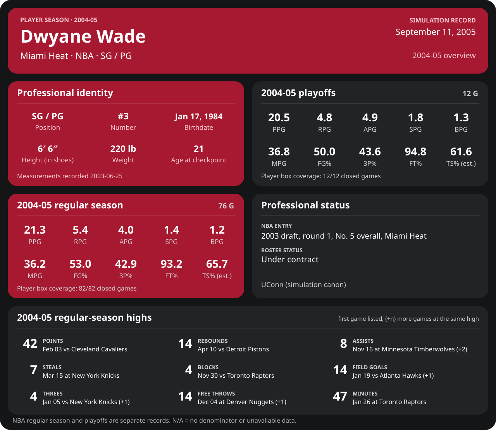
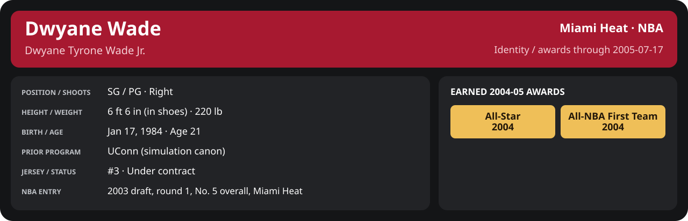

<!-- Generated by scripts/update_player_reports.py; edit source records, then rebuild. -->

# 2004-05 | Player season

## Professional identity

| Player | Age on report date | Team / league | Position | Number | Status |
| --- | --- | --- | --- | --- | --- |
| Dwyane Tyrone Wade Jr. | 21 | Miami Heat / NBA | SG / PG | 3 | Under contract |

| Identity field | Recorded value |
| --- | --- |
| Birth date | 1984-01-17 |
| NBA entry | 2003 draft, round 1, No. 5 overall, Miami Heat |
| Prior program | UConn (simulation canon) |
| Height, in shoes / without shoes | 6 ft 6 in / 6 ft 4.75 in |
| Weight | 220 lb |
| Wingspan / standing reach | 6 ft 11.5 in / 8 ft 7.5 in |
| Shooting hand | Right |
| Contract | Rookie scale signed 2003-07-21: three seasons plus a 2006-07 team option (2004-05: $2,361,800) |
| Role | Starting SG; staff plan 34 minutes |
| NBA debut | October 28, 2003 at Philadelphia 76ers (2003-04/06_Regular_Season/10_October/Week_4/Game_1.md) |
| Nationality | United States (born in the Chicago area; Robbins, Illinois home community, per the player profile) |
| National team | No selection recorded |
| National-team eligibility | United States (USA Basketball); no selection yet |
| Availability | No current restriction recorded in the established profile |
| Physical measurements recorded | 2003-06-25 |
| Professional status effective | 2004-10-28 |

Identity as of 2005-07-17; status snapshot dated 2004-10-28. User-established alternate-history player; historical Wade's biography and results are not this record.

[Complete professional identity](../Professional_Identity.md)

### Earned 2004-05 awards

| Award | Period | Announced | Decision record |
| --- | --- | --- | --- |
| Eastern Conference Player of the Month | 2004-12-01 to 2004-12-31 | 2005-01-02 | [East POM](../Stats_and_Awards/League/2004-05/12_December/League_Awards.md#player-of-the-month) |
| Eastern Conference Player of the Week | 2005-01-24 to 2005-01-30 | 2005-01-31 | [East POW](../Stats_and_Awards/League/2004-05/01_January/Week_4/League_Awards.md#player-of-the-week) |
| All-Star | 2004-11-02 to 2005-02-08 | 2005-02-08 | [All-Star](../Stats_and_Awards/League/2004-05/All_Star.md#all-stars) |
| Eastern Conference Player of the Month | 2005-03-01 to 2005-03-31 | 2005-04-02 | [East POM](../Stats_and_Awards/League/2004-05/03_March/League_Awards.md#player-of-the-month) |
| Eastern Conference Player of the Month | 2005-04-01 to 2005-04-20 | 2005-04-22 | [East POM](../Stats_and_Awards/League/2004-05/04_April/League_Awards.md#player-of-the-month) |
| All-NBA First Team | 2004-11-02 to 2005-04-20 | 2005-05-18 | [All-NBA 1st](../Stats_and_Awards/League/2004-05/Season_Awards.md#all-nba-teams) |

## Statistics

Report cutoff: **2005-07-17**. Each row is a separate competition; do not add the rates.

### Competition summary

  

[Shooting detail](../Stats_and_Awards/Shooting.md) · [Current contract](../Stats_and_Awards/Contract.md#current-contract) · [Contract history](../Stats_and_Awards/Contract.md#contract-history) · [Annual award record](../Stats_and_Awards/Awards.md)

| Scope | Age | Team | Lg | Pos | G | GS | MP | FG | FGA | FG% | 3P | 3PA | 3P% | 2P | 2PA | 2P% | eFG% | FT | FTA | FT% | ORB | DRB | TRB | AST | STL | BLK | TOV | PF | PTS | TS% (est.) | Awards |
| --- | --- | --- | --- | --- | --- | --- | --- | --- | --- | --- | --- | --- | --- | --- | --- | --- | --- | --- | --- | --- | --- | --- | --- | --- | --- | --- | --- | --- | --- | --- | --- |
| [Summer League](02_Summer_League/README.md) | 21 | Miami Heat | NBA | SG / PG | 0 | N/A | N/A | N/A | N/A | N/A | N/A | N/A | N/A | N/A | N/A | N/A | N/A | N/A | N/A | N/A | N/A | N/A | N/A | N/A | N/A | N/A | N/A | N/A | N/A | N/A | — |
| [Preseason](05_Preseason/README.md) | 21 | Miami Heat | NBA | SG / PG | 7 | 7 | 30.2 | 4.4 | 9.6 | .463 | 0.6 | 2.0 | .286 | 3.9 | 7.6 | .509 | .493 | 5.3 | 5.6 | .949 | 1.3 | 2.9 | 4.1 | 4.0 | 1.4 | 1.4 | 0.9 | 1.9 | 14.7 | .612 | — |
| [NBA regular season](06_Regular_Season/README.md) | 21 | Miami Heat | NBA | SG / PG | 76 | 76 | 36.2 | 7.1 | 13.4 | .530 | 1.1 | 2.7 | .429 | 5.9 | 10.7 | .555 | .573 | 6.0 | 6.4 | .932 | 1.5 | 3.9 | 5.4 | 4.0 | 1.4 | 1.2 | 1.3 | 3.0 | 21.3 | .657 | [East POM](../Stats_and_Awards/League/2004-05/12_December/League_Awards.md#player-of-the-month), [East POW](../Stats_and_Awards/League/2004-05/01_January/Week_4/League_Awards.md#player-of-the-week), [All-Star](../Stats_and_Awards/League/2004-05/All_Star.md#all-stars), [East POM](../Stats_and_Awards/League/2004-05/03_March/League_Awards.md#player-of-the-month), [East POM](../Stats_and_Awards/League/2004-05/04_April/League_Awards.md#player-of-the-month), [All-NBA 1st](../Stats_and_Awards/League/2004-05/Season_Awards.md#all-nba-teams) |
| [NBA playoffs](08_Playoffs/README.md) | 21 | Miami Heat | NBA | SG / PG | 12 | 12 | 36.8 | 7.2 | 14.5 | .500 | 1.4 | 3.2 | .436 | 5.8 | 11.2 | .519 | .549 | 4.6 | 4.8 | .948 | 1.2 | 3.6 | 4.8 | 4.9 | 1.8 | 1.3 | 1.1 | 2.8 | 20.5 | .616 | — |

G and GS are counts; MP and counting statistics are **per appearance**. Shooting uses **.500 = 50.0%**. Age is at the row's cutoff. Scroll horizontally for every column.

Awards are confirmed through 2005-07-17, filed by the honor's period-end date; the banner shows career awards known at the page's identity cutoff.

### Regular season by month

  

[Shooting detail](../Stats_and_Awards/Shooting.md) · [Current contract](../Stats_and_Awards/Contract.md#current-contract) · [Contract history](../Stats_and_Awards/Contract.md#contract-history) · [Annual award record](../Stats_and_Awards/Awards.md)

| Scope | Age | Team | Lg | Pos | G | GS | MP | FG | FGA | FG% | 3P | 3PA | 3P% | 2P | 2PA | 2P% | eFG% | FT | FTA | FT% | ORB | DRB | TRB | AST | STL | BLK | TOV | PF | PTS | TS% (est.) | Awards |
| --- | --- | --- | --- | --- | --- | --- | --- | --- | --- | --- | --- | --- | --- | --- | --- | --- | --- | --- | --- | --- | --- | --- | --- | --- | --- | --- | --- | --- | --- | --- | --- |
| [November 2004](../Stats_and_Awards/2004-05/11_November/README.md) | 20 | Miami Heat | NBA | SG / PG | 15 | 15 | 35.1 | 5.6 | 11.5 | .488 | 0.9 | 2.1 | .452 | 4.7 | 9.4 | .496 | .529 | 4.5 | 4.9 | .932 | 1.7 | 3.5 | 5.1 | 4.1 | 1.7 | 1.4 | 1.3 | 2.3 | 16.7 | .612 | — |
| [December 2004](../Stats_and_Awards/2004-05/12_December/README.md) | 20 | Miami Heat | NBA | SG / PG | 11 | 11 | 36.8 | 7.6 | 13.8 | .553 | 1.5 | 3.1 | .471 | 6.2 | 10.7 | .576 | .605 | 6.5 | 6.5 | .986 | 1.3 | 4.5 | 5.8 | 3.6 | 1.3 | 1.1 | 1.8 | 3.3 | 23.2 | .694 | [East POM](../Stats_and_Awards/League/2004-05/12_December/League_Awards.md#player-of-the-month) |
| [January 2005](../Stats_and_Awards/2004-05/01_January/README.md) | 21 | Miami Heat | NBA | SG / PG | 14 | 14 | 36.5 | 7.9 | 14.3 | .555 | 1.1 | 2.3 | .469 | 6.9 | 12.0 | .571 | .593 | 5.7 | 6.2 | .920 | 1.4 | 3.8 | 5.2 | 4.2 | 1.4 | 0.8 | 0.9 | 3.0 | 22.6 | .665 | [East POW](../Stats_and_Awards/League/2004-05/01_January/Week_4/League_Awards.md#player-of-the-week) |
| [February 2005](../Stats_and_Awards/2004-05/02_February/README.md) | 21 | Miami Heat | NBA | SG / PG | 12 | 12 | 37.0 | 7.8 | 13.9 | .563 | 1.5 | 3.6 | .419 | 6.3 | 10.3 | .613 | .617 | 6.1 | 6.6 | .924 | 1.4 | 3.3 | 4.8 | 3.7 | 1.1 | 1.3 | 1.5 | 3.1 | 23.2 | .691 | [All-Star](../Stats_and_Awards/League/2004-05/All_Star.md#all-stars) |
| [March 2005](../Stats_and_Awards/2004-05/03_March/README.md) | 21 | Miami Heat | NBA | SG / PG | 15 | 15 | 35.0 | 7.5 | 14.6 | .511 | 1.3 | 2.9 | .442 | 6.2 | 11.7 | .528 | .555 | 6.6 | 7.1 | .925 | 1.4 | 3.5 | 4.9 | 4.3 | 1.3 | 1.2 | 1.3 | 3.5 | 22.8 | .643 | [East POM](../Stats_and_Awards/League/2004-05/03_March/League_Awards.md#player-of-the-month) |
| [April 2005](../Stats_and_Awards/2004-05/04_April/README.md) | 21 | Miami Heat | NBA | SG / PG | 9 | 9 | 38.0 | 6.0 | 11.9 | .505 | 0.6 | 2.2 | .250 | 5.4 | 9.7 | .563 | .528 | 6.9 | 7.6 | .912 | 2.1 | 5.3 | 7.4 | 4.3 | 1.9 | 1.4 | 1.4 | 2.4 | 19.4 | .639 | [East POM](../Stats_and_Awards/League/2004-05/04_April/League_Awards.md#player-of-the-month), [All-NBA 1st](../Stats_and_Awards/League/2004-05/Season_Awards.md#all-nba-teams) |

G and GS are counts; MP and counting statistics are **per appearance**. Shooting uses **.500 = 50.0%**. Age is at the row's cutoff. Scroll horizontally for every column.

Awards are confirmed through 2005-07-17, filed by the honor's period-end date; the banner shows career awards known at the page's identity cutoff.

### Career records

[Team state](00_Team/README.md) · [Free agency](01_Free_Agency/README.md) · [Offseason](03_Offseason/README.md) · [Training camp](04_Training_Camp/README.md) · [Draft](09_Draft/README.md)

[Open your live career milestones](../Milestones/index.html) · [Detailed Shooting, Contract and Awards](../Stats_and_Awards/player_cards.html) · [Every player's contract](../Contracts/index.html)
