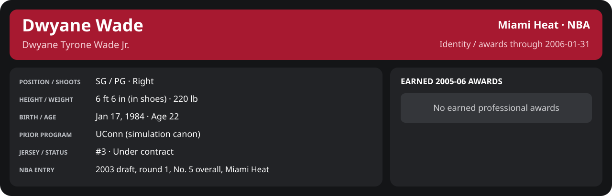

<!-- Generated by scripts/update_player_reports.py; edit source records, then rebuild. -->

# January 2006 | NBA regular season

[Career](../../../README.md) · [Professional identity](../../../Professional_Identity.md) · [Earned awards](../../../Awards.md) · [Stat definitions](../../../../../docs/player_statistics.md) · [Season](../../../Stats_and_Awards/2005-06/README.md) · [Miami](../../../Stats_and_Awards/Team/2005-06/01_January/Team_Stats.md) · [NBA players](../../../Stats_and_Awards/League/2005-06/01_January/League_Stats.md) · [NBA awards](../../../Stats_and_Awards/League/2005-06/01_January/League_Awards.md)

## Professional identity

| Player | Age on report date | Team / league | Position | Number | Status |
| --- | --- | --- | --- | --- | --- |
| Dwyane Tyrone Wade Jr. | 22 | Miami Heat / NBA | SG / PG | 3 | Under contract |

| Identity field | Recorded value |
| --- | --- |
| Birth date | 1984-01-17 |
| NBA entry | 2003 draft, round 1, No. 5 overall, Miami Heat |
| Prior program | UConn (simulation canon) |
| Height, in shoes / without shoes | 6 ft 6 in / 6 ft 4.75 in |
| Weight | 220 lb |
| Wingspan / standing reach | 6 ft 11.5 in / 8 ft 7.5 in |
| Shooting hand | Right |
| Contract | Rookie scale signed 2003-07-21: three seasons plus a 2006-07 team option (2004-05: $2,361,800) |
| Role | Starting SG; staff plan 34 minutes |
| NBA debut | October 28, 2003 at Philadelphia 76ers (2003-04/06_Regular_Season/10_October/Week_4/Game_1.md) |
| Nationality | United States (born in the Chicago area; Robbins, Illinois home community, per the player profile) |
| National team | No selection recorded |
| National-team eligibility | United States (USA Basketball); no selection yet |
| Availability | No current restriction recorded in the established profile |
| Physical measurements recorded | 2003-06-25 |
| Professional status effective | 2005-10-26 |

Identity as of 2006-01-31; status snapshot dated 2005-10-26. User-established alternate-history player; historical Wade's biography and results are not this record.

### Earned 2005-06 awards

| Award | Period | Announced | Decision record |
| --- | --- | --- | --- |
| Eastern Conference Player of the Week | 2005-11-07 to 2005-11-13 | 2005-11-14 | [East POW](../../../Stats_and_Awards/League/2005-06/11_November/Week_2/League_Awards.md#player-of-the-week) |
| Eastern Conference Player of the Week | 2005-11-14 to 2005-11-20 | 2005-11-21 | [East POW](../../../Stats_and_Awards/League/2005-06/11_November/Week_3/League_Awards.md#player-of-the-week) |
| Eastern Conference Player of the Month | 2005-11-01 to 2005-11-30 | 2005-12-02 | [East POM](../../../Stats_and_Awards/League/2005-06/11_November/League_Awards.md#player-of-the-month) |
| Eastern Conference Player of the Week | 2005-11-28 to 2005-12-04 | 2005-12-05 | [East POW](../../../Stats_and_Awards/League/2005-06/12_December/Week_1/League_Awards.md#player-of-the-week) |
| Eastern Conference Player of the Week | 2005-12-05 to 2005-12-11 | 2005-12-12 | [East POW](../../../Stats_and_Awards/League/2005-06/12_December/Week_2/League_Awards.md#player-of-the-week) |
| Eastern Conference Player of the Week | 2005-12-26 to 2006-01-01 | 2006-01-02 | [East POW](../../../Stats_and_Awards/League/2005-06/01_January/Week_1/League_Awards.md#player-of-the-week) |

## Statistics

As of **2006-01-31**: 15 closed games; 15/15 have player participation and box coverage; recorded DNPs: 0.

G counts appearances; GS counts recorded starts. DNPs, scheduled games and canceled games do not enter per-game denominators.

### Per game

  

[Shooting detail](../../../Stats_and_Awards/Shooting.md) · [Current contract](../../../Stats_and_Awards/Contract.md#current-contract) · [Contract history](../../../Stats_and_Awards/Contract.md#contract-history) · [Annual award record](../../../Stats_and_Awards/Awards.md)

| Scope | Age | Team | Lg | Pos | G | GS | MP | FG | FGA | FG% | 3P | 3PA | 3P% | 2P | 2PA | 2P% | eFG% | FT | FTA | FT% | ORB | DRB | TRB | AST | STL | BLK | TOV | PF | PTS | TS% (est.) | Awards |
| --- | --- | --- | --- | --- | --- | --- | --- | --- | --- | --- | --- | --- | --- | --- | --- | --- | --- | --- | --- | --- | --- | --- | --- | --- | --- | --- | --- | --- | --- | --- | --- |
| This scope | 22 | Miami Heat | NBA | SG / PG | 15 | 15 | 39.0 | 10.5 | 18.3 | .575 | 1.9 | 3.9 | .475 | 8.7 | 14.4 | .602 | .625 | 6.5 | 7.1 | .915 | 1.3 | 4.7 | 6.0 | 3.8 | 2.5 | 1.3 | 1.8 | 2.7 | 29.4 | .686 | [East POW](../../../Stats_and_Awards/League/2005-06/01_January/Week_1/League_Awards.md#player-of-the-week), [East POM](../../../Stats_and_Awards/League/2005-06/01_January/League_Awards.md#player-of-the-month) |

G and GS are counts; MP and counting statistics are **per appearance**. Shooting uses **.500 = 50.0%**. Age is at the row's cutoff. Scroll horizontally for every column.

Awards are confirmed through 2006-02-02, filed by the honor's period-end date; the banner shows career awards known at the page's identity cutoff.

[Full statistical detail: totals, per 36, shooting, efficiency, splits and source games](../../../Stats_and_Awards/2005-06/01_January/Stat_Detail.md)

### Period summary

  

[Shooting detail](../../../Stats_and_Awards/Shooting.md) · [Current contract](../../../Stats_and_Awards/Contract.md#current-contract) · [Contract history](../../../Stats_and_Awards/Contract.md#contract-history) · [Annual award record](../../../Stats_and_Awards/Awards.md)

| Scope | Age | Team | Lg | Pos | G | GS | MP | FG | FGA | FG% | 3P | 3PA | 3P% | 2P | 2PA | 2P% | eFG% | FT | FTA | FT% | ORB | DRB | TRB | AST | STL | BLK | TOV | PF | PTS | TS% (est.) | Awards |
| --- | --- | --- | --- | --- | --- | --- | --- | --- | --- | --- | --- | --- | --- | --- | --- | --- | --- | --- | --- | --- | --- | --- | --- | --- | --- | --- | --- | --- | --- | --- | --- |
| [Week 1: 2006-01-01 to 2006-01-07](../../../Stats_and_Awards/2005-06/01_January/Week_1/README.md) | 21 | Miami Heat | NBA | SG / PG | 3 | 3 | 43.5 | 13.7 | 23.3 | .586 | 2.7 | 6.0 | .444 | 11.0 | 17.3 | .635 | .643 | 5.3 | 5.3 | 1.000 | 1.7 | 5.3 | 7.0 | 2.7 | 4.0 | 0.7 | 2.7 | 1.3 | 35.3 | .688 | [East POW](../../../Stats_and_Awards/League/2005-06/01_January/Week_1/League_Awards.md#player-of-the-week) |
| [Week 2: 2006-01-08 to 2006-01-14](../../../Stats_and_Awards/2005-06/01_January/Week_2/README.md) | 21 | Miami Heat | NBA | SG / PG | 4 | 4 | 33.5 | 8.2 | 12.5 | .660 | 1.5 | 2.5 | .600 | 6.8 | 10.0 | .675 | .720 | 6.8 | 7.0 | .964 | 1.0 | 3.2 | 4.2 | 3.5 | 3.0 | 1.2 | 0.5 | 3.8 | 24.8 | .794 | — |
| [Week 3: 2006-01-15 to 2006-01-21](../../../Stats_and_Awards/2005-06/01_January/Week_3/README.md) | 22 | Miami Heat | NBA | SG / PG | 2 | 2 | 44.5 | 12.0 | 19.5 | .615 | 2.5 | 5.0 | .500 | 9.5 | 14.5 | .655 | .679 | 10.5 | 12.5 | .840 | 1.5 | 2.5 | 4.0 | 6.0 | 2.0 | 0.5 | 3.0 | 3.0 | 37.0 | .740 | — |
| [Week 4: 2006-01-22 to 2006-01-31](../../../Stats_and_Awards/2005-06/01_January/Week_4/README.md) | 22 | Miami Heat | NBA | SG / PG | 6 | 6 | 38.6 | 10.0 | 19.3 | .517 | 1.5 | 3.5 | .429 | 8.5 | 15.8 | .537 | .556 | 5.5 | 6.2 | .892 | 1.3 | 6.0 | 7.3 | 3.8 | 1.7 | 1.8 | 1.8 | 2.5 | 27.0 | .612 | [East POM](../../../Stats_and_Awards/League/2005-06/01_January/League_Awards.md#player-of-the-month) |

G and GS are counts; MP and counting statistics are **per appearance**. Shooting uses **.500 = 50.0%**. Age is at the row's cutoff. Scroll horizontally for every column.

Awards are confirmed through 2006-02-02, filed by the honor's period-end date; the banner shows career awards known at the page's identity cutoff.

### Period comparison

  

[Shooting detail](../../../Stats_and_Awards/Shooting.md) · [Current contract](../../../Stats_and_Awards/Contract.md#current-contract) · [Contract history](../../../Stats_and_Awards/Contract.md#contract-history) · [Annual award record](../../../Stats_and_Awards/Awards.md)

| Scope | Age | Team | Lg | Pos | G | GS | MP | FG | FGA | FG% | 3P | 3PA | 3P% | 2P | 2PA | 2P% | eFG% | FT | FTA | FT% | ORB | DRB | TRB | AST | STL | BLK | TOV | PF | PTS | TS% (est.) | Awards |
| --- | --- | --- | --- | --- | --- | --- | --- | --- | --- | --- | --- | --- | --- | --- | --- | --- | --- | --- | --- | --- | --- | --- | --- | --- | --- | --- | --- | --- | --- | --- | --- |
| January 2006 | 22 | Miami Heat | NBA | SG / PG | 15 | 15 | 39.0 | 10.5 | 18.3 | .575 | 1.9 | 3.9 | .475 | 8.7 | 14.4 | .602 | .625 | 6.5 | 7.1 | .915 | 1.3 | 4.7 | 6.0 | 3.8 | 2.5 | 1.3 | 1.8 | 2.7 | 29.4 | .686 | [East POW](../../../Stats_and_Awards/League/2005-06/01_January/Week_1/League_Awards.md#player-of-the-week), [East POM](../../../Stats_and_Awards/League/2005-06/01_January/League_Awards.md#player-of-the-month) |
| [December 2005](../../../Stats_and_Awards/2005-06/12_December/README.md) | 21 | Miami Heat | NBA | SG / PG | 16 | 16 | 36.5 | 8.2 | 15.8 | .520 | 1.2 | 3.2 | .392 | 6.9 | 12.6 | .552 | .560 | 6.5 | 6.8 | .963 | 1.9 | 4.0 | 5.9 | 4.1 | 1.4 | 1.5 | 1.6 | 3.4 | 24.1 | .644 | [East POW](../../../Stats_and_Awards/League/2005-06/12_December/Week_1/League_Awards.md#player-of-the-week), [East POW](../../../Stats_and_Awards/League/2005-06/12_December/Week_2/League_Awards.md#player-of-the-week) |
| Season through this month | 22 | Miami Heat | NBA | SG / PG | 46 | 46 | 37.5 | 9.2 | 16.4 | .562 | 1.5 | 3.3 | .467 | 7.7 | 13.1 | .585 | .608 | 6.6 | 7.1 | .929 | 1.7 | 4.5 | 6.3 | 4.1 | 1.9 | 1.2 | 1.8 | 3.0 | 26.5 | .680 | [East POW](../../../Stats_and_Awards/League/2005-06/11_November/Week_2/League_Awards.md#player-of-the-week), [East POW](../../../Stats_and_Awards/League/2005-06/11_November/Week_3/League_Awards.md#player-of-the-week), [East POM](../../../Stats_and_Awards/League/2005-06/11_November/League_Awards.md#player-of-the-month), [East POW](../../../Stats_and_Awards/League/2005-06/12_December/Week_1/League_Awards.md#player-of-the-week), [East POW](../../../Stats_and_Awards/League/2005-06/12_December/Week_2/League_Awards.md#player-of-the-week), [East POW](../../../Stats_and_Awards/League/2005-06/01_January/Week_1/League_Awards.md#player-of-the-week), [East POM](../../../Stats_and_Awards/League/2005-06/01_January/League_Awards.md#player-of-the-month) |

G and GS are counts; MP and counting statistics are **per appearance**. Shooting uses **.500 = 50.0%**. Age is at the row's cutoff. Scroll horizontally for every column.

Awards are confirmed through 2006-02-02, filed by the honor's period-end date; the banner shows career awards known at the page's identity cutoff.

### Production

| Metric | Total | Per appearance | Per 36 minutes |
| --- | --- | --- | --- |
| MIN | 585.1 | 39.0 | 36.0 |
| PTS | 441 | 29.4 | 27.1 |
| OREB | 20 | 1.3 | 1.2 |
| DREB | 70 | 4.7 | 4.3 |
| REB | 90 | 6.0 | 5.5 |
| AST | 57 | 3.8 | 3.5 |
| STL | 38 | 2.5 | 2.3 |
| BLK | 19 | 1.3 | 1.2 |
| TOV | 27 | 1.8 | 1.7 |
| PF | 40 | 2.7 | 2.5 |
| FGM | 158 | 10.5 | 9.7 |
| FGA | 275 | 18.3 | 16.9 |
| 2PM | 130 | 8.7 | 8.0 |
| 2PA | 216 | 14.4 | 13.3 |
| 3PM | 28 | 1.9 | 1.7 |
| 3PA | 59 | 3.9 | 3.6 |
| FTM | 97 | 6.5 | 6.0 |
| FTA | 106 | 7.1 | 6.5 |
| FT points | 97 | 6.5 | 6.0 |

Per-36 rates standardize playing time; they are not a projection of playing 36 minutes. Use the actual minutes denominator in every competition.

### Shooting

| Shot type | Makes | Attempts | Percentage |
| --- | --- | --- | --- |
| All field goals | 158 | 275 | 57.5% |
| Two-pointers | 130 | 216 | 60.2% |
| Three-pointers | 28 | 59 | 47.5% |
| Free throws | 97 | 106 | 91.5% |

### Efficiency and shot selection

| Metric | Value | Calculation / unit |
| --- | --- | --- |
| eFG% | 62.5% | (FGM + 0.5 × 3PM) / FGA |
| TS% (estimated) | 68.6% | PTS / [2 × (FGA + 0.44 × FTA)] |
| Three-point attempt share | 21.5% | 3PA / FGA |
| Free-throw attempt rate | 0.385 | FTA / FGA; ratio |
| Assist / turnover ratio | 2.11 | AST / TOV; N/A at zero turnovers |
| Plus/minus total | N/A | Observed on-court score differential only |
| Double-doubles | 2 | At least 10 in any two of PTS, REB, AST, STL, BLK |
| Triple-doubles | 0 | At least 10 in any three; also included in double-doubles |

Percentages use pooled makes and attempts. TS% uses an estimated free-throw weighting, not exact scoring possessions. Rounding is display-only.

### Splits

  

[Shooting detail](../../../Stats_and_Awards/Shooting.md) · [Current contract](../../../Stats_and_Awards/Contract.md#current-contract) · [Contract history](../../../Stats_and_Awards/Contract.md#contract-history) · [Annual award record](../../../Stats_and_Awards/Awards.md)

| Scope | Age | Team | Lg | Pos | G | GS | MP | FG | FGA | FG% | 3P | 3PA | 3P% | 2P | 2PA | 2P% | eFG% | FT | FTA | FT% | ORB | DRB | TRB | AST | STL | BLK | TOV | PF | PTS | TS% (est.) | Awards |
| --- | --- | --- | --- | --- | --- | --- | --- | --- | --- | --- | --- | --- | --- | --- | --- | --- | --- | --- | --- | --- | --- | --- | --- | --- | --- | --- | --- | --- | --- | --- | --- |
| Home | 22 | Miami Heat | NBA | SG / PG | 6 | 6 | 39.6 | 11.7 | 19.8 | .588 | 2.2 | 4.5 | .481 | 9.5 | 15.3 | .620 | .643 | 6.3 | 7.2 | .884 | 1.3 | 5.2 | 6.5 | 3.7 | 2.2 | 1.3 | 2.2 | 2.7 | 31.8 | .692 | — |
| Away | 22 | Miami Heat | NBA | SG / PG | 9 | 9 | 38.6 | 9.8 | 17.3 | .564 | 1.7 | 3.6 | .469 | 8.1 | 13.8 | .589 | .612 | 6.6 | 7.0 | .937 | 1.3 | 4.3 | 5.7 | 3.9 | 2.8 | 1.2 | 1.6 | 2.7 | 27.8 | .680 | — |
| Neutral | 22 | Miami Heat | NBA | SG / PG | 0 | N/A | N/A | N/A | N/A | N/A | N/A | N/A | N/A | N/A | N/A | N/A | N/A | N/A | N/A | N/A | N/A | N/A | N/A | N/A | N/A | N/A | N/A | N/A | N/A | N/A | — |
| Wins | 22 | Miami Heat | NBA | SG / PG | 9 | 9 | 40.3 | 11.4 | 19.4 | .589 | 1.7 | 3.8 | .441 | 9.8 | 15.7 | .624 | .631 | 6.4 | 6.8 | .951 | 1.4 | 5.7 | 7.1 | 3.7 | 2.2 | 1.3 | 1.6 | 2.7 | 31.0 | .691 | — |
| Losses | 22 | Miami Heat | NBA | SG / PG | 6 | 6 | 37.0 | 9.2 | 16.7 | .550 | 2.2 | 4.2 | .520 | 7.0 | 12.5 | .560 | .615 | 6.5 | 7.5 | .867 | 1.2 | 3.2 | 4.3 | 4.0 | 3.0 | 1.2 | 2.2 | 2.7 | 27.0 | .676 | — |
| Team: Miami Heat | 22 | Miami Heat | NBA | SG / PG | 15 | 15 | 39.0 | 10.5 | 18.3 | .575 | 1.9 | 3.9 | .475 | 8.7 | 14.4 | .602 | .625 | 6.5 | 7.1 | .915 | 1.3 | 4.7 | 6.0 | 3.8 | 2.5 | 1.3 | 1.8 | 2.7 | 29.4 | .686 | — |

G and GS are counts; MP and counting statistics are **per appearance**. Shooting uses **.500 = 50.0%**. Age is at the row's cutoff. Scroll horizontally for every column.

Awards are confirmed through 2006-02-02, filed by the honor's period-end date; the banner shows career awards known at the page's identity cutoff.

Splits overlap and are not additive. Each row has its own appearance denominator; games with unknown result classification are excluded from win/loss splits.

### Game highs

| Metric | High | Date / opponent (all ties) |
| --- | --- | --- |
| PTS | 44 | [2006-01-01 vs Minnesota Timberwolves](Week_1/Game_1.md) |
| REB | 12 | [2006-01-29 at Houston Rockets](Week_4/Game_5.md) |
| AST | 7 | [2006-01-13 at Seattle SuperSonics](Week_2/Game_3.md) |
| STL | 7 | [2006-01-06 at Phoenix Suns](Week_1/Game_3.md) |
| BLK | 3 | [2006-01-26 vs Phoenix Suns](Week_4/Game_3.md) |
| TOV | 4 | [2006-01-04 at New Orleans/Oklahoma City Hornets](Week_1/Game_2.md); [2006-01-06 at Phoenix Suns](Week_1/Game_3.md); [2006-01-20 vs San Antonio Spurs](Week_3/Game_2.md); [2006-01-30 vs Los Angeles Clippers](Week_4/Game_6.md) |

### Game log

| Date / source | Opponent | Venue | Result | Participation | MIN | PTS | REB | AST | STL | BLK | TOV |
| --- | --- | --- | --- | --- | --- | --- | --- | --- | --- | --- | --- |
| [2006-01-01](Week_1/Game_1.md) | Minnesota Timberwolves | home | W 133-126 | Played | 47.3 | 44 | 11 | 1 | 3 | 0 | 0 |
| [2006-01-04](Week_1/Game_2.md) | New Orleans/Oklahoma City Hornets | away | W 94-85 | Played | 41.2 | 27 | 5 | 5 | 2 | 1 | 4 |
| [2006-01-06](Week_1/Game_3.md) | Phoenix Suns | away | L 105-111 | Played | 41.9 | 35 | 5 | 2 | 7 | 1 | 4 |
| [2006-01-08](Week_2/Game_1.md) | Portland Trail Blazers | away | W 110-88 | Played | 37.0 | 31 | 6 | 3 | 6 | 1 | 1 |
| [2006-01-11](Week_2/Game_2.md) | Golden State Warriors | away | L 109-111 | Played | 39.9 | 28 | 6 | 3 | 1 | 1 | 0 |
| [2006-01-13](Week_2/Game_3.md) | Seattle SuperSonics | away | L 112-116 | Played | 24.1 | 15 | 3 | 7 | 3 | 2 | 0 |
| [2006-01-14](Week_2/Game_4.md) | Utah Jazz | away | L 93-97 | Played | 33.0 | 25 | 2 | 1 | 2 | 1 | 1 |
| [2006-01-16](Week_3/Game_1.md) | Los Angeles Lakers | away | W 131-126 | Played | 47.2 | 42 | 7 | 6 | 2 | 0 | 2 |
| [2006-01-20](Week_3/Game_2.md) | San Antonio Spurs | home | L 106-113 | Played | 41.7 | 32 | 1 | 6 | 2 | 1 | 4 |
| [2006-01-22](Week_4/Game_1.md) | Sacramento Kings | home | W 111-96 | Played | 39.3 | 25 | 7 | 3 | 2 | 1 | 3 |
| [2006-01-24](Week_4/Game_2.md) | Memphis Grizzlies | home | W 98-93 | Played | 39.8 | 43 | 7 | 2 | 2 | 2 | 1 |
| [2006-01-26](Week_4/Game_3.md) | Phoenix Suns | home | W 118-104 | Played | 28.2 | 20 | 4 | 5 | 1 | 3 | 1 |
| [2006-01-27](Week_4/Game_4.md) | Charlotte Bobcats | away | W 107-101 | Played | 40.9 | 21 | 5 | 3 | 1 | 2 | 2 |
| [2006-01-29](Week_4/Game_5.md) | Houston Rockets | away | W 105-98 | Played | 42.1 | 26 | 12 | 5 | 1 | 2 | 0 |
| [2006-01-30](Week_4/Game_6.md) | Los Angeles Clippers | home | L 106-111 | Played | 41.4 | 27 | 9 | 5 | 3 | 1 | 4 |

### Individual game boxes

| Scope | Age | Team | Lg | Pos | G | GS | MP | FG | FGA | FG% | 3P | 3PA | 3P% | 2P | 2PA | 2P% | eFG% | FT | FTA | FT% | ORB | DRB | TRB | AST | STL | BLK | TOV | PF | PTS | TS% (est.) | Awards |
| --- | --- | --- | --- | --- | --- | --- | --- | --- | --- | --- | --- | --- | --- | --- | --- | --- | --- | --- | --- | --- | --- | --- | --- | --- | --- | --- | --- | --- | --- | --- | --- |
| [2006-01-01](Week_1/Game_1.md) | 21 | Miami Heat | NBA | SG / PG | 1 | 1 | 47.3 | 17.0 | 24.0 | .708 | 4.0 | 9.0 | .444 | 13.0 | 15.0 | .867 | .792 | 6.0 | 6.0 | 1.000 | 3.0 | 8.0 | 11.0 | 1.0 | 3.0 | 0.0 | 0.0 | 2.0 | 44.0 | .826 | — |
| [2006-01-04](Week_1/Game_2.md) | 21 | Miami Heat | NBA | SG / PG | 1 | 1 | 41.2 | 11.0 | 19.0 | .579 | 1.0 | 2.0 | .500 | 10.0 | 17.0 | .588 | .605 | 4.0 | 4.0 | 1.000 | 0.0 | 5.0 | 5.0 | 5.0 | 2.0 | 1.0 | 4.0 | 2.0 | 27.0 | .650 | — |
| [2006-01-06](Week_1/Game_3.md) | 21 | Miami Heat | NBA | SG / PG | 1 | 1 | 41.9 | 13.0 | 27.0 | .481 | 3.0 | 7.0 | .429 | 10.0 | 20.0 | .500 | .537 | 6.0 | 6.0 | 1.000 | 2.0 | 3.0 | 5.0 | 2.0 | 7.0 | 1.0 | 4.0 | 0.0 | 35.0 | .590 | — |
| [2006-01-08](Week_2/Game_1.md) | 21 | Miami Heat | NBA | SG / PG | 1 | 1 | 37.0 | 10.0 | 14.0 | .714 | 1.0 | 1.0 | 1.000 | 9.0 | 13.0 | .692 | .750 | 10.0 | 10.0 | 1.000 | 0.0 | 6.0 | 6.0 | 3.0 | 6.0 | 1.0 | 1.0 | 3.0 | 31.0 | .842 | — |
| [2006-01-11](Week_2/Game_2.md) | 21 | Miami Heat | NBA | SG / PG | 1 | 1 | 39.9 | 10.0 | 17.0 | .588 | 1.0 | 3.0 | .333 | 9.0 | 14.0 | .643 | .618 | 7.0 | 8.0 | .875 | 2.0 | 4.0 | 6.0 | 3.0 | 1.0 | 1.0 | 0.0 | 3.0 | 28.0 | .682 | — |
| [2006-01-13](Week_2/Game_3.md) | 21 | Miami Heat | NBA | SG / PG | 1 | 1 | 24.1 | 6.0 | 9.0 | .667 | 1.0 | 3.0 | .333 | 5.0 | 6.0 | .833 | .722 | 2.0 | 2.0 | 1.000 | 2.0 | 1.0 | 3.0 | 7.0 | 3.0 | 2.0 | 0.0 | 5.0 | 15.0 | .759 | — |
| [2006-01-14](Week_2/Game_4.md) | 21 | Miami Heat | NBA | SG / PG | 1 | 1 | 33.0 | 7.0 | 10.0 | .700 | 3.0 | 3.0 | 1.000 | 4.0 | 7.0 | .571 | .850 | 8.0 | 8.0 | 1.000 | 0.0 | 2.0 | 2.0 | 1.0 | 2.0 | 1.0 | 1.0 | 4.0 | 25.0 | .925 | — |
| [2006-01-16](Week_3/Game_1.md) | 21 | Miami Heat | NBA | SG / PG | 1 | 1 | 47.2 | 14.0 | 19.0 | .737 | 2.0 | 4.0 | .500 | 12.0 | 15.0 | .800 | .789 | 12.0 | 13.0 | .923 | 3.0 | 4.0 | 7.0 | 6.0 | 2.0 | 0.0 | 2.0 | 3.0 | 42.0 | .850 | — |
| [2006-01-20](Week_3/Game_2.md) | 22 | Miami Heat | NBA | SG / PG | 1 | 1 | 41.7 | 10.0 | 20.0 | .500 | 3.0 | 6.0 | .500 | 7.0 | 14.0 | .500 | .575 | 9.0 | 12.0 | .750 | 0.0 | 1.0 | 1.0 | 6.0 | 2.0 | 1.0 | 4.0 | 3.0 | 32.0 | .633 | — |
| [2006-01-22](Week_4/Game_1.md) | 22 | Miami Heat | NBA | SG / PG | 1 | 1 | 39.3 | 11.0 | 21.0 | .524 | 1.0 | 2.0 | .500 | 10.0 | 19.0 | .526 | .548 | 2.0 | 2.0 | 1.000 | 2.0 | 5.0 | 7.0 | 3.0 | 2.0 | 1.0 | 3.0 | 1.0 | 25.0 | .571 | — |
| [2006-01-24](Week_4/Game_2.md) | 22 | Miami Heat | NBA | SG / PG | 1 | 1 | 39.8 | 16.0 | 25.0 | .640 | 2.0 | 4.0 | .500 | 14.0 | 21.0 | .667 | .680 | 9.0 | 9.0 | 1.000 | 1.0 | 6.0 | 7.0 | 2.0 | 2.0 | 2.0 | 1.0 | 5.0 | 43.0 | .742 | — |
| [2006-01-26](Week_4/Game_3.md) | 22 | Miami Heat | NBA | SG / PG | 1 | 1 | 28.2 | 7.0 | 12.0 | .583 | 1.0 | 3.0 | .333 | 6.0 | 9.0 | .667 | .625 | 5.0 | 5.0 | 1.000 | 1.0 | 3.0 | 4.0 | 5.0 | 1.0 | 3.0 | 1.0 | 4.0 | 20.0 | .704 | — |
| [2006-01-27](Week_4/Game_4.md) | 22 | Miami Heat | NBA | SG / PG | 1 | 1 | 40.9 | 8.0 | 22.0 | .364 | 3.0 | 6.0 | .500 | 5.0 | 16.0 | .312 | .432 | 2.0 | 2.0 | 1.000 | 0.0 | 5.0 | 5.0 | 3.0 | 1.0 | 2.0 | 2.0 | 3.0 | 21.0 | .459 | — |
| [2006-01-29](Week_4/Game_5.md) | 22 | Miami Heat | NBA | SG / PG | 1 | 1 | 42.1 | 9.0 | 19.0 | .474 | 0.0 | 3.0 | .000 | 9.0 | 16.0 | .562 | .474 | 8.0 | 10.0 | .800 | 3.0 | 9.0 | 12.0 | 5.0 | 1.0 | 2.0 | 0.0 | 1.0 | 26.0 | .556 | — |
| [2006-01-30](Week_4/Game_6.md) | 22 | Miami Heat | NBA | SG / PG | 1 | 1 | 41.4 | 9.0 | 17.0 | .529 | 2.0 | 3.0 | .667 | 7.0 | 14.0 | .500 | .588 | 7.0 | 9.0 | .778 | 1.0 | 8.0 | 9.0 | 5.0 | 3.0 | 1.0 | 4.0 | 1.0 | 27.0 | .644 | — |

G and GS are counts; MP and counting statistics are **per appearance**. Shooting uses **.500 = 50.0%**. Age is at the row's cutoff. Scroll horizontally for every column.

Awards are confirmed through 2006-02-02, filed by the honor's period-end date; the banner shows career awards known at the page's identity cutoff.

### Game shooting detail

| Date / source | FG | 2P | 3P | FT | eFG% | TS% (est.) | +/- | PF |
| --- | --- | --- | --- | --- | --- | --- | --- | --- |
| [2006-01-01](Week_1/Game_1.md) | 17/24 | 13/15 | 4/9 | 6/6 | 79.2% | 82.6% | N/A | 2 |
| [2006-01-04](Week_1/Game_2.md) | 11/19 | 10/17 | 1/2 | 4/4 | 60.5% | 65.0% | N/A | 2 |
| [2006-01-06](Week_1/Game_3.md) | 13/27 | 10/20 | 3/7 | 6/6 | 53.7% | 59.0% | N/A | 0 |
| [2006-01-08](Week_2/Game_1.md) | 10/14 | 9/13 | 1/1 | 10/10 | 75.0% | 84.2% | N/A | 3 |
| [2006-01-11](Week_2/Game_2.md) | 10/17 | 9/14 | 1/3 | 7/8 | 61.8% | 68.2% | N/A | 3 |
| [2006-01-13](Week_2/Game_3.md) | 6/9 | 5/6 | 1/3 | 2/2 | 72.2% | 75.9% | N/A | 5 |
| [2006-01-14](Week_2/Game_4.md) | 7/10 | 4/7 | 3/3 | 8/8 | 85.0% | 92.5% | N/A | 4 |
| [2006-01-16](Week_3/Game_1.md) | 14/19 | 12/15 | 2/4 | 12/13 | 78.9% | 85.0% | N/A | 3 |
| [2006-01-20](Week_3/Game_2.md) | 10/20 | 7/14 | 3/6 | 9/12 | 57.5% | 63.3% | N/A | 3 |
| [2006-01-22](Week_4/Game_1.md) | 11/21 | 10/19 | 1/2 | 2/2 | 54.8% | 57.1% | N/A | 1 |
| [2006-01-24](Week_4/Game_2.md) | 16/25 | 14/21 | 2/4 | 9/9 | 68.0% | 74.2% | N/A | 5 |
| [2006-01-26](Week_4/Game_3.md) | 7/12 | 6/9 | 1/3 | 5/5 | 62.5% | 70.4% | N/A | 4 |
| [2006-01-27](Week_4/Game_4.md) | 8/22 | 5/16 | 3/6 | 2/2 | 43.2% | 45.9% | N/A | 3 |
| [2006-01-29](Week_4/Game_5.md) | 9/19 | 9/16 | 0/3 | 8/10 | 47.4% | 55.6% | N/A | 1 |
| [2006-01-30](Week_4/Game_6.md) | 9/17 | 7/14 | 2/3 | 7/9 | 58.8% | 64.4% | N/A | 1 |

### Additional data needed

| Statistic family | Current support | Required evidence |
| --- | --- | --- |
| Starts; plus/minus | N/A unless supplied in the player box | Explicit started and plus_minus fields |
| Per 100 possessions; offensive / defensive / net rating | Unavailable in current box feed | Player on-court possessions and both teams' scoring during those possessions |
| USG%; AST%; OREB%, DREB%, REB% | Unavailable in current box feed | Matching player/team/opponent opportunity counts and a declared method |
| Rim, paint, midrange, corner / above-break threes | Unavailable in current box feed | Shot locations, attempts and makes |
| Drives, touches, catch-and-shoot, pull-ups, play types | Unavailable in current box feed | Tracking or tagged play-by-play |
| Clutch, on/off, lineup combinations, assisted baskets | Unavailable in current box feed | Timed events, score state, substitutions and possession attribution |
| Deflections, charges, contested shots, box outs | Unavailable in current box feed | Observed hustle/defensive events |
| League rank, percentile, relative TS%; impact models | Not derived by this report | Same-period simulated league baseline, eligibility rules and documented model |
