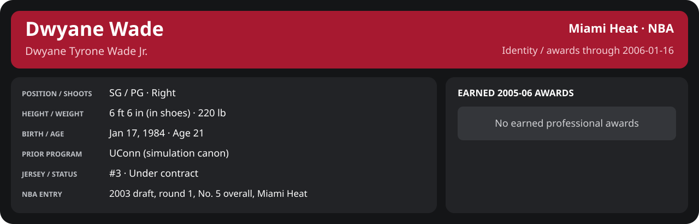

# January Week 3 Game 1

Player identity and statistics are generated here by `python scripts/update_player_reports.py`.
Decisions remain in the owning phase/week note. A scheduled game has no statistical result.

Miami's injured list for this game: DeShawn Stevenson, Matt Carroll, Chris Mihm (`00_Team/Transactions/injured_list.json`; twelve dress).

<!-- game-result:start -->
## Result

**Miami Heat 131 at Los Angeles Lakers 126 (1OT)** · Miami Heat W 131-126 vs Los Angeles Lakers · away (Los Angeles Lakers) · 2006-01-16

Event `2006-01-16-miami-heat-at-los-angeles-lakers` · Railway engine (runtime/private_service.py) · result file [`Game_1.result.json`](Game_1.result.json) (the engine's answer as served; the note is the canonical record).

### Box score

```text
Miami Heat 131 at Los Angeles Lakers 126 (1OT)
2006-01-16  2005-06 regular  event 2006-01-16-miami-heat-at-los-angeles-lakers
Kernel 2003.11, calibrated on 2004-05 (imported_source)

Period      1    2    3    4    5     T
Miami He   26   27   36   30   12   131
Los Ange   29   27   35   28    7   126

Miami Heat
                           MIN  PTS   FG      3P     FT    OR  DR AST STL BLK  TO  PF
Mike James                45.6   25   8-17   2-4    7-8     1   4  13   1   0   1   4
Dwyane Wade               47.2   42  14-19   2-4   12-13    3   4   6   2   0   2   3
Caron Butler              46.7   18   6-12   0-1    6-6     0   7   3   3   1   1   4
Mehmet Okur               46.7   27   9-19   3-7    6-7     6   8   1   0   1   4   4
Joe Smith                 22.1    5   2-8    0-0    1-3     2   1   2   1   1   0   5
Donyell Marshall          17.4    5   2-5    1-3    0-0     2   1   1   0   0   2   2
Anthony Johnson           13.0    4   2-4    0-0    0-0     0   1   0   0   0   1   3
Sebastian Telfair          9.2    3   1-3    1-2    0-0     0   1   5   1   0   0   0
Mike Wilks                 5.7    0   0-0    0-0    0-0     0   1   0   0   0   0   0
Eddie Gill                 5.7    2   1-2    0-0    0-0     1   0   0   0   0   0   1
Eddie Jones                4.9    0   0-1    0-0    0-0     0   0   0   0   0   1   1
P.J. Brown                 0.9    0   0-0    0-0    0-0     0   0   0   0   0   0   1
TEAM                     265.0  131  45-90   9-21  32-37   15  28  31   8   3  14  28
  Includes 2 team turnover(s) not charged to an individual.

Los Angeles Lakers
                           MIN  PTS   FG      3P     FT    OR  DR AST STL BLK  TO  PF
Kobe Bryant               46.5   35  15-27   0-5    5-5     1   2  12   1   0   1   5
Shaquille O'Neal          44.5   24  10-20   0-1    4-10    6   4   4   0   2   6   5
Chucky Atkins             32.7   10   3-8    2-3    2-3     0   3   1   0   0   1   2
Kareem Rush               32.7   21   8-14   3-4    2-2     0   3   2   1   1   2   3
Viktor Khryapa (DQ)       29.6   11   4-8    0-1    3-4     2   5   2   0   1   2   6
Luke Walton               18.6    4   1-2    0-0    2-2     0   5   1   3   1   0   2
Brian Cook                17.4   10   3-4    2-3    2-2     1   0   0   1   1   1   2
Damien Wilkins            16.7    4   2-2    0-0    0-0     0   2   0   0   0   0   2
Trevor Ariza              12.6    4   2-3    0-0    0-2     3   1   2   0   1   2   3
Alan Anderson              6.3    3   1-1    1-1    0-0     0   1   2   0   0   0   0
Jim Jackson                6.4    0   0-3    0-1    0-0     0   2   1   0   1   0   0
Lou Williams               0.9    0   0-0    0-0    0-0     0   0   0   0   0   0   0
TEAM                     265.0  126  49-92   8-19  20-30   13  28  27   6   8  15  30
```

### Miami injuries

No Miami injury was drawn in this game.
<!-- game-result:end -->

<!-- player-report:start -->
## Professional identity



| Player | Age on report date | Team / league | Position | Number | Status |
| --- | --- | --- | --- | --- | --- |
| Dwyane Tyrone Wade Jr. | 21 | Miami Heat / NBA | SG / PG | 3 | Under contract |

| Identity field | Recorded value |
| --- | --- |
| Birth date | 1984-01-17 |
| NBA entry | 2003 draft, round 1, No. 5 overall, Miami Heat |
| Prior program | UConn (simulation canon) |
| Height, in shoes / without shoes | 6 ft 6 in / 6 ft 4.75 in |
| Weight | 220 lb |
| Wingspan / standing reach | 6 ft 11.5 in / 8 ft 7.5 in |
| Shooting hand | Right |
| Contract | Rookie scale signed 2003-07-21: three seasons plus a 2006-07 team option (2004-05: $2,361,800) |
| Role | Starting SG; staff plan 34 minutes |
| NBA debut | October 28, 2003 at Philadelphia 76ers (2003-04/06_Regular_Season/10_October/Week_4/Game_1.md) |
| Nationality | United States (born in the Chicago area; Robbins, Illinois home community, per the player profile) |
| National team | No selection recorded |
| National-team eligibility | United States (USA Basketball); no selection yet |
| Availability | No current restriction recorded in the established profile |
| Physical measurements recorded | 2003-06-25 |
| Professional status effective | 2005-10-26 |

Identity as of 2006-01-16; status snapshot dated 2005-10-26. User-established alternate-history player; historical Wade's biography and results are not this record.

### Earned 2005-06 awards

| Award | Period | Announced | Decision record |
| --- | --- | --- | --- |
| Eastern Conference Player of the Week | 2005-11-07 to 2005-11-13 | 2005-11-14 | [East POW](../../../../Stats_and_Awards/League/2005-06/11_November/Week_2/League_Awards.md#player-of-the-week) |
| Eastern Conference Player of the Week | 2005-11-14 to 2005-11-20 | 2005-11-21 | [East POW](../../../../Stats_and_Awards/League/2005-06/11_November/Week_3/League_Awards.md#player-of-the-week) |
| Eastern Conference Player of the Month | 2005-11-01 to 2005-11-30 | 2005-12-02 | [East POM](../../../../Stats_and_Awards/League/2005-06/11_November/League_Awards.md#player-of-the-month) |
| Eastern Conference Player of the Week | 2005-11-28 to 2005-12-04 | 2005-12-05 | [East POW](../../../../Stats_and_Awards/League/2005-06/12_December/Week_1/League_Awards.md#player-of-the-week) |
| Eastern Conference Player of the Week | 2005-12-05 to 2005-12-11 | 2005-12-12 | [East POW](../../../../Stats_and_Awards/League/2005-06/12_December/Week_2/League_Awards.md#player-of-the-week) |
| Eastern Conference Player of the Week | 2005-12-26 to 2006-01-01 | 2006-01-02 | [East POW](../../../../Stats_and_Awards/League/2005-06/01_January/Week_1/League_Awards.md#player-of-the-week) |

## Statistics

As of **2006-01-16**: 1 closed games; 1/1 have player participation and box coverage; recorded DNPs: 0.

G counts appearances; GS counts recorded starts. DNPs, scheduled games and canceled games do not enter per-game denominators.

### Per game

[](../../../../Stats_and_Awards/player_cards.html?period=regular-2005-06-game-a096a8b903b64ebd#shooting) [](../../../../Stats_and_Awards/player_cards.html#contract) [](../../../../Stats_and_Awards/player_cards.html#awards)

[Shooting detail](../../../../Stats_and_Awards/Shooting.md) · [Current contract](../../../../Stats_and_Awards/Contract.md#current-contract) · [Contract history](../../../../Stats_and_Awards/Contract.md#contract-history) · [Annual award record](../../../../Stats_and_Awards/Awards.md)

| Scope | Age | Team | Lg | Pos | G | GS | MP | FG | FGA | FG% | 3P | 3PA | 3P% | 2P | 2PA | 2P% | eFG% | FT | FTA | FT% | ORB | DRB | TRB | AST | STL | BLK | TOV | PF | PTS | TS% (est.) | Awards |
| --- | --- | --- | --- | --- | --- | --- | --- | --- | --- | --- | --- | --- | --- | --- | --- | --- | --- | --- | --- | --- | --- | --- | --- | --- | --- | --- | --- | --- | --- | --- | --- |
| This game | 21 | Miami Heat | NBA | SG / PG | 1 | 1 | 47.2 | 14.0 | 19.0 | .737 | 2.0 | 4.0 | .500 | 12.0 | 15.0 | .800 | .789 | 12.0 | 13.0 | .923 | 3.0 | 4.0 | 7.0 | 6.0 | 2.0 | 0.0 | 2.0 | 3.0 | 42.0 | .850 | — |

G and GS are counts; MP and counting statistics are **per appearance**. Shooting uses **.500 = 50.0%**. Age is at the row's cutoff. Scroll horizontally for every column.

Awards are confirmed through 2006-04-19, filed by the honor's period-end date; the banner shows career awards known at the page's identity cutoff.

### Production

| Metric | Total | Per appearance | Per 36 minutes |
| --- | --- | --- | --- |
| MIN | 47.2 | 47.2 | 36.0 |
| PTS | 42 | 42.0 | 32.0 |
| OREB | 3 | 3.0 | 2.3 |
| DREB | 4 | 4.0 | 3.0 |
| REB | 7 | 7.0 | 5.3 |
| AST | 6 | 6.0 | 4.6 |
| STL | 2 | 2.0 | 1.5 |
| BLK | 0 | 0.0 | 0.0 |
| TOV | 2 | 2.0 | 1.5 |
| PF | 3 | 3.0 | 2.3 |
| FGM | 14 | 14.0 | 10.7 |
| FGA | 19 | 19.0 | 14.5 |
| 2PM | 12 | 12.0 | 9.1 |
| 2PA | 15 | 15.0 | 11.4 |
| 3PM | 2 | 2.0 | 1.5 |
| 3PA | 4 | 4.0 | 3.0 |
| FTM | 12 | 12.0 | 9.1 |
| FTA | 13 | 13.0 | 9.9 |
| FT points | 12 | 12.0 | 9.1 |

Per-36 rates standardize playing time; they are not a projection of playing 36 minutes. Use the actual minutes denominator in every competition.

### Shooting

| Shot type | Makes | Attempts | Percentage |
| --- | --- | --- | --- |
| All field goals | 14 | 19 | 73.7% |
| Two-pointers | 12 | 15 | 80.0% |
| Three-pointers | 2 | 4 | 50.0% |
| Free throws | 12 | 13 | 92.3% |

### Efficiency and shot selection

| Metric | Value | Calculation / unit |
| --- | --- | --- |
| eFG% | 78.9% | (FGM + 0.5 × 3PM) / FGA |
| TS% (estimated) | 85.0% | PTS / [2 × (FGA + 0.44 × FTA)] |
| Three-point attempt share | 21.1% | 3PA / FGA |
| Free-throw attempt rate | 0.684 | FTA / FGA; ratio |
| Assist / turnover ratio | 3.00 | AST / TOV; N/A at zero turnovers |
| Plus/minus total | N/A | Observed on-court score differential only |
| Double-doubles | 0 | At least 10 in any two of PTS, REB, AST, STL, BLK |
| Triple-doubles | 0 | At least 10 in any three; also included in double-doubles |

Percentages use pooled makes and attempts. TS% uses an estimated free-throw weighting, not exact scoring possessions. Rounding is display-only.

### Splits

[](../../../../Stats_and_Awards/player_cards.html?period=regular-2005-06-week-2006-01-15#shooting) [](../../../../Stats_and_Awards/player_cards.html#contract) [](../../../../Stats_and_Awards/player_cards.html#awards)

[Shooting detail](../../../../Stats_and_Awards/Shooting.md) · [Current contract](../../../../Stats_and_Awards/Contract.md#current-contract) · [Contract history](../../../../Stats_and_Awards/Contract.md#contract-history) · [Annual award record](../../../../Stats_and_Awards/Awards.md)

| Scope | Age | Team | Lg | Pos | G | GS | MP | FG | FGA | FG% | 3P | 3PA | 3P% | 2P | 2PA | 2P% | eFG% | FT | FTA | FT% | ORB | DRB | TRB | AST | STL | BLK | TOV | PF | PTS | TS% (est.) | Awards |
| --- | --- | --- | --- | --- | --- | --- | --- | --- | --- | --- | --- | --- | --- | --- | --- | --- | --- | --- | --- | --- | --- | --- | --- | --- | --- | --- | --- | --- | --- | --- | --- |
| Home | 21 | Miami Heat | NBA | SG / PG | 0 | N/A | N/A | N/A | N/A | N/A | N/A | N/A | N/A | N/A | N/A | N/A | N/A | N/A | N/A | N/A | N/A | N/A | N/A | N/A | N/A | N/A | N/A | N/A | N/A | N/A | — |
| Away | 21 | Miami Heat | NBA | SG / PG | 1 | 1 | 47.2 | 14.0 | 19.0 | .737 | 2.0 | 4.0 | .500 | 12.0 | 15.0 | .800 | .789 | 12.0 | 13.0 | .923 | 3.0 | 4.0 | 7.0 | 6.0 | 2.0 | 0.0 | 2.0 | 3.0 | 42.0 | .850 | — |
| Neutral | 21 | Miami Heat | NBA | SG / PG | 0 | N/A | N/A | N/A | N/A | N/A | N/A | N/A | N/A | N/A | N/A | N/A | N/A | N/A | N/A | N/A | N/A | N/A | N/A | N/A | N/A | N/A | N/A | N/A | N/A | N/A | — |
| Wins | 21 | Miami Heat | NBA | SG / PG | 1 | 1 | 47.2 | 14.0 | 19.0 | .737 | 2.0 | 4.0 | .500 | 12.0 | 15.0 | .800 | .789 | 12.0 | 13.0 | .923 | 3.0 | 4.0 | 7.0 | 6.0 | 2.0 | 0.0 | 2.0 | 3.0 | 42.0 | .850 | — |
| Losses | 21 | Miami Heat | NBA | SG / PG | 0 | N/A | N/A | N/A | N/A | N/A | N/A | N/A | N/A | N/A | N/A | N/A | N/A | N/A | N/A | N/A | N/A | N/A | N/A | N/A | N/A | N/A | N/A | N/A | N/A | N/A | — |
| Team: Miami Heat | 21 | Miami Heat | NBA | SG / PG | 1 | 1 | 47.2 | 14.0 | 19.0 | .737 | 2.0 | 4.0 | .500 | 12.0 | 15.0 | .800 | .789 | 12.0 | 13.0 | .923 | 3.0 | 4.0 | 7.0 | 6.0 | 2.0 | 0.0 | 2.0 | 3.0 | 42.0 | .850 | — |

G and GS are counts; MP and counting statistics are **per appearance**. Shooting uses **.500 = 50.0%**. Age is at the row's cutoff. Scroll horizontally for every column.

Awards are confirmed through 2006-04-19, filed by the honor's period-end date; the banner shows career awards known at the page's identity cutoff.

Splits overlap and are not additive. Each row has its own appearance denominator; games with unknown result classification are excluded from win/loss splits.

### Game highs

| Metric | High | Date / opponent (all ties) |
| --- | --- | --- |
| PTS | 42 | [2006-01-16 at Los Angeles Lakers](Game_1.md) |
| REB | 7 | [2006-01-16 at Los Angeles Lakers](Game_1.md) |
| AST | 6 | [2006-01-16 at Los Angeles Lakers](Game_1.md) |
| STL | 2 | [2006-01-16 at Los Angeles Lakers](Game_1.md) |
| BLK | 0 | [2006-01-16 at Los Angeles Lakers](Game_1.md) |
| TOV | 2 | [2006-01-16 at Los Angeles Lakers](Game_1.md) |

### Game log

| Date / source | Opponent | Venue | Result | Participation | MIN | PTS | REB | AST | STL | BLK | TOV |
| --- | --- | --- | --- | --- | --- | --- | --- | --- | --- | --- | --- |
| [2006-01-16](Game_1.md) | Los Angeles Lakers | away | W 131-126 | Played | 47.2 | 42 | 7 | 6 | 2 | 0 | 2 |

### Game shooting detail

| Date / source | FG | 2P | 3P | FT | eFG% | TS% (est.) | +/- | PF |
| --- | --- | --- | --- | --- | --- | --- | --- | --- |
| [2006-01-16](Game_1.md) | 14/19 | 12/15 | 2/4 | 12/13 | 78.9% | 85.0% | N/A | 3 |

### Additional data needed

| Statistic family | Current support | Required evidence |
| --- | --- | --- |
| Starts; plus/minus | N/A unless supplied in the player box | Explicit started and plus_minus fields |
| Per 100 possessions; offensive / defensive / net rating | Unavailable in current box feed | Player on-court possessions and both teams' scoring during those possessions |
| USG%; AST%; OREB%, DREB%, REB% | Unavailable in current box feed | Matching player/team/opponent opportunity counts and a declared method |
| Rim, paint, midrange, corner / above-break threes | Unavailable in current box feed | Shot locations, attempts and makes |
| Drives, touches, catch-and-shoot, pull-ups, play types | Unavailable in current box feed | Tracking or tagged play-by-play |
| Clutch, on/off, lineup combinations, assisted baskets | Unavailable in current box feed | Timed events, score state, substitutions and possession attribution |
| Deflections, charges, contested shots, box outs | Unavailable in current box feed | Observed hustle/defensive events |
| League rank, percentile, relative TS%; impact models | Not derived by this report | Same-period simulated league baseline, eligibility rules and documented model |

<!-- player-report:end -->
