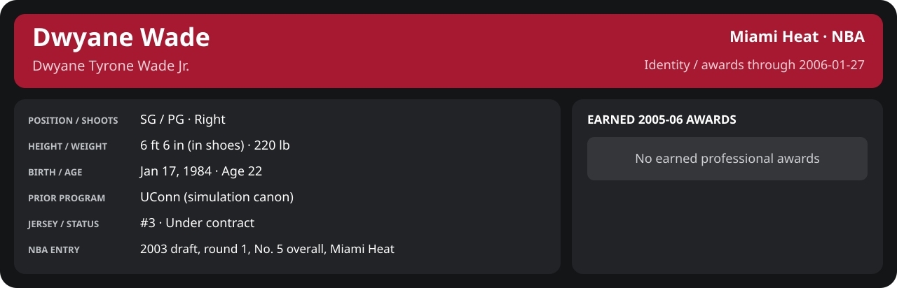

# January Week 4 Game 4

Player identity and statistics are generated here by `python scripts/update_player_reports.py`.
Decisions remain in the owning phase/week note. A scheduled game has no statistical result.

Miami's injured list for this game: DeShawn Stevenson, Matt Carroll, Eddie Jones (`00_Team/Transactions/injured_list.json`; twelve dress).

<!-- game-result:start -->
## Result

**Miami Heat 107 at Charlotte Bobcats 101** · Miami Heat W 107-101 vs Charlotte Bobcats · away (Charlotte Bobcats) · 2006-01-27

Event `2006-01-27-miami-heat-at-charlotte-bobcats` · Railway engine (runtime/private_service.py) · result file [`Game_4.result.json`](Game_4.result.json) (the engine's answer as served; the note is the canonical record).

### Box score

```text
Miami Heat 107 at Charlotte Bobcats 101
2006-01-27  2005-06 regular  event 2006-01-27-miami-heat-at-charlotte-bobcats
Kernel 2003.11, calibrated on 2004-05 (imported_source)

Period      1    2    3    4     T
Miami He   32   30   26   19   107
Charlott   34   24   25   18   101

Miami Heat
                           MIN  PTS   FG      3P     FT    OR  DR AST STL BLK  TO  PF
Mike James                35.8   17   6-13   2-3    3-3     3   5   4   2   0   3   3
Dwyane Wade               40.9   21   8-22   3-6    2-2     0   5   3   1   2   2   3
Joe Smith                 35.6   17   5-10   0-0    7-8     5   4   0   0   1   2   2
Mehmet Okur               35.6   12   4-10   1-3    3-6     3   3   2   0   0   0   2
Chris Mihm                35.5   14   5-6    0-0    4-8     2   4   4   0   3   1   3
Caron Butler              16.6    8   3-4    0-0    2-2     0   0   1   1   0   1   0
P.J. Brown                12.5    2   1-1    0-0    0-0     1   4   1   1   0   1   3
Donyell Marshall           8.8    5   1-4    1-3    2-2     1   1   0   0   0   0   0
Anthony Johnson            9.3    6   2-8    1-4    1-2     0   1   0   0   0   0   0
Sebastian Telfair          6.2    5   2-3    1-1    0-0     0   0   3   0   0   0   0
Mike Wilks                 3.1    0   0-1    0-0    0-0     0   1   1   0   0   0   0
TEAM                     240.0  107  37-82   9-20  24-33   15  28  19   5   6  12  16
  Includes 2 team turnover(s) not charged to an individual.

Charlotte Bobcats
                           MIN  PTS   FG      3P     FT    OR  DR AST STL BLK  TO  PF
Luke Ridnour              38.7   17   7-21   1-3    2-2     0   7   5   1   0   3   3
Kevin Martin              34.0   24   9-11   1-1    5-6     1   1   0   1   0   2   1
Steve Blake               32.5    7   2-9    2-4    1-2     0   4   9   0   0   1   5
Shaun Livingston          32.2    9   4-8    1-3    0-0     0   3   5   3   2   3   2
Mickaël Piétrus           19.8    9   4-7    1-2    0-0     1   3   1   0   0   0   4
Jarron Collins            27.9   13   4-5    0-0    5-7     3   3   3   0   0   0   4
Brent Barry               17.9    8   3-7    2-4    0-0     0   1   1   1   0   0   2
Ike Diogu                 15.8    8   3-5    0-0    2-4     1   4   1   0   0   3   3
Shavlik Randolph           6.3    2   1-2    0-0    0-0     1   1   1   0   0   1   0
Moochie Norris             5.4    0   0-0    0-0    0-0     1   1   1   1   0   1   1
Vitaly Potapenko           6.4    4   2-2    0-0    0-0     1   0   1   1   0   0   0
Rawle Marshall             3.0    0   0-0    0-0    0-0     0   0   0   0   0   1   1
TEAM                     240.0  101  39-77   8-17  15-21    9  28  28   8   2  17  26
  Includes 2 team turnover(s) not charged to an individual.
```

### Miami injuries

No Miami injury was drawn in this game.
<!-- game-result:end -->

<!-- player-report:start -->
## Professional identity



| Player | Age on report date | Team / league | Position | Number | Status |
| --- | --- | --- | --- | --- | --- |
| Dwyane Tyrone Wade Jr. | 22 | Miami Heat / NBA | SG / PG | 3 | Under contract |

| Identity field | Recorded value |
| --- | --- |
| Birth date | 1984-01-17 |
| NBA entry | 2003 draft, round 1, No. 5 overall, Miami Heat |
| Prior program | UConn (simulation canon) |
| Height, in shoes / without shoes | 6 ft 6 in / 6 ft 4.75 in |
| Weight | 220 lb |
| Wingspan / standing reach | 6 ft 11.5 in / 8 ft 7.5 in |
| Shooting hand | Right |
| Contract | Rookie scale signed 2003-07-21: three seasons plus a 2006-07 team option (2004-05: $2,361,800) |
| Role | Starting SG; staff plan 34 minutes |
| NBA debut | October 28, 2003 at Philadelphia 76ers (2003-04/06_Regular_Season/10_October/Week_4/Game_1.md) |
| Nationality | United States (born in the Chicago area; Robbins, Illinois home community, per the player profile) |
| National team | No selection recorded |
| National-team eligibility | United States (USA Basketball); no selection yet |
| Availability | No current restriction recorded in the established profile |
| Physical measurements recorded | 2003-06-25 |
| Professional status effective | 2005-10-26 |

Identity as of 2006-01-27; status snapshot dated 2005-10-26. User-established alternate-history player; historical Wade's biography and results are not this record.

### Earned 2005-06 awards

| Award | Period | Announced | Decision record |
| --- | --- | --- | --- |
| Eastern Conference Player of the Week | 2005-11-07 to 2005-11-13 | 2005-11-14 | [East POW](../../../../Stats_and_Awards/League/2005-06/11_November/Week_2/League_Awards.md#player-of-the-week) |
| Eastern Conference Player of the Week | 2005-11-14 to 2005-11-20 | 2005-11-21 | [East POW](../../../../Stats_and_Awards/League/2005-06/11_November/Week_3/League_Awards.md#player-of-the-week) |
| Eastern Conference Player of the Month | 2005-11-01 to 2005-11-30 | 2005-12-02 | [East POM](../../../../Stats_and_Awards/League/2005-06/11_November/League_Awards.md#player-of-the-month) |
| Eastern Conference Player of the Week | 2005-11-28 to 2005-12-04 | 2005-12-05 | [East POW](../../../../Stats_and_Awards/League/2005-06/12_December/Week_1/League_Awards.md#player-of-the-week) |
| Eastern Conference Player of the Week | 2005-12-05 to 2005-12-11 | 2005-12-12 | [East POW](../../../../Stats_and_Awards/League/2005-06/12_December/Week_2/League_Awards.md#player-of-the-week) |
| Eastern Conference Player of the Week | 2005-12-26 to 2006-01-01 | 2006-01-02 | [East POW](../../../../Stats_and_Awards/League/2005-06/01_January/Week_1/League_Awards.md#player-of-the-week) |

## Statistics

As of **2006-01-27**: 1 closed games; 1/1 have player participation and box coverage; recorded DNPs: 0.

G counts appearances; GS counts recorded starts. DNPs, scheduled games and canceled games do not enter per-game denominators.

### Per game

[](../../../../Stats_and_Awards/player_cards.html?period=regular-2005-06-game-a2eec533fd040a2c#shooting) [](../../../../Stats_and_Awards/player_cards.html#contract) [](../../../../Stats_and_Awards/player_cards.html#awards)

[Shooting detail](../../../../Stats_and_Awards/Shooting.md) · [Current contract](../../../../Stats_and_Awards/Contract.md#current-contract) · [Contract history](../../../../Stats_and_Awards/Contract.md#contract-history) · [Annual award record](../../../../Stats_and_Awards/Awards.md)

| Scope | Age | Team | Lg | Pos | G | GS | MP | FG | FGA | FG% | 3P | 3PA | 3P% | 2P | 2PA | 2P% | eFG% | FT | FTA | FT% | ORB | DRB | TRB | AST | STL | BLK | TOV | PF | PTS | TS% (est.) | Awards |
| --- | --- | --- | --- | --- | --- | --- | --- | --- | --- | --- | --- | --- | --- | --- | --- | --- | --- | --- | --- | --- | --- | --- | --- | --- | --- | --- | --- | --- | --- | --- | --- |
| This game | 22 | Miami Heat | NBA | SG / PG | 1 | 1 | 40.9 | 8.0 | 22.0 | .364 | 3.0 | 6.0 | .500 | 5.0 | 16.0 | .312 | .432 | 2.0 | 2.0 | 1.000 | 0.0 | 5.0 | 5.0 | 3.0 | 1.0 | 2.0 | 2.0 | 3.0 | 21.0 | .459 | — |

G and GS are counts; MP and counting statistics are **per appearance**. Shooting uses **.500 = 50.0%**. Age is at the row's cutoff. Scroll horizontally for every column.

Awards are confirmed through 2006-04-17, filed by the honor's period-end date; the banner shows career awards known at the page's identity cutoff.

### Production

| Metric | Total | Per appearance | Per 36 minutes |
| --- | --- | --- | --- |
| MIN | 40.9 | 40.9 | 36.0 |
| PTS | 21 | 21.0 | 18.5 |
| OREB | 0 | 0.0 | 0.0 |
| DREB | 5 | 5.0 | 4.4 |
| REB | 5 | 5.0 | 4.4 |
| AST | 3 | 3.0 | 2.6 |
| STL | 1 | 1.0 | 0.9 |
| BLK | 2 | 2.0 | 1.8 |
| TOV | 2 | 2.0 | 1.8 |
| PF | 3 | 3.0 | 2.6 |
| FGM | 8 | 8.0 | 7.0 |
| FGA | 22 | 22.0 | 19.4 |
| 2PM | 5 | 5.0 | 4.4 |
| 2PA | 16 | 16.0 | 14.1 |
| 3PM | 3 | 3.0 | 2.6 |
| 3PA | 6 | 6.0 | 5.3 |
| FTM | 2 | 2.0 | 1.8 |
| FTA | 2 | 2.0 | 1.8 |
| FT points | 2 | 2.0 | 1.8 |

Per-36 rates standardize playing time; they are not a projection of playing 36 minutes. Use the actual minutes denominator in every competition.

### Shooting

| Shot type | Makes | Attempts | Percentage |
| --- | --- | --- | --- |
| All field goals | 8 | 22 | 36.4% |
| Two-pointers | 5 | 16 | 31.2% |
| Three-pointers | 3 | 6 | 50.0% |
| Free throws | 2 | 2 | 100.0% |

### Efficiency and shot selection

| Metric | Value | Calculation / unit |
| --- | --- | --- |
| eFG% | 43.2% | (FGM + 0.5 × 3PM) / FGA |
| TS% (estimated) | 45.9% | PTS / [2 × (FGA + 0.44 × FTA)] |
| Three-point attempt share | 27.3% | 3PA / FGA |
| Free-throw attempt rate | 0.091 | FTA / FGA; ratio |
| Assist / turnover ratio | 1.50 | AST / TOV; N/A at zero turnovers |
| Plus/minus total | N/A | Observed on-court score differential only |
| Double-doubles | 0 | At least 10 in any two of PTS, REB, AST, STL, BLK |
| Triple-doubles | 0 | At least 10 in any three; also included in double-doubles |

Percentages use pooled makes and attempts. TS% uses an estimated free-throw weighting, not exact scoring possessions. Rounding is display-only.

### Splits

[](../../../../Stats_and_Awards/player_cards.html?period=regular-2005-06-week-2006-01-22#shooting) [](../../../../Stats_and_Awards/player_cards.html#contract) [](../../../../Stats_and_Awards/player_cards.html#awards)

[Shooting detail](../../../../Stats_and_Awards/Shooting.md) · [Current contract](../../../../Stats_and_Awards/Contract.md#current-contract) · [Contract history](../../../../Stats_and_Awards/Contract.md#contract-history) · [Annual award record](../../../../Stats_and_Awards/Awards.md)

| Scope | Age | Team | Lg | Pos | G | GS | MP | FG | FGA | FG% | 3P | 3PA | 3P% | 2P | 2PA | 2P% | eFG% | FT | FTA | FT% | ORB | DRB | TRB | AST | STL | BLK | TOV | PF | PTS | TS% (est.) | Awards |
| --- | --- | --- | --- | --- | --- | --- | --- | --- | --- | --- | --- | --- | --- | --- | --- | --- | --- | --- | --- | --- | --- | --- | --- | --- | --- | --- | --- | --- | --- | --- | --- |
| Home | 22 | Miami Heat | NBA | SG / PG | 0 | N/A | N/A | N/A | N/A | N/A | N/A | N/A | N/A | N/A | N/A | N/A | N/A | N/A | N/A | N/A | N/A | N/A | N/A | N/A | N/A | N/A | N/A | N/A | N/A | N/A | — |
| Away | 22 | Miami Heat | NBA | SG / PG | 1 | 1 | 40.9 | 8.0 | 22.0 | .364 | 3.0 | 6.0 | .500 | 5.0 | 16.0 | .312 | .432 | 2.0 | 2.0 | 1.000 | 0.0 | 5.0 | 5.0 | 3.0 | 1.0 | 2.0 | 2.0 | 3.0 | 21.0 | .459 | — |
| Neutral | 22 | Miami Heat | NBA | SG / PG | 0 | N/A | N/A | N/A | N/A | N/A | N/A | N/A | N/A | N/A | N/A | N/A | N/A | N/A | N/A | N/A | N/A | N/A | N/A | N/A | N/A | N/A | N/A | N/A | N/A | N/A | — |
| Wins | 22 | Miami Heat | NBA | SG / PG | 1 | 1 | 40.9 | 8.0 | 22.0 | .364 | 3.0 | 6.0 | .500 | 5.0 | 16.0 | .312 | .432 | 2.0 | 2.0 | 1.000 | 0.0 | 5.0 | 5.0 | 3.0 | 1.0 | 2.0 | 2.0 | 3.0 | 21.0 | .459 | — |
| Losses | 22 | Miami Heat | NBA | SG / PG | 0 | N/A | N/A | N/A | N/A | N/A | N/A | N/A | N/A | N/A | N/A | N/A | N/A | N/A | N/A | N/A | N/A | N/A | N/A | N/A | N/A | N/A | N/A | N/A | N/A | N/A | — |
| Team: Miami Heat | 22 | Miami Heat | NBA | SG / PG | 1 | 1 | 40.9 | 8.0 | 22.0 | .364 | 3.0 | 6.0 | .500 | 5.0 | 16.0 | .312 | .432 | 2.0 | 2.0 | 1.000 | 0.0 | 5.0 | 5.0 | 3.0 | 1.0 | 2.0 | 2.0 | 3.0 | 21.0 | .459 | — |

G and GS are counts; MP and counting statistics are **per appearance**. Shooting uses **.500 = 50.0%**. Age is at the row's cutoff. Scroll horizontally for every column.

Awards are confirmed through 2006-04-17, filed by the honor's period-end date; the banner shows career awards known at the page's identity cutoff.

Splits overlap and are not additive. Each row has its own appearance denominator; games with unknown result classification are excluded from win/loss splits.

### Game highs

| Metric | High | Date / opponent (all ties) |
| --- | --- | --- |
| PTS | 21 | [2006-01-27 at Charlotte Bobcats](Game_4.md) |
| REB | 5 | [2006-01-27 at Charlotte Bobcats](Game_4.md) |
| AST | 3 | [2006-01-27 at Charlotte Bobcats](Game_4.md) |
| STL | 1 | [2006-01-27 at Charlotte Bobcats](Game_4.md) |
| BLK | 2 | [2006-01-27 at Charlotte Bobcats](Game_4.md) |
| TOV | 2 | [2006-01-27 at Charlotte Bobcats](Game_4.md) |

### Game log

| Date / source | Opponent | Venue | Result | Participation | MIN | PTS | REB | AST | STL | BLK | TOV |
| --- | --- | --- | --- | --- | --- | --- | --- | --- | --- | --- | --- |
| [2006-01-27](Game_4.md) | Charlotte Bobcats | away | W 107-101 | Played | 40.9 | 21 | 5 | 3 | 1 | 2 | 2 |

### Game shooting detail

| Date / source | FG | 2P | 3P | FT | eFG% | TS% (est.) | +/- | PF |
| --- | --- | --- | --- | --- | --- | --- | --- | --- |
| [2006-01-27](Game_4.md) | 8/22 | 5/16 | 3/6 | 2/2 | 43.2% | 45.9% | N/A | 3 |

### Additional data needed

| Statistic family | Current support | Required evidence |
| --- | --- | --- |
| Starts; plus/minus | N/A unless supplied in the player box | Explicit started and plus_minus fields |
| Per 100 possessions; offensive / defensive / net rating | Unavailable in current box feed | Player on-court possessions and both teams' scoring during those possessions |
| USG%; AST%; OREB%, DREB%, REB% | Unavailable in current box feed | Matching player/team/opponent opportunity counts and a declared method |
| Rim, paint, midrange, corner / above-break threes | Unavailable in current box feed | Shot locations, attempts and makes |
| Drives, touches, catch-and-shoot, pull-ups, play types | Unavailable in current box feed | Tracking or tagged play-by-play |
| Clutch, on/off, lineup combinations, assisted baskets | Unavailable in current box feed | Timed events, score state, substitutions and possession attribution |
| Deflections, charges, contested shots, box outs | Unavailable in current box feed | Observed hustle/defensive events |
| League rank, percentile, relative TS%; impact models | Not derived by this report | Same-period simulated league baseline, eligibility rules and documented model |

<!-- player-report:end -->
