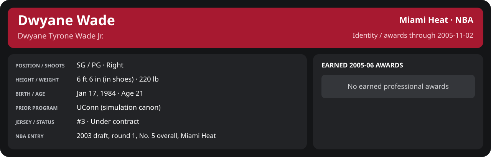

# November Week 1 Game 1

Player identity and statistics are generated here by `python scripts/update_player_reports.py`.
Decisions remain in the owning phase/week note. A scheduled game has no statistical result.

Miami's injured list for this game: Jumaine Jones, DeShawn Stevenson, Matt Carroll (`00_Team/Transactions/injured_list.json`; twelve dress).

<!-- game-result:start -->
## Result

**Miami Heat 92 at Memphis Grizzlies 103** · Miami Heat L 92-103 vs Memphis Grizzlies · away (Memphis Grizzlies) · 2005-11-02

Event `2005-11-02-miami-heat-at-memphis-grizzlies` · Railway engine (runtime/private_service.py) · result file [`Game_1.result.json`](Game_1.result.json) (the engine's answer as served; the note is the canonical record).

### Box score

```text
Miami Heat 92 at Memphis Grizzlies 103
2005-11-02  2005-06 regular  event 2005-11-02-miami-heat-at-memphis-grizzlies
Kernel 2003.11, calibrated on 2004-05 (imported_source)

Period      1    2    3    4     T
Miami He   17   21   23   31    92
Memphis    19   27   28   29   103

Miami Heat
                           MIN  PTS   FG      3P     FT    OR  DR AST STL BLK  TO  PF
Mike James                33.5    9   3-9    1-3    2-4     0   1   9   1   0   1   1
Dwyane Wade               33.0   26   8-16   2-2    8-10    0   1   3   0   1   3   2
Caron Butler              35.2   15   7-9    0-0    1-2     4   6   2   2   1   2   2
Mehmet Okur               34.3   11   4-10   0-0    3-4     4   5   2   1   1   2   5
Brian Grant               35.2   11   4-11   3-3    0-0     0   4   2   2   1   3   4
Donyell Marshall          18.7   14   5-8    2-5    2-2     1   5   0   1   1   2   1
Matt Harpring             15.3    5   2-6    0-0    1-1     5   0   1   0   0   1   0
Sebastian Telfair         13.4    1   0-5    0-2    1-4     1   0   0   3   0   2   1
Anthony Johnson            8.9    0   0-2    0-1    0-0     0   1   0   0   0   0   0
Mike Wilks                 6.9    0   0-1    0-0    0-0     0   0   1   0   1   1   1
Eddie Jones                5.7    0   0-0    0-0    0-0     0   0   1   0   1   0   2
TEAM                     240.0   92  33-77   8-16  18-27   15  23  21  10   7  17  19

Memphis Grizzlies
                           MIN  PTS   FG      3P     FT    OR  DR AST STL BLK  TO  PF
Pau Gasol                 38.2   20   8-21   0-0    4-4     5   7   5   1   1   5   2
Trenton Hassell           33.0    8   4-10   0-1    0-0     1   2   2   1   0   1   2
Mike Miller               32.3   21   8-14   4-5    1-2     0   5   3   1   1   1   5
Charlie Villanueva        28.7   17   8-12   1-1    0-1     4   2   2   1   1   1   3
Mark Blount               25.7   16   6-11   0-0    4-5     4   4   4   0   1   2   5
James Posey               28.1    8   3-6    2-4    0-0     0   3   2   0   0   2   3
Jason Williams            28.7    9   2-6    2-4    3-4     0   2   5   1   0   2   2
José Calderón             22.1    4   2-4    0-0    0-0     0   1   4   1   0   0   2
Dahntay Jones              3.2    0   0-0    0-0    0-0     0   0   0   0   0   0   0
TEAM                     240.0  103  41-84   9-15  12-16   14  26  27   6   4  16  24
  Includes 2 team turnover(s) not charged to an individual.
```

### Miami injuries

No Miami injury was drawn in this game.
<!-- game-result:end -->

<!-- player-report:start -->
## Professional identity



| Player | Age on report date | Team / league | Position | Number | Status |
| --- | --- | --- | --- | --- | --- |
| Dwyane Tyrone Wade Jr. | 21 | Miami Heat / NBA | SG / PG | 3 | Under contract |

| Identity field | Recorded value |
| --- | --- |
| Birth date | 1984-01-17 |
| NBA entry | 2003 draft, round 1, No. 5 overall, Miami Heat |
| Prior program | UConn (simulation canon) |
| Height, in shoes / without shoes | 6 ft 6 in / 6 ft 4.75 in |
| Weight | 220 lb |
| Wingspan / standing reach | 6 ft 11.5 in / 8 ft 7.5 in |
| Shooting hand | Right |
| Contract | Rookie scale signed 2003-07-21: three seasons plus a 2006-07 team option (2004-05: $2,361,800) |
| Role | Starting SG; staff plan 34 minutes |
| NBA debut | October 28, 2003 at Philadelphia 76ers (2003-04/06_Regular_Season/10_October/Week_4/Game_1.md) |
| Nationality | United States (born in the Chicago area; Robbins, Illinois home community, per the player profile) |
| National team | No selection recorded |
| National-team eligibility | United States (USA Basketball); no selection yet |
| Availability | No current restriction recorded in the established profile |
| Physical measurements recorded | 2003-06-25 |
| Professional status effective | 2005-10-26 |

Identity as of 2005-11-02; status snapshot dated 2005-10-26. User-established alternate-history player; historical Wade's biography and results are not this record.

### Earned 2005-06 awards

No 2005-06 awards yet.

## Statistics

As of **2005-11-02**: 1 closed games; 1/1 have player participation and box coverage; recorded DNPs: 0.

G counts appearances; GS counts recorded starts. DNPs, scheduled games and canceled games do not enter per-game denominators.

### Per game

[](../../../../Stats_and_Awards/player_cards.html?period=regular-2005-06-game-01479fcc17afd25b#shooting) [](../../../../Stats_and_Awards/player_cards.html#contract) [](../../../../Stats_and_Awards/player_cards.html#awards)

[Shooting detail](../../../../Stats_and_Awards/Shooting.md) · [Current contract](../../../../Stats_and_Awards/Contract.md#current-contract) · [Contract history](../../../../Stats_and_Awards/Contract.md#contract-history) · [Annual award record](../../../../Stats_and_Awards/Awards.md)

| Scope | Age | Team | Lg | Pos | G | GS | MP | FG | FGA | FG% | 3P | 3PA | 3P% | 2P | 2PA | 2P% | eFG% | FT | FTA | FT% | ORB | DRB | TRB | AST | STL | BLK | TOV | PF | PTS | TS% (est.) | Awards |
| --- | --- | --- | --- | --- | --- | --- | --- | --- | --- | --- | --- | --- | --- | --- | --- | --- | --- | --- | --- | --- | --- | --- | --- | --- | --- | --- | --- | --- | --- | --- | --- |
| This game | 21 | Miami Heat | NBA | SG / PG | 1 | 1 | 33.0 | 8.0 | 16.0 | .500 | 2.0 | 2.0 | 1.000 | 6.0 | 14.0 | .429 | .562 | 8.0 | 10.0 | .800 | 0.0 | 1.0 | 1.0 | 3.0 | 0.0 | 1.0 | 3.0 | 2.0 | 26.0 | .637 | — |

G and GS are counts; MP and counting statistics are **per appearance**. Shooting uses **.500 = 50.0%**. Age is at the row's cutoff. Scroll horizontally for every column.

Awards are confirmed through 2006-01-01, filed by the honor's period-end date; the banner shows career awards known at the page's identity cutoff.

### Production

| Metric | Total | Per appearance | Per 36 minutes |
| --- | --- | --- | --- |
| MIN | 33.0 | 33.0 | 36.0 |
| PTS | 26 | 26.0 | 28.4 |
| OREB | 0 | 0.0 | 0.0 |
| DREB | 1 | 1.0 | 1.1 |
| REB | 1 | 1.0 | 1.1 |
| AST | 3 | 3.0 | 3.3 |
| STL | 0 | 0.0 | 0.0 |
| BLK | 1 | 1.0 | 1.1 |
| TOV | 3 | 3.0 | 3.3 |
| PF | 2 | 2.0 | 2.2 |
| FGM | 8 | 8.0 | 8.7 |
| FGA | 16 | 16.0 | 17.5 |
| 2PM | 6 | 6.0 | 6.6 |
| 2PA | 14 | 14.0 | 15.3 |
| 3PM | 2 | 2.0 | 2.2 |
| 3PA | 2 | 2.0 | 2.2 |
| FTM | 8 | 8.0 | 8.7 |
| FTA | 10 | 10.0 | 10.9 |
| FT points | 8 | 8.0 | 8.7 |

Per-36 rates standardize playing time; they are not a projection of playing 36 minutes. Use the actual minutes denominator in every competition.

### Shooting

| Shot type | Makes | Attempts | Percentage |
| --- | --- | --- | --- |
| All field goals | 8 | 16 | 50.0% |
| Two-pointers | 6 | 14 | 42.9% |
| Three-pointers | 2 | 2 | 100.0% |
| Free throws | 8 | 10 | 80.0% |

### Efficiency and shot selection

| Metric | Value | Calculation / unit |
| --- | --- | --- |
| eFG% | 56.2% | (FGM + 0.5 × 3PM) / FGA |
| TS% (estimated) | 63.7% | PTS / [2 × (FGA + 0.44 × FTA)] |
| Three-point attempt share | 12.5% | 3PA / FGA |
| Free-throw attempt rate | 0.625 | FTA / FGA; ratio |
| Assist / turnover ratio | 1.00 | AST / TOV; N/A at zero turnovers |
| Plus/minus total | N/A | Observed on-court score differential only |
| Double-doubles | 0 | At least 10 in any two of PTS, REB, AST, STL, BLK |
| Triple-doubles | 0 | At least 10 in any three; also included in double-doubles |

Percentages use pooled makes and attempts. TS% uses an estimated free-throw weighting, not exact scoring possessions. Rounding is display-only.

### Splits

[](../../../../Stats_and_Awards/player_cards.html?period=regular-2005-06-week-2005-11-01#shooting) [](../../../../Stats_and_Awards/player_cards.html#contract) [](../../../../Stats_and_Awards/player_cards.html#awards)

[Shooting detail](../../../../Stats_and_Awards/Shooting.md) · [Current contract](../../../../Stats_and_Awards/Contract.md#current-contract) · [Contract history](../../../../Stats_and_Awards/Contract.md#contract-history) · [Annual award record](../../../../Stats_and_Awards/Awards.md)

| Scope | Age | Team | Lg | Pos | G | GS | MP | FG | FGA | FG% | 3P | 3PA | 3P% | 2P | 2PA | 2P% | eFG% | FT | FTA | FT% | ORB | DRB | TRB | AST | STL | BLK | TOV | PF | PTS | TS% (est.) | Awards |
| --- | --- | --- | --- | --- | --- | --- | --- | --- | --- | --- | --- | --- | --- | --- | --- | --- | --- | --- | --- | --- | --- | --- | --- | --- | --- | --- | --- | --- | --- | --- | --- |
| Home | 21 | Miami Heat | NBA | SG / PG | 0 | N/A | N/A | N/A | N/A | N/A | N/A | N/A | N/A | N/A | N/A | N/A | N/A | N/A | N/A | N/A | N/A | N/A | N/A | N/A | N/A | N/A | N/A | N/A | N/A | N/A | — |
| Away | 21 | Miami Heat | NBA | SG / PG | 1 | 1 | 33.0 | 8.0 | 16.0 | .500 | 2.0 | 2.0 | 1.000 | 6.0 | 14.0 | .429 | .562 | 8.0 | 10.0 | .800 | 0.0 | 1.0 | 1.0 | 3.0 | 0.0 | 1.0 | 3.0 | 2.0 | 26.0 | .637 | — |
| Neutral | 21 | Miami Heat | NBA | SG / PG | 0 | N/A | N/A | N/A | N/A | N/A | N/A | N/A | N/A | N/A | N/A | N/A | N/A | N/A | N/A | N/A | N/A | N/A | N/A | N/A | N/A | N/A | N/A | N/A | N/A | N/A | — |
| Wins | 21 | Miami Heat | NBA | SG / PG | 0 | N/A | N/A | N/A | N/A | N/A | N/A | N/A | N/A | N/A | N/A | N/A | N/A | N/A | N/A | N/A | N/A | N/A | N/A | N/A | N/A | N/A | N/A | N/A | N/A | N/A | — |
| Losses | 21 | Miami Heat | NBA | SG / PG | 1 | 1 | 33.0 | 8.0 | 16.0 | .500 | 2.0 | 2.0 | 1.000 | 6.0 | 14.0 | .429 | .562 | 8.0 | 10.0 | .800 | 0.0 | 1.0 | 1.0 | 3.0 | 0.0 | 1.0 | 3.0 | 2.0 | 26.0 | .637 | — |
| Team: Miami Heat | 21 | Miami Heat | NBA | SG / PG | 1 | 1 | 33.0 | 8.0 | 16.0 | .500 | 2.0 | 2.0 | 1.000 | 6.0 | 14.0 | .429 | .562 | 8.0 | 10.0 | .800 | 0.0 | 1.0 | 1.0 | 3.0 | 0.0 | 1.0 | 3.0 | 2.0 | 26.0 | .637 | — |

G and GS are counts; MP and counting statistics are **per appearance**. Shooting uses **.500 = 50.0%**. Age is at the row's cutoff. Scroll horizontally for every column.

Awards are confirmed through 2006-01-01, filed by the honor's period-end date; the banner shows career awards known at the page's identity cutoff.

Splits overlap and are not additive. Each row has its own appearance denominator; games with unknown result classification are excluded from win/loss splits.

### Game highs

| Metric | High | Date / opponent (all ties) |
| --- | --- | --- |
| PTS | 26 | [2005-11-02 at Memphis Grizzlies](Game_1.md) |
| REB | 1 | [2005-11-02 at Memphis Grizzlies](Game_1.md) |
| AST | 3 | [2005-11-02 at Memphis Grizzlies](Game_1.md) |
| STL | 0 | [2005-11-02 at Memphis Grizzlies](Game_1.md) |
| BLK | 1 | [2005-11-02 at Memphis Grizzlies](Game_1.md) |
| TOV | 3 | [2005-11-02 at Memphis Grizzlies](Game_1.md) |

### Game log

| Date / source | Opponent | Venue | Result | Participation | MIN | PTS | REB | AST | STL | BLK | TOV |
| --- | --- | --- | --- | --- | --- | --- | --- | --- | --- | --- | --- |
| [2005-11-02](Game_1.md) | Memphis Grizzlies | away | L 92-103 | Played | 33.0 | 26 | 1 | 3 | 0 | 1 | 3 |

### Game shooting detail

| Date / source | FG | 2P | 3P | FT | eFG% | TS% (est.) | +/- | PF |
| --- | --- | --- | --- | --- | --- | --- | --- | --- |
| [2005-11-02](Game_1.md) | 8/16 | 6/14 | 2/2 | 8/10 | 56.2% | 63.7% | N/A | 2 |

### Additional data needed

| Statistic family | Current support | Required evidence |
| --- | --- | --- |
| Starts; plus/minus | N/A unless supplied in the player box | Explicit started and plus_minus fields |
| Per 100 possessions; offensive / defensive / net rating | Unavailable in current box feed | Player on-court possessions and both teams' scoring during those possessions |
| USG%; AST%; OREB%, DREB%, REB% | Unavailable in current box feed | Matching player/team/opponent opportunity counts and a declared method |
| Rim, paint, midrange, corner / above-break threes | Unavailable in current box feed | Shot locations, attempts and makes |
| Drives, touches, catch-and-shoot, pull-ups, play types | Unavailable in current box feed | Tracking or tagged play-by-play |
| Clutch, on/off, lineup combinations, assisted baskets | Unavailable in current box feed | Timed events, score state, substitutions and possession attribution |
| Deflections, charges, contested shots, box outs | Unavailable in current box feed | Observed hustle/defensive events |
| League rank, percentile, relative TS%; impact models | Not derived by this report | Same-period simulated league baseline, eligibility rules and documented model |

<!-- player-report:end -->
