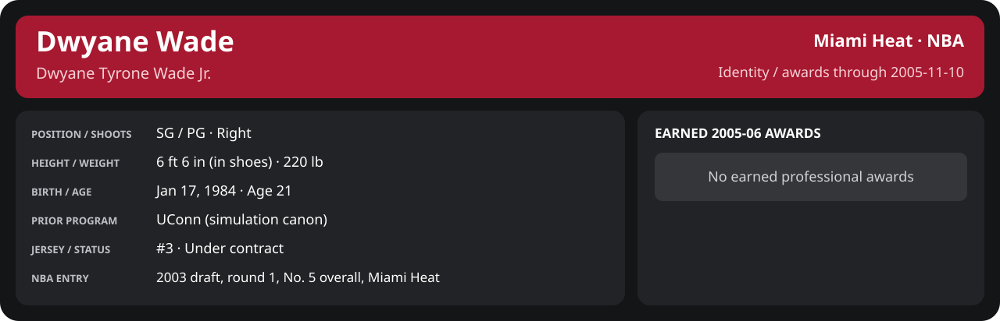

# November Week 2 Game 2

Player identity and statistics are generated here by `python scripts/update_player_reports.py`.
Decisions remain in the owning phase/week note. A scheduled game has no statistical result.

Miami's injured list for this game: DeShawn Stevenson, Matt Carroll, Eddie Jones (`00_Team/Transactions/injured_list.json`; twelve dress).

<!-- game-result:start -->
## Result

**Houston Rockets 83 at Miami Heat 103** · Miami Heat W 103-83 vs Houston Rockets · home (Miami Heat) · 2005-11-10

Event `2005-11-10-houston-rockets-at-miami-heat` · Railway engine (runtime/private_service.py) · result file [`Game_2.result.json`](Game_2.result.json) (the engine's answer as served; the note is the canonical record).

### Box score

```text
Houston Rockets 83 at Miami Heat 103
2005-11-10  2005-06 regular  event 2005-11-10-houston-rockets-at-miami-heat
Kernel 2003.11, calibrated on 2004-05 (imported_source)

Period      1    2    3    4     T
Houston    17   22   24   20    83
Miami He   33   28   22   20   103

Houston Rockets
                           MIN  PTS   FG      3P     FT    OR  DR AST STL BLK  TO  PF
Cuttino Mobley            43.3    8   3-14   0-3    2-2     0   2   1   1   1   0   0
Yao Ming                  28.7   11   3-8    0-0    5-8     5   8   1   0   1   1   5
Steve Francis             41.6   20   8-15   1-2    3-8     2   1   4   0   1   1   4
Bonzi Wells               37.9   18   7-16   1-3    3-3     2   9   1   2   0   3   3
Fred Jones                32.8   15   4-13   0-4    7-9     1   3   2   0   1   2   5
Eddie Griffin             23.1    4   2-7    0-0    0-0     1   2   1   1   1   0   4
Gerald Green              14.7    2   1-4    0-0    0-0     1   2   1   2   0   2   0
Esteban Batista            9.2    0   0-2    0-1    0-0     0   3   3   0   1   1   0
Nikoloz Tskitishvili       3.3    0   0-1    0-0    0-0     1   0   0   0   0   0   0
Jamal Sampson              3.2    3   1-3    0-0    1-2     1   1   1   0   0   0   0
Sharrod Ford               2.3    2   0-1    0-0    2-2     1   0   0   1   0   0   1
TEAM                     240.0   83  29-84   2-13  23-34   15  31  15   7   6  11  22
  Includes 1 team turnover(s) not charged to an individual.

Miami Heat
                           MIN  PTS   FG      3P     FT    OR  DR AST STL BLK  TO  PF
Mike James                34.2   18   6-17   3-6    3-4     1   2   4   2   0   0   5
Dwyane Wade               36.4   18   5-11   2-3    6-8     3   8   3   2   0   0   4
Caron Butler              34.0    8   3-9    0-0    2-2     0   7   0   1   1   1   1
Mehmet Okur               34.7   18   7-11   0-1    4-4     1   5   1   0   2   3   3
Brian Grant               34.8    6   1-7    0-2    4-4     1   5   6   0   0   5   4
Matt Harpring             18.8   10   3-4    0-0    4-6     3   1   0   1   0   0   3
Donyell Marshall          15.9   13   3-5    3-5    4-4     0   5   0   0   1   0   0
Sebastian Telfair         11.1    3   1-5    1-2    0-0     0   3   2   0   0   0   1
Anthony Johnson            9.3    5   2-3    0-1    1-2     0   1   1   1   0   1   2
Jumaine Jones              7.1    2   1-2    0-1    0-0     0   0   0   1   0   2   2
Mike Wilks                 3.8    2   1-1    0-0    0-0     0   0   1   0   0   0   1
TEAM                     240.0  103  33-75   9-21  28-34    9  37  18   8   4  13  26
  Includes 1 team turnover(s) not charged to an individual.
```

### Miami injuries

No Miami injury was drawn in this game.
<!-- game-result:end -->

<!-- player-report:start -->
## Professional identity



| Player | Age on report date | Team / league | Position | Number | Status |
| --- | --- | --- | --- | --- | --- |
| Dwyane Tyrone Wade Jr. | 21 | Miami Heat / NBA | SG / PG | 3 | Under contract |

| Identity field | Recorded value |
| --- | --- |
| Birth date | 1984-01-17 |
| NBA entry | 2003 draft, round 1, No. 5 overall, Miami Heat |
| Prior program | UConn (simulation canon) |
| Height, in shoes / without shoes | 6 ft 6 in / 6 ft 4.75 in |
| Weight | 220 lb |
| Wingspan / standing reach | 6 ft 11.5 in / 8 ft 7.5 in |
| Shooting hand | Right |
| Contract | Rookie scale signed 2003-07-21: three seasons plus a 2006-07 team option (2004-05: $2,361,800) |
| Role | Starting SG; staff plan 34 minutes |
| NBA debut | October 28, 2003 at Philadelphia 76ers (2003-04/06_Regular_Season/10_October/Week_4/Game_1.md) |
| Nationality | United States (born in the Chicago area; Robbins, Illinois home community, per the player profile) |
| National team | No selection recorded |
| National-team eligibility | United States (USA Basketball); no selection yet |
| Availability | No current restriction recorded in the established profile |
| Physical measurements recorded | 2003-06-25 |
| Professional status effective | 2005-10-26 |

Identity as of 2005-11-10; status snapshot dated 2005-10-26. User-established alternate-history player; historical Wade's biography and results are not this record.

### Earned 2005-06 awards

No 2005-06 awards yet.

## Statistics

As of **2005-11-10**: 1 closed games; 1/1 have player participation and box coverage; recorded DNPs: 0.

G counts appearances; GS counts recorded starts. DNPs, scheduled games and canceled games do not enter per-game denominators.

### Per game

[](../../../../Stats_and_Awards/player_cards.html?period=regular-2005-06-game-a5b7692316e29f28#shooting) [](../../../../Stats_and_Awards/player_cards.html#contract) [](../../../../Stats_and_Awards/player_cards.html#awards)

[Shooting detail](../../../../Stats_and_Awards/Shooting.md) · [Current contract](../../../../Stats_and_Awards/Contract.md#current-contract) · [Contract history](../../../../Stats_and_Awards/Contract.md#contract-history) · [Annual award record](../../../../Stats_and_Awards/Awards.md)

| Scope | Age | Team | Lg | Pos | G | GS | MP | FG | FGA | FG% | 3P | 3PA | 3P% | 2P | 2PA | 2P% | eFG% | FT | FTA | FT% | ORB | DRB | TRB | AST | STL | BLK | TOV | PF | PTS | TS% (est.) | Awards |
| --- | --- | --- | --- | --- | --- | --- | --- | --- | --- | --- | --- | --- | --- | --- | --- | --- | --- | --- | --- | --- | --- | --- | --- | --- | --- | --- | --- | --- | --- | --- | --- |
| This game | 21 | Miami Heat | NBA | SG / PG | 1 | 1 | 36.4 | 5.0 | 11.0 | .455 | 2.0 | 3.0 | .667 | 3.0 | 8.0 | .375 | .545 | 6.0 | 8.0 | .750 | 3.0 | 8.0 | 11.0 | 3.0 | 2.0 | 0.0 | 0.0 | 4.0 | 18.0 | .620 | — |

G and GS are counts; MP and counting statistics are **per appearance**. Shooting uses **.500 = 50.0%**. Age is at the row's cutoff. Scroll horizontally for every column.

Awards are confirmed through 2006-01-16, filed by the honor's period-end date; the banner shows career awards known at the page's identity cutoff.

### Production

| Metric | Total | Per appearance | Per 36 minutes |
| --- | --- | --- | --- |
| MIN | 36.4 | 36.4 | 36.0 |
| PTS | 18 | 18.0 | 17.8 |
| OREB | 3 | 3.0 | 3.0 |
| DREB | 8 | 8.0 | 7.9 |
| REB | 11 | 11.0 | 10.9 |
| AST | 3 | 3.0 | 3.0 |
| STL | 2 | 2.0 | 2.0 |
| BLK | 0 | 0.0 | 0.0 |
| TOV | 0 | 0.0 | 0.0 |
| PF | 4 | 4.0 | 4.0 |
| FGM | 5 | 5.0 | 5.0 |
| FGA | 11 | 11.0 | 10.9 |
| 2PM | 3 | 3.0 | 3.0 |
| 2PA | 8 | 8.0 | 7.9 |
| 3PM | 2 | 2.0 | 2.0 |
| 3PA | 3 | 3.0 | 3.0 |
| FTM | 6 | 6.0 | 5.9 |
| FTA | 8 | 8.0 | 7.9 |
| FT points | 6 | 6.0 | 5.9 |

Per-36 rates standardize playing time; they are not a projection of playing 36 minutes. Use the actual minutes denominator in every competition.

### Shooting

| Shot type | Makes | Attempts | Percentage |
| --- | --- | --- | --- |
| All field goals | 5 | 11 | 45.5% |
| Two-pointers | 3 | 8 | 37.5% |
| Three-pointers | 2 | 3 | 66.7% |
| Free throws | 6 | 8 | 75.0% |

### Efficiency and shot selection

| Metric | Value | Calculation / unit |
| --- | --- | --- |
| eFG% | 54.5% | (FGM + 0.5 × 3PM) / FGA |
| TS% (estimated) | 62.0% | PTS / [2 × (FGA + 0.44 × FTA)] |
| Three-point attempt share | 27.3% | 3PA / FGA |
| Free-throw attempt rate | 0.727 | FTA / FGA; ratio |
| Assist / turnover ratio | N/A | AST / TOV; N/A at zero turnovers |
| Plus/minus total | N/A | Observed on-court score differential only |
| Double-doubles | 1 | At least 10 in any two of PTS, REB, AST, STL, BLK |
| Triple-doubles | 0 | At least 10 in any three; also included in double-doubles |

Percentages use pooled makes and attempts. TS% uses an estimated free-throw weighting, not exact scoring possessions. Rounding is display-only.

### Splits

[](../../../../Stats_and_Awards/player_cards.html?period=regular-2005-06-game-a5b7692316e29f28#shooting) [](../../../../Stats_and_Awards/player_cards.html#contract) [](../../../../Stats_and_Awards/player_cards.html#awards)

[Shooting detail](../../../../Stats_and_Awards/Shooting.md) · [Current contract](../../../../Stats_and_Awards/Contract.md#current-contract) · [Contract history](../../../../Stats_and_Awards/Contract.md#contract-history) · [Annual award record](../../../../Stats_and_Awards/Awards.md)

| Scope | Age | Team | Lg | Pos | G | GS | MP | FG | FGA | FG% | 3P | 3PA | 3P% | 2P | 2PA | 2P% | eFG% | FT | FTA | FT% | ORB | DRB | TRB | AST | STL | BLK | TOV | PF | PTS | TS% (est.) | Awards |
| --- | --- | --- | --- | --- | --- | --- | --- | --- | --- | --- | --- | --- | --- | --- | --- | --- | --- | --- | --- | --- | --- | --- | --- | --- | --- | --- | --- | --- | --- | --- | --- |
| Home | 21 | Miami Heat | NBA | SG / PG | 1 | 1 | 36.4 | 5.0 | 11.0 | .455 | 2.0 | 3.0 | .667 | 3.0 | 8.0 | .375 | .545 | 6.0 | 8.0 | .750 | 3.0 | 8.0 | 11.0 | 3.0 | 2.0 | 0.0 | 0.0 | 4.0 | 18.0 | .620 | — |
| Away | 21 | Miami Heat | NBA | SG / PG | 0 | N/A | N/A | N/A | N/A | N/A | N/A | N/A | N/A | N/A | N/A | N/A | N/A | N/A | N/A | N/A | N/A | N/A | N/A | N/A | N/A | N/A | N/A | N/A | N/A | N/A | — |
| Neutral | 21 | Miami Heat | NBA | SG / PG | 0 | N/A | N/A | N/A | N/A | N/A | N/A | N/A | N/A | N/A | N/A | N/A | N/A | N/A | N/A | N/A | N/A | N/A | N/A | N/A | N/A | N/A | N/A | N/A | N/A | N/A | — |
| Wins | 21 | Miami Heat | NBA | SG / PG | 1 | 1 | 36.4 | 5.0 | 11.0 | .455 | 2.0 | 3.0 | .667 | 3.0 | 8.0 | .375 | .545 | 6.0 | 8.0 | .750 | 3.0 | 8.0 | 11.0 | 3.0 | 2.0 | 0.0 | 0.0 | 4.0 | 18.0 | .620 | — |
| Losses | 21 | Miami Heat | NBA | SG / PG | 0 | N/A | N/A | N/A | N/A | N/A | N/A | N/A | N/A | N/A | N/A | N/A | N/A | N/A | N/A | N/A | N/A | N/A | N/A | N/A | N/A | N/A | N/A | N/A | N/A | N/A | — |
| Team: Miami Heat | 21 | Miami Heat | NBA | SG / PG | 1 | 1 | 36.4 | 5.0 | 11.0 | .455 | 2.0 | 3.0 | .667 | 3.0 | 8.0 | .375 | .545 | 6.0 | 8.0 | .750 | 3.0 | 8.0 | 11.0 | 3.0 | 2.0 | 0.0 | 0.0 | 4.0 | 18.0 | .620 | — |

G and GS are counts; MP and counting statistics are **per appearance**. Shooting uses **.500 = 50.0%**. Age is at the row's cutoff. Scroll horizontally for every column.

Awards are confirmed through 2006-01-16, filed by the honor's period-end date; the banner shows career awards known at the page's identity cutoff.

Splits overlap and are not additive. Each row has its own appearance denominator; games with unknown result classification are excluded from win/loss splits.

### Game highs

| Metric | High | Date / opponent (all ties) |
| --- | --- | --- |
| PTS | 18 | [2005-11-10 vs Houston Rockets](Game_2.md) |
| REB | 11 | [2005-11-10 vs Houston Rockets](Game_2.md) |
| AST | 3 | [2005-11-10 vs Houston Rockets](Game_2.md) |
| STL | 2 | [2005-11-10 vs Houston Rockets](Game_2.md) |
| BLK | 0 | [2005-11-10 vs Houston Rockets](Game_2.md) |
| TOV | 0 | [2005-11-10 vs Houston Rockets](Game_2.md) |

### Game log

| Date / source | Opponent | Venue | Result | Participation | MIN | PTS | REB | AST | STL | BLK | TOV |
| --- | --- | --- | --- | --- | --- | --- | --- | --- | --- | --- | --- |
| [2005-11-10](Game_2.md) | Houston Rockets | home | W 103-83 | Played | 36.4 | 18 | 11 | 3 | 2 | 0 | 0 |

### Game shooting detail

| Date / source | FG | 2P | 3P | FT | eFG% | TS% (est.) | +/- | PF |
| --- | --- | --- | --- | --- | --- | --- | --- | --- |
| [2005-11-10](Game_2.md) | 5/11 | 3/8 | 2/3 | 6/8 | 54.5% | 62.0% | N/A | 4 |

### Additional data needed

| Statistic family | Current support | Required evidence |
| --- | --- | --- |
| Starts; plus/minus | N/A unless supplied in the player box | Explicit started and plus_minus fields |
| Per 100 possessions; offensive / defensive / net rating | Unavailable in current box feed | Player on-court possessions and both teams' scoring during those possessions |
| USG%; AST%; OREB%, DREB%, REB% | Unavailable in current box feed | Matching player/team/opponent opportunity counts and a declared method |
| Rim, paint, midrange, corner / above-break threes | Unavailable in current box feed | Shot locations, attempts and makes |
| Drives, touches, catch-and-shoot, pull-ups, play types | Unavailable in current box feed | Tracking or tagged play-by-play |
| Clutch, on/off, lineup combinations, assisted baskets | Unavailable in current box feed | Timed events, score state, substitutions and possession attribution |
| Deflections, charges, contested shots, box outs | Unavailable in current box feed | Observed hustle/defensive events |
| League rank, percentile, relative TS%; impact models | Not derived by this report | Same-period simulated league baseline, eligibility rules and documented model |

<!-- player-report:end -->
