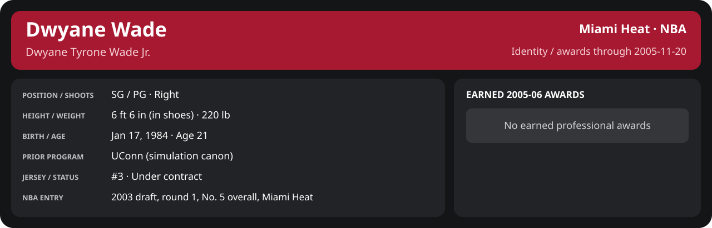

# November Week 3 Game 3

Player identity and statistics are generated here by `python scripts/update_player_reports.py`.
Decisions remain in the owning phase/week note. A scheduled game has no statistical result.

Miami's injured list for this game: DeShawn Stevenson, Matt Carroll, Eddie Jones (`00_Team/Transactions/injured_list.json`; twelve dress).

<!-- game-result:start -->
## Result

**Miami Heat 94 at Toronto Raptors 81** · Miami Heat W 94-81 vs Toronto Raptors · away (Toronto Raptors) · 2005-11-20

Event `2005-11-20-miami-heat-at-toronto-raptors` · Railway engine (runtime/private_service.py) · result file [`Game_3.result.json`](Game_3.result.json) (the engine's answer as served; the note is the canonical record).

### Box score

```text
Miami Heat 94 at Toronto Raptors 81
2005-11-20  2005-06 regular  event 2005-11-20-miami-heat-at-toronto-raptors
Kernel 2003.11, calibrated on 2004-05 (imported_source)

Period      1    2    3    4     T
Miami He   23   22   30   19    94
Toronto    12   23   18   28    81

Miami Heat
                           MIN  PTS   FG      3P     FT    OR  DR AST STL BLK  TO  PF
Mike James                34.4    9   2-9    0-2    5-6     0   2   7   0   0   1   1
Dwyane Wade               39.8   40  13-15   2-2   12-12    2   4   5   2   1   2   2
Caron Butler              34.4   10   4-13   0-3    2-2     2   6   2   1   1   2   2
Mehmet Okur               34.3   10   4-15   0-2    2-2     5   6   1   0   1   2   2
Brian Grant               33.9    6   1-6    0-1    4-4     2   4   0   0   1   1   5
Matt Harpring             17.5    6   3-3    0-0    0-0     0   5   2   0   0   1   0
Donyell Marshall          13.7    7   3-5    1-2    0-0     0   1   1   0   0   0   2
Sebastian Telfair         11.6    0   0-4    0-0    0-0     0   0   0   0   0   1   1
Anthony Johnson            9.6    4   2-4    0-2    0-0     0   2   3   0   0   1   0
Jumaine Jones              6.7    0   0-1    0-1    0-0     0   0   1   1   0   0   0
Mike Wilks                 4.2    2   1-2    0-0    0-0     1   1   0   0   0   0   0
TEAM                     240.0   94  33-77   3-15  25-26   12  31  22   4   4  13  15
  Includes 2 team turnover(s) not charged to an individual.

Toronto Raptors
                           MIN  PTS   FG      3P     FT    OR  DR AST STL BLK  TO  PF
Morris Peterson           37.2   11   5-13   1-5    0-0     1   5   1   1   1   2   1
Vince Carter              38.1   15   4-20   1-8    6-6     2   5   5   2   1   2   4
Hedo Türkoğlu             35.1   10   4-8    0-1    2-2     2   1   4   0   0   5   3
Primož Brezec             28.4   11   5-12   0-0    1-1     2   3   2   0   1   2   2
Matt Bonner               21.6    8   3-6    0-2    2-2     0   2   0   0   1   1   5
Udonis Haslem             18.7   10   5-10   0-0    0-0     1   3   1   0   0   0   0
simiewa01                 18.6    6   3-5    0-1    0-0     0   3   2   1   0   1   3
DeSagana Diop             17.7    2   1-3    0-0    0-1     4   4   1   1   0   1   2
Al Jefferson              12.7    4   1-2    0-1    2-2     1   3   0   0   0   1   1
Scott Padgett              8.5    4   1-4    1-1    1-1     0   3   0   0   0   0   1
Jerome James               3.3    0   0-0    0-0    0-0     0   0   0   0   0   0   0
TEAM                     240.0   81  32-83   3-19  14-15   13  32  16   5   4  16  22
  Includes 1 team turnover(s) not charged to an individual.
```

### Miami injuries

No Miami injury was drawn in this game.
<!-- game-result:end -->

<!-- player-report:start -->
## Professional identity



| Player | Age on report date | Team / league | Position | Number | Status |
| --- | --- | --- | --- | --- | --- |
| Dwyane Tyrone Wade Jr. | 21 | Miami Heat / NBA | SG / PG | 3 | Under contract |

| Identity field | Recorded value |
| --- | --- |
| Birth date | 1984-01-17 |
| NBA entry | 2003 draft, round 1, No. 5 overall, Miami Heat |
| Prior program | UConn (simulation canon) |
| Height, in shoes / without shoes | 6 ft 6 in / 6 ft 4.75 in |
| Weight | 220 lb |
| Wingspan / standing reach | 6 ft 11.5 in / 8 ft 7.5 in |
| Shooting hand | Right |
| Contract | Rookie scale signed 2003-07-21: three seasons plus a 2006-07 team option (2004-05: $2,361,800) |
| Role | Starting SG; staff plan 34 minutes |
| NBA debut | October 28, 2003 at Philadelphia 76ers (2003-04/06_Regular_Season/10_October/Week_4/Game_1.md) |
| Nationality | United States (born in the Chicago area; Robbins, Illinois home community, per the player profile) |
| National team | No selection recorded |
| National-team eligibility | United States (USA Basketball); no selection yet |
| Availability | No current restriction recorded in the established profile |
| Physical measurements recorded | 2003-06-25 |
| Professional status effective | 2005-10-26 |

Identity as of 2005-11-20; status snapshot dated 2005-10-26. User-established alternate-history player; historical Wade's biography and results are not this record.

### Earned 2005-06 awards

| Award | Period | Announced | Decision record |
| --- | --- | --- | --- |
| Eastern Conference Player of the Week | 2005-11-07 to 2005-11-13 | 2005-11-14 | [East POW](../../../../Stats_and_Awards/League/2005-06/11_November/Week_2/League_Awards.md#player-of-the-week) |

## Statistics

As of **2005-11-20**: 1 closed games; 1/1 have player participation and box coverage; recorded DNPs: 0.

G counts appearances; GS counts recorded starts. DNPs, scheduled games and canceled games do not enter per-game denominators.

### Per game

[](../../../../Stats_and_Awards/player_cards.html?period=regular-2005-06-game-bd68300500c52649#shooting) [](../../../../Stats_and_Awards/player_cards.html#contract) [](../../../../Stats_and_Awards/player_cards.html#awards)

[Shooting detail](../../../../Stats_and_Awards/Shooting.md) · [Current contract](../../../../Stats_and_Awards/Contract.md#current-contract) · [Contract history](../../../../Stats_and_Awards/Contract.md#contract-history) · [Annual award record](../../../../Stats_and_Awards/Awards.md)

| Scope | Age | Team | Lg | Pos | G | GS | MP | FG | FGA | FG% | 3P | 3PA | 3P% | 2P | 2PA | 2P% | eFG% | FT | FTA | FT% | ORB | DRB | TRB | AST | STL | BLK | TOV | PF | PTS | TS% (est.) | Awards |
| --- | --- | --- | --- | --- | --- | --- | --- | --- | --- | --- | --- | --- | --- | --- | --- | --- | --- | --- | --- | --- | --- | --- | --- | --- | --- | --- | --- | --- | --- | --- | --- |
| This game | 21 | Miami Heat | NBA | SG / PG | 1 | 1 | 39.8 | 13.0 | 15.0 | .867 | 2.0 | 2.0 | 1.000 | 11.0 | 13.0 | .846 | .933 | 12.0 | 12.0 | 1.000 | 2.0 | 4.0 | 6.0 | 5.0 | 2.0 | 1.0 | 2.0 | 2.0 | 40.0 | .986 | — |

G and GS are counts; MP and counting statistics are **per appearance**. Shooting uses **.500 = 50.0%**. Age is at the row's cutoff. Scroll horizontally for every column.

Awards are confirmed through 2006-01-29, filed by the honor's period-end date; the banner shows career awards known at the page's identity cutoff.

### Production

| Metric | Total | Per appearance | Per 36 minutes |
| --- | --- | --- | --- |
| MIN | 39.8 | 39.8 | 36.0 |
| PTS | 40 | 40.0 | 36.2 |
| OREB | 2 | 2.0 | 1.8 |
| DREB | 4 | 4.0 | 3.6 |
| REB | 6 | 6.0 | 5.4 |
| AST | 5 | 5.0 | 4.5 |
| STL | 2 | 2.0 | 1.8 |
| BLK | 1 | 1.0 | 0.9 |
| TOV | 2 | 2.0 | 1.8 |
| PF | 2 | 2.0 | 1.8 |
| FGM | 13 | 13.0 | 11.8 |
| FGA | 15 | 15.0 | 13.6 |
| 2PM | 11 | 11.0 | 9.9 |
| 2PA | 13 | 13.0 | 11.8 |
| 3PM | 2 | 2.0 | 1.8 |
| 3PA | 2 | 2.0 | 1.8 |
| FTM | 12 | 12.0 | 10.8 |
| FTA | 12 | 12.0 | 10.8 |
| FT points | 12 | 12.0 | 10.8 |

Per-36 rates standardize playing time; they are not a projection of playing 36 minutes. Use the actual minutes denominator in every competition.

### Shooting

| Shot type | Makes | Attempts | Percentage |
| --- | --- | --- | --- |
| All field goals | 13 | 15 | 86.7% |
| Two-pointers | 11 | 13 | 84.6% |
| Three-pointers | 2 | 2 | 100.0% |
| Free throws | 12 | 12 | 100.0% |

### Efficiency and shot selection

| Metric | Value | Calculation / unit |
| --- | --- | --- |
| eFG% | 93.3% | (FGM + 0.5 × 3PM) / FGA |
| TS% (estimated) | 98.6% | PTS / [2 × (FGA + 0.44 × FTA)] |
| Three-point attempt share | 13.3% | 3PA / FGA |
| Free-throw attempt rate | 0.800 | FTA / FGA; ratio |
| Assist / turnover ratio | 2.50 | AST / TOV; N/A at zero turnovers |
| Plus/minus total | N/A | Observed on-court score differential only |
| Double-doubles | 0 | At least 10 in any two of PTS, REB, AST, STL, BLK |
| Triple-doubles | 0 | At least 10 in any three; also included in double-doubles |

Percentages use pooled makes and attempts. TS% uses an estimated free-throw weighting, not exact scoring possessions. Rounding is display-only.

### Splits

[](../../../../Stats_and_Awards/player_cards.html?period=regular-2005-06-week-2005-11-15#shooting) [](../../../../Stats_and_Awards/player_cards.html#contract) [](../../../../Stats_and_Awards/player_cards.html#awards)

[Shooting detail](../../../../Stats_and_Awards/Shooting.md) · [Current contract](../../../../Stats_and_Awards/Contract.md#current-contract) · [Contract history](../../../../Stats_and_Awards/Contract.md#contract-history) · [Annual award record](../../../../Stats_and_Awards/Awards.md)

| Scope | Age | Team | Lg | Pos | G | GS | MP | FG | FGA | FG% | 3P | 3PA | 3P% | 2P | 2PA | 2P% | eFG% | FT | FTA | FT% | ORB | DRB | TRB | AST | STL | BLK | TOV | PF | PTS | TS% (est.) | Awards |
| --- | --- | --- | --- | --- | --- | --- | --- | --- | --- | --- | --- | --- | --- | --- | --- | --- | --- | --- | --- | --- | --- | --- | --- | --- | --- | --- | --- | --- | --- | --- | --- |
| Home | 21 | Miami Heat | NBA | SG / PG | 0 | N/A | N/A | N/A | N/A | N/A | N/A | N/A | N/A | N/A | N/A | N/A | N/A | N/A | N/A | N/A | N/A | N/A | N/A | N/A | N/A | N/A | N/A | N/A | N/A | N/A | — |
| Away | 21 | Miami Heat | NBA | SG / PG | 1 | 1 | 39.8 | 13.0 | 15.0 | .867 | 2.0 | 2.0 | 1.000 | 11.0 | 13.0 | .846 | .933 | 12.0 | 12.0 | 1.000 | 2.0 | 4.0 | 6.0 | 5.0 | 2.0 | 1.0 | 2.0 | 2.0 | 40.0 | .986 | — |
| Neutral | 21 | Miami Heat | NBA | SG / PG | 0 | N/A | N/A | N/A | N/A | N/A | N/A | N/A | N/A | N/A | N/A | N/A | N/A | N/A | N/A | N/A | N/A | N/A | N/A | N/A | N/A | N/A | N/A | N/A | N/A | N/A | — |
| Wins | 21 | Miami Heat | NBA | SG / PG | 1 | 1 | 39.8 | 13.0 | 15.0 | .867 | 2.0 | 2.0 | 1.000 | 11.0 | 13.0 | .846 | .933 | 12.0 | 12.0 | 1.000 | 2.0 | 4.0 | 6.0 | 5.0 | 2.0 | 1.0 | 2.0 | 2.0 | 40.0 | .986 | — |
| Losses | 21 | Miami Heat | NBA | SG / PG | 0 | N/A | N/A | N/A | N/A | N/A | N/A | N/A | N/A | N/A | N/A | N/A | N/A | N/A | N/A | N/A | N/A | N/A | N/A | N/A | N/A | N/A | N/A | N/A | N/A | N/A | — |
| Team: Miami Heat | 21 | Miami Heat | NBA | SG / PG | 1 | 1 | 39.8 | 13.0 | 15.0 | .867 | 2.0 | 2.0 | 1.000 | 11.0 | 13.0 | .846 | .933 | 12.0 | 12.0 | 1.000 | 2.0 | 4.0 | 6.0 | 5.0 | 2.0 | 1.0 | 2.0 | 2.0 | 40.0 | .986 | — |

G and GS are counts; MP and counting statistics are **per appearance**. Shooting uses **.500 = 50.0%**. Age is at the row's cutoff. Scroll horizontally for every column.

Awards are confirmed through 2006-01-29, filed by the honor's period-end date; the banner shows career awards known at the page's identity cutoff.

Splits overlap and are not additive. Each row has its own appearance denominator; games with unknown result classification are excluded from win/loss splits.

### Game highs

| Metric | High | Date / opponent (all ties) |
| --- | --- | --- |
| PTS | 40 | [2005-11-20 at Toronto Raptors](Game_3.md) |
| REB | 6 | [2005-11-20 at Toronto Raptors](Game_3.md) |
| AST | 5 | [2005-11-20 at Toronto Raptors](Game_3.md) |
| STL | 2 | [2005-11-20 at Toronto Raptors](Game_3.md) |
| BLK | 1 | [2005-11-20 at Toronto Raptors](Game_3.md) |
| TOV | 2 | [2005-11-20 at Toronto Raptors](Game_3.md) |

### Game log

| Date / source | Opponent | Venue | Result | Participation | MIN | PTS | REB | AST | STL | BLK | TOV |
| --- | --- | --- | --- | --- | --- | --- | --- | --- | --- | --- | --- |
| [2005-11-20](Game_3.md) | Toronto Raptors | away | W 94-81 | Played | 39.8 | 40 | 6 | 5 | 2 | 1 | 2 |

### Game shooting detail

| Date / source | FG | 2P | 3P | FT | eFG% | TS% (est.) | +/- | PF |
| --- | --- | --- | --- | --- | --- | --- | --- | --- |
| [2005-11-20](Game_3.md) | 13/15 | 11/13 | 2/2 | 12/12 | 93.3% | 98.6% | N/A | 2 |

### Additional data needed

| Statistic family | Current support | Required evidence |
| --- | --- | --- |
| Starts; plus/minus | N/A unless supplied in the player box | Explicit started and plus_minus fields |
| Per 100 possessions; offensive / defensive / net rating | Unavailable in current box feed | Player on-court possessions and both teams' scoring during those possessions |
| USG%; AST%; OREB%, DREB%, REB% | Unavailable in current box feed | Matching player/team/opponent opportunity counts and a declared method |
| Rim, paint, midrange, corner / above-break threes | Unavailable in current box feed | Shot locations, attempts and makes |
| Drives, touches, catch-and-shoot, pull-ups, play types | Unavailable in current box feed | Tracking or tagged play-by-play |
| Clutch, on/off, lineup combinations, assisted baskets | Unavailable in current box feed | Timed events, score state, substitutions and possession attribution |
| Deflections, charges, contested shots, box outs | Unavailable in current box feed | Observed hustle/defensive events |
| League rank, percentile, relative TS%; impact models | Not derived by this report | Same-period simulated league baseline, eligibility rules and documented model |

<!-- player-report:end -->
