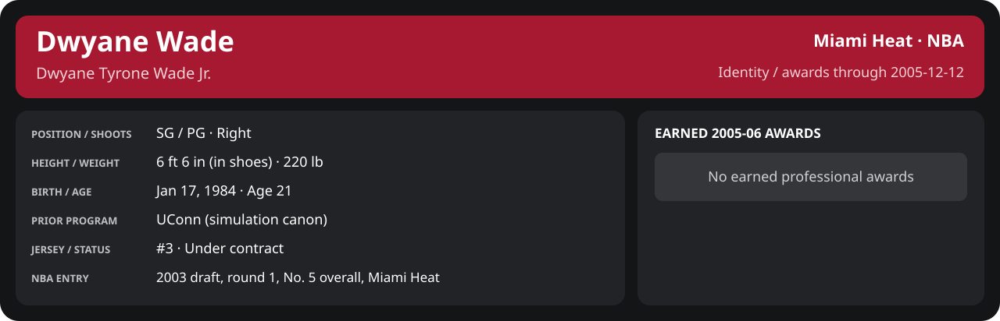

<!-- Generated by scripts/update_player_reports.py; edit source records, then rebuild. -->

# December 2005 | NBA regular season

[Career](../../../README.md) · [Professional identity](../../../Professional_Identity.md) · [Earned awards](../../../Awards.md) · [Stat definitions](../../../../../docs/player_statistics.md) · [Season](../../../Stats_and_Awards/2005-06/README.md) · [Miami](../../../Stats_and_Awards/Team/2005-06/12_December/Team_Stats.md) · [NBA players](../../../Stats_and_Awards/League/2005-06/12_December/League_Stats.md) · [NBA awards](../../../Stats_and_Awards/League/2005-06/12_December/League_Awards.md)

## Professional identity

| Player | Age on report date | Team / league | Position | Number | Status |
| --- | --- | --- | --- | --- | --- |
| Dwyane Tyrone Wade Jr. | 21 | Miami Heat / NBA | SG / PG | 3 | Under contract |

| Identity field | Recorded value |
| --- | --- |
| Birth date | 1984-01-17 |
| NBA entry | 2003 draft, round 1, No. 5 overall, Miami Heat |
| Prior program | UConn (simulation canon) |
| Height, in shoes / without shoes | 6 ft 6 in / 6 ft 4.75 in |
| Weight | 220 lb |
| Wingspan / standing reach | 6 ft 11.5 in / 8 ft 7.5 in |
| Shooting hand | Right |
| Contract | Rookie scale signed 2003-07-21: three seasons plus a 2006-07 team option (2004-05: $2,361,800) |
| Role | Starting SG; staff plan 34 minutes |
| NBA debut | October 28, 2003 at Philadelphia 76ers (2003-04/06_Regular_Season/10_October/Week_4/Game_1.md) |
| Nationality | United States (born in the Chicago area; Robbins, Illinois home community, per the player profile) |
| National team | No selection recorded |
| National-team eligibility | United States (USA Basketball); no selection yet |
| Availability | No current restriction recorded in the established profile |
| Physical measurements recorded | 2003-06-25 |
| Professional status effective | 2005-10-26 |

Identity as of 2005-12-12; status snapshot dated 2005-10-26. User-established alternate-history player; historical Wade's biography and results are not this record.

### Earned 2005-06 awards

| Award | Period | Announced | Decision record |
| --- | --- | --- | --- |
| Eastern Conference Player of the Week | 2005-11-07 to 2005-11-13 | 2005-11-14 | [East POW](../../../Stats_and_Awards/League/2005-06/11_November/Week_2/League_Awards.md#player-of-the-week) |
| Eastern Conference Player of the Week | 2005-11-14 to 2005-11-20 | 2005-11-21 | [East POW](../../../Stats_and_Awards/League/2005-06/11_November/Week_3/League_Awards.md#player-of-the-week) |
| Eastern Conference Player of the Month | 2005-11-01 to 2005-11-30 | 2005-12-02 | [East POM](../../../Stats_and_Awards/League/2005-06/11_November/League_Awards.md#player-of-the-month) |
| Eastern Conference Player of the Week | 2005-11-28 to 2005-12-04 | 2005-12-05 | [East POW](../../../Stats_and_Awards/League/2005-06/12_December/Week_1/League_Awards.md#player-of-the-week) |
| Eastern Conference Player of the Week | 2005-12-05 to 2005-12-11 | 2005-12-12 | [East POW](../../../Stats_and_Awards/League/2005-06/12_December/Week_2/League_Awards.md#player-of-the-week) |

## Statistics

As of **2005-12-12**: 6 closed games; 6/6 have player participation and box coverage; recorded DNPs: 0.

G counts appearances; GS counts recorded starts. DNPs, scheduled games and canceled games do not enter per-game denominators.

### Per game

  

[Shooting detail](../../../Stats_and_Awards/Shooting.md) · [Current contract](../../../Stats_and_Awards/Contract.md#current-contract) · [Contract history](../../../Stats_and_Awards/Contract.md#contract-history) · [Annual award record](../../../Stats_and_Awards/Awards.md)

| Scope | Age | Team | Lg | Pos | G | GS | MP | FG | FGA | FG% | 3P | 3PA | 3P% | 2P | 2PA | 2P% | eFG% | FT | FTA | FT% | ORB | DRB | TRB | AST | STL | BLK | TOV | PF | PTS | TS% (est.) | Awards |
| --- | --- | --- | --- | --- | --- | --- | --- | --- | --- | --- | --- | --- | --- | --- | --- | --- | --- | --- | --- | --- | --- | --- | --- | --- | --- | --- | --- | --- | --- | --- | --- |
| This scope | 21 | Miami Heat | NBA | SG / PG | 6 | 6 | 36.6 | 8.3 | 16.2 | .515 | 1.3 | 3.5 | .381 | 7.0 | 12.7 | .553 | .557 | 7.7 | 8.0 | .958 | 2.7 | 4.2 | 6.8 | 4.3 | 1.8 | 1.0 | 1.8 | 3.3 | 25.7 | .652 | [East POW](../../../Stats_and_Awards/League/2005-06/12_December/Week_1/League_Awards.md#player-of-the-week), [East POW](../../../Stats_and_Awards/League/2005-06/12_December/Week_2/League_Awards.md#player-of-the-week) |

G and GS are counts; MP and counting statistics are **per appearance**. Shooting uses **.500 = 50.0%**. Age is at the row's cutoff. Scroll horizontally for every column.

Awards are confirmed through 2005-12-12, filed by the honor's period-end date; the banner shows career awards known at the page's identity cutoff.

[Full statistical detail: totals, per 36, shooting, efficiency, splits and source games](../../../Stats_and_Awards/2005-06/12_December/Stat_Detail.md)

### Period summary

  

[Shooting detail](../../../Stats_and_Awards/Shooting.md) · [Current contract](../../../Stats_and_Awards/Contract.md#current-contract) · [Contract history](../../../Stats_and_Awards/Contract.md#contract-history) · [Annual award record](../../../Stats_and_Awards/Awards.md)

| Scope | Age | Team | Lg | Pos | G | GS | MP | FG | FGA | FG% | 3P | 3PA | 3P% | 2P | 2PA | 2P% | eFG% | FT | FTA | FT% | ORB | DRB | TRB | AST | STL | BLK | TOV | PF | PTS | TS% (est.) | Awards |
| --- | --- | --- | --- | --- | --- | --- | --- | --- | --- | --- | --- | --- | --- | --- | --- | --- | --- | --- | --- | --- | --- | --- | --- | --- | --- | --- | --- | --- | --- | --- | --- |
| [Week 1: 2005-12-01 to 2005-12-07](../../../Stats_and_Awards/2005-06/12_December/Week_1/README.md) | 21 | Miami Heat | NBA | SG / PG | 4 | 4 | 34.4 | 8.2 | 17.0 | .485 | 1.2 | 3.8 | .333 | 7.0 | 13.2 | .528 | .522 | 7.8 | 8.0 | .969 | 3.0 | 3.2 | 6.2 | 4.2 | 2.2 | 0.8 | 2.0 | 3.2 | 25.5 | .621 | [East POW](../../../Stats_and_Awards/League/2005-06/12_December/Week_1/League_Awards.md#player-of-the-week) |
| [Week 2: 2005-12-08 to 2005-12-14](../../../Stats_and_Awards/2005-06/12_December/Week_2/README.md) | 21 | Miami Heat | NBA | SG / PG | 2 | 2 | 40.9 | 8.5 | 14.5 | .586 | 1.5 | 3.0 | .500 | 7.0 | 11.5 | .609 | .638 | 7.5 | 8.0 | .938 | 2.0 | 6.0 | 8.0 | 4.5 | 1.0 | 1.5 | 1.5 | 3.5 | 26.0 | .721 | [East POW](../../../Stats_and_Awards/League/2005-06/12_December/Week_2/League_Awards.md#player-of-the-week) |
| [Week 3: 2005-12-15 to 2005-12-21](../../../Stats_and_Awards/2005-06/12_December/Week_3/README.md) | 21 | Miami Heat | NBA | SG / PG | 0 | N/A | N/A | N/A | N/A | N/A | N/A | N/A | N/A | N/A | N/A | N/A | N/A | N/A | N/A | N/A | N/A | N/A | N/A | N/A | N/A | N/A | N/A | N/A | N/A | N/A | — |
| [Week 4: 2005-12-22 to 2005-12-31](../../../Stats_and_Awards/2005-06/12_December/Week_4/README.md) | 21 | Miami Heat | NBA | SG / PG | 0 | N/A | N/A | N/A | N/A | N/A | N/A | N/A | N/A | N/A | N/A | N/A | N/A | N/A | N/A | N/A | N/A | N/A | N/A | N/A | N/A | N/A | N/A | N/A | N/A | N/A | — |

G and GS are counts; MP and counting statistics are **per appearance**. Shooting uses **.500 = 50.0%**. Age is at the row's cutoff. Scroll horizontally for every column.

Awards are confirmed through 2005-12-12, filed by the honor's period-end date; the banner shows career awards known at the page's identity cutoff.

### Period comparison

  

[Shooting detail](../../../Stats_and_Awards/Shooting.md) · [Current contract](../../../Stats_and_Awards/Contract.md#current-contract) · [Contract history](../../../Stats_and_Awards/Contract.md#contract-history) · [Annual award record](../../../Stats_and_Awards/Awards.md)

| Scope | Age | Team | Lg | Pos | G | GS | MP | FG | FGA | FG% | 3P | 3PA | 3P% | 2P | 2PA | 2P% | eFG% | FT | FTA | FT% | ORB | DRB | TRB | AST | STL | BLK | TOV | PF | PTS | TS% (est.) | Awards |
| --- | --- | --- | --- | --- | --- | --- | --- | --- | --- | --- | --- | --- | --- | --- | --- | --- | --- | --- | --- | --- | --- | --- | --- | --- | --- | --- | --- | --- | --- | --- | --- |
| December 2005 | 21 | Miami Heat | NBA | SG / PG | 6 | 6 | 36.6 | 8.3 | 16.2 | .515 | 1.3 | 3.5 | .381 | 7.0 | 12.7 | .553 | .557 | 7.7 | 8.0 | .958 | 2.7 | 4.2 | 6.8 | 4.3 | 1.8 | 1.0 | 1.8 | 3.3 | 25.7 | .652 | [East POW](../../../Stats_and_Awards/League/2005-06/12_December/Week_1/League_Awards.md#player-of-the-week), [East POW](../../../Stats_and_Awards/League/2005-06/12_December/Week_2/League_Awards.md#player-of-the-week) |
| [November 2005](../../../Stats_and_Awards/2005-06/11_November/README.md) | 21 | Miami Heat | NBA | SG / PG | 15 | 15 | 37.0 | 8.9 | 15.1 | .593 | 1.5 | 2.7 | .550 | 7.5 | 12.4 | .602 | .642 | 6.7 | 7.4 | .910 | 1.9 | 5.0 | 6.9 | 4.3 | 1.9 | 0.9 | 2.0 | 3.0 | 26.1 | .711 | [East POW](../../../Stats_and_Awards/League/2005-06/11_November/Week_2/League_Awards.md#player-of-the-week), [East POW](../../../Stats_and_Awards/League/2005-06/11_November/Week_3/League_Awards.md#player-of-the-week), [East POM](../../../Stats_and_Awards/League/2005-06/11_November/League_Awards.md#player-of-the-month) |
| Season through this month | 21 | Miami Heat | NBA | SG / PG | 21 | 21 | 36.9 | 8.8 | 15.4 | .570 | 1.4 | 2.9 | .492 | 7.3 | 12.5 | .588 | .616 | 7.0 | 7.6 | .925 | 2.1 | 4.8 | 6.9 | 4.3 | 1.9 | 0.9 | 2.0 | 3.1 | 26.0 | .693 | [East POW](../../../Stats_and_Awards/League/2005-06/11_November/Week_2/League_Awards.md#player-of-the-week), [East POW](../../../Stats_and_Awards/League/2005-06/11_November/Week_3/League_Awards.md#player-of-the-week), [East POM](../../../Stats_and_Awards/League/2005-06/11_November/League_Awards.md#player-of-the-month), [East POW](../../../Stats_and_Awards/League/2005-06/12_December/Week_1/League_Awards.md#player-of-the-week), [East POW](../../../Stats_and_Awards/League/2005-06/12_December/Week_2/League_Awards.md#player-of-the-week) |

G and GS are counts; MP and counting statistics are **per appearance**. Shooting uses **.500 = 50.0%**. Age is at the row's cutoff. Scroll horizontally for every column.

Awards are confirmed through 2005-12-12, filed by the honor's period-end date; the banner shows career awards known at the page's identity cutoff.

### Production

| Metric | Total | Per appearance | Per 36 minutes |
| --- | --- | --- | --- |
| MIN | 219.4 | 36.6 | 36.0 |
| PTS | 154 | 25.7 | 25.3 |
| OREB | 16 | 2.7 | 2.6 |
| DREB | 25 | 4.2 | 4.1 |
| REB | 41 | 6.8 | 6.7 |
| AST | 26 | 4.3 | 4.3 |
| STL | 11 | 1.8 | 1.8 |
| BLK | 6 | 1.0 | 1.0 |
| TOV | 11 | 1.8 | 1.8 |
| PF | 20 | 3.3 | 3.3 |
| FGM | 50 | 8.3 | 8.2 |
| FGA | 97 | 16.2 | 15.9 |
| 2PM | 42 | 7.0 | 6.9 |
| 2PA | 76 | 12.7 | 12.5 |
| 3PM | 8 | 1.3 | 1.3 |
| 3PA | 21 | 3.5 | 3.4 |
| FTM | 46 | 7.7 | 7.5 |
| FTA | 48 | 8.0 | 7.9 |
| FT points | 46 | 7.7 | 7.5 |

Per-36 rates standardize playing time; they are not a projection of playing 36 minutes. Use the actual minutes denominator in every competition.

### Shooting

| Shot type | Makes | Attempts | Percentage |
| --- | --- | --- | --- |
| All field goals | 50 | 97 | 51.5% |
| Two-pointers | 42 | 76 | 55.3% |
| Three-pointers | 8 | 21 | 38.1% |
| Free throws | 46 | 48 | 95.8% |

### Efficiency and shot selection

| Metric | Value | Calculation / unit |
| --- | --- | --- |
| eFG% | 55.7% | (FGM + 0.5 × 3PM) / FGA |
| TS% (estimated) | 65.2% | PTS / [2 × (FGA + 0.44 × FTA)] |
| Three-point attempt share | 21.6% | 3PA / FGA |
| Free-throw attempt rate | 0.495 | FTA / FGA; ratio |
| Assist / turnover ratio | 2.36 | AST / TOV; N/A at zero turnovers |
| Plus/minus total | N/A | Observed on-court score differential only |
| Double-doubles | 1 | At least 10 in any two of PTS, REB, AST, STL, BLK |
| Triple-doubles | 0 | At least 10 in any three; also included in double-doubles |

Percentages use pooled makes and attempts. TS% uses an estimated free-throw weighting, not exact scoring possessions. Rounding is display-only.

### Splits

  

[Shooting detail](../../../Stats_and_Awards/Shooting.md) · [Current contract](../../../Stats_and_Awards/Contract.md#current-contract) · [Contract history](../../../Stats_and_Awards/Contract.md#contract-history) · [Annual award record](../../../Stats_and_Awards/Awards.md)

| Scope | Age | Team | Lg | Pos | G | GS | MP | FG | FGA | FG% | 3P | 3PA | 3P% | 2P | 2PA | 2P% | eFG% | FT | FTA | FT% | ORB | DRB | TRB | AST | STL | BLK | TOV | PF | PTS | TS% (est.) | Awards |
| --- | --- | --- | --- | --- | --- | --- | --- | --- | --- | --- | --- | --- | --- | --- | --- | --- | --- | --- | --- | --- | --- | --- | --- | --- | --- | --- | --- | --- | --- | --- | --- |
| Home | 21 | Miami Heat | NBA | SG / PG | 2 | 2 | 40.9 | 8.5 | 14.5 | .586 | 1.5 | 3.0 | .500 | 7.0 | 11.5 | .609 | .638 | 7.5 | 8.0 | .938 | 2.0 | 6.0 | 8.0 | 4.5 | 1.0 | 1.5 | 1.5 | 3.5 | 26.0 | .721 | — |
| Away | 21 | Miami Heat | NBA | SG / PG | 4 | 4 | 34.4 | 8.2 | 17.0 | .485 | 1.2 | 3.8 | .333 | 7.0 | 13.2 | .528 | .522 | 7.8 | 8.0 | .969 | 3.0 | 3.2 | 6.2 | 4.2 | 2.2 | 0.8 | 2.0 | 3.2 | 25.5 | .621 | — |
| Neutral | 21 | Miami Heat | NBA | SG / PG | 0 | N/A | N/A | N/A | N/A | N/A | N/A | N/A | N/A | N/A | N/A | N/A | N/A | N/A | N/A | N/A | N/A | N/A | N/A | N/A | N/A | N/A | N/A | N/A | N/A | N/A | — |
| Wins | 21 | Miami Heat | NBA | SG / PG | 4 | 4 | 41.3 | 9.2 | 16.8 | .552 | 1.0 | 3.0 | .333 | 8.2 | 13.8 | .600 | .582 | 9.2 | 9.8 | .949 | 3.2 | 4.8 | 8.0 | 5.2 | 1.8 | 1.2 | 1.5 | 2.8 | 28.8 | .683 | — |
| Losses | 21 | Miami Heat | NBA | SG / PG | 2 | 2 | 27.1 | 6.5 | 15.0 | .433 | 2.0 | 4.5 | .444 | 4.5 | 10.5 | .429 | .500 | 4.5 | 4.5 | 1.000 | 1.5 | 3.0 | 4.5 | 2.5 | 2.0 | 0.5 | 2.5 | 4.5 | 19.5 | .574 | — |
| Team: Miami Heat | 21 | Miami Heat | NBA | SG / PG | 6 | 6 | 36.6 | 8.3 | 16.2 | .515 | 1.3 | 3.5 | .381 | 7.0 | 12.7 | .553 | .557 | 7.7 | 8.0 | .958 | 2.7 | 4.2 | 6.8 | 4.3 | 1.8 | 1.0 | 1.8 | 3.3 | 25.7 | .652 | — |

G and GS are counts; MP and counting statistics are **per appearance**. Shooting uses **.500 = 50.0%**. Age is at the row's cutoff. Scroll horizontally for every column.

Awards are confirmed through 2005-12-12, filed by the honor's period-end date; the banner shows career awards known at the page's identity cutoff.

Splits overlap and are not additive. Each row has its own appearance denominator; games with unknown result classification are excluded from win/loss splits.

### Game highs

| Metric | High | Date / opponent (all ties) |
| --- | --- | --- |
| PTS | 35 | [2005-12-03 at Denver Nuggets](Week_1/Game_2.md) |
| REB | 10 | [2005-12-09 vs Denver Nuggets](Week_2/Game_1.md) |
| AST | 6 | [2005-12-03 at Denver Nuggets](Week_1/Game_2.md); [2005-12-05 at Los Angeles Clippers](Week_1/Game_3.md) |
| STL | 5 | [2005-12-03 at Denver Nuggets](Week_1/Game_2.md) |
| BLK | 2 | [2005-12-03 at Denver Nuggets](Week_1/Game_2.md); [2005-12-11 vs Washington Wizards](Week_2/Game_2.md) |
| TOV | 4 | [2005-12-02 at Sacramento Kings](Week_1/Game_1.md) |

### Game log

| Date / source | Opponent | Venue | Result | Participation | MIN | PTS | REB | AST | STL | BLK | TOV |
| --- | --- | --- | --- | --- | --- | --- | --- | --- | --- | --- | --- |
| [2005-12-02](Week_1/Game_1.md) | Sacramento Kings | away | L 101-112 | Played | 36.3 | 31 | 8 | 3 | 2 | 0 | 4 |
| [2005-12-03](Week_1/Game_2.md) | Denver Nuggets | away | W 118-104 | Played | 39.9 | 35 | 8 | 6 | 5 | 2 | 1 |
| [2005-12-05](Week_1/Game_3.md) | Los Angeles Clippers | away | W 116-106 | Played | 43.5 | 28 | 8 | 6 | 0 | 0 | 2 |
| [2005-12-07](Week_1/Game_4.md) | San Antonio Spurs | away | L 91-128 | Played | 17.9 | 8 | 1 | 2 | 2 | 1 | 1 |
| [2005-12-09](Week_2/Game_1.md) | Denver Nuggets | home | W 106-105 | Played | 43.0 | 32 | 10 | 4 | 2 | 1 | 2 |
| [2005-12-11](Week_2/Game_2.md) | Washington Wizards | home | W 117-102 | Played | 38.8 | 20 | 6 | 5 | 0 | 2 | 1 |

### Individual game boxes

| Scope | Age | Team | Lg | Pos | G | GS | MP | FG | FGA | FG% | 3P | 3PA | 3P% | 2P | 2PA | 2P% | eFG% | FT | FTA | FT% | ORB | DRB | TRB | AST | STL | BLK | TOV | PF | PTS | TS% (est.) | Awards |
| --- | --- | --- | --- | --- | --- | --- | --- | --- | --- | --- | --- | --- | --- | --- | --- | --- | --- | --- | --- | --- | --- | --- | --- | --- | --- | --- | --- | --- | --- | --- | --- |
| [2005-12-02](Week_1/Game_1.md) | 21 | Miami Heat | NBA | SG / PG | 1 | 1 | 36.3 | 10.0 | 25.0 | .400 | 4.0 | 8.0 | .500 | 6.0 | 17.0 | .353 | .480 | 7.0 | 7.0 | 1.000 | 3.0 | 5.0 | 8.0 | 3.0 | 2.0 | 0.0 | 4.0 | 5.0 | 31.0 | .552 | — |
| [2005-12-03](Week_1/Game_2.md) | 21 | Miami Heat | NBA | SG / PG | 1 | 1 | 39.9 | 12.0 | 20.0 | .600 | 1.0 | 5.0 | .200 | 11.0 | 15.0 | .733 | .625 | 10.0 | 11.0 | .909 | 4.0 | 4.0 | 8.0 | 6.0 | 5.0 | 2.0 | 1.0 | 2.0 | 35.0 | .705 | — |
| [2005-12-05](Week_1/Game_3.md) | 21 | Miami Heat | NBA | SG / PG | 1 | 1 | 43.5 | 8.0 | 18.0 | .444 | 0.0 | 1.0 | .000 | 8.0 | 17.0 | .471 | .444 | 12.0 | 12.0 | 1.000 | 5.0 | 3.0 | 8.0 | 6.0 | 0.0 | 0.0 | 2.0 | 2.0 | 28.0 | .601 | — |
| [2005-12-07](Week_1/Game_4.md) | 21 | Miami Heat | NBA | SG / PG | 1 | 1 | 17.9 | 3.0 | 5.0 | .600 | 0.0 | 1.0 | .000 | 3.0 | 4.0 | .750 | .600 | 2.0 | 2.0 | 1.000 | 0.0 | 1.0 | 1.0 | 2.0 | 2.0 | 1.0 | 1.0 | 4.0 | 8.0 | .680 | — |
| [2005-12-09](Week_2/Game_1.md) | 21 | Miami Heat | NBA | SG / PG | 1 | 1 | 43.0 | 9.0 | 13.0 | .692 | 1.0 | 1.0 | 1.000 | 8.0 | 12.0 | .667 | .731 | 13.0 | 13.0 | 1.000 | 2.0 | 8.0 | 10.0 | 4.0 | 2.0 | 1.0 | 2.0 | 4.0 | 32.0 | .855 | — |
| [2005-12-11](Week_2/Game_2.md) | 21 | Miami Heat | NBA | SG / PG | 1 | 1 | 38.8 | 8.0 | 16.0 | .500 | 2.0 | 5.0 | .400 | 6.0 | 11.0 | .545 | .562 | 2.0 | 3.0 | .667 | 2.0 | 4.0 | 6.0 | 5.0 | 0.0 | 2.0 | 1.0 | 3.0 | 20.0 | .577 | — |

G and GS are counts; MP and counting statistics are **per appearance**. Shooting uses **.500 = 50.0%**. Age is at the row's cutoff. Scroll horizontally for every column.

Awards are confirmed through 2005-12-12, filed by the honor's period-end date; the banner shows career awards known at the page's identity cutoff.

### Game shooting detail

| Date / source | FG | 2P | 3P | FT | eFG% | TS% (est.) | +/- | PF |
| --- | --- | --- | --- | --- | --- | --- | --- | --- |
| [2005-12-02](Week_1/Game_1.md) | 10/25 | 6/17 | 4/8 | 7/7 | 48.0% | 55.2% | N/A | 5 |
| [2005-12-03](Week_1/Game_2.md) | 12/20 | 11/15 | 1/5 | 10/11 | 62.5% | 70.5% | N/A | 2 |
| [2005-12-05](Week_1/Game_3.md) | 8/18 | 8/17 | 0/1 | 12/12 | 44.4% | 60.1% | N/A | 2 |
| [2005-12-07](Week_1/Game_4.md) | 3/5 | 3/4 | 0/1 | 2/2 | 60.0% | 68.0% | N/A | 4 |
| [2005-12-09](Week_2/Game_1.md) | 9/13 | 8/12 | 1/1 | 13/13 | 73.1% | 85.5% | N/A | 4 |
| [2005-12-11](Week_2/Game_2.md) | 8/16 | 6/11 | 2/5 | 2/3 | 56.2% | 57.7% | N/A | 3 |

### Additional data needed

| Statistic family | Current support | Required evidence |
| --- | --- | --- |
| Starts; plus/minus | N/A unless supplied in the player box | Explicit started and plus_minus fields |
| Per 100 possessions; offensive / defensive / net rating | Unavailable in current box feed | Player on-court possessions and both teams' scoring during those possessions |
| USG%; AST%; OREB%, DREB%, REB% | Unavailable in current box feed | Matching player/team/opponent opportunity counts and a declared method |
| Rim, paint, midrange, corner / above-break threes | Unavailable in current box feed | Shot locations, attempts and makes |
| Drives, touches, catch-and-shoot, pull-ups, play types | Unavailable in current box feed | Tracking or tagged play-by-play |
| Clutch, on/off, lineup combinations, assisted baskets | Unavailable in current box feed | Timed events, score state, substitutions and possession attribution |
| Deflections, charges, contested shots, box outs | Unavailable in current box feed | Observed hustle/defensive events |
| League rank, percentile, relative TS%; impact models | Not derived by this report | Same-period simulated league baseline, eligibility rules and documented model |
