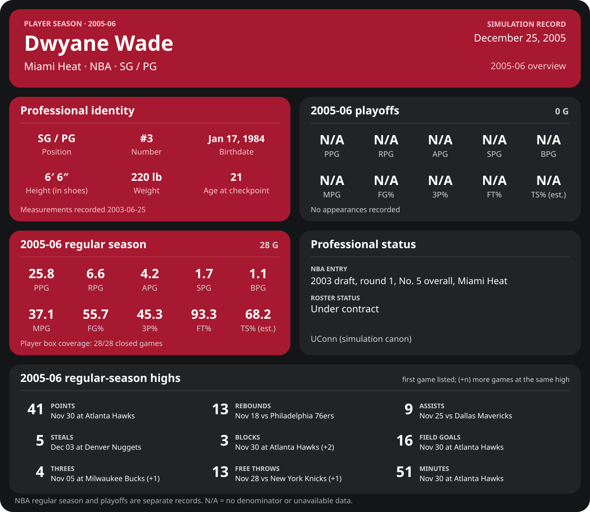
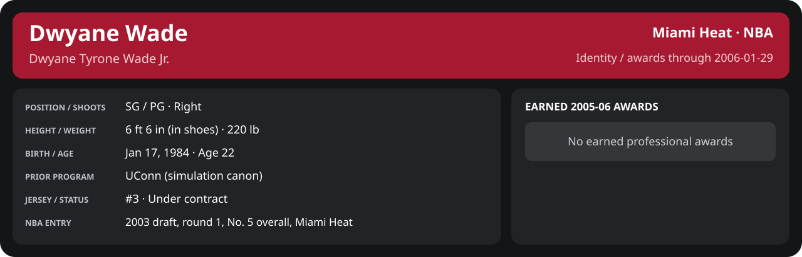

<!-- Generated by scripts/update_player_reports.py; edit source records, then rebuild. -->

# 2005-06 | Player season

## Professional identity

| Player | Age on report date | Team / league | Position | Number | Status |
| --- | --- | --- | --- | --- | --- |
| Dwyane Tyrone Wade Jr. | 22 | Miami Heat / NBA | SG / PG | 3 | Under contract |

| Identity field | Recorded value |
| --- | --- |
| Birth date | 1984-01-17 |
| NBA entry | 2003 draft, round 1, No. 5 overall, Miami Heat |
| Prior program | UConn (simulation canon) |
| Height, in shoes / without shoes | 6 ft 6 in / 6 ft 4.75 in |
| Weight | 220 lb |
| Wingspan / standing reach | 6 ft 11.5 in / 8 ft 7.5 in |
| Shooting hand | Right |
| Contract | Rookie scale signed 2003-07-21: three seasons plus a 2006-07 team option (2004-05: $2,361,800) |
| Role | Starting SG; staff plan 34 minutes |
| NBA debut | October 28, 2003 at Philadelphia 76ers (2003-04/06_Regular_Season/10_October/Week_4/Game_1.md) |
| Nationality | United States (born in the Chicago area; Robbins, Illinois home community, per the player profile) |
| National team | No selection recorded |
| National-team eligibility | United States (USA Basketball); no selection yet |
| Availability | No current restriction recorded in the established profile |
| Physical measurements recorded | 2003-06-25 |
| Professional status effective | 2005-10-26 |

Identity as of 2006-01-29; status snapshot dated 2005-10-26. User-established alternate-history player; historical Wade's biography and results are not this record.

[Complete professional identity](../Professional_Identity.md)

### Earned 2005-06 awards

| Award | Period | Announced | Decision record |
| --- | --- | --- | --- |
| Eastern Conference Player of the Week | 2005-11-07 to 2005-11-13 | 2005-11-14 | [East POW](../Stats_and_Awards/League/2005-06/11_November/Week_2/League_Awards.md#player-of-the-week) |
| Eastern Conference Player of the Week | 2005-11-14 to 2005-11-20 | 2005-11-21 | [East POW](../Stats_and_Awards/League/2005-06/11_November/Week_3/League_Awards.md#player-of-the-week) |
| Eastern Conference Player of the Month | 2005-11-01 to 2005-11-30 | 2005-12-02 | [East POM](../Stats_and_Awards/League/2005-06/11_November/League_Awards.md#player-of-the-month) |
| Eastern Conference Player of the Week | 2005-11-28 to 2005-12-04 | 2005-12-05 | [East POW](../Stats_and_Awards/League/2005-06/12_December/Week_1/League_Awards.md#player-of-the-week) |
| Eastern Conference Player of the Week | 2005-12-05 to 2005-12-11 | 2005-12-12 | [East POW](../Stats_and_Awards/League/2005-06/12_December/Week_2/League_Awards.md#player-of-the-week) |
| Eastern Conference Player of the Week | 2005-12-26 to 2006-01-01 | 2006-01-02 | [East POW](../Stats_and_Awards/League/2005-06/01_January/Week_1/League_Awards.md#player-of-the-week) |

## Statistics

Report cutoff: **2006-01-29**. Each row is a separate competition; do not add the rates.

### Competition summary

  

[Shooting detail](../Stats_and_Awards/Shooting.md) · [Current contract](../Stats_and_Awards/Contract.md#current-contract) · [Contract history](../Stats_and_Awards/Contract.md#contract-history) · [Annual award record](../Stats_and_Awards/Awards.md)

| Scope | Age | Team | Lg | Pos | G | GS | MP | FG | FGA | FG% | 3P | 3PA | 3P% | 2P | 2PA | 2P% | eFG% | FT | FTA | FT% | ORB | DRB | TRB | AST | STL | BLK | TOV | PF | PTS | TS% (est.) | Awards |
| --- | --- | --- | --- | --- | --- | --- | --- | --- | --- | --- | --- | --- | --- | --- | --- | --- | --- | --- | --- | --- | --- | --- | --- | --- | --- | --- | --- | --- | --- | --- | --- |
| [Summer League](02_Summer_League/README.md) | 22 | Miami Heat | NBA | SG / PG | 0 | N/A | N/A | N/A | N/A | N/A | N/A | N/A | N/A | N/A | N/A | N/A | N/A | N/A | N/A | N/A | N/A | N/A | N/A | N/A | N/A | N/A | N/A | N/A | N/A | N/A | — |
| [Preseason](05_Preseason/README.md) | 22 | Miami Heat | NBA | SG / PG | 7 | 7 | 29.6 | 8.1 | 15.6 | .523 | 1.0 | 2.4 | .412 | 7.1 | 13.1 | .543 | .555 | 7.7 | 8.1 | .947 | 0.7 | 3.0 | 3.7 | 2.6 | 0.7 | 0.0 | 1.4 | 2.1 | 25.0 | .653 | — |
| [NBA regular season](06_Regular_Season/README.md) | 22 | Miami Heat | NBA | SG / PG | 45 | 45 | 37.4 | 9.2 | 16.4 | .562 | 1.5 | 3.3 | .463 | 7.7 | 13.1 | .587 | .609 | 6.6 | 7.0 | .934 | 1.7 | 4.5 | 6.2 | 4.0 | 1.9 | 1.2 | 1.7 | 3.1 | 26.5 | .681 | [East POW](../Stats_and_Awards/League/2005-06/11_November/Week_2/League_Awards.md#player-of-the-week), [East POW](../Stats_and_Awards/League/2005-06/11_November/Week_3/League_Awards.md#player-of-the-week), [East POM](../Stats_and_Awards/League/2005-06/11_November/League_Awards.md#player-of-the-month), [East POW](../Stats_and_Awards/League/2005-06/12_December/Week_1/League_Awards.md#player-of-the-week), [East POW](../Stats_and_Awards/League/2005-06/12_December/Week_2/League_Awards.md#player-of-the-week), [East POW](../Stats_and_Awards/League/2005-06/01_January/Week_1/League_Awards.md#player-of-the-week) |
| [NBA playoffs](08_Playoffs/README.md) | 22 | Miami Heat | NBA | SG / PG | 0 | N/A | N/A | N/A | N/A | N/A | N/A | N/A | N/A | N/A | N/A | N/A | N/A | N/A | N/A | N/A | N/A | N/A | N/A | N/A | N/A | N/A | N/A | N/A | N/A | N/A | — |

G and GS are counts; MP and counting statistics are **per appearance**. Shooting uses **.500 = 50.0%**. Age is at the row's cutoff. Scroll horizontally for every column.

Awards are confirmed through 2006-01-29, filed by the honor's period-end date; the banner shows career awards known at the page's identity cutoff.

### Regular season by month

  

[Shooting detail](../Stats_and_Awards/Shooting.md) · [Current contract](../Stats_and_Awards/Contract.md#current-contract) · [Contract history](../Stats_and_Awards/Contract.md#contract-history) · [Annual award record](../Stats_and_Awards/Awards.md)

| Scope | Age | Team | Lg | Pos | G | GS | MP | FG | FGA | FG% | 3P | 3PA | 3P% | 2P | 2PA | 2P% | eFG% | FT | FTA | FT% | ORB | DRB | TRB | AST | STL | BLK | TOV | PF | PTS | TS% (est.) | Awards |
| --- | --- | --- | --- | --- | --- | --- | --- | --- | --- | --- | --- | --- | --- | --- | --- | --- | --- | --- | --- | --- | --- | --- | --- | --- | --- | --- | --- | --- | --- | --- | --- |
| [November 2005](../Stats_and_Awards/2005-06/11_November/README.md) | 21 | Miami Heat | NBA | SG / PG | 15 | 15 | 37.0 | 8.9 | 15.1 | .593 | 1.5 | 2.7 | .550 | 7.5 | 12.4 | .602 | .642 | 6.7 | 7.4 | .910 | 1.9 | 5.0 | 6.9 | 4.3 | 1.9 | 0.9 | 2.0 | 3.0 | 26.1 | .711 | [East POW](../Stats_and_Awards/League/2005-06/11_November/Week_2/League_Awards.md#player-of-the-week), [East POW](../Stats_and_Awards/League/2005-06/11_November/Week_3/League_Awards.md#player-of-the-week), [East POM](../Stats_and_Awards/League/2005-06/11_November/League_Awards.md#player-of-the-month) |
| [December 2005](../Stats_and_Awards/2005-06/12_December/README.md) | 21 | Miami Heat | NBA | SG / PG | 16 | 16 | 36.5 | 8.2 | 15.8 | .520 | 1.2 | 3.2 | .392 | 6.9 | 12.6 | .552 | .560 | 6.5 | 6.8 | .963 | 1.9 | 4.0 | 5.9 | 4.1 | 1.4 | 1.5 | 1.6 | 3.4 | 24.1 | .644 | [East POW](../Stats_and_Awards/League/2005-06/12_December/Week_1/League_Awards.md#player-of-the-week), [East POW](../Stats_and_Awards/League/2005-06/12_December/Week_2/League_Awards.md#player-of-the-week) |
| [January 2006](../Stats_and_Awards/2005-06/01_January/README.md) | 22 | Miami Heat | NBA | SG / PG | 14 | 14 | 38.8 | 10.6 | 18.4 | .578 | 1.9 | 4.0 | .464 | 8.8 | 14.4 | .609 | .628 | 6.4 | 6.9 | .928 | 1.4 | 4.4 | 5.8 | 3.7 | 2.5 | 1.3 | 1.6 | 2.8 | 29.6 | .688 | [East POW](../Stats_and_Awards/League/2005-06/01_January/Week_1/League_Awards.md#player-of-the-week) |
| [February 2006](../Stats_and_Awards/2005-06/02_February/README.md) | 22 | Miami Heat | NBA | SG / PG | 0 | N/A | N/A | N/A | N/A | N/A | N/A | N/A | N/A | N/A | N/A | N/A | N/A | N/A | N/A | N/A | N/A | N/A | N/A | N/A | N/A | N/A | N/A | N/A | N/A | N/A | — |
| [March 2006](../Stats_and_Awards/2005-06/03_March/README.md) | 22 | Miami Heat | NBA | SG / PG | 0 | N/A | N/A | N/A | N/A | N/A | N/A | N/A | N/A | N/A | N/A | N/A | N/A | N/A | N/A | N/A | N/A | N/A | N/A | N/A | N/A | N/A | N/A | N/A | N/A | N/A | — |
| [April 2006](../Stats_and_Awards/2005-06/04_April/README.md) | 22 | Miami Heat | NBA | SG / PG | 0 | N/A | N/A | N/A | N/A | N/A | N/A | N/A | N/A | N/A | N/A | N/A | N/A | N/A | N/A | N/A | N/A | N/A | N/A | N/A | N/A | N/A | N/A | N/A | N/A | N/A | — |

G and GS are counts; MP and counting statistics are **per appearance**. Shooting uses **.500 = 50.0%**. Age is at the row's cutoff. Scroll horizontally for every column.

Awards are confirmed through 2006-01-29, filed by the honor's period-end date; the banner shows career awards known at the page's identity cutoff.

### Career records

[Team state](00_Team/README.md) · [Free agency](01_Free_Agency/README.md) · [Offseason](03_Offseason/README.md) · [Training camp](04_Training_Camp/README.md) · [Draft](09_Draft/README.md)

[Open your live career milestones](../Milestones/index.html) · [Detailed Shooting, Contract and Awards](../Stats_and_Awards/player_cards.html) · [Every player's contract](../Contracts/index.html)
