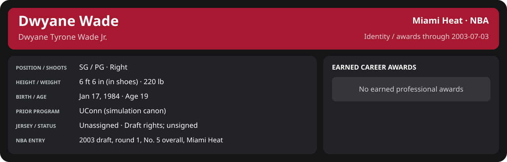

<!-- Generated by scripts/update_player_reports.py; edit source records, then rebuild. -->

# Earned professional awards

## Professional identity

| Player | Age on report date | Team / league | Position | Number | Status |
| --- | --- | --- | --- | --- | --- |
| Dwyane Tyrone Wade Jr. | 19 | Miami Heat / NBA | SG / PG | Not assigned | Draft rights; unsigned |

| Identity field | Recorded value |
| --- | --- |
| Birth date | 1984-01-17 |
| NBA entry | 2003 draft, round 1, No. 5 overall, Miami Heat |
| Prior program | UConn (simulation canon) |
| Height, in shoes / without shoes | 6 ft 6 in / 6 ft 4.75 in |
| Weight | 220 lb |
| Wingspan / standing reach | 6 ft 11.5 in / 8 ft 7.5 in |
| Shooting hand | Right |
| Contract | No executed professional contract |
| Role | Unassigned rookie |
| NBA debut | Not recorded |
| Nationality | Not recorded |
| National team | No selection recorded |
| National-team eligibility | Not verified |
| Availability | No current restriction recorded in the established profile |
| Physical measurements recorded | 2003-06-25 |
| Professional status effective | 2003-06-26 |

Identity as of 2003-07-03; status snapshot dated 2003-06-26. User-established alternate-history player; historical Wade's biography and results are not this record.

### Earned career awards

No earned professional awards recorded by this page's identity cutoff.

## Statistics

### Award register

No earned professional awards are recorded at this career checkpoint. Nominees, open ballots and historical Wade's achievements are not earned awards in this simulation.

[Award source and date rules](../../docs/player_statistics.md)
