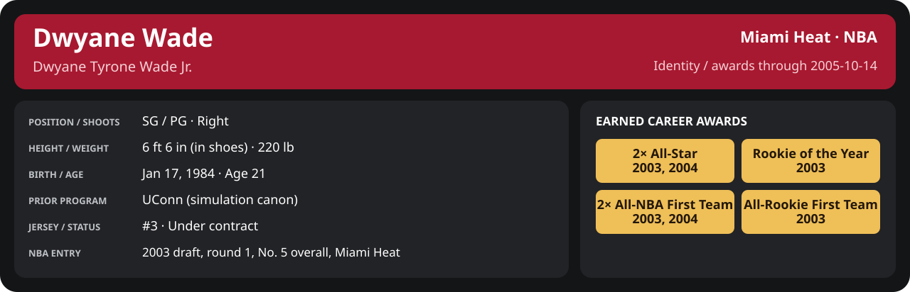

<!-- Generated by scripts/update_player_reports.py; edit source records, then rebuild. -->

# Earned professional awards

## Professional identity

| Player | Age on report date | Team / league | Position | Number | Status |
| --- | --- | --- | --- | --- | --- |
| Dwyane Tyrone Wade Jr. | 21 | Miami Heat / NBA | SG / PG | 3 | Under contract |

| Identity field | Recorded value |
| --- | --- |
| Birth date | 1984-01-17 |
| NBA entry | 2003 draft, round 1, No. 5 overall, Miami Heat |
| Prior program | UConn (simulation canon) |
| Height, in shoes / without shoes | 6 ft 6 in / 6 ft 4.75 in |
| Weight | 220 lb |
| Wingspan / standing reach | 6 ft 11.5 in / 8 ft 7.5 in |
| Shooting hand | Right |
| Contract | Rookie scale signed 2003-07-21: three seasons plus a 2006-07 team option (2004-05: $2,361,800) |
| Role | Starting SG; staff plan 34 minutes |
| NBA debut | October 28, 2003 at Philadelphia 76ers (2003-04/06_Regular_Season/10_October/Week_4/Game_1.md) |
| Nationality | United States (born in the Chicago area; Robbins, Illinois home community, per the player profile) |
| National team | No selection recorded |
| National-team eligibility | United States (USA Basketball); no selection yet |
| Availability | No current restriction recorded in the established profile |
| Physical measurements recorded | 2003-06-25 |
| Professional status effective | 2004-10-28 |

Identity as of 2005-10-14; status snapshot dated 2004-10-28. User-established alternate-history player; historical Wade's biography and results are not this record.

### Earned career awards

| Award | Period | Announced | Decision record |
| --- | --- | --- | --- |
| Eastern Conference Rookie of the Month | 2003-10-28 to 2003-11-30 | 2003-12-02 | [East ROM](Stats_and_Awards/League/2003-04/11_November/League_Awards.md#rookie-of-the-month) |
| Eastern Conference Player of the Week | 2003-12-15 to 2003-12-21 | 2003-12-22 | [East POW](Stats_and_Awards/League/2003-04/12_December/Week_3/League_Awards.md#player-of-the-week) |
| Eastern Conference Player of the Month | 2003-12-01 to 2003-12-31 | 2004-01-02 | [East POM](Stats_and_Awards/League/2003-04/12_December/League_Awards.md#player-of-the-month) |
| Eastern Conference Rookie of the Month | 2003-12-01 to 2003-12-31 | 2004-01-02 | [East ROM](Stats_and_Awards/League/2003-04/12_December/League_Awards.md#rookie-of-the-month) |
| Eastern Conference Player of the Week | 2003-12-29 to 2004-01-04 | 2004-01-05 | [East POW](Stats_and_Awards/League/2003-04/01_January/Week_1/League_Awards.md#player-of-the-week) |
| Eastern Conference Player of the Month | 2004-01-01 to 2004-01-31 | 2004-02-02 | [East POM](Stats_and_Awards/League/2003-04/01_January/League_Awards.md#player-of-the-month) |
| Eastern Conference Rookie of the Month | 2004-01-01 to 2004-01-31 | 2004-02-02 | [East ROM](Stats_and_Awards/League/2003-04/01_January/League_Awards.md#rookie-of-the-month) |
| All-Star | 2003-10-28 to 2004-02-03 | 2004-02-03 | [All-Star](Stats_and_Awards/League/2003-04/All_Star.md#all-stars) |
| Eastern Conference Rookie of the Month | 2004-02-01 to 2004-02-29 | 2004-03-02 | [East ROM](Stats_and_Awards/League/2003-04/02_February/League_Awards.md#rookie-of-the-month) |
| Eastern Conference Player of the Week | 2004-03-08 to 2004-03-14 | 2004-03-15 | [East POW](Stats_and_Awards/League/2003-04/03_March/Week_2/League_Awards.md#player-of-the-week) |
| Eastern Conference Player of the Month | 2004-03-01 to 2004-03-31 | 2004-04-02 | [East POM](Stats_and_Awards/League/2003-04/03_March/League_Awards.md#player-of-the-month) |
| Eastern Conference Rookie of the Month | 2004-03-01 to 2004-03-31 | 2004-04-02 | [East ROM](Stats_and_Awards/League/2003-04/03_March/League_Awards.md#rookie-of-the-month) |
| Eastern Conference Rookie of the Month | 2004-04-01 to 2004-04-14 | 2004-04-16 | [East ROM](Stats_and_Awards/League/2003-04/04_April/League_Awards.md#rookie-of-the-month) |
| Rookie of the Year | 2003-10-28 to 2004-04-14 | 2004-04-20 | [ROY](Stats_and_Awards/League/2003-04/Season_Awards.md#rookie-of-the-year) |
| All-NBA First Team | 2003-10-28 to 2004-04-14 | 2004-04-25 | [All-NBA 1st](Stats_and_Awards/League/2003-04/Season_Awards.md#all-nba-teams) |
| All-Rookie First Team | 2003-10-28 to 2004-04-14 | 2004-04-27 | [All-Rookie 1st](Stats_and_Awards/League/2003-04/Season_Awards.md#all-rookie-teams) |
| Eastern Conference Player of the Month | 2004-12-01 to 2004-12-31 | 2005-01-02 | [East POM](Stats_and_Awards/League/2004-05/12_December/League_Awards.md#player-of-the-month) |
| Eastern Conference Player of the Week | 2005-01-24 to 2005-01-30 | 2005-01-31 | [East POW](Stats_and_Awards/League/2004-05/01_January/Week_4/League_Awards.md#player-of-the-week) |
| All-Star | 2004-11-02 to 2005-02-08 | 2005-02-08 | [All-Star](Stats_and_Awards/League/2004-05/All_Star.md#all-stars) |
| Eastern Conference Player of the Month | 2005-03-01 to 2005-03-31 | 2005-04-02 | [East POM](Stats_and_Awards/League/2004-05/03_March/League_Awards.md#player-of-the-month) |
| Eastern Conference Player of the Month | 2005-04-01 to 2005-04-20 | 2005-04-22 | [East POM](Stats_and_Awards/League/2004-05/04_April/League_Awards.md#player-of-the-month) |
| All-NBA First Team | 2004-11-02 to 2005-04-20 | 2005-05-18 | [All-NBA 1st](Stats_and_Awards/League/2004-05/Season_Awards.md#all-nba-teams) |

## Statistics

### Award register

| Award | Competition | Season / edition | Period | Announced | Source |
| --- | --- | --- | --- | --- | --- |
| Eastern Conference Rookie of the Month | NBA regular season | 2003-04 | 2003-10-28 to 2003-11-30 | 2003-12-02 | [East ROM](Stats_and_Awards/League/2003-04/11_November/League_Awards.md#rookie-of-the-month) |
| Eastern Conference Player of the Week | NBA regular season | 2003-04 | 2003-12-15 to 2003-12-21 | 2003-12-22 | [East POW](Stats_and_Awards/League/2003-04/12_December/Week_3/League_Awards.md#player-of-the-week) |
| Eastern Conference Player of the Month | NBA regular season | 2003-04 | 2003-12-01 to 2003-12-31 | 2004-01-02 | [East POM](Stats_and_Awards/League/2003-04/12_December/League_Awards.md#player-of-the-month) |
| Eastern Conference Rookie of the Month | NBA regular season | 2003-04 | 2003-12-01 to 2003-12-31 | 2004-01-02 | [East ROM](Stats_and_Awards/League/2003-04/12_December/League_Awards.md#rookie-of-the-month) |
| Eastern Conference Player of the Week | NBA regular season | 2003-04 | 2003-12-29 to 2004-01-04 | 2004-01-05 | [East POW](Stats_and_Awards/League/2003-04/01_January/Week_1/League_Awards.md#player-of-the-week) |
| Eastern Conference Player of the Month | NBA regular season | 2003-04 | 2004-01-01 to 2004-01-31 | 2004-02-02 | [East POM](Stats_and_Awards/League/2003-04/01_January/League_Awards.md#player-of-the-month) |
| Eastern Conference Rookie of the Month | NBA regular season | 2003-04 | 2004-01-01 to 2004-01-31 | 2004-02-02 | [East ROM](Stats_and_Awards/League/2003-04/01_January/League_Awards.md#rookie-of-the-month) |
| All-Star | NBA regular season | 2003-04 | 2003-10-28 to 2004-02-03 | 2004-02-03 | [All-Star](Stats_and_Awards/League/2003-04/All_Star.md#all-stars) |
| Eastern Conference Rookie of the Month | NBA regular season | 2003-04 | 2004-02-01 to 2004-02-29 | 2004-03-02 | [East ROM](Stats_and_Awards/League/2003-04/02_February/League_Awards.md#rookie-of-the-month) |
| Eastern Conference Player of the Week | NBA regular season | 2003-04 | 2004-03-08 to 2004-03-14 | 2004-03-15 | [East POW](Stats_and_Awards/League/2003-04/03_March/Week_2/League_Awards.md#player-of-the-week) |
| Eastern Conference Player of the Month | NBA regular season | 2003-04 | 2004-03-01 to 2004-03-31 | 2004-04-02 | [East POM](Stats_and_Awards/League/2003-04/03_March/League_Awards.md#player-of-the-month) |
| Eastern Conference Rookie of the Month | NBA regular season | 2003-04 | 2004-03-01 to 2004-03-31 | 2004-04-02 | [East ROM](Stats_and_Awards/League/2003-04/03_March/League_Awards.md#rookie-of-the-month) |
| Eastern Conference Rookie of the Month | NBA regular season | 2003-04 | 2004-04-01 to 2004-04-14 | 2004-04-16 | [East ROM](Stats_and_Awards/League/2003-04/04_April/League_Awards.md#rookie-of-the-month) |
| Rookie of the Year | NBA regular season | 2003-04 | 2003-10-28 to 2004-04-14 | 2004-04-20 | [ROY](Stats_and_Awards/League/2003-04/Season_Awards.md#rookie-of-the-year) |
| All-NBA First Team | NBA regular season | 2003-04 | 2003-10-28 to 2004-04-14 | 2004-04-25 | [All-NBA 1st](Stats_and_Awards/League/2003-04/Season_Awards.md#all-nba-teams) |
| All-Rookie First Team | NBA regular season | 2003-04 | 2003-10-28 to 2004-04-14 | 2004-04-27 | [All-Rookie 1st](Stats_and_Awards/League/2003-04/Season_Awards.md#all-rookie-teams) |
| Eastern Conference Player of the Month | NBA regular season | 2004-05 | 2004-12-01 to 2004-12-31 | 2005-01-02 | [East POM](Stats_and_Awards/League/2004-05/12_December/League_Awards.md#player-of-the-month) |
| Eastern Conference Player of the Week | NBA regular season | 2004-05 | 2005-01-24 to 2005-01-30 | 2005-01-31 | [East POW](Stats_and_Awards/League/2004-05/01_January/Week_4/League_Awards.md#player-of-the-week) |
| All-Star | NBA regular season | 2004-05 | 2004-11-02 to 2005-02-08 | 2005-02-08 | [All-Star](Stats_and_Awards/League/2004-05/All_Star.md#all-stars) |
| Eastern Conference Player of the Month | NBA regular season | 2004-05 | 2005-03-01 to 2005-03-31 | 2005-04-02 | [East POM](Stats_and_Awards/League/2004-05/03_March/League_Awards.md#player-of-the-month) |
| Eastern Conference Player of the Month | NBA regular season | 2004-05 | 2005-04-01 to 2005-04-20 | 2005-04-22 | [East POM](Stats_and_Awards/League/2004-05/04_April/League_Awards.md#player-of-the-month) |
| All-NBA First Team | NBA regular season | 2004-05 | 2004-11-02 to 2005-04-20 | 2005-05-18 | [All-NBA 1st](Stats_and_Awards/League/2004-05/Season_Awards.md#all-nba-teams) |

[Award source and date rules](../../docs/player_statistics.md)
