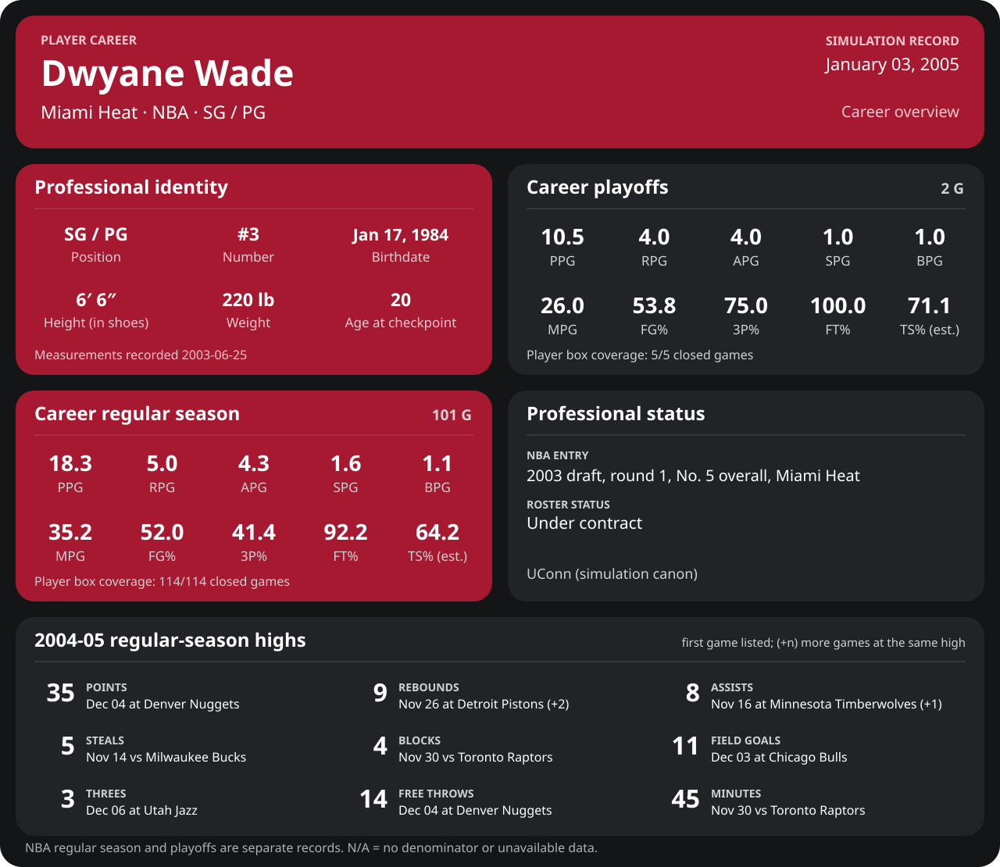

<!-- Generated by scripts/update_player_reports.py; edit source records, then rebuild. -->

# Dwyane Wade | Player career

[Professional identity](Professional_Identity.md) · [Career statistics](Stats_and_Awards/README.md) · [Earned awards](Awards.md) · [National team / FIBA](National_Team/README.md) · [Career milestones](Milestones/career_milestones.md) · [Season tracker](Milestones/calendar.md)

**Season reports:** [2003-04](2003-04/README.md) · [2004-05](2004-05/README.md)

Professional identity: text version

## Professional identity

| Player | Age on report date | Team / league | Position | Number | Status |
| --- | --- | --- | --- | --- | --- |
| Dwyane Tyrone Wade Jr. | 20 | Miami Heat / NBA | SG / PG | 3 | Under contract |

| Birth date | Height (in shoes) | Weight | Shoots | Prior program |
| --- | --- | --- | --- | --- |
| 1984-01-17 | 6 ft 6 in | 220 lb | Right | UConn (simulation canon) |

NBA entry: 2003 draft, round 1, No. 5 overall, Miami Heat.

Identity as of 2004-10-14; status snapshot dated 2004-10-01. User-established alternate-history player; historical Wade's biography and results are not this record.

## Statistics

Career cutoff: **2004-10-14**. Club competitions and national-team events have separate records.

### NBA regular season

  

[Shooting detail](Stats_and_Awards/Shooting.md) · [Current contract](Stats_and_Awards/Contract.md#current-contract) · [Contract history](Stats_and_Awards/Contract.md#contract-history) · [Annual award record](Stats_and_Awards/Awards.md)

| Scope | Age | Team | Lg | Pos | G | GS | MP | FG | FGA | FG% | 3P | 3PA | 3P% | 2P | 2PA | 2P% | eFG% | FT | FTA | FT% | ORB | DRB | TRB | AST | STL | BLK | TOV | PF | PTS | TS% (est.) | Awards |
| --- | --- | --- | --- | --- | --- | --- | --- | --- | --- | --- | --- | --- | --- | --- | --- | --- | --- | --- | --- | --- | --- | --- | --- | --- | --- | --- | --- | --- | --- | --- | --- |
| [2003-04](Stats_and_Awards/2003-04/README.md) | 20 | Miami Heat | NBA | SG / PG | 75 | 70 | 35.0 | 6.1 | 11.7 | .520 | 0.9 | 2.4 | .397 | 5.1 | 9.3 | .551 | .560 | 4.8 | 5.3 | .909 | 1.4 | 3.4 | 4.8 | 4.5 | 1.6 | 1.0 | 1.1 | 2.9 | 17.9 | .639 | [East ROM](Stats_and_Awards/League/2003-04/11_November/League_Awards.md#rookie-of-the-month), [East POW](Stats_and_Awards/League/2003-04/12_December/Week_3/League_Awards.md#player-of-the-week), [East POM](Stats_and_Awards/League/2003-04/12_December/League_Awards.md#player-of-the-month), [East ROM](Stats_and_Awards/League/2003-04/12_December/League_Awards.md#rookie-of-the-month), [East POW](Stats_and_Awards/League/2003-04/01_January/Week_1/League_Awards.md#player-of-the-week), [East POM](Stats_and_Awards/League/2003-04/01_January/League_Awards.md#player-of-the-month), [East ROM](Stats_and_Awards/League/2003-04/01_January/League_Awards.md#rookie-of-the-month), [All-Star](Stats_and_Awards/League/2003-04/All_Star.md#all-stars), [East ROM](Stats_and_Awards/League/2003-04/02_February/League_Awards.md#rookie-of-the-month), [East POW](Stats_and_Awards/League/2003-04/03_March/Week_2/League_Awards.md#player-of-the-week), [East POM](Stats_and_Awards/League/2003-04/03_March/League_Awards.md#player-of-the-month), [East ROM](Stats_and_Awards/League/2003-04/03_March/League_Awards.md#rookie-of-the-month), [East ROM](Stats_and_Awards/League/2003-04/04_April/League_Awards.md#rookie-of-the-month), [ROY](Stats_and_Awards/League/2003-04/Season_Awards.md#rookie-of-the-year), [All-NBA 1st](Stats_and_Awards/League/2003-04/Season_Awards.md#all-nba-teams), [All-Rookie 1st](Stats_and_Awards/League/2003-04/Season_Awards.md#all-rookie-teams) |
| [2004-05](Stats_and_Awards/2004-05/README.md) | 20 | Miami Heat | NBA | SG / PG | 0 | N/A | N/A | N/A | N/A | N/A | N/A | N/A | N/A | N/A | N/A | N/A | N/A | N/A | N/A | N/A | N/A | N/A | N/A | N/A | N/A | N/A | N/A | N/A | N/A | N/A | — |
| Career total | 20 | Miami Heat | NBA | SG / PG | 75 | 70 | 35.0 | 6.1 | 11.7 | .520 | 0.9 | 2.4 | .397 | 5.1 | 9.3 | .551 | .560 | 4.8 | 5.3 | .909 | 1.4 | 3.4 | 4.8 | 4.5 | 1.6 | 1.0 | 1.1 | 2.9 | 17.9 | .639 | [East ROM](Stats_and_Awards/League/2003-04/11_November/League_Awards.md#rookie-of-the-month), [East POW](Stats_and_Awards/League/2003-04/12_December/Week_3/League_Awards.md#player-of-the-week), [East POM](Stats_and_Awards/League/2003-04/12_December/League_Awards.md#player-of-the-month), [East ROM](Stats_and_Awards/League/2003-04/12_December/League_Awards.md#rookie-of-the-month), [East POW](Stats_and_Awards/League/2003-04/01_January/Week_1/League_Awards.md#player-of-the-week), [East POM](Stats_and_Awards/League/2003-04/01_January/League_Awards.md#player-of-the-month), [East ROM](Stats_and_Awards/League/2003-04/01_January/League_Awards.md#rookie-of-the-month), [All-Star](Stats_and_Awards/League/2003-04/All_Star.md#all-stars), [East ROM](Stats_and_Awards/League/2003-04/02_February/League_Awards.md#rookie-of-the-month), [East POW](Stats_and_Awards/League/2003-04/03_March/Week_2/League_Awards.md#player-of-the-week), [East POM](Stats_and_Awards/League/2003-04/03_March/League_Awards.md#player-of-the-month), [East ROM](Stats_and_Awards/League/2003-04/03_March/League_Awards.md#rookie-of-the-month), [East ROM](Stats_and_Awards/League/2003-04/04_April/League_Awards.md#rookie-of-the-month), [ROY](Stats_and_Awards/League/2003-04/Season_Awards.md#rookie-of-the-year), [All-NBA 1st](Stats_and_Awards/League/2003-04/Season_Awards.md#all-nba-teams), [All-Rookie 1st](Stats_and_Awards/League/2003-04/Season_Awards.md#all-rookie-teams) |

G and GS are counts; MP and counting statistics are **per appearance**. Shooting uses **.500 = 50.0%**. Age is at the row's cutoff. Scroll horizontally for every column.

Awards are confirmed through 2004-10-14, filed by the honor's period-end date; the banner shows career awards known at the page's identity cutoff.

### NBA playoffs

  

[Shooting detail](Stats_and_Awards/Shooting.md) · [Current contract](Stats_and_Awards/Contract.md#current-contract) · [Contract history](Stats_and_Awards/Contract.md#contract-history) · [Annual award record](Stats_and_Awards/Awards.md)

| Scope | Age | Team | Lg | Pos | G | GS | MP | FG | FGA | FG% | 3P | 3PA | 3P% | 2P | 2PA | 2P% | eFG% | FT | FTA | FT% | ORB | DRB | TRB | AST | STL | BLK | TOV | PF | PTS | TS% (est.) | Awards |
| --- | --- | --- | --- | --- | --- | --- | --- | --- | --- | --- | --- | --- | --- | --- | --- | --- | --- | --- | --- | --- | --- | --- | --- | --- | --- | --- | --- | --- | --- | --- | --- |
| [2003-04](2003-04/08_Playoffs/README.md) | 20 | Miami Heat | NBA | SG / PG | 2 | 2 | 26.0 | 3.5 | 6.5 | .538 | 1.5 | 2.0 | .750 | 2.0 | 4.5 | .444 | .654 | 2.0 | 2.0 | 1.000 | 1.0 | 3.0 | 4.0 | 4.0 | 1.0 | 1.0 | 1.0 | 4.5 | 10.5 | .711 | — |
| [2004-05](2004-05/08_Playoffs/README.md) | 20 | Miami Heat | NBA | SG / PG | 0 | N/A | N/A | N/A | N/A | N/A | N/A | N/A | N/A | N/A | N/A | N/A | N/A | N/A | N/A | N/A | N/A | N/A | N/A | N/A | N/A | N/A | N/A | N/A | N/A | N/A | — |
| Career total | 20 | Miami Heat | NBA | SG / PG | 2 | 2 | 26.0 | 3.5 | 6.5 | .538 | 1.5 | 2.0 | .750 | 2.0 | 4.5 | .444 | .654 | 2.0 | 2.0 | 1.000 | 1.0 | 3.0 | 4.0 | 4.0 | 1.0 | 1.0 | 1.0 | 4.5 | 10.5 | .711 | — |

G and GS are counts; MP and counting statistics are **per appearance**. Shooting uses **.500 = 50.0%**. Age is at the row's cutoff. Scroll horizontally for every column.

Awards are confirmed through 2004-10-14, filed by the honor's period-end date; the banner shows career awards known at the page's identity cutoff.

### Browse

[2003-04 all competitions](2003-04/README.md) · [2004-05 all competitions](2004-05/README.md)

[Earned awards](Awards.md) · [National team / FIBA](National_Team/README.md) · [Stats definitions](../../docs/player_statistics.md) · [Filled example](../../docs/examples/player_stats_preview.md) · [Miami records](Stats_and_Awards/Team/README.md) · [League records and awards](Stats_and_Awards/League/README.md)

[Open your live career milestones](Milestones/index.html) · [Detailed Shooting, Contract and Awards](Stats_and_Awards/player_cards.html) · [Every player's contract](Contracts/index.html)
