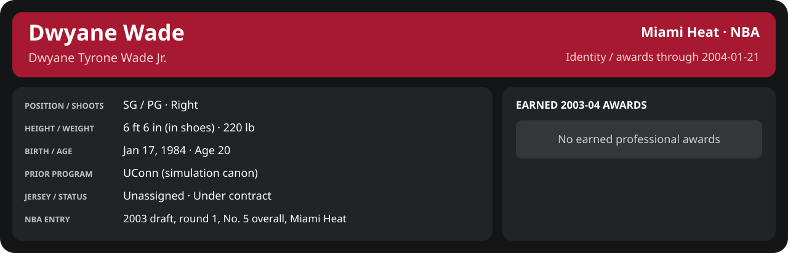

<!-- Generated by scripts/update_player_reports.py; edit source records, then rebuild. -->

# Week 3: 2004-01-15 to 2004-01-21

[Career](../../../../README.md) · [Professional identity](../../../../Professional_Identity.md) · [Earned awards](../../../../Awards.md) · [Stat definitions](../../../../../../docs/player_statistics.md) · [Month](../README.md) · [Miami](../../../Team/2003-04/01_January/Week_3/Team_Stats.md) · [NBA players](../../../League/2003-04/01_January/Week_3/League_Stats.md) · [NBA awards](../../../League/2003-04/01_January/Week_3/League_Awards.md) · [Period decisions](../../../../2003-04/06_Regular_Season/01_January/Week_3/note.md) · [Previous week](../Week_2/README.md) · [Next week](../Week_4/README.md)

## Professional identity

| Player | Age on report date | Team / league | Position | Number | Status |
| --- | --- | --- | --- | --- | --- |
| Dwyane Tyrone Wade Jr. | 20 | Miami Heat / NBA | SG / PG | Not assigned | Under contract |

| Identity field | Recorded value |
| --- | --- |
| Birth date | 1984-01-17 |
| NBA entry | 2003 draft, round 1, No. 5 overall, Miami Heat |
| Prior program | UConn (simulation canon) |
| Height, in shoes / without shoes | 6 ft 6 in / 6 ft 4.75 in |
| Weight | 220 lb |
| Wingspan / standing reach | 6 ft 11.5 in / 8 ft 7.5 in |
| Shooting hand | Right |
| Contract | Rookie scale signed 2003-07-21: three seasons plus a 2006-07 team option |
| Role | Starter; staff plan 34 minutes |
| NBA debut | October 28, 2003 at Philadelphia 76ers (2003-04/06_Regular_Season/10_October/Week_4/Game_1.md) |
| Nationality | United States (born in the Chicago area; Robbins, Illinois home community, per the player profile) |
| National team | No selection recorded |
| National-team eligibility | Not verified |
| Availability | No current restriction recorded in the established profile |
| Physical measurements recorded | 2003-06-25 |
| Professional status effective | 2003-12-01 |

Identity as of 2004-01-21; status snapshot dated 2003-12-01. User-established alternate-history player; historical Wade's biography and results are not this record.

### Earned 2003-04 awards

| Award | Period | Announced | Decision record |
| --- | --- | --- | --- |
| Eastern Conference Rookie of the Month | 2003-10-28 to 2003-11-30 | 2003-12-02 | [East ROM](../../../League/2003-04/11_November/League_Awards.md#rookie-of-the-month) |
| Eastern Conference Player of the Week | 2003-12-15 to 2003-12-21 | 2003-12-22 | [East POW](../../../League/2003-04/12_December/Week_3/League_Awards.md#player-of-the-week) |
| Eastern Conference Player of the Month | 2003-12-01 to 2003-12-31 | 2004-01-02 | [East POM](../../../League/2003-04/12_December/League_Awards.md#player-of-the-month) |
| Eastern Conference Rookie of the Month | 2003-12-01 to 2003-12-31 | 2004-01-02 | [East ROM](../../../League/2003-04/12_December/League_Awards.md#rookie-of-the-month) |
| Eastern Conference Player of the Week | 2003-12-29 to 2004-01-04 | 2004-01-05 | [East POW](../../../League/2003-04/01_January/Week_1/League_Awards.md#player-of-the-week) |

## Statistics

As of **2004-01-21**: 4 closed games; 4/4 have player participation and box coverage; recorded DNPs: 0.

G counts appearances; GS counts recorded starts. DNPs, scheduled games and canceled games do not enter per-game denominators.

### Per game

  

[Shooting detail](../../../Shooting.md) · [Current contract](../../../Contract.md#current-contract) · [Contract history](../../../Contract.md#contract-history) · [Annual award record](../../../Awards.md)

| Scope | Age | Team | Lg | Pos | G | GS | MP | FG | FGA | FG% | 3P | 3PA | 3P% | 2P | 2PA | 2P% | eFG% | FT | FTA | FT% | ORB | DRB | TRB | AST | STL | BLK | TOV | PF | PTS | TS% (est.) | Awards |
| --- | --- | --- | --- | --- | --- | --- | --- | --- | --- | --- | --- | --- | --- | --- | --- | --- | --- | --- | --- | --- | --- | --- | --- | --- | --- | --- | --- | --- | --- | --- | --- |
| This scope | 20 | Miami Heat | NBA | SG / PG | 4 | 4 | 33.2 | 5.5 | 11.5 | .478 | 0.5 | 2.2 | .222 | 5.0 | 9.2 | .541 | .500 | 4.5 | 4.8 | .947 | 1.8 | 3.5 | 5.2 | 3.2 | 0.5 | 1.5 | 0.5 | 2.5 | 16.0 | .589 | — |

G and GS are counts; MP and counting statistics are **per appearance**. Shooting uses **.500 = 50.0%**. Age is at the row's cutoff. Scroll horizontally for every column.

Awards are confirmed through 2006-03-13, filed by the honor's period-end date; the banner shows career awards known at the page's identity cutoff.

[Full statistical detail: totals, per 36, shooting, efficiency, splits and source games](Stat_Detail.md)

### Period comparison

  

[Shooting detail](../../../Shooting.md) · [Current contract](../../../Contract.md#current-contract) · [Contract history](../../../Contract.md#contract-history) · [Annual award record](../../../Awards.md)

| Scope | Age | Team | Lg | Pos | G | GS | MP | FG | FGA | FG% | 3P | 3PA | 3P% | 2P | 2PA | 2P% | eFG% | FT | FTA | FT% | ORB | DRB | TRB | AST | STL | BLK | TOV | PF | PTS | TS% (est.) | Awards |
| --- | --- | --- | --- | --- | --- | --- | --- | --- | --- | --- | --- | --- | --- | --- | --- | --- | --- | --- | --- | --- | --- | --- | --- | --- | --- | --- | --- | --- | --- | --- | --- |
| This week | 20 | Miami Heat | NBA | SG / PG | 4 | 4 | 33.2 | 5.5 | 11.5 | .478 | 0.5 | 2.2 | .222 | 5.0 | 9.2 | .541 | .500 | 4.5 | 4.8 | .947 | 1.8 | 3.5 | 5.2 | 3.2 | 0.5 | 1.5 | 0.5 | 2.5 | 16.0 | .589 | — |
| [Previous week](../Week_2/README.md) | 19 | Miami Heat | NBA | SG / PG | 3 | 3 | 35.0 | 5.3 | 13.3 | .400 | 0.3 | 2.3 | .143 | 5.0 | 11.0 | .455 | .412 | 7.3 | 7.3 | 1.000 | 0.7 | 1.7 | 2.3 | 7.7 | 1.3 | 1.0 | 2.0 | 3.3 | 18.3 | .554 | — |
| Month through this week | 20 | Miami Heat | NBA | SG / PG | 10 | 10 | 35.3 | 6.3 | 12.8 | .492 | 0.7 | 2.2 | .318 | 5.6 | 10.6 | .528 | .520 | 5.9 | 6.2 | .952 | 1.2 | 2.8 | 4.0 | 5.1 | 1.4 | 1.1 | 1.2 | 2.9 | 19.2 | .618 | [East POW](../../../League/2003-04/01_January/Week_1/League_Awards.md#player-of-the-week) |
| Season through this week | 20 | Miami Heat | NBA | SG / PG | 42 | 37 | 34.6 | 5.8 | 11.5 | .509 | 0.8 | 2.3 | .337 | 5.1 | 9.2 | .552 | .543 | 4.8 | 5.2 | .927 | 1.3 | 3.3 | 4.6 | 4.9 | 1.7 | 0.8 | 1.1 | 2.9 | 17.2 | .627 | [East ROM](../../../League/2003-04/11_November/League_Awards.md#rookie-of-the-month), [East POW](../../../League/2003-04/12_December/Week_3/League_Awards.md#player-of-the-week), [East POM](../../../League/2003-04/12_December/League_Awards.md#player-of-the-month), [East ROM](../../../League/2003-04/12_December/League_Awards.md#rookie-of-the-month), [East POW](../../../League/2003-04/01_January/Week_1/League_Awards.md#player-of-the-week) |

G and GS are counts; MP and counting statistics are **per appearance**. Shooting uses **.500 = 50.0%**. Age is at the row's cutoff. Scroll horizontally for every column.

Awards are confirmed through 2006-03-13, filed by the honor's period-end date; the banner shows career awards known at the page's identity cutoff.

### Production

| Metric | Total | Per appearance | Per 36 minutes |
| --- | --- | --- | --- |
| MIN | 132.9 | 33.2 | 36.0 |
| PTS | 64 | 16.0 | 17.3 |
| OREB | 7 | 1.8 | 1.9 |
| DREB | 14 | 3.5 | 3.8 |
| REB | 21 | 5.2 | 5.7 |
| AST | 13 | 3.2 | 3.5 |
| STL | 2 | 0.5 | 0.5 |
| BLK | 6 | 1.5 | 1.6 |
| TOV | 2 | 0.5 | 0.5 |
| PF | 10 | 2.5 | 2.7 |
| FGM | 22 | 5.5 | 6.0 |
| FGA | 46 | 11.5 | 12.5 |
| 2PM | 20 | 5.0 | 5.4 |
| 2PA | 37 | 9.2 | 10.0 |
| 3PM | 2 | 0.5 | 0.5 |
| 3PA | 9 | 2.2 | 2.4 |
| FTM | 18 | 4.5 | 4.9 |
| FTA | 19 | 4.8 | 5.1 |
| FT points | 18 | 4.5 | 4.9 |

Per-36 rates standardize playing time; they are not a projection of playing 36 minutes. Use the actual minutes denominator in every competition.

### Shooting

| Shot type | Makes | Attempts | Percentage |
| --- | --- | --- | --- |
| All field goals | 22 | 46 | 47.8% |
| Two-pointers | 20 | 37 | 54.1% |
| Three-pointers | 2 | 9 | 22.2% |
| Free throws | 18 | 19 | 94.7% |

### Efficiency and shot selection

| Metric | Value | Calculation / unit |
| --- | --- | --- |
| eFG% | 50.0% | (FGM + 0.5 × 3PM) / FGA |
| TS% (estimated) | 58.9% | PTS / [2 × (FGA + 0.44 × FTA)] |
| Three-point attempt share | 19.6% | 3PA / FGA |
| Free-throw attempt rate | 0.413 | FTA / FGA; ratio |
| Assist / turnover ratio | 6.50 | AST / TOV; N/A at zero turnovers |
| Plus/minus total | N/A | Observed on-court score differential only |
| Double-doubles | 0 | At least 10 in any two of PTS, REB, AST, STL, BLK |
| Triple-doubles | 0 | At least 10 in any three; also included in double-doubles |

Percentages use pooled makes and attempts. TS% uses an estimated free-throw weighting, not exact scoring possessions. Rounding is display-only.

### Splits

  

[Shooting detail](../../../Shooting.md) · [Current contract](../../../Contract.md#current-contract) · [Contract history](../../../Contract.md#contract-history) · [Annual award record](../../../Awards.md)

| Scope | Age | Team | Lg | Pos | G | GS | MP | FG | FGA | FG% | 3P | 3PA | 3P% | 2P | 2PA | 2P% | eFG% | FT | FTA | FT% | ORB | DRB | TRB | AST | STL | BLK | TOV | PF | PTS | TS% (est.) | Awards |
| --- | --- | --- | --- | --- | --- | --- | --- | --- | --- | --- | --- | --- | --- | --- | --- | --- | --- | --- | --- | --- | --- | --- | --- | --- | --- | --- | --- | --- | --- | --- | --- |
| Home | 20 | Miami Heat | NBA | SG / PG | 1 | 1 | 36.3 | 7.0 | 13.0 | .538 | 1.0 | 3.0 | .333 | 6.0 | 10.0 | .600 | .577 | 3.0 | 4.0 | .750 | 1.0 | 6.0 | 7.0 | 3.0 | 0.0 | 3.0 | 1.0 | 2.0 | 18.0 | .610 | — |
| Away | 20 | Miami Heat | NBA | SG / PG | 3 | 3 | 32.2 | 5.0 | 11.0 | .455 | 0.3 | 2.0 | .167 | 4.7 | 9.0 | .519 | .470 | 5.0 | 5.0 | 1.000 | 2.0 | 2.7 | 4.7 | 3.3 | 0.7 | 1.0 | 0.3 | 2.7 | 15.3 | .581 | — |
| Neutral | 20 | Miami Heat | NBA | SG / PG | 0 | N/A | N/A | N/A | N/A | N/A | N/A | N/A | N/A | N/A | N/A | N/A | N/A | N/A | N/A | N/A | N/A | N/A | N/A | N/A | N/A | N/A | N/A | N/A | N/A | N/A | — |
| Wins | 20 | Miami Heat | NBA | SG / PG | 3 | 3 | 34.1 | 5.7 | 11.7 | .486 | 0.7 | 2.7 | .250 | 5.0 | 9.0 | .556 | .514 | 5.3 | 5.7 | .941 | 1.3 | 4.7 | 6.0 | 3.7 | 0.0 | 1.7 | 0.7 | 3.0 | 17.3 | .612 | — |
| Losses | 20 | Miami Heat | NBA | SG / PG | 1 | 1 | 30.7 | 5.0 | 11.0 | .455 | 0.0 | 1.0 | .000 | 5.0 | 10.0 | .500 | .455 | 2.0 | 2.0 | 1.000 | 3.0 | 0.0 | 3.0 | 2.0 | 2.0 | 1.0 | 0.0 | 1.0 | 12.0 | .505 | — |
| Team: Miami Heat | 20 | Miami Heat | NBA | SG / PG | 4 | 4 | 33.2 | 5.5 | 11.5 | .478 | 0.5 | 2.2 | .222 | 5.0 | 9.2 | .541 | .500 | 4.5 | 4.8 | .947 | 1.8 | 3.5 | 5.2 | 3.2 | 0.5 | 1.5 | 0.5 | 2.5 | 16.0 | .589 | — |

G and GS are counts; MP and counting statistics are **per appearance**. Shooting uses **.500 = 50.0%**. Age is at the row's cutoff. Scroll horizontally for every column.

Awards are confirmed through 2006-03-13, filed by the honor's period-end date; the banner shows career awards known at the page's identity cutoff.

Splits overlap and are not additive. Each row has its own appearance denominator; games with unknown result classification are excluded from win/loss splits.

### Game highs

| Metric | High | Date / opponent (all ties) |
| --- | --- | --- |
| PTS | 18 | [2004-01-15 at Utah Jazz](../../../../2003-04/06_Regular_Season/01_January/Week_3/Game_1.md); [2004-01-20 vs Boston Celtics](../../../../2003-04/06_Regular_Season/01_January/Week_3/Game_4.md) |
| REB | 7 | [2004-01-20 vs Boston Celtics](../../../../2003-04/06_Regular_Season/01_January/Week_3/Game_4.md) |
| AST | 4 | [2004-01-15 at Utah Jazz](../../../../2003-04/06_Regular_Season/01_January/Week_3/Game_1.md); [2004-01-16 at Los Angeles Clippers](../../../../2003-04/06_Regular_Season/01_January/Week_3/Game_2.md) |
| STL | 2 | [2004-01-18 at Denver Nuggets](../../../../2003-04/06_Regular_Season/01_January/Week_3/Game_3.md) |
| BLK | 3 | [2004-01-20 vs Boston Celtics](../../../../2003-04/06_Regular_Season/01_January/Week_3/Game_4.md) |
| TOV | 1 | [2004-01-16 at Los Angeles Clippers](../../../../2003-04/06_Regular_Season/01_January/Week_3/Game_2.md); [2004-01-20 vs Boston Celtics](../../../../2003-04/06_Regular_Season/01_January/Week_3/Game_4.md) |

### Game log

| Date / source | Opponent | Venue | Result | Participation | MIN | PTS | REB | AST | STL | BLK | TOV |
| --- | --- | --- | --- | --- | --- | --- | --- | --- | --- | --- | --- |
| [2004-01-15](../../../../2003-04/06_Regular_Season/01_January/Week_3/Game_1.md) | Utah Jazz | away | W 86-79 | Played | 37.4 | 18 | 5 | 4 | 0 | 1 | 0 |
| [2004-01-16](../../../../2003-04/06_Regular_Season/01_January/Week_3/Game_2.md) | Los Angeles Clippers | away | W 99-94 | Played | 28.5 | 16 | 6 | 4 | 0 | 1 | 1 |
| [2004-01-18](../../../../2003-04/06_Regular_Season/01_January/Week_3/Game_3.md) | Denver Nuggets | away | L 76-101 | Played | 30.7 | 12 | 3 | 2 | 2 | 1 | 0 |
| [2004-01-20](../../../../2003-04/06_Regular_Season/01_January/Week_3/Game_4.md) | Boston Celtics | home | W 102-97 | Played | 36.3 | 18 | 7 | 3 | 0 | 3 | 1 |

### Individual game boxes

| Scope | Age | Team | Lg | Pos | G | GS | MP | FG | FGA | FG% | 3P | 3PA | 3P% | 2P | 2PA | 2P% | eFG% | FT | FTA | FT% | ORB | DRB | TRB | AST | STL | BLK | TOV | PF | PTS | TS% (est.) | Awards |
| --- | --- | --- | --- | --- | --- | --- | --- | --- | --- | --- | --- | --- | --- | --- | --- | --- | --- | --- | --- | --- | --- | --- | --- | --- | --- | --- | --- | --- | --- | --- | --- |
| [2004-01-15](../../../../2003-04/06_Regular_Season/01_January/Week_3/Game_1.md) | 19 | Miami Heat | NBA | SG / PG | 1 | 1 | 37.4 | 5.0 | 12.0 | .417 | 1.0 | 3.0 | .333 | 4.0 | 9.0 | .444 | .458 | 7.0 | 7.0 | 1.000 | 1.0 | 4.0 | 5.0 | 4.0 | 0.0 | 1.0 | 0.0 | 2.0 | 18.0 | .597 | — |
| [2004-01-16](../../../../2003-04/06_Regular_Season/01_January/Week_3/Game_2.md) | 19 | Miami Heat | NBA | SG / PG | 1 | 1 | 28.5 | 5.0 | 10.0 | .500 | 0.0 | 2.0 | .000 | 5.0 | 8.0 | .625 | .500 | 6.0 | 6.0 | 1.000 | 2.0 | 4.0 | 6.0 | 4.0 | 0.0 | 1.0 | 1.0 | 5.0 | 16.0 | .633 | — |
| [2004-01-18](../../../../2003-04/06_Regular_Season/01_January/Week_3/Game_3.md) | 20 | Miami Heat | NBA | SG / PG | 1 | 1 | 30.7 | 5.0 | 11.0 | .455 | 0.0 | 1.0 | .000 | 5.0 | 10.0 | .500 | .455 | 2.0 | 2.0 | 1.000 | 3.0 | 0.0 | 3.0 | 2.0 | 2.0 | 1.0 | 0.0 | 1.0 | 12.0 | .505 | — |
| [2004-01-20](../../../../2003-04/06_Regular_Season/01_January/Week_3/Game_4.md) | 20 | Miami Heat | NBA | SG / PG | 1 | 1 | 36.3 | 7.0 | 13.0 | .538 | 1.0 | 3.0 | .333 | 6.0 | 10.0 | .600 | .577 | 3.0 | 4.0 | .750 | 1.0 | 6.0 | 7.0 | 3.0 | 0.0 | 3.0 | 1.0 | 2.0 | 18.0 | .610 | — |

G and GS are counts; MP and counting statistics are **per appearance**. Shooting uses **.500 = 50.0%**. Age is at the row's cutoff. Scroll horizontally for every column.

Awards are confirmed through 2006-03-13, filed by the honor's period-end date; the banner shows career awards known at the page's identity cutoff.

### Game shooting detail

| Date / source | FG | 2P | 3P | FT | eFG% | TS% (est.) | +/- | PF |
| --- | --- | --- | --- | --- | --- | --- | --- | --- |
| [2004-01-15](../../../../2003-04/06_Regular_Season/01_January/Week_3/Game_1.md) | 5/12 | 4/9 | 1/3 | 7/7 | 45.8% | 59.7% | N/A | 2 |
| [2004-01-16](../../../../2003-04/06_Regular_Season/01_January/Week_3/Game_2.md) | 5/10 | 5/8 | 0/2 | 6/6 | 50.0% | 63.3% | N/A | 5 |
| [2004-01-18](../../../../2003-04/06_Regular_Season/01_January/Week_3/Game_3.md) | 5/11 | 5/10 | 0/1 | 2/2 | 45.5% | 50.5% | N/A | 1 |
| [2004-01-20](../../../../2003-04/06_Regular_Season/01_January/Week_3/Game_4.md) | 7/13 | 6/10 | 1/3 | 3/4 | 57.7% | 61.0% | N/A | 2 |

### Additional data needed

| Statistic family | Current support | Required evidence |
| --- | --- | --- |
| Starts; plus/minus | N/A unless supplied in the player box | Explicit started and plus_minus fields |
| Per 100 possessions; offensive / defensive / net rating | Unavailable in current box feed | Player on-court possessions and both teams' scoring during those possessions |
| USG%; AST%; OREB%, DREB%, REB% | Unavailable in current box feed | Matching player/team/opponent opportunity counts and a declared method |
| Rim, paint, midrange, corner / above-break threes | Unavailable in current box feed | Shot locations, attempts and makes |
| Drives, touches, catch-and-shoot, pull-ups, play types | Unavailable in current box feed | Tracking or tagged play-by-play |
| Clutch, on/off, lineup combinations, assisted baskets | Unavailable in current box feed | Timed events, score state, substitutions and possession attribution |
| Deflections, charges, contested shots, box outs | Unavailable in current box feed | Observed hustle/defensive events |
| League rank, percentile, relative TS%; impact models | Not derived by this report | Same-period simulated league baseline, eligibility rules and documented model |
