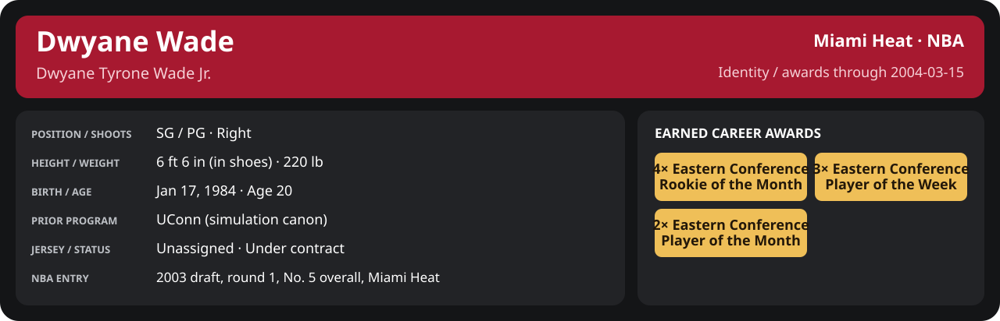

<!-- Generated by scripts/update_player_reports.py; edit source records, then rebuild. -->

# March 2004 | NBA regular season

[Career](../../../README.md) · [Professional identity](../../../Professional_Identity.md) · [Earned awards](../../../Awards.md) · [Stat definitions](../../../../../docs/player_statistics.md) · [Season](../README.md) · [Miami](../../Team/2003-04/03_March/Team_Stats.md) · [NBA players](../../League/2003-04/03_March/League_Stats.md) · [NBA awards](../../League/2003-04/03_March/League_Awards.md)

## Professional identity

| Player | Age on report date | Team / league | Position | Number | Status |
| --- | --- | --- | --- | --- | --- |
| Dwyane Tyrone Wade Jr. | 20 | Miami Heat / NBA | SG / PG | Not assigned | Under contract |

| Identity field | Recorded value |
| --- | --- |
| Birth date | 1984-01-17 |
| NBA entry | 2003 draft, round 1, No. 5 overall, Miami Heat |
| Prior program | UConn (simulation canon) |
| Height, in shoes / without shoes | 6 ft 6 in / 6 ft 4.75 in |
| Weight | 220 lb |
| Wingspan / standing reach | 6 ft 11.5 in / 8 ft 7.5 in |
| Shooting hand | Right |
| Contract | Rookie scale signed 2003-07-21: three seasons plus a 2006-07 team option |
| Role | Starter; staff plan 34 minutes |
| NBA debut | October 28, 2003 at Philadelphia 76ers (2003-04/06_Regular_Season/10_October/Week_4/Game_1.md) |
| Nationality | Not recorded |
| National team | No selection recorded |
| National-team eligibility | Not verified |
| Availability | No current restriction recorded in the established profile |
| Physical measurements recorded | 2003-06-25 |
| Professional status effective | 2003-12-01 |

Identity as of 2004-03-15; status snapshot dated 2003-12-01. User-established alternate-history player; historical Wade's biography and results are not this record.

### Earned career awards

| Award | Period | Announced | Decision record |
| --- | --- | --- | --- |
| Eastern Conference Rookie of the Month | 2003-10-28 to 2003-11-30 | 2003-12-02 | [East ROM](../../League/2003-04/11_November/League_Awards.md#rookie-of-the-month) |
| Eastern Conference Player of the Week | 2003-12-15 to 2003-12-21 | 2003-12-22 | [East POW](../../League/2003-04/12_December/Week_3/League_Awards.md#player-of-the-week) |
| Eastern Conference Player of the Month | 2003-12-01 to 2003-12-31 | 2004-01-02 | [East POM](../../League/2003-04/12_December/League_Awards.md#player-of-the-month) |
| Eastern Conference Rookie of the Month | 2003-12-01 to 2003-12-31 | 2004-01-02 | [East ROM](../../League/2003-04/12_December/League_Awards.md#rookie-of-the-month) |
| Eastern Conference Player of the Week | 2003-12-29 to 2004-01-04 | 2004-01-05 | [East POW](../../League/2003-04/01_January/Week_1/League_Awards.md#player-of-the-week) |
| Eastern Conference Player of the Month | 2004-01-01 to 2004-01-31 | 2004-02-02 | [East POM](../../League/2003-04/01_January/League_Awards.md#player-of-the-month) |
| Eastern Conference Rookie of the Month | 2004-01-01 to 2004-01-31 | 2004-02-02 | [East ROM](../../League/2003-04/01_January/League_Awards.md#rookie-of-the-month) |
| Eastern Conference Rookie of the Month | 2004-02-01 to 2004-02-29 | 2004-03-02 | [East ROM](../../League/2003-04/02_February/League_Awards.md#rookie-of-the-month) |
| Eastern Conference Player of the Week | 2004-03-08 to 2004-03-14 | 2004-03-15 | [East POW](../../League/2003-04/03_March/Week_2/League_Awards.md#player-of-the-week) |

## Statistics

As of **2004-03-15**: 7 closed games; 5/7 have player participation and box coverage; recorded DNPs: 0.

**Incomplete source coverage.** Full-period totals and rates are N/A until every closed game has a verified player box or explicit DNP. Known games remain visible below.

G counts appearances; GS counts recorded starts. DNPs, scheduled games and canceled games do not enter per-game denominators.

### Per game

  

[Shooting detail](../../Shooting.md) · [Current contract](../../Contract.md#current-contract) · [Contract history](../../Contract.md#contract-history) · [Annual award record](../../Awards.md)

| Scope | Age | Team | Lg | Pos | G | GS | MP | FG | FGA | FG% | 3P | 3PA | 3P% | 2P | 2PA | 2P% | eFG% | FT | FTA | FT% | ORB | DRB | TRB | AST | STL | BLK | TOV | PF | PTS | TS% (est.) | Awards |
| --- | --- | --- | --- | --- | --- | --- | --- | --- | --- | --- | --- | --- | --- | --- | --- | --- | --- | --- | --- | --- | --- | --- | --- | --- | --- | --- | --- | --- | --- | --- | --- |
| This scope | 20 | Miami Heat | NBA | SG / PG | N/A | N/A | N/A | N/A | N/A | N/A | N/A | N/A | N/A | N/A | N/A | N/A | N/A | N/A | N/A | N/A | N/A | N/A | N/A | N/A | N/A | N/A | N/A | N/A | N/A | N/A | [East POW](../../League/2003-04/03_March/Week_2/League_Awards.md#player-of-the-week) |

G and GS are counts; MP and counting statistics are **per appearance**. Shooting uses **.500 = 50.0%**. Age is at the row's cutoff. Scroll horizontally for every column.

Awards are confirmed through 2004-03-15, filed by the honor's period-end date; the banner shows career awards known at the page's identity cutoff.

[Full statistical detail: totals, per 36, shooting, efficiency, splits and source games](Stat_Detail.md)

### Period summary

  

[Shooting detail](../../Shooting.md) · [Current contract](../../Contract.md#current-contract) · [Contract history](../../Contract.md#contract-history) · [Annual award record](../../Awards.md)

| Scope | Age | Team | Lg | Pos | G | GS | MP | FG | FGA | FG% | 3P | 3PA | 3P% | 2P | 2PA | 2P% | eFG% | FT | FTA | FT% | ORB | DRB | TRB | AST | STL | BLK | TOV | PF | PTS | TS% (est.) | Awards |
| --- | --- | --- | --- | --- | --- | --- | --- | --- | --- | --- | --- | --- | --- | --- | --- | --- | --- | --- | --- | --- | --- | --- | --- | --- | --- | --- | --- | --- | --- | --- | --- |
| [Week 1: 2004-03-01 to 2004-03-07](Week_1/README.md) | 20 | Miami Heat | NBA | SG / PG | N/A | N/A | N/A | N/A | N/A | N/A | N/A | N/A | N/A | N/A | N/A | N/A | N/A | N/A | N/A | N/A | N/A | N/A | N/A | N/A | N/A | N/A | N/A | N/A | N/A | N/A | — |
| [Week 2: 2004-03-08 to 2004-03-14](Week_2/README.md) | 20 | Miami Heat | NBA | SG / PG | 4 | 4 | 35.4 | 8.2 | 12.5 | .660 | 1.2 | 2.0 | .625 | 7.0 | 10.5 | .667 | .710 | 5.5 | 5.8 | .957 | 0.5 | 1.8 | 2.2 | 4.5 | 1.5 | 0.8 | 0.8 | 3.8 | 23.2 | .773 | [East POW](../../League/2003-04/03_March/Week_2/League_Awards.md#player-of-the-week) |
| [Week 3: 2004-03-15 to 2004-03-21](Week_3/README.md) | 20 | Miami Heat | NBA | SG / PG | 0 | N/A | N/A | N/A | N/A | N/A | N/A | N/A | N/A | N/A | N/A | N/A | N/A | N/A | N/A | N/A | N/A | N/A | N/A | N/A | N/A | N/A | N/A | N/A | N/A | N/A | — |
| [Week 4: 2004-03-22 to 2004-03-31](Week_4/README.md) | 20 | Miami Heat | NBA | SG / PG | 0 | N/A | N/A | N/A | N/A | N/A | N/A | N/A | N/A | N/A | N/A | N/A | N/A | N/A | N/A | N/A | N/A | N/A | N/A | N/A | N/A | N/A | N/A | N/A | N/A | N/A | — |

G and GS are counts; MP and counting statistics are **per appearance**. Shooting uses **.500 = 50.0%**. Age is at the row's cutoff. Scroll horizontally for every column.

Awards are confirmed through 2004-03-15, filed by the honor's period-end date; the banner shows career awards known at the page's identity cutoff.

### Period comparison

  

[Shooting detail](../../Shooting.md) · [Current contract](../../Contract.md#current-contract) · [Contract history](../../Contract.md#contract-history) · [Annual award record](../../Awards.md)

| Scope | Age | Team | Lg | Pos | G | GS | MP | FG | FGA | FG% | 3P | 3PA | 3P% | 2P | 2PA | 2P% | eFG% | FT | FTA | FT% | ORB | DRB | TRB | AST | STL | BLK | TOV | PF | PTS | TS% (est.) | Awards |
| --- | --- | --- | --- | --- | --- | --- | --- | --- | --- | --- | --- | --- | --- | --- | --- | --- | --- | --- | --- | --- | --- | --- | --- | --- | --- | --- | --- | --- | --- | --- | --- |
| March 2004 | 20 | Miami Heat | NBA | SG / PG | N/A | N/A | N/A | N/A | N/A | N/A | N/A | N/A | N/A | N/A | N/A | N/A | N/A | N/A | N/A | N/A | N/A | N/A | N/A | N/A | N/A | N/A | N/A | N/A | N/A | N/A | [East POW](../../League/2003-04/03_March/Week_2/League_Awards.md#player-of-the-week) |
| [February 2004](../02_February/README.md) | 20 | Miami Heat | NBA | SG / PG | N/A | N/A | N/A | N/A | N/A | N/A | N/A | N/A | N/A | N/A | N/A | N/A | N/A | N/A | N/A | N/A | N/A | N/A | N/A | N/A | N/A | N/A | N/A | N/A | N/A | N/A | [East ROM](../../League/2003-04/02_February/League_Awards.md#rookie-of-the-month) |
| Season through this month | 20 | Miami Heat | NBA | SG / PG | N/A | N/A | N/A | N/A | N/A | N/A | N/A | N/A | N/A | N/A | N/A | N/A | N/A | N/A | N/A | N/A | N/A | N/A | N/A | N/A | N/A | N/A | N/A | N/A | N/A | N/A | [East ROM](../../League/2003-04/11_November/League_Awards.md#rookie-of-the-month), [East POW](../../League/2003-04/12_December/Week_3/League_Awards.md#player-of-the-week), [East POM](../../League/2003-04/12_December/League_Awards.md#player-of-the-month), [East ROM](../../League/2003-04/12_December/League_Awards.md#rookie-of-the-month), [East POW](../../League/2003-04/01_January/Week_1/League_Awards.md#player-of-the-week), [East POM](../../League/2003-04/01_January/League_Awards.md#player-of-the-month), [East ROM](../../League/2003-04/01_January/League_Awards.md#rookie-of-the-month), [East ROM](../../League/2003-04/02_February/League_Awards.md#rookie-of-the-month), [East POW](../../League/2003-04/03_March/Week_2/League_Awards.md#player-of-the-week) |

G and GS are counts; MP and counting statistics are **per appearance**. Shooting uses **.500 = 50.0%**. Age is at the row's cutoff. Scroll horizontally for every column.

Awards are confirmed through 2004-03-15, filed by the honor's period-end date; the banner shows career awards known at the page's identity cutoff.

### Production

| Metric | Total | Per appearance | Per 36 minutes |
| --- | --- | --- | --- |
| MIN | N/A | N/A | N/A |
| PTS | N/A | N/A | N/A |
| OREB | N/A | N/A | N/A |
| DREB | N/A | N/A | N/A |
| REB | N/A | N/A | N/A |
| AST | N/A | N/A | N/A |
| STL | N/A | N/A | N/A |
| BLK | N/A | N/A | N/A |
| TOV | N/A | N/A | N/A |
| PF | N/A | N/A | N/A |
| FGM | N/A | N/A | N/A |
| FGA | N/A | N/A | N/A |
| 2PM | N/A | N/A | N/A |
| 2PA | N/A | N/A | N/A |
| 3PM | N/A | N/A | N/A |
| 3PA | N/A | N/A | N/A |
| FTM | N/A | N/A | N/A |
| FTA | N/A | N/A | N/A |
| FT points | N/A | N/A | N/A |

Per-36 rates standardize playing time; they are not a projection of playing 36 minutes. Use the actual minutes denominator in every competition.

### Shooting

| Shot type | Makes | Attempts | Percentage |
| --- | --- | --- | --- |
| All field goals | N/A | N/A | N/A |
| Two-pointers | N/A | N/A | N/A |
| Three-pointers | N/A | N/A | N/A |
| Free throws | N/A | N/A | N/A |

### Efficiency and shot selection

| Metric | Value | Calculation / unit |
| --- | --- | --- |
| eFG% | N/A | (FGM + 0.5 × 3PM) / FGA |
| TS% (estimated) | N/A | PTS / [2 × (FGA + 0.44 × FTA)] |
| Three-point attempt share | N/A | 3PA / FGA |
| Free-throw attempt rate | N/A | FTA / FGA; ratio |
| Assist / turnover ratio | N/A | AST / TOV; N/A at zero turnovers |
| Plus/minus total | N/A | Observed on-court score differential only |
| Double-doubles | N/A | At least 10 in any two of PTS, REB, AST, STL, BLK |
| Triple-doubles | N/A | At least 10 in any three; also included in double-doubles |

Percentages use pooled makes and attempts. TS% uses an estimated free-throw weighting, not exact scoring possessions. Rounding is display-only.

### Splits

  

[Shooting detail](../../Shooting.md) · [Current contract](../../Contract.md#current-contract) · [Contract history](../../Contract.md#contract-history) · [Annual award record](../../Awards.md)

| Scope | Age | Team | Lg | Pos | G | GS | MP | FG | FGA | FG% | 3P | 3PA | 3P% | 2P | 2PA | 2P% | eFG% | FT | FTA | FT% | ORB | DRB | TRB | AST | STL | BLK | TOV | PF | PTS | TS% (est.) | Awards |
| --- | --- | --- | --- | --- | --- | --- | --- | --- | --- | --- | --- | --- | --- | --- | --- | --- | --- | --- | --- | --- | --- | --- | --- | --- | --- | --- | --- | --- | --- | --- | --- |
| Home | 20 | Miami Heat | NBA | SG / PG | N/A | N/A | N/A | N/A | N/A | N/A | N/A | N/A | N/A | N/A | N/A | N/A | N/A | N/A | N/A | N/A | N/A | N/A | N/A | N/A | N/A | N/A | N/A | N/A | N/A | N/A | — |
| Away | 20 | Miami Heat | NBA | SG / PG | 1 | 1 | 34.0 | 6.0 | 8.0 | .750 | 0.0 | 0.0 | N/A | 6.0 | 8.0 | .750 | .750 | 6.0 | 6.0 | 1.000 | 1.0 | 3.0 | 4.0 | 4.0 | 1.0 | 1.0 | 2.0 | 4.0 | 18.0 | .846 | — |
| Neutral | 20 | Miami Heat | NBA | SG / PG | 0 | N/A | N/A | N/A | N/A | N/A | N/A | N/A | N/A | N/A | N/A | N/A | N/A | N/A | N/A | N/A | N/A | N/A | N/A | N/A | N/A | N/A | N/A | N/A | N/A | N/A | — |
| Wins | 20 | Miami Heat | NBA | SG / PG | 3 | 3 | 35.4 | 8.7 | 11.3 | .765 | 1.7 | 2.3 | .714 | 7.0 | 9.0 | .778 | .838 | 6.3 | 6.7 | .950 | 0.3 | 2.0 | 2.3 | 4.7 | 1.3 | 0.7 | 0.7 | 4.3 | 25.3 | .888 | — |
| Losses | 20 | Miami Heat | NBA | SG / PG | 2 | 2 | 35.7 | 9.0 | 16.5 | .545 | 0.5 | 1.0 | .500 | 8.5 | 15.5 | .548 | .561 | 2.0 | 2.0 | 1.000 | 1.5 | 4.5 | 6.0 | 4.0 | 2.5 | 0.5 | 2.0 | 2.0 | 20.5 | .590 | — |
| Team: Miami Heat | 20 | Miami Heat | NBA | SG / PG | N/A | N/A | N/A | N/A | N/A | N/A | N/A | N/A | N/A | N/A | N/A | N/A | N/A | N/A | N/A | N/A | N/A | N/A | N/A | N/A | N/A | N/A | N/A | N/A | N/A | N/A | — |

G and GS are counts; MP and counting statistics are **per appearance**. Shooting uses **.500 = 50.0%**. Age is at the row's cutoff. Scroll horizontally for every column.

Awards are confirmed through 2004-03-15, filed by the honor's period-end date; the banner shows career awards known at the page's identity cutoff.

Splits overlap and are not additive. Each row has its own appearance denominator; games with unknown result classification are excluded from win/loss splits.

### Game highs

| Metric | High | Date / opponent (all ties) |
| --- | --- | --- |
| PTS | N/A | N/A |
| REB | N/A | N/A |
| AST | N/A | N/A |
| STL | N/A | N/A |
| BLK | N/A | N/A |
| TOV | N/A | N/A |

### Game log

| Date / source | Opponent | Venue | Result | Participation | MIN | PTS | REB | AST | STL | BLK | TOV |
| --- | --- | --- | --- | --- | --- | --- | --- | --- | --- | --- | --- |
| [2004-03-02](../../../2003-04/06_Regular_Season/03_March/Week_1/Game_1.md) | Toronto Raptors | home | W 86-80 | Unknown: missing player box | N/A | N/A | N/A | N/A | N/A | N/A | N/A |
| [2004-03-04](../../../2003-04/06_Regular_Season/03_March/Week_1/Game_2.md) | Milwaukee Bucks | home | L 92-99 | Unknown: missing player box | N/A | N/A | N/A | N/A | N/A | N/A | N/A |
| [2004-03-06](../../../2003-04/06_Regular_Season/03_March/Week_1/Game_3.md) | Sacramento Kings | home | L 91-92 | Played | 35.9 | 24 | 10 | 4 | 3 | 0 | 3 |
| [2004-03-09](../../../2003-04/06_Regular_Season/03_March/Week_2/Game_1.md) | Orlando Magic | home | W 108-85 | Played | 31.8 | 32 | 0 | 4 | 1 | 0 | 0 |
| [2004-03-10](../../../2003-04/06_Regular_Season/03_March/Week_2/Game_2.md) | New Orleans Hornets | away | W 108-96 | Played | 34.0 | 18 | 4 | 4 | 1 | 1 | 2 |
| [2004-03-12](../../../2003-04/06_Regular_Season/03_March/Week_2/Game_3.md) | Seattle SuperSonics | home | W 107-102 | Played | 40.3 | 26 | 3 | 6 | 2 | 1 | 0 |
| [2004-03-14](../../../2003-04/06_Regular_Season/03_March/Week_2/Game_4.md) | New Jersey Nets | home | L 95-108 | Played | 35.5 | 17 | 2 | 4 | 2 | 1 | 1 |

### Individual game boxes

| Scope | Age | Team | Lg | Pos | G | GS | MP | FG | FGA | FG% | 3P | 3PA | 3P% | 2P | 2PA | 2P% | eFG% | FT | FTA | FT% | ORB | DRB | TRB | AST | STL | BLK | TOV | PF | PTS | TS% (est.) | Awards |
| --- | --- | --- | --- | --- | --- | --- | --- | --- | --- | --- | --- | --- | --- | --- | --- | --- | --- | --- | --- | --- | --- | --- | --- | --- | --- | --- | --- | --- | --- | --- | --- |
| [2004-03-02](../../../2003-04/06_Regular_Season/03_March/Week_1/Game_1.md) | 20 | Miami Heat | NBA | SG / PG | N/A | N/A | N/A | N/A | N/A | N/A | N/A | N/A | N/A | N/A | N/A | N/A | N/A | N/A | N/A | N/A | N/A | N/A | N/A | N/A | N/A | N/A | N/A | N/A | N/A | N/A | — |
| [2004-03-04](../../../2003-04/06_Regular_Season/03_March/Week_1/Game_2.md) | 20 | Miami Heat | NBA | SG / PG | N/A | N/A | N/A | N/A | N/A | N/A | N/A | N/A | N/A | N/A | N/A | N/A | N/A | N/A | N/A | N/A | N/A | N/A | N/A | N/A | N/A | N/A | N/A | N/A | N/A | N/A | — |
| [2004-03-06](../../../2003-04/06_Regular_Season/03_March/Week_1/Game_3.md) | 20 | Miami Heat | NBA | SG / PG | 1 | 1 | 35.9 | 11.0 | 17.0 | .647 | 1.0 | 1.0 | 1.000 | 10.0 | 16.0 | .625 | .676 | 1.0 | 1.0 | 1.000 | 2.0 | 8.0 | 10.0 | 4.0 | 3.0 | 0.0 | 3.0 | 2.0 | 24.0 | .688 | — |
| [2004-03-09](../../../2003-04/06_Regular_Season/03_March/Week_2/Game_1.md) | 20 | Miami Heat | NBA | SG / PG | 1 | 1 | 31.8 | 11.0 | 14.0 | .786 | 2.0 | 3.0 | .667 | 9.0 | 11.0 | .818 | .857 | 8.0 | 9.0 | .889 | 0.0 | 0.0 | 0.0 | 4.0 | 1.0 | 0.0 | 0.0 | 5.0 | 32.0 | .891 | — |
| [2004-03-10](../../../2003-04/06_Regular_Season/03_March/Week_2/Game_2.md) | 20 | Miami Heat | NBA | SG / PG | 1 | 1 | 34.0 | 6.0 | 8.0 | .750 | 0.0 | 0.0 | N/A | 6.0 | 8.0 | .750 | .750 | 6.0 | 6.0 | 1.000 | 1.0 | 3.0 | 4.0 | 4.0 | 1.0 | 1.0 | 2.0 | 4.0 | 18.0 | .846 | — |
| [2004-03-12](../../../2003-04/06_Regular_Season/03_March/Week_2/Game_3.md) | 20 | Miami Heat | NBA | SG / PG | 1 | 1 | 40.3 | 9.0 | 12.0 | .750 | 3.0 | 4.0 | .750 | 6.0 | 8.0 | .750 | .875 | 5.0 | 5.0 | 1.000 | 0.0 | 3.0 | 3.0 | 6.0 | 2.0 | 1.0 | 0.0 | 4.0 | 26.0 | .915 | — |
| [2004-03-14](../../../2003-04/06_Regular_Season/03_March/Week_2/Game_4.md) | 20 | Miami Heat | NBA | SG / PG | 1 | 1 | 35.5 | 7.0 | 16.0 | .438 | 0.0 | 1.0 | .000 | 7.0 | 15.0 | .467 | .438 | 3.0 | 3.0 | 1.000 | 1.0 | 1.0 | 2.0 | 4.0 | 2.0 | 1.0 | 1.0 | 2.0 | 17.0 | .491 | — |

G and GS are counts; MP and counting statistics are **per appearance**. Shooting uses **.500 = 50.0%**. Age is at the row's cutoff. Scroll horizontally for every column.

Awards are confirmed through 2004-03-15, filed by the honor's period-end date; the banner shows career awards known at the page's identity cutoff.

### Game shooting detail

| Date / source | FG | 2P | 3P | FT | eFG% | TS% (est.) | +/- | PF |
| --- | --- | --- | --- | --- | --- | --- | --- | --- |
| [2004-03-06](../../../2003-04/06_Regular_Season/03_March/Week_1/Game_3.md) | 11/17 | 10/16 | 1/1 | 1/1 | 67.6% | 68.8% | N/A | 2 |
| [2004-03-09](../../../2003-04/06_Regular_Season/03_March/Week_2/Game_1.md) | 11/14 | 9/11 | 2/3 | 8/9 | 85.7% | 89.1% | N/A | 5 |
| [2004-03-10](../../../2003-04/06_Regular_Season/03_March/Week_2/Game_2.md) | 6/8 | 6/8 | 0/0 | 6/6 | 75.0% | 84.6% | N/A | 4 |
| [2004-03-12](../../../2003-04/06_Regular_Season/03_March/Week_2/Game_3.md) | 9/12 | 6/8 | 3/4 | 5/5 | 87.5% | 91.5% | N/A | 4 |
| [2004-03-14](../../../2003-04/06_Regular_Season/03_March/Week_2/Game_4.md) | 7/16 | 7/15 | 0/1 | 3/3 | 43.8% | 49.1% | N/A | 2 |

### Additional data needed

| Statistic family | Current support | Required evidence |
| --- | --- | --- |
| Starts; plus/minus | N/A unless supplied in the player box | Explicit started and plus_minus fields |
| Per 100 possessions; offensive / defensive / net rating | Unavailable in current box feed | Player on-court possessions and both teams' scoring during those possessions |
| USG%; AST%; OREB%, DREB%, REB% | Unavailable in current box feed | Matching player/team/opponent opportunity counts and a declared method |
| Rim, paint, midrange, corner / above-break threes | Unavailable in current box feed | Shot locations, attempts and makes |
| Drives, touches, catch-and-shoot, pull-ups, play types | Unavailable in current box feed | Tracking or tagged play-by-play |
| Clutch, on/off, lineup combinations, assisted baskets | Unavailable in current box feed | Timed events, score state, substitutions and possession attribution |
| Deflections, charges, contested shots, box outs | Unavailable in current box feed | Observed hustle/defensive events |
| League rank, percentile, relative TS%; impact models | Not derived by this report | Same-period simulated league baseline, eligibility rules and documented model |

### Awards

No NBA awards recorded for this period. [Conference and league award record](../../League/2003-04/03_March/League_Awards.md).
