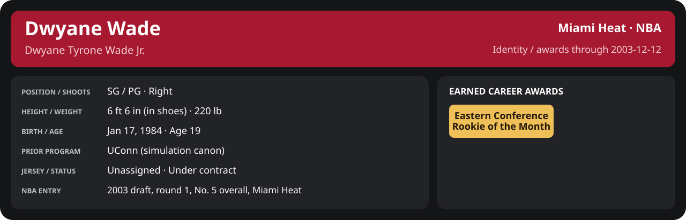

<!-- Generated by scripts/update_player_reports.py; edit source records, then rebuild. -->

# December 2003 | Detailed statistics

[Month summary](README.md) · [Career](../../../README.md) · [Professional identity](../../../Professional_Identity.md) · [Earned awards](../../../Awards.md) · [Stat definitions](../../../../../docs/player_statistics.md)

## Professional identity

| Player | Age on report date | Team / league | Position | Number | Status |
| --- | --- | --- | --- | --- | --- |
| Dwyane Tyrone Wade Jr. | 19 | Miami Heat / NBA | SG / PG | Not assigned | Under contract |

| Identity field | Recorded value |
| --- | --- |
| Birth date | 1984-01-17 |
| NBA entry | 2003 draft, round 1, No. 5 overall, Miami Heat |
| Prior program | UConn (simulation canon) |
| Height, in shoes / without shoes | 6 ft 6 in / 6 ft 4.75 in |
| Weight | 220 lb |
| Wingspan / standing reach | 6 ft 11.5 in / 8 ft 7.5 in |
| Shooting hand | Right |
| Contract | Rookie scale signed 2003-07-21: three seasons plus a 2006-07 team option |
| Role | Starter; staff plan 34 minutes |
| NBA debut | October 28, 2003 at Philadelphia 76ers (2003-04/06_Regular_Season/10_October/Week_4/Game_1.md) |
| Nationality | Not recorded |
| National team | No selection recorded |
| National-team eligibility | Not verified |
| Availability | No current restriction recorded in the established profile |
| Physical measurements recorded | 2003-06-25 |
| Professional status effective | 2003-12-01 |

Identity as of 2003-12-12; status snapshot dated 2003-12-01. User-established alternate-history player; historical Wade's biography and results are not this record.

### Earned career awards

| Award | Period | Announced | Decision record |
| --- | --- | --- | --- |
| Eastern Conference Rookie of the Month | 2003-10-28 to 2003-11-30 | 2003-12-02 | [East ROM](../../League/2003-04/11_November/League_Awards.md#rookie-of-the-month) |

## Statistics

As of **2003-12-12**: 5 closed games; 5/5 have player participation and box coverage; recorded DNPs: 0.

G counts appearances; GS counts recorded starts. DNPs, scheduled games and canceled games do not enter per-game denominators.

### Per game

  

[Shooting detail](../../Shooting.md) · [Current contract](../../Contract.md#current-contract) · [Contract history](../../Contract.md#contract-history) · [Annual award record](../../Awards.md)

| Scope | Age | Team | Lg | Pos | G | GS | MP | FG | FGA | FG% | 3P | 3PA | 3P% | 2P | 2PA | 2P% | eFG% | FT | FTA | FT% | ORB | DRB | TRB | AST | STL | BLK | TOV | PF | PTS | TS% (est.) | Awards |
| --- | --- | --- | --- | --- | --- | --- | --- | --- | --- | --- | --- | --- | --- | --- | --- | --- | --- | --- | --- | --- | --- | --- | --- | --- | --- | --- | --- | --- | --- | --- | --- |
| This scope | 19 | Miami Heat | NBA | SG / PG | 5 | 5 | 37.7 | 6.4 | 14.2 | .451 | 1.6 | 3.2 | .500 | 4.8 | 11.0 | .436 | .507 | 4.0 | 4.6 | .870 | 0.8 | 3.8 | 4.6 | 5.2 | 2.4 | 0.6 | 1.0 | 3.4 | 18.4 | .567 | — |

G and GS are counts; MP and counting statistics are **per appearance**. Shooting uses **.500 = 50.0%**. Age is at the row's cutoff. Scroll horizontally for every column.

Awards are confirmed through 2003-12-12, filed by the honor's period-end date; the banner shows career awards known at the page's identity cutoff.

### Production

| Metric | Total | Per appearance | Per 36 minutes |
| --- | --- | --- | --- |
| MIN | 188.3 | 37.7 | 36.0 |
| PTS | 92 | 18.4 | 17.6 |
| OREB | 4 | 0.8 | 0.8 |
| DREB | 19 | 3.8 | 3.6 |
| REB | 23 | 4.6 | 4.4 |
| AST | 26 | 5.2 | 5.0 |
| STL | 12 | 2.4 | 2.3 |
| BLK | 3 | 0.6 | 0.6 |
| TOV | 5 | 1.0 | 1.0 |
| PF | 17 | 3.4 | 3.3 |
| FGM | 32 | 6.4 | 6.1 |
| FGA | 71 | 14.2 | 13.6 |
| 2PM | 24 | 4.8 | 4.6 |
| 2PA | 55 | 11.0 | 10.5 |
| 3PM | 8 | 1.6 | 1.5 |
| 3PA | 16 | 3.2 | 3.1 |
| FTM | 20 | 4.0 | 3.8 |
| FTA | 23 | 4.6 | 4.4 |
| FT points | 20 | 4.0 | 3.8 |

Per-36 rates standardize playing time; they are not a projection of playing 36 minutes. Use the actual minutes denominator in every competition.

### Shooting

| Shot type | Makes | Attempts | Percentage |
| --- | --- | --- | --- |
| All field goals | 32 | 71 | 45.1% |
| Two-pointers | 24 | 55 | 43.6% |
| Three-pointers | 8 | 16 | 50.0% |
| Free throws | 20 | 23 | 87.0% |

### Efficiency and shot selection

| Metric | Value | Calculation / unit |
| --- | --- | --- |
| eFG% | 50.7% | (FGM + 0.5 × 3PM) / FGA |
| TS% (estimated) | 56.7% | PTS / [2 × (FGA + 0.44 × FTA)] |
| Three-point attempt share | 22.5% | 3PA / FGA |
| Free-throw attempt rate | 0.324 | FTA / FGA; ratio |
| Assist / turnover ratio | 5.20 | AST / TOV; N/A at zero turnovers |
| Plus/minus total | N/A | Observed on-court score differential only |
| Double-doubles | 0 | At least 10 in any two of PTS, REB, AST, STL, BLK |
| Triple-doubles | 0 | At least 10 in any three; also included in double-doubles |

Percentages use pooled makes and attempts. TS% uses an estimated free-throw weighting, not exact scoring possessions. Rounding is display-only.

### Splits

  

[Shooting detail](../../Shooting.md) · [Current contract](../../Contract.md#current-contract) · [Contract history](../../Contract.md#contract-history) · [Annual award record](../../Awards.md)

| Scope | Age | Team | Lg | Pos | G | GS | MP | FG | FGA | FG% | 3P | 3PA | 3P% | 2P | 2PA | 2P% | eFG% | FT | FTA | FT% | ORB | DRB | TRB | AST | STL | BLK | TOV | PF | PTS | TS% (est.) | Awards |
| --- | --- | --- | --- | --- | --- | --- | --- | --- | --- | --- | --- | --- | --- | --- | --- | --- | --- | --- | --- | --- | --- | --- | --- | --- | --- | --- | --- | --- | --- | --- | --- |
| Home | 19 | Miami Heat | NBA | SG / PG | 4 | 4 | 37.8 | 6.2 | 14.2 | .439 | 1.8 | 3.5 | .500 | 4.5 | 10.8 | .419 | .500 | 4.0 | 4.8 | .842 | 1.0 | 3.5 | 4.5 | 4.2 | 2.2 | 0.8 | 1.0 | 4.0 | 18.2 | .558 | — |
| Away | 19 | Miami Heat | NBA | SG / PG | 1 | 1 | 37.2 | 7.0 | 14.0 | .500 | 1.0 | 2.0 | .500 | 6.0 | 12.0 | .500 | .536 | 4.0 | 4.0 | 1.000 | 0.0 | 5.0 | 5.0 | 9.0 | 3.0 | 0.0 | 1.0 | 1.0 | 19.0 | .603 | — |
| Neutral | 19 | Miami Heat | NBA | SG / PG | 0 | N/A | N/A | N/A | N/A | N/A | N/A | N/A | N/A | N/A | N/A | N/A | N/A | N/A | N/A | N/A | N/A | N/A | N/A | N/A | N/A | N/A | N/A | N/A | N/A | N/A | — |
| Wins | 19 | Miami Heat | NBA | SG / PG | 1 | 1 | 26.9 | 5.0 | 12.0 | .417 | 1.0 | 3.0 | .333 | 4.0 | 9.0 | .444 | .458 | 5.0 | 6.0 | .833 | 2.0 | 2.0 | 4.0 | 0.0 | 1.0 | 0.0 | 2.0 | 5.0 | 16.0 | .546 | — |
| Losses | 19 | Miami Heat | NBA | SG / PG | 4 | 4 | 40.3 | 6.8 | 14.8 | .458 | 1.8 | 3.2 | .538 | 5.0 | 11.5 | .435 | .517 | 3.8 | 4.2 | .882 | 0.5 | 4.2 | 4.8 | 6.5 | 2.8 | 0.8 | 0.8 | 3.0 | 19.0 | .572 | — |
| Team: Miami Heat | 19 | Miami Heat | NBA | SG / PG | 5 | 5 | 37.7 | 6.4 | 14.2 | .451 | 1.6 | 3.2 | .500 | 4.8 | 11.0 | .436 | .507 | 4.0 | 4.6 | .870 | 0.8 | 3.8 | 4.6 | 5.2 | 2.4 | 0.6 | 1.0 | 3.4 | 18.4 | .567 | — |

G and GS are counts; MP and counting statistics are **per appearance**. Shooting uses **.500 = 50.0%**. Age is at the row's cutoff. Scroll horizontally for every column.

Awards are confirmed through 2003-12-12, filed by the honor's period-end date; the banner shows career awards known at the page's identity cutoff.

Splits overlap and are not additive. Each row has its own appearance denominator; games with unknown result classification are excluded from win/loss splits.

### Game highs

| Metric | High | Date / opponent (all ties) |
| --- | --- | --- |
| PTS | 24 | [2003-12-12 vs Memphis Grizzlies](../../../2003-04/06_Regular_Season/12_December/Week_2/Game_2.md) |
| REB | 6 | [2003-12-12 vs Memphis Grizzlies](../../../2003-04/06_Regular_Season/12_December/Week_2/Game_2.md) |
| AST | 9 | [2003-12-03 at Detroit Pistons](../../../2003-04/06_Regular_Season/12_December/Week_1/Game_1.md) |
| STL | 5 | [2003-12-12 vs Memphis Grizzlies](../../../2003-04/06_Regular_Season/12_December/Week_2/Game_2.md) |
| BLK | 2 | [2003-12-09 vs Phoenix Suns](../../../2003-04/06_Regular_Season/12_December/Week_2/Game_1.md) |
| TOV | 2 | [2003-12-06 vs San Antonio Spurs](../../../2003-04/06_Regular_Season/12_December/Week_1/Game_3.md) |

### Game log

| Date / source | Opponent | Venue | Result | Participation | MIN | PTS | REB | AST | STL | BLK | TOV |
| --- | --- | --- | --- | --- | --- | --- | --- | --- | --- | --- | --- |
| [2003-12-03](../../../2003-04/06_Regular_Season/12_December/Week_1/Game_1.md) | Detroit Pistons | away | L 84-89 | Played | 37.2 | 19 | 5 | 9 | 3 | 0 | 1 |
| [2003-12-05](../../../2003-04/06_Regular_Season/12_December/Week_1/Game_2.md) | Philadelphia 76ers | home | L 82-86 | Played | 38.5 | 19 | 5 | 6 | 3 | 1 | 1 |
| [2003-12-06](../../../2003-04/06_Regular_Season/12_December/Week_1/Game_3.md) | San Antonio Spurs | home | W 100-89 | Played | 26.9 | 16 | 4 | 0 | 1 | 0 | 2 |
| [2003-12-09](../../../2003-04/06_Regular_Season/12_December/Week_2/Game_1.md) | Phoenix Suns | home | L 106-110 | Played | 37.7 | 14 | 3 | 7 | 0 | 2 | 0 |
| [2003-12-12](../../../2003-04/06_Regular_Season/12_December/Week_2/Game_2.md) | Memphis Grizzlies | home | L 100-102 | Played | 48.0 | 24 | 6 | 4 | 5 | 0 | 1 |

### Individual game boxes

| Scope | Age | Team | Lg | Pos | G | GS | MP | FG | FGA | FG% | 3P | 3PA | 3P% | 2P | 2PA | 2P% | eFG% | FT | FTA | FT% | ORB | DRB | TRB | AST | STL | BLK | TOV | PF | PTS | TS% (est.) | Awards |
| --- | --- | --- | --- | --- | --- | --- | --- | --- | --- | --- | --- | --- | --- | --- | --- | --- | --- | --- | --- | --- | --- | --- | --- | --- | --- | --- | --- | --- | --- | --- | --- |
| [2003-12-03](../../../2003-04/06_Regular_Season/12_December/Week_1/Game_1.md) | 19 | Miami Heat | NBA | SG / PG | 1 | 1 | 37.2 | 7.0 | 14.0 | .500 | 1.0 | 2.0 | .500 | 6.0 | 12.0 | .500 | .536 | 4.0 | 4.0 | 1.000 | 0.0 | 5.0 | 5.0 | 9.0 | 3.0 | 0.0 | 1.0 | 1.0 | 19.0 | .603 | — |
| [2003-12-05](../../../2003-04/06_Regular_Season/12_December/Week_1/Game_2.md) | 19 | Miami Heat | NBA | SG / PG | 1 | 1 | 38.5 | 7.0 | 16.0 | .438 | 1.0 | 2.0 | .500 | 6.0 | 14.0 | .429 | .469 | 4.0 | 6.0 | .667 | 1.0 | 4.0 | 5.0 | 6.0 | 3.0 | 1.0 | 1.0 | 3.0 | 19.0 | .510 | — |
| [2003-12-06](../../../2003-04/06_Regular_Season/12_December/Week_1/Game_3.md) | 19 | Miami Heat | NBA | SG / PG | 1 | 1 | 26.9 | 5.0 | 12.0 | .417 | 1.0 | 3.0 | .333 | 4.0 | 9.0 | .444 | .458 | 5.0 | 6.0 | .833 | 2.0 | 2.0 | 4.0 | 0.0 | 1.0 | 0.0 | 2.0 | 5.0 | 16.0 | .546 | — |
| [2003-12-09](../../../2003-04/06_Regular_Season/12_December/Week_2/Game_1.md) | 19 | Miami Heat | NBA | SG / PG | 1 | 1 | 37.7 | 4.0 | 12.0 | .333 | 2.0 | 4.0 | .500 | 2.0 | 8.0 | .250 | .417 | 4.0 | 4.0 | 1.000 | 1.0 | 2.0 | 3.0 | 7.0 | 0.0 | 2.0 | 0.0 | 4.0 | 14.0 | .509 | — |
| [2003-12-12](../../../2003-04/06_Regular_Season/12_December/Week_2/Game_2.md) | 19 | Miami Heat | NBA | SG / PG | 1 | 1 | 48.0 | 9.0 | 17.0 | .529 | 3.0 | 5.0 | .600 | 6.0 | 12.0 | .500 | .618 | 3.0 | 3.0 | 1.000 | 0.0 | 6.0 | 6.0 | 4.0 | 5.0 | 0.0 | 1.0 | 4.0 | 24.0 | .655 | — |

G and GS are counts; MP and counting statistics are **per appearance**. Shooting uses **.500 = 50.0%**. Age is at the row's cutoff. Scroll horizontally for every column.

Awards are confirmed through 2003-12-12, filed by the honor's period-end date; the banner shows career awards known at the page's identity cutoff.

### Game shooting detail

| Date / source | FG | 2P | 3P | FT | eFG% | TS% (est.) | +/- | PF |
| --- | --- | --- | --- | --- | --- | --- | --- | --- |
| [2003-12-03](../../../2003-04/06_Regular_Season/12_December/Week_1/Game_1.md) | 7/14 | 6/12 | 1/2 | 4/4 | 53.6% | 60.3% | N/A | 1 |
| [2003-12-05](../../../2003-04/06_Regular_Season/12_December/Week_1/Game_2.md) | 7/16 | 6/14 | 1/2 | 4/6 | 46.9% | 51.0% | N/A | 3 |
| [2003-12-06](../../../2003-04/06_Regular_Season/12_December/Week_1/Game_3.md) | 5/12 | 4/9 | 1/3 | 5/6 | 45.8% | 54.6% | N/A | 5 |
| [2003-12-09](../../../2003-04/06_Regular_Season/12_December/Week_2/Game_1.md) | 4/12 | 2/8 | 2/4 | 4/4 | 41.7% | 50.9% | N/A | 4 |
| [2003-12-12](../../../2003-04/06_Regular_Season/12_December/Week_2/Game_2.md) | 9/17 | 6/12 | 3/5 | 3/3 | 61.8% | 65.5% | N/A | 4 |

### Additional data needed

| Statistic family | Current support | Required evidence |
| --- | --- | --- |
| Starts; plus/minus | N/A unless supplied in the player box | Explicit started and plus_minus fields |
| Per 100 possessions; offensive / defensive / net rating | Unavailable in current box feed | Player on-court possessions and both teams' scoring during those possessions |
| USG%; AST%; OREB%, DREB%, REB% | Unavailable in current box feed | Matching player/team/opponent opportunity counts and a declared method |
| Rim, paint, midrange, corner / above-break threes | Unavailable in current box feed | Shot locations, attempts and makes |
| Drives, touches, catch-and-shoot, pull-ups, play types | Unavailable in current box feed | Tracking or tagged play-by-play |
| Clutch, on/off, lineup combinations, assisted baskets | Unavailable in current box feed | Timed events, score state, substitutions and possession attribution |
| Deflections, charges, contested shots, box outs | Unavailable in current box feed | Observed hustle/defensive events |
| League rank, percentile, relative TS%; impact models | Not derived by this report | Same-period simulated league baseline, eligibility rules and documented model |
