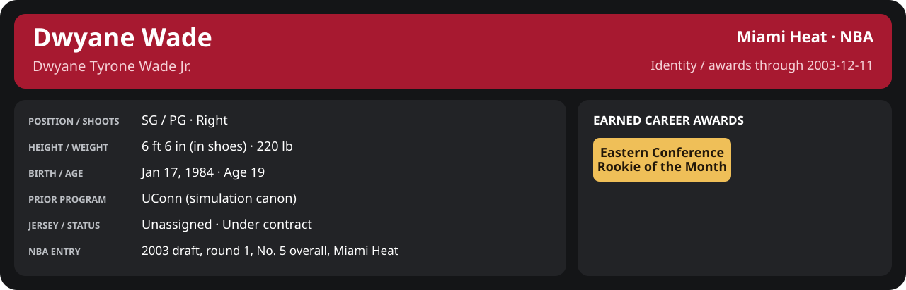

<!-- Generated by scripts/update_player_reports.py; edit source records, then rebuild. -->

# Week 2: 2003-12-08 to 2003-12-14

[Career](../../../../README.md) · [Professional identity](../../../../Professional_Identity.md) · [Earned awards](../../../../Awards.md) · [Stat definitions](../../../../../../docs/player_statistics.md) · [Month](../README.md) · [Miami](../../../Team/2003-04/12_December/Week_2/Team_Stats.md) · [NBA players](../../../League/2003-04/12_December/Week_2/League_Stats.md) · [NBA awards](../../../League/2003-04/12_December/Week_2/League_Awards.md) · [Period decisions](../../../../2003-04/06_Regular_Season/12_December/Week_2/note.md) · [Previous week](../Week_1/README.md) · [Next week](../Week_3/README.md)

## Professional identity

| Player | Age on report date | Team / league | Position | Number | Status |
| --- | --- | --- | --- | --- | --- |
| Dwyane Tyrone Wade Jr. | 19 | Miami Heat / NBA | SG / PG | Not assigned | Under contract |

| Identity field | Recorded value |
| --- | --- |
| Birth date | 1984-01-17 |
| NBA entry | 2003 draft, round 1, No. 5 overall, Miami Heat |
| Prior program | UConn (simulation canon) |
| Height, in shoes / without shoes | 6 ft 6 in / 6 ft 4.75 in |
| Weight | 220 lb |
| Wingspan / standing reach | 6 ft 11.5 in / 8 ft 7.5 in |
| Shooting hand | Right |
| Contract | Rookie scale signed 2003-07-21: three seasons plus a 2006-07 team option |
| Role | Starter; staff plan 34 minutes |
| NBA debut | October 28, 2003 at Philadelphia 76ers (2003-04/06_Regular_Season/10_October/Week_4/Game_1.md) |
| Nationality | Not recorded |
| National team | No selection recorded |
| National-team eligibility | Not verified |
| Availability | No current restriction recorded in the established profile |
| Physical measurements recorded | 2003-06-25 |
| Professional status effective | 2003-12-01 |

Identity as of 2003-12-11; status snapshot dated 2003-12-01. User-established alternate-history player; historical Wade's biography and results are not this record.

### Earned career awards

| Award | Period | Announced | Decision record |
| --- | --- | --- | --- |
| Eastern Conference Rookie of the Month | 2003-10-28 to 2003-11-30 | 2003-12-02 | [East ROM](../../../League/2003-04/11_November/League_Awards.md#rookie-of-the-month) |

## Statistics

As of **2003-12-11**: 1 closed games; 1/1 have player participation and box coverage; recorded DNPs: 0.

G counts appearances; GS counts recorded starts. DNPs, scheduled games and canceled games do not enter per-game denominators.

### Per game

  

[Shooting detail](../../../Shooting.md) · [Current contract](../../../Contract.md#current-contract) · [Contract history](../../../Contract.md#contract-history) · [Annual award record](../../../Awards.md)

| Scope | Age | Team | Lg | Pos | G | GS | MP | FG | FGA | FG% | 3P | 3PA | 3P% | 2P | 2PA | 2P% | eFG% | FT | FTA | FT% | ORB | DRB | TRB | AST | STL | BLK | TOV | PF | PTS | TS% (est.) | Awards |
| --- | --- | --- | --- | --- | --- | --- | --- | --- | --- | --- | --- | --- | --- | --- | --- | --- | --- | --- | --- | --- | --- | --- | --- | --- | --- | --- | --- | --- | --- | --- | --- |
| This scope | 19 | Miami Heat | NBA | SG / PG | 1 | 1 | 37.7 | 4.0 | 12.0 | .333 | 2.0 | 4.0 | .500 | 2.0 | 8.0 | .250 | .417 | 4.0 | 4.0 | 1.000 | 1.0 | 2.0 | 3.0 | 7.0 | 0.0 | 2.0 | 0.0 | 4.0 | 14.0 | .509 | — |

G and GS are counts; MP and counting statistics are **per appearance**. Shooting uses **.500 = 50.0%**. Age is at the row's cutoff. Scroll horizontally for every column.

Awards are confirmed through 2003-12-11, filed by the honor's period-end date; the banner shows career awards known at the page's identity cutoff.

[Full statistical detail: totals, per 36, shooting, efficiency, splits and source games](Stat_Detail.md)

### Period comparison

  

[Shooting detail](../../../Shooting.md) · [Current contract](../../../Contract.md#current-contract) · [Contract history](../../../Contract.md#contract-history) · [Annual award record](../../../Awards.md)

| Scope | Age | Team | Lg | Pos | G | GS | MP | FG | FGA | FG% | 3P | 3PA | 3P% | 2P | 2PA | 2P% | eFG% | FT | FTA | FT% | ORB | DRB | TRB | AST | STL | BLK | TOV | PF | PTS | TS% (est.) | Awards |
| --- | --- | --- | --- | --- | --- | --- | --- | --- | --- | --- | --- | --- | --- | --- | --- | --- | --- | --- | --- | --- | --- | --- | --- | --- | --- | --- | --- | --- | --- | --- | --- |
| This week | 19 | Miami Heat | NBA | SG / PG | 1 | 1 | 37.7 | 4.0 | 12.0 | .333 | 2.0 | 4.0 | .500 | 2.0 | 8.0 | .250 | .417 | 4.0 | 4.0 | 1.000 | 1.0 | 2.0 | 3.0 | 7.0 | 0.0 | 2.0 | 0.0 | 4.0 | 14.0 | .509 | — |
| [Previous week](../Week_1/README.md) | 19 | Miami Heat | NBA | SG / PG | 3 | 3 | 34.2 | 6.3 | 14.0 | .452 | 1.0 | 2.3 | .429 | 5.3 | 11.7 | .457 | .488 | 4.3 | 5.3 | .812 | 1.0 | 3.7 | 4.7 | 5.0 | 2.3 | 0.3 | 1.3 | 3.0 | 18.0 | .551 | — |
| Month through this week | 19 | Miami Heat | NBA | SG / PG | 4 | 4 | 35.1 | 5.8 | 13.5 | .426 | 1.2 | 2.8 | .455 | 4.5 | 10.8 | .419 | .472 | 4.2 | 5.0 | .850 | 1.0 | 3.2 | 4.2 | 5.5 | 1.8 | 0.8 | 1.0 | 3.2 | 17.0 | .541 | — |
| Season through this week | 19 | Miami Heat | NBA | SG / PG | 21 | 16 | 33.0 | 5.4 | 11.0 | .494 | 0.7 | 2.3 | .306 | 4.7 | 8.7 | .544 | .526 | 4.2 | 4.6 | .907 | 1.4 | 3.3 | 4.7 | 4.5 | 1.4 | 0.7 | 1.1 | 2.8 | 15.8 | .605 | [East ROM](../../../League/2003-04/11_November/League_Awards.md#rookie-of-the-month) |

G and GS are counts; MP and counting statistics are **per appearance**. Shooting uses **.500 = 50.0%**. Age is at the row's cutoff. Scroll horizontally for every column.

Awards are confirmed through 2003-12-11, filed by the honor's period-end date; the banner shows career awards known at the page's identity cutoff.

### Production

| Metric | Total | Per appearance | Per 36 minutes |
| --- | --- | --- | --- |
| MIN | 37.7 | 37.7 | 36.0 |
| PTS | 14 | 14.0 | 13.4 |
| OREB | 1 | 1.0 | 1.0 |
| DREB | 2 | 2.0 | 1.9 |
| REB | 3 | 3.0 | 2.9 |
| AST | 7 | 7.0 | 6.7 |
| STL | 0 | 0.0 | 0.0 |
| BLK | 2 | 2.0 | 1.9 |
| TOV | 0 | 0.0 | 0.0 |
| PF | 4 | 4.0 | 3.8 |
| FGM | 4 | 4.0 | 3.8 |
| FGA | 12 | 12.0 | 11.5 |
| 2PM | 2 | 2.0 | 1.9 |
| 2PA | 8 | 8.0 | 7.6 |
| 3PM | 2 | 2.0 | 1.9 |
| 3PA | 4 | 4.0 | 3.8 |
| FTM | 4 | 4.0 | 3.8 |
| FTA | 4 | 4.0 | 3.8 |
| FT points | 4 | 4.0 | 3.8 |

Per-36 rates standardize playing time; they are not a projection of playing 36 minutes. Use the actual minutes denominator in every competition.

### Shooting

| Shot type | Makes | Attempts | Percentage |
| --- | --- | --- | --- |
| All field goals | 4 | 12 | 33.3% |
| Two-pointers | 2 | 8 | 25.0% |
| Three-pointers | 2 | 4 | 50.0% |
| Free throws | 4 | 4 | 100.0% |

### Efficiency and shot selection

| Metric | Value | Calculation / unit |
| --- | --- | --- |
| eFG% | 41.7% | (FGM + 0.5 × 3PM) / FGA |
| TS% (estimated) | 50.9% | PTS / [2 × (FGA + 0.44 × FTA)] |
| Three-point attempt share | 33.3% | 3PA / FGA |
| Free-throw attempt rate | 0.333 | FTA / FGA; ratio |
| Assist / turnover ratio | N/A | AST / TOV; N/A at zero turnovers |
| Plus/minus total | N/A | Observed on-court score differential only |
| Double-doubles | 0 | At least 10 in any two of PTS, REB, AST, STL, BLK |
| Triple-doubles | 0 | At least 10 in any three; also included in double-doubles |

Percentages use pooled makes and attempts. TS% uses an estimated free-throw weighting, not exact scoring possessions. Rounding is display-only.

### Splits

  

[Shooting detail](../../../Shooting.md) · [Current contract](../../../Contract.md#current-contract) · [Contract history](../../../Contract.md#contract-history) · [Annual award record](../../../Awards.md)

| Scope | Age | Team | Lg | Pos | G | GS | MP | FG | FGA | FG% | 3P | 3PA | 3P% | 2P | 2PA | 2P% | eFG% | FT | FTA | FT% | ORB | DRB | TRB | AST | STL | BLK | TOV | PF | PTS | TS% (est.) | Awards |
| --- | --- | --- | --- | --- | --- | --- | --- | --- | --- | --- | --- | --- | --- | --- | --- | --- | --- | --- | --- | --- | --- | --- | --- | --- | --- | --- | --- | --- | --- | --- | --- |
| Home | 19 | Miami Heat | NBA | SG / PG | 1 | 1 | 37.7 | 4.0 | 12.0 | .333 | 2.0 | 4.0 | .500 | 2.0 | 8.0 | .250 | .417 | 4.0 | 4.0 | 1.000 | 1.0 | 2.0 | 3.0 | 7.0 | 0.0 | 2.0 | 0.0 | 4.0 | 14.0 | .509 | — |
| Away | 19 | Miami Heat | NBA | SG / PG | 0 | N/A | N/A | N/A | N/A | N/A | N/A | N/A | N/A | N/A | N/A | N/A | N/A | N/A | N/A | N/A | N/A | N/A | N/A | N/A | N/A | N/A | N/A | N/A | N/A | N/A | — |
| Neutral | 19 | Miami Heat | NBA | SG / PG | 0 | N/A | N/A | N/A | N/A | N/A | N/A | N/A | N/A | N/A | N/A | N/A | N/A | N/A | N/A | N/A | N/A | N/A | N/A | N/A | N/A | N/A | N/A | N/A | N/A | N/A | — |
| Wins | 19 | Miami Heat | NBA | SG / PG | 0 | N/A | N/A | N/A | N/A | N/A | N/A | N/A | N/A | N/A | N/A | N/A | N/A | N/A | N/A | N/A | N/A | N/A | N/A | N/A | N/A | N/A | N/A | N/A | N/A | N/A | — |
| Losses | 19 | Miami Heat | NBA | SG / PG | 1 | 1 | 37.7 | 4.0 | 12.0 | .333 | 2.0 | 4.0 | .500 | 2.0 | 8.0 | .250 | .417 | 4.0 | 4.0 | 1.000 | 1.0 | 2.0 | 3.0 | 7.0 | 0.0 | 2.0 | 0.0 | 4.0 | 14.0 | .509 | — |
| Team: Miami Heat | 19 | Miami Heat | NBA | SG / PG | 1 | 1 | 37.7 | 4.0 | 12.0 | .333 | 2.0 | 4.0 | .500 | 2.0 | 8.0 | .250 | .417 | 4.0 | 4.0 | 1.000 | 1.0 | 2.0 | 3.0 | 7.0 | 0.0 | 2.0 | 0.0 | 4.0 | 14.0 | .509 | — |

G and GS are counts; MP and counting statistics are **per appearance**. Shooting uses **.500 = 50.0%**. Age is at the row's cutoff. Scroll horizontally for every column.

Awards are confirmed through 2003-12-11, filed by the honor's period-end date; the banner shows career awards known at the page's identity cutoff.

Splits overlap and are not additive. Each row has its own appearance denominator; games with unknown result classification are excluded from win/loss splits.

### Game highs

| Metric | High | Date / opponent (all ties) |
| --- | --- | --- |
| PTS | 14 | [2003-12-09 vs Phoenix Suns](../../../../2003-04/06_Regular_Season/12_December/Week_2/Game_1.md) |
| REB | 3 | [2003-12-09 vs Phoenix Suns](../../../../2003-04/06_Regular_Season/12_December/Week_2/Game_1.md) |
| AST | 7 | [2003-12-09 vs Phoenix Suns](../../../../2003-04/06_Regular_Season/12_December/Week_2/Game_1.md) |
| STL | 0 | [2003-12-09 vs Phoenix Suns](../../../../2003-04/06_Regular_Season/12_December/Week_2/Game_1.md) |
| BLK | 2 | [2003-12-09 vs Phoenix Suns](../../../../2003-04/06_Regular_Season/12_December/Week_2/Game_1.md) |
| TOV | 0 | [2003-12-09 vs Phoenix Suns](../../../../2003-04/06_Regular_Season/12_December/Week_2/Game_1.md) |

### Game log

| Date / source | Opponent | Venue | Result | Participation | MIN | PTS | REB | AST | STL | BLK | TOV |
| --- | --- | --- | --- | --- | --- | --- | --- | --- | --- | --- | --- |
| [2003-12-09](../../../../2003-04/06_Regular_Season/12_December/Week_2/Game_1.md) | Phoenix Suns | home | L 106-110 | Played | 37.7 | 14 | 3 | 7 | 0 | 2 | 0 |

### Game shooting detail

| Date / source | FG | 2P | 3P | FT | eFG% | TS% (est.) | +/- | PF |
| --- | --- | --- | --- | --- | --- | --- | --- | --- |
| [2003-12-09](../../../../2003-04/06_Regular_Season/12_December/Week_2/Game_1.md) | 4/12 | 2/8 | 2/4 | 4/4 | 41.7% | 50.9% | N/A | 4 |

### Additional data needed

| Statistic family | Current support | Required evidence |
| --- | --- | --- |
| Starts; plus/minus | N/A unless supplied in the player box | Explicit started and plus_minus fields |
| Per 100 possessions; offensive / defensive / net rating | Unavailable in current box feed | Player on-court possessions and both teams' scoring during those possessions |
| USG%; AST%; OREB%, DREB%, REB% | Unavailable in current box feed | Matching player/team/opponent opportunity counts and a declared method |
| Rim, paint, midrange, corner / above-break threes | Unavailable in current box feed | Shot locations, attempts and makes |
| Drives, touches, catch-and-shoot, pull-ups, play types | Unavailable in current box feed | Tracking or tagged play-by-play |
| Clutch, on/off, lineup combinations, assisted baskets | Unavailable in current box feed | Timed events, score state, substitutions and possession attribution |
| Deflections, charges, contested shots, box outs | Unavailable in current box feed | Observed hustle/defensive events |
| League rank, percentile, relative TS%; impact models | Not derived by this report | Same-period simulated league baseline, eligibility rules and documented model |

### Awards

No NBA awards recorded for this period. [Conference and league award record](../../../League/2003-04/12_December/Week_2/League_Awards.md).
