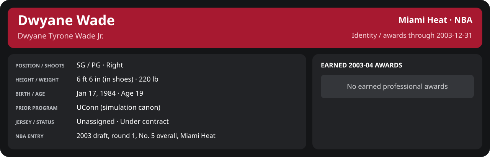

<!-- Generated by scripts/update_player_reports.py; edit source records, then rebuild. -->

# Week 4: 2003-12-22 to 2003-12-31 | Detailed statistics

[Week summary](README.md) · [Career](../../../../README.md) · [Professional identity](../../../../Professional_Identity.md) · [Earned awards](../../../../Awards.md) · [Stat definitions](../../../../../../docs/player_statistics.md)

## Professional identity

| Player | Age on report date | Team / league | Position | Number | Status |
| --- | --- | --- | --- | --- | --- |
| Dwyane Tyrone Wade Jr. | 19 | Miami Heat / NBA | SG / PG | Not assigned | Under contract |

| Identity field | Recorded value |
| --- | --- |
| Birth date | 1984-01-17 |
| NBA entry | 2003 draft, round 1, No. 5 overall, Miami Heat |
| Prior program | UConn (simulation canon) |
| Height, in shoes / without shoes | 6 ft 6 in / 6 ft 4.75 in |
| Weight | 220 lb |
| Wingspan / standing reach | 6 ft 11.5 in / 8 ft 7.5 in |
| Shooting hand | Right |
| Contract | Rookie scale signed 2003-07-21: three seasons plus a 2006-07 team option |
| Role | Starter; staff plan 34 minutes |
| NBA debut | October 28, 2003 at Philadelphia 76ers (2003-04/06_Regular_Season/10_October/Week_4/Game_1.md) |
| Nationality | United States (born in the Chicago area; Robbins, Illinois home community, per the player profile) |
| National team | No selection recorded |
| National-team eligibility | Not verified |
| Availability | No current restriction recorded in the established profile |
| Physical measurements recorded | 2003-06-25 |
| Professional status effective | 2003-12-01 |

Identity as of 2003-12-31; status snapshot dated 2003-12-01. User-established alternate-history player; historical Wade's biography and results are not this record.

### Earned 2003-04 awards

| Award | Period | Announced | Decision record |
| --- | --- | --- | --- |
| Eastern Conference Rookie of the Month | 2003-10-28 to 2003-11-30 | 2003-12-02 | [East ROM](../../../League/2003-04/11_November/League_Awards.md#rookie-of-the-month) |
| Eastern Conference Player of the Week | 2003-12-15 to 2003-12-21 | 2003-12-22 | [East POW](../../../League/2003-04/12_December/Week_3/League_Awards.md#player-of-the-week) |

## Statistics

As of **2003-12-31**: 5 closed games; 5/5 have player participation and box coverage; recorded DNPs: 0.

G counts appearances; GS counts recorded starts. DNPs, scheduled games and canceled games do not enter per-game denominators.

### Per game

  

[Shooting detail](../../../Shooting.md) · [Current contract](../../../Contract.md#current-contract) · [Contract history](../../../Contract.md#contract-history) · [Annual award record](../../../Awards.md)

| Scope | Age | Team | Lg | Pos | G | GS | MP | FG | FGA | FG% | 3P | 3PA | 3P% | 2P | 2PA | 2P% | eFG% | FT | FTA | FT% | ORB | DRB | TRB | AST | STL | BLK | TOV | PF | PTS | TS% (est.) | Awards |
| --- | --- | --- | --- | --- | --- | --- | --- | --- | --- | --- | --- | --- | --- | --- | --- | --- | --- | --- | --- | --- | --- | --- | --- | --- | --- | --- | --- | --- | --- | --- | --- |
| This scope | 19 | Miami Heat | NBA | SG / PG | 5 | 5 | 31.1 | 5.4 | 9.0 | .600 | 0.4 | 1.2 | .333 | 5.0 | 7.8 | .641 | .622 | 5.0 | 5.6 | .893 | 1.4 | 3.0 | 4.4 | 4.2 | 2.8 | 1.2 | 0.8 | 3.6 | 16.2 | .707 | [East POM](../../../League/2003-04/12_December/League_Awards.md#player-of-the-month), [East ROM](../../../League/2003-04/12_December/League_Awards.md#rookie-of-the-month) |

G and GS are counts; MP and counting statistics are **per appearance**. Shooting uses **.500 = 50.0%**. Age is at the row's cutoff. Scroll horizontally for every column.

Awards are confirmed through 2005-02-07, filed by the honor's period-end date; the banner shows career awards known at the page's identity cutoff.

### Production

| Metric | Total | Per appearance | Per 36 minutes |
| --- | --- | --- | --- |
| MIN | 155.5 | 31.1 | 36.0 |
| PTS | 81 | 16.2 | 18.7 |
| OREB | 7 | 1.4 | 1.6 |
| DREB | 15 | 3.0 | 3.5 |
| REB | 22 | 4.4 | 5.1 |
| AST | 21 | 4.2 | 4.9 |
| STL | 14 | 2.8 | 3.2 |
| BLK | 6 | 1.2 | 1.4 |
| TOV | 4 | 0.8 | 0.9 |
| PF | 18 | 3.6 | 4.2 |
| FGM | 27 | 5.4 | 6.2 |
| FGA | 45 | 9.0 | 10.4 |
| 2PM | 25 | 5.0 | 5.8 |
| 2PA | 39 | 7.8 | 9.0 |
| 3PM | 2 | 0.4 | 0.5 |
| 3PA | 6 | 1.2 | 1.4 |
| FTM | 25 | 5.0 | 5.8 |
| FTA | 28 | 5.6 | 6.5 |
| FT points | 25 | 5.0 | 5.8 |

Per-36 rates standardize playing time; they are not a projection of playing 36 minutes. Use the actual minutes denominator in every competition.

### Shooting

| Shot type | Makes | Attempts | Percentage |
| --- | --- | --- | --- |
| All field goals | 27 | 45 | 60.0% |
| Two-pointers | 25 | 39 | 64.1% |
| Three-pointers | 2 | 6 | 33.3% |
| Free throws | 25 | 28 | 89.3% |

### Efficiency and shot selection

| Metric | Value | Calculation / unit |
| --- | --- | --- |
| eFG% | 62.2% | (FGM + 0.5 × 3PM) / FGA |
| TS% (estimated) | 70.7% | PTS / [2 × (FGA + 0.44 × FTA)] |
| Three-point attempt share | 13.3% | 3PA / FGA |
| Free-throw attempt rate | 0.622 | FTA / FGA; ratio |
| Assist / turnover ratio | 5.25 | AST / TOV; N/A at zero turnovers |
| Plus/minus total | N/A | Observed on-court score differential only |
| Double-doubles | 0 | At least 10 in any two of PTS, REB, AST, STL, BLK |
| Triple-doubles | 0 | At least 10 in any three; also included in double-doubles |

Percentages use pooled makes and attempts. TS% uses an estimated free-throw weighting, not exact scoring possessions. Rounding is display-only.

### Splits

  

[Shooting detail](../../../Shooting.md) · [Current contract](../../../Contract.md#current-contract) · [Contract history](../../../Contract.md#contract-history) · [Annual award record](../../../Awards.md)

| Scope | Age | Team | Lg | Pos | G | GS | MP | FG | FGA | FG% | 3P | 3PA | 3P% | 2P | 2PA | 2P% | eFG% | FT | FTA | FT% | ORB | DRB | TRB | AST | STL | BLK | TOV | PF | PTS | TS% (est.) | Awards |
| --- | --- | --- | --- | --- | --- | --- | --- | --- | --- | --- | --- | --- | --- | --- | --- | --- | --- | --- | --- | --- | --- | --- | --- | --- | --- | --- | --- | --- | --- | --- | --- |
| Home | 19 | Miami Heat | NBA | SG / PG | 2 | 2 | 30.0 | 4.5 | 5.5 | .818 | 0.0 | 0.5 | .000 | 4.5 | 5.0 | .900 | .818 | 5.0 | 5.5 | .909 | 1.5 | 3.0 | 4.5 | 3.5 | 1.5 | 1.0 | 1.0 | 3.5 | 14.0 | .884 | — |
| Away | 19 | Miami Heat | NBA | SG / PG | 3 | 3 | 31.9 | 6.0 | 11.3 | .529 | 0.7 | 1.7 | .400 | 5.3 | 9.7 | .552 | .559 | 5.0 | 5.7 | .882 | 1.3 | 3.0 | 4.3 | 4.7 | 3.7 | 1.3 | 0.7 | 3.7 | 17.7 | .639 | — |
| Neutral | 19 | Miami Heat | NBA | SG / PG | 0 | N/A | N/A | N/A | N/A | N/A | N/A | N/A | N/A | N/A | N/A | N/A | N/A | N/A | N/A | N/A | N/A | N/A | N/A | N/A | N/A | N/A | N/A | N/A | N/A | N/A | — |
| Wins | 19 | Miami Heat | NBA | SG / PG | 5 | 5 | 31.1 | 5.4 | 9.0 | .600 | 0.4 | 1.2 | .333 | 5.0 | 7.8 | .641 | .622 | 5.0 | 5.6 | .893 | 1.4 | 3.0 | 4.4 | 4.2 | 2.8 | 1.2 | 0.8 | 3.6 | 16.2 | .707 | — |
| Losses | 19 | Miami Heat | NBA | SG / PG | 0 | N/A | N/A | N/A | N/A | N/A | N/A | N/A | N/A | N/A | N/A | N/A | N/A | N/A | N/A | N/A | N/A | N/A | N/A | N/A | N/A | N/A | N/A | N/A | N/A | N/A | — |
| Team: Miami Heat | 19 | Miami Heat | NBA | SG / PG | 5 | 5 | 31.1 | 5.4 | 9.0 | .600 | 0.4 | 1.2 | .333 | 5.0 | 7.8 | .641 | .622 | 5.0 | 5.6 | .893 | 1.4 | 3.0 | 4.4 | 4.2 | 2.8 | 1.2 | 0.8 | 3.6 | 16.2 | .707 | — |

G and GS are counts; MP and counting statistics are **per appearance**. Shooting uses **.500 = 50.0%**. Age is at the row's cutoff. Scroll horizontally for every column.

Awards are confirmed through 2005-02-07, filed by the honor's period-end date; the banner shows career awards known at the page's identity cutoff.

Splits overlap and are not additive. Each row has its own appearance denominator; games with unknown result classification are excluded from win/loss splits.

### Game highs

| Metric | High | Date / opponent (all ties) |
| --- | --- | --- |
| PTS | 24 | [2003-12-30 at New York Knicks](../../../../2003-04/06_Regular_Season/12_December/Week_4/Game_5.md) |
| REB | 7 | [2003-12-29 at Chicago Bulls](../../../../2003-04/06_Regular_Season/12_December/Week_4/Game_4.md) |
| AST | 5 | [2003-12-27 vs New York Knicks](../../../../2003-04/06_Regular_Season/12_December/Week_4/Game_3.md); [2003-12-29 at Chicago Bulls](../../../../2003-04/06_Regular_Season/12_December/Week_4/Game_4.md); [2003-12-30 at New York Knicks](../../../../2003-04/06_Regular_Season/12_December/Week_4/Game_5.md) |
| STL | 7 | [2003-12-30 at New York Knicks](../../../../2003-04/06_Regular_Season/12_December/Week_4/Game_5.md) |
| BLK | 3 | [2003-12-30 at New York Knicks](../../../../2003-04/06_Regular_Season/12_December/Week_4/Game_5.md) |
| TOV | 2 | [2003-12-27 vs New York Knicks](../../../../2003-04/06_Regular_Season/12_December/Week_4/Game_3.md); [2003-12-30 at New York Knicks](../../../../2003-04/06_Regular_Season/12_December/Week_4/Game_5.md) |

### Game log

| Date / source | Opponent | Venue | Result | Participation | MIN | PTS | REB | AST | STL | BLK | TOV |
| --- | --- | --- | --- | --- | --- | --- | --- | --- | --- | --- | --- |
| [2003-12-23](../../../../2003-04/06_Regular_Season/12_December/Week_4/Game_1.md) | Washington Wizards | home | W 120-95 | Played | 21.9 | 18 | 3 | 2 | 2 | 1 | 0 |
| [2003-12-26](../../../../2003-04/06_Regular_Season/12_December/Week_4/Game_2.md) | Washington Wizards | away | W 104-93 | Played | 22.0 | 11 | 2 | 4 | 1 | 0 | 0 |
| [2003-12-27](../../../../2003-04/06_Regular_Season/12_December/Week_4/Game_3.md) | New York Knicks | home | W 87-74 | Played | 38.0 | 10 | 6 | 5 | 1 | 1 | 2 |
| [2003-12-29](../../../../2003-04/06_Regular_Season/12_December/Week_4/Game_4.md) | Chicago Bulls | away | W 96-78 | Played | 34.7 | 18 | 7 | 5 | 3 | 1 | 0 |
| [2003-12-30](../../../../2003-04/06_Regular_Season/12_December/Week_4/Game_5.md) | New York Knicks | away | W 103-97 | Played | 38.9 | 24 | 4 | 5 | 7 | 3 | 2 |

### Individual game boxes

| Scope | Age | Team | Lg | Pos | G | GS | MP | FG | FGA | FG% | 3P | 3PA | 3P% | 2P | 2PA | 2P% | eFG% | FT | FTA | FT% | ORB | DRB | TRB | AST | STL | BLK | TOV | PF | PTS | TS% (est.) | Awards |
| --- | --- | --- | --- | --- | --- | --- | --- | --- | --- | --- | --- | --- | --- | --- | --- | --- | --- | --- | --- | --- | --- | --- | --- | --- | --- | --- | --- | --- | --- | --- | --- |
| [2003-12-23](../../../../2003-04/06_Regular_Season/12_December/Week_4/Game_1.md) | 19 | Miami Heat | NBA | SG / PG | 1 | 1 | 21.9 | 6.0 | 6.0 | 1.000 | 0.0 | 0.0 | N/A | 6.0 | 6.0 | 1.000 | 1.000 | 6.0 | 7.0 | .857 | 1.0 | 2.0 | 3.0 | 2.0 | 2.0 | 1.0 | 0.0 | 5.0 | 18.0 | .991 | — |
| [2003-12-26](../../../../2003-04/06_Regular_Season/12_December/Week_4/Game_2.md) | 19 | Miami Heat | NBA | SG / PG | 1 | 1 | 22.0 | 5.0 | 10.0 | .500 | 1.0 | 2.0 | .500 | 4.0 | 8.0 | .500 | .550 | 0.0 | 0.0 | N/A | 1.0 | 1.0 | 2.0 | 4.0 | 1.0 | 0.0 | 0.0 | 5.0 | 11.0 | .550 | — |
| [2003-12-27](../../../../2003-04/06_Regular_Season/12_December/Week_4/Game_3.md) | 19 | Miami Heat | NBA | SG / PG | 1 | 1 | 38.0 | 3.0 | 5.0 | .600 | 0.0 | 1.0 | .000 | 3.0 | 4.0 | .750 | .600 | 4.0 | 4.0 | 1.000 | 2.0 | 4.0 | 6.0 | 5.0 | 1.0 | 1.0 | 2.0 | 2.0 | 10.0 | .740 | — |
| [2003-12-29](../../../../2003-04/06_Regular_Season/12_December/Week_4/Game_4.md) | 19 | Miami Heat | NBA | SG / PG | 1 | 1 | 34.7 | 4.0 | 9.0 | .444 | 0.0 | 0.0 | N/A | 4.0 | 9.0 | .444 | .444 | 10.0 | 10.0 | 1.000 | 1.0 | 6.0 | 7.0 | 5.0 | 3.0 | 1.0 | 0.0 | 4.0 | 18.0 | .672 | — |
| [2003-12-30](../../../../2003-04/06_Regular_Season/12_December/Week_4/Game_5.md) | 19 | Miami Heat | NBA | SG / PG | 1 | 1 | 38.9 | 9.0 | 15.0 | .600 | 1.0 | 3.0 | .333 | 8.0 | 12.0 | .667 | .633 | 5.0 | 7.0 | .714 | 2.0 | 2.0 | 4.0 | 5.0 | 7.0 | 3.0 | 2.0 | 2.0 | 24.0 | .664 | — |

G and GS are counts; MP and counting statistics are **per appearance**. Shooting uses **.500 = 50.0%**. Age is at the row's cutoff. Scroll horizontally for every column.

Awards are confirmed through 2005-02-07, filed by the honor's period-end date; the banner shows career awards known at the page's identity cutoff.

### Game shooting detail

| Date / source | FG | 2P | 3P | FT | eFG% | TS% (est.) | +/- | PF |
| --- | --- | --- | --- | --- | --- | --- | --- | --- |
| [2003-12-23](../../../../2003-04/06_Regular_Season/12_December/Week_4/Game_1.md) | 6/6 | 6/6 | 0/0 | 6/7 | 100.0% | 99.1% | N/A | 5 |
| [2003-12-26](../../../../2003-04/06_Regular_Season/12_December/Week_4/Game_2.md) | 5/10 | 4/8 | 1/2 | 0/0 | 55.0% | 55.0% | N/A | 5 |
| [2003-12-27](../../../../2003-04/06_Regular_Season/12_December/Week_4/Game_3.md) | 3/5 | 3/4 | 0/1 | 4/4 | 60.0% | 74.0% | N/A | 2 |
| [2003-12-29](../../../../2003-04/06_Regular_Season/12_December/Week_4/Game_4.md) | 4/9 | 4/9 | 0/0 | 10/10 | 44.4% | 67.2% | N/A | 4 |
| [2003-12-30](../../../../2003-04/06_Regular_Season/12_December/Week_4/Game_5.md) | 9/15 | 8/12 | 1/3 | 5/7 | 63.3% | 66.4% | N/A | 2 |

### Additional data needed

| Statistic family | Current support | Required evidence |
| --- | --- | --- |
| Starts; plus/minus | N/A unless supplied in the player box | Explicit started and plus_minus fields |
| Per 100 possessions; offensive / defensive / net rating | Unavailable in current box feed | Player on-court possessions and both teams' scoring during those possessions |
| USG%; AST%; OREB%, DREB%, REB% | Unavailable in current box feed | Matching player/team/opponent opportunity counts and a declared method |
| Rim, paint, midrange, corner / above-break threes | Unavailable in current box feed | Shot locations, attempts and makes |
| Drives, touches, catch-and-shoot, pull-ups, play types | Unavailable in current box feed | Tracking or tagged play-by-play |
| Clutch, on/off, lineup combinations, assisted baskets | Unavailable in current box feed | Timed events, score state, substitutions and possession attribution |
| Deflections, charges, contested shots, box outs | Unavailable in current box feed | Observed hustle/defensive events |
| League rank, percentile, relative TS%; impact models | Not derived by this report | Same-period simulated league baseline, eligibility rules and documented model |
