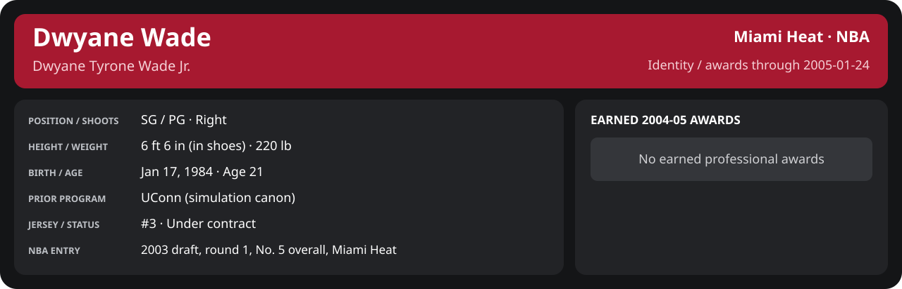

<!-- Generated by scripts/update_player_reports.py; edit source records, then rebuild. -->

# January 2005 | NBA regular season

[Career](../../../README.md) · [Professional identity](../../../Professional_Identity.md) · [Earned awards](../../../Awards.md) · [Stat definitions](../../../../../docs/player_statistics.md) · [Season](../README.md) · [Miami](../../Team/2004-05/01_January/Team_Stats.md) · [NBA players](../../League/2004-05/01_January/League_Stats.md) · [NBA awards](../../League/2004-05/01_January/League_Awards.md)

## Professional identity

| Player | Age on report date | Team / league | Position | Number | Status |
| --- | --- | --- | --- | --- | --- |
| Dwyane Tyrone Wade Jr. | 21 | Miami Heat / NBA | SG / PG | 3 | Under contract |

| Identity field | Recorded value |
| --- | --- |
| Birth date | 1984-01-17 |
| NBA entry | 2003 draft, round 1, No. 5 overall, Miami Heat |
| Prior program | UConn (simulation canon) |
| Height, in shoes / without shoes | 6 ft 6 in / 6 ft 4.75 in |
| Weight | 220 lb |
| Wingspan / standing reach | 6 ft 11.5 in / 8 ft 7.5 in |
| Shooting hand | Right |
| Contract | Rookie scale signed 2003-07-21: three seasons plus a 2006-07 team option (2004-05: $2,361,800) |
| Role | Starting SG; staff plan 34 minutes |
| NBA debut | October 28, 2003 at Philadelphia 76ers (2003-04/06_Regular_Season/10_October/Week_4/Game_1.md) |
| Nationality | United States (born in the Chicago area; Robbins, Illinois home community, per the player profile) |
| National team | No selection recorded |
| National-team eligibility | United States (USA Basketball); no selection yet |
| Availability | No current restriction recorded in the established profile |
| Physical measurements recorded | 2003-06-25 |
| Professional status effective | 2004-10-28 |

Identity as of 2005-01-24; status snapshot dated 2004-10-28. User-established alternate-history player; historical Wade's biography and results are not this record.

### Earned 2004-05 awards

| Award | Period | Announced | Decision record |
| --- | --- | --- | --- |
| Eastern Conference Player of the Month | 2004-12-01 to 2004-12-31 | 2005-01-02 | [East POM](../../League/2004-05/12_December/League_Awards.md#player-of-the-month) |

## Statistics

As of **2005-01-24**: 12 closed games; 12/12 have player participation and box coverage; recorded DNPs: 1.

G counts appearances; GS counts recorded starts. DNPs, scheduled games and canceled games do not enter per-game denominators.

### Per game

  

[Shooting detail](../../Shooting.md) · [Current contract](../../Contract.md#current-contract) · [Contract history](../../Contract.md#contract-history) · [Annual award record](../../Awards.md)

| Scope | Age | Team | Lg | Pos | G | GS | MP | FG | FGA | FG% | 3P | 3PA | 3P% | 2P | 2PA | 2P% | eFG% | FT | FTA | FT% | ORB | DRB | TRB | AST | STL | BLK | TOV | PF | PTS | TS% (est.) | Awards |
| --- | --- | --- | --- | --- | --- | --- | --- | --- | --- | --- | --- | --- | --- | --- | --- | --- | --- | --- | --- | --- | --- | --- | --- | --- | --- | --- | --- | --- | --- | --- | --- |
| This scope | 21 | Miami Heat | NBA | SG / PG | 11 | 11 | 35.1 | 7.8 | 14.8 | .528 | 1.0 | 2.5 | .407 | 6.8 | 12.4 | .551 | .561 | 4.9 | 5.3 | .931 | 1.4 | 3.6 | 5.0 | 3.9 | 1.1 | 0.9 | 0.9 | 3.1 | 21.5 | .629 | — |

G and GS are counts; MP and counting statistics are **per appearance**. Shooting uses **.500 = 50.0%**. Age is at the row's cutoff. Scroll horizontally for every column.

Awards are confirmed through 2005-01-24, filed by the honor's period-end date; the banner shows career awards known at the page's identity cutoff.

[Full statistical detail: totals, per 36, shooting, efficiency, splits and source games](Stat_Detail.md)

### Period summary

  

[Shooting detail](../../Shooting.md) · [Current contract](../../Contract.md#current-contract) · [Contract history](../../Contract.md#contract-history) · [Annual award record](../../Awards.md)

| Scope | Age | Team | Lg | Pos | G | GS | MP | FG | FGA | FG% | 3P | 3PA | 3P% | 2P | 2PA | 2P% | eFG% | FT | FTA | FT% | ORB | DRB | TRB | AST | STL | BLK | TOV | PF | PTS | TS% (est.) | Awards |
| --- | --- | --- | --- | --- | --- | --- | --- | --- | --- | --- | --- | --- | --- | --- | --- | --- | --- | --- | --- | --- | --- | --- | --- | --- | --- | --- | --- | --- | --- | --- | --- |
| [Week 1: 2005-01-01 to 2005-01-07](Week_1/README.md) | 20 | Miami Heat | NBA | SG / PG | 3 | 3 | 35.0 | 7.3 | 13.7 | .537 | 1.3 | 2.3 | .571 | 6.0 | 11.3 | .529 | .585 | 3.3 | 4.0 | .833 | 1.0 | 3.3 | 4.3 | 4.0 | 0.7 | 1.3 | 1.7 | 3.3 | 19.3 | .627 | — |
| [Week 2: 2005-01-08 to 2005-01-14](Week_2/README.md) | 20 | Miami Heat | NBA | SG / PG | 4 | 4 | 34.0 | 6.5 | 13.0 | .500 | 1.0 | 1.8 | .571 | 5.5 | 11.2 | .489 | .538 | 6.5 | 7.0 | .929 | 1.2 | 3.5 | 4.8 | 3.8 | 0.8 | 0.8 | 0.2 | 3.8 | 20.5 | .637 | — |
| [Week 3: 2005-01-15 to 2005-01-21](Week_3/README.md) | 21 | Miami Heat | NBA | SG / PG | 2 | 2 | 41.0 | 11.0 | 21.5 | .512 | 1.0 | 4.5 | .222 | 10.0 | 17.0 | .588 | .535 | 3.0 | 3.0 | 1.000 | 1.5 | 4.0 | 5.5 | 4.0 | 2.5 | 0.5 | 1.5 | 0.5 | 26.0 | .570 | — |
| [Week 4: 2005-01-22 to 2005-01-31](Week_4/README.md) | 21 | Miami Heat | NBA | SG / PG | 2 | 2 | 31.3 | 8.0 | 13.5 | .593 | 0.5 | 2.0 | .250 | 7.5 | 11.5 | .652 | .611 | 6.0 | 6.0 | 1.000 | 2.0 | 4.0 | 6.0 | 4.0 | 1.0 | 1.0 | 0.5 | 4.0 | 22.5 | .697 | — |

G and GS are counts; MP and counting statistics are **per appearance**. Shooting uses **.500 = 50.0%**. Age is at the row's cutoff. Scroll horizontally for every column.

Awards are confirmed through 2005-01-24, filed by the honor's period-end date; the banner shows career awards known at the page's identity cutoff.

### Period comparison

  

[Shooting detail](../../Shooting.md) · [Current contract](../../Contract.md#current-contract) · [Contract history](../../Contract.md#contract-history) · [Annual award record](../../Awards.md)

| Scope | Age | Team | Lg | Pos | G | GS | MP | FG | FGA | FG% | 3P | 3PA | 3P% | 2P | 2PA | 2P% | eFG% | FT | FTA | FT% | ORB | DRB | TRB | AST | STL | BLK | TOV | PF | PTS | TS% (est.) | Awards |
| --- | --- | --- | --- | --- | --- | --- | --- | --- | --- | --- | --- | --- | --- | --- | --- | --- | --- | --- | --- | --- | --- | --- | --- | --- | --- | --- | --- | --- | --- | --- | --- |
| January 2005 | 21 | Miami Heat | NBA | SG / PG | 11 | 11 | 35.1 | 7.8 | 14.8 | .528 | 1.0 | 2.5 | .407 | 6.8 | 12.4 | .551 | .561 | 4.9 | 5.3 | .931 | 1.4 | 3.6 | 5.0 | 3.9 | 1.1 | 0.9 | 0.9 | 3.1 | 21.5 | .629 | — |
| [December 2004](../12_December/README.md) | 20 | Miami Heat | NBA | SG / PG | 11 | 11 | 36.8 | 7.6 | 13.8 | .553 | 1.5 | 3.1 | .471 | 6.2 | 10.7 | .576 | .605 | 6.5 | 6.5 | .986 | 1.3 | 4.5 | 5.8 | 3.6 | 1.3 | 1.1 | 1.8 | 3.3 | 23.2 | .694 | [East POM](../../League/2004-05/12_December/League_Awards.md#player-of-the-month) |
| Season through this month | 21 | Miami Heat | NBA | SG / PG | 37 | 37 | 35.6 | 6.9 | 13.2 | .522 | 1.1 | 2.5 | .446 | 5.8 | 10.7 | .539 | .564 | 5.2 | 5.5 | .951 | 1.5 | 3.8 | 5.3 | 3.9 | 1.4 | 1.2 | 1.3 | 2.8 | 20.1 | .644 | [East POM](../../League/2004-05/12_December/League_Awards.md#player-of-the-month) |

G and GS are counts; MP and counting statistics are **per appearance**. Shooting uses **.500 = 50.0%**. Age is at the row's cutoff. Scroll horizontally for every column.

Awards are confirmed through 2005-01-24, filed by the honor's period-end date; the banner shows career awards known at the page's identity cutoff.

### Production

| Metric | Total | Per appearance | Per 36 minutes |
| --- | --- | --- | --- |
| MIN | 385.6 | 35.1 | 36.0 |
| PTS | 237 | 21.5 | 22.1 |
| OREB | 15 | 1.4 | 1.4 |
| DREB | 40 | 3.6 | 3.7 |
| REB | 55 | 5.0 | 5.1 |
| AST | 43 | 3.9 | 4.0 |
| STL | 12 | 1.1 | 1.1 |
| BLK | 10 | 0.9 | 0.9 |
| TOV | 10 | 0.9 | 0.9 |
| PF | 34 | 3.1 | 3.2 |
| FGM | 86 | 7.8 | 8.0 |
| FGA | 163 | 14.8 | 15.2 |
| 2PM | 75 | 6.8 | 7.0 |
| 2PA | 136 | 12.4 | 12.7 |
| 3PM | 11 | 1.0 | 1.0 |
| 3PA | 27 | 2.5 | 2.5 |
| FTM | 54 | 4.9 | 5.0 |
| FTA | 58 | 5.3 | 5.4 |
| FT points | 54 | 4.9 | 5.0 |

Per-36 rates standardize playing time; they are not a projection of playing 36 minutes. Use the actual minutes denominator in every competition.

### Shooting

| Shot type | Makes | Attempts | Percentage |
| --- | --- | --- | --- |
| All field goals | 86 | 163 | 52.8% |
| Two-pointers | 75 | 136 | 55.1% |
| Three-pointers | 11 | 27 | 40.7% |
| Free throws | 54 | 58 | 93.1% |

### Efficiency and shot selection

| Metric | Value | Calculation / unit |
| --- | --- | --- |
| eFG% | 56.1% | (FGM + 0.5 × 3PM) / FGA |
| TS% (estimated) | 62.9% | PTS / [2 × (FGA + 0.44 × FTA)] |
| Three-point attempt share | 16.6% | 3PA / FGA |
| Free-throw attempt rate | 0.356 | FTA / FGA; ratio |
| Assist / turnover ratio | 4.30 | AST / TOV; N/A at zero turnovers |
| Plus/minus total | N/A | Observed on-court score differential only |
| Double-doubles | 1 | At least 10 in any two of PTS, REB, AST, STL, BLK |
| Triple-doubles | 0 | At least 10 in any three; also included in double-doubles |

Percentages use pooled makes and attempts. TS% uses an estimated free-throw weighting, not exact scoring possessions. Rounding is display-only.

### Splits

  

[Shooting detail](../../Shooting.md) · [Current contract](../../Contract.md#current-contract) · [Contract history](../../Contract.md#contract-history) · [Annual award record](../../Awards.md)

| Scope | Age | Team | Lg | Pos | G | GS | MP | FG | FGA | FG% | 3P | 3PA | 3P% | 2P | 2PA | 2P% | eFG% | FT | FTA | FT% | ORB | DRB | TRB | AST | STL | BLK | TOV | PF | PTS | TS% (est.) | Awards |
| --- | --- | --- | --- | --- | --- | --- | --- | --- | --- | --- | --- | --- | --- | --- | --- | --- | --- | --- | --- | --- | --- | --- | --- | --- | --- | --- | --- | --- | --- | --- | --- |
| Home | 21 | Miami Heat | NBA | SG / PG | 5 | 5 | 37.2 | 9.6 | 16.8 | .571 | 1.4 | 3.4 | .412 | 8.2 | 13.4 | .612 | .613 | 4.4 | 4.4 | 1.000 | 1.6 | 4.0 | 5.6 | 3.4 | 1.6 | 1.2 | 1.6 | 2.4 | 25.0 | .667 | — |
| Away | 21 | Miami Heat | NBA | SG / PG | 6 | 6 | 33.3 | 6.3 | 13.2 | .481 | 0.7 | 1.7 | .400 | 5.7 | 11.5 | .493 | .506 | 5.3 | 6.0 | .889 | 1.2 | 3.3 | 4.5 | 4.3 | 0.7 | 0.7 | 0.3 | 3.7 | 18.7 | .590 | — |
| Neutral | 21 | Miami Heat | NBA | SG / PG | 0 | N/A | N/A | N/A | N/A | N/A | N/A | N/A | N/A | N/A | N/A | N/A | N/A | N/A | N/A | N/A | N/A | N/A | N/A | N/A | N/A | N/A | N/A | N/A | N/A | N/A | — |
| Wins | 21 | Miami Heat | NBA | SG / PG | 7 | 7 | 35.5 | 8.9 | 15.7 | .564 | 1.1 | 2.6 | .444 | 7.7 | 13.1 | .587 | .600 | 4.3 | 4.6 | .938 | 1.3 | 3.9 | 5.1 | 3.9 | 1.4 | 1.1 | 1.0 | 3.0 | 23.1 | .653 | — |
| Losses | 21 | Miami Heat | NBA | SG / PG | 4 | 4 | 34.3 | 6.0 | 13.2 | .453 | 0.8 | 2.2 | .333 | 5.2 | 11.0 | .477 | .481 | 6.0 | 6.5 | .923 | 1.5 | 3.2 | 4.8 | 4.0 | 0.5 | 0.5 | 0.8 | 3.2 | 18.8 | .582 | — |
| Team: Miami Heat | 21 | Miami Heat | NBA | SG / PG | 11 | 11 | 35.1 | 7.8 | 14.8 | .528 | 1.0 | 2.5 | .407 | 6.8 | 12.4 | .551 | .561 | 4.9 | 5.3 | .931 | 1.4 | 3.6 | 5.0 | 3.9 | 1.1 | 0.9 | 0.9 | 3.1 | 21.5 | .629 | — |

G and GS are counts; MP and counting statistics are **per appearance**. Shooting uses **.500 = 50.0%**. Age is at the row's cutoff. Scroll horizontally for every column.

Awards are confirmed through 2005-01-24, filed by the honor's period-end date; the banner shows career awards known at the page's identity cutoff.

Splits overlap and are not additive. Each row has its own appearance denominator; games with unknown result classification are excluded from win/loss splits.

### Game highs

| Metric | High | Date / opponent (all ties) |
| --- | --- | --- |
| PTS | 31 | [2005-01-19 vs Atlanta Hawks](../../../2004-05/06_Regular_Season/01_January/Week_3/Game_1.md) |
| REB | 11 | [2005-01-12 at Golden State Warriors](../../../2004-05/06_Regular_Season/01_January/Week_2/Game_3.md) |
| AST | 6 | [2005-01-07 at Portland Trail Blazers](../../../2004-05/06_Regular_Season/01_January/Week_1/Game_4.md) |
| STL | 5 | [2005-01-19 vs Atlanta Hawks](../../../2004-05/06_Regular_Season/01_January/Week_3/Game_1.md) |
| BLK | 2 | [2005-01-05 vs New York Knicks](../../../2004-05/06_Regular_Season/01_January/Week_1/Game_3.md); [2005-01-23 vs New Orleans Hornets](../../../2004-05/06_Regular_Season/01_January/Week_4/Game_1.md) |
| TOV | 4 | [2005-01-05 vs New York Knicks](../../../2004-05/06_Regular_Season/01_January/Week_1/Game_3.md) |

### Game log

| Date / source | Opponent | Venue | Result | Participation | MIN | PTS | REB | AST | STL | BLK | TOV |
| --- | --- | --- | --- | --- | --- | --- | --- | --- | --- | --- | --- |
| [2005-01-01](../../../2004-05/06_Regular_Season/01_January/Week_1/Game_1.md) | Charlotte Bobcats | home | W 89-76 | DNP: injured list since 2004-12-23 | N/A | N/A | N/A | N/A | N/A | N/A | N/A |
| [2005-01-03](../../../2004-05/06_Regular_Season/01_January/Week_1/Game_2.md) | Seattle SuperSonics | home | W 114-94 | Played | 37.1 | 16 | 4 | 4 | 0 | 1 | 1 |
| [2005-01-05](../../../2004-05/06_Regular_Season/01_January/Week_1/Game_3.md) | New York Knicks | home | W 112-92 | Played | 30.2 | 28 | 4 | 2 | 2 | 2 | 4 |
| [2005-01-07](../../../2004-05/06_Regular_Season/01_January/Week_1/Game_4.md) | Portland Trail Blazers | away | W 91-88 | Played | 37.6 | 14 | 5 | 6 | 0 | 1 | 0 |
| [2005-01-09](../../../2004-05/06_Regular_Season/01_January/Week_2/Game_1.md) | Seattle SuperSonics | away | L 91-102 | Played | 24.0 | 14 | 1 | 5 | 0 | 1 | 0 |
| [2005-01-11](../../../2004-05/06_Regular_Season/01_January/Week_2/Game_2.md) | Phoenix Suns | away | L 100-109 | Played | 36.9 | 23 | 2 | 4 | 1 | 0 | 1 |
| [2005-01-12](../../../2004-05/06_Regular_Season/01_January/Week_2/Game_3.md) | Golden State Warriors | away | L 99-110 | Played | 37.3 | 17 | 11 | 4 | 1 | 1 | 0 |
| [2005-01-14](../../../2004-05/06_Regular_Season/01_January/Week_2/Game_4.md) | Los Angeles Clippers | away | W 106-92 | Played | 37.8 | 28 | 5 | 2 | 1 | 1 | 0 |
| [2005-01-19](../../../2004-05/06_Regular_Season/01_January/Week_3/Game_1.md) | Atlanta Hawks | home | W 121-117 | Played | 42.8 | 31 | 6 | 5 | 5 | 1 | 1 |
| [2005-01-21](../../../2004-05/06_Regular_Season/01_January/Week_3/Game_2.md) | Indiana Pacers | home | L 105-109 | Played | 39.2 | 21 | 5 | 3 | 0 | 0 | 2 |
| [2005-01-23](../../../2004-05/06_Regular_Season/01_January/Week_4/Game_1.md) | New Orleans Hornets | home | W 94-71 | Played | 36.4 | 29 | 9 | 3 | 1 | 2 | 0 |
| [2005-01-24](../../../2004-05/06_Regular_Season/01_January/Week_4/Game_2.md) | Philadelphia 76ers | away | W 111-104 | Played | 26.3 | 16 | 3 | 5 | 1 | 0 | 1 |

### Individual game boxes

| Scope | Age | Team | Lg | Pos | G | GS | MP | FG | FGA | FG% | 3P | 3PA | 3P% | 2P | 2PA | 2P% | eFG% | FT | FTA | FT% | ORB | DRB | TRB | AST | STL | BLK | TOV | PF | PTS | TS% (est.) | Awards |
| --- | --- | --- | --- | --- | --- | --- | --- | --- | --- | --- | --- | --- | --- | --- | --- | --- | --- | --- | --- | --- | --- | --- | --- | --- | --- | --- | --- | --- | --- | --- | --- |
| [2005-01-01](../../../2004-05/06_Regular_Season/01_January/Week_1/Game_1.md) | 20 | Miami Heat | NBA | SG / PG | 0 | N/A | N/A | N/A | N/A | N/A | N/A | N/A | N/A | N/A | N/A | N/A | N/A | N/A | N/A | N/A | N/A | N/A | N/A | N/A | N/A | N/A | N/A | N/A | N/A | N/A | — |
| [2005-01-03](../../../2004-05/06_Regular_Season/01_January/Week_1/Game_2.md) | 20 | Miami Heat | NBA | SG / PG | 1 | 1 | 37.1 | 7.0 | 13.0 | .538 | 0.0 | 2.0 | .000 | 7.0 | 11.0 | .636 | .538 | 2.0 | 2.0 | 1.000 | 2.0 | 2.0 | 4.0 | 4.0 | 0.0 | 1.0 | 1.0 | 3.0 | 16.0 | .576 | — |
| [2005-01-05](../../../2004-05/06_Regular_Season/01_January/Week_1/Game_3.md) | 20 | Miami Heat | NBA | SG / PG | 1 | 1 | 30.2 | 9.0 | 14.0 | .643 | 4.0 | 4.0 | 1.000 | 5.0 | 10.0 | .500 | .786 | 6.0 | 6.0 | 1.000 | 0.0 | 4.0 | 4.0 | 2.0 | 2.0 | 2.0 | 4.0 | 4.0 | 28.0 | .841 | — |
| [2005-01-07](../../../2004-05/06_Regular_Season/01_January/Week_1/Game_4.md) | 20 | Miami Heat | NBA | SG / PG | 1 | 1 | 37.6 | 6.0 | 14.0 | .429 | 0.0 | 1.0 | .000 | 6.0 | 13.0 | .462 | .429 | 2.0 | 4.0 | .500 | 1.0 | 4.0 | 5.0 | 6.0 | 0.0 | 1.0 | 0.0 | 3.0 | 14.0 | .444 | — |
| [2005-01-09](../../../2004-05/06_Regular_Season/01_January/Week_2/Game_1.md) | 20 | Miami Heat | NBA | SG / PG | 1 | 1 | 24.0 | 3.0 | 8.0 | .375 | 1.0 | 3.0 | .333 | 2.0 | 5.0 | .400 | .438 | 7.0 | 7.0 | 1.000 | 0.0 | 1.0 | 1.0 | 5.0 | 0.0 | 1.0 | 0.0 | 5.0 | 14.0 | .632 | — |
| [2005-01-11](../../../2004-05/06_Regular_Season/01_January/Week_2/Game_2.md) | 20 | Miami Heat | NBA | SG / PG | 1 | 1 | 36.9 | 8.0 | 15.0 | .533 | 0.0 | 0.0 | N/A | 8.0 | 15.0 | .533 | .533 | 7.0 | 8.0 | .875 | 0.0 | 2.0 | 2.0 | 4.0 | 1.0 | 0.0 | 1.0 | 5.0 | 23.0 | .621 | — |
| [2005-01-12](../../../2004-05/06_Regular_Season/01_January/Week_2/Game_3.md) | 20 | Miami Heat | NBA | SG / PG | 1 | 1 | 37.3 | 5.0 | 11.0 | .455 | 2.0 | 2.0 | 1.000 | 3.0 | 9.0 | .333 | .545 | 5.0 | 6.0 | .833 | 5.0 | 6.0 | 11.0 | 4.0 | 1.0 | 1.0 | 0.0 | 3.0 | 17.0 | .623 | — |
| [2005-01-14](../../../2004-05/06_Regular_Season/01_January/Week_2/Game_4.md) | 20 | Miami Heat | NBA | SG / PG | 1 | 1 | 37.8 | 10.0 | 18.0 | .556 | 1.0 | 2.0 | .500 | 9.0 | 16.0 | .562 | .583 | 7.0 | 7.0 | 1.000 | 0.0 | 5.0 | 5.0 | 2.0 | 1.0 | 1.0 | 0.0 | 2.0 | 28.0 | .664 | — |
| [2005-01-19](../../../2004-05/06_Regular_Season/01_January/Week_3/Game_1.md) | 21 | Miami Heat | NBA | SG / PG | 1 | 1 | 42.8 | 14.0 | 24.0 | .583 | 2.0 | 5.0 | .400 | 12.0 | 19.0 | .632 | .625 | 1.0 | 1.0 | 1.000 | 2.0 | 4.0 | 6.0 | 5.0 | 5.0 | 1.0 | 1.0 | 1.0 | 31.0 | .634 | — |
| [2005-01-21](../../../2004-05/06_Regular_Season/01_January/Week_3/Game_2.md) | 21 | Miami Heat | NBA | SG / PG | 1 | 1 | 39.2 | 8.0 | 19.0 | .421 | 0.0 | 4.0 | .000 | 8.0 | 15.0 | .533 | .421 | 5.0 | 5.0 | 1.000 | 1.0 | 4.0 | 5.0 | 3.0 | 0.0 | 0.0 | 2.0 | 0.0 | 21.0 | .495 | — |
| [2005-01-23](../../../2004-05/06_Regular_Season/01_January/Week_4/Game_1.md) | 21 | Miami Heat | NBA | SG / PG | 1 | 1 | 36.4 | 10.0 | 14.0 | .714 | 1.0 | 2.0 | .500 | 9.0 | 12.0 | .750 | .750 | 8.0 | 8.0 | 1.000 | 3.0 | 6.0 | 9.0 | 3.0 | 1.0 | 2.0 | 0.0 | 4.0 | 29.0 | .828 | — |
| [2005-01-24](../../../2004-05/06_Regular_Season/01_January/Week_4/Game_2.md) | 21 | Miami Heat | NBA | SG / PG | 1 | 1 | 26.3 | 6.0 | 13.0 | .462 | 0.0 | 2.0 | .000 | 6.0 | 11.0 | .545 | .462 | 4.0 | 4.0 | 1.000 | 1.0 | 2.0 | 3.0 | 5.0 | 1.0 | 0.0 | 1.0 | 4.0 | 16.0 | .542 | — |

G and GS are counts; MP and counting statistics are **per appearance**. Shooting uses **.500 = 50.0%**. Age is at the row's cutoff. Scroll horizontally for every column.

Awards are confirmed through 2005-01-24, filed by the honor's period-end date; the banner shows career awards known at the page's identity cutoff.

### Game shooting detail

| Date / source | FG | 2P | 3P | FT | eFG% | TS% (est.) | +/- | PF |
| --- | --- | --- | --- | --- | --- | --- | --- | --- |
| [2005-01-03](../../../2004-05/06_Regular_Season/01_January/Week_1/Game_2.md) | 7/13 | 7/11 | 0/2 | 2/2 | 53.8% | 57.6% | N/A | 3 |
| [2005-01-05](../../../2004-05/06_Regular_Season/01_January/Week_1/Game_3.md) | 9/14 | 5/10 | 4/4 | 6/6 | 78.6% | 84.1% | N/A | 4 |
| [2005-01-07](../../../2004-05/06_Regular_Season/01_January/Week_1/Game_4.md) | 6/14 | 6/13 | 0/1 | 2/4 | 42.9% | 44.4% | N/A | 3 |
| [2005-01-09](../../../2004-05/06_Regular_Season/01_January/Week_2/Game_1.md) | 3/8 | 2/5 | 1/3 | 7/7 | 43.8% | 63.2% | N/A | 5 |
| [2005-01-11](../../../2004-05/06_Regular_Season/01_January/Week_2/Game_2.md) | 8/15 | 8/15 | 0/0 | 7/8 | 53.3% | 62.1% | N/A | 5 |
| [2005-01-12](../../../2004-05/06_Regular_Season/01_January/Week_2/Game_3.md) | 5/11 | 3/9 | 2/2 | 5/6 | 54.5% | 62.3% | N/A | 3 |
| [2005-01-14](../../../2004-05/06_Regular_Season/01_January/Week_2/Game_4.md) | 10/18 | 9/16 | 1/2 | 7/7 | 58.3% | 66.4% | N/A | 2 |
| [2005-01-19](../../../2004-05/06_Regular_Season/01_January/Week_3/Game_1.md) | 14/24 | 12/19 | 2/5 | 1/1 | 62.5% | 63.4% | N/A | 1 |
| [2005-01-21](../../../2004-05/06_Regular_Season/01_January/Week_3/Game_2.md) | 8/19 | 8/15 | 0/4 | 5/5 | 42.1% | 49.5% | N/A | 0 |
| [2005-01-23](../../../2004-05/06_Regular_Season/01_January/Week_4/Game_1.md) | 10/14 | 9/12 | 1/2 | 8/8 | 75.0% | 82.8% | N/A | 4 |
| [2005-01-24](../../../2004-05/06_Regular_Season/01_January/Week_4/Game_2.md) | 6/13 | 6/11 | 0/2 | 4/4 | 46.2% | 54.2% | N/A | 4 |

### Additional data needed

| Statistic family | Current support | Required evidence |
| --- | --- | --- |
| Starts; plus/minus | N/A unless supplied in the player box | Explicit started and plus_minus fields |
| Per 100 possessions; offensive / defensive / net rating | Unavailable in current box feed | Player on-court possessions and both teams' scoring during those possessions |
| USG%; AST%; OREB%, DREB%, REB% | Unavailable in current box feed | Matching player/team/opponent opportunity counts and a declared method |
| Rim, paint, midrange, corner / above-break threes | Unavailable in current box feed | Shot locations, attempts and makes |
| Drives, touches, catch-and-shoot, pull-ups, play types | Unavailable in current box feed | Tracking or tagged play-by-play |
| Clutch, on/off, lineup combinations, assisted baskets | Unavailable in current box feed | Timed events, score state, substitutions and possession attribution |
| Deflections, charges, contested shots, box outs | Unavailable in current box feed | Observed hustle/defensive events |
| League rank, percentile, relative TS%; impact models | Not derived by this report | Same-period simulated league baseline, eligibility rules and documented model |
