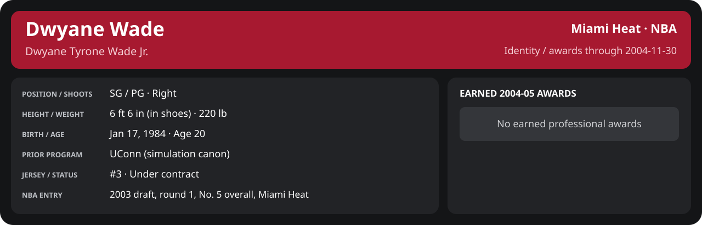

<!-- Generated by scripts/update_player_reports.py; edit source records, then rebuild. -->

# Week 4: 2004-11-22 to 2004-11-30 | Detailed statistics

[Week summary](README.md) · [Career](../../../../README.md) · [Professional identity](../../../../Professional_Identity.md) · [Earned awards](../../../../Awards.md) · [Stat definitions](../../../../../../docs/player_statistics.md)

## Professional identity

| Player | Age on report date | Team / league | Position | Number | Status |
| --- | --- | --- | --- | --- | --- |
| Dwyane Tyrone Wade Jr. | 20 | Miami Heat / NBA | SG / PG | 3 | Under contract |

| Identity field | Recorded value |
| --- | --- |
| Birth date | 1984-01-17 |
| NBA entry | 2003 draft, round 1, No. 5 overall, Miami Heat |
| Prior program | UConn (simulation canon) |
| Height, in shoes / without shoes | 6 ft 6 in / 6 ft 4.75 in |
| Weight | 220 lb |
| Wingspan / standing reach | 6 ft 11.5 in / 8 ft 7.5 in |
| Shooting hand | Right |
| Contract | Rookie scale signed 2003-07-21: three seasons plus a 2006-07 team option (2004-05: $2,361,800) |
| Role | Starting SG; staff plan 34 minutes |
| NBA debut | October 28, 2003 at Philadelphia 76ers (2003-04/06_Regular_Season/10_October/Week_4/Game_1.md) |
| Nationality | United States (born in the Chicago area; Robbins, Illinois home community, per the player profile) |
| National team | No selection recorded |
| National-team eligibility | United States (USA Basketball); no selection yet |
| Availability | No current restriction recorded in the established profile |
| Physical measurements recorded | 2003-06-25 |
| Professional status effective | 2004-10-28 |

Identity as of 2004-11-30; status snapshot dated 2004-10-28. User-established alternate-history player; historical Wade's biography and results are not this record.

### Earned 2004-05 awards

No 2004-05 awards yet.

## Statistics

As of **2004-11-30**: 5 closed games; 5/5 have player participation and box coverage; recorded DNPs: 1.

G counts appearances; GS counts recorded starts. DNPs, scheduled games and canceled games do not enter per-game denominators.

### Per game

  

[Shooting detail](../../../Shooting.md) · [Current contract](../../../Contract.md#current-contract) · [Contract history](../../../Contract.md#contract-history) · [Annual award record](../../../Awards.md)

| Scope | Age | Team | Lg | Pos | G | GS | MP | FG | FGA | FG% | 3P | 3PA | 3P% | 2P | 2PA | 2P% | eFG% | FT | FTA | FT% | ORB | DRB | TRB | AST | STL | BLK | TOV | PF | PTS | TS% (est.) | Awards |
| --- | --- | --- | --- | --- | --- | --- | --- | --- | --- | --- | --- | --- | --- | --- | --- | --- | --- | --- | --- | --- | --- | --- | --- | --- | --- | --- | --- | --- | --- | --- | --- |
| This scope | 20 | Miami Heat | NBA | SG / PG | 4 | 4 | 39.0 | 4.0 | 10.8 | .372 | 1.0 | 2.0 | .500 | 3.0 | 8.8 | .343 | .419 | 4.8 | 5.0 | .950 | 2.2 | 4.2 | 6.5 | 4.0 | 2.2 | 2.8 | 1.8 | 3.0 | 13.8 | .531 | — |

G and GS are counts; MP and counting statistics are **per appearance**. Shooting uses **.500 = 50.0%**. Age is at the row's cutoff. Scroll horizontally for every column.

Awards are confirmed through 2006-03-19, filed by the honor's period-end date; the banner shows career awards known at the page's identity cutoff.

### Production

| Metric | Total | Per appearance | Per 36 minutes |
| --- | --- | --- | --- |
| MIN | 156.1 | 39.0 | 36.0 |
| PTS | 55 | 13.8 | 12.7 |
| OREB | 9 | 2.2 | 2.1 |
| DREB | 17 | 4.2 | 3.9 |
| REB | 26 | 6.5 | 6.0 |
| AST | 16 | 4.0 | 3.7 |
| STL | 9 | 2.2 | 2.1 |
| BLK | 11 | 2.8 | 2.5 |
| TOV | 7 | 1.8 | 1.6 |
| PF | 12 | 3.0 | 2.8 |
| FGM | 16 | 4.0 | 3.7 |
| FGA | 43 | 10.8 | 9.9 |
| 2PM | 12 | 3.0 | 2.8 |
| 2PA | 35 | 8.8 | 8.1 |
| 3PM | 4 | 1.0 | 0.9 |
| 3PA | 8 | 2.0 | 1.8 |
| FTM | 19 | 4.8 | 4.4 |
| FTA | 20 | 5.0 | 4.6 |
| FT points | 19 | 4.8 | 4.4 |

Per-36 rates standardize playing time; they are not a projection of playing 36 minutes. Use the actual minutes denominator in every competition.

### Shooting

| Shot type | Makes | Attempts | Percentage |
| --- | --- | --- | --- |
| All field goals | 16 | 43 | 37.2% |
| Two-pointers | 12 | 35 | 34.3% |
| Three-pointers | 4 | 8 | 50.0% |
| Free throws | 19 | 20 | 95.0% |

### Efficiency and shot selection

| Metric | Value | Calculation / unit |
| --- | --- | --- |
| eFG% | 41.9% | (FGM + 0.5 × 3PM) / FGA |
| TS% (estimated) | 53.1% | PTS / [2 × (FGA + 0.44 × FTA)] |
| Three-point attempt share | 18.6% | 3PA / FGA |
| Free-throw attempt rate | 0.465 | FTA / FGA; ratio |
| Assist / turnover ratio | 2.29 | AST / TOV; N/A at zero turnovers |
| Plus/minus total | N/A | Observed on-court score differential only |
| Double-doubles | 0 | At least 10 in any two of PTS, REB, AST, STL, BLK |
| Triple-doubles | 0 | At least 10 in any three; also included in double-doubles |

Percentages use pooled makes and attempts. TS% uses an estimated free-throw weighting, not exact scoring possessions. Rounding is display-only.

### Splits

  

[Shooting detail](../../../Shooting.md) · [Current contract](../../../Contract.md#current-contract) · [Contract history](../../../Contract.md#contract-history) · [Annual award record](../../../Awards.md)

| Scope | Age | Team | Lg | Pos | G | GS | MP | FG | FGA | FG% | 3P | 3PA | 3P% | 2P | 2PA | 2P% | eFG% | FT | FTA | FT% | ORB | DRB | TRB | AST | STL | BLK | TOV | PF | PTS | TS% (est.) | Awards |
| --- | --- | --- | --- | --- | --- | --- | --- | --- | --- | --- | --- | --- | --- | --- | --- | --- | --- | --- | --- | --- | --- | --- | --- | --- | --- | --- | --- | --- | --- | --- | --- |
| Home | 20 | Miami Heat | NBA | SG / PG | 2 | 2 | 41.5 | 4.5 | 12.0 | .375 | 1.5 | 3.0 | .500 | 3.0 | 9.0 | .333 | .438 | 6.0 | 6.5 | .923 | 1.5 | 4.0 | 5.5 | 3.5 | 1.5 | 3.5 | 3.0 | 2.5 | 16.5 | .555 | — |
| Away | 20 | Miami Heat | NBA | SG / PG | 2 | 2 | 36.5 | 3.5 | 9.5 | .368 | 0.5 | 1.0 | .500 | 3.0 | 8.5 | .353 | .395 | 3.5 | 3.5 | 1.000 | 3.0 | 4.5 | 7.5 | 4.5 | 3.0 | 2.0 | 0.5 | 3.5 | 11.0 | .498 | — |
| Neutral | 20 | Miami Heat | NBA | SG / PG | 0 | N/A | N/A | N/A | N/A | N/A | N/A | N/A | N/A | N/A | N/A | N/A | N/A | N/A | N/A | N/A | N/A | N/A | N/A | N/A | N/A | N/A | N/A | N/A | N/A | N/A | — |
| Wins | 20 | Miami Heat | NBA | SG / PG | 2 | 2 | 39.1 | 2.0 | 8.5 | .235 | 0.5 | 0.5 | 1.000 | 1.5 | 8.0 | .188 | .265 | 5.5 | 6.0 | .917 | 2.0 | 4.0 | 6.0 | 5.5 | 3.0 | 2.5 | 1.0 | 2.5 | 10.0 | .449 | — |
| Losses | 20 | Miami Heat | NBA | SG / PG | 2 | 2 | 38.9 | 6.0 | 13.0 | .462 | 1.5 | 3.5 | .429 | 4.5 | 9.5 | .474 | .519 | 4.0 | 4.0 | 1.000 | 2.5 | 4.5 | 7.0 | 2.5 | 1.5 | 3.0 | 2.5 | 3.5 | 17.5 | .593 | — |
| Team: Miami Heat | 20 | Miami Heat | NBA | SG / PG | 4 | 4 | 39.0 | 4.0 | 10.8 | .372 | 1.0 | 2.0 | .500 | 3.0 | 8.8 | .343 | .419 | 4.8 | 5.0 | .950 | 2.2 | 4.2 | 6.5 | 4.0 | 2.2 | 2.8 | 1.8 | 3.0 | 13.8 | .531 | — |

G and GS are counts; MP and counting statistics are **per appearance**. Shooting uses **.500 = 50.0%**. Age is at the row's cutoff. Scroll horizontally for every column.

Awards are confirmed through 2006-03-19, filed by the honor's period-end date; the banner shows career awards known at the page's identity cutoff.

Splits overlap and are not additive. Each row has its own appearance denominator; games with unknown result classification are excluded from win/loss splits.

### Game highs

| Metric | High | Date / opponent (all ties) |
| --- | --- | --- |
| PTS | 23 | [2004-11-30 vs Toronto Raptors](../../../../2004-05/06_Regular_Season/11_November/Week_4/Game_5.md) |
| REB | 9 | [2004-11-26 at Detroit Pistons](../../../../2004-05/06_Regular_Season/11_November/Week_4/Game_3.md) |
| AST | 6 | [2004-11-28 vs Boston Celtics](../../../../2004-05/06_Regular_Season/11_November/Week_4/Game_4.md) |
| STL | 4 | [2004-11-26 at Detroit Pistons](../../../../2004-05/06_Regular_Season/11_November/Week_4/Game_3.md) |
| BLK | 4 | [2004-11-30 vs Toronto Raptors](../../../../2004-05/06_Regular_Season/11_November/Week_4/Game_5.md) |
| TOV | 4 | [2004-11-30 vs Toronto Raptors](../../../../2004-05/06_Regular_Season/11_November/Week_4/Game_5.md) |

### Game log

| Date / source | Opponent | Venue | Result | Participation | MIN | PTS | REB | AST | STL | BLK | TOV |
| --- | --- | --- | --- | --- | --- | --- | --- | --- | --- | --- | --- |
| [2004-11-23](../../../../2004-05/06_Regular_Season/11_November/Week_4/Game_1.md) | Portland Trail Blazers | home | L 95-97 | DNP: inactive (reason not specified) | N/A | N/A | N/A | N/A | N/A | N/A | N/A |
| [2004-11-24](../../../../2004-05/06_Regular_Season/11_November/Week_4/Game_2.md) | Atlanta Hawks | away | L 84-108 | Played | 33.1 | 12 | 6 | 4 | 2 | 2 | 1 |
| [2004-11-26](../../../../2004-05/06_Regular_Season/11_November/Week_4/Game_3.md) | Detroit Pistons | away | W 98-88 | Played | 39.9 | 10 | 9 | 5 | 4 | 2 | 0 |
| [2004-11-28](../../../../2004-05/06_Regular_Season/11_November/Week_4/Game_4.md) | Boston Celtics | home | W 108-87 | Played | 38.4 | 10 | 3 | 6 | 2 | 3 | 2 |
| [2004-11-30](../../../../2004-05/06_Regular_Season/11_November/Week_4/Game_5.md) | Toronto Raptors | home | L 97-106 | Played | 44.6 | 23 | 8 | 1 | 1 | 4 | 4 |

### Individual game boxes

| Scope | Age | Team | Lg | Pos | G | GS | MP | FG | FGA | FG% | 3P | 3PA | 3P% | 2P | 2PA | 2P% | eFG% | FT | FTA | FT% | ORB | DRB | TRB | AST | STL | BLK | TOV | PF | PTS | TS% (est.) | Awards |
| --- | --- | --- | --- | --- | --- | --- | --- | --- | --- | --- | --- | --- | --- | --- | --- | --- | --- | --- | --- | --- | --- | --- | --- | --- | --- | --- | --- | --- | --- | --- | --- |
| [2004-11-23](../../../../2004-05/06_Regular_Season/11_November/Week_4/Game_1.md) | 20 | Miami Heat | NBA | SG / PG | 0 | N/A | N/A | N/A | N/A | N/A | N/A | N/A | N/A | N/A | N/A | N/A | N/A | N/A | N/A | N/A | N/A | N/A | N/A | N/A | N/A | N/A | N/A | N/A | N/A | N/A | — |
| [2004-11-24](../../../../2004-05/06_Regular_Season/11_November/Week_4/Game_2.md) | 20 | Miami Heat | NBA | SG / PG | 1 | 1 | 33.1 | 5.0 | 9.0 | .556 | 1.0 | 2.0 | .500 | 4.0 | 7.0 | .571 | .611 | 1.0 | 1.0 | 1.000 | 3.0 | 3.0 | 6.0 | 4.0 | 2.0 | 2.0 | 1.0 | 3.0 | 12.0 | .636 | — |
| [2004-11-26](../../../../2004-05/06_Regular_Season/11_November/Week_4/Game_3.md) | 20 | Miami Heat | NBA | SG / PG | 1 | 1 | 39.9 | 2.0 | 10.0 | .200 | 0.0 | 0.0 | N/A | 2.0 | 10.0 | .200 | .200 | 6.0 | 6.0 | 1.000 | 3.0 | 6.0 | 9.0 | 5.0 | 4.0 | 2.0 | 0.0 | 4.0 | 10.0 | .396 | — |
| [2004-11-28](../../../../2004-05/06_Regular_Season/11_November/Week_4/Game_4.md) | 20 | Miami Heat | NBA | SG / PG | 1 | 1 | 38.4 | 2.0 | 7.0 | .286 | 1.0 | 1.0 | 1.000 | 1.0 | 6.0 | .167 | .357 | 5.0 | 6.0 | .833 | 1.0 | 2.0 | 3.0 | 6.0 | 2.0 | 3.0 | 2.0 | 1.0 | 10.0 | .519 | — |
| [2004-11-30](../../../../2004-05/06_Regular_Season/11_November/Week_4/Game_5.md) | 20 | Miami Heat | NBA | SG / PG | 1 | 1 | 44.6 | 7.0 | 17.0 | .412 | 2.0 | 5.0 | .400 | 5.0 | 12.0 | .417 | .471 | 7.0 | 7.0 | 1.000 | 2.0 | 6.0 | 8.0 | 1.0 | 1.0 | 4.0 | 4.0 | 4.0 | 23.0 | .573 | — |

G and GS are counts; MP and counting statistics are **per appearance**. Shooting uses **.500 = 50.0%**. Age is at the row's cutoff. Scroll horizontally for every column.

Awards are confirmed through 2006-03-19, filed by the honor's period-end date; the banner shows career awards known at the page's identity cutoff.

### Game shooting detail

| Date / source | FG | 2P | 3P | FT | eFG% | TS% (est.) | +/- | PF |
| --- | --- | --- | --- | --- | --- | --- | --- | --- |
| [2004-11-24](../../../../2004-05/06_Regular_Season/11_November/Week_4/Game_2.md) | 5/9 | 4/7 | 1/2 | 1/1 | 61.1% | 63.6% | N/A | 3 |
| [2004-11-26](../../../../2004-05/06_Regular_Season/11_November/Week_4/Game_3.md) | 2/10 | 2/10 | 0/0 | 6/6 | 20.0% | 39.6% | N/A | 4 |
| [2004-11-28](../../../../2004-05/06_Regular_Season/11_November/Week_4/Game_4.md) | 2/7 | 1/6 | 1/1 | 5/6 | 35.7% | 51.9% | N/A | 1 |
| [2004-11-30](../../../../2004-05/06_Regular_Season/11_November/Week_4/Game_5.md) | 7/17 | 5/12 | 2/5 | 7/7 | 47.1% | 57.3% | N/A | 4 |

### Additional data needed

| Statistic family | Current support | Required evidence |
| --- | --- | --- |
| Starts; plus/minus | N/A unless supplied in the player box | Explicit started and plus_minus fields |
| Per 100 possessions; offensive / defensive / net rating | Unavailable in current box feed | Player on-court possessions and both teams' scoring during those possessions |
| USG%; AST%; OREB%, DREB%, REB% | Unavailable in current box feed | Matching player/team/opponent opportunity counts and a declared method |
| Rim, paint, midrange, corner / above-break threes | Unavailable in current box feed | Shot locations, attempts and makes |
| Drives, touches, catch-and-shoot, pull-ups, play types | Unavailable in current box feed | Tracking or tagged play-by-play |
| Clutch, on/off, lineup combinations, assisted baskets | Unavailable in current box feed | Timed events, score state, substitutions and possession attribution |
| Deflections, charges, contested shots, box outs | Unavailable in current box feed | Observed hustle/defensive events |
| League rank, percentile, relative TS%; impact models | Not derived by this report | Same-period simulated league baseline, eligibility rules and documented model |
