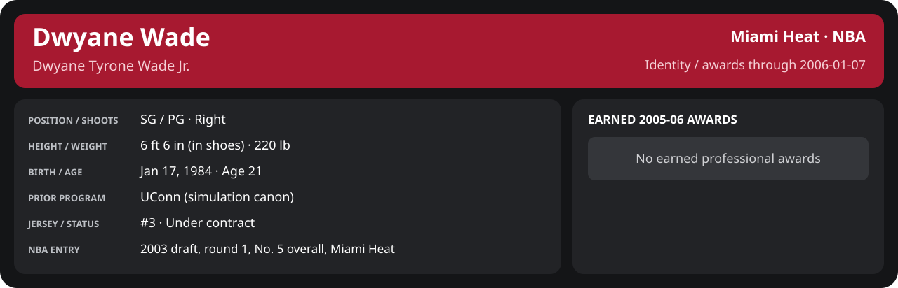

<!-- Generated by scripts/update_player_reports.py; edit source records, then rebuild. -->

# Week 1: 2006-01-01 to 2006-01-07

[Career](../../../../README.md) · [Professional identity](../../../../Professional_Identity.md) · [Earned awards](../../../../Awards.md) · [Stat definitions](../../../../../../docs/player_statistics.md) · [Month](../README.md) · [Miami](../../../Team/2005-06/01_January/Week_1/Team_Stats.md) · [NBA players](../../../League/2005-06/01_January/Week_1/League_Stats.md) · [NBA awards](../../../League/2005-06/01_January/Week_1/League_Awards.md) · [Period decisions](../../../../2005-06/06_Regular_Season/01_January/Week_1/note.md) · [Previous week](../../12_December/Week_4/README.md) · [Next week](../Week_2/README.md)

## Professional identity

| Player | Age on report date | Team / league | Position | Number | Status |
| --- | --- | --- | --- | --- | --- |
| Dwyane Tyrone Wade Jr. | 21 | Miami Heat / NBA | SG / PG | 3 | Under contract |

| Identity field | Recorded value |
| --- | --- |
| Birth date | 1984-01-17 |
| NBA entry | 2003 draft, round 1, No. 5 overall, Miami Heat |
| Prior program | UConn (simulation canon) |
| Height, in shoes / without shoes | 6 ft 6 in / 6 ft 4.75 in |
| Weight | 220 lb |
| Wingspan / standing reach | 6 ft 11.5 in / 8 ft 7.5 in |
| Shooting hand | Right |
| Contract | Rookie scale signed 2003-07-21: three seasons plus a 2006-07 team option (2004-05: $2,361,800) |
| Role | Starting SG; staff plan 34 minutes |
| NBA debut | October 28, 2003 at Philadelphia 76ers (2003-04/06_Regular_Season/10_October/Week_4/Game_1.md) |
| Nationality | United States (born in the Chicago area; Robbins, Illinois home community, per the player profile) |
| National team | No selection recorded |
| National-team eligibility | United States (USA Basketball); no selection yet |
| Availability | No current restriction recorded in the established profile |
| Physical measurements recorded | 2003-06-25 |
| Professional status effective | 2005-10-26 |

Identity as of 2006-01-07; status snapshot dated 2005-10-26. User-established alternate-history player; historical Wade's biography and results are not this record.

### Earned 2005-06 awards

| Award | Period | Announced | Decision record |
| --- | --- | --- | --- |
| Eastern Conference Player of the Week | 2005-11-07 to 2005-11-13 | 2005-11-14 | [East POW](../../../League/2005-06/11_November/Week_2/League_Awards.md#player-of-the-week) |
| Eastern Conference Player of the Week | 2005-11-14 to 2005-11-20 | 2005-11-21 | [East POW](../../../League/2005-06/11_November/Week_3/League_Awards.md#player-of-the-week) |
| Eastern Conference Player of the Month | 2005-11-01 to 2005-11-30 | 2005-12-02 | [East POM](../../../League/2005-06/11_November/League_Awards.md#player-of-the-month) |
| Eastern Conference Player of the Week | 2005-11-28 to 2005-12-04 | 2005-12-05 | [East POW](../../../League/2005-06/12_December/Week_1/League_Awards.md#player-of-the-week) |
| Eastern Conference Player of the Week | 2005-12-05 to 2005-12-11 | 2005-12-12 | [East POW](../../../League/2005-06/12_December/Week_2/League_Awards.md#player-of-the-week) |
| Eastern Conference Player of the Week | 2005-12-26 to 2006-01-01 | 2006-01-02 | [East POW](../../../League/2005-06/01_January/Week_1/League_Awards.md#player-of-the-week) |

## Statistics

As of **2006-01-07**: 3 closed games; 3/3 have player participation and box coverage; recorded DNPs: 0.

G counts appearances; GS counts recorded starts. DNPs, scheduled games and canceled games do not enter per-game denominators.

### Per game

  

[Shooting detail](../../../Shooting.md) · [Current contract](../../../Contract.md#current-contract) · [Contract history](../../../Contract.md#contract-history) · [Annual award record](../../../Awards.md)

| Scope | Age | Team | Lg | Pos | G | GS | MP | FG | FGA | FG% | 3P | 3PA | 3P% | 2P | 2PA | 2P% | eFG% | FT | FTA | FT% | ORB | DRB | TRB | AST | STL | BLK | TOV | PF | PTS | TS% (est.) | Awards |
| --- | --- | --- | --- | --- | --- | --- | --- | --- | --- | --- | --- | --- | --- | --- | --- | --- | --- | --- | --- | --- | --- | --- | --- | --- | --- | --- | --- | --- | --- | --- | --- |
| This scope | 21 | Miami Heat | NBA | SG / PG | 3 | 3 | 43.5 | 13.7 | 23.3 | .586 | 2.7 | 6.0 | .444 | 11.0 | 17.3 | .635 | .643 | 5.3 | 5.3 | 1.000 | 1.7 | 5.3 | 7.0 | 2.7 | 4.0 | 0.7 | 2.7 | 1.3 | 35.3 | .688 | [East POW](../../../League/2005-06/01_January/Week_1/League_Awards.md#player-of-the-week) |

G and GS are counts; MP and counting statistics are **per appearance**. Shooting uses **.500 = 50.0%**. Age is at the row's cutoff. Scroll horizontally for every column.

Awards are confirmed through 2006-04-02, filed by the honor's period-end date; the banner shows career awards known at the page's identity cutoff.

[Full statistical detail: totals, per 36, shooting, efficiency, splits and source games](Stat_Detail.md)

### Period comparison

  

[Shooting detail](../../../Shooting.md) · [Current contract](../../../Contract.md#current-contract) · [Contract history](../../../Contract.md#contract-history) · [Annual award record](../../../Awards.md)

| Scope | Age | Team | Lg | Pos | G | GS | MP | FG | FGA | FG% | 3P | 3PA | 3P% | 2P | 2PA | 2P% | eFG% | FT | FTA | FT% | ORB | DRB | TRB | AST | STL | BLK | TOV | PF | PTS | TS% (est.) | Awards |
| --- | --- | --- | --- | --- | --- | --- | --- | --- | --- | --- | --- | --- | --- | --- | --- | --- | --- | --- | --- | --- | --- | --- | --- | --- | --- | --- | --- | --- | --- | --- | --- |
| This week | 21 | Miami Heat | NBA | SG / PG | 3 | 3 | 43.5 | 13.7 | 23.3 | .586 | 2.7 | 6.0 | .444 | 11.0 | 17.3 | .635 | .643 | 5.3 | 5.3 | 1.000 | 1.7 | 5.3 | 7.0 | 2.7 | 4.0 | 0.7 | 2.7 | 1.3 | 35.3 | .688 | [East POW](../../../League/2005-06/01_January/Week_1/League_Awards.md#player-of-the-week) |
| [Previous week](../../12_December/Week_4/README.md) | 21 | Miami Heat | NBA | SG / PG | 5 | 5 | 36.8 | 8.8 | 16.2 | .543 | 1.2 | 3.0 | .400 | 7.6 | 13.2 | .576 | .580 | 5.8 | 6.2 | .935 | 1.4 | 3.8 | 5.2 | 4.6 | 1.0 | 1.8 | 2.2 | 3.4 | 24.6 | .650 | — |
| Month through this week | 21 | Miami Heat | NBA | SG / PG | 3 | 3 | 43.5 | 13.7 | 23.3 | .586 | 2.7 | 6.0 | .444 | 11.0 | 17.3 | .635 | .643 | 5.3 | 5.3 | 1.000 | 1.7 | 5.3 | 7.0 | 2.7 | 4.0 | 0.7 | 2.7 | 1.3 | 35.3 | .688 | [East POW](../../../League/2005-06/01_January/Week_1/League_Awards.md#player-of-the-week) |
| Season through this week | 21 | Miami Heat | NBA | SG / PG | 34 | 34 | 37.3 | 9.0 | 16.1 | .558 | 1.5 | 3.2 | .459 | 7.5 | 12.9 | .583 | .604 | 6.5 | 6.9 | .940 | 1.9 | 4.6 | 6.4 | 4.1 | 1.9 | 1.1 | 1.9 | 3.1 | 26.0 | .678 | [East POW](../../../League/2005-06/11_November/Week_2/League_Awards.md#player-of-the-week), [East POW](../../../League/2005-06/11_November/Week_3/League_Awards.md#player-of-the-week), [East POM](../../../League/2005-06/11_November/League_Awards.md#player-of-the-month), [East POW](../../../League/2005-06/12_December/Week_1/League_Awards.md#player-of-the-week), [East POW](../../../League/2005-06/12_December/Week_2/League_Awards.md#player-of-the-week), [East POW](../../../League/2005-06/01_January/Week_1/League_Awards.md#player-of-the-week) |

G and GS are counts; MP and counting statistics are **per appearance**. Shooting uses **.500 = 50.0%**. Age is at the row's cutoff. Scroll horizontally for every column.

Awards are confirmed through 2006-04-02, filed by the honor's period-end date; the banner shows career awards known at the page's identity cutoff.

### Production

| Metric | Total | Per appearance | Per 36 minutes |
| --- | --- | --- | --- |
| MIN | 130.5 | 43.5 | 36.0 |
| PTS | 106 | 35.3 | 29.3 |
| OREB | 5 | 1.7 | 1.4 |
| DREB | 16 | 5.3 | 4.4 |
| REB | 21 | 7.0 | 5.8 |
| AST | 8 | 2.7 | 2.2 |
| STL | 12 | 4.0 | 3.3 |
| BLK | 2 | 0.7 | 0.6 |
| TOV | 8 | 2.7 | 2.2 |
| PF | 4 | 1.3 | 1.1 |
| FGM | 41 | 13.7 | 11.3 |
| FGA | 70 | 23.3 | 19.3 |
| 2PM | 33 | 11.0 | 9.1 |
| 2PA | 52 | 17.3 | 14.3 |
| 3PM | 8 | 2.7 | 2.2 |
| 3PA | 18 | 6.0 | 5.0 |
| FTM | 16 | 5.3 | 4.4 |
| FTA | 16 | 5.3 | 4.4 |
| FT points | 16 | 5.3 | 4.4 |

Per-36 rates standardize playing time; they are not a projection of playing 36 minutes. Use the actual minutes denominator in every competition.

### Shooting

| Shot type | Makes | Attempts | Percentage |
| --- | --- | --- | --- |
| All field goals | 41 | 70 | 58.6% |
| Two-pointers | 33 | 52 | 63.5% |
| Three-pointers | 8 | 18 | 44.4% |
| Free throws | 16 | 16 | 100.0% |

### Efficiency and shot selection

| Metric | Value | Calculation / unit |
| --- | --- | --- |
| eFG% | 64.3% | (FGM + 0.5 × 3PM) / FGA |
| TS% (estimated) | 68.8% | PTS / [2 × (FGA + 0.44 × FTA)] |
| Three-point attempt share | 25.7% | 3PA / FGA |
| Free-throw attempt rate | 0.229 | FTA / FGA; ratio |
| Assist / turnover ratio | 1.00 | AST / TOV; N/A at zero turnovers |
| Plus/minus total | N/A | Observed on-court score differential only |
| Double-doubles | 1 | At least 10 in any two of PTS, REB, AST, STL, BLK |
| Triple-doubles | 0 | At least 10 in any three; also included in double-doubles |

Percentages use pooled makes and attempts. TS% uses an estimated free-throw weighting, not exact scoring possessions. Rounding is display-only.

### Splits

  

[Shooting detail](../../../Shooting.md) · [Current contract](../../../Contract.md#current-contract) · [Contract history](../../../Contract.md#contract-history) · [Annual award record](../../../Awards.md)

| Scope | Age | Team | Lg | Pos | G | GS | MP | FG | FGA | FG% | 3P | 3PA | 3P% | 2P | 2PA | 2P% | eFG% | FT | FTA | FT% | ORB | DRB | TRB | AST | STL | BLK | TOV | PF | PTS | TS% (est.) | Awards |
| --- | --- | --- | --- | --- | --- | --- | --- | --- | --- | --- | --- | --- | --- | --- | --- | --- | --- | --- | --- | --- | --- | --- | --- | --- | --- | --- | --- | --- | --- | --- | --- |
| Home | 21 | Miami Heat | NBA | SG / PG | 1 | 1 | 47.3 | 17.0 | 24.0 | .708 | 4.0 | 9.0 | .444 | 13.0 | 15.0 | .867 | .792 | 6.0 | 6.0 | 1.000 | 3.0 | 8.0 | 11.0 | 1.0 | 3.0 | 0.0 | 0.0 | 2.0 | 44.0 | .826 | — |
| Away | 21 | Miami Heat | NBA | SG / PG | 2 | 2 | 41.6 | 12.0 | 23.0 | .522 | 2.0 | 4.5 | .444 | 10.0 | 18.5 | .541 | .565 | 5.0 | 5.0 | 1.000 | 1.0 | 4.0 | 5.0 | 3.5 | 4.5 | 1.0 | 4.0 | 1.0 | 31.0 | .615 | — |
| Neutral | 21 | Miami Heat | NBA | SG / PG | 0 | N/A | N/A | N/A | N/A | N/A | N/A | N/A | N/A | N/A | N/A | N/A | N/A | N/A | N/A | N/A | N/A | N/A | N/A | N/A | N/A | N/A | N/A | N/A | N/A | N/A | — |
| Wins | 21 | Miami Heat | NBA | SG / PG | 2 | 2 | 44.3 | 14.0 | 21.5 | .651 | 2.5 | 5.5 | .455 | 11.5 | 16.0 | .719 | .709 | 5.0 | 5.0 | 1.000 | 1.5 | 6.5 | 8.0 | 3.0 | 2.5 | 0.5 | 2.0 | 2.0 | 35.5 | .749 | — |
| Losses | 21 | Miami Heat | NBA | SG / PG | 1 | 1 | 41.9 | 13.0 | 27.0 | .481 | 3.0 | 7.0 | .429 | 10.0 | 20.0 | .500 | .537 | 6.0 | 6.0 | 1.000 | 2.0 | 3.0 | 5.0 | 2.0 | 7.0 | 1.0 | 4.0 | 0.0 | 35.0 | .590 | — |
| Team: Miami Heat | 21 | Miami Heat | NBA | SG / PG | 3 | 3 | 43.5 | 13.7 | 23.3 | .586 | 2.7 | 6.0 | .444 | 11.0 | 17.3 | .635 | .643 | 5.3 | 5.3 | 1.000 | 1.7 | 5.3 | 7.0 | 2.7 | 4.0 | 0.7 | 2.7 | 1.3 | 35.3 | .688 | — |

G and GS are counts; MP and counting statistics are **per appearance**. Shooting uses **.500 = 50.0%**. Age is at the row's cutoff. Scroll horizontally for every column.

Awards are confirmed through 2006-04-02, filed by the honor's period-end date; the banner shows career awards known at the page's identity cutoff.

Splits overlap and are not additive. Each row has its own appearance denominator; games with unknown result classification are excluded from win/loss splits.

### Game highs

| Metric | High | Date / opponent (all ties) |
| --- | --- | --- |
| PTS | 44 | [2006-01-01 vs Minnesota Timberwolves](../../../../2005-06/06_Regular_Season/01_January/Week_1/Game_1.md) |
| REB | 11 | [2006-01-01 vs Minnesota Timberwolves](../../../../2005-06/06_Regular_Season/01_January/Week_1/Game_1.md) |
| AST | 5 | [2006-01-04 at New Orleans/Oklahoma City Hornets](../../../../2005-06/06_Regular_Season/01_January/Week_1/Game_2.md) |
| STL | 7 | [2006-01-06 at Phoenix Suns](../../../../2005-06/06_Regular_Season/01_January/Week_1/Game_3.md) |
| BLK | 1 | [2006-01-04 at New Orleans/Oklahoma City Hornets](../../../../2005-06/06_Regular_Season/01_January/Week_1/Game_2.md); [2006-01-06 at Phoenix Suns](../../../../2005-06/06_Regular_Season/01_January/Week_1/Game_3.md) |
| TOV | 4 | [2006-01-04 at New Orleans/Oklahoma City Hornets](../../../../2005-06/06_Regular_Season/01_January/Week_1/Game_2.md); [2006-01-06 at Phoenix Suns](../../../../2005-06/06_Regular_Season/01_January/Week_1/Game_3.md) |

### Game log

| Date / source | Opponent | Venue | Result | Participation | MIN | PTS | REB | AST | STL | BLK | TOV |
| --- | --- | --- | --- | --- | --- | --- | --- | --- | --- | --- | --- |
| [2006-01-01](../../../../2005-06/06_Regular_Season/01_January/Week_1/Game_1.md) | Minnesota Timberwolves | home | W 133-126 | Played | 47.3 | 44 | 11 | 1 | 3 | 0 | 0 |
| [2006-01-04](../../../../2005-06/06_Regular_Season/01_January/Week_1/Game_2.md) | New Orleans/Oklahoma City Hornets | away | W 94-85 | Played | 41.2 | 27 | 5 | 5 | 2 | 1 | 4 |
| [2006-01-06](../../../../2005-06/06_Regular_Season/01_January/Week_1/Game_3.md) | Phoenix Suns | away | L 105-111 | Played | 41.9 | 35 | 5 | 2 | 7 | 1 | 4 |

### Individual game boxes

| Scope | Age | Team | Lg | Pos | G | GS | MP | FG | FGA | FG% | 3P | 3PA | 3P% | 2P | 2PA | 2P% | eFG% | FT | FTA | FT% | ORB | DRB | TRB | AST | STL | BLK | TOV | PF | PTS | TS% (est.) | Awards |
| --- | --- | --- | --- | --- | --- | --- | --- | --- | --- | --- | --- | --- | --- | --- | --- | --- | --- | --- | --- | --- | --- | --- | --- | --- | --- | --- | --- | --- | --- | --- | --- |
| [2006-01-01](../../../../2005-06/06_Regular_Season/01_January/Week_1/Game_1.md) | 21 | Miami Heat | NBA | SG / PG | 1 | 1 | 47.3 | 17.0 | 24.0 | .708 | 4.0 | 9.0 | .444 | 13.0 | 15.0 | .867 | .792 | 6.0 | 6.0 | 1.000 | 3.0 | 8.0 | 11.0 | 1.0 | 3.0 | 0.0 | 0.0 | 2.0 | 44.0 | .826 | — |
| [2006-01-04](../../../../2005-06/06_Regular_Season/01_January/Week_1/Game_2.md) | 21 | Miami Heat | NBA | SG / PG | 1 | 1 | 41.2 | 11.0 | 19.0 | .579 | 1.0 | 2.0 | .500 | 10.0 | 17.0 | .588 | .605 | 4.0 | 4.0 | 1.000 | 0.0 | 5.0 | 5.0 | 5.0 | 2.0 | 1.0 | 4.0 | 2.0 | 27.0 | .650 | — |
| [2006-01-06](../../../../2005-06/06_Regular_Season/01_January/Week_1/Game_3.md) | 21 | Miami Heat | NBA | SG / PG | 1 | 1 | 41.9 | 13.0 | 27.0 | .481 | 3.0 | 7.0 | .429 | 10.0 | 20.0 | .500 | .537 | 6.0 | 6.0 | 1.000 | 2.0 | 3.0 | 5.0 | 2.0 | 7.0 | 1.0 | 4.0 | 0.0 | 35.0 | .590 | — |

G and GS are counts; MP and counting statistics are **per appearance**. Shooting uses **.500 = 50.0%**. Age is at the row's cutoff. Scroll horizontally for every column.

Awards are confirmed through 2006-04-02, filed by the honor's period-end date; the banner shows career awards known at the page's identity cutoff.

### Game shooting detail

| Date / source | FG | 2P | 3P | FT | eFG% | TS% (est.) | +/- | PF |
| --- | --- | --- | --- | --- | --- | --- | --- | --- |
| [2006-01-01](../../../../2005-06/06_Regular_Season/01_January/Week_1/Game_1.md) | 17/24 | 13/15 | 4/9 | 6/6 | 79.2% | 82.6% | N/A | 2 |
| [2006-01-04](../../../../2005-06/06_Regular_Season/01_January/Week_1/Game_2.md) | 11/19 | 10/17 | 1/2 | 4/4 | 60.5% | 65.0% | N/A | 2 |
| [2006-01-06](../../../../2005-06/06_Regular_Season/01_January/Week_1/Game_3.md) | 13/27 | 10/20 | 3/7 | 6/6 | 53.7% | 59.0% | N/A | 0 |

### Additional data needed

| Statistic family | Current support | Required evidence |
| --- | --- | --- |
| Starts; plus/minus | N/A unless supplied in the player box | Explicit started and plus_minus fields |
| Per 100 possessions; offensive / defensive / net rating | Unavailable in current box feed | Player on-court possessions and both teams' scoring during those possessions |
| USG%; AST%; OREB%, DREB%, REB% | Unavailable in current box feed | Matching player/team/opponent opportunity counts and a declared method |
| Rim, paint, midrange, corner / above-break threes | Unavailable in current box feed | Shot locations, attempts and makes |
| Drives, touches, catch-and-shoot, pull-ups, play types | Unavailable in current box feed | Tracking or tagged play-by-play |
| Clutch, on/off, lineup combinations, assisted baskets | Unavailable in current box feed | Timed events, score state, substitutions and possession attribution |
| Deflections, charges, contested shots, box outs | Unavailable in current box feed | Observed hustle/defensive events |
| League rank, percentile, relative TS%; impact models | Not derived by this report | Same-period simulated league baseline, eligibility rules and documented model |
