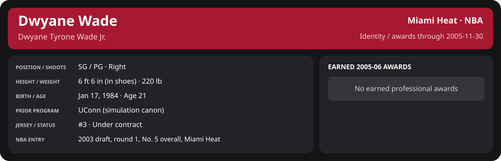

<!-- Generated by scripts/update_player_reports.py; edit source records, then rebuild. -->

# November 2005 | Detailed statistics

[Month summary](README.md) · [Career](../../../README.md) · [Professional identity](../../../Professional_Identity.md) · [Earned awards](../../../Awards.md) · [Stat definitions](../../../../../docs/player_statistics.md)

## Professional identity

| Player | Age on report date | Team / league | Position | Number | Status |
| --- | --- | --- | --- | --- | --- |
| Dwyane Tyrone Wade Jr. | 21 | Miami Heat / NBA | SG / PG | 3 | Under contract |

| Identity field | Recorded value |
| --- | --- |
| Birth date | 1984-01-17 |
| NBA entry | 2003 draft, round 1, No. 5 overall, Miami Heat |
| Prior program | UConn (simulation canon) |
| Height, in shoes / without shoes | 6 ft 6 in / 6 ft 4.75 in |
| Weight | 220 lb |
| Wingspan / standing reach | 6 ft 11.5 in / 8 ft 7.5 in |
| Shooting hand | Right |
| Contract | Rookie scale signed 2003-07-21: three seasons plus a 2006-07 team option (2004-05: $2,361,800) |
| Role | Starting SG; staff plan 34 minutes |
| NBA debut | October 28, 2003 at Philadelphia 76ers (2003-04/06_Regular_Season/10_October/Week_4/Game_1.md) |
| Nationality | United States (born in the Chicago area; Robbins, Illinois home community, per the player profile) |
| National team | No selection recorded |
| National-team eligibility | United States (USA Basketball); no selection yet |
| Availability | No current restriction recorded in the established profile |
| Physical measurements recorded | 2003-06-25 |
| Professional status effective | 2005-10-26 |

Identity as of 2005-11-30; status snapshot dated 2005-10-26. User-established alternate-history player; historical Wade's biography and results are not this record.

### Earned 2005-06 awards

| Award | Period | Announced | Decision record |
| --- | --- | --- | --- |
| Eastern Conference Player of the Week | 2005-11-07 to 2005-11-13 | 2005-11-14 | [East POW](../../League/2005-06/11_November/Week_2/League_Awards.md#player-of-the-week) |
| Eastern Conference Player of the Week | 2005-11-14 to 2005-11-20 | 2005-11-21 | [East POW](../../League/2005-06/11_November/Week_3/League_Awards.md#player-of-the-week) |

## Statistics

As of **2005-11-30**: 15 closed games; 15/15 have player participation and box coverage; recorded DNPs: 0.

G counts appearances; GS counts recorded starts. DNPs, scheduled games and canceled games do not enter per-game denominators.

### Per game

  

[Shooting detail](../../Shooting.md) · [Current contract](../../Contract.md#current-contract) · [Contract history](../../Contract.md#contract-history) · [Annual award record](../../Awards.md)

| Scope | Age | Team | Lg | Pos | G | GS | MP | FG | FGA | FG% | 3P | 3PA | 3P% | 2P | 2PA | 2P% | eFG% | FT | FTA | FT% | ORB | DRB | TRB | AST | STL | BLK | TOV | PF | PTS | TS% (est.) | Awards |
| --- | --- | --- | --- | --- | --- | --- | --- | --- | --- | --- | --- | --- | --- | --- | --- | --- | --- | --- | --- | --- | --- | --- | --- | --- | --- | --- | --- | --- | --- | --- | --- |
| This scope | 21 | Miami Heat | NBA | SG / PG | 15 | 15 | 37.0 | 8.9 | 15.1 | .593 | 1.5 | 2.7 | .550 | 7.5 | 12.4 | .602 | .642 | 6.7 | 7.4 | .910 | 1.9 | 5.0 | 6.9 | 4.3 | 1.9 | 0.9 | 2.0 | 3.0 | 26.1 | .711 | [East POW](../../League/2005-06/11_November/Week_2/League_Awards.md#player-of-the-week), [East POW](../../League/2005-06/11_November/Week_3/League_Awards.md#player-of-the-week), [East POM](../../League/2005-06/11_November/League_Awards.md#player-of-the-month) |

G and GS are counts; MP and counting statistics are **per appearance**. Shooting uses **.500 = 50.0%**. Age is at the row's cutoff. Scroll horizontally for every column.

Awards are confirmed through 2006-03-13, filed by the honor's period-end date; the banner shows career awards known at the page's identity cutoff.

### Production

| Metric | Total | Per appearance | Per 36 minutes |
| --- | --- | --- | --- |
| MIN | 554.9 | 37.0 | 36.0 |
| PTS | 391 | 26.1 | 25.4 |
| OREB | 28 | 1.9 | 1.8 |
| DREB | 75 | 5.0 | 4.9 |
| REB | 103 | 6.9 | 6.7 |
| AST | 65 | 4.3 | 4.2 |
| STL | 28 | 1.9 | 1.8 |
| BLK | 13 | 0.9 | 0.8 |
| TOV | 30 | 2.0 | 1.9 |
| PF | 45 | 3.0 | 2.9 |
| FGM | 134 | 8.9 | 8.7 |
| FGA | 226 | 15.1 | 14.7 |
| 2PM | 112 | 7.5 | 7.3 |
| 2PA | 186 | 12.4 | 12.1 |
| 3PM | 22 | 1.5 | 1.4 |
| 3PA | 40 | 2.7 | 2.6 |
| FTM | 101 | 6.7 | 6.6 |
| FTA | 111 | 7.4 | 7.2 |
| FT points | 101 | 6.7 | 6.6 |

Per-36 rates standardize playing time; they are not a projection of playing 36 minutes. Use the actual minutes denominator in every competition.

### Shooting

| Shot type | Makes | Attempts | Percentage |
| --- | --- | --- | --- |
| All field goals | 134 | 226 | 59.3% |
| Two-pointers | 112 | 186 | 60.2% |
| Three-pointers | 22 | 40 | 55.0% |
| Free throws | 101 | 111 | 91.0% |

### Efficiency and shot selection

| Metric | Value | Calculation / unit |
| --- | --- | --- |
| eFG% | 64.2% | (FGM + 0.5 × 3PM) / FGA |
| TS% (estimated) | 71.1% | PTS / [2 × (FGA + 0.44 × FTA)] |
| Three-point attempt share | 17.7% | 3PA / FGA |
| Free-throw attempt rate | 0.491 | FTA / FGA; ratio |
| Assist / turnover ratio | 2.17 | AST / TOV; N/A at zero turnovers |
| Plus/minus total | N/A | Observed on-court score differential only |
| Double-doubles | 4 | At least 10 in any two of PTS, REB, AST, STL, BLK |
| Triple-doubles | 0 | At least 10 in any three; also included in double-doubles |

Percentages use pooled makes and attempts. TS% uses an estimated free-throw weighting, not exact scoring possessions. Rounding is display-only.

### Splits

  

[Shooting detail](../../Shooting.md) · [Current contract](../../Contract.md#current-contract) · [Contract history](../../Contract.md#contract-history) · [Annual award record](../../Awards.md)

| Scope | Age | Team | Lg | Pos | G | GS | MP | FG | FGA | FG% | 3P | 3PA | 3P% | 2P | 2PA | 2P% | eFG% | FT | FTA | FT% | ORB | DRB | TRB | AST | STL | BLK | TOV | PF | PTS | TS% (est.) | Awards |
| --- | --- | --- | --- | --- | --- | --- | --- | --- | --- | --- | --- | --- | --- | --- | --- | --- | --- | --- | --- | --- | --- | --- | --- | --- | --- | --- | --- | --- | --- | --- | --- |
| Home | 21 | Miami Heat | NBA | SG / PG | 9 | 9 | 37.1 | 8.7 | 15.1 | .574 | 1.1 | 2.7 | .417 | 7.6 | 12.4 | .607 | .610 | 6.8 | 7.3 | .924 | 1.7 | 6.1 | 7.8 | 5.0 | 2.2 | 0.6 | 1.3 | 2.6 | 25.2 | .688 | — |
| Away | 21 | Miami Heat | NBA | SG / PG | 6 | 6 | 36.8 | 9.3 | 15.0 | .622 | 2.0 | 2.7 | .750 | 7.3 | 12.3 | .595 | .689 | 6.7 | 7.5 | .889 | 2.2 | 3.3 | 5.5 | 3.3 | 1.3 | 1.3 | 3.0 | 3.7 | 27.3 | .747 | — |
| Neutral | 21 | Miami Heat | NBA | SG / PG | 0 | N/A | N/A | N/A | N/A | N/A | N/A | N/A | N/A | N/A | N/A | N/A | N/A | N/A | N/A | N/A | N/A | N/A | N/A | N/A | N/A | N/A | N/A | N/A | N/A | N/A | — |
| Wins | 21 | Miami Heat | NBA | SG / PG | 11 | 11 | 38.5 | 9.7 | 15.7 | .618 | 1.5 | 2.8 | .548 | 8.2 | 12.9 | .634 | .668 | 7.5 | 8.0 | .943 | 2.0 | 5.8 | 7.8 | 4.4 | 2.0 | 0.8 | 1.9 | 2.9 | 28.5 | .742 | — |
| Losses | 21 | Miami Heat | NBA | SG / PG | 4 | 4 | 33.0 | 6.8 | 13.2 | .509 | 1.2 | 2.2 | .556 | 5.5 | 11.0 | .500 | .557 | 4.5 | 5.8 | .783 | 1.5 | 2.8 | 4.2 | 4.2 | 1.5 | 1.0 | 2.2 | 3.2 | 19.2 | .610 | — |
| Team: Miami Heat | 21 | Miami Heat | NBA | SG / PG | 15 | 15 | 37.0 | 8.9 | 15.1 | .593 | 1.5 | 2.7 | .550 | 7.5 | 12.4 | .602 | .642 | 6.7 | 7.4 | .910 | 1.9 | 5.0 | 6.9 | 4.3 | 1.9 | 0.9 | 2.0 | 3.0 | 26.1 | .711 | — |

G and GS are counts; MP and counting statistics are **per appearance**. Shooting uses **.500 = 50.0%**. Age is at the row's cutoff. Scroll horizontally for every column.

Awards are confirmed through 2006-03-13, filed by the honor's period-end date; the banner shows career awards known at the page's identity cutoff.

Splits overlap and are not additive. Each row has its own appearance denominator; games with unknown result classification are excluded from win/loss splits.

### Game highs

| Metric | High | Date / opponent (all ties) |
| --- | --- | --- |
| PTS | 41 | [2005-11-30 at Atlanta Hawks](../../../2005-06/06_Regular_Season/11_November/Week_4/Game_5.md) |
| REB | 13 | [2005-11-18 vs Philadelphia 76ers](../../../2005-06/06_Regular_Season/11_November/Week_3/Game_2.md) |
| AST | 9 | [2005-11-25 vs Dallas Mavericks](../../../2005-06/06_Regular_Season/11_November/Week_4/Game_2.md) |
| STL | 4 | [2005-11-03 vs Indiana Pacers](../../../2005-06/06_Regular_Season/11_November/Week_1/Game_2.md); [2005-11-12 vs Charlotte Bobcats](../../../2005-06/06_Regular_Season/11_November/Week_2/Game_3.md); [2005-11-15 vs New Orleans/Oklahoma City Hornets](../../../2005-06/06_Regular_Season/11_November/Week_3/Game_1.md); [2005-11-30 at Atlanta Hawks](../../../2005-06/06_Regular_Season/11_November/Week_4/Game_5.md) |
| BLK | 3 | [2005-11-30 at Atlanta Hawks](../../../2005-06/06_Regular_Season/11_November/Week_4/Game_5.md) |
| TOV | 5 | [2005-11-05 at Milwaukee Bucks](../../../2005-06/06_Regular_Season/11_November/Week_1/Game_3.md) |

### Game log

| Date / source | Opponent | Venue | Result | Participation | MIN | PTS | REB | AST | STL | BLK | TOV |
| --- | --- | --- | --- | --- | --- | --- | --- | --- | --- | --- | --- |
| [2005-11-02](../../../2005-06/06_Regular_Season/11_November/Week_1/Game_1.md) | Memphis Grizzlies | away | L 92-103 | Played | 33.0 | 26 | 1 | 3 | 0 | 1 | 3 |
| [2005-11-03](../../../2005-06/06_Regular_Season/11_November/Week_1/Game_2.md) | Indiana Pacers | home | L 94-97 | Played | 34.8 | 22 | 4 | 6 | 4 | 1 | 2 |
| [2005-11-05](../../../2005-06/06_Regular_Season/11_November/Week_1/Game_3.md) | Milwaukee Bucks | away | W 118-104 | Played | 32.9 | 28 | 6 | 1 | 0 | 1 | 5 |
| [2005-11-07](../../../2005-06/06_Regular_Season/11_November/Week_1/Game_4.md) | New Jersey Nets | home | W 106-89 | Played | 21.7 | 16 | 4 | 2 | 0 | 1 | 2 |
| [2005-11-09](../../../2005-06/06_Regular_Season/11_November/Week_2/Game_1.md) | Indiana Pacers | away | L 103-104 | Played | 36.7 | 22 | 8 | 2 | 2 | 2 | 2 |
| [2005-11-10](../../../2005-06/06_Regular_Season/11_November/Week_2/Game_2.md) | Houston Rockets | home | W 103-83 | Played | 36.4 | 18 | 11 | 3 | 2 | 0 | 0 |
| [2005-11-12](../../../2005-06/06_Regular_Season/11_November/Week_2/Game_3.md) | Charlotte Bobcats | home | W 117-104 | Played | 41.4 | 38 | 7 | 1 | 4 | 1 | 2 |
| [2005-11-15](../../../2005-06/06_Regular_Season/11_November/Week_3/Game_1.md) | New Orleans/Oklahoma City Hornets | home | W 95-84 | Played | 39.9 | 30 | 10 | 8 | 4 | 0 | 1 |
| [2005-11-18](../../../2005-06/06_Regular_Season/11_November/Week_3/Game_2.md) | Philadelphia 76ers | home | W 114-101 | Played | 39.4 | 18 | 13 | 7 | 1 | 1 | 1 |
| [2005-11-20](../../../2005-06/06_Regular_Season/11_November/Week_3/Game_3.md) | Toronto Raptors | away | W 94-81 | Played | 39.8 | 40 | 6 | 5 | 2 | 1 | 2 |
| [2005-11-23](../../../2005-06/06_Regular_Season/11_November/Week_4/Game_1.md) | Portland Trail Blazers | home | W 120-102 | Played | 39.2 | 35 | 3 | 5 | 2 | 0 | 1 |
| [2005-11-25](../../../2005-06/06_Regular_Season/11_November/Week_4/Game_2.md) | Dallas Mavericks | home | W 103-91 | Played | 41.1 | 14 | 7 | 9 | 0 | 1 | 2 |
| [2005-11-26](../../../2005-06/06_Regular_Season/11_November/Week_4/Game_3.md) | Orlando Magic | away | L 110-115 | Played | 27.5 | 7 | 4 | 6 | 0 | 0 | 2 |
| [2005-11-28](../../../2005-06/06_Regular_Season/11_November/Week_4/Game_4.md) | New York Knicks | home | W 107-96 | Played | 40.1 | 36 | 11 | 4 | 3 | 0 | 1 |
| [2005-11-30](../../../2005-06/06_Regular_Season/11_November/Week_4/Game_5.md) | Atlanta Hawks | away | W 129-126 | Played | 51.1 | 41 | 8 | 3 | 4 | 3 | 4 |

### Individual game boxes

| Scope | Age | Team | Lg | Pos | G | GS | MP | FG | FGA | FG% | 3P | 3PA | 3P% | 2P | 2PA | 2P% | eFG% | FT | FTA | FT% | ORB | DRB | TRB | AST | STL | BLK | TOV | PF | PTS | TS% (est.) | Awards |
| --- | --- | --- | --- | --- | --- | --- | --- | --- | --- | --- | --- | --- | --- | --- | --- | --- | --- | --- | --- | --- | --- | --- | --- | --- | --- | --- | --- | --- | --- | --- | --- |
| [2005-11-02](../../../2005-06/06_Regular_Season/11_November/Week_1/Game_1.md) | 21 | Miami Heat | NBA | SG / PG | 1 | 1 | 33.0 | 8.0 | 16.0 | .500 | 2.0 | 2.0 | 1.000 | 6.0 | 14.0 | .429 | .562 | 8.0 | 10.0 | .800 | 0.0 | 1.0 | 1.0 | 3.0 | 0.0 | 1.0 | 3.0 | 2.0 | 26.0 | .637 | — |
| [2005-11-03](../../../2005-06/06_Regular_Season/11_November/Week_1/Game_2.md) | 21 | Miami Heat | NBA | SG / PG | 1 | 1 | 34.8 | 8.0 | 19.0 | .421 | 1.0 | 5.0 | .200 | 7.0 | 14.0 | .500 | .447 | 5.0 | 5.0 | 1.000 | 2.0 | 2.0 | 4.0 | 6.0 | 4.0 | 1.0 | 2.0 | 1.0 | 22.0 | .519 | — |
| [2005-11-05](../../../2005-06/06_Regular_Season/11_November/Week_1/Game_3.md) | 21 | Miami Heat | NBA | SG / PG | 1 | 1 | 32.9 | 8.0 | 13.0 | .615 | 4.0 | 5.0 | .800 | 4.0 | 8.0 | .500 | .769 | 8.0 | 8.0 | 1.000 | 4.0 | 2.0 | 6.0 | 1.0 | 0.0 | 1.0 | 5.0 | 4.0 | 28.0 | .847 | — |
| [2005-11-07](../../../2005-06/06_Regular_Season/11_November/Week_1/Game_4.md) | 21 | Miami Heat | NBA | SG / PG | 1 | 1 | 21.7 | 5.0 | 6.0 | .833 | 0.0 | 1.0 | .000 | 5.0 | 5.0 | 1.000 | .833 | 6.0 | 6.0 | 1.000 | 0.0 | 4.0 | 4.0 | 2.0 | 0.0 | 1.0 | 2.0 | 5.0 | 16.0 | .926 | — |
| [2005-11-09](../../../2005-06/06_Regular_Season/11_November/Week_2/Game_1.md) | 21 | Miami Heat | NBA | SG / PG | 1 | 1 | 36.7 | 9.0 | 13.0 | .692 | 2.0 | 2.0 | 1.000 | 7.0 | 11.0 | .636 | .769 | 2.0 | 4.0 | .500 | 2.0 | 6.0 | 8.0 | 2.0 | 2.0 | 2.0 | 2.0 | 5.0 | 22.0 | .745 | — |
| [2005-11-10](../../../2005-06/06_Regular_Season/11_November/Week_2/Game_2.md) | 21 | Miami Heat | NBA | SG / PG | 1 | 1 | 36.4 | 5.0 | 11.0 | .455 | 2.0 | 3.0 | .667 | 3.0 | 8.0 | .375 | .545 | 6.0 | 8.0 | .750 | 3.0 | 8.0 | 11.0 | 3.0 | 2.0 | 0.0 | 0.0 | 4.0 | 18.0 | .620 | — |
| [2005-11-12](../../../2005-06/06_Regular_Season/11_November/Week_2/Game_3.md) | 21 | Miami Heat | NBA | SG / PG | 1 | 1 | 41.4 | 15.0 | 25.0 | .600 | 0.0 | 3.0 | .000 | 15.0 | 22.0 | .682 | .600 | 8.0 | 8.0 | 1.000 | 0.0 | 7.0 | 7.0 | 1.0 | 4.0 | 1.0 | 2.0 | 2.0 | 38.0 | .666 | — |
| [2005-11-15](../../../2005-06/06_Regular_Season/11_November/Week_3/Game_1.md) | 21 | Miami Heat | NBA | SG / PG | 1 | 1 | 39.9 | 11.0 | 17.0 | .647 | 3.0 | 4.0 | .750 | 8.0 | 13.0 | .615 | .735 | 5.0 | 5.0 | 1.000 | 3.0 | 7.0 | 10.0 | 8.0 | 4.0 | 0.0 | 1.0 | 1.0 | 30.0 | .781 | — |
| [2005-11-18](../../../2005-06/06_Regular_Season/11_November/Week_3/Game_2.md) | 21 | Miami Heat | NBA | SG / PG | 1 | 1 | 39.4 | 7.0 | 10.0 | .700 | 0.0 | 1.0 | .000 | 7.0 | 9.0 | .778 | .700 | 4.0 | 4.0 | 1.000 | 5.0 | 8.0 | 13.0 | 7.0 | 1.0 | 1.0 | 1.0 | 3.0 | 18.0 | .765 | — |
| [2005-11-20](../../../2005-06/06_Regular_Season/11_November/Week_3/Game_3.md) | 21 | Miami Heat | NBA | SG / PG | 1 | 1 | 39.8 | 13.0 | 15.0 | .867 | 2.0 | 2.0 | 1.000 | 11.0 | 13.0 | .846 | .933 | 12.0 | 12.0 | 1.000 | 2.0 | 4.0 | 6.0 | 5.0 | 2.0 | 1.0 | 2.0 | 2.0 | 40.0 | .986 | — |
| [2005-11-23](../../../2005-06/06_Regular_Season/11_November/Week_4/Game_1.md) | 21 | Miami Heat | NBA | SG / PG | 1 | 1 | 39.2 | 10.0 | 17.0 | .588 | 3.0 | 4.0 | .750 | 7.0 | 13.0 | .538 | .676 | 12.0 | 13.0 | .923 | 1.0 | 2.0 | 3.0 | 5.0 | 2.0 | 0.0 | 1.0 | 1.0 | 35.0 | .770 | — |
| [2005-11-25](../../../2005-06/06_Regular_Season/11_November/Week_4/Game_2.md) | 21 | Miami Heat | NBA | SG / PG | 1 | 1 | 41.1 | 6.0 | 14.0 | .429 | 0.0 | 1.0 | .000 | 6.0 | 13.0 | .462 | .429 | 2.0 | 2.0 | 1.000 | 1.0 | 6.0 | 7.0 | 9.0 | 0.0 | 1.0 | 2.0 | 3.0 | 14.0 | .470 | — |
| [2005-11-26](../../../2005-06/06_Regular_Season/11_November/Week_4/Game_3.md) | 21 | Miami Heat | NBA | SG / PG | 1 | 1 | 27.5 | 2.0 | 5.0 | .400 | 0.0 | 0.0 | N/A | 2.0 | 5.0 | .400 | .400 | 3.0 | 4.0 | .750 | 2.0 | 2.0 | 4.0 | 6.0 | 0.0 | 0.0 | 2.0 | 5.0 | 7.0 | .518 | — |
| [2005-11-28](../../../2005-06/06_Regular_Season/11_November/Week_4/Game_4.md) | 21 | Miami Heat | NBA | SG / PG | 1 | 1 | 40.1 | 11.0 | 17.0 | .647 | 1.0 | 2.0 | .500 | 10.0 | 15.0 | .667 | .676 | 13.0 | 15.0 | .867 | 0.0 | 11.0 | 11.0 | 4.0 | 3.0 | 0.0 | 1.0 | 3.0 | 36.0 | .763 | — |
| [2005-11-30](../../../2005-06/06_Regular_Season/11_November/Week_4/Game_5.md) | 21 | Miami Heat | NBA | SG / PG | 1 | 1 | 51.1 | 16.0 | 28.0 | .571 | 2.0 | 5.0 | .400 | 14.0 | 23.0 | .609 | .607 | 7.0 | 7.0 | 1.000 | 3.0 | 5.0 | 8.0 | 3.0 | 4.0 | 3.0 | 4.0 | 4.0 | 41.0 | .660 | — |

G and GS are counts; MP and counting statistics are **per appearance**. Shooting uses **.500 = 50.0%**. Age is at the row's cutoff. Scroll horizontally for every column.

Awards are confirmed through 2006-03-13, filed by the honor's period-end date; the banner shows career awards known at the page's identity cutoff.

### Game shooting detail

| Date / source | FG | 2P | 3P | FT | eFG% | TS% (est.) | +/- | PF |
| --- | --- | --- | --- | --- | --- | --- | --- | --- |
| [2005-11-02](../../../2005-06/06_Regular_Season/11_November/Week_1/Game_1.md) | 8/16 | 6/14 | 2/2 | 8/10 | 56.2% | 63.7% | N/A | 2 |
| [2005-11-03](../../../2005-06/06_Regular_Season/11_November/Week_1/Game_2.md) | 8/19 | 7/14 | 1/5 | 5/5 | 44.7% | 51.9% | N/A | 1 |
| [2005-11-05](../../../2005-06/06_Regular_Season/11_November/Week_1/Game_3.md) | 8/13 | 4/8 | 4/5 | 8/8 | 76.9% | 84.7% | N/A | 4 |
| [2005-11-07](../../../2005-06/06_Regular_Season/11_November/Week_1/Game_4.md) | 5/6 | 5/5 | 0/1 | 6/6 | 83.3% | 92.6% | N/A | 5 |
| [2005-11-09](../../../2005-06/06_Regular_Season/11_November/Week_2/Game_1.md) | 9/13 | 7/11 | 2/2 | 2/4 | 76.9% | 74.5% | N/A | 5 |
| [2005-11-10](../../../2005-06/06_Regular_Season/11_November/Week_2/Game_2.md) | 5/11 | 3/8 | 2/3 | 6/8 | 54.5% | 62.0% | N/A | 4 |
| [2005-11-12](../../../2005-06/06_Regular_Season/11_November/Week_2/Game_3.md) | 15/25 | 15/22 | 0/3 | 8/8 | 60.0% | 66.6% | N/A | 2 |
| [2005-11-15](../../../2005-06/06_Regular_Season/11_November/Week_3/Game_1.md) | 11/17 | 8/13 | 3/4 | 5/5 | 73.5% | 78.1% | N/A | 1 |
| [2005-11-18](../../../2005-06/06_Regular_Season/11_November/Week_3/Game_2.md) | 7/10 | 7/9 | 0/1 | 4/4 | 70.0% | 76.5% | N/A | 3 |
| [2005-11-20](../../../2005-06/06_Regular_Season/11_November/Week_3/Game_3.md) | 13/15 | 11/13 | 2/2 | 12/12 | 93.3% | 98.6% | N/A | 2 |
| [2005-11-23](../../../2005-06/06_Regular_Season/11_November/Week_4/Game_1.md) | 10/17 | 7/13 | 3/4 | 12/13 | 67.6% | 77.0% | N/A | 1 |
| [2005-11-25](../../../2005-06/06_Regular_Season/11_November/Week_4/Game_2.md) | 6/14 | 6/13 | 0/1 | 2/2 | 42.9% | 47.0% | N/A | 3 |
| [2005-11-26](../../../2005-06/06_Regular_Season/11_November/Week_4/Game_3.md) | 2/5 | 2/5 | 0/0 | 3/4 | 40.0% | 51.8% | N/A | 5 |
| [2005-11-28](../../../2005-06/06_Regular_Season/11_November/Week_4/Game_4.md) | 11/17 | 10/15 | 1/2 | 13/15 | 67.6% | 76.3% | N/A | 3 |
| [2005-11-30](../../../2005-06/06_Regular_Season/11_November/Week_4/Game_5.md) | 16/28 | 14/23 | 2/5 | 7/7 | 60.7% | 66.0% | N/A | 4 |

### Additional data needed

| Statistic family | Current support | Required evidence |
| --- | --- | --- |
| Starts; plus/minus | N/A unless supplied in the player box | Explicit started and plus_minus fields |
| Per 100 possessions; offensive / defensive / net rating | Unavailable in current box feed | Player on-court possessions and both teams' scoring during those possessions |
| USG%; AST%; OREB%, DREB%, REB% | Unavailable in current box feed | Matching player/team/opponent opportunity counts and a declared method |
| Rim, paint, midrange, corner / above-break threes | Unavailable in current box feed | Shot locations, attempts and makes |
| Drives, touches, catch-and-shoot, pull-ups, play types | Unavailable in current box feed | Tracking or tagged play-by-play |
| Clutch, on/off, lineup combinations, assisted baskets | Unavailable in current box feed | Timed events, score state, substitutions and possession attribution |
| Deflections, charges, contested shots, box outs | Unavailable in current box feed | Observed hustle/defensive events |
| League rank, percentile, relative TS%; impact models | Not derived by this report | Same-period simulated league baseline, eligibility rules and documented model |
