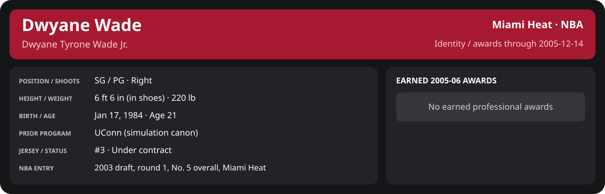

<!-- Generated by scripts/update_player_reports.py; edit source records, then rebuild. -->

# Week 2: 2005-12-08 to 2005-12-14 | Detailed statistics

[Week summary](README.md) · [Career](../../../../README.md) · [Professional identity](../../../../Professional_Identity.md) · [Earned awards](../../../../Awards.md) · [Stat definitions](../../../../../../docs/player_statistics.md)

## Professional identity

| Player | Age on report date | Team / league | Position | Number | Status |
| --- | --- | --- | --- | --- | --- |
| Dwyane Tyrone Wade Jr. | 21 | Miami Heat / NBA | SG / PG | 3 | Under contract |

| Identity field | Recorded value |
| --- | --- |
| Birth date | 1984-01-17 |
| NBA entry | 2003 draft, round 1, No. 5 overall, Miami Heat |
| Prior program | UConn (simulation canon) |
| Height, in shoes / without shoes | 6 ft 6 in / 6 ft 4.75 in |
| Weight | 220 lb |
| Wingspan / standing reach | 6 ft 11.5 in / 8 ft 7.5 in |
| Shooting hand | Right |
| Contract | Rookie scale signed 2003-07-21: three seasons plus a 2006-07 team option (2004-05: $2,361,800) |
| Role | Starting SG; staff plan 34 minutes |
| NBA debut | October 28, 2003 at Philadelphia 76ers (2003-04/06_Regular_Season/10_October/Week_4/Game_1.md) |
| Nationality | United States (born in the Chicago area; Robbins, Illinois home community, per the player profile) |
| National team | No selection recorded |
| National-team eligibility | United States (USA Basketball); no selection yet |
| Availability | No current restriction recorded in the established profile |
| Physical measurements recorded | 2003-06-25 |
| Professional status effective | 2005-10-26 |

Identity as of 2005-12-14; status snapshot dated 2005-10-26. User-established alternate-history player; historical Wade's biography and results are not this record.

### Earned 2005-06 awards

| Award | Period | Announced | Decision record |
| --- | --- | --- | --- |
| Eastern Conference Player of the Week | 2005-11-07 to 2005-11-13 | 2005-11-14 | [East POW](../../../League/2005-06/11_November/Week_2/League_Awards.md#player-of-the-week) |
| Eastern Conference Player of the Week | 2005-11-14 to 2005-11-20 | 2005-11-21 | [East POW](../../../League/2005-06/11_November/Week_3/League_Awards.md#player-of-the-week) |
| Eastern Conference Player of the Month | 2005-11-01 to 2005-11-30 | 2005-12-02 | [East POM](../../../League/2005-06/11_November/League_Awards.md#player-of-the-month) |
| Eastern Conference Player of the Week | 2005-11-28 to 2005-12-04 | 2005-12-05 | [East POW](../../../League/2005-06/12_December/Week_1/League_Awards.md#player-of-the-week) |
| Eastern Conference Player of the Week | 2005-12-05 to 2005-12-11 | 2005-12-12 | [East POW](../../../League/2005-06/12_December/Week_2/League_Awards.md#player-of-the-week) |

## Statistics

As of **2005-12-14**: 4 closed games; 4/4 have player participation and box coverage; recorded DNPs: 0.

G counts appearances; GS counts recorded starts. DNPs, scheduled games and canceled games do not enter per-game denominators.

### Per game

  

[Shooting detail](../../../Shooting.md) · [Current contract](../../../Contract.md#current-contract) · [Contract history](../../../Contract.md#contract-history) · [Annual award record](../../../Awards.md)

| Scope | Age | Team | Lg | Pos | G | GS | MP | FG | FGA | FG% | 3P | 3PA | 3P% | 2P | 2PA | 2P% | eFG% | FT | FTA | FT% | ORB | DRB | TRB | AST | STL | BLK | TOV | PF | PTS | TS% (est.) | Awards |
| --- | --- | --- | --- | --- | --- | --- | --- | --- | --- | --- | --- | --- | --- | --- | --- | --- | --- | --- | --- | --- | --- | --- | --- | --- | --- | --- | --- | --- | --- | --- | --- |
| This scope | 21 | Miami Heat | NBA | SG / PG | 4 | 4 | 38.7 | 8.2 | 14.8 | .559 | 1.5 | 3.8 | .400 | 6.8 | 11.0 | .614 | .610 | 6.2 | 6.5 | .962 | 1.5 | 5.2 | 6.8 | 3.8 | 1.0 | 1.8 | 1.2 | 3.5 | 24.2 | .689 | [East POW](../../../League/2005-06/12_December/Week_2/League_Awards.md#player-of-the-week) |

G and GS are counts; MP and counting statistics are **per appearance**. Shooting uses **.500 = 50.0%**. Age is at the row's cutoff. Scroll horizontally for every column.

Awards are confirmed through 2006-01-02, filed by the honor's period-end date; the banner shows career awards known at the page's identity cutoff.

### Production

| Metric | Total | Per appearance | Per 36 minutes |
| --- | --- | --- | --- |
| MIN | 154.8 | 38.7 | 36.0 |
| PTS | 97 | 24.2 | 22.6 |
| OREB | 6 | 1.5 | 1.4 |
| DREB | 21 | 5.2 | 4.9 |
| REB | 27 | 6.8 | 6.3 |
| AST | 15 | 3.8 | 3.5 |
| STL | 4 | 1.0 | 0.9 |
| BLK | 7 | 1.8 | 1.6 |
| TOV | 5 | 1.2 | 1.2 |
| PF | 14 | 3.5 | 3.3 |
| FGM | 33 | 8.2 | 7.7 |
| FGA | 59 | 14.8 | 13.7 |
| 2PM | 27 | 6.8 | 6.3 |
| 2PA | 44 | 11.0 | 10.2 |
| 3PM | 6 | 1.5 | 1.4 |
| 3PA | 15 | 3.8 | 3.5 |
| FTM | 25 | 6.2 | 5.8 |
| FTA | 26 | 6.5 | 6.0 |
| FT points | 25 | 6.2 | 5.8 |

Per-36 rates standardize playing time; they are not a projection of playing 36 minutes. Use the actual minutes denominator in every competition.

### Shooting

| Shot type | Makes | Attempts | Percentage |
| --- | --- | --- | --- |
| All field goals | 33 | 59 | 55.9% |
| Two-pointers | 27 | 44 | 61.4% |
| Three-pointers | 6 | 15 | 40.0% |
| Free throws | 25 | 26 | 96.2% |

### Efficiency and shot selection

| Metric | Value | Calculation / unit |
| --- | --- | --- |
| eFG% | 61.0% | (FGM + 0.5 × 3PM) / FGA |
| TS% (estimated) | 68.9% | PTS / [2 × (FGA + 0.44 × FTA)] |
| Three-point attempt share | 25.4% | 3PA / FGA |
| Free-throw attempt rate | 0.441 | FTA / FGA; ratio |
| Assist / turnover ratio | 3.00 | AST / TOV; N/A at zero turnovers |
| Plus/minus total | N/A | Observed on-court score differential only |
| Double-doubles | 1 | At least 10 in any two of PTS, REB, AST, STL, BLK |
| Triple-doubles | 0 | At least 10 in any three; also included in double-doubles |

Percentages use pooled makes and attempts. TS% uses an estimated free-throw weighting, not exact scoring possessions. Rounding is display-only.

### Splits

  

[Shooting detail](../../../Shooting.md) · [Current contract](../../../Contract.md#current-contract) · [Contract history](../../../Contract.md#contract-history) · [Annual award record](../../../Awards.md)

| Scope | Age | Team | Lg | Pos | G | GS | MP | FG | FGA | FG% | 3P | 3PA | 3P% | 2P | 2PA | 2P% | eFG% | FT | FTA | FT% | ORB | DRB | TRB | AST | STL | BLK | TOV | PF | PTS | TS% (est.) | Awards |
| --- | --- | --- | --- | --- | --- | --- | --- | --- | --- | --- | --- | --- | --- | --- | --- | --- | --- | --- | --- | --- | --- | --- | --- | --- | --- | --- | --- | --- | --- | --- | --- |
| Home | 21 | Miami Heat | NBA | SG / PG | 2 | 2 | 40.9 | 8.5 | 14.5 | .586 | 1.5 | 3.0 | .500 | 7.0 | 11.5 | .609 | .638 | 7.5 | 8.0 | .938 | 2.0 | 6.0 | 8.0 | 4.5 | 1.0 | 1.5 | 1.5 | 3.5 | 26.0 | .721 | — |
| Away | 21 | Miami Heat | NBA | SG / PG | 2 | 2 | 36.5 | 8.0 | 15.0 | .533 | 1.5 | 4.5 | .333 | 6.5 | 10.5 | .619 | .583 | 5.0 | 5.0 | 1.000 | 1.0 | 4.5 | 5.5 | 3.0 | 1.0 | 2.0 | 1.0 | 3.5 | 22.5 | .654 | — |
| Neutral | 21 | Miami Heat | NBA | SG / PG | 0 | N/A | N/A | N/A | N/A | N/A | N/A | N/A | N/A | N/A | N/A | N/A | N/A | N/A | N/A | N/A | N/A | N/A | N/A | N/A | N/A | N/A | N/A | N/A | N/A | N/A | — |
| Wins | 21 | Miami Heat | NBA | SG / PG | 3 | 3 | 40.7 | 8.7 | 15.0 | .578 | 1.7 | 3.3 | .500 | 7.0 | 11.7 | .600 | .633 | 7.3 | 7.7 | .957 | 1.3 | 5.7 | 7.0 | 4.7 | 1.3 | 2.0 | 1.3 | 3.0 | 26.3 | .717 | — |
| Losses | 21 | Miami Heat | NBA | SG / PG | 1 | 1 | 32.7 | 7.0 | 14.0 | .500 | 1.0 | 5.0 | .200 | 6.0 | 9.0 | .667 | .536 | 3.0 | 3.0 | 1.000 | 2.0 | 4.0 | 6.0 | 1.0 | 0.0 | 1.0 | 1.0 | 5.0 | 18.0 | .587 | — |
| Team: Miami Heat | 21 | Miami Heat | NBA | SG / PG | 4 | 4 | 38.7 | 8.2 | 14.8 | .559 | 1.5 | 3.8 | .400 | 6.8 | 11.0 | .614 | .610 | 6.2 | 6.5 | .962 | 1.5 | 5.2 | 6.8 | 3.8 | 1.0 | 1.8 | 1.2 | 3.5 | 24.2 | .689 | — |

G and GS are counts; MP and counting statistics are **per appearance**. Shooting uses **.500 = 50.0%**. Age is at the row's cutoff. Scroll horizontally for every column.

Awards are confirmed through 2006-01-02, filed by the honor's period-end date; the banner shows career awards known at the page's identity cutoff.

Splits overlap and are not additive. Each row has its own appearance denominator; games with unknown result classification are excluded from win/loss splits.

### Game highs

| Metric | High | Date / opponent (all ties) |
| --- | --- | --- |
| PTS | 32 | [2005-12-09 vs Denver Nuggets](../../../../2005-06/06_Regular_Season/12_December/Week_2/Game_1.md) |
| REB | 10 | [2005-12-09 vs Denver Nuggets](../../../../2005-06/06_Regular_Season/12_December/Week_2/Game_1.md) |
| AST | 5 | [2005-12-11 vs Washington Wizards](../../../../2005-06/06_Regular_Season/12_December/Week_2/Game_2.md); [2005-12-13 at Chicago Bulls](../../../../2005-06/06_Regular_Season/12_December/Week_2/Game_3.md) |
| STL | 2 | [2005-12-09 vs Denver Nuggets](../../../../2005-06/06_Regular_Season/12_December/Week_2/Game_1.md); [2005-12-13 at Chicago Bulls](../../../../2005-06/06_Regular_Season/12_December/Week_2/Game_3.md) |
| BLK | 3 | [2005-12-13 at Chicago Bulls](../../../../2005-06/06_Regular_Season/12_December/Week_2/Game_3.md) |
| TOV | 2 | [2005-12-09 vs Denver Nuggets](../../../../2005-06/06_Regular_Season/12_December/Week_2/Game_1.md) |

### Game log

| Date / source | Opponent | Venue | Result | Participation | MIN | PTS | REB | AST | STL | BLK | TOV |
| --- | --- | --- | --- | --- | --- | --- | --- | --- | --- | --- | --- |
| [2005-12-09](../../../../2005-06/06_Regular_Season/12_December/Week_2/Game_1.md) | Denver Nuggets | home | W 106-105 | Played | 43.0 | 32 | 10 | 4 | 2 | 1 | 2 |
| [2005-12-11](../../../../2005-06/06_Regular_Season/12_December/Week_2/Game_2.md) | Washington Wizards | home | W 117-102 | Played | 38.8 | 20 | 6 | 5 | 0 | 2 | 1 |
| [2005-12-13](../../../../2005-06/06_Regular_Season/12_December/Week_2/Game_3.md) | Chicago Bulls | away | W 113-102 | Played | 40.3 | 27 | 5 | 5 | 2 | 3 | 1 |
| [2005-12-14](../../../../2005-06/06_Regular_Season/12_December/Week_2/Game_4.md) | Milwaukee Bucks | away | L 86-97 | Played | 32.7 | 18 | 6 | 1 | 0 | 1 | 1 |

### Individual game boxes

| Scope | Age | Team | Lg | Pos | G | GS | MP | FG | FGA | FG% | 3P | 3PA | 3P% | 2P | 2PA | 2P% | eFG% | FT | FTA | FT% | ORB | DRB | TRB | AST | STL | BLK | TOV | PF | PTS | TS% (est.) | Awards |
| --- | --- | --- | --- | --- | --- | --- | --- | --- | --- | --- | --- | --- | --- | --- | --- | --- | --- | --- | --- | --- | --- | --- | --- | --- | --- | --- | --- | --- | --- | --- | --- |
| [2005-12-09](../../../../2005-06/06_Regular_Season/12_December/Week_2/Game_1.md) | 21 | Miami Heat | NBA | SG / PG | 1 | 1 | 43.0 | 9.0 | 13.0 | .692 | 1.0 | 1.0 | 1.000 | 8.0 | 12.0 | .667 | .731 | 13.0 | 13.0 | 1.000 | 2.0 | 8.0 | 10.0 | 4.0 | 2.0 | 1.0 | 2.0 | 4.0 | 32.0 | .855 | — |
| [2005-12-11](../../../../2005-06/06_Regular_Season/12_December/Week_2/Game_2.md) | 21 | Miami Heat | NBA | SG / PG | 1 | 1 | 38.8 | 8.0 | 16.0 | .500 | 2.0 | 5.0 | .400 | 6.0 | 11.0 | .545 | .562 | 2.0 | 3.0 | .667 | 2.0 | 4.0 | 6.0 | 5.0 | 0.0 | 2.0 | 1.0 | 3.0 | 20.0 | .577 | — |
| [2005-12-13](../../../../2005-06/06_Regular_Season/12_December/Week_2/Game_3.md) | 21 | Miami Heat | NBA | SG / PG | 1 | 1 | 40.3 | 9.0 | 16.0 | .562 | 2.0 | 4.0 | .500 | 7.0 | 12.0 | .583 | .625 | 7.0 | 7.0 | 1.000 | 0.0 | 5.0 | 5.0 | 5.0 | 2.0 | 3.0 | 1.0 | 2.0 | 27.0 | .708 | — |
| [2005-12-14](../../../../2005-06/06_Regular_Season/12_December/Week_2/Game_4.md) | 21 | Miami Heat | NBA | SG / PG | 1 | 1 | 32.7 | 7.0 | 14.0 | .500 | 1.0 | 5.0 | .200 | 6.0 | 9.0 | .667 | .536 | 3.0 | 3.0 | 1.000 | 2.0 | 4.0 | 6.0 | 1.0 | 0.0 | 1.0 | 1.0 | 5.0 | 18.0 | .587 | — |

G and GS are counts; MP and counting statistics are **per appearance**. Shooting uses **.500 = 50.0%**. Age is at the row's cutoff. Scroll horizontally for every column.

Awards are confirmed through 2006-01-02, filed by the honor's period-end date; the banner shows career awards known at the page's identity cutoff.

### Game shooting detail

| Date / source | FG | 2P | 3P | FT | eFG% | TS% (est.) | +/- | PF |
| --- | --- | --- | --- | --- | --- | --- | --- | --- |
| [2005-12-09](../../../../2005-06/06_Regular_Season/12_December/Week_2/Game_1.md) | 9/13 | 8/12 | 1/1 | 13/13 | 73.1% | 85.5% | N/A | 4 |
| [2005-12-11](../../../../2005-06/06_Regular_Season/12_December/Week_2/Game_2.md) | 8/16 | 6/11 | 2/5 | 2/3 | 56.2% | 57.7% | N/A | 3 |
| [2005-12-13](../../../../2005-06/06_Regular_Season/12_December/Week_2/Game_3.md) | 9/16 | 7/12 | 2/4 | 7/7 | 62.5% | 70.8% | N/A | 2 |
| [2005-12-14](../../../../2005-06/06_Regular_Season/12_December/Week_2/Game_4.md) | 7/14 | 6/9 | 1/5 | 3/3 | 53.6% | 58.7% | N/A | 5 |

### Additional data needed

| Statistic family | Current support | Required evidence |
| --- | --- | --- |
| Starts; plus/minus | N/A unless supplied in the player box | Explicit started and plus_minus fields |
| Per 100 possessions; offensive / defensive / net rating | Unavailable in current box feed | Player on-court possessions and both teams' scoring during those possessions |
| USG%; AST%; OREB%, DREB%, REB% | Unavailable in current box feed | Matching player/team/opponent opportunity counts and a declared method |
| Rim, paint, midrange, corner / above-break threes | Unavailable in current box feed | Shot locations, attempts and makes |
| Drives, touches, catch-and-shoot, pull-ups, play types | Unavailable in current box feed | Tracking or tagged play-by-play |
| Clutch, on/off, lineup combinations, assisted baskets | Unavailable in current box feed | Timed events, score state, substitutions and possession attribution |
| Deflections, charges, contested shots, box outs | Unavailable in current box feed | Observed hustle/defensive events |
| League rank, percentile, relative TS%; impact models | Not derived by this report | Same-period simulated league baseline, eligibility rules and documented model |
